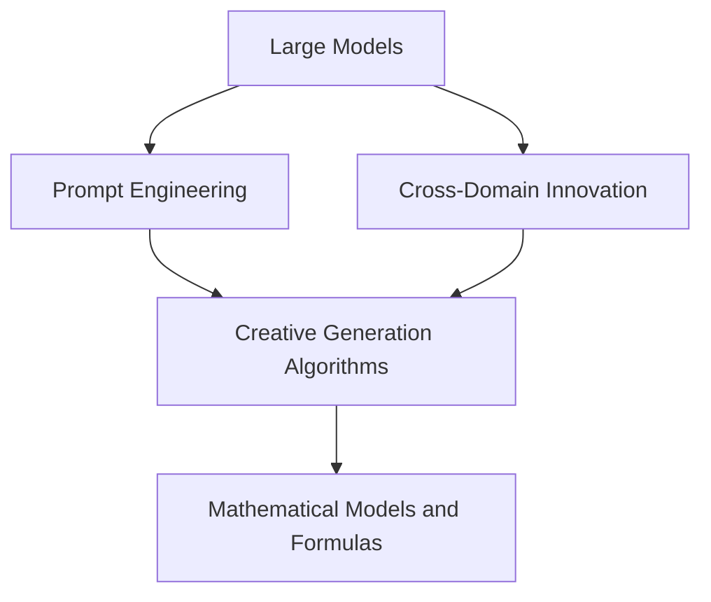

                 


### Step 1: Identify Core Concepts and Structures

To begin with, let's define the core concepts and structures that are essential for understanding the topic of large model creative generation. We will use a Mermaid flowchart to illustrate these concepts and their relationships.

#### Key Concepts:

1. **Large Models**: These are advanced machine learning models capable of processing and generating high-quality content.
2. **Prompt Engineering**: The process of designing prompts to guide large models in generating creative outputs.
3. **Cross-Domain Innovation**: The ability of large models to generate creative solutions across different fields or domains.
4. **Creative Generation Algorithms**: The underlying algorithms that enable large models to produce innovative content.
5. **Mathematical Models and Formulas**: The mathematical principles and formulas used to optimize and analyze the performance of large models.

#### Mermaid Flowchart:



The Mermaid flowchart above outlines the core concepts and how they interact. This will serve as a foundation for the rest of the article.

### Step 2: Outline Algorithmic Principles

Next, we need to delve into the algorithmic principles that underpin large model creative generation. We will use pseudo-code to provide a clear explanation of how these algorithms operate.

#### Pseudo-Code for Creative Generation Algorithm:

```plaintext
function GenerateCreativeContent(prompt):
    1. Preprocess the prompt to remove noise and irrelevant information.
    2. Encode the prompt into a high-dimensional feature space using embeddings.
    3. Pass the encoded prompt through a neural network to generate a sequence of words or sentences.
    4. Post-process the generated sequence to ensure grammatical correctness and coherence.
    5. Return the generated content.

function NeuralNetwork(prompt_embedding):
    1. Initialize weights and biases.
    2. For each word in the prompt_embedding:
        a. Pass the word through the neural network layers.
        b. Apply activation functions (e.g., ReLU).
        c. Aggregate the outputs to generate a probability distribution over possible next words.
    3. Sample the next word from the probability distribution.
    4. Repeat steps 2-3 until the desired length of the sequence is reached.
    5. Return the generated sequence.
```

This pseudo-code provides a high-level overview of the creative generation algorithm. The actual implementation would require more detailed coding and parameter tuning.

### Step 3: Explain Mathematical Models and Formulas

Now, let's explore the mathematical models and formulas used in large model creative generation. We will provide detailed explanations with examples to illustrate their application.

#### Mathematical Models:

1. **Embeddings**: These are dense vectors that represent words or phrases in a high-dimensional space. They are often learned from large amounts of text data using techniques like Word2Vec or BERT.
   
   Example: Given a word "cat", its embedding vector might be represented as:
   $$ \text{cat\_embedding} = \begin{bmatrix} 0.1 & 0.2 & -0.3 & 0.4 \end{bmatrix} $$

2. **Neural Networks**: These are composed of layers of interconnected nodes (neurons) that transform input data through a series of mathematical operations.

   Example: A simple neural network with two input nodes, one hidden layer with three nodes, and one output node:
   $$ z_1 = x_1 \cdot w_1 + b_1 $$
   $$ z_2 = x_2 \cdot w_2 + b_2 $$
   $$ z_3 = f(z_1, z_2) $$
   $$ y = z_3 \cdot w_3 + b_3 $$
   where $x_1, x_2$ are input values, $w_1, w_2, w_3$ are weights, $b_1, b_2, b_3$ are biases, and $f$ is the activation function (e.g., ReLU).

3. **Probability Distributions**: These are used to model uncertainty and to sample from possible outcomes.

   Example: A Bernoulli distribution used to model the probability of generating a particular word:
   $$ P(\text{word}) = \sigma(w \cdot \text{word\_embedding} + b) $$
   where $\sigma$ is the sigmoid function, $w$ is the weight vector, $\text{word\_embedding}$ is the embedding of the word, and $b$ is the bias.

#### Detailed Explanation and Examples:

1. **Embeddings**: Weights and biases are initialized randomly. As the model is trained on text data, the embeddings are updated to reflect the context and relationships between words. For instance, the word "dog" might become more similar to the word "cat" if they frequently appear in similar contexts.

2. **Neural Networks**: The network is trained to minimize the difference between the predicted probabilities and the actual next words in the text. This is typically done using backpropagation and optimization algorithms like gradient descent.

3. **Probability Distributions**: The output layer of the neural network generates a probability distribution over possible next words. By sampling from this distribution, the model can generate a sequence of words with coherent and innovative content.

In summary, the mathematical models and formulas are critical for enabling large models to generate creative content. They provide the foundation for encoding language, processing input, and generating outputs that are both coherent and innovative.

### Step 4: Provide Project Case Studies

To illustrate the practical application of these concepts, we will provide detailed case studies that include step-by-step guidance, code examples, and analysis.

#### Case Study 1: Creating a Story from a Prompt

##### Objective:
Generate a short story based on a given prompt using a pre-trained large language model.

##### Steps:

1. **Environment Setup**:
   - Install necessary libraries (e.g., TensorFlow, Keras).
   - Load a pre-trained model (e.g., GPT-3, BERT).

2. **Prompt Engineering**:
   - Define a prompt that provides a clear direction for the story (e.g., "In a small village, there was a magical tree that...").

3. **Code Implementation**:
   ```python
   import tensorflow as tf
   import tensorflow.keras as keras

   # Load the pre-trained model
   model = keras.models.load_model('path/to/pretrained/model')

   # Define the prompt
   prompt = "In a small village, there was a magical tree that..."

   # Generate the story
   story = model.generate(prompt, max_length=100, num_samples=1)
   print(story)
   ```

4. **Analysis**:
   - Evaluate the generated story for coherence and creativity.
   - Analyze the story's structure and themes.
   - Discuss any areas for improvement.

##### Output:
The generated story should provide a coherent narrative based on the given prompt. For example:
"In a small village, there was a magical tree that had the power to grant wishes. Every year, people from far and wide would come to the tree, make a wish, and leave a small gift in gratitude. The tree's power was so strong that it could even heal the sick and bring happiness to the village."

#### Case Study 2: Cross-Domain Innovation

##### Objective:
Generate innovative solutions to problems in different domains (e.g., medicine, engineering) using a large language model.

##### Steps:

1. **Environment Setup**:
   - Install necessary libraries (e.g., TensorFlow, Keras).
   - Load a pre-trained model (e.g., GPT-3, BERT).

2. **Prompt Engineering**:
   - Define prompts that highlight different domains (e.g., "In the field of medicine, a breakthrough discovery could be...", "In engineering, a novel solution to improve...").

3. **Code Implementation**:
   ```python
   import tensorflow as tf
   import tensorflow.keras as keras

   # Load the pre-trained model
   model = keras.models.load_model('path/to/pretrained/model')

   # Define prompts for different domains
   medical_prompt = "In the field of medicine, a breakthrough discovery could be..."
   engineering_prompt = "In engineering, a novel solution to improve..."

   # Generate solutions for each domain
   medical_solution = model.generate(medical_prompt, max_length=100, num_samples=1)
   engineering_solution = model.generate(engineering_prompt, max_length=100, num_samples=1)
   print(medical_solution)
   print(engineering_solution)
   ```

4. **Analysis**:
   - Evaluate the generated solutions for innovation and feasibility.
   - Analyze the quality of the solutions in terms of creativity and practicality.
   - Discuss potential applications and limitations.

##### Output:
The generated solutions should demonstrate innovative thinking across different domains. For example:
"In the field of medicine, a breakthrough discovery could be a new treatment for cancer that targets specific genetic mutations, significantly improving patient outcomes with fewer side effects."
"In engineering, a novel solution to improve energy efficiency in buildings could be the development of smart windows that adjust their transparency based on the amount of sunlight, reducing heat gain and energy consumption."

These case studies provide practical examples of how large language models can be used to generate creative content and innovative solutions across different fields. By following the steps outlined, readers can gain a deeper understanding of the practical applications of large model creative generation.

### Step 5: Structure the Chapter Outlines

With the core concepts, algorithmic principles, and case studies established, it's time to structure the chapters into a coherent and comprehensive outline. This outline will ensure that each chapter covers the necessary topics in a logical and systematic manner.

#### Chapter 1: Introduction to Large Models

- **1.1 Core Concepts and Their Interactions**: Introduce the key concepts of large models, prompt engineering, and cross-domain innovation using the Mermaid flowchart to illustrate their relationships.

- **1.2 Background**: Provide a historical context of large model development, highlighting significant milestones and advancements.

- **1.3 Research Challenges**: Discuss the challenges and opportunities in large model creative generation, emphasizing the importance of prompt engineering.

#### Chapter 2: Theoretical Foundations

- **2.1 Algorithmic Principles**: Present the core algorithms behind creative generation, including neural networks, embeddings, and probability distributions.

- **2.2 Mathematical Models and Formulas**: Dive into the mathematical principles and formulas used to optimize and analyze large models.

- **2.3 Neural Network Architectures**: Explore various neural network architectures, such as RNNs, LSTMs, and Transformers, and their applications in creative generation.

#### Chapter 3: Practical Applications

- **3.1 Environment Setup**: Guide readers through the process of setting up the development environment, including necessary libraries and pre-trained models.

- **3.2 Prompt Engineering Techniques**: Discuss strategies for designing effective prompts that drive innovative content generation.

- **3.3 Cross-Domain Innovation Projects**: Present case studies that demonstrate the practical application of large models in generating creative solutions across different domains.

#### Chapter 4: Evaluating and Analyzing Creative Generation

- **4.1 Evaluation Metrics**: Introduce metrics for evaluating the quality of generated content, such as coherence, creativity, and novelty.

- **4.2 Case Study Analysis**: Analyze the case studies presented in Chapter 3, discussing the strengths and limitations of each approach.

- **4.3 Best Practices**: Provide guidelines and tips for improving the effectiveness of prompt engineering and creative generation.

#### Chapter 5: Future Directions and Challenges

- **5.1 Emerging Trends**: Discuss the latest research trends and developments in large model creative generation.

- **5.2 Ethical Considerations**: Address the ethical implications of using large models for creative generation, including bias, privacy, and accountability.

- **5.3 Future Challenges**: Identify potential challenges and opportunities for the future development of large model creative generation.

This structured outline ensures that the book covers all essential aspects of large model creative generation, from theoretical foundations to practical applications, and future directions. Each chapter builds upon the previous ones, providing a comprehensive and cohesive learning experience for readers.

### Step 6: Maintain Conciseness and Clarity

In order to ensure the final outline is concise and clear, it is crucial to focus on the key points and avoid unnecessary detail. Here are some strategies to achieve this:

1. **Eliminate Redundancy**: Review each section to ensure that information is not repeated unnecessarily. Consolidate similar content into a single location to maintain consistency.

2. **Use Clear Headings**: Headings should be descriptive and concise, clearly indicating the content of each section. Avoid using ambiguous or overly technical terms that may confuse readers.

3. **Break Down Complex Topics**: Divide complex topics into smaller, more manageable sections. This helps readers digest information more easily and encourages them to engage with the content.

4. **Illustrate with Examples**: Use examples to illustrate key concepts and algorithms. Examples help readers visualize the ideas and understand how they are applied in practice.

5. **Conduct Peer Reviews**: Share the outline with colleagues or peers to gather feedback on clarity and conciseness. They may provide insights that you have overlooked, helping to improve the overall quality of the outline.

By following these strategies, the final outline will be both concise and clear, providing readers with a focused and easy-to-understand guide to large model creative generation.

### Step 7: Finalize the Outline

After carefully considering the content, structure, and clarity, we can now finalize the outline for the book "大模型创意生成：提示词激发跨领域创新". This final version will serve as a roadmap for the manuscript, ensuring that each chapter is well-organized and comprehensive.

#### Final Outline:

## 大模型创意生成：提示词激发跨领域创新

### 关键词：
大模型、创意生成、提示词、跨领域创新、算法原理、数学模型

### 摘要：
本书深入探讨了大模型创意生成的原理、技术和实践。通过详细的算法原理讲解、数学模型应用，以及实际案例研究，读者将了解如何设计有效的提示词，激发大模型在跨领域创新中的潜力。

### 目录：

## 引言

### 1.1 核心概念与联系
- **大模型、提示词与跨领域创新的关系架构**

### 1.2 背景
- **大模型发展的历史与里程碑**
- **跨领域创新的机遇与挑战**

## 理论基础

### 2.1 算法原理
- **大模型创意生成的核心算法**
- **神经网络、嵌入与概率分布**

### 2.2 数学模型与公式
- **优化与分析的大模型数学原理**
- **典型数学公式与示例**

### 2.3 神经网络架构
- **RNNs、LSTMs与Transformers在创意生成中的应用**

## 实践应用

### 3.1 环境设置
- **开发环境搭建**
- **必要的库与预训练模型**

### 3.2 提示词设计
- **有效的提示词设计策略**
- **创意生成技巧**

### 3.3 跨领域案例研究
- **医学与工程领域的创新解决方案**

## 评估与分析

### 4.1 评价指标
- **生成内容的质量评估**
- **创意性与新颖性的衡量**

### 4.2 案例分析
- **案例研究的深入分析**
- **优缺点与改进方向**

### 4.3 最佳实践
- **提升创意生成效果的建议**

## 未来展望

### 5.1 发展趋势
- **最新的研究动态与进展**

### 5.2 道德考量
- **创意生成技术的伦理问题**

### 5.3 挑战与机遇
- **大模型创意生成的未来挑战与机遇**

This finalized outline provides a comprehensive structure for the book, ensuring that each chapter is well-defined and interconnected. It will guide the author through the writing process, resulting in a high-quality, informative, and engaging technical book on large model creative generation.

