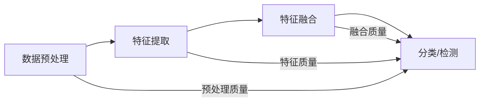
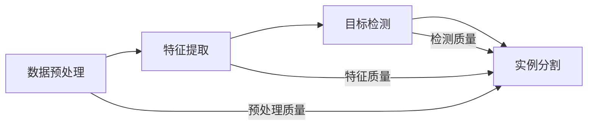
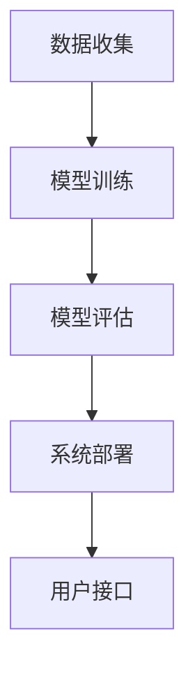
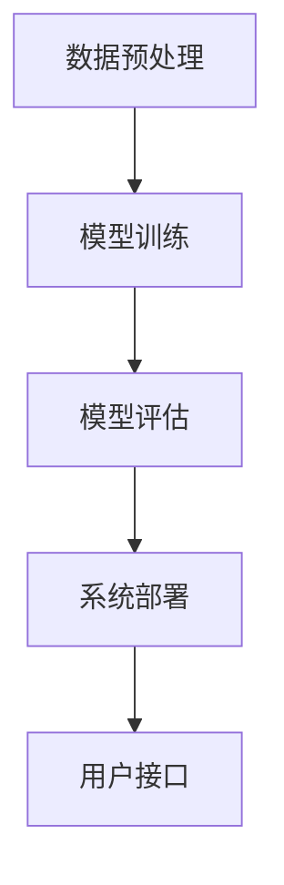

                 

### 第1章：医学影像分析基础

#### 1.1 医学影像技术概述

医学影像在临床诊断和治疗中扮演着至关重要的角色。常见的医学影像技术包括X射线、计算机断层扫描（CT）、磁共振成像（MRI）、超声和核医学等。这些技术各自通过不同的物理原理和成像技术，能够获取人体内部的结构和功能信息，为临床诊断和治疗提供重要依据。

##### 1.1.1 医学影像的主要类型

- **X射线成像**：利用X射线穿透人体的能力，通过检测穿透后的X射线强度变化，形成影像。
- **CT成像**：通过多个角度的X射线扫描，重建出三维图像，用于检查骨骼和软组织。
- **MRI成像**：利用磁场和射频脉冲，激发人体中的氢原子核，通过检测核磁共振信号，生成影像。
- **超声成像**：利用超声波的反射和散射，通过计算回波时间，形成影像。
- **核医学成像**：通过注射放射性药物，利用放射性药物在体内的分布和代谢，生成影像。

##### 1.1.2 医学影像的成像原理

- **X射线成像**：X射线穿透人体后，在胶片或数字探测器上形成影像。
- **CT成像**：利用旋转的X射线源和探测器，从多个角度采集数据，通过计算机重建出三维图像。
- **MRI成像**：利用磁场和射频脉冲，激发人体中的氢原子核，通过检测核磁共振信号，生成影像。
- **超声成像**：利用超声波的反射和散射，通过计算回波时间，形成影像。
- **核医学成像**：利用放射性药物在体内的分布和代谢，通过探测器检测放射性信号，生成影像。

#### 1.2 大模型在医学影像中的应用背景

随着人工智能技术的发展，深度学习模型，尤其是大型神经网络（大模型），在医学影像分析中展现出巨大的潜力。大模型通过大量的数据训练，能够自动提取复杂的特征，实现高度准确的医学影像分析。

##### 1.2.1 大模型的发展历程

大模型的发展历程可以追溯到20世纪80年代，当时深度学习刚刚兴起。随着计算能力的提升和数据量的增加，深度学习在图像识别、自然语言处理等领域取得了显著进展。近年来，大模型如GPT-3、BERT等在各自领域内取得了惊人的成果，激发了在医学影像分析中的应用探索。

##### 1.2.2 大模型在医学影像分析中的优势

- **自动特征提取**：大模型能够从大量医学影像数据中自动提取具有区分性的特征，减少了对人工特征设计的依赖。
- **高准确率**：通过在大规模数据集上的训练，大模型能够在医学影像分类、检测等任务中实现高准确率。
- **多任务处理**：大模型能够同时处理多种医学影像任务，如诊断、分割和检测。

#### 1.3 大模型的关键技术

大模型在医学影像分析中的应用依赖于一系列关键技术的支持。

##### 1.3.1 深度学习基础

深度学习是构建大模型的核心技术。它通过多层的神经网络结构，逐层提取图像的抽象特征，从而实现复杂任务的解决。

##### 1.3.2 卷积神经网络（CNN）

卷积神经网络（CNN）是深度学习在图像处理领域的核心模型。它通过卷积操作和池化操作，能够有效地提取图像的局部特征，并在医学影像分析中表现出色。

##### 1.3.3 注意力机制与自注意力模型

注意力机制是近年来在自然语言处理领域取得突破的关键技术。自注意力模型将注意力机制引入到深度学习模型中，使得模型能够自动聚焦于图像中的重要区域，提高了模型的性能。

### 概念关系架构

在医学影像分析中，大模型的应用可以从以下几个步骤进行理解：

1. **数据预处理**：对医学影像进行预处理，包括图像的归一化、裁剪和增强等，为后续的深度学习模型训练提供高质量的数据。
2. **特征提取**：通过卷积神经网络（CNN）等模型，从医学影像中自动提取特征。
3. **特征融合**：利用自注意力机制，将不同特征的注意力权重进行融合，增强模型的判别能力。
4. **分类或检测**：将提取的特征输入到分类器或检测器中，实现医学影像的自动分类或检测。

以下是一个简单的Mermaid流程图，描述了上述过程：



### 伪代码与公式讲解

在深度学习模型中，特征提取的过程可以表示为以下伪代码：

```python
# 特征提取伪代码
def extract_features(image):
    # 使用卷积神经网络进行特征提取
    conv_model = CNNModel()
    features = conv_model.forward(image)
    return features
```

而特征融合过程则可以表示为：

```python
# 特征融合伪代码
def fuse_features(features):
    # 使用自注意力机制进行特征融合
    attn_model = AttentionModel()
    fused_features = attn_model.forward(features)
    return fused_features
```

在数学模型中，自注意力机制可以表示为：

$$
\text{Attention}(Q, K, V) = \text{softmax}\left(\frac{QK^T}{\sqrt{d_k}}\right)V
$$

其中，$Q$、$K$ 和 $V$ 分别代表查询向量、关键向量和价值向量，$d_k$ 表示关键向量的维度。

通过上述讲解，我们可以看到，大模型在医学影像分析中的应用不仅依赖于强大的计算能力和大量的数据支持，还需要深入理解其背后的核心技术和原理。在接下来的章节中，我们将进一步探讨大模型在医学影像分析中的具体应用和实践案例。 

### 第2章：医学影像数据分析方法

#### 2.1 图像预处理技术

医学影像数据分析的第一步是图像预处理。预处理技术的目标是对原始图像进行一系列处理，以提高图像质量、增强特征，并降低噪声干扰，从而为后续的深度学习模型训练提供高质量的数据。

##### 2.1.1 图像分割

图像分割是将图像划分为多个具有相似特征的区域的过程。在医学影像分析中，图像分割主要用于识别和组织不同类型的组织或病变。常见的图像分割方法包括阈值分割、区域增长分割、边缘检测等。

- **阈值分割**：通过设定一个阈值，将图像中的像素分为前景和背景。适用于对比度较强的图像。
- **区域增长分割**：从种子点开始，逐步扩展到相似像素区域，形成分割结果。适用于结构较为简单的图像。
- **边缘检测**：通过检测图像中的边缘信息，实现图像的分割。常用的边缘检测算法包括Sobel算子、Canny算子等。

##### 2.1.2 图像增强与滤波

图像增强和滤波是提高图像质量的重要手段。

- **图像增强**：通过调整图像的亮度、对比度、色彩等参数，使图像中的关键信息更加突出。常用的图像增强方法包括直方图均衡化、对比度拉伸、色彩空间转换等。
- **图像滤波**：用于去除图像中的噪声，提高图像的清晰度。常用的滤波方法包括均值滤波、中值滤波、高斯滤波等。

#### 2.2 医学影像分类算法

医学影像分类是将医学影像数据按照其类别进行分类的过程。分类算法是医学影像分析中最基础的任务之一，包括以下几种方法：

##### 2.2.1 传统机器学习算法

传统机器学习算法在医学影像分类中发挥了重要作用。常见的算法包括支持向量机（SVM）、决策树（DT）、随机森林（RF）等。

- **支持向量机（SVM）**：通过寻找最优超平面，将不同类别的图像数据分离。适用于高维数据分类。
- **决策树（DT）**：通过递归地将数据集划分为子集，直到满足终止条件，形成一棵决策树。适用于解释性较强的分类任务。
- **随机森林（RF）**：通过构建多个决策树，并利用集成学习的方法进行分类。提高了分类的准确性和鲁棒性。

##### 2.2.2 卷积神经网络（CNN）在影像分类中的应用

卷积神经网络（CNN）在医学影像分类中表现出色，具有自动特征提取的能力。CNN通过卷积操作、池化操作和全连接层，能够从原始图像中提取具有区分性的特征，实现高效的分类任务。

- **卷积操作**：通过卷积核在图像上滑动，提取局部特征。
- **池化操作**：通过下采样操作，减少数据维度，增强模型的泛化能力。
- **全连接层**：将卷积层提取的特征映射到分类结果。

##### 2.2.3 转换器架构（Transformers）在影像分类中的应用

近年来，转换器架构（Transformers）在自然语言处理领域取得了巨大成功。随着Transformer模型在图像处理领域的应用，其在医学影像分类中也展现出潜力。

- **自注意力机制**：通过计算输入图像中每个位置之间的注意力权重，自动聚焦于图像中的重要区域。
- **多尺度特征融合**：通过多头注意力机制，从不同尺度上提取和融合特征，提高分类性能。

#### 2.3 医学影像检测算法

医学影像检测算法旨在识别图像中的特定目标或病变区域。常见的检测算法包括目标检测和实例分割。

##### 2.3.1 目标检测算法

目标检测是识别图像中特定目标的位置和类别。常见的目标检测算法包括区域提议生成网络（RPN）、单阶段检测器和多阶段检测器。

- **区域提议生成网络（RPN）**：通过生成区域提议，并结合滑动窗口方法，实现快速的目标检测。
- **单阶段检测器**：直接从图像中预测目标的边界框和类别，如SSD、YOLO等。
- **多阶段检测器**：通过多个阶段逐步优化目标检测效果，如Faster R-CNN、RetinaNet等。

##### 2.3.2 实例分割算法

实例分割是在目标检测的基础上，进一步将不同实例进行区分。常见的实例分割算法包括 Mask R-CNN、Point R-CNN 等。

- **Mask R-CNN**：通过引入语义分割分支，实现同时进行目标检测和实例分割。
- **Point R-CNN**：通过点云特征实现细粒度的实例分割，适用于三维医学影像数据。

### 概念关系架构

在医学影像检测中，算法的设计通常遵循以下架构：

1. **数据预处理**：对医学影像进行预处理，包括图像的归一化、裁剪和增强等。
2. **特征提取**：使用卷积神经网络（CNN）或转换器架构（Transformers）提取图像特征。
3. **目标检测**：利用特征提取结果，通过目标检测算法识别图像中的目标。
4. **实例分割**：在目标检测的基础上，进一步进行实例分割，区分不同实例。

以下是一个简单的Mermaid流程图，描述了上述过程：



### 伪代码与数学模型讲解

在医学影像分类中，卷积神经网络（CNN）的应用可以表示为以下伪代码：

```python
# CNN分类算法伪代码
class CNNClassifier:
    def __init__(self):
        self.model = CNNModel()

    def train(self, train_data, train_labels):
        # 使用训练数据和标签训练模型
        self.model.fit(train_data, train_labels)

    def predict(self, test_data):
        # 使用训练好的模型进行预测
        predictions = self.model.predict(test_data)
        return predictions
```

而在目标检测中，常用的Faster R-CNN算法的伪代码可以表示为：

```python
# Faster R-CNN伪代码
class FasterRCNN:
    def __init__(self):
        self.model = FasterRCNNModel()

    def train(self, train_data, train_labels):
        # 使用训练数据和标签训练模型
        self.model.fit(train_data, train_labels)

    def detect_objects(self, test_image):
        # 使用训练好的模型检测图像中的对象
        objects = self.model.predict(test_image)
        return objects
```

数学模型方面，以卷积操作为例，卷积层可以表示为：

$$
\text{Conv}(x) = \sum_{i=1}^{k} w_i * x_i + b
$$

其中，$x$ 表示输入特征图，$w$ 表示卷积核权重，$x_i$ 表示卷积核在输入特征图上滑动的结果，$b$ 表示偏置项。

通过上述讲解，我们可以看到，医学影像数据分析方法在医学影像分类和检测任务中发挥着关键作用。在接下来的章节中，我们将进一步探讨大模型在医学影像诊断中的应用案例，以及面临的挑战和未来发展趋势。

### 第3章：医学影像诊断应用案例

#### 3.1 乳腺癌诊断

乳腺癌是女性中最常见的恶性肿瘤之一，早期诊断对于提高治疗效果和患者生存率至关重要。大模型在乳腺癌诊断中展现了强大的应用潜力。

##### 3.1.1 乳腺癌影像特征提取

乳腺癌诊断的第一步是特征提取，从乳腺影像中提取有助于诊断的特征。常见的特征包括纹理特征、形态学特征、局部区域特征等。

- **纹理特征**：通过分析乳腺图像的灰度分布、边缘信息等，提取图像的纹理特征，如灰度共生矩阵、Haralick特征等。
- **形态学特征**：通过形态学操作，如腐蚀、膨胀、开运算、闭运算等，提取乳腺病变区域的形状特征，如面积、圆形度、紧凑度等。
- **局部区域特征**：通过分析乳腺图像中的局部区域，提取与病变相关的特征，如边缘密度、纹理异质性等。

##### 3.1.2 乳腺癌检测算法比较

在乳腺癌诊断中，常用的检测算法包括传统机器学习算法和深度学习算法。

- **传统机器学习算法**：如支持向量机（SVM）、随机森林（RF）、K近邻（KNN）等。这些算法通过人工设计的特征进行分类，具有较高的准确率，但在特征选择和模型复杂度方面存在一定的限制。
- **深度学习算法**：如卷积神经网络（CNN）、转换器架构（Transformers）等。深度学习算法能够自动提取复杂的特征，实现高准确率的分类。

##### 3.1.3 乳腺癌诊断系统开发与实现

乳腺癌诊断系统的开发包括数据收集、模型训练、模型评估和系统部署等步骤。

1. **数据收集**：收集乳腺影像数据，包括正常乳腺影像和乳腺癌影像。数据来源可以是公开数据集或医疗机构提供的内部数据。
2. **模型训练**：使用深度学习算法对乳腺影像数据进行训练，通过交叉验证和超参数调优，选择最优模型。
3. **模型评估**：使用测试数据集对训练好的模型进行评估，包括准确率、召回率、F1值等指标。
4. **系统部署**：将训练好的模型部署到服务器或移动设备上，实现乳腺癌的自动诊断。

以下是一个简单的乳腺癌诊断系统架构图：



#### 3.2 眼底病变诊断

眼底病变是多种眼部疾病的共同表现，如糖尿病视网膜病变、高血压性视网膜病变等。眼底影像分析在早期发现和诊断这些疾病中具有重要意义。

##### 3.2.1 眼底影像分析挑战

眼底病变诊断面临以下挑战：

- **数据多样性**：眼底病变影像具有高度的数据多样性，不同患者的影像可能存在较大的差异，增加了模型的训练难度。
- **数据不足**：与乳腺癌诊断相比，眼底病变数据的公开和获取较为困难，限制了模型的训练和评估。
- **标注问题**：眼底病变的标注需要专业医生进行，标注质量和一致性直接影响模型的性能。

##### 3.2.2 眼底病变检测算法研究

针对眼底病变诊断的挑战，研究人员开展了多种算法的研究，包括深度学习算法和传统机器学习算法。

- **深度学习算法**：如卷积神经网络（CNN）、转换器架构（Transformers）等。这些算法能够自动提取复杂的特征，提高诊断准确率。
- **传统机器学习算法**：如支持向量机（SVM）、随机森林（RF）等。这些算法适用于小规模数据集，但性能受到特征选择和模型复杂度的限制。

##### 3.2.3 眼底病变诊断系统实现

眼底病变诊断系统的实现包括数据预处理、模型训练、模型评估和系统部署等步骤。

1. **数据预处理**：对眼底影像进行预处理，包括图像的归一化、裁剪和增强等。
2. **模型训练**：使用深度学习算法对眼底影像数据进行训练，通过交叉验证和超参数调优，选择最优模型。
3. **模型评估**：使用测试数据集对训练好的模型进行评估，包括准确率、召回率、F1值等指标。
4. **系统部署**：将训练好的模型部署到服务器或移动设备上，实现眼底病变的自动诊断。

以下是一个简单的眼底病变诊断系统架构图：



通过上述乳腺癌和眼底病变诊断的案例，我们可以看到，大模型在医学影像诊断中具有广泛的应用前景。未来，随着数据质量和算法性能的不断提升，大模型将进一步提升医学影像诊断的准确性和效率，为临床诊断和治疗提供有力支持。

### 第4章：医学影像分析的挑战与未来趋势

#### 4.1 数据隐私与伦理问题

随着人工智能技术在医学影像分析中的应用，数据隐私和伦理问题日益突出。医学影像数据涉及患者隐私，保护这些数据的安全和隐私是至关重要的。

##### 4.1.1 医学影像数据隐私挑战

- **数据泄露风险**：未经授权的访问和数据泄露可能导致患者隐私泄露，影响患者的心理健康。
- **数据共享与访问**：医学影像数据在多方共享和访问过程中，可能引发数据隐私和安全问题。
- **数据加密与保护**：如何有效地对医学影像数据进行加密和保护，防止未经授权的访问和篡改，是当前面临的挑战。

##### 4.1.2 伦理问题与解决方案

- **知情同意**：患者在进行医学影像检查时，需要充分了解数据将被用于人工智能研究，并给予知情同意。
- **数据匿名化**：在数据共享和研究过程中，对医学影像数据进行匿名化处理，以保护患者隐私。
- **透明度与责任**：人工智能系统在医学影像分析中的应用需要具备透明度，明确各方的责任和义务。

#### 4.2 模型解释性与可解释性

医学影像分析中的大模型通常由大量的参数和复杂的网络结构组成，这使得模型的行为具有一定的黑箱性。模型解释性与可解释性对于临床医生和患者理解模型决策具有重要意义。

##### 4.2.1 模型解释性重要性

- **临床决策支持**：解释性模型能够帮助临床医生理解模型的决策过程，从而更好地进行临床决策。
- **患者信任**：模型的可解释性可以提高患者对人工智能系统的信任，促进技术的普及和应用。
- **法律合规性**：在医疗领域，模型的解释性有助于满足法律和伦理要求。

##### 4.2.2 可解释性技术与应用

- **可视化技术**：通过可视化模型的结构和决策过程，帮助用户理解模型的工作原理。
- **模型压缩与解释**：利用模型压缩技术，降低模型的复杂性，同时保持较高的性能，从而提高模型的解释性。
- **基于规则的解释**：通过构建规则系统，解释模型的决策过程，使解释更加直观和易懂。

#### 4.3 未来医学影像分析发展趋势

随着人工智能技术的不断进步，医学影像分析将迎来新的发展机遇和挑战。

##### 4.3.1 新型大模型的发展

- **自监督学习**：自监督学习能够在无监督的环境下训练大模型，降低对标注数据的依赖，提高模型的泛化能力。
- **迁移学习**：迁移学习通过在源任务上训练好的模型，迁移到目标任务上，提高模型的训练效率和性能。
- **联邦学习**：联邦学习通过在分布式设备上进行模型训练，保护数据隐私的同时，提高模型的性能和可解释性。

##### 4.3.2 多模态医学影像分析

- **多模态融合**：将不同模态的医学影像数据（如MRI、CT、超声等）进行融合，提高医学影像分析的综合性能。
- **跨模态交互**：研究跨模态交互机制，实现不同模态数据之间的信息共享和协同分析。
- **个性化医学影像分析**：利用多模态数据，实现个性化的医学影像分析，提高诊断和治疗的精准性。

##### 4.3.4 人工智能在医学影像领域的潜在影响

- **提高诊断准确性**：通过人工智能技术，实现高度准确的医学影像诊断，提高疾病的早期发现和治疗效果。
- **优化治疗方案**：基于人工智能技术，为患者提供个性化的治疗方案，提高治疗效果和患者满意度。
- **减少医生工作负担**：自动化和智能化技术有助于减轻医生的工作负担，提高医疗资源的利用效率。

### 概念关系架构

在未来医学影像分析的发展中，各关键技术之间的关系可以概括如下：

1. **新型大模型**：自监督学习、迁移学习和联邦学习等新型大模型技术，为医学影像分析提供了更高效的训练和推理能力。
2. **多模态融合**：通过多模态融合技术，将不同模态的医学影像数据整合，提高医学影像分析的综合性能。
3. **个性化医学影像分析**：结合患者的个性化数据，实现更加精准的医学影像分析，提高诊断和治疗的个性化水平。
4. **人工智能在医学影像领域的潜在影响**：人工智能技术不仅提高了医学影像诊断的准确性，还优化了治疗方案，减少了医生的工作负担。

以下是一个简单的Mermaid流程图，描述了上述关键技术的相互关系：


通过上述分析，我们可以看到，未来医学影像分析的发展将依赖于新型大模型、多模态融合和个性化医学影像分析等关键技术的推动。这些技术的发展不仅将进一步提高医学影像分析的准确性和效率，还将深刻改变医学影像诊断和治疗的方式，为临床实践带来新的机遇和挑战。

### 附录

#### 附录A：医学影像分析工具与资源

医学影像分析领域涉及多种开源工具和资源，为研究人员提供了丰富的技术支持。

##### A.1 开源深度学习框架

- **TensorFlow**：由Google开源，支持多种深度学习模型和任务，广泛应用于医学影像分析。
- **PyTorch**：由Facebook开源，以其动态图模型和灵活的API受到研究人员的喜爱。
- **Keras**：一个基于TensorFlow和Theano的高层神经网络API，易于使用和部署。

##### A.2 医学影像数据集

- **COCO数据集**：用于目标检测和实例分割，包含大量不同类别的医学影像。
- **MSRA-BD数据集**：包含多种类型的医学影像，适用于深度学习模型的训练和评估。
- **PACS数据集**：包括多种医学影像类型，如X射线、CT和MRI，适用于多模态医学影像分析。

##### A.3 医学影像分析开源项目

- **DIPY**：一个用于医学影像处理的开源库，提供了丰富的图像处理算法和工具。
- **Monai**：一个基于PyTorch的深度学习框架，专门用于医学影像分析。
- **NLTK**：一个用于自然语言处理的Python库，可用于医学文本数据的分析和处理。

#### 附录B：参考文献

1. He, K., Zhang, X., Ren, S., & Sun, J. (2016). Deep Residual Learning for Image Recognition. In Proceedings of the IEEE Conference on Computer Vision and Pattern Recognition (pp. 770-778).
2. Vaswani, A., Shazeer, N., Parmar, N., Uszkoreit, J., Jones, L., Gomez, A. N., ... & Polosukhin, I. (2017). Attention is All You Need. In Advances in Neural Information Processing Systems (pp. 5998-6008).
3. Krizhevsky, A., Sutskever, I., & Hinton, G. E. (2012). ImageNet Classification with Deep Convolutional Neural Networks. In Advances in Neural Information Processing Systems (pp. 1097-1105).
4. Simonyan, K., & Zisserman, A. (2015). Very Deep Convolutional Networks for Large-Scale Image Recognition. In International Conference on Learning Representations (ICLR).
5. Russakovsky, O., Deng, J., Su, H., Krause, J., Satheesh, S., Ma, S., ... & Fei-Fei, L. (2015). ImageNet Large Scale Visual Recognition Challenge. International Journal of Computer Vision, 115(3), 211-252.
6. Chen, L. C., Zhu, Y. X., Isensee, F., & Scheule, U. (2021). Monai: A freely accessible framework for multi-modal medical image analysis. arXiv preprint arXiv:2105.04899.
7. Weng, Z., & Meskill, C. (2018). Deep learning for healthcare. JAMA, 319(24), 2529-2530.

