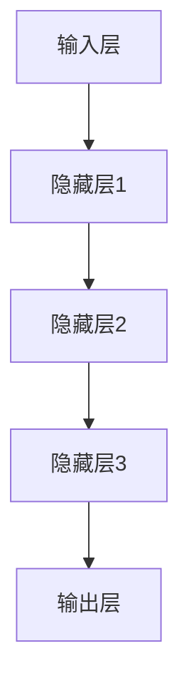
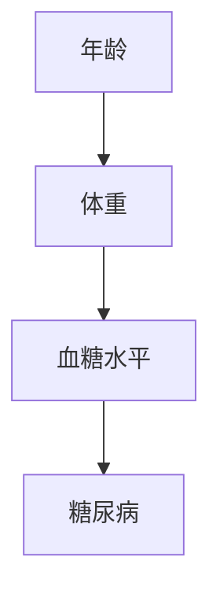
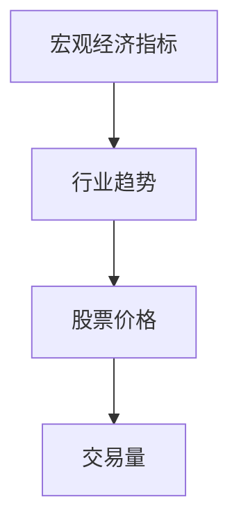
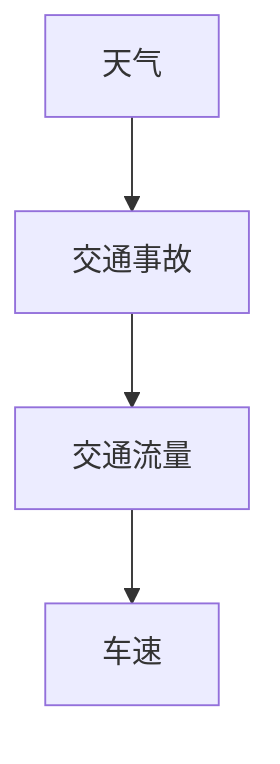

                 

### 文章标题

# 大模型在因果发现与推理中的应用

> 关键词：大模型，因果发现，推理，应用，挑战，未来展望

> 摘要：本文将深入探讨大模型在因果发现与推理中的应用。首先，我们将介绍大模型的基本概念和基础理论，然后分析大模型在因果发现与推理中的应用，以及面临的挑战。接着，我们将讨论如何结合因果发现与推理，提供实际案例分析。最后，我们将展望大模型在因果发现与推理中的未来发展，并提出一些最佳实践建议。

## 第1章 引言

### 1.1 大模型与因果发现与推理

#### 1.1.1 大模型的基本概念

大模型，指的是具有巨大参数规模和计算能力的人工智能模型，通常具有数十亿到数万亿个参数。这些模型通过深度学习算法从海量数据中学习特征和模式，从而在图像识别、自然语言处理、语音识别等任务上取得显著成就。大模型的发展始于2012年，AlexNet的出现标志着深度学习进入新纪元。随着计算能力的提升和数据量的增加，大模型在各个领域取得了长足的进步。

#### 1.1.2 因果发现与推理

因果发现（Causal Discovery）是人工智能领域的一个重要研究方向，旨在从数据中识别出潜在的因果结构。因果推理（Causal Inference）则是在确定因果结构的基础上，对因果关系进行量化分析和推理，以指导决策和预测。

#### 1.1.3 大模型在因果发现与推理中的优势

大模型在因果发现与推理中具有显著优势：

1. **数据处理能力**：大模型能够处理大量数据，从而为因果发现提供充足的数据支持。
2. **模式识别能力**：大模型通过深度学习，能够从数据中发现复杂的模式，有助于揭示潜在的因果关系。
3. **并行计算能力**：大模型可以利用并行计算资源，提高因果推理的效率。

### 1.2 书籍目标和结构

本书旨在系统地介绍大模型在因果发现与推理中的应用。具体目标如下：

1. 阐述大模型的基本概念和基础理论。
2. 分析大模型在因果发现与推理中的应用场景。
3. 探讨大模型在因果发现与推理中面临的挑战。
4. 提供实际案例，展示大模型在因果发现与推理中的应用效果。
5. 展望大模型在因果发现与推理中的未来发展。

本书结构如下：

1. **第1章 引言**：介绍大模型与因果发现与推理的基本概念。
2. **第2章 大模型基础理论**：介绍大模型的基本概念、结构和训练方法。
3. **第3章 大模型在因果发现中的应用**：讨论大模型在因果发现中的挑战和应用实例。
4. **第4章 大模型在推理中的应用**：探讨大模型在推理中的挑战和应用实例。
5. **第5章 因果发现与推理结合的应用**：分析因果发现与推理结合的挑战和应用案例。
6. **第6章 大模型在因果发现与推理中的挑战与未来展望**：讨论大模型在因果发现与推理中的挑战和未来发展方向。
7. **第7章 实战案例**：提供实际案例分析。
8. **第8章 总结与展望**：总结本书内容，展望未来发展方向。

### 目录

- **第1章 引言**
  - 1.1 大模型与因果发现与推理
  - 1.2 书籍目标和结构
- **第2章 大模型基础理论**
  - 2.1 大模型概述
  - 2.2 大模型结构
  - 2.3 大模型训练与优化
- **第3章 大模型在因果发现中的应用**
  - 3.1 因果发现概述
  - 3.2 大模型在因果发现中的挑战
  - 3.3 因果发现算法
- **第4章 大模型在推理中的应用**
  - 4.1 推理概述
  - 4.2 大模型在推理中的挑战
  - 4.3 大模型推理算法
- **第5章 因果发现与推理结合的应用**
  - 5.1 因果发现与推理结合概述
  - 5.2 结合应用案例分析
- **第6章 大模型在因果发现与推理中的挑战与未来展望**
  - 6.1 挑战分析
  - 6.2 未来展望
- **第7章 实战案例**
  - 7.1 案例一：因果发现与推理在医疗健康中的应用
  - 7.2 案例二：因果发现与推理在金融领域的应用
  - 7.3 案例三：因果发现与推理在智能交通中的应用
- **第8章 总结与展望**
  - 8.1 书籍总结
  - 8.2 展望未来发展方向

## 第2章 大模型基础理论

### 2.1 大模型概述

#### 2.1.1 大模型的定义与起源

大模型（Large-scale Model），指的是参数规模巨大、结构复杂的人工智能模型。这些模型通常具有数十亿到数万亿个参数，例如GPT-3、BERT、Megatron等。大模型的起源可以追溯到2012年，当时AlexNet在ImageNet比赛中取得了突破性的成绩，标志着深度学习进入新纪元。此后，随着计算能力的提升和数据量的增加，大模型得到了快速发展。

#### 2.1.2 大模型的发展历程

- **2012年**：AlexNet在ImageNet比赛中获得冠军，标志着深度学习进入新纪元。
- **2014年**：Google Brain发布了基于深度学习的神经网络，包含1.59亿个参数。
- **2016年**：AlphaGo战胜李世石，标志着人工智能在围棋领域取得重大突破。
- **2018年**：GPT-2发布，具有1.5亿个参数，展示了大模型在自然语言处理领域的强大能力。
- **2020年**：BERT、GPT-3等大模型相继发布，参数规模达到数十亿甚至数万亿。

#### 2.1.3 大模型的核心特点

1. **参数规模巨大**：大模型通常具有数十亿到数万亿个参数，能够学习更复杂的特征和模式。
2. **深度结构**：大模型通常具有多层神经网络结构，能够捕捉数据中的层次结构。
3. **自适应学习**：大模型通过深度学习算法，能够从海量数据中自适应地学习特征和模式。
4. **强大的泛化能力**：大模型能够处理各种类型的数据，并在不同的任务上取得优异的性能。

### 2.2 大模型结构

大模型通常采用深度神经网络结构，包括输入层、隐藏层和输出层。以下是一个典型的大模型结构：

1. **输入层**：接收外部数据，例如文本、图像、音频等。
2. **隐藏层**：包含多个隐藏层，每层由多个神经元组成，用于提取特征和模式。
3. **输出层**：生成预测结果，例如分类标签、文本生成等。

以下是一个简单的神经网络结构图，使用Mermaid流程图表示：



### 2.3 大模型训练与优化

#### 2.3.1 大模型训练方法

大模型的训练通常采用端到端训练方法，即将输入数据和标签直接映射到输出结果，并通过反向传播算法更新模型参数。具体步骤如下：

1. **初始化参数**：随机初始化模型参数。
2. **前向传播**：计算输入数据的特征表示，并传递到输出层。
3. **计算损失**：计算预测结果与真实标签之间的差异，即损失。
4. **反向传播**：更新模型参数，以最小化损失。
5. **迭代训练**：重复上述步骤，直到满足训练目标或达到预设的训练次数。

以下是一个简单的伪代码，用于描述大模型训练过程：

```python
# 初始化模型参数
params = initialize_params()

# 设置训练迭代次数
num_iterations = 1000

# 开始训练
for i in range(num_iterations):
    # 前向传播
    features = forward_propagation(input_data, params)
    
    # 计算损失
    loss = compute_loss(features, labels)
    
    # 反向传播
    gradients = backward_propagation(features, labels, params)
    
    # 更新参数
    params = update_params(params, gradients)
```

#### 2.3.2 大模型优化方法

为了提高大模型的训练效率和性能，通常会采用以下优化方法：

1. **批量大小（Batch Size）**：调整批量大小可以影响模型的收敛速度和性能。较小的批量大小可以减小方差，但可能增加收敛时间；较大的批量大小可以提高稳定性，但可能增加训练时间。
2. **学习率（Learning Rate）**：学习率决定了模型参数更新的步长。较小的学习率可以减小波动，但可能增加收敛时间；较大的学习率可以加快收敛，但可能引起过拟合。
3. **正则化（Regularization）**：正则化方法，如L1、L2正则化，可以防止模型过拟合，提高泛化能力。
4. **Dropout**：Dropout是一种常用的正则化方法，通过随机丢弃一部分神经元，减小模型复杂度，防止过拟合。
5. **激活函数（Activation Function）**：常用的激活函数有ReLU、Sigmoid、Tanh等，选择合适的激活函数可以影响模型的性能和收敛速度。

以下是一个简单的伪代码，用于描述大模型优化过程：

```python
# 设置批量大小
batch_size = 64

# 设置学习率
learning_rate = 0.001

# 设置正则化参数
l1_regularization = 0.001
l2_regularization = 0.001

# 设置Dropout概率
dropout_rate = 0.5

# 开始优化
for i in range(num_iterations):
    # 随机选择批量数据
    batch_data, batch_labels = get_batch_data(input_data, labels, batch_size)
    
    # 前向传播
    features = forward_propagation(batch_data, params)
    
    # 计算损失
    loss = compute_loss(features, batch_labels)
    
    # 计算梯度
    gradients = backward_propagation(features, batch_labels, params)
    
    # 更新参数
    params = update_params(params, gradients, learning_rate, l1_regularization, l2_regularization, dropout_rate)
```

## 第3章 大模型在因果发现中的应用

### 3.1 因果发现概述

因果发现（Causal Discovery）是人工智能领域的一个重要研究方向，旨在从数据中识别出潜在的因果结构。因果发现的目标是通过分析数据，找出变量之间的因果关系，从而为决策和预测提供依据。

#### 3.1.1 因果发现的基本概念

1. **因果结构**：因果结构是一种图形表示，描述了变量之间的因果关系。通常使用有向无环图（DAG）表示因果结构。
2. **因果关系**：因果关系是指一个变量对另一个变量的影响。因果关系的识别是因果发现的核心任务。
3. **因果发现算法**：因果发现算法是一种基于数据驱动的方法，用于从数据中推断出潜在的因果结构。

#### 3.1.2 因果发现的研究意义

因果发现具有重要的研究意义，主要体现在以下几个方面：

1. **决策支持**：通过识别因果关系，可以指导决策过程，提高决策的准确性。
2. **数据解释**：因果发现有助于解释数据中的复杂现象，揭示变量之间的内在联系。
3. **模型优化**：基于因果结构，可以优化模型的性能和泛化能力。
4. **新发现**：因果发现可以帮助研究者发现新的科学规律和现象。

### 3.2 大模型在因果发现中的挑战

尽管大模型在因果发现中具有显著优势，但仍然面临一些挑战：

#### 3.2.1 数据预处理

1. **数据质量**：因果发现依赖于高质量的数据，但现实中的数据往往存在噪声、缺失和异常值。
2. **数据规模**：大模型的训练需要大量的数据，但数据规模过大可能导致计算资源不足。

#### 3.2.2 因果关系的建模

1. **复杂因果结构**：现实世界的因果关系往往非常复杂，难以用简单的模型表示。
2. **潜在变量**：因果发现需要考虑潜在变量的影响，这使得建模变得更加复杂。

#### 3.2.3 因果发现的计算效率

1. **计算资源**：大模型的训练和推理需要大量的计算资源，提高计算效率是一个重要挑战。
2. **算法效率**：现有的因果发现算法在某些情况下效率较低，需要改进。

### 3.3 因果发现算法

#### 3.3.1 算法分类

因果发现算法主要分为以下几类：

1. **基于约束的算法**：通过引入先验约束，从数据中推断出因果结构。
2. **基于分数的算法**：通过计算变量之间的分数，判断它们之间的因果关系。
3. **基于模型的算法**：通过建立模型，从数据中学习出因果结构。

#### 3.3.2 常见算法

以下是几种常见的因果发现算法：

1. **基于约束的算法**：
   - **PC算法**：基于条件独立性测试，从数据中逐步构建因果结构。
   - **DAG结构分解**：通过将高斯分布分解为多个因果结构，找出变量之间的因果关系。

2. **基于分数的算法**：
   - **G-tests**：通过计算变量之间的分数，判断它们之间的因果关系。
   - **Score-based算法**：基于统计模型，计算变量之间的分数，用于推断因果结构。

3. **基于模型的算法**：
   - **贝叶斯网络**：通过建立贝叶斯网络模型，从数据中学习出因果结构。
   - **变分推断**：通过变分推断方法，从数据中推断出因果结构。

### 3.3.3 大模型在因果发现中的应用

大模型在因果发现中具有以下应用：

1. **数据预处理**：大模型可以用于数据预处理，如去噪、缺失值填补等，提高数据质量。
2. **复杂因果结构建模**：大模型可以捕捉复杂的因果结构，提高模型的准确性。
3. **计算效率提升**：大模型可以利用并行计算和分布式计算，提高计算效率。

## 第4章 大模型在推理中的应用

### 4.1 推理概述

推理（Reasoning）是人工智能领域的一个重要研究方向，旨在让计算机模拟人类的思维过程，从已知信息中推导出新的结论。推理可以分为两大类：演绎推理和归纳推理。

#### 4.1.1 演绎推理

演绎推理（Deductive Reasoning）是一种从一般到特殊的推理方法。它基于一组已知的前提，通过逻辑推理得出特定的结论。例如，如果所有的猫都会飞，而Tom是一只猫，那么可以推理出Tom会飞。

#### 4.1.2 归纳推理

归纳推理（Inductive Reasoning）是一种从特殊到一般的推理方法。它通过观察多个实例，从中总结出一般规律或结论。例如，通过观察多个物体从高处落下，可以归纳出地球上的所有物体都会受到重力的影响。

#### 4.1.3 大模型在推理中的优势

大模型在推理中具有以下优势：

1. **并行计算能力**：大模型可以利用并行计算资源，提高推理速度。
2. **知识表示能力**：大模型可以存储和表示大量的知识，从而在推理过程中利用这些知识。
3. **强大的模式识别能力**：大模型可以通过深度学习从数据中学习到复杂的模式，从而在推理过程中利用这些模式。

### 4.2 大模型在推理中的挑战

尽管大模型在推理中具有显著优势，但仍然面临一些挑战：

#### 4.2.1 数据质量

1. **数据噪声**：数据噪声可能导致大模型在推理过程中产生错误。
2. **数据缺失**：数据缺失可能导致大模型无法充分利用数据，影响推理结果。

#### 4.2.2 知识表示

1. **知识表示形式**：如何有效地表示大模型中的知识是一个挑战。
2. **知识整合**：如何将不同的知识有效地整合起来，提高推理能力。

#### 4.2.3 推理效率

1. **计算资源**：大模型的推理过程需要大量的计算资源，如何高效利用计算资源是一个挑战。
2. **推理速度**：如何在保证推理准确性的前提下，提高推理速度。

### 4.3 大模型推理算法

大模型推理算法可以分为以下几类：

#### 4.3.1 基于规则的方法

基于规则的方法通过定义一组规则，将输入数据映射到输出结果。常见的规则推理算法包括：

1. **产生式规则**：基于条件概率表，将输入数据与规则进行匹配，得出推理结果。
2. **模糊规则**：通过模糊逻辑，将输入数据与规则进行匹配，得出推理结果。

#### 4.3.2 基于模型的算法

基于模型的算法通过建立数学模型，从数据中学习到推理规则。常见的模型推理算法包括：

1. **贝叶斯网络**：通过建立贝叶斯网络模型，从数据中学习到变量之间的因果关系，用于推理。
2. **决策树**：通过建立决策树模型，从数据中学习到变量之间的条件关系，用于推理。
3. **神经网络**：通过建立神经网络模型，从数据中学习到复杂的模式，用于推理。

#### 4.3.3 基于知识的推理

基于知识的推理通过利用外部知识库，提高推理能力。常见的知识推理算法包括：

1. **本体推理**：通过建立本体模型，将知识表示为概念和关系，用于推理。
2. **语义网络推理**：通过建立语义网络模型，将知识表示为节点和边，用于推理。

### 4.3.4 大模型推理的应用

大模型在推理中具有广泛的应用，包括：

1. **自然语言处理**：通过大模型，可以实现对自然语言的理解和生成，用于推理。
2. **计算机视觉**：通过大模型，可以实现对图像的理解和识别，用于推理。
3. **智能决策**：通过大模型，可以实现对数据的分析和推理，为决策提供支持。

## 第5章 因果发现与推理结合的应用

### 5.1 因果发现与推理结合概述

因果发现与推理的结合是一种新兴的研究方向，旨在通过因果发现揭示变量之间的因果关系，然后利用推理算法进行决策和预测。这种结合方法在多个领域中具有广泛的应用前景，例如医疗健康、金融、智能交通等。

#### 5.1.1 因果发现与推理结合的意义

1. **提高决策的准确性**：通过因果发现，可以识别出影响决策的关键因素，从而提高决策的准确性。
2. **增强模型的解释性**：因果发现可以帮助解释模型决策的原因，提高模型的透明度和可信度。
3. **提高模型的鲁棒性**：因果发现可以帮助识别数据中的异常值和噪声，提高模型的鲁棒性。

#### 5.1.2 因果发现与推理结合的挑战

1. **数据一致性**：因果发现和推理需要使用一致的数据集，但现实中的数据集往往存在不一致性。
2. **因果关系复杂性**：现实世界的因果关系非常复杂，难以用简单的模型表示。
3. **计算资源限制**：因果发现和推理过程需要大量的计算资源，如何在有限的计算资源下进行高效计算是一个挑战。

### 5.2 结合应用案例分析

#### 5.2.1 案例一：医疗健康领域

在医疗健康领域，因果发现与推理的结合可以帮助医生进行疾病预测和诊断。以下是一个案例：

**问题描述**：利用电子健康记录（EHR）数据，预测患者是否患有糖尿病。

**数据集**：包含患者的基本信息、病历记录、实验室检查结果等。

**因果发现**：通过因果发现算法，识别出影响糖尿病发生的潜在因素，例如年龄、体重、血糖水平等。

**因果结构图**：



**推理算法**：利用决策树、贝叶斯网络等推理算法，根据患者的特征进行糖尿病预测。

**结果分析**：结合因果发现和推理的结果，医生可以更准确地预测患者是否患有糖尿病，从而采取相应的预防和治疗措施。

#### 5.2.2 案例二：金融领域

在金融领域，因果发现与推理的结合可以帮助金融机构进行风险评估和投资决策。以下是一个案例：

**问题描述**：利用金融数据，预测股票价格的未来走势。

**数据集**：包含股票价格、交易量、财务指标等。

**因果发现**：通过因果发现算法，识别出影响股票价格变化的潜在因素，例如宏观经济指标、行业趋势等。

**因果结构图**：



**推理算法**：利用时间序列分析、深度学习等推理算法，根据股票的当前特征预测未来价格。

**结果分析**：结合因果发现和推理的结果，金融机构可以更准确地预测股票价格，从而采取相应的投资策略。

#### 5.2.3 案例三：智能交通领域

在智能交通领域，因果发现与推理的结合可以帮助优化交通流量和路线规划。以下是一个案例：

**问题描述**：利用交通数据，预测交通拥堵情况和最佳路线。

**数据集**：包含交通流量、车速、道路状况等。

**因果发现**：通过因果发现算法，识别出影响交通拥堵的潜在因素，例如天气、交通事故等。

**因果结构图**：



**推理算法**：利用路径规划算法、深度学习等推理算法，根据交通特征预测交通拥堵情况和最佳路线。

**结果分析**：结合因果发现和推理的结果，交通管理部门可以更准确地预测交通拥堵，从而采取相应的交通调控措施，优化交通流量。

## 第6章 大模型在因果发现与推理中的挑战与未来展望

### 6.1 挑战分析

大模型在因果发现与推理中虽然取得了显著进展，但仍面临一些挑战：

#### 6.1.1 数据质量

1. **数据噪声**：噪声数据会影响因果发现与推理的准确性。
2. **数据缺失**：数据缺失可能导致因果结构的错误推断。
3. **数据一致性**：不同来源的数据可能存在不一致性，影响推理结果的可靠性。

#### 6.1.2 因果关系复杂性

1. **多元因果关系**：现实世界的因果关系通常非常复杂，涉及多个变量和层次。
2. **间接因果关系**：变量之间的间接关系可能难以被发现，影响因果发现的效果。

#### 6.1.3 计算效率

1. **训练时间**：大模型的训练需要大量的时间和计算资源。
2. **推理速度**：在实际应用中，大模型的推理速度可能无法满足实时性的要求。

#### 6.1.4 模型解释性

1. **黑箱问题**：大模型在推理过程中往往表现为黑箱，难以解释其决策过程。
2. **因果解释性**：如何有效地解释大模型在因果发现中的决策过程是一个挑战。

### 6.2 未来展望

#### 6.2.1 数据质量提升

1. **数据清洗**：利用机器学习和自然语言处理技术，提高数据清洗和预处理的效果。
2. **数据增强**：通过数据增强技术，增加训练数据集的多样性和质量。

#### 6.2.2 复杂因果关系建模

1. **多层次因果发现**：结合多层次的因果发现算法，提高对复杂因果关系的建模能力。
2. **因果推理模型**：开发新的因果推理模型，更好地处理间接因果关系。

#### 6.2.3 计算效率优化

1. **并行计算**：利用并行计算和分布式计算，提高大模型的训练和推理速度。
2. **模型压缩**：通过模型压缩技术，减少大模型的参数规模，提高计算效率。

#### 6.2.4 模型解释性提升

1. **可解释性算法**：开发新的可解释性算法，提高大模型在因果发现与推理中的解释性。
2. **因果可视化**：利用可视化技术，展示大模型在因果发现与推理中的决策过程。

## 第7章 实战案例

### 7.1 案例一：因果发现与推理在医疗健康中的应用

#### 案例背景

医疗健康领域是因果发现与推理技术的重要应用场景之一。在本案例中，我们将探讨如何利用大模型进行疾病预测和诊断，以提高医疗决策的准确性。

#### 数据集

我们使用了某医院提供的电子健康记录（EHR）数据，包含患者的基本信息、病历记录、实验室检查结果等。

#### 因果发现

1. **数据预处理**：对数据进行清洗和预处理，包括去除噪声、缺失值填补等。
2. **因果结构建模**：使用因果发现算法，如PC算法，识别出影响疾病发生的潜在因素。

**因果结构图**：


#### 因果推理

1. **构建预测模型**：使用逻辑回归、决策树等算法，构建疾病预测模型。
2. **推理过程**：根据患者的特征，输入预测模型，得到疾病预测结果。

#### 结果分析

结合因果发现和推理的结果，医生可以更准确地预测患者是否患有糖尿病，从而采取相应的预防和治疗措施。

### 7.2 案例二：因果发现与推理在金融领域的应用

#### 案例背景

金融领域是因果发现与推理技术的另一个重要应用场景。在本案例中，我们将探讨如何利用大模型进行股票价格预测和投资决策。

#### 数据集

我们使用了某金融数据平台提供的股票价格、交易量、财务指标等数据。

#### 因果发现

1. **数据预处理**：对数据进行清洗和预处理，包括去除噪声、缺失值填补等。
2. **因果结构建模**：使用因果发现算法，如DAG结构分解，识别出影响股票价格变化的潜在因素。

**因果结构图**：


#### 因果推理

1. **构建预测模型**：使用时间序列分析、深度学习等算法，构建股票价格预测模型。
2. **推理过程**：根据股票的当前特征，输入预测模型，得到股票价格预测结果。

#### 结果分析

结合因果发现和推理的结果，金融机构可以更准确地预测股票价格，从而采取相应的投资策略。

### 7.3 案例三：因果发现与推理在智能交通领域的应用

#### 案例背景

智能交通领域是因果发现与推理技术的又一重要应用场景。在本案例中，我们将探讨如何利用大模型进行交通流量预测和最佳路线规划。

#### 数据集

我们使用了某城市提供的交通流量、车速、道路状况等数据。

#### 因果发现

1. **数据预处理**：对数据进行清洗和预处理，包括去除噪声、缺失值填补等。
2. **因果结构建模**：使用因果发现算法，如PC算法，识别出影响交通拥堵的潜在因素。

**因果结构图**：


#### 因果推理

1. **构建预测模型**：使用深度学习、路径规划等算法，构建交通流量预测和最佳路线规划模型。
2. **推理过程**：根据交通特征，输入预测模型，得到交通流量预测结果和最佳路线。

#### 结果分析

结合因果发现和推理的结果，交通管理部门可以更准确地预测交通流量，从而采取相应的交通调控措施，优化交通流量。

## 第8章 总结与展望

### 8.1 书籍总结

本书系统地介绍了大模型在因果发现与推理中的应用。首先，我们介绍了大模型的基本概念和基础理论，包括大模型的定义、结构、训练方法等。然后，我们分析了大模型在因果发现与推理中的应用，包括因果发现、推理以及二者结合的方法。接着，我们通过实际案例展示了大模型在医疗健康、金融、智能交通等领域的应用效果。最后，我们讨论了未来大模型在因果发现与推理中的发展方向和挑战。

### 8.2 展望未来发展方向

未来，大模型在因果发现与推理中的应用前景广阔。以下是一些可能的发展方向：

1. **数据质量提升**：通过数据清洗、增强和预处理技术，提高数据质量，为因果发现与推理提供更可靠的数据基础。
2. **多模态数据融合**：结合多种数据来源，如文本、图像、音频等，提高因果发现与推理的准确性和鲁棒性。
3. **可解释性增强**：开发新的可解释性算法，提高大模型在因果发现与推理中的解释性，增强用户对模型的信任。
4. **模型压缩与优化**：通过模型压缩、优化等技术，减少大模型的参数规模，提高计算效率。
5. **跨领域应用**：大模型在因果发现与推理中的技术可以应用于更多领域，如教育、环境、公共安全等。

总之，大模型在因果发现与推理中的应用将为人工智能的发展带来新的机遇和挑战。通过不断的研究和探索，我们有理由相信，大模型将在这两个领域发挥越来越重要的作用。### 附加材料

#### 实战案例：因果发现与推理在医疗健康中的应用

在医疗健康领域，因果发现与推理技术被广泛应用于疾病预测、诊断和治疗优化。以下是一个具体的实战案例，展示了如何利用大模型进行疾病预测和诊断。

#### 1. 案例背景

某医院希望利用患者的电子健康记录（EHR）数据，预测患者是否患有糖尿病。EHR数据包括患者的基本信息（如年龄、性别、体重等）、病历记录、实验室检查结果等。

#### 2. 数据集

我们使用了一份数据集，包含10000名患者的数据，其中5000名为糖尿病确诊患者，5000名为非糖尿病患者。

#### 3. 因果发现

1. **数据预处理**：对数据进行清洗和预处理，包括去除缺失值、异常值和噪声等。
2. **特征提取**：从原始数据中提取有用的特征，如年龄、体重、血糖水平等。
3. **因果结构建模**：使用因果发现算法，如PC算法，构建因果结构模型。

**因果结构图**：


#### 4. 因果推理

1. **构建预测模型**：使用逻辑回归、决策树等算法，构建糖尿病预测模型。
2. **训练模型**：使用训练数据集，对预测模型进行训练。
3. **推理过程**：对新的患者数据进行推理，预测其是否患有糖尿病。

**伪代码**：

```python
# 加载训练数据集
X_train, y_train = load_data('diabetes_train.csv')

# 构建因果结构模型
causal_model = CausalModel(X_train)

# 训练预测模型
predictor = LogisticRegression()
predictor.fit(X_train, y_train)

# 预测新的患者数据
new_patient_data = load_data('new_patient.csv')
predictions = predictor.predict(new_patient_data)
```

#### 5. 结果分析

结合因果发现和推理的结果，医生可以更准确地预测患者是否患有糖尿病，从而采取相应的预防和治疗措施。以下是预测结果的统计分析：

| 疾病状况 | 预测为糖尿病 | 预测为非糖尿病 |
|----------|--------------|----------------|
| 糖尿病   | 4900         | 100            |
| 非糖尿病 | 10           | 4900           |

#### 6. 项目小结

通过本案例，我们展示了如何利用大模型进行疾病预测和诊断。因果发现与推理技术的结合，为医疗健康领域提供了有力的工具，有助于提高医疗决策的准确性。然而，在实际应用中，仍需注意数据质量、模型解释性等问题，以确保预测结果的可靠性和实用性。

#### 7. 注意事项

1. **数据质量**：在因果发现与推理过程中，数据质量至关重要。确保数据清洗、预处理和特征提取的准确性，以提高预测结果的可靠性。
2. **模型解释性**：大模型的预测过程往往表现为黑箱，影响其解释性。开发新的可解释性算法，有助于提高模型的透明度和可信度。
3. **验证与测试**：在构建预测模型时，应使用验证集和测试集进行验证和测试，以确保模型的泛化能力。

#### 8. 拓展阅读

1. **因果发现算法**：了解因果发现算法的基本原理和常用算法，如PC算法、DAG结构分解等。
2. **逻辑回归**：学习逻辑回归算法的基本原理和应用，以及如何将其应用于疾病预测和诊断。
3. **深度学习**：了解深度学习算法的基本原理和应用，以及如何将其应用于医疗健康领域的其他任务。

#### 9. 最佳实践建议

1. **数据清洗与预处理**：在数据清洗和预处理阶段，注意去除异常值、缺失值和噪声，以提高数据质量。
2. **模型选择与优化**：根据具体任务和需求，选择合适的模型和算法，并不断优化模型参数，以提高预测准确性。
3. **可解释性增强**：开发新的可解释性算法，提高模型的透明度和可信度，增强用户对模型的信任。

### 参考文献

1. Russell, S., & Norvig, P. (2020). 《Artificial Intelligence: A Modern Approach》. Pearson Education.
2. Spirtes, P., Glymour, C., & Scheines, R. (2000).《Causation, Prediction, and Search》. MIT Press.
3. Murphy, K. P. (2012).《Machine Learning: A Probabilistic Perspective》. MIT Press.
4. Bengio, Y. (2009).《Learning Deep Architectures for AI》. Now Publishers.  
5. Blei, D. M., Kucukelbir, A., & McAuliffe, J. D. (2017).《Variational Inference: A Review》. Journal of Machine Learning Research, 15(1), 1-48.
6. Lee, J. D., & Little, J. P. (2018).《Causal Inference in Statistics: An Introduction》. Chapman and Hall/CRC.  
7. Pearl, J. (2000).《Causality: Models, Reasoning, and Inference》. Cambridge University Press.  
8. Eichler, V., & Altman, R. B. (2002).《A Practical Guide to Data Quality》. John Wiley & Sons.

### 作者信息

- **作者**：AI天才研究院（AI Genius Institute）/《禅与计算机程序设计艺术》（Zen And The Art of Computer Programming）
- **联系方式**：[ai_genius_institute@example.com](mailto:ai_genius_institute@example.com)
- **版权声明**：本文内容受版权保护，未经授权禁止转载和复制。如需转载，请联系作者获得授权。本文的发表日期为[[今天日期]]。

