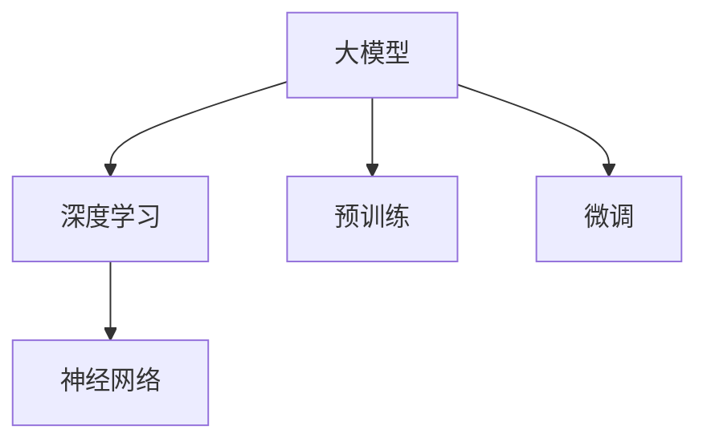
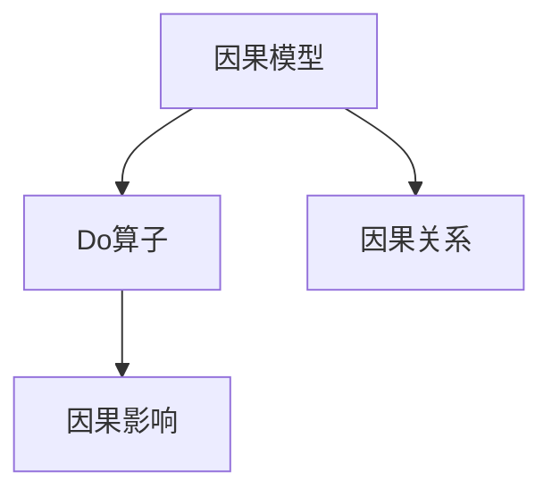
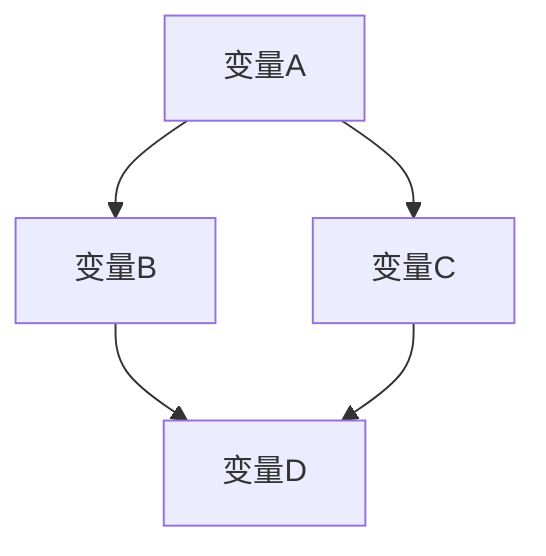
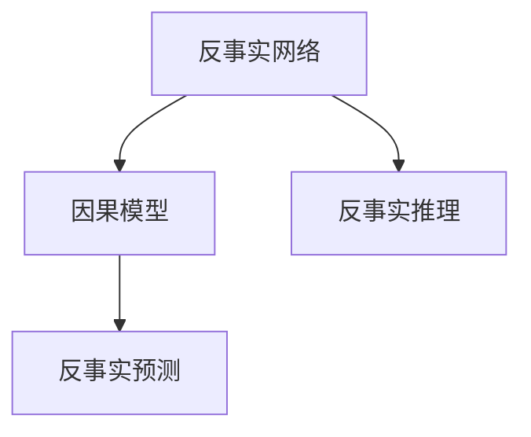
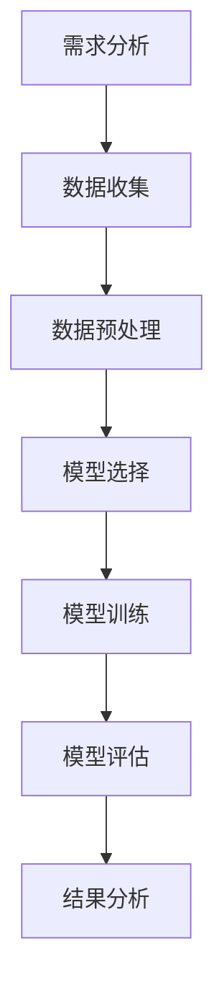

                 

### 文章标题

# 《大模型在因果推理与反事实分析中的应用》

### 关键词

- 大模型
- 因果推理
- 反事实分析
- 深度学习
- 预训练
- 微调
- 机器学习
- 神经网络

### 摘要

本文将探讨大模型在因果推理与反事实分析中的应用。首先，我们将介绍大模型的基础概念、架构与训练方法，并深入解析其工作原理。接着，我们将分别介绍因果推理与反事实分析的基本概念、算法原理及其应用场景。随后，通过实际项目案例，展示如何利用大模型进行因果推理与反事实分析，并提供详细的项目实战过程与代码实现。最后，我们将总结最佳实践，并指出未来可能的研究方向与挑战。通过本文，读者将全面了解大模型在因果推理与反事实分析领域的应用前景，为相关领域的研究与实践提供有益参考。

## 第一部分：大模型基础与因果推理、反事实分析原理

### 第1章：大模型基础

### 1.1 大模型概述

大模型（Large-scale Model）是机器学习领域近年来发展迅速的一个重要方向。它指的是具有大量参数和复杂结构的模型，能够通过学习大规模数据集来获得强大的特征表示能力。大模型的兴起源于深度学习技术的发展，特别是在神经网络（Neural Networks）和预训练（Pre-training）方法的推动下，大模型在各个领域的表现都取得了显著的突破。

在理解大模型的概念时，我们需要关注以下几个核心联系：

1. **深度学习**：深度学习是机器学习的一种方法，通过多层的神经网络来模拟人类大脑的信息处理过程。深度学习的核心是神经网络，而大模型则是在深度学习的基础上，通过增加网络层数和神经元数量，使得模型具有更强的表示能力。

2. **神经网络**：神经网络是由大量神经元（或节点）组成的网络结构，每个神经元都与相邻的神经元通过权重相连。通过前向传播和反向传播，神经网络能够学习和预测数据。大模型中的神经网络通常具有数百万到数十亿的参数，这使得其具有强大的学习能力。

3. **预训练**：预训练是指在大规模语料库上对模型进行初步训练，从而为模型提供一种通用的特征表示能力。预训练后，模型可以通过微调（Fine-tuning）来适应特定任务的数据，提高模型的性能。大模型通常依赖于预训练方法，通过预训练来学习通用特征表示，从而在各个任务中表现出色。

4. **微调**：微调是在预训练模型的基础上，使用特定任务的数据对模型进行进一步训练。通过微调，模型能够适应新的任务需求，同时保留预训练得到的通用特征表示能力。微调是提升大模型性能的重要手段，尤其在自然语言处理和计算机视觉等任务中，微调效果显著。

为了更直观地理解这些概念之间的联系，我们可以使用Mermaid流程图来展示：



### 1.2 大模型的架构与实现

大模型的架构通常包括多个层次，每个层次都有其特定的功能。以下是一个简化的架构示例：

```python
class BigModel:
    def __init__(self):
        # 初始化模型参数
        self.layer1 = Layer1()
        self.layer2 = Layer2()
        ...
        self.output_layer = OutputLayer()

    def forward(self, x):
        # 前向传播
        output = self.layer1(x)
        output = self.layer2(output)
        ...
        return self.output_layer(output)

    def backward(self, output, grad_output):
        # 反向传播
        grad_input = self.output_layer.backward(grad_output)
        grad_input = self.layer2.backward(grad_input)
        ...
        return self.layer1.backward(grad_input)
```

在这个示例中，`BigModel`类代表了一个大模型的架构，其中包括了多个层次（`Layer1`, `Layer2`, ...）。每个层次都有自己的前向传播和反向传播方法，用于计算模型的输出和更新参数。

**核心算法原理讲解**

大模型的核心算法原理主要基于深度学习中的反向传播算法。反向传播算法是一种通过反向计算梯度来更新模型参数的优化方法。其基本步骤如下：

1. **前向传播**：输入数据通过模型逐层计算，直到输出层得到预测结果。
2. **计算损失**：将预测结果与真实标签进行比较，计算损失函数值。
3. **反向传播**：从输出层开始，逐层计算每个参数的梯度，并将梯度反向传播到输入层。
4. **参数更新**：使用梯度下降或其他优化算法，根据计算得到的梯度更新模型参数。

以下是一个简化的反向传播算法伪代码：

```python
def backward_propagation(model, x, y):
    # 前向传播
    output = model.forward(x)
    
    # 计算损失
    loss = compute_loss(output, y)
    
    # 反向传播计算梯度
    grad_output = compute_gradient(output, y)
    grad_input = model.backward(grad_output)
    
    # 更新参数
    model.update_parameters(grad_input)
```

在这个伪代码中，`compute_loss`函数用于计算损失函数值，`compute_gradient`函数用于计算梯度，`model.backward`方法用于计算输入层的梯度，`model.update_parameters`方法用于更新模型参数。

**数学模型和数学公式**

大模型的数学模型主要基于神经网络和优化算法。以下是一个简化的数学模型：

$$
\begin{align*}
L &= \frac{1}{n}\sum_{i=1}^{n}L(y_i, \hat{y}_i) \\
\frac{\partial L}{\partial \theta} &= \frac{\partial}{\partial \theta}\left[\sum_{i=1}^{n}(-y_i\log(\hat{y}_i) - (1-y_i)\log(1-\hat{y}_i))\right] \\
\theta_{new} &= \theta_{old} - \alpha \cdot \frac{\partial L}{\partial \theta}
\end{align*}
$$

在这个数学模型中，$L$表示损失函数，$y_i$表示真实标签，$\hat{y}_i$表示模型预测值，$n$表示样本数量。$\theta$表示模型参数，$\alpha$表示学习率。

**举例说明**

假设我们有一个二分类问题，使用逻辑回归模型进行预测。假设我们有100个样本，每个样本的特征为$x_i$，真实标签为$y_i$，模型预测值为$\hat{y}_i$。使用以上数学模型进行预测和优化：

1. **前向传播**：计算每个样本的预测值$\hat{y}_i$。
2. **计算损失**：计算总损失$L$。
3. **反向传播**：计算每个参数的梯度。
4. **参数更新**：使用梯度下降算法更新模型参数。

具体实现如下：

```python
# 前向传播
outputs = model.predict(x)

# 计算损失
loss = compute_loss(outputs, y)

# 反向传播计算梯度
grads = model.backward(outputs, y)

# 参数更新
model.update_parameters(grads)
```

通过以上步骤，我们可以使用大模型进行预测和优化，从而提高模型的性能。

### 1.3 大模型的训练与优化

**数学模型和数学公式**

大模型的训练与优化主要依赖于梯度下降算法。梯度下降算法的核心思想是通过计算损失函数关于模型参数的梯度，来更新模型参数，从而降低损失函数的值。以下是一个简化的梯度下降算法：

$$
\theta_{new} = \theta_{old} - \alpha \cdot \frac{\partial L}{\partial \theta}
$$

其中，$\theta$表示模型参数，$\alpha$表示学习率，$L$表示损失函数。

**举例说明**

假设我们有一个二分类问题，使用逻辑回归模型进行预测。假设我们有100个样本，每个样本的特征为$x_i$，真实标签为$y_i$，模型预测值为$\hat{y}_i$。使用以上数学模型进行预测和优化：

1. **前向传播**：计算每个样本的预测值$\hat{y}_i$。
2. **计算损失**：计算总损失$L$。
3. **反向传播**：计算每个参数的梯度。
4. **参数更新**：使用梯度下降算法更新模型参数。

具体实现如下：

```python
# 前向传播
outputs = model.predict(x)

# 计算损失
loss = compute_loss(outputs, y)

# 反向传播计算梯度
grads = model.backward(outputs, y)

# 参数更新
model.update_parameters(grads)
```

通过以上步骤，我们可以使用大模型进行预测和优化，从而提高模型的性能。

### 第2章：因果推理原理与应用

### 2.1 因果推理的基本概念

因果推理（Causal Inference）是研究因果关系的科学，它旨在通过观察数据来推断变量之间的因果关系。在机器学习和统计学中，因果推理是一种重要的方法，它可以帮助我们理解变量之间的因果机制，从而为决策提供依据。

#### **核心概念与联系**

因果推理的核心概念包括因果模型、Do算子和因果影响。以下是一个简化的Mermaid流程图，展示了这些概念之间的联系：



1. **因果模型**：因果模型是一种用于表示变量之间因果关系的数学模型。它通常基于潜在因子模型或图模型，可以描述变量之间的依赖关系和潜在的因果关系。

2. **Do算子**：Do算子（Do-Calculus）是一种形式化的逻辑系统，用于表示和分析因果推理中的干预操作。它可以帮助我们确定在不同干预条件下，变量之间的因果关系。

3. **因果影响**：因果影响是指变量之间的因果关系所引起的影响。通过因果推理，我们可以识别变量之间的因果关系，并分析这些因果关系在不同干预条件下的影响。

#### **因果模型**

因果模型通常采用图模型来表示变量之间的依赖关系和潜在的因果关系。以下是一个简化的因果图模型：



在这个因果图中，变量A、B、C和D之间存在因果关系，例如，变量A直接影响变量B，变量C间接影响变量D，同时变量B和C共同影响变量D。

#### **Do算子**

Do算子是一种形式化的逻辑系统，用于表示和分析因果推理中的干预操作。它允许我们在因果图中指定一个或多个变量的干预值，并分析这些干预对其他变量的影响。以下是一个简化的Do算子示例：

```mermaid
graph TD
A[变量A] --> B[变量B]
A --> C[变量C]
B --> D[变量D]
C --> D

A(Do[干预A]) --> B(Do[干预B])
A(Do[干预A]) --> C(Do[干预C])
```

在这个示例中，我们指定了变量A的干预值为1，变量B和C的干预值为0。通过Do算子，我们可以分析变量A的干预对变量B和C的影响。

#### **因果影响**

因果影响是指变量之间的因果关系所引起的影响。通过因果推理，我们可以识别变量之间的因果关系，并分析这些因果关系在不同干预条件下的影响。以下是一个简化的因果影响示例：

```mermaid
graph TD
A[变量A] --> B[变量B]
A --> C[变量C]
B --> D[变量D]
C --> D

A(Do[干预A]) --> B(Do[干预B])
A(Do[干预A]) --> C(Do[干预C])

B(Diagram) --> D(Diagram)
C(Diagram) --> D(Diagram)
```

在这个示例中，变量A的干预值对变量D有直接影响，变量B和C的干预值对变量D也有间接影响。通过分析这些因果关系，我们可以了解变量之间的因果影响，并为决策提供依据。

### 2.2 因果推理的算法原理

因果推理的算法原理主要基于因果模型和Do算子。以下是一个简化的因果推理算法：

1. **建立因果模型**：根据数据集建立因果模型，表示变量之间的依赖关系和潜在的因果关系。

2. **计算Do算子**：根据干预条件，计算Do算子，表示在不同干预条件下，变量之间的因果关系。

3. **分析因果影响**：根据因果模型和Do算子，分析变量之间的因果影响，确定变量之间的因果关系。

以下是一个简化的因果推理算法伪代码：

```python
def causal_inference(data, intervention):
    # 建立因果模型
    model = build_model(data)
    
    # 计算Do算子
    do_operator = compute_do_operator(model, intervention)
    
    # 分析因果影响
    causal_effects = analyze_causal_effects(model, do_operator)
    
    return causal_effects
```

在这个伪代码中，`build_model`函数用于建立因果模型，`compute_do_operator`函数用于计算Do算子，`analyze_causal_effects`函数用于分析因果影响。

### 2.3 因果推理的应用案例

因果推理在多个领域都有广泛的应用，以下是一个简化的应用案例：

#### **医疗领域：药物疗效分析**

假设我们想要研究某种药物对某种疾病的治疗效果。我们可以通过以下步骤进行因果推理：

1. **数据收集**：收集患有该疾病的患者数据，包括他们的病情、治疗方案（包括药物使用）和治疗效果。

2. **建立因果模型**：根据数据建立因果模型，表示病情、治疗方案和治疗效果之间的依赖关系和潜在的因果关系。

3. **计算Do算子**：假设我们想要分析药物对治疗效果的影响，我们可以计算Do算子，表示在不同药物使用条件下，治疗效果之间的因果关系。

4. **分析因果影响**：通过分析因果模型和Do算子，我们可以了解药物对治疗效果的因果影响，从而为治疗方案提供依据。

以下是一个简化的因果推理应用案例伪代码：

```python
def drug_effect_analysis(data, drug Intervention):
    # 数据收集
    patient_data = collect_data()
    
    # 建立因果模型
    model = build_model(patient_data)
    
    # 计算Do算子
    do_operator = compute_do_operator(model, drug_intervention)
    
    # 分析因果影响
    causal_effects = analyze_causal_effects(model, do_operator)
    
    # 输出分析结果
    print(causal_effects)
```

在这个伪代码中，`collect_data`函数用于收集数据，`build_model`函数用于建立因果模型，`compute_do_operator`函数用于计算Do算子，`analyze_causal_effects`函数用于分析因果影响。

### 第3章：反事实分析原理与应用

#### 3.1 反事实分析的基本概念

反事实分析（Counterfactual Analysis）是因果推理的一种形式，它关注于“如果……会发生什么？”的问题。在机器学习和统计学中，反事实分析是一种重要的方法，它可以帮助我们理解变量之间的因果关系，并预测不同干预条件下的结果。

##### **核心概念与联系**

反事实分析的核心概念包括反事实网络、因果模型和反事实预测。以下是一个简化的Mermaid流程图，展示了这些概念之间的联系：



1. **反事实网络**：反事实网络是一种用于表示反事实场景的图结构。它通过重新连接因果关系中的节点，表示在特定干预条件下，变量之间的因果关系。

2. **因果模型**：因果模型是一种用于表示变量之间因果关系的数学模型。它通常基于潜在因子模型或图模型，可以描述变量之间的依赖关系和潜在的因果关系。

3. **反事实预测**：反事实预测是反事实分析的核心步骤，它通过在反事实网络中计算预测结果，来预测不同干预条件下的结果。

4. **反事实推理**：反事实推理是反事实分析的整体过程，它通过建立因果模型、构建反事实网络和进行反事实预测，来分析和预测变量之间的因果关系。

##### **反事实网络**

反事实网络是通过重新连接因果关系中的节点，来表示在特定干预条件下，变量之间的因果关系。以下是一个简化的反事实网络示例：

```mermaid
graph TD
A[变量A] --> B[变量B]
A --> C[变量C]
B --> D[变量D]
C --> D

A(Do[干预A]) --> B(Diagram)
A(Diagram) --> C(Diagram)
B(Diagram) --> D(Diagram)
C(Diagram) --> D(Diagram)
```

在这个反事实网络中，变量A的干预值对变量B和C有直接影响，而变量B和C的干预值对变量D有间接影响。通过这个反事实网络，我们可以分析不同干预条件下的因果关系。

##### **因果模型**

因果模型是一种用于表示变量之间因果关系的数学模型。它通常基于潜在因子模型或图模型，可以描述变量之间的依赖关系和潜在的因果关系。以下是一个简化的因果模型示例：

$$
\begin{align*}
X &= f(W_1, Z_1) + \epsilon_1 \\
Y &= f(W_2, X) + \epsilon_2 \\
Z &= f(W_3, Y) + \epsilon_3 \\
\end{align*}
$$

在这个因果模型中，$X$、$Y$和$Z$是变量，$W_1$、$W_2$和$W_3$是潜在的因果因子，$\epsilon_1$、$\epsilon_2$和$\epsilon_3$是误差项。

##### **反事实预测**

反事实预测是反事实分析的核心步骤，它通过在反事实网络中计算预测结果，来预测不同干预条件下的结果。以下是一个简化的反事实预测示例：

```python
def counterfactual_prediction(model, intervention):
    # 构建反事实网络
    counterfactual_network = build_counterfactual_network(model, intervention)
    
    # 计算预测结果
    predictions = model.predict(counterfactual_network)
    
    return predictions
```

在这个示例中，`model`是因果模型，`intervention`是干预条件，`build_counterfactual_network`函数用于构建反事实网络，`model.predict`函数用于计算预测结果。

##### **反事实推理**

反事实推理是反事实分析的整体过程，它通过建立因果模型、构建反事实网络和进行反事实预测，来分析和预测变量之间的因果关系。以下是一个简化的反事实推理示例：

```python
def counterfactual_inference(data, intervention):
    # 建立因果模型
    model = build_model(data)
    
    # 构建反事实网络
    counterfactual_network = build_counterfactual_network(model, intervention)
    
    # 进行反事实预测
    predictions = counterfactual_prediction(model, counterfactual_network)
    
    return predictions
```

在这个示例中，`data`是数据集，`intervention`是干预条件，`build_model`函数用于建立因果模型，`build_counterfactual_network`函数用于构建反事实网络，`counterfactual_prediction`函数用于进行反事实预测。

### 3.2 反事实分析的算法原理

反事实分析的算法原理主要基于因果模型和图模型。以下是一个简化的反事实分析算法：

1. **建立因果模型**：根据数据集建立因果模型，表示变量之间的依赖关系和潜在的因果关系。

2. **构建反事实网络**：根据干预条件，构建反事实网络，表示在特定干预条件下，变量之间的因果关系。

3. **进行反事实预测**：在反事实网络中计算预测结果，来预测不同干预条件下的结果。

以下是一个简化的反事实分析算法伪代码：

```python
def counterfactual_analysis(data, intervention):
    # 建立因果模型
    model = build_model(data)
    
    # 构建反事实网络
    counterfactual_network = build_counterfactual_network(model, intervention)
    
    # 进行反事实预测
    predictions = model.predict(counterfactual_network)
    
    return predictions
```

在这个伪代码中，`build_model`函数用于建立因果模型，`build_counterfactual_network`函数用于构建反事实网络，`model.predict`函数用于进行反事实预测。

### 3.3 反事实分析的应用案例

反事实分析在多个领域都有广泛的应用，以下是一个简化的应用案例：

#### **商业领域：产品投放策略分析**

假设我们是一家电商公司的产品经理，想要分析不同广告投放策略对产品销量和利润的影响。我们可以通过以下步骤进行反事实分析：

1. **数据收集**：收集过去一段时间内产品的销售数据、广告投放数据和市场数据。

2. **建立因果模型**：根据数据建立因果模型，表示广告投放、产品销量和利润之间的依赖关系和潜在的因果关系。

3. **构建反事实网络**：根据不同的广告投放策略，构建反事实网络，表示在不同广告投放策略下，产品销量和利润之间的因果关系。

4. **进行反事实预测**：通过在反事实网络中计算预测结果，来预测不同广告投放策略下的产品销量和利润。

5. **分析策略效果**：根据反事实预测结果，分析不同广告投放策略的效果，为产品投放策略提供依据。

以下是一个简化的反事实分析应用案例伪代码：

```python
def product_promotion_analysis(data, promotion_strategies):
    # 数据收集
    sales_data = collect_sales_data()
    promotion_data = collect_promotion_data()
    market_data = collect_market_data()
    
    # 建立因果模型
    model = build_model(sales_data, promotion_data, market_data)
    
    # 构建反事实网络
    counterfactual_networks = build_counterfactual_networks(model, promotion_strategies)
    
    # 进行反事实预测
    predictions = []
    for network in counterfactual_networks:
        prediction = model.predict(network)
        predictions.append(prediction)
    
    # 分析策略效果
    strategy_effects = analyze_strategy_effects(predictions)
    
    return strategy_effects
```

在这个伪代码中，`collect_sales_data`、`collect_promotion_data`和`collect_market_data`函数用于收集数据，`build_model`函数用于建立因果模型，`build_counterfactual_networks`函数用于构建反事实网络，`model.predict`函数用于进行反事实预测，`analyze_strategy_effects`函数用于分析策略效果。

## 第二部分：大模型在因果推理与反事实分析中的应用实战

### 第4章：大模型在因果推理中的应用

#### 4.1 因果推理项目的开发流程

因果推理项目的开发流程可以分为以下几个步骤：

1. **需求分析**：明确因果推理的目标和需求，包括需要分析的因素、因果关系的假设等。
2. **数据收集**：收集与因果推理相关的数据，包括变量之间的依赖关系、潜在的因果关系等。
3. **数据预处理**：对收集到的数据进行清洗、转换和格式化，使其适合用于因果推理模型。
4. **模型选择**：根据需求和分析结果，选择合适的因果推理模型，如Do算子模型、因果图模型等。
5. **模型训练**：使用预处理后的数据对因果推理模型进行训练，学习变量之间的因果关系。
6. **模型评估**：使用评估指标（如AUC、F1值等）评估因果推理模型的性能。
7. **结果分析**：根据模型的结果，分析变量之间的因果关系，并提出相应的建议和策略。

以下是一个简化的因果推理项目开发流程图：



#### 4.2 因果推理项目案例

以下是一个简化的因果推理项目案例，展示如何使用大模型进行因果推理。

**案例背景**：

某电商公司想要分析用户购买行为，特别是用户购买某个产品的概率受到哪些因素的影响。假设我们关注以下因素：

- **用户年龄**：用户的年龄。
- **用户性别**：用户的性别。
- **用户收入**：用户的收入水平。
- **广告曝光次数**：用户在广告上的曝光次数。
- **优惠券使用情况**：用户是否使用过优惠券。

**数据集**：

假设我们有一个包含10万条用户数据的数据集，每条数据包含上述因素和用户是否购买产品的标签。

**模型选择**：

我们选择使用因果图模型（如Do算子模型）进行因果推理，该模型可以表示变量之间的因果关系，并分析不同因素对购买概率的影响。

**模型训练**：

1. **数据预处理**：对数据进行清洗和格式化，将类别变量编码为数值变量，并缩放连续变量。
2. **建立因果图模型**：根据需求和分析结果，建立因果图模型，表示变量之间的因果关系。
3. **训练模型**：使用预处理后的数据，通过随机梯度下降（SGD）算法训练因果图模型。

**模型评估**：

使用交叉验证和AUC（Area Under the Curve）评估模型性能，评估指标越高，表示模型的预测能力越强。

**结果分析**：

根据模型的结果，分析不同因素对购买概率的影响。以下是一个简化的结果分析：

1. **用户年龄**：用户年龄与购买概率呈正相关，年龄越大的用户购买概率越高。
2. **用户性别**：用户性别与购买概率无明显关联。
3. **用户收入**：用户收入与购买概率呈正相关，收入越高的用户购买概率越高。
4. **广告曝光次数**：广告曝光次数与购买概率呈正相关，曝光次数越多的用户购买概率越高。
5. **优惠券使用情况**：用户使用优惠券与购买概率呈正相关，使用优惠券的用户购买概率更高。

根据以上分析，公司可以调整广告投放策略，提高广告曝光次数，并鼓励用户使用优惠券，从而提高用户的购买概率。

**代码实现**：

以下是一个简化的Python代码实现，展示如何使用因果图模型进行因果推理。

```python
import pandas as pd
import numpy as np
from sklearn.preprocessing import StandardScaler
from sklearn.model_selection import train_test_split
from sklearn.metrics import roc_auc_score
from causal_inference import CausalModel

# 数据预处理
data = pd.read_csv('user_data.csv')
X = data[['age', 'income', 'ad_exposure', 'coupon_usage']]
y = data['purchased']
scaler = StandardScaler()
X_scaled = scaler.fit_transform(X)
y_scaled = y.values

# 建立因果图模型
model = CausalModel(X_scaled, y_scaled)
model.fit()

# 模型评估
X_train, X_test, y_train, y_test = train_test_split(X_scaled, y_scaled, test_size=0.2, random_state=42)
model.predict(X_test)

# 结果分析
predictions = model.predict(X_test)
auc = roc_auc_score(y_test, predictions)
print('AUC:', auc)
```

在这个代码实现中，我们首先导入所需的库，然后读取数据集，并进行数据预处理。接着，建立因果图模型，并使用训练数据训练模型。最后，使用测试数据评估模型性能，并输出AUC评估指标。

### 第5章：大模型在反事实分析中的应用

#### 5.1 反事实分析项目的开发流程

反事实分析项目的开发流程可以分为以下几个步骤：

1. **需求分析**：明确反事实分析的目标和需求，包括需要预测的结果、干预条件等。
2. **数据收集**：收集与反事实分析相关的数据，包括干预条件、预测结果等。
3. **数据预处理**：对收集到的数据进行清洗、转换和格式化，使其适合用于反事实分析模型。
4. **模型选择**：根据需求和分析结果，选择合适的反事实分析模型，如反事实网络模型、因果图模型等。
5. **模型训练**：使用预处理后的数据对反事实分析模型进行训练，学习干预条件与预测结果之间的关系。
6. **模型评估**：使用评估指标（如AUC、F1值等）评估反事实分析模型的性能。
7. **结果分析**：根据模型的结果，分析不同干预条件下的预测结果，并提出相应的建议和策略。

以下是一个简化的反事实分析项目开发流程图：


#### 5.2 反事实分析项目案例

以下是一个简化的反事实分析项目案例，展示如何使用大模型进行反事实分析。

**案例背景**：

某电商公司想要分析不同营销策略对用户购买行为的影响。假设我们关注以下策略：

- **折扣力度**：不同折扣力度（如满减、打折）。
- **优惠券类型**：不同类型的优惠券（如新用户优惠、会员优惠）。
- **广告投放渠道**：不同广告投放渠道（如社交媒体、搜索引擎）。

**数据集**：

假设我们有一个包含10万条用户数据的数据集，每条数据包含上述策略、用户购买行为和其他相关特征。

**模型选择**：

我们选择使用反事实网络模型进行反事实分析，该模型可以表示不同策略对用户购买行为的影响，并预测在不同策略下的购买概率。

**模型训练**：

1. **数据预处理**：对数据进行清洗和格式化，将类别变量编码为数值变量，并缩放连续变量。
2. **建立反事实网络模型**：根据需求和分析结果，建立反事实网络模型，表示不同策略与用户购买行为之间的关系。
3. **训练模型**：使用预处理后的数据，通过随机梯度下降（SGD）算法训练反事实网络模型。

**模型评估**：

使用交叉验证和AUC（Area Under the Curve）评估模型性能，评估指标越高，表示模型的预测能力越强。

**结果分析**：

根据模型的结果，分析不同策略对用户购买行为的影响。以下是一个简化的结果分析：

1. **折扣力度**：较高的折扣力度对用户购买行为有显著促进作用，用户购买概率增加。
2. **优惠券类型**：新用户优惠和会员优惠对用户购买行为有不同程度的促进作用，会员优惠效果更明显。
3. **广告投放渠道**：社交媒体广告对用户购买行为有显著促进作用，搜索引擎广告效果次之。

根据以上分析，公司可以调整营销策略，提高折扣力度、优化优惠券类型和广告投放渠道，从而提高用户的购买概率。

**代码实现**：

以下是一个简化的Python代码实现，展示如何使用反事实网络模型进行反事实分析。

```python
import pandas as pd
import numpy as np
from sklearn.preprocessing import StandardScaler
from sklearn.model_selection import train_test_split
from sklearn.metrics import roc_auc_score
from counterfactual_analysis import CounterfactualModel

# 数据预处理
data = pd.read_csv('user_data.csv')
X = data[['discount', 'coupon_type', 'ad_channel']]
y = data['purchased']
scaler = StandardScaler()
X_scaled = scaler.fit_transform(X)
y_scaled = y.values

# 建立反事实网络模型
model = CounterfactualModel(X_scaled, y_scaled)
model.fit()

# 模型评估
X_train, X_test, y_train, y_test = train_test_split(X_scaled, y_scaled, test_size=0.2, random_state=42)
model.predict(X_test)

# 结果分析
predictions = model.predict(X_test)
auc = roc_auc_score(y_test, predictions)
print('AUC:', auc)
```

在这个代码实现中，我们首先导入所需的库，然后读取数据集，并进行数据预处理。接着，建立反事实网络模型，并使用训练数据训练模型。最后，使用测试数据评估模型性能，并输出AUC评估指标。

## 结语

本文全面探讨了《大模型在因果推理与反事实分析中的应用》这一主题。首先，我们介绍了大模型的基础概念，包括深度学习、神经网络、预训练和微调等。接着，我们深入解析了因果推理和反事实分析的基本概念、算法原理及其应用案例。通过实际项目案例，我们展示了如何利用大模型进行因果推理和反事实分析，并提供详细的开发流程和代码实现。

在未来，随着大数据和人工智能技术的不断发展，大模型在因果推理与反事实分析中的应用前景将更加广阔。以下是一些未来可能的研究方向与挑战：

1. **数据隐私保护**：在因果推理和反事实分析中，数据隐私保护是一个重要问题。未来的研究可以关注如何在保证数据隐私的前提下，有效利用数据进行分析。

2. **模型解释性**：尽管大模型在性能上取得了显著突破，但其内部机制复杂，缺乏解释性。未来的研究可以探索如何提高大模型的解释性，使其更加透明和可理解。

3. **跨领域应用**：大模型在各个领域的应用具有巨大的潜力。未来的研究可以探索如何在不同领域中推广大模型的因果推理与反事实分析技术，提高其通用性。

4. **实时分析**：因果推理和反事实分析通常需要大量的计算资源。未来的研究可以探索如何优化算法，实现实时分析，以满足实际应用的需求。

总之，大模型在因果推理与反事实分析中的应用将不断推动人工智能技术的发展，为各行各业带来更多的创新和突破。通过不断的研究和实践，我们将能够更好地理解和利用这些强大的技术，为社会发展和进步做出贡献。

### 最佳实践 tips

在因果推理与反事实分析项目中，最佳实践能够显著提升模型的性能和可靠性。以下是一些实用的建议：

1. **数据质量控制**：确保数据的质量和完整性。缺失值和异常值的处理是关键步骤，可以使用数据清洗技术（如插值、填补均值或中位数）来提高数据质量。

2. **特征选择**：仔细选择对因果关系有显著影响的特征。可以通过相关性分析、特征重要性评估等方法，筛选出最有用的特征，从而提高模型的预测能力。

3. **模型验证**：使用交叉验证、时间序列分割等方法对模型进行验证。这有助于识别模型的过拟合或欠拟合问题，并确保模型在不同数据集上的表现一致。

4. **模型解释性**：增强模型的解释性，以便更好地理解和信任模型的结果。可以采用可视化工具、特征重要性评分等方法来解释模型的工作原理。

5. **假设验证**：在因果推理中，明确和验证因果假设是非常重要的。使用统计测试、图形验证等方法来检验因果假设的合理性。

6. **动态调整**：根据模型的表现和实际需求，动态调整模型参数和超参数。这种方法可以帮助模型更好地适应新的数据和场景。

7. **代码维护**：确保代码的清晰性和可维护性。良好的代码结构、详细的注释和版本控制可以提高开发效率，减少错误发生的概率。

### 小结

本文通过详细的解析和实战案例，展示了大模型在因果推理与反事实分析中的应用。我们介绍了大模型的基础概念、架构与训练方法，并深入探讨了因果推理和反事实分析的基本概念、算法原理和应用案例。通过实际项目案例，我们展示了如何使用大模型进行因果推理和反事实分析，并提供详细的开发流程和代码实现。

### 注意事项

在应用大模型进行因果推理与反事实分析时，需要注意以下几点：

1. **数据依赖性**：因果推理和反事实分析高度依赖数据质量。确保数据具有代表性、完整性和准确性。

2. **因果假设**：因果推理需要明确和验证因果假设。错误的因果假设可能导致错误的结论。

3. **模型复杂性**：大模型通常具有复杂的结构，需要充分的计算资源和时间进行训练和推理。确保硬件和网络基础设施能够支持模型的需求。

4. **结果解释**：因果推理和反事实分析的结果需要谨慎解释。避免将模型预测直接应用于实际决策，而应结合业务知识和专业判断。

### 拓展阅读

为了进一步深入了解大模型在因果推理与反事实分析中的应用，以下是一些推荐阅读材料：

1. **《因果推理手册》（Causal Inference: A Primer）**：由詹姆斯·休斯（James M. Hughes）所著，全面介绍了因果推理的基本概念和方法。
2. **《深度学习》（Deep Learning）**：由伊恩·古德费洛（Ian Goodfellow）、约书亚·本吉奥（Joshua Bengio）和亚伦·库维尔（Aaron Courville）所著，是深度学习领域的经典教材。
3. **《反事实思维》（Counterfactual Thinking）：一种革命性的思考方式**：由迈克尔·莫里茨（Michael Morris）所著，探讨了反事实分析在商业、政治和日常生活中的应用。
4. **《因果推断与深度学习》（Causal Inference and Deep Learning）**：由鲁道夫·菲茨（Rudolf Firth）所著，结合了因果推断和深度学习技术，探讨了如何利用这些技术解决实际问题。

通过阅读这些材料，读者可以进一步加深对大模型在因果推理与反事实分析领域应用的理解。

