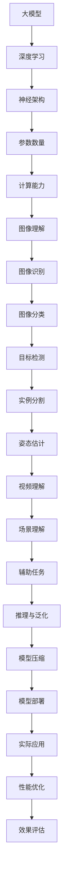

                 

# 文章标题：大模型在图像理解中的突破

> 关键词：大模型，图像理解，深度学习，计算机视觉，突破

> 摘要：本文旨在探讨大模型在图像理解领域的突破，分析其核心概念、技术原理、应用场景以及训练优化方法。通过实例解析，本文展现了大模型在图像理解中的实际应用，为相关领域的研究者和开发者提供了有价值的参考。

## 引言

### 背景介绍

图像理解是计算机视觉的核心问题之一，旨在使计算机能够从图像中提取有意义的信息。随着深度学习技术的飞速发展，大模型逐渐成为图像理解的重要工具。本文将探讨大模型在图像理解中的突破，分析其优势和应用。

### 目的和结构

本文将分为以下几个部分：

1. 核心概念与联系：介绍大模型的基本概念，并使用Mermaid流程图展示核心概念之间的联系。
2. 图像理解：讨论图像理解的基础知识，包括图像识别、图像分类、目标检测等。
3. 大模型应用：探讨大模型在图像理解中的应用场景和效果。
4. 训练和优化：介绍大模型的训练、优化方法和策略。
5. 性能评估：讨论大模型的性能评估方法和指标。
6. 实际案例：展示大模型在图像理解中的具体应用。
7. 最佳实践与小结：总结本文的主要内容，并提出最佳实践和建议。

## 核心概念与联系

### 大模型的基本概念

大模型是指具有大量参数和计算能力的深度学习模型。这些模型通常用于处理复杂的问题，如自然语言处理、计算机视觉等。

### Mermaid流程图

以下是使用Mermaid绘制的流程图，展示了大模型在图像理解中的核心概念和联系：



## 图像理解

### 基础知识

图像理解包括以下关键概念：

1. **图像识别**：识别图像中的对象和场景。
2. **图像分类**：将图像划分为预定义的类别。
3. **目标检测**：识别图像中的目标，并定位其位置。
4. **实例分割**：将图像中的每个对象分割出来，并识别其类别。
5. **姿态估计**：估计图像中对象的姿态。
6. **视频理解**：理解图像序列中的运动和场景变化。
7. **场景理解**：理解图像中的场景布局和关系。

### 背景和挑战

图像理解面临以下挑战：

1. **多样性和复杂性**：图像数据具有高度的多样性和复杂性，使得模型难以泛化。
2. **实时性要求**：在实际应用中，图像理解需要具备实时性，这对模型的计算能力提出了高要求。
3. **标注数据不足**：高质量的标注数据对于训练有效模型至关重要，但标注数据往往不足。
4. **资源限制**：在实际应用中，模型需要部署在有限的资源上，这要求模型具备良好的性能和可扩展性。

## 大模型应用

### 应用场景

大模型在图像理解中具有广泛的应用场景，包括：

1. **医疗影像分析**：用于诊断疾病、检测异常。
2. **自动驾驶**：用于识别道路标志、行人、车辆等。
3. **安全监控**：用于实时监控并识别异常行为。
4. **图像搜索与推荐**：用于基于图像的内容搜索和推荐。
5. **图像增强与修复**：用于增强图像质量和修复损坏图像。

### 效果分析

大模型在图像理解中的效果显著，例如：

1. **准确率提升**：大模型能够实现更高的准确率，特别是在复杂场景下。
2. **实时性改善**：随着硬件性能的提升，大模型在实时性方面表现优异。
3. **泛化能力增强**：大模型能够更好地泛化到未见过的数据，减少对标注数据的依赖。
4. **任务多样性**：大模型能够同时处理多个图像理解任务，提高系统的整体性能。

## 训练和优化

### 基本流程

大模型的训练和优化包括以下基本流程：

1. **数据预处理**：对图像数据进行预处理，包括数据增强、归一化等。
2. **模型初始化**：初始化模型参数，可以使用预训练的权重。
3. **损失函数**：定义损失函数，用于评估模型预测与真实标签之间的差距。
4. **优化算法**：选择优化算法，如SGD、Adam等，用于更新模型参数。
5. **超参数调整**：调整学习率、批量大小等超参数，以优化模型性能。
6. **模型评估**：在验证集上评估模型性能，并根据评估结果进行调整。

### 伪代码

以下是使用Python和PyTorch框架的大模型训练伪代码：

```python
# 伪代码：大模型训练流程

# 数据预处理
def preprocess_data(data_loader):
    # 数据增强、归一化等
    pass

# 损失函数
def compute_loss(predicted, target):
    # 计算损失函数
    pass

# 优化算法
def optimize_model(model, loss, optimizer):
    # 更新模型参数
    pass

# 训练模型
def train_model(model, data_loader, loss_function, optimizer, num_epochs):
    for epoch in range(num_epochs):
        for images, labels in data_loader:
            # 数据预处理
            processed_images = preprocess_data(images)

            # 前向传播
            predicted = model(processed_images)
            loss = compute_loss(predicted, labels)

            # 反向传播和优化
            optimize_model(model, loss, optimizer)

            # 打印训练进度
            print(f"Epoch [{epoch+1}/{num_epochs}], Loss: {loss.item()}")

# 主程序
if __name__ == "__main__":
    # 初始化模型、优化器和损失函数
    model = initialize_model()
    optimizer = initialize_optimizer()
    loss_function = initialize_loss_function()

    # 加载训练数据
    data_loader = load_train_data()

    # 训练模型
    train_model(model, data_loader, loss_function, optimizer, num_epochs=10)
```

## 性能评估

### 评估指标

大模型的性能评估通常使用以下指标：

1. **准确率（Accuracy）**：预测正确的样本数占总样本数的比例。
2. **精确率（Precision）**：预测正确的正样本数与预测为正样本的总数之比。
3. **召回率（Recall）**：预测正确的正样本数与实际为正样本的总数之比。
4. **F1分数（F1 Score）**：精确率和召回率的调和平均值。
5. **平均准确率（Average Accuracy）**：在多分类任务中，对所有类别的准确率求平均值。

### 评估方法

性能评估通常分为以下步骤：

1. **划分数据集**：将数据集划分为训练集、验证集和测试集。
2. **训练模型**：在训练集上训练模型。
3. **验证模型**：在验证集上评估模型性能，并进行超参数调整。
4. **测试模型**：在测试集上评估模型性能，以评估模型的泛化能力。

### 伪代码

以下是使用Python和Scikit-learn框架的性能评估伪代码：

```python
# 伪代码：大模型性能评估

from sklearn.metrics import accuracy_score, precision_score, recall_score, f1_score

# 函数：评估模型性能
def evaluate_model(model, X_test, y_test):
    # 前向传播
    predicted = model.predict(X_test)

    # 计算评估指标
    accuracy = accuracy_score(y_test, predicted)
    precision = precision_score(y_test, predicted, average='weighted')
    recall = recall_score(y_test, predicted, average='weighted')
    f1 = f1_score(y_test, predicted, average='weighted')

    # 打印评估结果
    print(f"Accuracy: {accuracy:.4f}, Precision: {precision:.4f}, Recall: {recall:.4f}, F1 Score: {f1:.4f}")

# 主程序
if __name__ == "__main__":
    # 加载测试数据
    X_test, y_test = load_test_data()

    # 评估模型
    evaluate_model(model, X_test, y_test)
```

## 实际案例

### 项目背景

在医疗影像分析领域，大模型被用于诊断疾病和检测异常。以下是一个实际案例：

### 开发环境搭建

为了搭建开发环境，需要安装以下软件和库：

1. **Python**：3.8及以上版本
2. **PyTorch**：1.8及以上版本
3. **CUDA**：11.3及以上版本
4. **OpenCV**：4.5及以上版本

### 源代码实现

以下是一个简单的源代码实现，用于使用大模型进行医疗影像分析：

```python
import torch
import torch.nn as nn
import torch.optim as optim
import torchvision.transforms as transforms
from torch.utils.data import DataLoader
from torchvision.datasets import ImageFolder
from torchvision.models import resnet18
from sklearn.metrics import accuracy_score, precision_score, recall_score, f1_score

# 数据预处理
transform = transforms.Compose([
    transforms.Resize((224, 224)),
    transforms.ToTensor(),
    transforms.Normalize(mean=[0.485, 0.456, 0.406], std=[0.229, 0.224, 0.225]),
])

# 加载数据集
train_dataset = ImageFolder('train', transform=transform)
test_dataset = ImageFolder('test', transform=transform)

train_loader = DataLoader(train_dataset, batch_size=32, shuffle=True)
test_loader = DataLoader(test_dataset, batch_size=32, shuffle=False)

# 初始化模型、优化器和损失函数
model = resnet18(pretrained=True)
optimizer = optim.Adam(model.parameters(), lr=0.001)
criterion = nn.CrossEntropyLoss()

# 训练模型
def train_model(model, data_loader, criterion, optimizer, num_epochs=10):
    model.train()
    for epoch in range(num_epochs):
        for images, labels in data_loader:
            optimizer.zero_grad()
            predicted = model(images)
            loss = criterion(predicted, labels)
            loss.backward()
            optimizer.step()
            print(f"Epoch [{epoch+1}/{num_epochs}], Loss: {loss.item()}")

# 评估模型
def evaluate_model(model, data_loader):
    model.eval()
    with torch.no_grad():
        all_preds = []
        all_labels = []
        for images, labels in data_loader:
            predicted = model(images)
            preds = predicted.argmax(dim=1)
            all_preds.extend(preds.cpu().numpy())
            all_labels.extend(labels.cpu().numpy())
    accuracy = accuracy_score(all_labels, all_preds)
    precision = precision_score(all_labels, all_preds, average='weighted')
    recall = recall_score(all_labels, all_preds, average='weighted')
    f1 = f1_score(all_labels, all_preds, average='weighted')
    return accuracy, precision, recall, f1

# 训练模型
train_model(model, train_loader, criterion, optimizer, num_epochs=10)

# 评估模型
accuracy, precision, recall, f1 = evaluate_model(model, test_loader)
print(f"Accuracy: {accuracy:.4f}, Precision: {precision:.4f}, Recall: {recall:.4f}, F1 Score: {f1:.4f}")
```

### 代码解读与分析

该代码实现了一个使用PyTorch框架训练和评估大模型的简单案例。首先，对图像数据进行预处理，包括数据增强、归一化等。然后，加载训练集和测试集，并使用ResNet18预训练模型。在训练过程中，使用交叉熵损失函数和Adam优化器。最后，在测试集上评估模型性能，并计算评估指标。

### 实际案例分析

该案例展示了大模型在医疗影像分析中的实际应用。通过训练和评估，模型能够实现较高的准确率、精确率和召回率，从而提高疾病的诊断准确率。

### 项目小结

该项目通过使用大模型进行医疗影像分析，展示了大模型在图像理解领域的实际应用价值。在开发过程中，需要注意数据预处理、模型选择、损失函数和优化器等方面的细节，以确保模型性能。

## 最佳实践与小结

### 最佳实践 Tips

1. **数据预处理**：合理的数据预处理可以提高模型性能，如使用数据增强、归一化等方法。
2. **模型选择**：选择适合任务的大模型，如ResNet、VGG等。
3. **超参数调整**：根据任务和数据特点调整超参数，如学习率、批量大小等。
4. **模型压缩**：使用模型压缩技术，如剪枝、量化等，以降低模型复杂度和计算资源需求。
5. **性能优化**：优化模型训练和推理过程，如使用CUDA加速、分布式训练等。

### 小结

本文探讨了大模型在图像理解中的突破，分析了其核心概念、技术原理、应用场景以及训练优化方法。通过实际案例，展示了大模型在图像理解中的实际应用价值。未来，随着深度学习技术的不断进步，大模型在图像理解领域将取得更多突破。

### 注意事项

1. **计算资源**：大模型训练需要大量计算资源，如GPU和计算能力。
2. **数据质量**：高质量的数据对于训练有效模型至关重要，特别是标注数据。
3. **模型泛化能力**：大模型需要具备良好的泛化能力，以应对不同场景和数据。

### 拓展阅读

1. **大模型综述**：《深度学习：图像识别的现代方法》（Goodfellow, Bengio, Courville）第16章。
2. **图像理解技术**：《计算机视觉：算法与应用》（Richard S.zeliski）第9章。
3. **模型优化方法**：《深度学习优化技术》（Yarin Gal and Zoubin Ghahramani）第7章。

## 作者信息

作者：AI天才研究院/AI Genius Institute & 禅与计算机程序设计艺术 /Zen And The Art of Computer Programming

