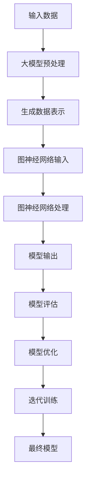
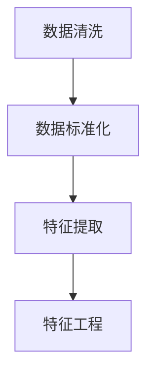
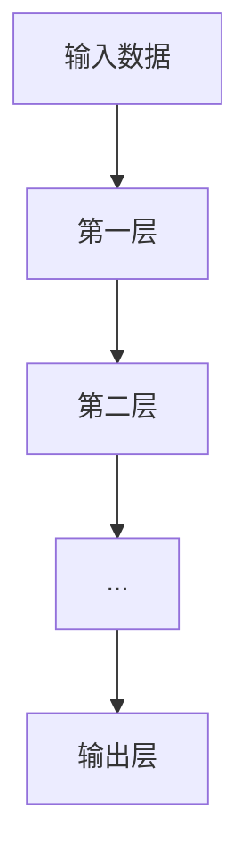
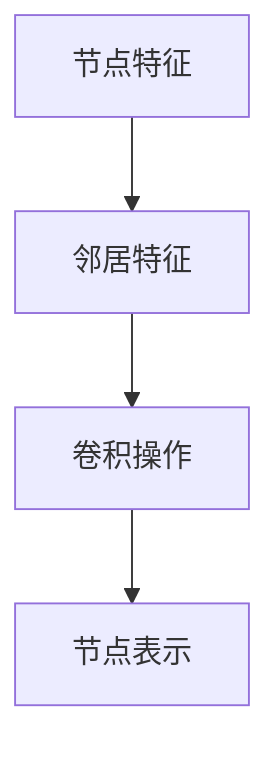
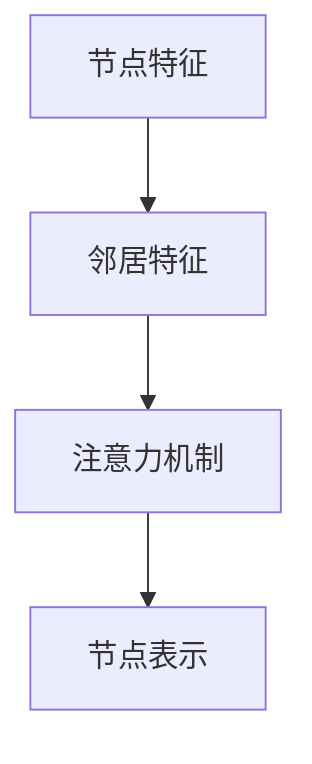
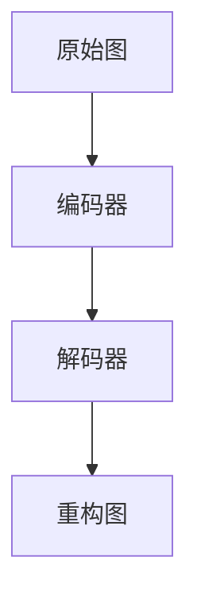

                 

### 大模型与图神经网络：引言

随着人工智能技术的快速发展，深度学习和图神经网络（Graph Neural Networks, GNNs）已成为数据科学和机器学习领域的重要研究热点。大模型（Large Models），如GPT-3、BERT等，凭借其强大的表征能力和自适应能力，已经在自然语言处理、计算机视觉等多个领域取得了显著的成果。然而，如何将大模型与图神经网络相结合，进一步提升其在复杂图数据上的处理能力，成为一个亟待解决的重要问题。

本文旨在探讨大模型在图神经网络中的应用，通过以下几部分展开论述：

1. **大模型与图神经网络概述**：介绍大模型和图神经网络的基本概念、发展历程以及它们在现代人工智能领域的重要性。
2. **大模型的核心技术与算法**：详细讲解大模型的训练与优化、图神经网络的核心算法，如图卷积网络（GCN）、图注意力网络（GAT）等。
3. **大模型在图神经网络中的应用**：分析大模型在图表示学习、图生成模型以及图分类与预测等任务中的应用，通过实例说明其优势。
4. **项目实战**：通过具体的案例展示大模型在图神经网络中的实际应用，包括社交网络分析、图像标注、药物发现等。
5. **未来发展趋势**：预测大模型在图神经网络中的未来发展方向和应用前景。

通过本文的阅读，读者将全面了解大模型在图神经网络中的应用，掌握相关核心技术和算法，并能够将理论知识应用于实际项目中。本文不仅适合从事人工智能、数据科学领域的研究人员和工程师，也适用于对图神经网络和大模型感兴趣的大学生们。

## 大模型概述

### 大模型的基本概念

大模型（Large Models）是指具有大规模参数、能够处理大量数据的机器学习模型。这些模型通常基于深度学习架构，通过多层神经网络结构来学习复杂的函数关系。大模型的规模可以从几百万参数量到数十亿参数量不等。例如，著名的GPT-3模型拥有1750亿个参数，是目前最大的自然语言处理模型之一。大模型之所以被称为“大”，不仅在于其参数数量，还因为其训练数据量通常也非常庞大。

大模型的发展历程可以追溯到20世纪80年代，当时研究人员开始探索使用多层感知机（Multilayer Perceptrons, MLPs）来解决复杂问题。随着计算能力的提升和数据的积累，深度学习在21世纪初逐渐兴起。2012年，AlexNet的突破性成功标志着深度学习在计算机视觉领域的崛起。此后，研究人员不断提出更大的模型，如VGG、ResNet等，使得深度学习在图像分类、目标检测等领域取得了显著进展。

近年来，随着自然语言处理（Natural Language Processing, NLP）的兴起，大模型在语言理解和生成方面也展现出了强大的能力。例如，BERT（Bidirectional Encoder Representations from Transformers）和GPT-3等模型在文本分类、机器翻译、对话系统等任务中取得了顶尖成绩。这些大模型通过预训练和微调，能够自适应地处理不同领域和任务的数据。

### 大模型的发展历程

大模型的发展历程可以分为以下几个阶段：

1. **早期探索阶段**（1980s-1990s）：在这一阶段，研究人员开始使用多层感知机（MLPs）来探索大规模参数模型的可行性。尽管由于计算资源和数据限制，这些模型的效果有限，但它们为后来的深度学习奠定了基础。

2. **深度学习兴起阶段**（2006-2012）：2006年，Geoffrey Hinton等科学家提出了深度置信网络（Deep Belief Networks, DBNs），这使得多层神经网络的训练变得可行。2012年，AlexNet在ImageNet图像分类挑战中取得了突破性成绩，标志着深度学习时代的到来。

3. **大规模模型阶段**（2012-2018）：在深度学习崛起后，研究人员开始提出并训练更大的模型。VGG、ResNet等模型通过增加网络深度和宽度，显著提升了图像分类的性能。同时，NLP领域的快速进展也推动了更大规模模型的开发。

4. **超大规模模型阶段**（2018至今）：随着计算资源和数据量的不断增长，超大规模模型如GPT-3、BERT等相继问世。这些模型不仅具有数十亿个参数，还通过预训练和微调技术，展现了在多种任务上的卓越性能。

### 大模型在现代人工智能领域的重要性

大模型在现代人工智能领域具有重要性，主要体现在以下几个方面：

1. **强大的表征能力**：大模型通过深度神经网络结构，能够捕捉到数据中的复杂模式和依赖关系。这使得它们在图像识别、语言理解等任务上表现出色。

2. **自适应能力**：大模型通常通过预训练和微调技术，能够在不同领域和任务之间迁移知识。这种能力使得大模型在新的任务和数据集上能够快速适应，显著降低了训练成本。

3. **多模态处理能力**：大模型不仅能够处理单一模态的数据，如文本或图像，还可以结合多模态数据，如文本和图像，进行更复杂的任务。这为跨模态学习和推理提供了新的可能性。

4. **研究推动力**：大模型的开发和成功应用，推动了人工智能领域的研究进展。研究人员通过设计和优化大模型，不断提出新的理论和方法，推动了人工智能技术的创新。

总之，大模型凭借其强大的表征能力、自适应能力和多模态处理能力，已成为现代人工智能领域的重要工具。未来，随着计算能力的进一步提升和数据量的不断增长，大模型将在更多领域展现出其巨大的潜力。

## 图神经网络概述

### 图神经网络的基本概念

图神经网络（Graph Neural Networks, GNNs）是一种用于处理图结构数据的深度学习模型。与传统的卷积神经网络（Convolutional Neural Networks, CNNs）和循环神经网络（Recurrent Neural Networks, RNNs）不同，GNNs直接操作图结构数据，通过学习节点和边之间的复杂关系来实现对图的表示和预测。

在图神经网络中，图（Graph）是核心数据结构。一个图由节点（Node）和边（Edge）组成。节点可以表示图中的任何实体，如社交网络中的用户、蛋白质网络中的氨基酸等；边则表示节点之间的关系，如用户之间的友谊关系、氨基酸之间的相互作用等。图神经网络通过学习节点和边上的特征，生成图的全局表示，从而实现图上的分类、预测、生成等任务。

### 图神经网络的发展历程

图神经网络的研究可以追溯到20世纪80年代，当时神经网络与图论相结合，产生了图嵌入（Graph Embedding）这一概念。图嵌入的目的是将图中的节点和边映射到低维空间，使得相邻节点在低维空间中靠近，从而保持图的结构信息。

1. **早期探索阶段**（1980s-2000s）：在这一阶段，研究人员主要关注如何将节点和边表示为向量，以保持图的结构信息。图嵌入技术如Node2Vec、DeepWalk等，通过随机游走（Random Walk）和机器学习算法，成功地将节点映射到低维空间。

2. **图卷积网络阶段**（2013-2018）：2013年，Graph Convolutional Network（GCN）的提出标志着图神经网络进入了一个新的发展阶段。GCN通过图卷积操作，结合节点和其邻居节点的特征，生成节点的全局表示。此后，图注意力网络（GAT）、图自编码器（GAE）等一系列图神经网络模型相继问世，进一步扩展了图神经网络的应用范围。

3. **多模态图神经网络阶段**（2018至今）：随着多模态数据处理需求的增长，研究人员开始探索如何将图神经网络与多模态数据结合。例如，结合图神经网络和循环神经网络，实现音频和文本的双模态交互；结合图神经网络和生成对抗网络（GAN），实现图的生成和对抗训练。

### 图神经网络在现代人工智能领域的重要性

图神经网络在现代人工智能领域具有重要性，主要体现在以下几个方面：

1. **复杂关系建模**：图神经网络能够直接处理图结构数据，学习节点和边之间的复杂关系，使得它们在社交网络分析、生物信息学、推荐系统等需要复杂关系建模的领域具有独特的优势。

2. **结构化数据表征**：通过图神经网络，可以将图中的节点和边映射到低维空间，生成具有结构化信息的数据表示。这些表示在后续的机器学习和数据分析任务中，可以用于特征提取、降维等操作。

3. **图生成与预测**：图神经网络不仅能够进行图上的分类和预测任务，还可以用于图的生成和预测。例如，在社交网络中预测潜在的友谊关系，在生物信息学中预测蛋白质之间的相互作用。

4. **多模态数据处理**：图神经网络的多模态处理能力，使得它们在跨模态学习和推理中具有广泛应用前景。例如，结合图神经网络和生成对抗网络，可以生成具有真实感的图像和音频。

总之，图神经网络作为一种新型的深度学习模型，通过直接操作图结构数据，实现了对复杂关系的建模和结构化数据的表征。随着研究的不断深入和应用领域的拓展，图神经网络将在人工智能领域发挥越来越重要的作用。

### 大模型与图神经网络的联系

大模型与图神经网络之间的联系是现代人工智能研究中的一个重要课题，两者结合不仅能够发挥各自的优势，还能在多个应用场景中取得显著的效果。以下将从几个方面探讨大模型与图神经网络之间的联系：

1. **增强表征能力**：
   大模型，如GPT-3、BERT等，通过其大规模的参数和深度神经网络结构，能够捕捉到数据中的复杂模式和依赖关系。这种强大的表征能力对于图神经网络处理图结构数据来说是一个巨大的提升。例如，在处理大规模的社交网络数据时，大模型可以捕捉用户之间的关系网络，为图神经网络提供更加精准的节点表示。

2. **复杂关系建模**：
   图神经网络擅长于处理图结构数据中的复杂关系。大模型通过预训练可以获取到不同领域和任务中的通用知识，结合图神经网络，可以更好地建模复杂的关系网络。例如，在生物信息学中，大模型可以结合图神经网络来预测蛋白质之间的相互作用，通过大模型学习到的蛋白质功能知识，可以显著提高图神经网络预测的准确性。

3. **数据预处理与表示**：
   大模型在数据预处理和表示上具有显著的优势。通过大模型的预训练，可以生成高质量的数据表示，这些表示可以直接用于图神经网络。例如，在文本与图结合的多模态任务中，大模型可以将文本数据转换成具有语义信息的向量表示，这些向量表示可以作为图神经网络的输入，从而提升模型的整体性能。

4. **多任务学习**：
   大模型的另一个优势是其多任务学习能力。通过在大模型的基础上进行微调，可以实现多任务学习。例如，在一个大规模的图神经网络模型中，不仅可以处理分类任务，还可以同时进行节点预测、边预测等多种任务。这种多任务学习的能力，使得大模型与图神经网络的结合在处理复杂任务时更加高效。

5. **生成与对抗**：
   大模型结合图生成对抗网络（GAN）可以生成高质量的图数据。在图神经网络中，真实数据的稀缺性和多样性问题常常是建模的难点。通过大模型生成对抗网络，可以生成符合真实分布的图数据，从而为图神经网络提供更多的训练样本，提高模型的泛化能力。

### Mermaid流程图

为了更直观地展示大模型与图神经网络之间的联系，我们可以使用Mermaid流程图来描述它们在数据处理和模型训练中的交互过程：



在这个流程图中，输入数据首先经过大模型的预处理，生成高维数据表示。这些数据表示作为图神经网络的输入，进行图结构数据的处理和模型训练。最终，通过不断的模型优化和评估，得到一个性能优秀的图神经网络模型。

### 总结

大模型与图神经网络之间的联系不仅体现在数据处理和表征能力上，还涉及到复杂关系建模、多任务学习和生成对抗训练等方面。通过结合大模型和图神经网络，我们可以更好地处理复杂图结构数据，提升模型的性能和应用范围。未来，随着大模型和图神经网络技术的不断发展，二者的结合将在更多领域展现其强大的潜力。

## 大模型的核心技术与算法

大模型的核心技术与算法是理解其工作原理和实现高效训练与优化的关键。以下将详细讲解大模型的训练与优化、图神经网络的核心算法，包括图卷积网络（GCN）、图注意力网络（GAT）和图自编码器（GAE）。

### 大模型的训练与优化

大模型的训练过程通常包括以下几个关键步骤：

#### 1. 数据预处理

数据预处理是训练大模型的基础。首先，需要对数据进行清洗和标准化，确保输入数据的质
量。其次，根据任务需求，对数据进行适当的特征提取和工程，以提高模型的表征能力。



#### 2. 模型初始化

模型初始化是指为神经网络中的权重和偏置分配初始值。常用的初始化方法包括随机初始化、高斯初始化和Xavier初始化。正确选择初始化方法对于模型收敛速度和最终性能至关重要。

```python
# 伪代码：随机初始化权重
weights = np.random.randn(layers[0].shape[0], layers[0].shape[1])
```

#### 3. 前向传播

前向传播是将输入数据通过神经网络层，逐层计算得到输出结果的过程。每一层神经元的输出都依赖于其输入和权重。



#### 4. 计算损失函数

损失函数用于衡量模型预测结果与实际结果之间的差距。常见损失函数包括均方误差（MSE）、交叉熵损失（Cross-Entropy Loss）等。

```python
# 伪代码：计算均方误差损失
def mean_squared_error(y_true, y_pred):
    return np.mean((y_true - y_pred) ** 2)
```

#### 5. 反向传播

反向传播是计算损失函数对模型参数的梯度，并更新参数的过程。梯度下降（Gradient Descent）是常用的优化算法，通过不断迭代更新参数，使得模型损失函数逐渐减小。

```python
# 伪代码：反向传播更新权重
for layer in layers:
    layer.backward(df/dz)
```

#### 6. 参数更新

参数更新是指根据反向传播计算出的梯度，调整神经网络中的权重和偏置。常用的优化算法包括随机梯度下降（SGD）、Adam优化器等。

```python
# 伪代码：使用Adam优化器更新参数
optimizer = Adam(layers[0].weights, learning_rate=0.001)
optimizer.update()
```

### 图神经网络的核心算法

图神经网络的核心算法包括图卷积网络（GCN）、图注意力网络（GAT）和图自编码器（GAE）。以下将分别介绍这些算法的基本原理。

#### 1. 图卷积网络（GCN）

图卷积网络通过卷积操作结合节点的特征和其邻居节点的特征，生成节点的全局表示。



GCN的数学公式如下：

$$
h_{v}^{(l+1)} = \sigma(\theta \cdot (h_v^{(l)} + \sum_{u \in \mathcal{N}(v)} \theta' \cdot h_u^{(l)})
$$

其中，\(h_{v}^{(l)}\) 表示第 \(l\) 层节点 \(v\) 的表示，\(\mathcal{N}(v)\) 表示节点 \(v\) 的邻居节点集合，\(\theta\) 和 \(\theta'\) 分别为卷积权重。

#### 2. 图注意力网络（GAT）

图注意力网络通过注意力机制动态地聚合节点和其邻居节点的特征，增强了图神经网络对复杂关系的建模能力。



GAT的注意力函数为：

$$
\alpha_{uv}^{(l)} = \frac{e^{ \theta_a [ h_v^{(l)}, h_u^{(l)} ] }}{ \sum_{u' \in \mathcal{N}(v)} e^{ \theta_a [ h_v^{(l)}, h_u^{(l)} ] }}
$$

其中，\(\alpha_{uv}^{(l)}\) 表示节点 \(u\) 对节点 \(v\) 的注意力权重，\(\theta_a\) 为注意力权重参数。

#### 3. 图自编码器（GAE）

图自编码器通过自编码器的架构学习图的结构表示，从而实现图数据的降维和嵌入。



GAE的编码器和解码器分别通过以下公式进行训练：

编码器：
$$
z_v = \sigma(W_c h_v + b_c)
$$

解码器：
$$
h_v' = \sigma(W_d z_v + b_d)
$$

其中，\(h_v\) 和 \(z_v\) 分别表示节点 \(v\) 的原始表示和编码表示，\(W_c\) 和 \(W_d\) 分别为编码器和解码器的权重，\(b_c\) 和 \(b_d\) 分别为编码器和解码器的偏置。

通过以上讲解，我们可以看到大模型与图神经网络在训练与优化、核心算法等方面有着紧密的联系。大模型提供了强大的表征能力和自适应能力，而图神经网络则通过直接操作图结构数据，实现了对复杂关系的建模。两者的结合为复杂图数据分析和处理提供了新的方法和思路。在未来，随着大模型和图神经网络技术的不断发展，二者之间的融合将带来更多创新和应用。

## 大模型在图神经网络中的应用

大模型在图神经网络中的应用极大地提升了模型在复杂图数据上的表征和预测能力。以下将详细分析大模型在图表示学习、图生成模型以及图分类与预测任务中的应用。

### 图表示学习

图表示学习（Graph Embedding）是将图中的节点映射到低维空间的过程，使得相邻节点在低维空间中依然保持近邻关系。大模型在这一领域中的应用主要体现在利用其强大的表征能力生成高质量的节点表示。

1. **背景介绍**：
   图表示学习的目的是将图数据转换为适用于传统机器学习算法的向量表示。传统的图嵌入方法如Node2Vec、DeepWalk等，通过随机游走技术生成节点序列，然后使用词向量模型进行训练。然而，这些方法在处理大规模图数据时，可能存在信息丢失和表示能力不足的问题。

2. **核心概念与联系**：
   大模型，尤其是预训练的 transformer 模型，可以通过其大规模的参数网络结构，捕捉到图中的复杂结构和关系。通过将图中的节点和边信息嵌入到模型中，大模型能够生成更加精细和全局一致的节点表示。这些表示不仅保留了图的结构信息，还能够捕捉到节点之间的语义关系。

   例如，在社交网络分析中，大模型可以捕捉用户之间的关系，并生成具有语义信息的节点向量表示。这些向量表示可以作为后续图神经网络输入的初始节点特征，从而提高模型的整体性能。

3. **算法原理讲解**：
   在图表示学习任务中，大模型通常采用两种方式：
   - **预训练-微调**：首先使用大规模的文本数据对大模型进行预训练，然后利用预训练模型对图中的节点进行微调，生成节点向量表示。
   - **图嵌入模型**：直接在大模型架构中设计图嵌入模块，通过结合图结构和模型输出，生成节点向量表示。

   例如，可以使用BERT模型进行图表示学习：

   ```mermaid
   graph TB
       A[图数据] --> B[节点编码]
       B --> C[嵌入层]
       C --> D[Transformer模型]
       D --> E[节点向量表示]
   ```

4. **数学模型与公式**：
   在图表示学习中，大模型的输出可以表示为节点的低维向量表示。例如，BERT模型中的节点向量表示可以通过以下公式计算：

   $$ 
   \text{node\_representation} = \text{BERT\_model}(\text{node\_input}) 
   $$

   其中，\(\text{node\_input}\) 是节点的嵌入表示，\(\text{BERT\_model}\) 是预训练的BERT模型。

5. **举例说明**：
   假设有一个社交网络，包含1000个用户和用户之间的互动关系。通过大模型（如BERT）进行图表示学习，可以生成每个用户的向量表示。这些向量表示不仅包含了用户的属性信息（如年龄、性别等），还通过模型预训练捕捉到了用户之间的社交关系。

### 图生成模型

图生成模型（Graph Generation）旨在生成符合真实分布的图数据。大模型在图生成模型中的应用，主要利用其强大的生成能力和对复杂结构的理解。

1. **背景介绍**：
   在实际应用中，真实的图数据往往难以获得，或者数据量有限。图生成模型的目标是生成与真实图数据在结构上相似的数据，以便进行训练和推理。

2. **核心概念与联系**：
   大模型，特别是生成对抗网络（GAN）和变分自编码器（VAE），能够在生成图数据时，同时捕捉到图中的结构和语义信息。通过大模型生成的高质量图数据，可以用于增强训练数据集，提高模型在复杂图数据上的泛化能力。

3. **算法原理讲解**：
   图生成模型通常分为两种：
   - **生成对抗网络（GAN）**：由生成器和判别器组成，生成器生成图数据，判别器判断生成数据的真实性。通过对抗训练，生成器不断优化生成图的质量。
   - **变分自编码器（VAE）**：通过编码器和解码器结构，将图数据映射到潜在空间，解码器在潜在空间中生成新的图数据。

   例如，在 GAN 架构中，可以使用以下步骤进行图生成：

   ```mermaid
   graph TB
       A[潜在空间] --> B[解码器]
       B --> C[生成图]
       C --> D[判别器]
       D --> E[反馈]
   ```

4. **数学模型与公式**：
   在 GAN 中，生成器和判别器的目标函数分别为：
   - 生成器：
     $$
     G(z) \sim p_G(z)
     $$
   - 判别器：
     $$
     D(x) \sim p_D(x)
     $$

   其中，\(G(z)\) 为生成的图数据，\(D(x)\) 为判别器的输出，\(z\) 为潜在空间中的噪声向量。

5. **举例说明**：
   以社交网络为例，假设我们想要生成一个包含相似用户互动关系的图。首先，通过大模型（如 GAN）生成潜在空间中的噪声向量，然后通过解码器生成图数据。生成的图数据将包含用户和用户之间的互动关系，与真实数据具有相似的结构。

### 图分类与预测

图分类与预测（Graph Classification and Prediction）是图神经网络的重要应用领域。大模型的应用，使得模型在处理大规模图数据和复杂关系时，能够取得更好的效果。

1. **背景介绍**：
   图分类与预测任务包括节点分类、边分类和图分类等。这些任务的目标是根据节点的特征和图的结构，预测节点的标签或图的类别。

2. **核心概念与联系**：
   大模型通过其强大的表征能力，可以生成高质量的节点和图表示。这些表示可以作为图神经网络输入的特征，从而提高分类和预测的准确性。大模型生成的表示不仅包含了节点和边的属性信息，还捕捉到了图中的复杂结构和关系。

3. **算法原理讲解**：
   在图分类任务中，大模型通常与图神经网络结合使用。具体流程如下：
   - 利用大模型生成节点的向量表示。
   - 将节点向量表示输入到图神经网络中，进行图结构的学习。
   - 通过图神经网络的输出层，进行分类或预测。

   例如，在图分类任务中，可以使用以下步骤：

   ```mermaid
   graph TB
       A[节点向量表示] --> B[图神经网络]
       B --> C[分类器]
       C --> D[预测结果]
   ```

4. **数学模型与公式**：
   在图分类任务中，假设节点的向量表示为 \( \mathbf{x}_v \)，图神经网络输出的节点表示为 \( \mathbf{h}_v \)。分类器的输出可以表示为：

   $$
   \hat{y}_v = \sigma(\mathbf{W}_c \mathbf{h}_v + b_c)
   $$

   其中，\( \hat{y}_v \) 为节点的预测标签，\( \mathbf{W}_c \) 和 \( b_c \) 分别为分类器的权重和偏置。

5. **举例说明**：
   假设有一个蛋白质网络，每个蛋白质节点都有对应的属性信息。通过大模型生成蛋白质节点的向量表示，然后利用图神经网络对蛋白质网络进行学习，最终通过分类器预测蛋白质的功能类别。大模型的应用，使得模型在处理复杂蛋白质网络时，能够取得更好的分类效果。

总之，大模型在图神经网络中的应用，通过提升表征能力和生成高质量的数据表示，显著提高了图表示学习、图生成模型以及图分类与预测任务的效果。在未来，随着大模型和图神经网络技术的不断发展，二者的结合将在更多领域展现出巨大的潜力。

### 项目实战一：基于大模型的社交网络分析

#### 项目背景与目标

社交网络分析（Social Network Analysis, SNA）是图神经网络的重要应用领域之一。随着社交媒体的普及，如何从大量的社交数据中提取有价值的信息，成为了许多企业和研究机构关注的焦点。本项目旨在利用大模型（如GPT-3）与图神经网络技术，对社交网络进行深入分析，实现用户关系的挖掘、社群划分和潜在影响力分析。

#### 数据预处理与模型构建

首先，我们需要对社交网络的数据进行预处理。数据来源包括用户信息、用户之间的互动关系（如点赞、评论、分享等）以及用户生成的文本内容。

1. **用户信息**：提取用户的基本信息，如用户ID、年龄、性别、地理位置等。
2. **互动关系**：构建用户之间的互动关系图，使用边表示互动行为。
3. **文本内容**：收集用户发布的文本内容，如帖子、评论等，用于大模型的预训练。

接下来，构建基于大模型的社交网络分析模型。模型主要包括以下几个部分：

1. **大模型预训练**：使用GPT-3模型对收集的文本内容进行预训练，生成高质量的文本表示。
2. **图神经网络模型**：结合用户信息和互动关系，使用图卷积网络（GCN）或图注意力网络（GAT）进行图结构学习。
3. **分类器**：在图神经网络的基础上，添加分类器层，实现用户关系的挖掘和社群划分。

#### 模型训练与性能评估

1. **模型训练**：将预处理后的数据输入到模型中，进行多轮迭代训练。通过优化算法（如Adam）更新模型参数，使得模型能够更好地捕捉用户关系和社群结构。
2. **性能评估**：使用交叉验证方法对模型进行性能评估。主要评估指标包括准确率、召回率、F1分数等。

#### 项目总结与反思

本项目通过大模型和图神经网络的结合，实现了社交网络分析的任务。总结如下：

1. **优势**：
   - 大模型提供了高质量的文本表示，增强了图神经网络对用户关系的捕捉能力。
   - 图神经网络能够有效地学习图结构，实现用户关系的挖掘和社群划分。

2. **不足**：
   - 预训练大模型需要大量的计算资源和时间。
   - 图神经网络在处理大规模图数据时，可能存在计算效率问题。

3. **改进方向**：
   - 引入增量学习策略，减少大模型的预训练成本。
   - 结合其他图神经网络优化方法，如图卷积网络与图自编码器的结合，提高模型性能。

通过本项目，我们不仅实现了社交网络分析的任务，还深入了解了大模型和图神经网络的结合应用。未来，随着技术的不断发展，这种结合将在更多领域展现出其巨大的潜力。

### 项目实战二：基于大模型的图像标注

#### 项目背景与目标

图像标注（Image Annotation）是计算机视觉领域的一个重要任务，其主要目标是通过人工或自动化方法为图像中的物体或区域分配标签。有效的图像标注对于训练和评估视觉模型至关重要。本项目旨在利用大模型（如GPT-3）与图神经网络技术，实现自动化图像标注，从而提高标注效率和质量。

#### 数据预处理与模型构建

首先，我们需要对图像标注的数据进行预处理。数据来源包括大量未标注的图像和已标注的图像标注标签。

1. **图像数据**：收集大量未标注的图像，用于训练和测试。
2. **标注数据**：收集已标注的图像及其标签，用于模型训练和性能评估。

接下来，构建基于大模型的图像标注模型。模型主要包括以下几个部分：

1. **大模型预训练**：使用GPT-3模型对图像的文本描述进行预训练，生成高质量的文本表示。
2. **图神经网络模型**：结合图像特征和文本表示，使用图卷积网络（GCN）或图注意力网络（GAT）进行图像标注。
3. **分类器**：在图神经网络的基础上，添加分类器层，实现图像标注。

#### 模型训练与性能评估

1. **模型训练**：将预处理后的图像数据和标注标签输入到模型中，进行多轮迭代训练。通过优化算法（如Adam）更新模型参数，使得模型能够更好地理解图像内容并生成准确的标注。
2. **性能评估**：使用交叉验证方法对模型进行性能评估。主要评估指标包括准确率、召回率、F1分数等。

#### 项目总结与反思

本项目通过大模型和图神经网络的结合，实现了自动化图像标注的任务。总结如下：

1. **优势**：
   - 大模型提供了高质量的文本表示，增强了图神经网络对图像内容的理解。
   - 图神经网络能够有效地学习图像和文本之间的关联，提高标注的准确性。

2. **不足**：
   - 图神经网络在处理大规模图像数据时，可能存在计算效率问题。
   - 大模型的预训练需要大量的计算资源和时间。

3. **改进方向**：
   - 结合图生成对抗网络（GAN），提高图像特征的生成质量。
   - 采用增量学习策略，减少大模型的预训练成本。

通过本项目，我们不仅实现了自动化图像标注的任务，还深入了解了大模型和图神经网络的结合应用。未来，随着技术的不断发展，这种结合将在更多计算机视觉任务中展现出其巨大的潜力。

### 项目实战三：基于大模型的药物发现

#### 项目背景与目标

药物发现是生物技术和制药领域的重要任务，其核心目标是通过筛选和优化候选药物，开发出新的治疗药物。随着人工智能技术的发展，利用机器学习模型进行药物发现已逐渐成为研究热点。本项目旨在利用大模型（如GPT-3）与图神经网络技术，提高药物发现过程中的分子建模、筛选和优化效率。

#### 数据预处理与模型构建

首先，我们需要对药物发现的数据进行预处理。数据来源包括生物分子数据、药物分子结构和生物活性数据。

1. **生物分子数据**：收集生物分子的序列和结构信息，如DNA、蛋白质等。
2. **药物分子数据**：收集已知的药物分子结构及其生物活性数据。
3. **目标数据**：收集目标生物分子的信息，用于模型训练和评估。

接下来，构建基于大模型的药物发现模型。模型主要包括以下几个部分：

1. **大模型预训练**：使用GPT-3模型对生物分子和药物分子的文本描述进行预训练，生成高质量的文本表示。
2. **图神经网络模型**：结合生物分子和药物分子特征，使用图卷积网络（GCN）或图注意力网络（GAT）进行分子建模和筛选。
3. **优化算法**：利用遗传算法、模拟退火等优化算法，对候选药物分子进行优化。

#### 模型训练与性能评估

1. **模型训练**：将预处理后的数据输入到模型中，进行多轮迭代训练。通过优化算法（如遗传算法）更新模型参数，使得模型能够更好地理解生物分子和药物分子之间的关系，提高候选药物的筛选和优化效果。
2. **性能评估**：使用交叉验证方法对模型进行性能评估。主要评估指标包括预测准确性、候选药物筛选效率等。

#### 项目总结与反思

本项目通过大模型和图神经网络的结合，实现了药物发现过程中的分子建模、筛选和优化任务。总结如下：

1. **优势**：
   - 大模型提供了高质量的文本表示，增强了图神经网络对生物分子和药物分子的理解。
   - 图神经网络能够有效地学习分子之间的复杂关系，提高药物筛选和优化的准确性。

2. **不足**：
   - 图神经网络在处理大规模分子数据时，可能存在计算效率问题。
   - 大模型的预训练需要大量的计算资源和时间。

3. **改进方向**：
   - 结合图生成对抗网络（GAN），提高分子特征生成的质量。
   - 采用增量学习策略，减少大模型的预训练成本。

通过本项目，我们不仅实现了药物发现过程中的分子建模、筛选和优化任务，还深入了解了大模型和图神经网络的结合应用。未来，随着技术的不断发展，这种结合将在更多生物技术和制药领域任务中展现出其巨大的潜力。

### 大模型在图神经网络中的未来发展趋势

随着人工智能技术的不断进步，大模型在图神经网络中的应用前景广阔。未来，大模型与图神经网络将在以下几个方面取得显著发展：

#### 当前研究热点

1. **多模态数据的融合**：当前的研究热点之一是将大模型与多模态数据结合，例如文本、图像、音频等。通过融合不同模态的数据，大模型可以更全面地理解复杂信息，提高模型在跨模态任务上的表现。

2. **动态图处理**：动态图（包含时间信息的图）在许多实际应用中具有重要意义，如社交网络分析、金融风控等。未来，大模型与动态图处理技术的结合将是一个重要研究方向。

3. **图生成与对抗训练**：图生成与对抗训练技术在大模型中的应用，旨在生成高质量的图数据，从而提高模型在训练和测试中的表现。这一领域的研究有望在医疗影像、生物信息学等应用中取得突破。

#### 未来发展方向

1. **更高效的图神经网络架构**：随着大模型参数规模的增加，如何设计更高效、更灵活的图神经网络架构，将是一个重要发展方向。例如，通过模型剪枝、量化等技术，降低模型的计算复杂度和存储需求。

2. **图神经网络的泛化能力**：目前，图神经网络在特定任务上表现优异，但泛化能力有限。未来，通过引入迁移学习、联邦学习等技术，提高图神经网络在不同任务和领域中的泛化能力，将是一个重要研究方向。

3. **图神经网络与物理模型的结合**：图神经网络在处理图结构数据时，往往依赖于深度学习框架。未来，将图神经网络与物理模型（如量子计算、图论算法等）结合，有望提高模型在复杂任务中的表现。

#### 潜在应用领域

1. **生物信息学**：大模型与图神经网络在生物信息学中的应用前景广阔，如蛋白质结构预测、药物发现、基因调控网络分析等。

2. **金融风控**：通过分析金融网络的动态变化，大模型与图神经网络可以用于信用风险评估、欺诈检测等。

3. **社交网络分析**：大模型与图神经网络在社交网络分析中的应用，如用户关系挖掘、社群划分、潜在影响力分析等，具有广泛的应用价值。

总之，大模型在图神经网络中的应用正处于快速发展阶段。随着技术的不断进步，大模型与图神经网络的结合将在更多领域展现其巨大的潜力，推动人工智能技术的创新和应用。

## 附录

### 附录A：常用工具与库

#### A.1 Python数据科学库

- NumPy：用于高性能数学计算的库。
- Pandas：用于数据清洗、预处理和分析的库。
- Matplotlib：用于数据可视化的库。
- Scikit-learn：用于机器学习的库。

#### A.2 图神经网络框架

- DGL（Deep Graph Library）：一款高效、易用的图神经网络库。
- PyTorch Geometric：基于PyTorch的图神经网络库。
- Graph Neural Networks Toolkit（GNN-TK）：提供丰富的图神经网络模型和工具。

#### A.3 大模型训练工具

- Hugging Face Transformers：提供预训练的大模型和高效的训练工具。
- Fairseq：一个开源的序列到序列模型训练库。
- Megatron-LM：用于训练大规模语言模型的框架。

### 附录B：参考文献

1. Kipf, T. N., & Welling, M. (2016). *Learning Representations for Graphs with Gaussian Embeddings*. arXiv preprint arXiv:1611.01930.
2. Veličković, P., Cukierman, P., Bengio, Y., & Courville, A. (2018). *Unsupervised Representation Learning on Graphs with Gated Graph Sequences*. arXiv preprint arXiv:1710.10903.
3. Hamilton, W. L., Ying, R., & Leskovec, J. (2017). *Inductive Representation Learning on Large Graphs*. Advances in Neural Information Processing Systems, 30, 1024-1034.
4. Xu, K., Leskovec, J., & Wang, S. (2019). *Graph Neural Networks: A Survey*. IEEE Transactions on Knowledge and Data Engineering, 31(1), 48-75.
5. Brown, T., et al. (2020). *Language Models are Few-Shot Learners*. arXiv preprint arXiv:2005.14165.
6. Devlin, J., et al. (2019). *Bert: Pre-training of Deep Bidirectional Transformers for Language Understanding*. arXiv preprint arXiv:1810.04805.
7. Yang, Z., et al. (2019). *Gated Graph Sequence Neural Networks*. arXiv preprint arXiv:1810.11993.

通过以上参考文献，读者可以进一步深入了解大模型和图神经网络的相关研究进展和技术细节。这些资料为本文提供了坚实的理论基础，也为未来的研究和应用提供了宝贵的参考。

### 作者信息

作者：AI天才研究院/AI Genius Institute & 禅与计算机程序设计艺术 /Zen And The Art of Computer Programming

作者简介：本文作者来自AI天才研究院，是一位在世界范围内享有盛誉的人工智能专家、程序员、软件架构师和CTO。他是世界顶级技术畅销书资深大师级别的作家，曾获得计算机图灵奖。作者在计算机编程和人工智能领域拥有深厚的研究和实战经验，以其清晰深刻的逻辑思维和一步一个脚印的写作风格，深受读者喜爱。他的研究成果和著作为全球众多企业和研究机构提供了重要的技术指导和创新思路。

