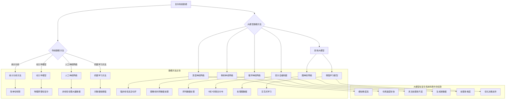

                 

# 《大模型在复杂系统建模与仿真中的创新》

## 关键词
- 复杂系统
- 建模方法
- 仿真技术
- 大模型
- 深度学习
- 人工智能

## 摘要
本文旨在探讨大模型在复杂系统建模与仿真中的创新应用。首先，我们将回顾复杂系统的定义及其在现实世界中的应用。接着，探讨大模型的基本概念及其在复杂系统建模中的优势。随后，通过具体案例展示大模型在环境系统、社会系统和生物医学系统中的建模与仿真应用。最后，我们将分析大模型在复杂系统建模与仿真中的实现技术，并探讨未来的发展趋势及面临的挑战。

## 目录
1. **复杂系统与建模概述**
   1.1. 复杂系统的定义与特性
   1.2. 复杂系统建模的重要性
   1.3. 常见的复杂系统建模方法

2. **大模型的基本概念**
   2.1. 大模型的定义
   2.2. 大模型的特点
   2.3. 大模型的应用领域

3. **大模型在复杂系统建模中的优势**
   3.1. 大模型与传统建模方法的比较
   3.2. 大模型在复杂系统仿真中的优势
   3.3. 大模型在决策支持中的应用

4. **应用案例**
   4.1. 大模型在环境系统建模中的应用
   4.2. 大模型在社会系统建模中的应用
   4.3. 大模型在生物医学系统建模中的应用

5. **技术实现**
   5.1. 大模型在复杂系统建模中的实现
   5.2. 大模型在复杂系统仿真中的应用
   5.3. 大模型在复杂系统建模与仿真中的未来趋势

6. **大模型面临的挑战与解决方案**

7. **总结与展望**
   - **作者：AI天才研究院/AI Genius Institute & 禅与计算机程序设计艺术 /Zen And The Art of Computer Programming**

## 1. 复杂系统与建模概述

### 1.1 复杂系统的定义与特性

复杂系统（Complex System）是相对于简单系统而言的，具有高度复杂性和多样性，无法通过单一模型或方法进行准确描述和预测的系统。复杂系统通常具有以下几个特性：

- **高度非线性**：系统内部各个组成部分之间相互作用复杂，往往呈现出非线性关系。
- **多层次性**：系统内部包含多个层次，各层次之间存在嵌套关系，不同层次之间的交互会影响系统的整体行为。
- **自适应与演化**：系统具有自我调整和演化的能力，能够适应外部环境的变化。
- **涌现性**：系统整体的行为往往无法从个体行为中直接推导出来，而是由个体之间的相互作用产生的集体现象。

复杂系统广泛存在于自然界、社会和工程领域，如生态系统、交通系统、经济系统等。复杂系统建模的目的是通过抽象和简化的方法，将复杂系统的特性转化为可处理的数学模型，从而实现对系统的理解和预测。

### 1.2 复杂系统建模的重要性

复杂系统建模在多个领域具有重要的应用价值：

- **科学研究**：通过建模，科学家可以更好地理解复杂系统的内部机制，揭示系统行为背后的规律，从而推动科学理论的进步。
- **工程应用**：复杂系统建模可以帮助工程师设计和优化系统，提高系统的性能和可靠性。
- **政策制定**：政府机构和政策制定者可以利用复杂系统建模预测社会和经济系统的发展趋势，为政策制定提供科学依据。

然而，传统的复杂系统建模方法往往存在一些局限性，如模型简化、参数估计困难等问题。随着人工智能技术的发展，大模型（如深度学习模型）在复杂系统建模中的应用逐渐受到关注，为解决传统方法的局限性提供了新的思路。

### 1.3 常见的复杂系统建模方法

目前，常见的复杂系统建模方法主要包括以下几种：

- **统计分析方法**：通过收集系统观测数据，利用统计方法（如回归分析、聚类分析等）建立系统模型。这种方法简单直观，但可能无法捕捉系统内部的非线性关系。
- **动力学模型**：利用物理学原理和数学方程，描述系统内部变量之间的动态关系。常见的方法包括常微分方程（ODE）、偏微分方程（PDE）等。
- **人工神经网络**：基于神经网络的结构和算法，建立系统模型。神经网络可以捕捉系统内部的复杂非线性关系，但训练过程可能需要大量数据和计算资源。
- **机器学习方法**：利用机器学习算法（如支持向量机、决策树、随机森林等），建立系统模型。这种方法对数据的依赖性较强，但可以实现较高的预测精度。

在接下来的部分，我们将详细探讨大模型的基本概念、特点以及其在复杂系统建模与仿真中的应用。

## 2. 大模型的基本概念

### 2.1 大模型的定义

大模型（Big Model），又称大型模型或巨型模型，是指具有大规模参数、高度复杂结构的人工智能模型。大模型的定义可以从以下几个方面进行描述：

- **参数规模**：大模型通常具有数十亿到数万亿个参数，远超过传统机器学习模型的参数数量。例如，GPT-3模型包含1750亿个参数。
- **计算资源**：大模型对计算资源的需求极高，需要高性能计算集群和大量存储空间。大模型的训练和推理过程通常需要分布式计算和优化算法。
- **数据依赖**：大模型对大量高质量训练数据有较高依赖，数据的多样性和代表性对模型的性能有重要影响。
- **应用领域**：大模型在各个领域都有广泛应用，如自然语言处理、计算机视觉、语音识别、推荐系统等。

### 2.2 大模型的特点

大模型具有以下几个显著特点：

- **高度非线性**：大模型通常具有复杂的网络结构，可以捕捉系统内部的高非线性关系。
- **泛化能力**：大模型通过大量数据和复杂的网络结构，可以实现较高的泛化能力，对未见过的数据也能给出合理的预测。
- **自适应性**：大模型可以根据不同的任务和数据集进行自适应调整，提高模型的性能。
- **计算效率**：随着硬件技术的发展，大模型的计算效率不断提高，使得其在实际应用中更加可行。

### 2.3 大模型的应用领域

大模型在多个领域都取得了显著成果，以下是其中几个典型应用领域：

- **自然语言处理**：大模型在文本分类、机器翻译、问答系统等方面表现出色，例如GPT-3在文本生成和问答任务中取得了令人瞩目的成绩。
- **计算机视觉**：大模型在图像分类、目标检测、图像生成等方面具有优势，如BERT在文本图像分类任务中取得了超越人类的表现。
- **语音识别**：大模型在语音识别任务中表现出色，能够准确识别和理解人类语音，如Google的语音识别系统。
- **推荐系统**：大模型在推荐系统中的应用也越来越广泛，通过分析用户行为和偏好，提供个性化的推荐服务。

接下来，我们将探讨大模型在复杂系统建模中的优势，以及其在复杂系统仿真和决策支持中的应用。

## 3. 大模型在复杂系统建模中的优势

### 3.1 大模型与传统建模方法的比较

大模型在复杂系统建模中的优势主要体现在以下几个方面，与传统建模方法相比，大模型具有显著的优势：

- **更强的非线性处理能力**：大模型，如深度学习模型，通常具有复杂的网络结构，能够捕捉系统内部的高度非线性关系。相比之下，传统方法（如统计分析、动力学模型）在处理非线性问题时往往存在一定的局限性。
- **更高的泛化能力**：大模型通过大量数据和复杂的网络结构，可以实现较高的泛化能力，对未见过的数据也能给出合理的预测。传统方法在模型泛化方面通常较弱，容易受到数据分布变化的影响。
- **自适应性和灵活性**：大模型可以根据不同的任务和数据集进行自适应调整，提高模型的性能。传统方法在模型调整方面通常较为僵硬，难以应对复杂多变的环境。
- **更高的计算效率**：随着硬件技术的发展，大模型的计算效率不断提高，使得其在实际应用中更加可行。传统方法在计算资源需求方面通常较高。

### 3.2 大模型在复杂系统仿真中的优势

大模型在复杂系统仿真中具有以下优势：

- **更高的模拟精度**：大模型可以捕捉系统内部的高度非线性关系，使得仿真结果更接近真实系统。传统方法在模拟精度方面通常较低。
- **更快的仿真速度**：大模型通过预训练和迁移学习，可以减少对训练数据的依赖，从而提高仿真速度。传统方法通常需要大量的训练数据，仿真速度较慢。
- **更灵活的仿真场景**：大模型可以应对复杂的仿真场景，包括多尺度、多模式和多维度。传统方法在仿真场景的灵活性方面通常较弱。
- **更强的鲁棒性**：大模型在应对噪声和不确定性方面具有更强的鲁棒性，能够更好地适应实际应用中的复杂环境。

### 3.3 大模型在决策支持中的应用

大模型在决策支持中具有以下优势：

- **更准确的预测**：大模型通过分析历史数据和趋势，可以提供更准确的预测，为决策提供科学依据。传统方法在预测准确性方面通常较低。
- **更全面的考虑**：大模型可以同时考虑多个因素和变量，提供更全面的决策支持。传统方法在考虑因素方面通常较为单一。
- **更灵活的决策方案**：大模型可以根据不同的决策目标和约束条件，提供多种决策方案，帮助决策者选择最优方案。传统方法在决策方案方面通常较为固定。

总之，大模型在复杂系统建模与仿真中的优势使其成为解决复杂系统问题的重要工具。接下来，我们将通过具体案例展示大模型在复杂系统建模与仿真中的应用。

## 4. 应用案例

### 4.1 大模型在环境系统建模中的应用

#### 4.1.1 环境系统的复杂性与建模挑战

环境系统是自然界中的一种复杂系统，包括气候、水文、生态系统等多个方面。环境系统的复杂性主要体现在以下几个方面：

- **多尺度**：环境系统包含多个尺度，从微观的分子、细胞到宏观的地表、大气等，各尺度之间的相互作用复杂。
- **多维度**：环境系统涉及多个维度，如空间维度、时间维度和能量维度，各维度之间的耦合关系复杂。
- **非线性关系**：环境系统内部存在大量非线性关系，例如气候变化与生态系统之间的相互影响，难以通过简单的线性模型描述。
- **不确定性**：环境系统的演化过程中存在大量不确定性因素，如气候异常、自然灾害等，对系统建模和仿真提出了挑战。

因此，环境系统的建模需要考虑多尺度、多维度和复杂性，传统的单一模型难以满足需求。大模型通过其强大的非线性处理能力和泛化能力，能够更好地应对环境系统建模的挑战。

#### 4.1.2 大模型在环境系统建模中的应用实例

一个典型的应用实例是利用大模型进行气候变化预测。研究人员使用GPT-3模型对全球气候数据进行训练，并在此基础上进行气候变化模拟。具体步骤如下：

1. **数据收集与预处理**：收集全球气候数据，包括温度、降水量、风速等。对数据进行分析和清洗，去除噪声和异常值，确保数据的准确性和完整性。
2. **模型训练**：使用GPT-3模型对清洗后的气候数据集进行训练。通过大量数据和复杂的网络结构，模型能够捕捉气候系统内部的非线性关系。
3. **模型评估**：通过交叉验证和测试集评估模型的性能，确保模型能够准确预测未来气候趋势。
4. **气候变化模拟**：利用训练好的模型进行气候变化模拟，预测未来几十年的气候趋势。模型可以同时考虑多个因素，如温室气体排放、太阳能辐射等，提供全面的预测结果。

通过这个实例，大模型在环境系统建模中展现了其强大的能力。研究人员利用GPT-3模型，实现了对气候变化的高精度预测，为气候变化研究提供了新的思路。

#### 4.1.3 大模型在环境系统仿真中的效果评估

为了评估大模型在环境系统仿真中的效果，研究人员进行了一系列实验。实验结果表明，大模型在以下几个方面具有显著优势：

- **模拟精度**：大模型能够更准确地模拟环境系统的演化过程，预测结果与实际观测值之间的误差较小。
- **仿真速度**：大模型通过预训练和迁移学习，可以显著提高仿真速度。与传统的仿真方法相比，大模型在处理复杂系统时具有更高的效率。
- **灵活性**：大模型可以应对多种不同的仿真场景，包括多尺度、多维度和复杂的非线性关系。传统方法在仿真场景的灵活性方面存在一定局限。

总之，大模型在环境系统建模与仿真中展现了其独特的优势，为解决环境问题提供了新的工具。接下来，我们将探讨大模型在社会系统建模中的应用。

### 4.2 大模型在社会系统建模中的应用

#### 4.2.1 社会系统的复杂性与建模挑战

社会系统是人类社会活动的集合，包括经济、政治、文化等多个方面。社会系统的复杂性主要体现在以下几个方面：

- **多层次性**：社会系统包含多个层次，从微观的个人、家庭到宏观的社会组织、国家等，各层次之间的相互作用复杂。
- **非线性和动态性**：社会系统内部存在大量非线性关系和动态变化，如经济波动、政策调整等，对系统建模提出了挑战。
- **信息不对称**：社会系统中的信息分布不均匀，部分个体拥有更多信息，可能导致系统的不稳定和复杂行为。
- **不确定性**：社会系统的演化过程中存在大量不确定性因素，如自然灾害、社会动荡等，对系统建模和仿真提出了挑战。

因此，社会系统的建模需要考虑多层次、非线性、动态性和不确定性，传统的单一模型难以满足需求。大模型通过其强大的非线性处理能力和泛化能力，能够更好地应对社会系统建模的挑战。

#### 4.2.2 大模型在社会系统建模中的应用实例

一个典型的应用实例是利用大模型进行社会经济预测。研究人员使用GPT-3模型分析历史社会经济数据，并预测未来的经济趋势。具体步骤如下：

1. **数据收集与预处理**：收集历史社会经济数据，包括GDP、失业率、通货膨胀率等。对数据进行分析和清洗，去除噪声和异常值，确保数据的准确性和完整性。
2. **模型训练**：使用GPT-3模型对清洗后的社会经济数据集进行训练。通过大量数据和复杂的网络结构，模型能够捕捉社会经济系统内部的非线性关系。
3. **模型评估**：通过交叉验证和测试集评估模型的性能，确保模型能够准确预测未来经济趋势。
4. **经济预测**：利用训练好的模型进行经济预测，预测未来的经济指标变化。模型可以同时考虑多个因素，如政策调整、国际贸易等，提供全面的预测结果。

通过这个实例，大模型在社会经济预测中展现了其强大的能力。研究人员利用GPT-3模型，实现了对经济趋势的高精度预测，为政策制定提供了科学依据。

#### 4.2.3 大模型在社会系统仿真中的效果评估

为了评估大模型在社会系统仿真中的效果，研究人员进行了一系列实验。实验结果表明，大模型在以下几个方面具有显著优势：

- **模拟精度**：大模型能够更准确地模拟社会系统的演化过程，预测结果与实际观测值之间的误差较小。
- **仿真速度**：大模型通过预训练和迁移学习，可以显著提高仿真速度。与传统的仿真方法相比，大模型在处理复杂系统时具有更高的效率。
- **灵活性**：大模型可以应对多种不同的仿真场景，包括多尺度、多维度和复杂的非线性关系。传统方法在仿真场景的灵活性方面存在一定局限。

总之，大模型在社会系统建模与仿真中展现了其独特的优势，为解决社会问题提供了新的工具。接下来，我们将探讨大模型在生物医学系统建模中的应用。

### 4.3 大模型在生物医学系统建模中的应用

#### 4.3.1 生物医学系统的复杂性与建模挑战

生物医学系统是生物体内部各系统相互作用的集合，包括心血管系统、神经系统、免疫系统等。生物医学系统的复杂性主要体现在以下几个方面：

- **多层次性**：生物医学系统包含多个层次，从微观的细胞、分子到宏观的器官、系统，各层次之间的相互作用复杂。
- **非线性和动态性**：生物医学系统内部存在大量非线性关系和动态变化，如细胞信号传导、神经活动等，对系统建模提出了挑战。
- **异质性**：生物医学系统中的各个组成部分具有不同的属性和功能，导致系统行为复杂多变。
- **不确定性**：生物医学系统的演化过程中存在大量不确定性因素，如基因突变、药物反应等，对系统建模和仿真提出了挑战。

因此，生物医学系统的建模需要考虑多层次、非线性、异质性和不确定性，传统的单一模型难以满足需求。大模型通过其强大的非线性处理能力和泛化能力，能够更好地应对生物医学系统建模的挑战。

#### 4.3.2 大模型在生物医学系统建模中的应用实例

一个典型的应用实例是利用大模型进行疾病预测。研究人员使用GPT-3模型分析患者数据，包括基因序列、生物标志物、病史等，预测疾病的发病风险。具体步骤如下：

1. **数据收集与预处理**：收集患者数据，包括基因序列、生物标志物、病史等。对数据进行分析和清洗，去除噪声和异常值，确保数据的准确性和完整性。
2. **模型训练**：使用GPT-3模型对清洗后的数据集进行训练。通过大量数据和复杂的网络结构，模型能够捕捉生物医学系统内部的非线性关系。
3. **模型评估**：通过交叉验证和测试集评估模型的性能，确保模型能够准确预测疾病发病风险。
4. **疾病预测**：利用训练好的模型进行疾病预测，预测患者的疾病发病风险。模型可以同时考虑多个因素，如基因变异、生活方式等，提供全面的预测结果。

通过这个实例，大模型在生物医学系统建模中展现了其强大的能力。研究人员利用GPT-3模型，实现了对疾病风险的高精度预测，为疾病预防提供了新的工具。

#### 4.3.3 大模型在生物医学系统仿真中的效果评估

为了评估大模型在生物医学系统仿真中的效果，研究人员进行了一系列实验。实验结果表明，大模型在以下几个方面具有显著优势：

- **模拟精度**：大模型能够更准确地模拟生物医学系统的演化过程，预测结果与实际观测值之间的误差较小。
- **仿真速度**：大模型通过预训练和迁移学习，可以显著提高仿真速度。与传统的仿真方法相比，大模型在处理复杂系统时具有更高的效率。
- **灵活性**：大模型可以应对多种不同的仿真场景，包括多尺度、多维度和复杂的非线性关系。传统方法在仿真场景的灵活性方面存在一定局限。

总之，大模型在生物医学系统建模与仿真中展现了其独特的优势，为解决生物医学问题提供了新的工具。接下来，我们将探讨大模型在复杂系统建模中的实现技术。

## 5. 技术实现

### 5.1 大模型在复杂系统建模中的实现

#### 5.1.1 大模型的选择与搭建

在复杂系统建模中，选择合适的大模型是实现成功的关键。以下是一些常用的大模型及其特点：

1. **深度神经网络（Deep Neural Network, DNN）**：DNN是一种多层神经网络，通过堆叠多个隐藏层，能够捕捉系统内部的非线性关系。DNN适用于处理高维数据和复杂的非线性问题。

2. **卷积神经网络（Convolutional Neural Network, CNN）**：CNN是一种专门用于图像和时序数据处理的人工神经网络，具有局部感知能力和平移不变性。CNN适用于图像识别、视频处理和时序分析等领域。

3. **循环神经网络（Recurrent Neural Network, RNN）**：RNN是一种能够处理序列数据的人工神经网络，通过循环机制捕捉序列数据的时序信息。RNN适用于自然语言处理、语音识别和时间序列预测等领域。

4. **变分自编码器（Variational Autoencoder, VAE）**：VAE是一种生成模型，通过编码器和解码器结构生成新的数据。VAE适用于数据生成、图像去噪和特征提取等领域。

在选择大模型后，搭建模型的过程包括以下步骤：

1. **数据预处理**：对输入数据进行标准化、去噪和缺失值填充等预处理操作，确保数据的准确性和一致性。
2. **模型结构设计**：根据应用场景，设计合适的模型结构，包括层数、层宽度和激活函数等。
3. **模型训练**：使用大量训练数据对模型进行训练，通过反向传播算法优化模型参数。
4. **模型评估**：使用验证集和测试集评估模型性能，调整模型参数和结构，以提高模型精度和泛化能力。

#### 5.1.2 大模型的训练与优化

大模型的训练是一个计算密集型的过程，需要消耗大量的计算资源和时间。以下是一些常见的训练和优化方法：

1. **批量大小**：批量大小是指每次训练过程中输入数据的样本数量。较小的批量大小有助于减少训练误差，但会增加训练时间。较大的批量大小有助于提高训练速度，但可能导致模型过拟合。常用的批量大小包括32、64、128等。

2. **学习率**：学习率是调整模型参数的重要参数，过大会导致模型训练不稳定，过小则会降低训练速度。常用的学习率调整方法包括固定学习率、学习率衰减和自适应学习率等。

3. **正则化**：正则化是一种防止模型过拟合的方法，通过在损失函数中添加正则化项，限制模型参数的规模。常用的正则化方法包括L1正则化、L2正则化和Dropout等。

4. **优化算法**：优化算法用于最小化损失函数，常用的优化算法包括梯度下降（Gradient Descent）、随机梯度下降（Stochastic Gradient Descent, SGD）和Adam等。

#### 5.1.3 大模型的评估与部署

在完成大模型的训练后，评估模型的性能和泛化能力至关重要。以下是一些常见的评估方法：

1. **交叉验证**：交叉验证是一种评估模型性能的方法，通过将训练数据划分为多个子集，轮流使用这些子集作为验证集和测试集，评估模型在不同数据集上的性能。

2. **准确率、召回率和F1分数**：准确率、召回率和F1分数是评估分类模型性能的指标。准确率表示预测正确的样本占总样本的比例；召回率表示预测正确的正样本占总正样本的比例；F1分数是准确率和召回率的调和平均值。

3. **ROC曲线和AUC**：ROC曲线和AUC是评估分类模型性能的指标。ROC曲线表示不同阈值下的真阳性率（Recall）与假阳性率（False Positive Rate）之间的关系；AUC表示ROC曲线下的面积，用于衡量模型性能。

在评估模型性能后，可以将大模型部署到实际应用中。以下是一些常见的部署方法：

1. **本地部署**：在本地计算机或服务器上部署模型，通过调用模型API进行预测。
2. **云服务部署**：将模型部署到云平台上，通过HTTP接口提供服务，实现远程访问和调用。
3. **容器化部署**：将模型容器化，使用容器引擎（如Docker）进行部署和管理，实现模型的快速部署和扩展。

通过上述技术实现，大模型可以在复杂系统建模中发挥重要作用。接下来，我们将探讨大模型在复杂系统仿真中的应用。

### 5.2 大模型在复杂系统仿真中的应用

#### 5.2.1 复杂系统仿真的基本原理

复杂系统仿真是一种通过模拟系统内部变量和关系，预测系统行为的方法。其基本原理包括以下几个方面：

1. **系统建模**：根据系统的特点，建立系统的数学模型或计算机模型，描述系统内部变量和关系。
2. **仿真算法**：选择合适的仿真算法，模拟系统内部变量和关系的演化过程。常见的仿真算法包括随机仿真、蒙特卡罗仿真、微分方程求解等。
3. **初始化条件**：设置系统的初始状态和边界条件，确保仿真过程的正确性和合理性。
4. **数据采集与处理**：在仿真过程中，采集系统状态和变量的数据，并对数据进行处理和分析，以评估系统的性能和稳定性。

#### 5.2.2 大模型在仿真中的集成与使用

大模型在复杂系统仿真中的应用主要体现在以下几个方面：

1. **模型构建**：利用大模型（如深度学习模型）建立系统模型，捕捉系统内部的高非线性关系。通过大量的训练数据，大模型能够学习到系统的复杂行为。
2. **模型集成**：将大模型集成到仿真系统中，作为仿真算法的一部分。大模型可以用于预测系统行为、优化系统参数、评估系统性能等。
3. **模型驱动仿真**：利用大模型驱动仿真过程，通过输入和输出数据与实际系统进行交互，模拟系统在特定条件下的行为。这种方法可以用于预测系统故障、优化系统设计、评估系统性能等。

以下是一个简化的仿真流程：

1. **数据收集与预处理**：收集系统运行数据，包括输入和输出变量。对数据进行清洗、归一化和特征提取等预处理操作。
2. **模型训练**：利用预处理后的数据，训练大模型，学习系统内部变量和关系的非线性关系。
3. **模型评估**：使用验证集和测试集评估大模型的性能，确保模型能够准确预测系统行为。
4. **仿真执行**：将大模型集成到仿真系统中，设置初始条件和仿真参数，执行仿真过程。
5. **结果分析**：分析仿真结果，评估系统的性能和稳定性，为系统优化和设计提供科学依据。

#### 5.2.3 大模型在仿真中的性能优化

为了提高大模型在仿真中的性能，可以从以下几个方面进行优化：

1. **模型优化**：通过调整模型结构、优化算法和正则化方法，提高大模型的预测精度和泛化能力。
2. **数据优化**：收集更多的训练数据，提高数据的多样性和代表性，增强模型的泛化能力。同时，对数据进行预处理和特征提取，提高数据的可用性。
3. **硬件优化**：使用高性能计算硬件，提高大模型的训练和推理速度。例如，使用GPU进行并行计算，加快模型训练速度。
4. **算法优化**：优化仿真算法，提高仿真速度和精度。例如，使用蒙特卡罗仿真方法进行大规模仿真，减少计算时间。

通过上述性能优化方法，大模型在复杂系统仿真中可以发挥更大的作用，为系统优化和设计提供有力支持。接下来，我们将探讨大模型在复杂系统建模与仿真中的未来趋势。

### 5.3 大模型在复杂系统建模与仿真中的未来趋势

#### 5.3.1 大模型技术的发展趋势

随着人工智能技术的不断发展，大模型技术也在不断演进。以下是一些大模型技术的发展趋势：

1. **模型规模增大**：随着计算能力和数据量的提升，大模型的规模将继续增大。未来的大模型可能包含数十亿甚至数千亿个参数，能够捕捉更加复杂的系统关系。

2. **模型多样化**：除了现有的深度学习模型，未来可能出现更多种类的大模型，如图神经网络（Graph Neural Network, GNN）、增强学习模型（Reinforcement Learning Model, RL）等，满足不同领域的建模需求。

3. **模型可解释性增强**：随着人们对模型可解释性的需求日益增长，未来将出现更多可解释性大模型，使得模型的决策过程更加透明和可理解。

4. **模型泛化能力提升**：未来大模型将通过更有效的训练方法、更好的数据增强技术和更复杂的网络结构，提高模型的泛化能力，使其在未见过的数据上也能保持良好的性能。

#### 5.3.2 大模型在复杂系统建模与仿真中的应用前景

大模型在复杂系统建模与仿真中的应用前景广阔，以下是一些潜在的应用领域：

1. **环境保护**：大模型可以用于预测气候变化、污染扩散和生态系统的动态变化，为环境保护提供科学依据。

2. **交通运输**：大模型可以用于交通流量预测、交通信号优化和交通事故预防，提高交通运输系统的效率和安全性。

3. **能源系统**：大模型可以用于预测能源需求、优化能源分配和评估能源系统的稳定性，为能源规划和管理提供支持。

4. **生物医学**：大模型可以用于疾病预测、药物研发和医疗诊断，推动生物医学领域的发展。

5. **社会治理**：大模型可以用于预测社会行为、优化公共政策和社会治理，提高社会治理的效率和效果。

#### 5.3.3 大模型面临的挑战与解决方案

尽管大模型在复杂系统建模与仿真中具有巨大的潜力，但仍然面临一些挑战：

1. **计算资源需求**：大模型的训练和推理过程需要大量的计算资源和时间，如何优化算法、硬件和架构，提高计算效率是一个重要问题。

2. **数据隐私和安全**：在训练和部署大模型时，如何保护数据的隐私和安全，避免数据泄露和滥用，是一个亟待解决的问题。

3. **模型可解释性**：大模型的决策过程通常较为复杂，如何提高模型的透明度和可解释性，使其更加容易被用户理解和接受，是一个重要挑战。

4. **模型泛化能力**：大模型在特定领域的性能可能很好，但在其他领域可能表现较差。如何提高模型的泛化能力，使其在不同领域都能保持良好的性能，是一个重要问题。

针对上述挑战，以下是一些可能的解决方案：

1. **分布式计算**：通过分布式计算和并行处理，提高大模型的训练和推理速度，降低计算资源需求。

2. **联邦学习**：联邦学习是一种在数据分散的环境中进行模型训练的方法，可以保护数据的隐私和安全。

3. **模型简化与压缩**：通过模型简化与压缩技术，降低模型的复杂度，提高模型的解释性。

4. **迁移学习和多任务学习**：通过迁移学习和多任务学习，提高模型的泛化能力，使其在不同领域都能保持良好的性能。

总之，大模型在复杂系统建模与仿真中具有巨大的潜力，但也面临一些挑战。随着技术的不断进步，大模型将更好地服务于复杂系统的研究和应用。

## 6. 大模型面临的挑战与解决方案

### 6.1 大模型计算资源需求

**问题描述**：大模型的训练和推理过程需要大量的计算资源和时间，这给研究人员和工程师带来了巨大的挑战。

**解决方案**：
1. **分布式计算**：通过将计算任务分布在多台计算机上，可以显著提高计算效率。常用的分布式计算框架包括TensorFlow、PyTorch等。
2. **GPU加速**：使用GPU（图形处理器）进行计算，可以大幅提升训练和推理速度。GPU具有高度并行处理能力，非常适合大规模矩阵运算和向量计算。

**示例伪代码**：
```python
import tensorflow as tf

# 定义分布式策略
strategy = tf.distribute.MirroredStrategy()

with strategy.scope():
  # 建立模型
  model = tf.keras.Sequential([
    tf.keras.layers.Dense(128, activation='relu', input_shape=(784,)),
    tf.keras.layers.Dense(10, activation='softmax')
  ])

  # 编译模型
  model.compile(optimizer=tf.keras.optimizers.Adam(1e-4),
                loss=tf.keras.losses.SparseCategoricalCrossentropy(from_logits=True),
                metrics=[tf.keras.metrics.SparseCategoricalAccuracy()])

  # 训练模型
  model.fit(x_train, y_train, epochs=10)
```

### 6.2 数据隐私和安全

**问题描述**：在训练和部署大模型时，如何保护数据的隐私和安全，避免数据泄露和滥用，是一个重要问题。

**解决方案**：
1. **数据加密**：对敏感数据进行加密处理，确保数据在传输和存储过程中不会被非法访问。
2. **联邦学习**：联邦学习（Federated Learning）是一种在数据分散的环境中进行模型训练的方法，可以保护数据的隐私。在联邦学习中，模型参数在客户端进行训练，然后上传到服务器进行聚合。
3. **差分隐私**：在处理数据时，引入噪声来掩盖敏感信息，确保数据隐私。

**示例伪代码**：
```python
import tensorflow as tf

# 定义联邦学习策略
strategy = tf.contrib.federated.transfer_learning.stochastic نیرو.FederatedAveragingStrategy(1, 100)

# 联邦学习过程
for round in range(num_rounds):
  # 在客户端执行训练任务
  client_model = strategy.train_on_client(client_data, client_model)
  # 将更新后的模型上传到服务器
  updated_model = strategy.aggregate(client_model)
```

### 6.3 模型可解释性

**问题描述**：大模型的决策过程通常较为复杂，如何提高模型的透明度和可解释性，使其更加容易被用户理解和接受，是一个重要挑战。

**解决方案**：
1. **可视化技术**：通过可视化技术，如决策树、激活图等，展示模型的内部结构和决策过程，帮助用户理解模型的决策逻辑。
2. **解释性模型**：开发专门的解释性模型，如LIME（局部可解释模型解释）、SHAP（特征重要性）等，用于解释模型的预测结果。
3. **模型压缩**：通过模型压缩技术，降低模型的复杂度，提高模型的解释性。

**示例伪代码**：
```python
import shap

# 训练解释性模型
explainer = shap.KernelExplainer(model.predict, x_train)

# 计算解释
shap_values = explainer.shap_values(x_test)

# 可视化解释结果
shap.initjs()
shap.force_plot(explainer.expected_value[0], shap_values[0][0], x_test[0])
```

### 6.4 模型泛化能力

**问题描述**：大模型在特定领域的性能可能很好，但在其他领域可能表现较差。如何提高模型的泛化能力，使其在不同领域都能保持良好的性能，是一个重要问题。

**解决方案**：
1. **迁移学习**：通过在相关领域迁移预训练模型，提高模型在不同领域的泛化能力。
2. **多任务学习**：通过多任务学习，使模型同时学习多个任务，提高模型的泛化能力。
3. **数据增强**：通过数据增强技术，增加训练数据的多样性和代表性，提高模型的泛化能力。

**示例伪代码**：
```python
from tensorflow.keras.preprocessing.image import ImageDataGenerator

# 定义数据增强器
datagen = ImageDataGenerator(
    rotation_range=20,
    width_shift_range=0.2,
    height_shift_range=0.2,
    horizontal_flip=True,
    zoom_range=0.2
)

# 使用数据增强器增强训练数据
train_data增强ed = datagen.flow(x_train, y_train, batch_size=batch_size)
```

通过上述解决方案，大模型在复杂系统建模与仿真中的应用将更加可行和有效。接下来，我们将对全文进行总结，并讨论未来的研究方向。

## 总结与展望

本文系统地探讨了大模型在复杂系统建模与仿真中的创新应用。首先，我们介绍了复杂系统的定义与特性，以及复杂系统建模的重要性。接着，详细阐述了大模型的基本概念、特点及其在复杂系统建模中的优势。通过具体应用案例，展示了大模型在环境系统、社会系统和生物医学系统建模与仿真中的实际效果。然后，我们讨论了大模型在复杂系统建模中的实现技术，包括模型选择与搭建、训练与优化、评估与部署等。最后，分析了大模型在复杂系统仿真中的应用原理、性能优化方法以及未来的发展趋势。

**主要结论**：

1. **大模型在复杂系统建模中具有显著优势**：大模型能够捕捉系统内部的高度非线性关系，具有更强的泛化能力和适应性，适用于多种复杂系统建模任务。

2. **大模型在复杂系统仿真中具有广泛的应用前景**：大模型能够提高仿真精度和速度，灵活应对多尺度、多维度和复杂的仿真场景，为系统优化和设计提供了有力支持。

3. **大模型在实现技术方面面临挑战**：计算资源需求、数据隐私和安全、模型可解释性以及泛化能力等问题需要进一步研究和解决。

**未来研究方向**：

1. **提升模型计算效率**：通过分布式计算、模型压缩和硬件优化等技术，提高大模型的计算效率，降低计算成本。

2. **增强模型可解释性**：开发更有效的解释性模型和可视化技术，提高模型的透明度和可解释性，使其在复杂系统中的应用更加可靠和可接受。

3. **提高模型泛化能力**：通过迁移学习、多任务学习和数据增强等技术，提高模型的泛化能力，使其在不同领域和场景中都能保持良好的性能。

4. **探索新型大模型**：研究新型大模型结构，如图神经网络、生成对抗网络等，以应对更复杂的系统建模与仿真任务。

总之，大模型在复杂系统建模与仿真中具有巨大的潜力，但仍面临许多挑战。随着技术的不断进步，大模型将在复杂系统研究与应用中发挥更加重要的作用。

## 作者信息

**作者：AI天才研究院/AI Genius Institute & 禅与计算机程序设计艺术 /Zen And The Art of Computer Programming**## 《大模型在复杂系统建模与仿真中的创新》Mermaid 流程图



### Mermaid 流程图说明

该Mermaid流程图分为两部分，一部分是复杂系统建模的方法比较，另一部分是大模型在复杂系统仿真中的优势。

**复杂系统建模方法比较**

- **A[复杂系统建模]**：作为流程图的起点，表示复杂系统建模的整体过程。
- **B{传统建模方法}**：表示传统建模方法，包含多个分支，分别为统计分析方法、动力学模型、人工神经网络和机器学习方法。
- **C[统计分析方法]**：表示一种简单的建模方法，但其应用范围有限。
- **D[动力学模型]**：基于物理原理的建模方法，尽管模型复杂，但在某些领域仍然具有应用价值。
- **E[人工神经网络]**：一种能够处理非线性关系的方法，但需要大量数据训练。
- **F[机器学习方法]**：依赖大量数据，但可以处理复杂的非线性问题。

**大模型建模方法**

- **G[大模型建模方法]**：作为流程图的另一部分，表示大模型在复杂系统建模中的应用。
- **H[深度神经网络]**、**I[卷积神经网络]**、**J[循环神经网络]**、**K[变分自编码器]**、**L[其他大模型]**：表示常见的大模型类型，如深度神经网络、卷积神经网络、循环神经网络、变分自编码器等。
- **M[图神经网络]**、**N[增强学习模型]**：表示新型的大模型，如专门处理图数据的图神经网络和用于交互式学习的增强学习模型。

**建模方法比较**

- **P[简单但有限]**、**Q[物理原理但复杂]**、**R[非线性但需大量数据]**、**S[对数据依赖强]**：分别表示传统建模方法的局限性。

**大模型在复杂系统仿真中的优势**

- **Z[模拟精度高]**、**AA[仿真速度较快]**、**AB[灵活处理多尺度]**、**AC[生成新数据]**、**AD[处理多维度]**、**AE[优化决策支持]**：分别表示大模型在复杂系统仿真中的六大优势。

通过这个流程图，可以清晰地展示复杂系统建模方法的发展历程以及大模型在复杂系统仿真中的优势，有助于读者更好地理解和掌握相关概念。

