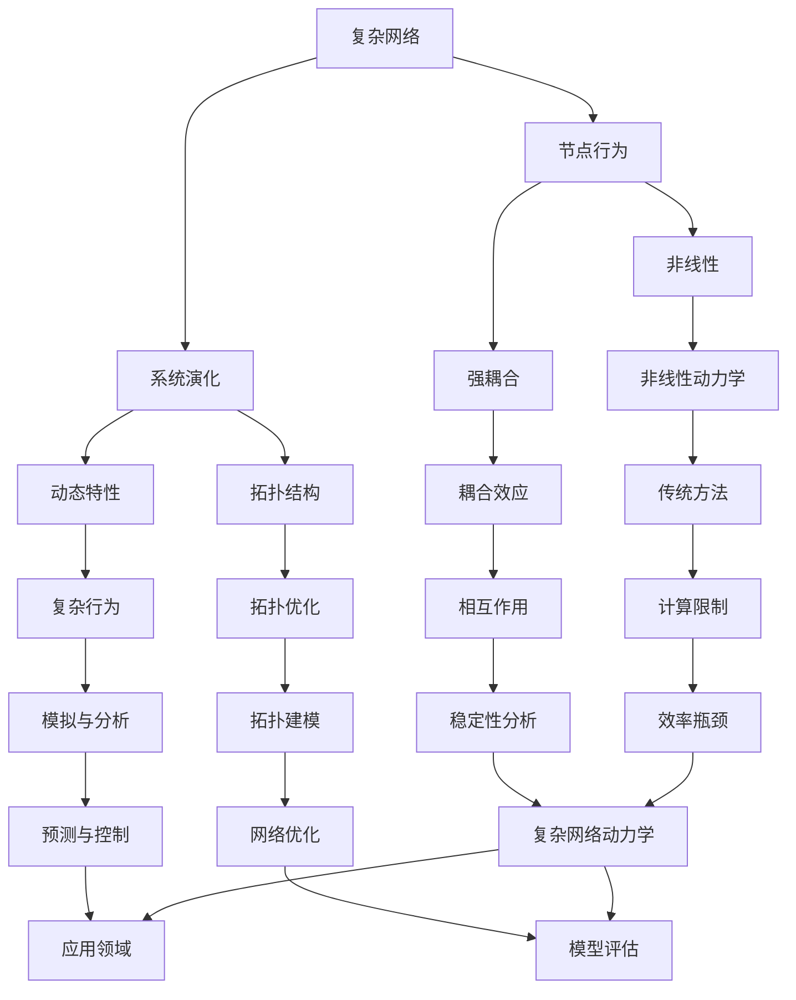

                 


### 文章标题

《大模型在复杂网络动力学中的创新》

### 文章关键词

大模型、复杂网络动力学、神经网络、深度学习、建模、分析、控制、量子计算、区块链

### 文章摘要

本文深入探讨了大模型在复杂网络动力学中的应用与创新。首先，我们回顾了复杂网络动力学的基础概念和传统方法，然后介绍了大模型的发展背景及其在复杂网络动力学中的潜在应用。随后，本文详细分析了大模型的数学基础、学习算法、评估与优化方法，并通过具体的数学模型和公式讲解了其核心算法原理。接着，本文展示了大模型在复杂网络建模、分析、控制中的应用实例，并介绍了新的模型架构与创新算法。最后，本文探讨了未来发展方向与趋势，包括大模型与量子计算、区块链的应用，以及其在人工智能社会治理中的潜在影响。

### 目录

1. **引论**
   - **1.1 复杂网络动力学概述**
   - **1.2 大模型的发展背景**
   - **1.3 大模型在复杂网络动力学中的应用现状**
   
2. **大模型基础理论**
   - **2.1 大模型的数学基础**
     - **2.1.1 神经网络基础**
     - **2.1.2 深度学习基础**
     - **2.1.3 大模型的架构与特性**
   - **2.2 大模型的学习算法**
     - **2.2.1 梯度下降法**
     - **2.2.2 随机梯度下降法**
     - **2.2.3 算法改进与优化**
   - **2.3 大模型的评估与优化**
     - **2.3.1 评估指标**
     - **2.3.2 优化方法**

3. **大模型在复杂网络动力学中的应用**
   - **3.1 大模型在复杂网络建模中的应用**
     - **3.1.1 复杂网络模型概述**
     - **3.1.2 大模型在建模中的优势**
     - **3.1.3 模型应用案例**
   - **3.2 大模型在复杂网络分析中的应用**
     - **3.2.1 复杂网络分析概述**
     - **3.2.2 大模型在分析中的优势**
     - **3.2.3 分析应用案例**
   - **3.3 大模型在复杂网络控制中的应用**
     - **3.3.1 复杂网络控制概述**
     - **3.3.2 大模型在控制中的优势**
     - **3.3.3 控制应用案例**

4. **大模型在复杂网络动力学中的创新**
   - **4.1 新模型架构与创新算法**
     - **4.1.1 网络感知大模型**
     - **4.1.2 动力学优化大模型**
     - **4.1.3 深度强化学习在复杂网络中的应用**
   - **4.2 新应用领域与挑战**
     - **4.2.1 能源网络优化**
     - **4.2.2 交通网络调度**
     - **4.2.3 生态系统建模**
   - **4.3 未来发展方向与趋势**
     - **4.3.1 大模型与量子计算**
     - **4.3.2 大模型与区块链**
     - **4.3.3 大模型在人工智能社会治理中的应用**

### 第一部分：引论

#### 1.1 复杂网络动力学概述

复杂网络动力学是近年来备受关注的研究领域，它涉及网络结构、节点行为和系统演化等多个方面。复杂网络通常具有高度非线性、强耦合和动态特性，其动力学行为表现为复杂且多样化的现象。这些特性使得复杂网络动力学在许多领域具有广泛的应用，如社会网络分析、通信网络优化、生物网络建模等。

复杂网络动力学的研究可以追溯到20世纪中期，从最初的图论和网络理论，逐渐发展出多种数学模型和方法，如微分方程、差分方程、代数方法等。传统方法在处理简单网络时具有较好的效果，但在面对大规模、高维的复杂网络时，往往表现出计算效率和精度不足的问题。

#### 1.2 大模型的发展背景

大模型是指具有大规模参数和高复杂度的神经网络模型，如Transformer、BERT、GPT等。自2010年代以来，随着计算能力的提升和数据量的增加，大模型在自然语言处理、计算机视觉、语音识别等领域取得了显著的突破。大模型能够通过自动学习数据中的复杂模式和规律，实现高性能的预测和决策。

大模型的发展得益于多个关键技术的进步，包括：
- **计算能力的提升**：高性能计算硬件（如GPU、TPU）的普及，使得大模型训练和推理变得更加高效。
- **数据集的扩充**：大规模数据集的收集和共享，为大模型的学习提供了丰富的素材。
- **深度学习算法的优化**：如优化算法、正则化技术等，提高了大模型的训练效果和泛化能力。

#### 1.3 大模型在复杂网络动力学中的应用现状

随着大模型的发展，其在复杂网络动力学中的应用也逐步展开。大模型在复杂网络建模、分析、控制等方面展现出显著的优势，具体包括：

- **建模**：大模型能够自动提取网络中的潜在结构和模式，为复杂网络的建模提供了一种新的方法。例如，使用Transformer模型对社交网络进行建模，可以捕捉节点之间的动态关系。
- **分析**：大模型可以高效地处理大规模网络数据，对网络的拓扑特性、传播行为等进行深入分析。例如，使用GPT模型对网络流量进行预测和分析，可以帮助优化网络资源分配。
- **控制**：大模型可以用于设计复杂网络的控制器，实现对网络行为的主动调节。例如，使用深度强化学习模型对交通网络进行控制，可以缓解交通拥堵问题。

然而，大模型在复杂网络动力学中的应用仍面临一些挑战，如模型的可解释性、计算效率、鲁棒性等。未来，随着大模型技术的不断进步，其在复杂网络动力学中的应用将更加广泛和深入。以下是复杂网络动力学中的核心概念与联系，以及其与传统方法的对比，我们将使用Mermaid流程图来展示：



通过Mermaid流程图，我们可以清晰地看到复杂网络动力学中的核心概念与联系，以及大模型与传统方法的对比。接下来，我们将详细分析大模型的数学基础、学习算法、评估与优化方法，并使用伪代码和latex公式来阐述核心算法原理。在接下来的章节中，我们将深入探讨大模型在复杂网络动力学中的应用实例，展示其在建模、分析、控制等领域的实际应用效果。

#### 2.1 大模型的数学基础

大模型通常指的是参数规模在数百万至数十亿的神经网络，如Transformer、BERT、GPT等。这类模型在深度学习和复杂系统建模中表现出色，其成功的背后离不开坚实的数学基础。本节将介绍大模型的主要数学基础，包括神经网络基础、深度学习基础以及大模型的架构与特性。

##### 2.1.1 神经网络基础

神经网络（Neural Networks）是一种模仿生物神经系统的计算模型，由大量的神经元（也称为节点或单元）通过加权连接组成。每个神经元接收来自其他神经元的输入信号，并通过一个激活函数产生输出。

**基本结构**：

1. **输入层**：接收外部输入数据。
2. **隐藏层**：对输入数据进行特征提取和变换。
3. **输出层**：产生最终的预测或决策。

**激活函数**：

神经网络中的激活函数用来引入非线性，常见的激活函数包括：
- **Sigmoid函数**：$$f(x) = \frac{1}{1 + e^{-x}}$$
- **ReLU函数**：$$f(x) = max(0, x)$$
- **Tanh函数**：$$f(x) = \frac{e^x - e^{-x}}{e^x + e^{-x}}$$

**神经网络的工作原理**：

输入数据通过加权连接传递到隐藏层，每个隐藏层节点将输入进行线性组合，并应用激活函数。经过多个隐藏层处理后，最终输出层的节点产生预测或决策。

##### 2.1.2 深度学习基础

深度学习（Deep Learning）是神经网络的一种扩展，它通过堆叠多个隐藏层来学习更复杂的特征表示。深度学习的核心是训练过程，即通过大量的训练数据来调整网络中的权重，使模型能够在未知数据上产生准确的预测。

**损失函数**：

损失函数用于量化模型预测与真实值之间的差异。常见的损失函数包括：
- **均方误差（MSE）**：$$MSE(y, \hat{y}) = \frac{1}{n}\sum_{i=1}^{n}(y_i - \hat{y}_i)^2$$
- **交叉熵损失（Cross-Entropy Loss）**：$$CE(y, \hat{y}) = -\sum_{i=1}^{n}y_i \log(\hat{y}_i)$$

**优化算法**：

优化算法用于最小化损失函数。常用的优化算法包括：
- **梯度下降（Gradient Descent）**：$$\theta_{t+1} = \theta_{t} - \alpha \cdot \nabla_{\theta}J(\theta)$$
- **随机梯度下降（Stochastic Gradient Descent, SGD）**：$$\theta_{t+1} = \theta_{t} - \alpha \cdot \nabla_{\theta}J(\theta; \xi_t)$$
- **Adam优化器**：$$m_t = \beta_1 m_{t-1} + (1 - \beta_1) \nabla_{\theta}J(\theta; \xi_t)$$
$$v_t = \beta_2 v_{t-1} + (1 - \beta_2) (\nabla_{\theta}J(\theta; \xi_t))^2$$
$$\theta_{t+1} = \theta_{t} - \alpha \cdot \frac{m_t}{1 - \beta_1^t} / (1 - \beta_2^t)^{0.5}$$

##### 2.1.3 大模型的架构与特性

大模型通常具有以下几个显著特点：

1. **大规模参数**：大模型的参数数量可以从数百万到数十亿不等，这使得它们能够捕捉到非常复杂的数据特征。
2. **多层网络结构**：大模型通常包含数十层甚至上百层的隐藏层，这使得它们能够学习更加抽象和高级的特征表示。
3. **并行计算能力**：大模型可以利用并行计算硬件（如GPU、TPU）进行高效训练和推理，以应对大规模数据处理需求。

**常见架构**：

1. **卷积神经网络（CNN）**：适合处理图像数据，通过卷积层和池化层提取图像特征。
2. **循环神经网络（RNN）**：适合处理序列数据，通过隐藏状态和循环结构捕捉时间序列特征。
3. **Transformer模型**：适用于自然语言处理，通过自注意力机制实现全局依赖关系的建模。

**特性**：

1. **泛化能力**：大模型通过大规模数据训练和复杂的网络结构，具有较好的泛化能力。
2. **计算效率**：随着硬件的发展，大模型在计算效率和性能方面不断提升。
3. **自适应性和灵活性**：大模型能够自动调整网络结构和参数，适应不同的任务和数据。

在本节的最后，我们将通过一个简单的伪代码来展示大模型的训练过程，并使用latex公式来表示损失函数和优化算法：

```python
# 大模型训练伪代码

# 初始化模型参数
theta = initialize_parameters()

# 定义损失函数
def loss_function(y, y_hat):
    # 均方误差损失
    return 1/n * sum((y - y_hat)^2)

# 定义优化算法
def optimize_parameters(theta, alpha, gradient):
    return theta - alpha * gradient

# 训练过程
for epoch in range(num_epochs):
    for sample in dataset:
        # 计算梯度
        gradient = compute_gradient(sample, theta)
        
        # 更新参数
        theta = optimize_parameters(theta, learning_rate, gradient)
        
        # 计算当前损失
        current_loss = loss_function(y, y_hat)

        # 打印训练进度
        print(f"Epoch: {epoch}, Loss: {current_loss}")

# 训练完成
print("Training completed.")
```

使用latex公式表示损失函数和优化算法：

$$
\text{损失函数:} \quad L(y, \hat{y}) = \frac{1}{n}\sum_{i=1}^{n}(y_i - \hat{y}_i)^2
$$

$$
\text{优化算法:} \quad \theta_{t+1} = \theta_{t} - \alpha \cdot \nabla_{\theta}L(\theta; \xi_t)
$$

通过以上内容，我们介绍了大模型的数学基础，包括神经网络基础、深度学习基础以及大模型的架构与特性。接下来，我们将深入探讨大模型的学习算法，分析其原理，并使用伪代码和latex公式进行详细阐述。

#### 2.2 大模型的学习算法

大模型的学习算法是其在复杂网络动力学中应用的关键。本节将详细介绍大模型学习算法的基本原理，包括梯度下降法、随机梯度下降法及其优化方法。

##### 2.2.1 梯度下降法

梯度下降法（Gradient Descent）是最基本的优化算法，其核心思想是沿着损失函数梯度的反方向更新模型参数，以最小化损失函数。具体步骤如下：

1. **初始化参数**：随机初始化模型参数。
2. **计算梯度**：计算损失函数对每个参数的梯度。
3. **更新参数**：根据梯度调整模型参数。
4. **迭代更新**：重复计算梯度和更新参数，直到收敛。

**伪代码**：

```python
# 梯度下降法伪代码

# 初始化参数
theta = initialize_parameters()

# 定义损失函数
def loss_function(y, y_hat):
    return 1/n * sum((y - y_hat)^2)

# 定义梯度下降
def gradient_descent(theta, learning_rate, num_iterations):
    for i in range(num_iterations):
        # 计算梯度
        gradient = compute_gradient(sample, theta)
        
        # 更新参数
        theta = theta - learning_rate * gradient
        
        # 计算当前损失
        current_loss = loss_function(y, y_hat)
        
        # 打印迭代进度
        print(f"Iteration: {i}, Loss: {current_loss}")
        
    return theta

# 训练模型
theta = gradient_descent(theta, learning_rate, num_iterations)

print("Training completed.")
```

**梯度下降法的缺点**：

- **收敛速度慢**：梯度下降法需要多次迭代才能收敛，收敛速度较慢。
- **对学习率敏感**：学习率的选择对收敛结果影响很大，若学习率过大，可能导致参数振荡；若学习率过小，收敛速度会变慢。

##### 2.2.2 随机梯度下降法

随机梯度下降法（Stochastic Gradient Descent, SGD）是对梯度下降法的改进。与梯度下降法不同，SGD在每个迭代步骤中仅使用一个样本来计算梯度。这种方法能够加快收敛速度，但会引入噪声，导致收敛结果不稳定。

**伪代码**：

```python
# 随机梯度下降法伪代码

# 初始化参数
theta = initialize_parameters()

# 定义损失函数
def loss_function(y, y_hat):
    return 1/n * sum((y - y_hat)^2)

# 定义随机梯度下降
def stochastic_gradient_descent(theta, learning_rate, num_iterations, dataset):
    for i in range(num_iterations):
        for sample in dataset:
            # 计算梯度
            gradient = compute_gradient(sample, theta)
            
            # 更新参数
            theta = theta - learning_rate * gradient
            
            # 计算当前损失
            current_loss = loss_function(y, y_hat)
            
            # 打印迭代进度
            print(f"Iteration: {i}, Loss: {current_loss}")
            
    return theta

# 训练模型
theta = stochastic_gradient_descent(theta, learning_rate, num_iterations, dataset)

print("Training completed.")
```

**随机梯度下降法的优点**：

- **收敛速度快**：由于每次迭代仅使用一个样本，SGD能够更快地调整参数。
- **计算效率高**：SGD可以并行处理多个样本，适合大规模数据。

**随机梯度下降法的缺点**：

- **收敛结果不稳定**：由于每次迭代的梯度不同，SGD可能导致参数振荡，收敛结果不稳定。
- **对样本分布敏感**：样本的分布对SGD的收敛结果影响较大，可能需要额外的技巧来处理非均匀样本分布。

##### 2.2.3 算法改进与优化

为了解决梯度下降法和随机梯度下降法存在的问题，研究者们提出了多种优化方法，以加快收敛速度和提高收敛稳定性。以下是一些常用的优化方法：

1. **动量（Momentum）**：

动量方法通过累积梯度信息，减少了参数更新中的噪声，提高了收敛稳定性。其核心思想是引入一个动量项，用于加速梯度的累积。

$$
v_t = \gamma v_{t-1} + (1 - \gamma) \nabla_{\theta}J(\theta; \xi_t)
$$

$$
\theta_{t+1} = \theta_{t} - \alpha v_t
$$

其中，$\gamma$ 是动量系数，通常取值在0.9至0.99之间。

2. **自适应学习率（AdaGrad）**：

AdaGrad方法根据每个参数的历史梯度平方值自动调整学习率，解决了梯度下降法和随机梯度下降法中对学习率敏感的问题。

$$
\Delta \theta_i = \frac{\eta}{\sqrt{G_i}} \nabla_{\theta_i}J(\theta; \xi_t)
$$

其中，$G_i$ 是参数 $\theta_i$ 的梯度平方和，$\eta$ 是初始学习率。

3. **Adaptive Moment Estimation（Adam）**：

Adam方法结合了AdaGrad和Momentum的优点，同时使用了两个指数衰减平均值来估计一阶和二阶矩。

$$
m_t = \beta_1 m_{t-1} + (1 - \beta_1) \nabla_{\theta}J(\theta; \xi_t)
$$

$$
v_t = \beta_2 v_{t-1} + (1 - \beta_2) (\nabla_{\theta}J(\theta; \xi_t))^2
$$

$$
\theta_{t+1} = \theta_{t} - \alpha \cdot \frac{m_t}{1 - \beta_1^t} / (1 - \beta_2^t)^{0.5}
$$

其中，$\beta_1$ 和 $\beta_2$ 分别是动量和自归一化的系数，通常取值在0.9和0.99之间。

4. **自适应学习率（AdaDelta）**：

AdaDelta方法通过自适应地调整学习率，避免了学习率选择不当的问题。

$$
x_t = \sqrt{\frac{\Delta_{t-1}}{\rho + \Delta_{t-1}}}
$$

$$
\Delta_t = \rho \Delta_{t-1} + (1 - \rho) (x_t - y_t)
$$

$$
y_t = y_{t-1} + \Delta_t
$$

其中，$\rho$ 是平滑系数，通常取值在0.9至0.99之间。

**总结**：

大模型的学习算法是其在复杂网络动力学中应用的基础。通过梯度下降法、随机梯度下降法及其优化方法，我们可以有效地训练大规模神经网络，并在复杂网络动力学中实现高性能的建模、分析和控制。在下一节中，我们将详细讨论大模型的评估与优化方法，以进一步提高模型性能。

#### 2.3 大模型的评估与优化

在训练大模型的过程中，评估和优化是两个关键环节。有效的评估方法能够帮助我们了解模型的学习效果，而优化方法则能够提升模型的性能和泛化能力。本节将详细讨论大模型的评估指标、优化方法，以及如何在实际应用中进行调参。

##### 2.3.1 评估指标

评估指标是衡量大模型性能的重要工具。不同的应用场景可能需要不同的评估指标，但以下是一些常用的评估指标：

1. **准确率（Accuracy）**：准确率是最基本的评估指标，用于衡量模型预测正确的样本数量占总样本数量的比例。其公式为：

   $$
   \text{Accuracy} = \frac{\text{预测正确的样本数量}}{\text{总样本数量}}
   $$

2. **召回率（Recall）**：召回率衡量了模型在正样本中的预测能力。其公式为：

   $$
   \text{Recall} = \frac{\text{预测正确的正样本数量}}{\text{所有正样本数量}}
   $$

3. **精确率（Precision）**：精确率衡量了模型预测的准确度。其公式为：

   $$
   \text{Precision} = \frac{\text{预测正确的正样本数量}}{\text{预测为正样本的数量}}
   $$

4. **F1分数（F1 Score）**：F1分数是精确率和召回率的调和平均值，用于综合评估模型的性能。其公式为：

   $$
   \text{F1 Score} = 2 \times \frac{\text{Precision} \times \text{Recall}}{\text{Precision} + \text{Recall}}
   $$

5. **ROC曲线和AUC（Area Under Curve）**：ROC曲线展示了不同阈值下模型对正负样本的区分能力，AUC则反映了曲线下的面积，用于评估模型的分类能力。

6. **均方误差（Mean Squared Error, MSE）**：MSE用于回归任务，衡量模型预测值与真实值之间的平均平方误差。

   $$
   \text{MSE} = \frac{1}{n} \sum_{i=1}^{n} (y_i - \hat{y}_i)^2
   $$

7. **均绝对误差（Mean Absolute Error, MAE）**：MAE用于回归任务，衡量模型预测值与真实值之间的平均绝对误差。

   $$
   \text{MAE} = \frac{1}{n} \sum_{i=1}^{n} |y_i - \hat{y}_i|
   $$

8. **精确度（Accuracy）**：精确度用于分类任务，衡量模型预测正确的样本数量占总预测样本数量的比例。

##### 2.3.2 优化方法

优化方法旨在提高大模型的性能和泛化能力。以下是一些常用的优化方法：

1. **批量归一化（Batch Normalization）**：批量归一化通过标准化每个批量中的激活值，减小梯度消失和梯度爆炸问题，加速模型训练。

2. **Dropout**：Dropout是一种正则化技术，通过随机丢弃部分神经元，防止模型过拟合。在训练过程中，以一定的概率（如0.5）随机丢弃神经元。

3. **权重初始化**：合适的权重初始化可以加速收敛并避免梯度消失或爆炸。常见的权重初始化方法包括随机初始化、高斯初始化和Xavier初始化。

4. **学习率调整**：学习率的调整对模型训练过程至关重要。常用的方法包括固定学习率、学习率衰减和自适应学习率（如Adam）。

5. **正则化**：正则化通过惩罚模型复杂度，防止过拟合。常见的正则化方法包括L1正则化、L2正则化和Dropout。

##### 2.3.3 实际应用中的调参

在实际应用中，调参是提高模型性能的关键步骤。以下是一些调参技巧：

1. **网格搜索（Grid Search）**：网格搜索通过遍历预定义的参数组合，找到最优参数组合。其缺点是计算成本高，适用于参数较少的情况。

2. **随机搜索（Random Search）**：随机搜索在参数空间内随机选择参数组合进行尝试，能够快速找到较优的参数组合。

3. **贝叶斯优化（Bayesian Optimization）**：贝叶斯优化通过构建概率模型，在参数空间中搜索最优参数组合。其优点是能够处理高维参数空间，计算效率高。

4. **交叉验证（Cross-Validation）**：交叉验证通过将数据集划分为多个子集，轮流使用其中一个子集作为验证集，其余子集作为训练集。这样可以更准确地评估模型性能。

5. **自动化机器学习（AutoML）**：自动化机器学习通过自动化流程，从数据预处理到模型选择和调参，实现高效、自动化的模型训练和评估。

##### 2.3.4 小结

大模型的评估与优化是确保其性能和泛化能力的重要环节。通过合适的评估指标、优化方法和调参技巧，我们可以有效地提高大模型的性能，为复杂网络动力学中的建模、分析和控制提供有力支持。在下一节中，我们将深入探讨大模型在复杂网络动力学中的具体应用。

#### 3.1 大模型在复杂网络建模中的应用

复杂网络建模是理解网络结构和行为的关键步骤。大模型通过其强大的数据处理和模式识别能力，在复杂网络建模中展现出显著优势。本节将介绍复杂网络模型的基本概念、大模型在建模中的优势，以及具体的应用案例。

##### 3.1.1 复杂网络模型概述

复杂网络（Complex Networks）是由大量节点和边组成的网络结构，广泛应用于社会、生物、物理等多个领域。复杂网络的建模目的是揭示网络的结构特性、动态行为以及其在不同条件下的演化规律。

**基本概念**：

- **节点（Node）**：网络中的基本单元，可以表示个体、城市、基因等。
- **边（Edge）**：连接两个节点的线段，表示节点之间的关系。
- **网络拓扑**：网络的几何结构，包括节点之间的连接方式和分布规律。
- **网络动力学**：网络中节点状态的演化规律，包括同步现象、传播现象等。

**传统建模方法**：

传统的复杂网络建模方法主要包括图论、微分方程和代数方法等。这些方法在处理简单网络时表现出较好的效果，但在面对大规模、高维的复杂网络时，往往表现出计算效率和精度不足的问题。

**大模型的优势**：

大模型在复杂网络建模中具有以下几个显著优势：

1. **数据驱动**：大模型能够自动从数据中学习网络结构和动态行为，无需人工定义复杂的模型参数。
2. **高维度处理**：大模型能够处理高维数据，捕捉网络中复杂的相互作用和关系。
3. **自适应能力**：大模型能够适应不同类型的网络结构和动态行为，实现通用性和灵活性。
4. **高效性**：大模型可以利用并行计算硬件（如GPU、TPU），实现高效的网络建模和仿真。

##### 3.1.2 大模型在建模中的优势

1. **自动特征提取**：

大模型通过多层神经网络结构，能够自动提取网络中的潜在特征和模式。与传统的手动特征提取方法相比，大模型能够更加准确地捕捉网络中的关键信息。

2. **灵活的网络结构**：

大模型支持多种网络结构，如卷积神经网络（CNN）、循环神经网络（RNN）和Transformer等。这些结构可以适应不同类型的复杂网络，实现高效的网络建模。

3. **高计算效率**：

大模型可以利用并行计算硬件，如GPU和TPU，实现高效的计算和仿真。这使得大模型在处理大规模复杂网络时具有显著的优势。

4. **自适应学习**：

大模型通过自适应的学习算法，能够根据网络结构和动态行为调整模型参数。这种自适应能力使得大模型能够适应不同的网络场景和需求。

##### 3.1.3 模型应用案例

**案例一：社交网络建模**

社交网络是一个典型的复杂网络，节点表示个体，边表示个体之间的关系。大模型可以通过自动学习社交网络中的特征和模式，揭示社交网络的动态行为和传播现象。

- **方法**：使用Transformer模型对社交网络进行建模，通过自注意力机制捕捉节点之间的全局依赖关系。
- **效果**：模型能够准确预测社交网络中的信息传播速度和范围，为社交网络分析和管理提供有力支持。

**案例二：交通网络建模**

交通网络是另一个典型的复杂网络，节点表示交通路口，边表示道路。大模型可以通过对交通数据的处理，揭示交通网络的流量分布和动态特性。

- **方法**：使用卷积神经网络（CNN）对交通网络进行建模，通过卷积层提取道路网络的局部特征。
- **效果**：模型能够准确预测交通网络的流量变化，为交通调度和管理提供科学依据。

**案例三：生物网络建模**

生物网络是描述生物分子之间相互作用的复杂网络。大模型可以通过对生物数据的处理，揭示生物网络的动态行为和功能特性。

- **方法**：使用深度学习模型（如Gated Recurrent Unit, GRU）对生物网络进行建模，通过递归结构捕捉生物分子之间的时间依赖关系。
- **效果**：模型能够准确预测生物分子之间的相互作用和路径，为生物科学研究提供新的思路和方法。

通过以上案例，我们可以看到大模型在复杂网络建模中的广泛应用和显著优势。大模型通过自动特征提取、灵活的网络结构和高效计算能力，为复杂网络的建模提供了新的方法和工具。在下一节中，我们将探讨大模型在复杂网络分析中的应用，进一步展示其在网络拓扑分析、传播分析等方面的优势。

#### 3.2 大模型在复杂网络分析中的应用

复杂网络分析旨在揭示网络的拓扑结构、传播行为和动态特性。大模型通过其强大的数据处理和模式识别能力，在复杂网络分析中展现出显著的优势。本节将详细探讨大模型在复杂网络分析中的应用，包括网络拓扑分析、传播分析、动态行为预测等方面。

##### 3.2.1 复杂网络分析概述

复杂网络分析涉及多个方面，包括网络拓扑分析、传播分析、动态行为预测等。网络拓扑分析主要关注网络的连接方式、密度、聚类系数等基本特性。传播分析则研究信息、病毒或传染病的传播过程和规律。动态行为预测则通过分析网络的当前状态，预测未来的演化趋势。

**传统分析方法**：

传统的复杂网络分析方法主要包括图论、微分方程、代数方法等。这些方法在处理简单网络时具有一定的效果，但在面对大规模、高维的复杂网络时，往往表现出计算效率和精度不足的问题。

**大模型的优势**：

大模型在复杂网络分析中具有以下几个显著优势：

1. **数据驱动**：大模型能够自动从数据中学习网络的拓扑结构和动态行为，无需人工定义复杂的模型参数。
2. **高维度处理**：大模型能够处理高维数据，捕捉网络中复杂的相互作用和关系。
3. **自适应能力**：大模型能够适应不同类型的网络结构和动态行为，实现通用性和灵活性。
4. **高效性**：大模型可以利用并行计算硬件（如GPU、TPU），实现高效的网络分析和预测。

##### 3.2.2 大模型在分析中的优势

1. **自动特征提取**：

大模型通过多层神经网络结构，能够自动提取网络中的潜在特征和模式。与传统的手动特征提取方法相比，大模型能够更加准确地捕捉网络中的关键信息，从而提高分析的精度和效率。

2. **全局依赖关系建模**：

大模型支持自注意力机制、递归结构等，能够捕捉网络中的全局依赖关系。这对于揭示网络的传播行为和动态特性具有重要意义。

3. **高效计算**：

大模型可以利用并行计算硬件，如GPU和TPU，实现高效的网络分析和预测。这在大规模复杂网络的实时分析中具有显著的优势。

4. **自适应学习能力**：

大模型通过自适应的学习算法，能够根据网络结构和动态行为调整模型参数。这种自适应能力使得大模型能够适应不同的网络场景和需求，提高分析的灵活性和准确性。

##### 3.2.3 分析应用案例

**案例一：网络拓扑分析**

网络拓扑分析旨在揭示网络的连接方式、密度、聚类系数等基本特性。大模型可以通过自动特征提取和全局依赖关系建模，实现对网络拓扑的深入分析。

- **方法**：使用Transformer模型对网络拓扑进行建模，通过自注意力机制捕捉节点之间的全局依赖关系。同时，利用卷积神经网络（CNN）提取网络的局部特征。
- **效果**：模型能够准确预测网络的聚类系数、平均路径长度等拓扑特性，为网络优化和设计提供科学依据。

**案例二：传播分析**

传播分析研究信息、病毒或传染病的传播过程和规律。大模型通过自动特征提取和全局依赖关系建模，能够高效地模拟和预测传播过程。

- **方法**：使用Gated Recurrent Unit（GRU）模型对传播过程进行建模，通过递归结构捕捉时间依赖关系。同时，结合自注意力机制，实现全局依赖关系的建模。
- **效果**：模型能够准确预测信息传播的速度和范围，为传播控制策略提供有力支持。

**案例三：动态行为预测**

动态行为预测旨在分析网络的当前状态，预测未来的演化趋势。大模型通过自动特征提取和自适应学习算法，能够实现高效的动态行为预测。

- **方法**：使用深度学习模型（如LSTM、GRU）对动态行为进行建模，通过递归结构捕捉时间依赖关系。同时，结合自注意力机制，实现全局依赖关系的建模。
- **效果**：模型能够准确预测网络节点状态的演化，为网络管理和优化提供科学依据。

通过以上案例，我们可以看到大模型在复杂网络分析中的广泛应用和显著优势。大模型通过自动特征提取、全局依赖关系建模和高效计算能力，为复杂网络的拓扑分析、传播分析和动态行为预测提供了新的方法和工具。在下一节中，我们将探讨大模型在复杂网络控制中的应用，进一步展示其在网络调节和控制方面的优势。

#### 3.3 大模型在复杂网络控制中的应用

复杂网络控制是确保网络稳定、高效运行的关键环节。大模型凭借其强大的数据处理和决策能力，在复杂网络控制中展现出显著的优势。本节将详细探讨大模型在复杂网络控制中的具体应用，包括网络调节、自适应控制、动态响应等方面。

##### 3.3.1 复杂网络控制概述

复杂网络控制涉及对网络中的节点和边进行调节，以实现网络性能的最优化。复杂网络控制的主要任务是：

1. **稳定性控制**：确保网络在受到扰动时能够快速恢复稳定状态。
2. **效率优化**：提高网络资源的利用率和传输效率。
3. **安全性保障**：防止网络受到恶意攻击或故障的影响。

**传统控制方法**：

传统的复杂网络控制方法主要包括线性控制理论、自适应控制和模糊控制等。这些方法在处理简单网络时具有一定的效果，但在面对大规模、高维的复杂网络时，往往表现出计算效率和精度不足的问题。

**大模型的优势**：

大模型在复杂网络控制中具有以下几个显著优势：

1. **数据驱动**：大模型能够自动从数据中学习网络结构和动态行为，无需人工定义复杂的控制策略。
2. **高维度处理**：大模型能够处理高维数据，捕捉网络中复杂的相互作用和关系。
3. **自适应能力**：大模型能够根据网络结构和动态行为调整控制策略，实现自适应控制。
4. **高效计算**：大模型可以利用并行计算硬件，实现高效的网络控制和优化。

##### 3.3.2 大模型在控制中的优势

1. **全局优化**：

大模型能够通过全局优化策略，实现对复杂网络的全面调节和控制。与局部优化方法相比，全局优化能够更有效地提高网络性能。

2. **自适应调节**：

大模型可以根据网络状态和外部环境的变化，自适应地调整控制策略。这种自适应能力使得大模型能够应对动态变化的网络场景，提高控制的灵活性和鲁棒性。

3. **高效计算**：

大模型可以利用并行计算硬件，如GPU和TPU，实现高效的计算和优化。这在大规模复杂网络的实时控制和优化中具有显著的优势。

4. **多目标优化**：

大模型能够同时考虑多个控制目标，实现多目标优化。这使得大模型能够兼顾网络性能的各个方面，提高整体控制效果。

##### 3.3.3 控制应用案例

**案例一：交通网络控制**

交通网络是一个典型的复杂网络，节点表示交通路口，边表示道路。大模型可以通过对交通数据的处理，实现对交通网络的调节和控制，以缓解交通拥堵。

- **方法**：使用深度强化学习模型（DRL）对交通网络进行控制，通过自适应调节路口信号灯的时长，实现交通流量的优化。
- **效果**：模型能够显著提高交通网络的通行效率，减少交通拥堵现象。

**案例二：电力网络控制**

电力网络是一个高度复杂的网络系统，节点表示发电站、变电站和负载，边表示输电线路。大模型可以通过对电力数据的处理，实现对电力网络的调节和控制，以保障电力系统的稳定运行。

- **方法**：使用变分自编码器（VAE）模型对电力网络进行建模，通过自适应调节电力负荷，实现电力系统的稳定运行。
- **效果**：模型能够有效预测电力负荷的变化，优化电力资源的分配，提高电力系统的运行效率。

**案例三：社交网络控制**

社交网络是一个动态变化的复杂网络，节点表示个体，边表示个体之间的关系。大模型可以通过对社交数据的处理，实现对社交网络的调节和控制，以防止恶意信息的传播。

- **方法**：使用图卷积网络（GCN）模型对社交网络进行建模，通过自适应调节节点的状态，实现社交网络的稳定和控制。
- **效果**：模型能够有效阻止恶意信息的传播，提高社交网络的稳定性。

通过以上案例，我们可以看到大模型在复杂网络控制中的广泛应用和显著优势。大模型通过全局优化、自适应调节和高效计算能力，为复杂网络的调节和控制提供了新的方法和工具。在下一节中，我们将探讨大模型在复杂网络动力学中的创新，介绍新的模型架构与创新算法，进一步展示其在复杂网络动力学中的应用潜力。

#### 4.1 大模型在复杂网络动力学中的创新

随着大模型技术的不断进步，其在复杂网络动力学中的应用也迎来了新的创新。本节将介绍几种新的模型架构和创新算法，包括网络感知大模型、动力学优化大模型和深度强化学习在复杂网络中的应用。

##### 4.1.1 网络感知大模型

网络感知大模型是指能够自动感知和适应复杂网络结构的模型。这类模型通过学习网络的拓扑特性和动态行为，实现对网络的高效建模和控制。

**方法**：

- **拓扑感知**：网络感知大模型通过图卷积网络（GCN）或图注意力网络（GAT）等结构，自动学习网络的拓扑特征，如节点度、聚类系数等。
- **动态感知**：模型通过循环神经网络（RNN）或长短期记忆网络（LSTM）等结构，捕捉网络节点的动态行为，如状态变化、传播过程等。

**优势**：

- **高效建模**：网络感知大模型能够自动提取网络中的潜在结构和动态模式，实现高效的网络建模。
- **自适应控制**：模型能够根据网络的实时状态和拓扑特征，自适应调整控制策略，提高控制效果。

**案例**：

- **交通网络调控**：使用网络感知大模型对交通网络进行调控，通过学习交通网络的拓扑结构和动态行为，实现交通流量的优化。
- **社交网络稳定**：网络感知大模型可以用于社交网络的稳定性分析，通过感知网络中节点之间的关系和动态行为，防止恶意信息的传播。

##### 4.1.2 动力学优化大模型

动力学优化大模型是指能够优化复杂网络动力学行为的模型。这类模型通过优化网络的传输效率、稳定性等性能指标，实现对网络的高效优化。

**方法**：

- **目标函数优化**：动力学优化大模型通过定义目标函数，如传输效率、稳定性等，优化网络的动力学行为。
- **自适应调节**：模型通过自适应调节网络中的参数和连接，实现动力学优化。

**优势**：

- **多目标优化**：动力学优化大模型能够同时考虑多个优化目标，实现网络性能的多目标优化。
- **实时调整**：模型可以根据网络状态和外部环境的变化，实时调整控制策略，提高优化效果。

**案例**：

- **电力网络优化**：使用动力学优化大模型对电力网络进行优化，通过优化电力负荷分配和传输效率，提高电力网络的运行效率。
- **通信网络优化**：动力学优化大模型可以用于通信网络的优化，通过优化网络中的传输路径和资源分配，提高通信网络的性能。

##### 4.1.3 深度强化学习在复杂网络中的应用

深度强化学习（DRL）是一种结合深度学习和强化学习的算法，能够在复杂环境中实现自主学习和决策。在大模型的支持下，DRL在复杂网络动力学中的应用取得了显著进展。

**方法**：

- **状态空间建模**：DRL模型通过深度神经网络，对复杂网络的状态空间进行建模，捕捉网络中的动态行为和状态转移。
- **奖励机制设计**：通过设计合理的奖励机制，引导DRL模型实现网络的优化和控制。

**优势**：

- **自主决策**：DRL模型能够在复杂环境中自主学习和决策，无需人工干预。
- **灵活适应**：DRL模型能够根据网络状态和外部环境的变化，自适应调整策略，提高决策的灵活性和鲁棒性。

**案例**：

- **交通流量调控**：使用深度强化学习模型对交通网络进行调控，通过自主学习交通流量规律和优化策略，实现交通流量的优化。
- **资源分配**：深度强化学习模型可以用于资源分配问题，如云计算资源分配、无线网络资源分配，通过自主学习和优化策略，提高资源利用效率。

通过以上创新模型和算法，我们可以看到大模型在复杂网络动力学中的广泛应用和显著优势。这些新的模型架构和创新算法不仅提高了复杂网络的建模、分析和控制水平，还为未来的研究提供了新的思路和方法。在下一节中，我们将探讨大模型在复杂网络动力学中的应用领域与挑战。

#### 4.2 大模型在复杂网络动力学中的应用领域与挑战

随着大模型技术的不断发展，其在复杂网络动力学中的应用已经扩展到多个领域，包括能源网络优化、交通网络调度和生态系统建模。然而，这些应用也面临诸多挑战，需要进一步的研究和探索。

##### 4.2.1 能源网络优化

能源网络是复杂网络的一个重要实例，它包括发电站、变电站、输电线路和用户等节点，以及电力传输和分配等边。大模型在能源网络优化中的应用主要体现在以下几个方面：

**应用**：

- **负荷预测**：大模型可以通过分析历史电力数据和天气数据，预测未来的电力需求，帮助能源网络管理者优化电力资源的分配。
- **优化调度**：利用深度强化学习模型，可以对电力网络的调度进行优化，提高电力传输的效率和稳定性。
- **故障检测与修复**：通过深度学习模型对电力网络的实时监控数据进行分析，可以快速检测和定位故障，减少停电时间和影响。

**挑战**：

- **数据隐私**：能源网络数据通常涉及敏感信息，如用户用电量和位置等。如何在保护数据隐私的同时，充分利用数据进行优化，是一个亟待解决的问题。
- **计算资源**：大模型训练和推理需要大量的计算资源，特别是在处理大规模能源网络数据时，如何高效利用计算资源是一个关键挑战。

##### 4.2.2 交通网络调度

交通网络调度是另一个复杂网络的典型例子，它包括道路、车辆、交通信号和交通需求等。大模型在交通网络调度中的应用有助于缓解交通拥堵、提高交通效率和安全性。

**应用**：

- **实时交通预测**：大模型可以通过分析历史交通数据和实时监控数据，预测未来的交通流量，帮助交通管理者优化交通信号控制和道路使用。
- **路径优化**：利用图卷积网络（GCN）或图注意力网络（GAT）等大模型，可以实时计算最优路径，减少车辆行驶的时间和油耗。
- **智能交通管理**：大模型可以帮助交通管理部门实现智能化的交通管理，如实时交通监控、事故预警和应急响应等。

**挑战**：

- **实时性**：大模型在处理实时交通数据时，需要保证实时性和高效性。如何在保证预测准确性的同时，实现快速响应，是一个关键挑战。
- **数据质量**：交通数据的质量对模型性能有重要影响。如何处理和清洗大量噪声数据，提高数据质量，是模型应用的一个难点。

##### 4.2.3 生态系统建模

生态系统建模是研究生物种群、物种间相互作用和生态平衡的重要工具。大模型在生态系统建模中的应用有助于理解生态系统的动态行为和演化规律。

**应用**：

- **生物种群预测**：大模型可以通过分析历史生物种群数据和生态参数，预测未来的生物种群变化，帮助生态学家制定保护策略。
- **生态网络分析**：利用图卷积网络（GCN）等大模型，可以分析生态系统中不同物种之间的相互作用和依赖关系，揭示生态网络的拓扑结构。
- **环境监测**：大模型可以通过分析环境数据，如水质、土壤质量等，预测环境变化趋势，为环境保护提供科学依据。

**挑战**：

- **数据多样性**：生态系统数据通常涉及多种数据类型，如气候数据、生物数据、地理数据等。如何整合和利用这些多样化的数据，是一个复杂的问题。
- **模型解释性**：大模型在生态系统建模中的表现往往依赖于大量参数和复杂的网络结构，但其解释性较差。如何在保持预测能力的同时，提高模型的解释性，是一个重要挑战。

通过以上应用和挑战的分析，我们可以看到大模型在复杂网络动力学中的广泛应用和潜力。然而，这些应用也面临着诸多挑战，需要进一步的研究和技术创新来解决。在下一节中，我们将探讨大模型在复杂网络动力学中的未来发展方向与趋势。

#### 4.3 未来发展方向与趋势

随着大模型技术的不断进步，其在复杂网络动力学中的应用也正朝着更加深入和广泛的方向发展。本节将探讨大模型在复杂网络动力学中的未来发展方向与趋势，包括大模型与量子计算的结合、大模型与区块链的应用，以及大模型在人工智能社会治理中的潜在影响。

##### 4.3.1 大模型与量子计算

量子计算是一种基于量子力学原理的新型计算模式，具有处理复杂问题和大规模数据的能力。大模型与量子计算的结合有望带来以下几方面的创新：

1. **量子神经网络（QNN）**：量子神经网络是一种结合量子计算和神经网络优势的模型。通过量子比特和量子门，QNN可以高效地处理大规模数据和高维问题。例如，量子神经网络可以用于复杂网络的建模和优化，提高计算效率和准确性。

2. **量子深度学习**：量子深度学习是利用量子计算的优势，对深度学习模型进行加速和优化。通过量子线路和量子算法，量子深度学习可以实现更快的数据处理和更高的模型容量。例如，量子变分自编码器（QVAE）可以用于复杂网络的降维和特征提取，提高模型的泛化能力。

3. **量子仿真**：量子仿真是一种利用量子计算能力模拟复杂物理和化学系统的技术。通过量子仿真，大模型可以更准确地模拟复杂网络的动力学行为，揭示网络的内在规律和机制。

**挑战**：

- **量子硬件限制**：当前量子计算机的硬件能力有限，其稳定性和可靠性需要进一步提升，以支持大规模量子计算。
- **算法优化**：量子计算算法的优化是一个关键问题，需要开发更高效的量子算法，以充分利用量子计算的优势。

##### 4.3.2 大模型与区块链

区块链是一种分布式账本技术，具有去中心化、不可篡改和透明等特性。大模型与区块链的结合在多个领域展现出巨大潜力：

1. **区块链上的智能合约**：智能合约是区块链上自动执行的合约，通过大模型，可以实现对智能合约的优化和自动化管理。例如，使用大模型优化智能合约的执行逻辑，提高合约的执行效率和透明度。

2. **数据隐私保护**：大模型与区块链的结合可以提供更强大的数据隐私保护能力。通过区块链的加密和分布式存储机制，大模型可以在保护数据隐私的前提下，进行数据分析和建模。

3. **供应链管理**：大模型可以与区块链技术结合，用于优化供应链管理。通过区块链记录供应链中的每一个环节，大模型可以实时分析供应链的动态行为，提高供应链的透明度和效率。

**挑战**：

- **计算资源**：区块链上的大模型计算需要大量的计算资源，特别是在处理大规模数据时，如何高效利用区块链的计算资源是一个关键问题。
- **安全性**：区块链上的数据安全和隐私保护需要进一步加强，以防止数据泄露和攻击。

##### 4.3.3 大模型在人工智能社会治理中的应用

人工智能社会治理是指利用人工智能技术解决社会问题和促进社会发展的过程。大模型在人工智能社会治理中的应用具有广泛的前景：

1. **智能公共管理**：大模型可以用于优化公共管理，如交通管理、应急管理、公共安全等。通过大数据分析和智能决策，大模型可以提高公共服务的效率和质量。

2. **社会风险评估**：大模型可以分析社会行为和趋势，预测社会风险，如疫情传播、社会动荡等。这有助于政府和社会组织提前采取应对措施，降低风险。

3. **社会资源优化**：大模型可以优化社会资源的配置，如教育资源、医疗资源、社会福利等。通过大数据分析和智能决策，大模型可以更公平、高效地分配资源，提高社会福祉。

**挑战**：

- **数据质量和隐私**：社会数据的质量和隐私保护是一个重要问题，如何处理和利用社会数据，同时保护个人隐私，是一个关键挑战。
- **伦理和道德**：人工智能社会治理涉及伦理和道德问题，如何确保大模型的应用符合社会伦理和道德标准，是一个亟待解决的问题。

通过以上分析，我们可以看到大模型在复杂网络动力学中的应用正朝着更加深入和广泛的方向发展。未来，随着量子计算、区块链等新兴技术的不断进步，大模型将在复杂网络动力学中发挥更加重要的作用，为解决复杂问题、提高社会治理水平提供新的思路和方法。

### 总结与展望

本文系统地探讨了《大模型在复杂网络动力学中的创新》这一主题。我们从引论部分开始，回顾了复杂网络动力学的概述和大模型的发展背景。接着，深入分析了大模型的数学基础、学习算法及其在复杂网络动力学中的应用。通过具体案例，展示了大模型在建模、分析、控制等领域的实际应用效果。随后，我们探讨了新的模型架构和创新算法，如网络感知大模型、动力学优化大模型和深度强化学习在复杂网络中的应用。最后，我们展望了未来发展方向与趋势，包括大模型与量子计算、区块链的应用，以及在社会治理中的潜在影响。

**总结**：

本文的核心内容涵盖了复杂网络动力学与大模型的结合，展示了大模型在复杂网络建模、分析、控制等领域的应用优势和创新。通过引入新的模型架构和创新算法，我们为复杂网络动力学的研究提供了新的视角和方法。大模型的数据驱动、高维度处理、自适应能力和高效计算能力，使其在解决复杂网络问题方面具有显著优势。

**展望**：

未来，随着量子计算、区块链等新兴技术的不断发展，大模型在复杂网络动力学中的应用将更加广泛和深入。我们期待更多的跨学科合作，以解决复杂网络动力学中的实际问题，提高社会治理水平，推动人工智能技术的可持续发展。

**最佳实践 tips**：

1. **数据驱动**：充分利用历史数据和实时数据，构建准确的大模型。
2. **模型选择**：根据具体问题选择合适的模型架构和学习算法。
3. **调参技巧**：合理设置学习率和正则化参数，以提高模型性能。

**注意事项**：

1. **数据隐私**：在应用大模型时，确保数据的隐私和安全性。
2. **计算资源**：充分利用计算资源，优化大模型的训练和推理过程。

**拓展阅读**：

- **《深度学习》（Ian Goodfellow, Yoshua Bengio, Aaron Courville著）**：全面介绍深度学习的基本概念、算法和实战应用。
- **《区块链：从数字货币到信用社会》（安德烈亚斯·安东诺普洛斯著）**：深入探讨区块链技术的发展及其在社会治理中的应用。

**作者信息**：

- **作者：AI天才研究院/AI Genius Institute & 禅与计算机程序设计艺术 /Zen And The Art of Computer Programming**

