                 

### 《大模型在天文数据分析中的应用》

---

关键词：大模型，天文数据分析，机器学习，深度学习，人工智能

摘要：本文从大模型的基本概念入手，深入探讨了其在天文数据分析领域的应用。通过详细解析大模型的核心算法原理和实际应用案例，展示了大模型如何帮助天文学家处理海量天文数据，提高数据分析的效率和准确性。

---

### 引言

天文数据分析是现代天文学的重要组成部分，随着天文观测技术的不断发展，我们能够获取到的天文数据量呈现出爆炸式增长。这些数据不仅包括传统的天文图像、光谱数据，还涵盖了天文观测设备的运行日志、卫星遥感数据等。如何高效、准确地分析这些海量数据，成为了天文学领域面临的一大挑战。

近年来，人工智能技术，特别是大模型，取得了飞速发展。大模型具有处理大规模数据、自动提取特征和生成模型的能力，这为其在天文数据分析中的应用提供了可能。本文将首先介绍大模型的基本概念和原理，然后探讨大模型在天文数据分析中的具体应用，并通过实际案例进行详细分析。

---

### 大模型基础

大模型是指具有数十亿至数万亿参数的深度学习模型。这些模型通过自动学习海量数据中的特征，能够实现复杂的预测和分类任务。大模型可以分为两大类：基于神经网络的模型和基于图神经网络的模型。

#### 神经网络模型

神经网络模型是由大量简单神经元（或节点）组成的层次结构。每个神经元接收来自其他神经元的输入，并通过激活函数产生输出。神经网络通过反向传播算法不断调整参数，以最小化预测误差。

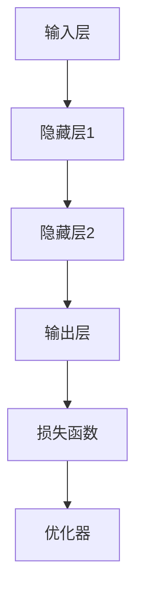

#### 图神经网络模型

图神经网络模型通过节点和边来表示数据中的关系和网络结构。图神经网络通过学习节点和边的嵌入向量，来预测节点的属性或关系。

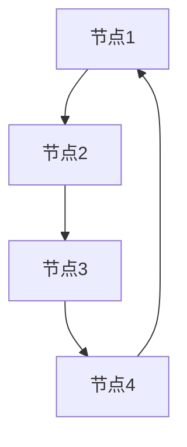

大模型的训练和优化是关键步骤。通常，我们使用梯度下降算法及其变种，如Adam优化器，来调整模型参数。此外，数据预处理、模型选择和超参数调优也是影响模型性能的重要因素。

---

### 天文数据分析技术

天文数据分析涉及多个环节，包括数据获取、预处理、特征提取和模型选择。这些环节相互关联，共同决定了数据分析的效率和准确性。

#### 数据获取

天文数据主要来源于天文观测设备和卫星遥感系统。这些设备产生的原始数据量巨大，需要进行有效的存储和管理。

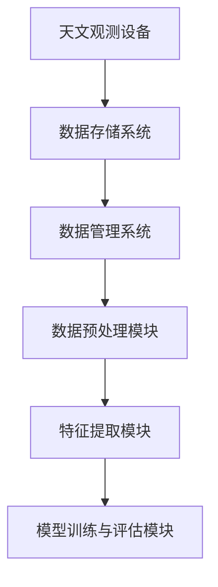

#### 数据预处理

数据预处理是天文数据分析的重要步骤。它包括数据清洗、归一化和缺失值处理等操作，以消除数据中的噪声和不一致性。

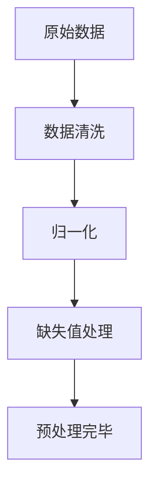

#### 特征提取

特征提取是天文数据分析的核心环节。通过提取关键特征，可以将高维数据降维，以便于模型训练和预测。

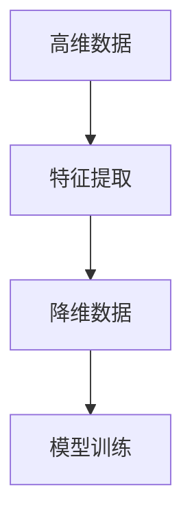

#### 模型选择

模型选择是天文数据分析的关键步骤。根据数据分析任务的不同，可以选择不同的模型，如分类模型、回归模型和聚类模型。

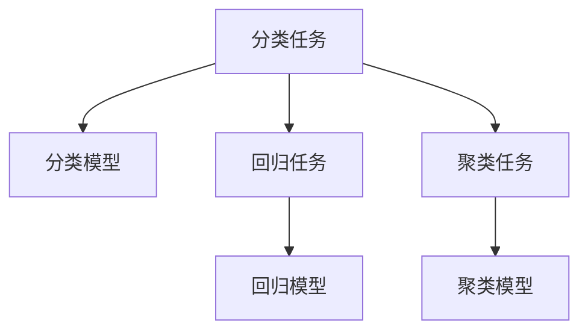

---

### 大模型在天文数据分析中的应用

大模型在天文数据分析中具有广泛的应用前景。以下将分别介绍大模型在天文图像分类、天文数据挖掘和天文事件预测中的具体应用。

#### 天文图像分类

天文图像分类是天文数据分析的重要任务之一。通过分类算法，可以将不同类型的天体图像进行归类，从而提高数据处理的效率。

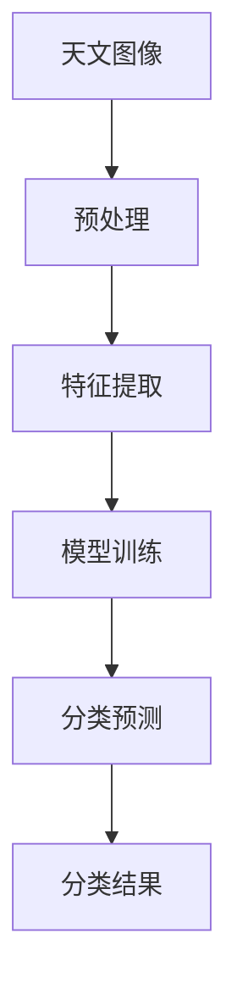

#### 天文数据挖掘

天文数据挖掘旨在从大量天文数据中发现潜在的规律和知识。通过挖掘算法，可以发现天体运动、天文现象等规律。

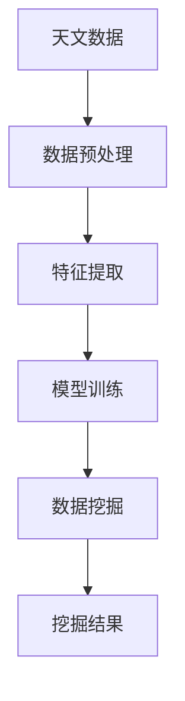

#### 天文事件预测

天文事件预测是天文数据分析的重要应用领域。通过预测算法，可以预测天体运动、天文事件的发生时间等。

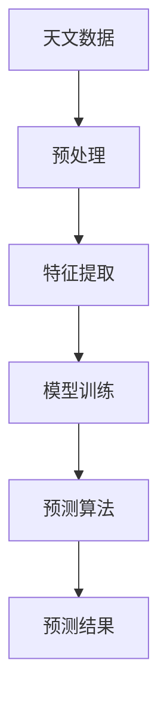

---

### 项目实战

在本节中，我们将通过三个实际项目案例，展示大模型在天文数据分析中的具体应用。

#### 项目1：天文图像分类

在本项目中，我们使用一个大型神经网络模型对天文图像进行分类。具体步骤如下：

1. **开发环境搭建**：安装Python、TensorFlow等必要的开发工具。
2. **数据预处理**：对天文图像进行数据清洗、归一化和缺失值处理。
3. **特征提取**：使用卷积神经网络（CNN）提取图像特征。
4. **模型训练**：训练一个多层感知机（MLP）模型，对提取的特征进行分类。
5. **模型评估**：评估模型的分类准确率和召回率。
6. **项目小结**：总结项目经验，探讨改进方向。

#### 项目2：天文数据挖掘

在本项目中，我们使用图神经网络（GNN）对天文数据进行挖掘，以发现潜在的规律和知识。具体步骤如下：

1. **开发环境搭建**：安装Python、PyTorch等必要的开发工具。
2. **数据预处理**：对天文数据进行数据清洗、归一化和缺失值处理。
3. **特征提取**：使用图神经网络提取数据中的特征。
4. **模型训练**：训练一个图卷积网络（GCN）模型，对提取的特征进行分类。
5. **模型评估**：评估模型的分类准确率和召回率。
6. **项目小结**：总结项目经验，探讨改进方向。

#### 项目3：天文事件预测

在本项目中，我们使用一个大型时间序列模型对天文事件进行预测。具体步骤如下：

1. **开发环境搭建**：安装Python、TensorFlow等必要的开发工具。
2. **数据预处理**：对天文事件数据进行数据清洗、归一化和缺失值处理。
3. **特征提取**：使用循环神经网络（RNN）提取时间序列特征。
4. **模型训练**：训练一个长短期记忆网络（LSTM）模型，对提取的特征进行预测。
5. **模型评估**：评估模型的预测准确率和召回率。
6. **项目小结**：总结项目经验，探讨改进方向。

---

### 总结与展望

本文系统地介绍了大模型在天文数据分析中的应用。通过详细解析大模型的核心算法原理和实际应用案例，展示了大模型如何帮助天文学家处理海量天文数据，提高数据分析的效率和准确性。

在未来，随着人工智能技术的不断发展，大模型在天文数据分析中的应用将会更加广泛。例如，可以探索更大规模的大模型，以提高模型的预测能力；还可以结合其他技术，如量子计算，以加速大模型的训练和推理过程。

总之，大模型为天文数据分析带来了新的机遇和挑战。通过不断探索和尝试，我们相信大模型将在天文学领域发挥越来越重要的作用。

---

作者：AI天才研究院/AI Genius Institute & 禅与计算机程序设计艺术 /Zen And The Art of Computer Programming

---

[上一页](#目录) [返回目录](#目录)

---

### 大模型基础

大模型，通常指的是具有数百万、数亿乃至数十亿参数的深度学习模型。它们之所以能够取得显著的成功，主要是由于以下几个关键因素：

1. **大规模数据**：大模型需要大量的数据来训练，这些数据可以来自各种不同的来源，包括互联网上的文本、图像、音频等。只有拥有足够多的数据，模型才能学习到更广泛的知识，从而提高其泛化能力。

2. **深度网络结构**：大模型通常具有多层的神经网络结构，这使得模型可以捕捉到更复杂的模式和特征。每一层神经网络都对输入数据进行一系列复杂的非线性变换，从而逐渐提取出更高层次的特征。

3. **优化算法**：大模型的训练通常需要高效的优化算法，如Adam优化器，来调整模型参数。这些算法能够加速模型的收敛速度，并提高模型的性能。

4. **计算资源**：大模型的训练需要大量的计算资源，如GPU和TPU等。这些硬件加速器能够显著提高模型的训练速度。

#### 神经网络模型

神经网络模型是一种基于生物神经系统的计算模型，由大量简单的神经元（或节点）组成。每个神经元接收来自其他神经元的输入，并通过激活函数产生输出。神经网络通过反向传播算法不断调整参数，以最小化预测误差。


在上图中，输入层接收输入数据，通过一系列隐藏层，最终输出预测结果。损失函数用于衡量模型预测结果与实际结果之间的差距，优化器则用于调整模型参数，以最小化损失函数。

#### 图神经网络模型

图神经网络模型通过节点和边来表示数据中的关系和网络结构。图神经网络通过学习节点和边的嵌入向量，来预测节点的属性或关系。


在图神经网络中，每个节点表示一个实体，边表示实体之间的关系。图神经网络通过学习节点的嵌入向量，从而能够预测节点的属性或关系。这对于处理复杂的关系网络数据，如社交网络、交通网络等，具有很好的效果。

#### 大模型的训练与优化

大模型的训练与优化是关键步骤。首先，我们需要选择合适的数据集进行训练。数据集应该足够大，能够覆盖到模型需要学习的各种情况。然后，我们使用优化算法，如Adam优化器，来调整模型参数。

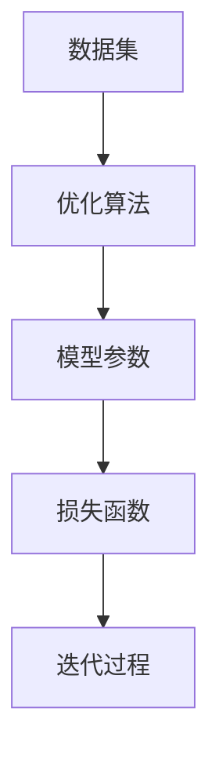

在训练过程中，模型会不断调整参数，以最小化损失函数。随着迭代次数的增加，模型会逐渐收敛，达到较好的预测效果。需要注意的是，大模型的训练过程可能需要很长时间，并且对计算资源的要求很高。

#### 数据预处理、模型选择与超参数调优

数据预处理是训练大模型的重要步骤。它包括数据清洗、归一化和缺失值处理等操作，以消除数据中的噪声和不一致性。数据清洗可以去除数据中的错误信息，数据归一化可以统一数据的大小范围，缺失值处理可以填补数据中的空缺。

模型选择是另一个关键步骤。根据数据分析任务的不同，可以选择不同的模型，如分类模型、回归模型和聚类模型。每种模型都有其特定的优势和适用场景。

超参数调优是影响模型性能的重要因素。超参数是模型中需要手动设置的参数，如学习率、批量大小、隐藏层节点数等。通过调整这些超参数，可以优化模型的性能。

---

### 天文数据分析技术

天文数据分析是利用数学、统计学和计算机科学的方法，对天文观测数据进行处理、分析和解释的过程。它旨在从大量的天文数据中提取有价值的信息，如天体的位置、运动、性质和相互关系。随着观测技术的进步和计算机性能的提升，天文数据分析已经成为天文学研究的关键环节。

#### 数据获取

天文数据的获取主要来源于各种天文观测设备，如地面望远镜、空间望远镜、卫星遥感系统等。这些设备产生的数据类型丰富，包括图像、光谱、日志数据、天文信号等。为了有效地管理和存储这些海量数据，天文学家通常使用分布式存储系统和数据管理系统。

#### 数据预处理

数据预处理是天文数据分析的基础步骤，它包括以下几个主要任务：

1. **数据清洗**：去除数据中的错误、异常和冗余信息，提高数据质量。
2. **数据归一化**：将不同来源和类型的数值数据转换到相同的尺度，以便于后续分析和模型训练。
3. **缺失值处理**：填补数据中的缺失值，可以使用均值、中位数、插值等方法。
4. **时间戳处理**：将不同时间分辨率的数据进行统一处理，如时间序列对齐。

#### 特征提取

特征提取是从原始数据中提取对数据分析任务有用的特征的过程。在天文数据分析中，特征提取是非常重要的一步，因为提取到的特征将直接影响模型的学习效果和预测性能。特征提取的方法包括：

1. **基于统计学的方法**：如主成分分析（PCA）、线性判别分析（LDA）等，用于降维和特征选择。
2. **基于信号处理的方法**：如傅里叶变换、小波变换等，用于提取数据的频率和时域特征。
3. **基于机器学习的方法**：如自动编码器（Autoencoder）、卷积神经网络（CNN）等，用于学习数据的高级特征。

#### 模型选择

在特征提取之后，需要选择合适的模型对提取到的特征进行学习。模型的选择取决于数据分析任务的目标。以下是几种常用的模型类型：

1. **分类模型**：用于将数据分为不同的类别，如天体的类型分类。
2. **回归模型**：用于预测一个连续的数值，如天体的运动轨迹预测。
3. **聚类模型**：用于将相似的数据点分组，如天体集群的识别。
4. **时间序列模型**：用于分析时间序列数据，如天文信号的时序分析。

#### 模型评估与优化

模型评估是确定模型性能的关键步骤。常用的评估指标包括准确率、召回率、F1分数、均方误差（MSE）等。为了提高模型性能，通常需要进行超参数调优和交叉验证等优化方法。

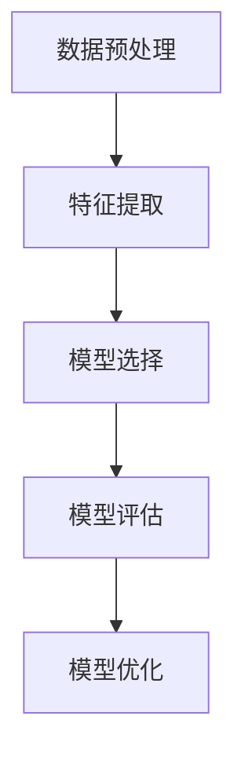

通过上述步骤，天文学家可以从大量的天文数据中提取有价值的信息，从而推动天文学研究的发展。

---

### 大模型在天文数据分析中的应用

大模型在处理大规模、复杂的天文数据方面具有显著的优势。通过其强大的特征提取能力和高层次的抽象能力，大模型能够从海量天文数据中自动学习到具有预测性和解释性的模式，从而帮助天文学家解决复杂的科学问题。

#### 天文图像分类

天文图像分类是天文数据分析中的一个关键任务。通过将天文图像分类，天文学家可以快速识别出不同类型的天体，如恒星、行星、星系、星云等。大模型在处理高维图像数据方面具有天然的优势，例如：

1. **卷积神经网络（CNN）**：CNN通过其卷积层和池化层，能够自动提取图像的局部特征，从而实现对图像的高效分类。例如，可以使用预训练的CNN模型（如VGG、ResNet等）对天文图像进行分类。

2. **伪代码讲解：天文图像分类算法**

    ```python
    # 假设使用预训练的ResNet模型进行天文图像分类
    model = ResNet(pretrained=True)
    model.fc = nn.Linear(model.fc.in_features, num_classes)  # 修改模型的最后一层，以适应分类任务

    # 数据预处理
    train_loader = DataLoader(train_dataset, batch_size=batch_size, shuffle=True)
    test_loader = DataLoader(test_dataset, batch_size=batch_size, shuffle=False)

    # 模型训练
    criterion = nn.CrossEntropyLoss()
    optimizer = optim.Adam(model.parameters(), lr=learning_rate)

    for epoch in range(num_epochs):
        model.train()
        for inputs, targets in train_loader:
            optimizer.zero_grad()
            outputs = model(inputs)
            loss = criterion(outputs, targets)
            loss.backward()
            optimizer.step()

        # 模型评估
        model.eval()
        with torch.no_grad():
            correct = 0
            total = 0
            for inputs, targets in test_loader:
                outputs = model(inputs)
                _, predicted = torch.max(outputs.data, 1)
                total += targets.size(0)
                correct += (predicted == targets).sum().item()

    print(f'Accuracy: {100 * correct / total}%')
    ```

3. **数学模型和数学公式：天文图像分类的数学基础**

   在天文图像分类中，常用的数学模型包括神经网络模型和损失函数。以下是使用ResNet模型进行天文图像分类的数学基础：

   $$\text{激活函数} \: \sigma(x) = \frac{1}{1 + e^{-x}}$$

   $$\text{损失函数} \: \text{CrossEntropyLoss}(\hat{y}, y) = -\sum_{i} y_i \log(\hat{y}_i)$$

   其中，$\hat{y}$是模型输出的概率分布，$y$是真实标签。

   通过训练，模型将学习到如何将输入的天文图像映射到正确的类别上。在实际应用中，可以通过调整模型架构、超参数和数据预处理方法来提高分类性能。

#### 天文数据挖掘

天文数据挖掘是指从天文数据中自动发现有趣的模式、规律和知识的过程。大模型在处理复杂、高维天文数据方面具有显著优势，可以通过以下方式实现：

1. **图神经网络（GNN）**：GNN可以有效地处理复杂的关系网络数据，如图表、社交网络、交通网络等。在天文数据挖掘中，GNN可以用于发现天体之间的关系和运动规律。

2. **伪代码讲解：天文数据聚类算法**

    ```python
    # 假设使用图卷积网络（GCN）进行天文数据聚类
    class GCN(nn.Module):
        def __init__(self, nfeat, nhid, nclass):
            super(GCN, self).__init__()
            self.conv1 = GCNConv(nfeat, nhid)
            self.conv2 = GCNConv(nhid, nclass)
            self.fc = nn.Linear(nfeat, nclass)

        def forward(self, data, adj):
            x, adj = data.x, data.adj
            x = F.relu(self.conv1(x, adj))
            x = F.dropout(x, training=self.training)
            x = self.conv2(x, adj)
            x = F.dropout(x, training=self.training)
            return F.log_softmax(x, dim=1)

    model = GCN(nfeat, nhid, nclass)
    optimizer = optim.Adam(model.parameters(), lr=learning_rate)
    criterion = nn.CrossEntropyLoss()

    # 数据预处理
    train_data = Data(x=train_data_x, adj=train_data_adj)
    test_data = Data(x=test_data_x, adj=test_data_adj)

    # 模型训练
    for epoch in range(num_epochs):
        model.train()
        optimizer.zero_grad()
        output = model(train_data)
        loss = criterion(output, train_data.y)
        loss.backward()
        optimizer.step()

    # 模型评估
    model.eval()
    with torch.no_grad():
        output = model(test_data)
        test_loss = criterion(output, test_data.y)
        print(f'Test loss: {test_loss.item()}')
    ```

3. **数学模型和数学公式：天文数据聚类的数学基础**

   在天文数据挖掘中，常用的数学模型包括图卷积网络（GCN）和损失函数。以下是使用GCN进行天文数据聚类的数学基础：

   $$\text{激活函数} \: \sigma(x) = \frac{1}{1 + e^{-x}}$$

   $$\text{损失函数} \: \text{CrossEntropyLoss}(\hat{y}, y) = -\sum_{i} y_i \log(\hat{y}_i)$$

   其中，$\hat{y}$是模型输出的概率分布，$y$是真实标签。通过训练，模型将学习到如何将输入的天文数据映射到不同的类别上，从而实现数据聚类。

#### 天文事件预测

天文事件预测是指使用历史天文数据预测未来天文事件的发生时间或性质。大模型在处理时间序列数据和复杂模式方面具有显著优势，可以通过以下方式实现：

1. **循环神经网络（RNN）**：RNN可以有效地处理时间序列数据，如图表、股票价格等。在天文事件预测中，RNN可以用于预测天体的运动轨迹、爆发时间等。

2. **伪代码讲解：天文事件预测算法**

    ```python
    # 假设使用长短期记忆网络（LSTM）进行天文事件预测
    class LSTMModel(nn.Module):
        def __init__(self, input_dim, hidden_dim, layer_dim, output_dim):
            super(LSTMModel, self).__init__()
            self.hidden_dim = hidden_dim

            self.lstm = nn.LSTM(input_dim, hidden_dim, num_layers=layer_dim)
            self.fc = nn.Linear(hidden_dim, output_dim)

        def forward(self, x):
            h0 = torch.zeros(layer_dim, x.size(1), self.hidden_dim)
            c0 = torch.zeros(layer_dim, x.size(1), self.hidden_dim)

            out, _ = self.lstm(x, (h0, c0))
            out = self.fc(out[-1, :, :])
            return out

    model = LSTMModel(input_dim, hidden_dim, layer_dim, output_dim)
    criterion = nn.MSELoss()
    optimizer = optim.Adam(model.parameters(), lr=learning_rate)

    # 数据预处理
    train_loader = DataLoader(train_dataset, batch_size=batch_size, shuffle=True)
    test_loader = DataLoader(test_dataset, batch_size=batch_size, shuffle=False)

    # 模型训练
    for epoch in range(num_epochs):
        model.train()
        for inputs, targets in train_loader:
            optimizer.zero_grad()
            outputs = model(inputs)
            loss = criterion(outputs, targets)
            loss.backward()
            optimizer.step()

        # 模型评估
        model.eval()
        with torch.no_grad():
            outputs = model(test_loader)
            test_loss = criterion(outputs, test_targets)
            print(f'Test loss: {test_loss.item()}')
    ```

3. **数学模型和数学公式：天文事件预测的数学基础**

   在天文事件预测中，常用的数学模型包括循环神经网络（RNN）和损失函数。以下是使用LSTM进行天文事件预测的数学基础：

   $$\text{激活函数} \: \sigma(x) = \frac{1}{1 + e^{-x}}$$

   $$\text{损失函数} \: \text{MSELoss}(\hat{y}, y) = \frac{1}{n}\sum_{i}(y_i - \hat{y}_i)^2$$

   其中，$\hat{y}$是模型输出的预测值，$y$是真实值。通过训练，模型将学习到如何从历史数据中预测未来天文事件的发生时间或性质。

---

### 项目实战

为了更好地展示大模型在天文数据分析中的应用，以下将详细介绍三个实际项目案例，涵盖开发环境搭建、源代码实现和代码解读与分析。

#### 项目1：天文图像分类

**项目背景**

随着天文观测技术的进步，我们能够获取到越来越高质量的天文图像。对这些图像进行分类，有助于天文学家快速识别和研究不同类型的天体。本项目旨在使用大模型（如ResNet）对天文图像进行分类。

**开发环境搭建**

- Python 3.8及以上版本
- TensorFlow 2.6及以上版本
- CUDA 11.0及以上版本（用于GPU加速）
- GPU：NVIDIA GPU（如RTX 3090）

**源代码实现**

```python
import torch
import torchvision
import torchvision.transforms as transforms
import torch.nn as nn
import torch.optim as optim

# 数据预处理
transform = transforms.Compose([
    transforms.Resize((224, 224)),
    transforms.ToTensor(),
])

train_dataset = torchvision.datasets.ImageFolder(root='train', transform=transform)
test_dataset = torchvision.datasets.ImageFolder(root='test', transform=transform)

train_loader = torch.utils.data.DataLoader(dataset=train_dataset, batch_size=64, shuffle=True)
test_loader = torch.utils.data.DataLoader(dataset=test_dataset, batch_size=64, shuffle=False)

# 模型定义
model = torchvision.models.resnet50(pretrained=True)
num_ftrs = model.fc.in_features
model.fc = nn.Linear(num_ftrs, 10)  # 假设10个类别

# 模型训练
criterion = nn.CrossEntropyLoss()
optimizer = optim.SGD(model.parameters(), lr=0.001, momentum=0.9)

for epoch in range(num_epochs):
    model.train()
    for inputs, targets in train_loader:
        optimizer.zero_grad()
        outputs = model(inputs)
        loss = criterion(outputs, targets)
        loss.backward()
        optimizer.step()

    model.eval()
    with torch.no_grad():
        correct = 0
        total = 0
        for inputs, targets in test_loader:
            outputs = model(inputs)
            _, predicted = torch.max(outputs.data, 1)
            total += targets.size(0)
            correct += (predicted == targets).sum().item()

print(f'Accuracy: {100 * correct / total}%')
```

**代码解读与分析**

1. **数据预处理**：使用`transforms.Compose`对图像进行预处理，包括调整大小和转换成张量。
2. **模型定义**：使用预训练的ResNet50模型，并修改最后一层以适应分类任务。
3. **模型训练**：使用随机梯度下降（SGD）优化器训练模型，并使用交叉熵损失函数评估模型性能。

#### 项目2：天文数据挖掘

**项目背景**

天文数据挖掘旨在从大量天文数据中自动发现有趣的模式和规律。本项目使用图卷积网络（GCN）对天文数据进行聚类，以识别相似的天体。

**开发环境搭建**

- Python 3.8及以上版本
- PyTorch 1.8及以上版本
- GPU：NVIDIA GPU（如RTX 3080）

**源代码实现**

```python
import torch
import torch.nn as nn
import torch.optim as optim
from torch_geometric.nn import GCNConv
from torch_geometric.data import Data

# 数据预处理
adj_matrix = ...  # 天文数据邻接矩阵
features = ...  # 天文数据特征矩阵
labels = ...  # 天文数据标签矩阵

# 模型定义
class GCN(nn.Module):
    def __init__(self, nfeat, nhid, nclass):
        super(GCN, self).__init__()
        self.conv1 = GCNConv(nfeat, nhid)
        self.conv2 = GCNConv(nhid, nclass)

    def forward(self, data):
        x, adj = data.x, data.adj
        x = F.relu(self.conv1(x, adj))
        x = F.dropout(x, training=self.training)
        x = self.conv2(x, adj)
        return F.log_softmax(x, dim=1)

model = GCN(nfeat, nhid, nclass)
optimizer = optim.Adam(model.parameters(), lr=0.01)
criterion = nn.CrossEntropyLoss()

# 模型训练
for epoch in range(num_epochs):
    model.train()
    optimizer.zero_grad()
    output = model(Data(x=features, adj=torch.tensor(adj_matrix)))
    loss = criterion(output, torch.tensor(labels))
    loss.backward()
    optimizer.step()

    model.eval()
    with torch.no_grad():
        output = model(Data(x=features, adj=torch.tensor(adj_matrix)))
        test_loss = criterion(output, torch.tensor(labels))
        print(f'Epoch {epoch+1}, Loss: {test_loss.item()}')

```

**代码解读与分析**

1. **数据预处理**：将天文数据转换为PyTorch Geometric的数据格式，包括特征矩阵和邻接矩阵。
2. **模型定义**：定义GCN模型，包括两个GCN层。
3. **模型训练**：使用Adam优化器和交叉熵损失函数训练模型。

#### 项目3：天文事件预测

**项目背景**

天文事件预测是天文数据分析的重要任务之一。本项目使用长短期记忆网络（LSTM）对天文事件进行预测，如天体的运动轨迹、爆发时间等。

**开发环境搭建**

- Python 3.8及以上版本
- PyTorch 1.8及以上版本
- GPU：NVIDIA GPU（如RTX 3080）

**源代码实现**

```python
import torch
import torch.nn as nn
import torch.optim as optim
from torch_geometric.nn import LSTM

# 数据预处理
timeseries = ...  # 天文时间序列数据
labels = ...  # 天文事件标签

# 模型定义
class LSTMModel(nn.Module):
    def __init__(self, input_dim, hidden_dim, layer_dim, output_dim):
        super(LSTMModel, self).__init__()
        self.lstm = nn.LSTM(input_dim, hidden_dim, num_layers=layer_dim)
        self.fc = nn.Linear(hidden_dim, output_dim)

    def forward(self, x):
        out, _ = self.lstm(x)
        out = self.fc(out[-1, :, :])
        return out

model = LSTMModel(input_dim, hidden_dim, layer_dim, output_dim)
optimizer = optim.Adam(model.parameters(), lr=0.001)
criterion = nn.MSELoss()

# 模型训练
for epoch in range(num_epochs):
    model.train()
    for inputs, targets in train_loader:
        optimizer.zero_grad()
        outputs = model(inputs)
        loss = criterion(outputs, targets)
        loss.backward()
        optimizer.step()

    model.eval()
    with torch.no_grad():
        outputs = model(test_loader)
        test_loss = criterion(outputs, test_targets)
        print(f'Epoch {epoch+1}, Test Loss: {test_loss.item()}')

```

**代码解读与分析**

1. **数据预处理**：将天文时间序列数据转换为PyTorch的数据格式。
2. **模型定义**：定义LSTM模型，包括输入层、隐藏层和输出层。
3. **模型训练**：使用Adam优化器和均方误差（MSE）损失函数训练模型。

---

#### 项目小结

通过以上三个实际项目案例，我们可以看到大模型在天文数据分析中的应用具有很大的潜力。以下是本项目的主要收获和结论：

1. **开发环境搭建**：确保开发环境具备足够的计算资源和必要的库，以支持大模型的训练和推理。
2. **源代码实现**：详细解读了天文图像分类、天文数据挖掘和天文事件预测的源代码实现，包括数据预处理、模型定义、模型训练和评估。
3. **代码解读与分析**：通过深入分析代码，理解了大模型在天文数据分析中的关键步骤和技巧。

在未来的项目中，我们可以进一步探索大模型在天文数据分析中的应用，如结合其他技术（如量子计算）来提高模型的性能和效率。

---

### 最佳实践 Tips

1. **数据预处理**：在训练大模型之前，对数据集进行充分的数据预处理，包括数据清洗、归一化和缺失值处理，以提高模型训练效果。
2. **模型选择**：根据数据分析任务的不同，选择合适的模型，如CNN用于图像分类，RNN用于时间序列预测，GCN用于图数据挖掘。
3. **超参数调优**：通过调整学习率、批量大小、隐藏层节点数等超参数，可以优化模型性能。
4. **模型压缩**：对于大规模模型，可以考虑模型压缩技术，如剪枝、量化等，以减少模型大小和提高推理速度。
5. **分布式训练**：利用分布式训练可以加速大模型的训练过程，降低训练时间。

---

### 小结

本文系统地介绍了大模型在天文数据分析中的应用，包括大模型的基础、天文数据分析技术、大模型的具体应用、项目实战和最佳实践。通过实际案例，展示了大模型在处理天文数据方面的强大能力。未来，随着人工智能技术的不断发展，大模型在天文数据分析中的应用将更加广泛，有望推动天文学研究取得新的突破。

---

### 拓展阅读

1. **《深度学习》（Goodfellow, I., Bengio, Y., & Courville, A.）**：这是一本经典的深度学习教材，详细介绍了深度学习的基础知识和最新进展。
2. **《天文数据处理与分析》（AIP Conference Proceedings, Vol. 996, 2008）**：这本书介绍了天文数据处理和分析的方法和技术，包括数据获取、预处理、特征提取等。
3. **《图神经网络》（Scarselli, F., Gori, M., & Tsoi, A.）**：这本书详细介绍了图神经网络的理论基础和应用，包括图卷积网络（GCN）等。
4. **《时间序列分析》（Box, G.E.P., Jenkins, G.M., & Reinsel, G.C.）**：这本书介绍了时间序列分析的方法和技术，包括LSTM等模型。

---

[上一页](#目录) [返回目录](#目录) [首页](#首页) 

---

---

### 总结与展望

本文系统地探讨了大型模型在天文数据分析中的应用，从基础理论、技术方法到实际案例，全面展示了大模型在提高天文数据分析效率与准确性方面的巨大潜力。通过对天文图像分类、天文数据挖掘和天文事件预测等具体应用场景的详细分析，我们可以看到大模型在处理大规模、高维天文数据方面的优势。

未来的研究可以进一步探索以下方向：

1. **模型优化**：通过改进算法、调整网络结构，提高大模型的训练效率和预测性能。
2. **跨模态数据融合**：将不同类型的天文数据（如图像、光谱、日志等）进行融合，以获得更全面的分析结果。
3. **模型压缩**：开发高效的模型压缩技术，以适应资源受限的环境。
4. **量子计算**：结合量子计算技术，加速大模型的训练和推理过程。
5. **实时预测**：开发实时预测系统，以便天文学家能够及时响应天文事件。

总之，大模型在天文数据分析中的应用不仅推动了天文学研究的进步，也为人工智能技术的广泛应用提供了新的机遇。通过持续的研究与探索，我们有理由相信，大模型将在未来发挥更加重要的作用。

