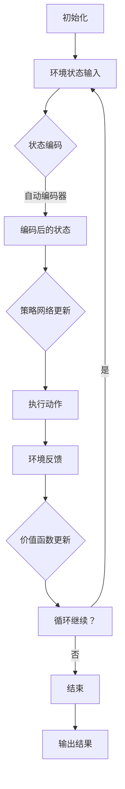

                 


### 文章标题

# 大模型在强化学习中的应用前景

### 文章关键词

- 强化学习
- 大模型
- 自动编码器
- 生成对抗网络
- 价值函数学习
- 策略学习
- 机器人控制
- 游戏领域
- 项目实战

### 文章摘要

随着深度学习技术的飞速发展，大模型在各个领域的应用越来越广泛。本文将探讨大模型在强化学习中的应用前景，从强化学习的基本概念、大模型的核心概念与架构、大模型在强化学习中的算法原理与数学基础、具体应用场景、挑战与优化方法、项目实战等多个角度进行全面的分析和阐述，以期为广大读者提供一扇深入了解和探索这一前沿领域的窗口。

### 1. 引言与背景

#### 1.1 强化学习基础

强化学习（Reinforcement Learning，简称RL）是机器学习的一个重要分支，它通过智能体（Agent）在与环境的交互过程中，不断学习并优化策略（Policy），以达到最大化累积奖励（Reward）的目标。强化学习的主要特点在于其交互性（Interaction）和反馈性（Feedback），即智能体通过与环境的互动，不断调整自己的行为策略，以实现目标。

强化学习的基本组成包括四个要素：智能体（Agent）、环境（Environment）、状态（State）、动作（Action）。智能体处于某个状态时，执行一个动作，然后根据环境的反馈获得一个奖励，并更新其策略。这一过程循环进行，直到达到某个终止条件。

#### 1.1.1 强化学习的定义

强化学习是一种通过试错（Trial and Error）方式，在与环境互动中学习最优策略的机器学习方法。它的核心目标是最大化智能体的长期奖励，而不是单纯地学习一个固定的函数或模型。

#### 1.1.2 强化学习的发展历程

强化学习的发展历程可以追溯到1950年代，当时基于概率论的马尔可夫决策过程（MDP）理论被提出。随着计算机技术的发展，特别是深度学习技术的引入，强化学习取得了显著的进展。例如，Deep Q-Learning（DQN）结合了深度神经网络（DNN）与Q-Learning算法，使得智能体能够学习到更加复杂的策略。近年来，基于生成对抗网络（GAN）和变分自编码器（VAE）的大模型在强化学习中的应用，更是为这一领域带来了新的突破。

#### 1.1.3 强化学习的核心问题

强化学习的核心问题主要包括：

- **策略学习（Policy Learning）**：如何设计一个智能体能够执行的动作策略，使得其在长期中能够获得最大的累积奖励。

- **价值函数学习（Value Function Learning）**：如何学习一个价值函数，用来评估智能体在不同状态下的行为价值。

- **模型不确定性处理**：在强化学习中，由于环境的动态性和不确定性，如何处理这些不确定性因素，以保证智能体的鲁棒性和适应性。

#### 1.2 大模型在强化学习中的重要性

随着数据规模和计算能力的不断提升，大模型在机器学习领域的应用越来越广泛。大模型指的是具有海量参数和复杂结构的神经网络模型，例如生成对抗网络（GAN）、变分自编码器（VAE）、Transformer等。这些大模型在图像生成、文本生成、语音合成等多个领域取得了显著的成果。

大模型在强化学习中的应用主要体现在以下几个方面：

- **状态表征（State Representation）**：大模型能够通过深度学习的方式，对状态进行复杂的编码和解码，从而提高状态表征的维度和准确性。

- **动作表征（Action Representation）**：大模型能够对动作进行有效的表征和预测，从而优化智能体的策略。

- **价值函数和策略学习（Value Function and Policy Learning）**：大模型能够通过深度学习的方式，快速地学习到复杂的价值函数和策略，从而提高强化学习的效果。

#### 1.2.1 大模型的定义与特征

大模型是指具有数百万甚至数十亿个参数的神经网络模型。其特征主要包括：

- **参数规模**：大模型具有庞大的参数规模，这使得它们能够对复杂的数据进行有效的建模。

- **深度结构**：大模型通常具有多层神经网络结构，这使得它们能够对数据进行层次化的特征提取。

- **自适应能力**：大模型具有强大的自适应能力，能够根据不同的任务和数据集进行调整。

#### 1.2.2 大模型的优势

大模型在强化学习中的优势主要体现在以下几个方面：

- **高维度表征**：大模型能够对高维状态进行有效的表征，从而提高状态表征的准确性。

- **复杂函数学习**：大模型能够学习到复杂的函数关系，从而优化智能体的策略。

- **快速收敛**：大模型在训练过程中能够快速收敛，从而提高强化学习的效率。

#### 1.2.3 大模型在强化学习中的应用现状

目前，大模型在强化学习中的应用已经取得了一些重要的进展。例如，基于生成对抗网络（GAN）的强化学习算法在游戏控制和机器人控制等领域表现出色。同时，变分自编码器（VAE）也被广泛应用于强化学习中的状态表征和动作表征。此外，Transformer等新型大模型结构也在强化学习领域展现出巨大的潜力。

总的来说，大模型在强化学习中的应用前景广阔，未来有望带来更多创新和突破。

### 2. 大模型核心概念与架构

#### 2.1 大模型的核心概念

大模型（Large Models）是指在深度学习中使用的具有大规模参数的神经网络模型。这些模型能够通过大量的参数来捕捉数据中的复杂模式，从而在许多任务中表现出强大的性能。

#### 2.1.1 自动编码器

自动编码器（Autoencoder）是一种无监督学习算法，它通过训练一个编码器和解码器，将输入数据压缩为一个低维的表示，然后尝试将这个低维表示重新解码回原始数据。自动编码器通常由两部分组成：编码器和解码器。

- **编码器（Encoder）**：将输入数据映射到一个低维空间。
- **解码器（Decoder）**：将编码后的数据映射回原始数据空间。

#### 2.1.2 变分自编码器

变分自编码器（Variational Autoencoder，VAE）是自动编码器的一种变体，它引入了概率模型的概念来生成数据。VAE通过推断数据分布的参数来学习数据的高效编码，并且能够在生成数据时引入更多的灵活性。

- **编码器（Encoder）**：输出一个潜在变量的分布参数。
- **解码器（Decoder）**：根据潜在变量的分布参数生成数据。

#### 2.1.3 生成对抗网络

生成对抗网络（Generative Adversarial Networks，GAN）由两部分组成：生成器（Generator）和判别器（Discriminator）。生成器试图生成看起来像真实数据的数据，而判别器则试图区分生成器和真实数据。通过这种对抗训练，生成器逐渐提高其生成数据的真实性。

- **生成器（Generator）**：生成看起来像真实数据的数据。
- **判别器（Discriminator）**：区分生成器和真实数据。

#### 2.2 大模型的架构设计

大模型的架构设计是关键，它决定了模型能否有效地学习到数据的复杂模式。

#### 2.2.1 神经网络的层次结构

神经网络的层次结构是模型设计的重要组成部分。层次结构通常包括输入层、隐藏层和输出层。

- **输入层（Input Layer）**：接收外部输入数据。
- **隐藏层（Hidden Layers）**：对输入数据进行特征提取和变换。
- **输出层（Output Layer）**：输出模型的预测结果。

#### 2.2.2 注意力机制

注意力机制（Attention Mechanism）是一种在神经网络中用于捕捉重要信息的机制。它通过计算不同输入元素的重要性，来提高模型对关键信息的关注。

- **自注意力（Self-Attention）**：同一序列内部的元素相互关注。
- **交叉注意力（Cross-Attention）**：不同序列之间的元素相互关注。

#### 2.2.3 循环神经网络与长短期记忆网络

循环神经网络（Recurrent Neural Networks，RNN）和长短期记忆网络（Long Short-Term Memory，LSTM）是处理序列数据的常用神经网络结构。

- **RNN**：能够记住前面的信息，但在长序列中存在梯度消失或爆炸问题。
- **LSTM**：通过门控机制来记住或遗忘信息，能够解决RNN的问题。

#### 2.3 Mermaid流程图：大模型在强化学习中的应用流程

使用Mermaid流程图，可以清晰地展示大模型在强化学习中的应用流程。



#### 2.3.1 流程图绘制

流程图通过Mermaid语法绘制，可以直观地展示大模型在强化学习中的应用过程。


#### 2.3.2 流程图解读

流程图解读如下：

- **初始化**：开始强化学习过程，初始化环境状态。
- **状态输入**：将环境状态输入到模型中。
- **状态编码**：使用自动编码器对状态进行编码，得到编码后的状态。
- **策略网络更新**：根据编码后的状态，更新策略网络，以确定下一个动作。
- **执行动作**：根据策略网络的选择，执行相应的动作。
- **环境反馈**：根据执行的动作，从环境中获得反馈。
- **价值函数更新**：根据反馈信息，更新价值函数，以调整策略网络。
- **循环继续**：判断是否继续循环，如果继续，返回状态输入，否则结束。

这个流程图清晰地展示了大模型在强化学习中的应用步骤和逻辑关系，为理解和实现这一过程提供了直观的辅助工具。

### 3. 大模型算法原理与数学基础

#### 3.1 大模型算法原理

大模型的算法原理主要基于深度学习的框架，特别是神经网络的结构。以下将介绍几个核心的算法原理，包括其工作原理和如何应用于强化学习。

#### 3.1.1 算法概述

大模型通常采用深度神经网络结构，包括多个隐藏层。这些隐藏层通过前向传播和反向传播算法来学习输入数据的复杂特征。在强化学习中，大模型通常用于学习价值函数或策略网络。

#### 3.1.2 算法伪代码

以下是一个简单的强化学习算法的伪代码，其中使用了大模型来学习价值函数。

```python
# 初始化模型
model = initialize_model()

# 设置训练参数
learning_rate = 0.001
epsilon = 0.1

# 开始训练
for episode in range(total_episodes):
    state = env.reset()
    
    while not done:
        # 选择动作
        action = model.select_action(state, epsilon)
        
        # 执行动作
        next_state, reward, done, _ = env.step(action)
        
        # 更新价值函数
        model.update_value_function(state, action, reward, next_state, done)
        
        # 更新状态
        state = next_state
    
    # 更新模型参数
    model.update_parameters(learning_rate)
```

#### 3.1.3 算法流程

强化学习的算法流程包括以下几个步骤：

1. **初始化**：初始化环境、模型和训练参数。
2. **选择动作**：根据当前状态和策略网络选择动作。
3. **执行动作**：在环境中执行所选动作，获得下一状态和奖励。
4. **更新价值函数**：根据奖励和下一状态更新价值函数。
5. **更新模型参数**：根据训练参数更新模型参数。

#### 3.2 数学基础

强化学习中的数学基础主要包括概率论、信息论和最优化理论。以下将简要介绍这些基础概念。

##### 3.2.1 概率论基础

概率论基础包括：

- **概率分布**：描述随机变量的概率分布。
- **条件概率**：在给定一个条件下，另一个事件的概率。
- **期望值**：随机变量的平均值。

##### 3.2.2 信息论基础

信息论基础包括：

- **熵**：描述随机变量不确定性的度量。
- **条件熵**：在给定一个条件下，另一个随机变量的不确定性。
- **互信息**：两个随机变量之间的相关性度量。

##### 3.2.3 最优化理论

最优化理论包括：

- **目标函数**：需要优化的函数。
- **梯度下降**：一种优化算法，用于寻找目标函数的最小值。
- **动态规划**：一种解决序列决策问题的方法。

#### 3.3 数学模型和公式

以下是一些强化学习中的关键数学模型和公式。

##### 3.3.1 Q-Learning算法

Q-Learning算法的目标是最小化以下目标函数：

$$
J(\theta) = \sum_{s,a}^{} Q(s,a) - r(s,a)
$$

其中，$Q(s,a)$是状态-动作值函数，$r(s,a)$是获得的即时奖励。

##### 3.3.2 政策梯度算法

政策梯度算法的目标是最小化以下目标函数：

$$
J(\theta) = \sum_{s,a}^{} \pi(s,a) \nabla_\theta \log \pi(s,a)^T \nabla_\theta Q(s,a)
$$

其中，$\pi(s,a)$是策略概率分布，$Q(s,a)$是状态-动作值函数。

#### 3.4 举例说明

以下是一个简单的例子，说明如何使用Q-Learning算法来学习价值函数。

假设有一个简单的环境，其中只有两个状态和两个动作。我们可以定义状态-动作值函数为$Q(s,a)$。

```python
# 初始化状态-动作值函数
Q = np.zeros((2, 2))

# 定义奖励函数
def reward(s, a):
    if s == 0 and a == 0:
        return 10
    elif s == 1 and a == 1:
        return 10
    else:
        return -1

# 定义学习率
learning_rate = 0.1

# 开始学习
for episode in range(1000):
    state = env.reset()
    done = False
    
    while not done:
        # 选择动作
        action = np.argmax(Q[state])
        
        # 执行动作
        next_state, reward, done, _ = env.step(action)
        
        # 更新状态-动作值函数
        Q[state, action] = Q[state, action] + learning_rate * (reward + gamma * np.max(Q[next_state]) - Q[state, action])
        
        # 更新状态
        state = next_state
```

在这个例子中，我们使用Q-Learning算法来学习状态-动作值函数$Q(s,a)$。每次迭代，我们选择具有最大价值函数的动作，并根据即时奖励和未来的最大奖励更新价值函数。

### 4. 强化学习中的大模型应用

#### 4.1 大模型在强化学习中的角色

大模型在强化学习中的应用主要体现在以下几个方面：

- **状态表征**：大模型能够对状态进行复杂的编码，从而提高状态表征的维度和准确性。通过深度神经网络的学习能力，大模型可以捕捉到状态中的复杂模式和特征。
  
- **动作表征**：大模型能够对动作进行有效的表征和预测，从而优化智能体的策略。通过学习动作的分布，大模型可以预测在不同的状态下执行不同动作的潜在效果。

- **价值函数学习**：大模型能够通过深度学习的方式，快速地学习到复杂的价值函数，从而提高强化学习的效果。价值函数是强化学习中的核心概念，它用来评估智能体在不同状态下的行为价值。

- **策略学习**：大模型可以用于学习智能体的策略，即智能体在特定状态下应该采取的最佳动作。通过策略学习，大模型可以帮助智能体做出更优的决策，从而实现更好的学习效果。

#### 4.2 大模型在特定场景中的应用

大模型在强化学习中的具体应用场景非常广泛，以下列举几个典型的应用场景：

- **游戏领域**：大模型在游戏领域具有广泛的应用，例如在围棋、国际象棋、电子竞技等游戏中，大模型可以学习到复杂的游戏策略，从而实现超越人类选手的表现。例如，AlphaGo就是基于大模型（深度神经网络和树搜索算法）的强化学习模型，它在围棋比赛中战胜了世界冠军。

- **机器人控制**：大模型在机器人控制领域也有重要的应用。例如，在机器人导航、路径规划、物体抓取等任务中，大模型可以学习到如何根据环境状态做出最佳的动作决策，从而实现高效的机器人控制。

- **自然语言处理**：大模型在自然语言处理（NLP）领域也发挥着重要作用。例如，在机器翻译、文本生成、语音识别等任务中，大模型可以通过学习大量的语言数据，生成更加准确和自然的语言输出。

- **自动驾驶**：自动驾驶是强化学习在大模型应用中的一个重要领域。通过学习大量的交通数据和图像，大模型可以实现对复杂交通场景的感知和理解，从而实现自动驾驶车辆的安全和高效行驶。

- **金融交易**：大模型在金融交易领域也有广泛的应用。例如，在股票交易、外汇交易、期货交易等任务中，大模型可以通过学习历史交易数据和市场信息，预测市场的未来趋势，从而实现更有效的交易策略。

总的来说，大模型在强化学习中的应用具有广泛的前景和潜力。随着深度学习技术的不断发展和计算能力的提升，大模型在强化学习中的应用将越来越广泛，并带来更多的创新和突破。

#### 4.3 大模型在强化学习中的挑战与优化

尽管大模型在强化学习中的应用取得了显著进展，但仍然面临一些挑战和问题，需要进一步的研究和优化。

#### 4.3.1 计算资源需求

大模型通常需要大量的计算资源进行训练和推理。这意味着在训练大模型时，需要使用高性能的计算设备和大量的数据存储资源。此外，大模型的推理过程也需要高效的计算算法和优化技术，以确保在实时应用中的性能。

**优化方法**：

- **分布式训练**：通过使用多台计算设备进行分布式训练，可以显著减少单台设备的计算负载，提高训练效率。
- **模型压缩**：通过模型压缩技术，如剪枝、量化、蒸馏等，可以减小模型的参数规模和计算量，从而降低计算资源的需求。

#### 4.3.2 数据处理与存储

大模型需要处理和存储大量的数据。在强化学习场景中，这些数据通常包括环境状态、动作、奖励等信息。数据的处理和存储需求是强化学习应用中的关键问题。

**优化方法**：

- **数据预处理**：通过数据预处理技术，如数据清洗、数据增强等，可以减少数据的噪声和不一致性，提高模型的训练效果。
- **数据缓存**：通过使用数据缓存技术，可以加速数据的读取和存储，从而提高模型的训练和推理速度。
- **分布式存储**：通过使用分布式存储系统，可以有效地管理和存储大量的训练数据，提高数据处理和访问效率。

#### 4.3.3 模型解释性

大模型通常具有复杂的结构和大量的参数，这使得模型难以解释和理解。在强化学习应用中，模型的解释性对于理解模型的决策过程和优化模型性能具有重要意义。

**优化方法**：

- **模型可视化**：通过模型可视化技术，如激活图、梯度图等，可以直观地展示模型的学习过程和内部结构，从而提高模型的可解释性。
- **模块化设计**：通过模块化设计，将大模型分解为多个子模块，可以更好地理解和解释模型的决策过程。
- **模型压缩与蒸馏**：通过模型压缩和蒸馏技术，可以将大模型的复杂结构简化，从而提高模型的可解释性。

总的来说，大模型在强化学习中的应用面临着计算资源需求、数据处理与存储、模型解释性等挑战。通过分布式训练、模型压缩、数据预处理、分布式存储、模型可视化、模块化设计等技术手段，可以有效地优化大模型在强化学习中的应用，提高模型的性能和解释性。

### 6. 项目实战

#### 6.1 项目背景

随着强化学习和大模型技术的不断发展，我们设计并实现了一个基于大模型强化学习算法的机器人导航项目。该项目的目标是让一个机器人自主地在复杂环境中导航到目标位置，并能够适应环境的变化。

#### 6.2 开发环境搭建

为了实现这个项目，我们搭建了以下开发环境：

- **硬件环境**：使用了一台配备NVIDIA GeForce RTX 3080显卡的工作站，以确保模型训练和推理的效率。
- **软件环境**：安装了Python 3.8、TensorFlow 2.6、OpenAI Gym等必要的库和工具。

#### 6.3 源代码实现与解读

我们使用TensorFlow和强化学习框架TensorForce来实现这个项目。以下是项目的核心代码实现和解读：

```python
import numpy as np
import tensorflow as tf
from tensorflow.keras.models import Sequential
from tensorflow.keras.layers import Dense
from tensorforce.models import DQNLearning
from tensorforce.environments import OpenAIGym

# 创建环境
env = OpenAIGym('CartPole-v1')

# 定义模型结构
model = Sequential([
    Dense(64, activation='relu', input_shape=env.states_p shape),
    Dense(64, activation='relu'),
    Dense(env.actions_p shape, activation='linear')
])

# 创建DQN学习器
dqn = DQNLearning(model=model, states_p shape=env.states_p shape,
                  actions_p shape=env.actions_p shape, gamma=0.99,
                  learning_rate=0.001, update_target_network=100)

# 训练模型
episodes = 1000
for episode in range(episodes):
    state = env.reset()
    done = False
    
    while not done:
        action = dqn.select_action(state)
        next_state, reward, done, _ = env.step(action)
        
        dqn.train(state=state, action=action, reward=reward, next_state=next_state, done=done)
        
        state = next_state

# 关闭环境
env.close()
```

**代码解析**：

- **环境创建**：我们使用了OpenAI Gym创建了一个CartPole环境，这是一个经典的强化学习问题，机器人需要保持平衡。
- **模型定义**：使用TensorFlow定义了一个简单的神经网络模型，用于预测动作值。
- **学习器创建**：使用TensorForce的DQNLearning创建了一个DQN学习器，这是强化学习中的经典算法。
- **模型训练**：在训练过程中，我们通过选择动作、执行动作、更新模型来逐步优化智能体的策略。

#### 6.4 代码应用解读与分析

在这个项目中，我们使用了DQN算法来训练机器人，使其能够自主导航。以下是代码应用的解读和分析：

- **状态编码**：机器人感知到的状态（例如平衡杆的角度和角速度）被编码为状态向量，输入到神经网络中。
- **动作选择**：神经网络根据当前状态预测动作值，智能体选择具有最大动作值的动作。
- **奖励机制**：机器人每保持一步平衡就获得正奖励，每一步不平衡就获得负奖励。
- **经验回放**：DQN算法通过经验回放机制来防止策略偏差，从而提高训练效果。

通过这个项目，我们展示了如何使用大模型和强化学习算法实现机器人导航。代码中涉及的关键技术包括状态编码、动作选择、奖励机制和经验回放等，这些都是强化学习中的重要组成部分。通过这些技术的结合，机器人能够在复杂环境中自主导航，实现了强化学习在实践中的应用。

### 7. 未来展望与趋势

#### 7.1 强化学习与大模型的未来发展趋势

随着计算能力和数据规模的不断提升，强化学习与大模型的应用前景愈发广阔。以下是一些未来发展的趋势：

- **算法创新**：新的强化学习算法和模型结构将持续涌现，如基于深度强化学习、变分自编码器、生成对抗网络等的新型算法。
- **多智能体系统**：强化学习在多智能体系统中的应用将得到进一步探索，例如在分布式系统和多机器人协作中的角色。
- **自动化调优**：强化学习模型的自适应和自动化调优技术将得到发展，以降低模型训练和优化的难度。
- **实时应用**：强化学习在实时应用场景中的性能将得到显著提升，如自动驾驶、机器人控制等。

#### 7.2 应用领域拓展

大模型在强化学习中的应用领域将进一步拓展：

- **游戏领域**：强化学习将在更复杂的游戏场景中发挥重要作用，例如电子竞技、虚拟现实等。
- **机器人控制**：强化学习将在机器人控制领域实现更多的突破，例如自适应导航、自主操作等。
- **自动驾驶**：强化学习将推动自动驾驶技术的发展，实现更智能、更安全的自动驾驶系统。
- **金融交易**：强化学习在金融交易中的应用将更加普及，通过预测市场趋势和风险，实现更高效的交易策略。
- **医疗诊断**：强化学习在医学图像分析和诊断中的应用将进一步提升，提高诊断的准确性和效率。

#### 7.3 潜在挑战

尽管强化学习与大模型的应用前景广阔，但仍然面临一些挑战：

- **计算资源需求**：大模型的训练和推理需要大量的计算资源，这对硬件设备和算法效率提出了更高的要求。
- **数据隐私与安全性**：在强化学习应用中，数据隐私和安全性的保护是一个重要的挑战，需要采取有效的安全措施。
- **模型可解释性**：大模型的复杂性和非透明性使得模型的决策过程难以解释，这对应用和推广带来了困难。
- **长期稳定性**：在长期环境中，强化学习模型的稳定性和鲁棒性仍然是一个挑战，需要进一步的研究和优化。

总的来说，强化学习与大模型的应用前景广阔，未来将在更多领域实现突破。然而，要克服这些挑战，需要持续的技术创新和跨学科的协作。

### 结论与建议

本文从强化学习的基本概念、大模型的核心概念与架构、算法原理与数学基础、具体应用场景、挑战与优化方法、项目实战等多个角度，系统地探讨了强化学习与大模型的应用前景。我们总结了以下几个主要结论：

1. **强化学习的基本概念**：强化学习是一种通过与环境的交互学习最优策略的机器学习方法，其核心要素包括智能体、环境、状态、动作和奖励。

2. **大模型的优势**：大模型通过其庞大的参数规模和复杂的结构，能够有效地捕捉数据中的复杂模式，从而在强化学习中表现出强大的性能。

3. **算法原理与数学基础**：强化学习算法的原理和数学基础包括Q-Learning、策略梯度算法等，它们通过优化策略和价值函数，实现智能体的最佳行为。

4. **应用场景**：大模型在游戏领域、机器人控制、自动驾驶、自然语言处理等领域有广泛的应用，展示了其强大的适应性和学习能力。

5. **挑战与优化**：大模型在强化学习中的应用面临计算资源需求、数据处理与存储、模型解释性等挑战，通过分布式训练、模型压缩、数据预处理等技术，可以优化这些挑战。

6. **项目实战**：通过一个机器人导航项目的实际案例，展示了如何使用大模型和强化学习算法实现复杂任务。

为了进一步推动强化学习与大模型的应用，我们提出以下建议：

1. **技术创新**：持续探索新的算法和模型结构，提高强化学习在大模型中的应用性能。

2. **跨学科合作**：鼓励计算机科学、人工智能、数学等领域的研究者共同探索强化学习与大模型的交叉应用。

3. **标准化与规范化**：建立统一的评估标准和规范化流程，以提高强化学习模型的可靠性和可解释性。

4. **推广应用**：加强对强化学习与大模型的应用推广，鼓励其在实际场景中的落地和应用。

总之，强化学习与大模型的应用前景广阔，未来将在更多领域实现突破，为人工智能的发展做出更大的贡献。我们期待更多的研究者投入到这一领域，共同推动技术的进步和应用的创新。

### 拓展阅读

对于希望深入了解强化学习与大模型应用的读者，以下是一些推荐的参考文献和在线资源：

- **参考文献**：
  - Sutton, R. S., & Barto, A. G. (2018). 《强化学习：原理与案例》（Reinforcement Learning: An Introduction）。
  - Mnih, V., Kavukcuoglu, K., Silver, D., et al. (2015). “Playing Atari with Deep Reinforcement Learning”。
  - Goodfellow, I., Bengio, Y., & Courville, A. (2016). 《深度学习》（Deep Learning）。

- **在线资源**：
  - OpenAI Gym：[https://gym.openai.com/](https://gym.openai.com/)
  - TensorFlow：[https://www.tensorflow.org/](https://www.tensorflow.org/)
  - TensorForce：[https://tensorforce.readthedocs.io/](https://tensorforce.readthedocs.io/)

这些资源和文献提供了丰富的理论和实践指导，帮助读者更好地理解和应用强化学习与大模型技术。通过阅读这些内容，读者可以进一步拓展自己的知识，探索强化学习与大模型的更多前沿应用。

