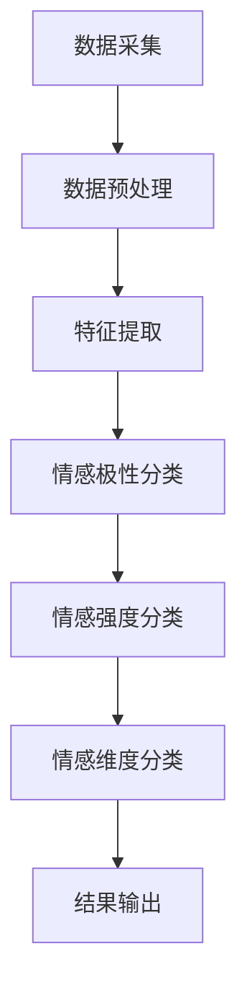

                 

### 文章标题

《大模型在情感分析中的突破应用》

### 关键词

情感分析，大模型，自然语言处理，机器学习，深度学习，BERT，GPT-3，情感极性分类，情感强度估计，项目实战

### 摘要

本文旨在探讨大模型在情感分析领域的突破性应用。通过对情感分析的核心概念、大模型的简介及其实际应用进行详细阐述，本文将深入剖析大模型在情感分析中的核心算法原理、数学模型及其在项目实战中的应用。同时，本文还将提供实用的项目实战案例，帮助读者更好地理解和掌握大模型在情感分析中的实际应用。

## 引言

情感分析，作为自然语言处理（NLP）领域的一个重要分支，近年来在人工智能（AI）技术的推动下取得了显著进展。随着互联网的普及和信息量的爆炸性增长，人们对于情感分析的需求也日益增加。从社交媒体的情感分析到电子商务的评价情感分析，再到金融领域的客户情感分析，情感分析的应用场景越来越广泛。

在这一背景下，大模型的引入为情感分析带来了新的机遇和挑战。大模型，尤其是基于深度学习的模型，如BERT（Bidirectional Encoder Representations from Transformers）和GPT-3（Generative Pre-trained Transformer 3），在情感分析中展现出了强大的能力和广泛的应用前景。它们不仅能够处理复杂的多维度情感，还能够应对大规模数据的处理需求。

本文将围绕大模型在情感分析中的应用进行深入探讨，旨在为读者提供一个全面而详细的了解。文章将分为以下几个部分：

1. **情感分析基础**：介绍情感分析的定义、应用场景以及核心概念和联系。
2. **大模型简介**：介绍大模型的定义、特点以及主流的大模型。
3. **大模型在情感分析中的应用**：详细阐述大模型在情感分析中的核心算法原理和数学模型。
4. **项目实战**：通过一个情感分析项目，展示大模型在实际应用中的开发环境和实现过程。
5. **总结与展望**：总结本文的主要观点，并对未来情感分析的发展趋势进行展望。

## 情感分析基础

### 情感分析的定义与应用

情感分析（Sentiment Analysis），也称为意见挖掘，是指使用自然语言处理（NLP）技术和机器学习方法，从文本数据中识别和提取主观信息，并对这些信息进行情感极性分类和情感强度估计的过程。情感分析的应用场景非常广泛，涵盖了社交媒体、电子商务、金融、市场营销等多个领域。

在社交媒体领域，情感分析可以帮助平台了解用户对某一话题或事件的情感倾向，从而优化内容推送和用户互动。例如，Twitter和Facebook等社交媒体平台已经广泛应用情感分析技术，对用户的推文和评论进行情感分类，以识别和过滤不当言论。

在电子商务领域，情感分析可以用于产品评价分析。通过对用户评价的文本进行情感分析，商家可以了解消费者对产品的情感倾向，从而优化产品设计和营销策略。例如，Amazon和eBay等电商平台利用情感分析技术，分析用户对产品的评论，为用户提供更个性化的购物体验。

在金融领域，情感分析可以帮助金融机构了解客户对某一金融产品或服务的情感倾向，从而优化客户服务和风险管理。例如，银行可以利用情感分析技术，分析客户在社交媒体上的言论，了解他们对银行服务的满意度，以改进服务质量和提高客户满意度。

### 情感分析的挑战与机遇

尽管情感分析的应用场景广泛，但其在实际应用中仍然面临诸多挑战。首先，语言复杂性是情感分析中的一个重要挑战。自然语言具有高度的复杂性和多样性，不同语境下的情感表达方式也可能有所不同。这使得情感分析模型的准确性和泛化能力成为一大难题。

其次，情感极性判定也是情感分析中的难点之一。情感极性判定是指将文本情感分类为正面、负面或中性。在实际应用中，情感表达可能不是直接、明确的，而是含有隐喻、讽刺或复杂情感混合。这给情感极性判定带来了挑战。

此外，情感强度估计也是情感分析中的重要任务。情感强度是指文本中情感的强烈程度，如何准确估计情感强度是情感分析的一个关键问题。不同的情感表达方式可能具有不同的强度，且情感强度可能在文本中变化。

然而，随着人工智能技术的不断发展，情感分析也面临着诸多机遇。首先，深度学习技术的发展为情感分析提供了强大的工具。深度学习模型，如卷积神经网络（CNN）和循环神经网络（RNN），能够更好地捕捉文本中的情感特征，从而提高情感分析模型的性能。

其次，预训练语言模型，如BERT和GPT-3，的出现为情感分析带来了新的突破。这些大模型通过在大量文本数据上进行预训练，已经具备了强大的语言理解和生成能力，能够更好地处理复杂情感表达。这使得情感分析的应用范围和准确性得到了显著提升。

最后，数据驱动的情感分析方法也为情感分析带来了新的机遇。通过收集和利用大量标注数据，可以不断优化和改进情感分析模型，提高其性能和泛化能力。同时，数据驱动的情感分析方法也能够适应不断变化的情感表达方式，提高情感分析的准确性。

### 情感分析的发展历程

情感分析的发展历程可以分为以下几个阶段：

1. **早期情感分析技术**：早期的情感分析主要依赖于基于规则的方法和基于词典的方法。这些方法通过定义一套规则或使用情感词典，对文本进行情感分类。然而，这些方法在面对复杂情感表达时效果不佳。

2. **基于统计的方法**：随着自然语言处理技术的发展，基于统计的方法逐渐兴起。这些方法利用统计模型，如朴素贝叶斯、最大熵模型和支持向量机（SVM），对文本进行情感分类。这些方法在一定程度上提高了情感分析的准确性。

3. **基于机器学习的方法**：基于机器学习的方法进一步提高了情感分析的准确性。这些方法使用机器学习算法，如决策树、随机森林和梯度提升机（GBM），从文本特征中学习情感分类模型。这些方法能够更好地捕捉文本中的情感特征，从而提高情感分析模型的性能。

4. **基于深度学习的方法**：近年来，深度学习技术的发展为情感分析带来了新的突破。深度学习模型，如卷积神经网络（CNN）和循环神经网络（RNN），能够更好地捕捉文本中的情感特征，从而提高情感分析模型的性能。特别是，基于变换器模型的预训练语言模型，如BERT和GPT-3，在情感分析中展现出了强大的能力。

5. **大模型的应用**：随着大模型的引入，情感分析的性能和效果得到了显著提升。大模型通过在大量文本数据上进行预训练，已经具备了强大的语言理解和生成能力，能够更好地处理复杂情感表达。这使得情感分析的应用范围和准确性得到了显著提升。

## 情感分析的核心概念与联系

### 情感极性

情感极性（Sentiment Polarity）是指文本中情感的正负倾向。情感极性分析是情感分析中最基本和最常见的任务之一。通常，情感极性被分为三类：正面、负面和中和。

正面情感通常表达为积极的情绪，如快乐、满意和兴奋。负面情感通常表达为消极的情绪，如愤怒、失望和悲伤。中和情感则表示文本中的情感倾向不明确或中性。

在情感极性分析中，常用的方法包括基于规则的方法、基于统计的方法和基于机器学习的方法。基于规则的方法通常使用一套预定义的规则或情感词典，对文本进行情感极性分类。基于统计的方法使用统计模型，如朴素贝叶斯、最大熵模型和支持向量机（SVM），从文本特征中学习情感极性分类模型。基于机器学习的方法使用机器学习算法，如决策树、随机森林和梯度提升机（GBM），从文本特征中学习情感极性分类模型。

### 情感强度

情感强度（Sentiment Intensity）是指文本中情感的强烈程度。情感强度分析是情感分析中的一个重要任务，对于理解文本的整体情感倾向具有重要意义。

情感强度通常通过数值表示，如0（中性）到1（最大强度）的标度。情感强度分析的目标是预测文本中情感强度的数值。

在情感强度分析中，常用的方法包括基于规则的方法、基于统计的方法和基于机器学习的方法。基于规则的方法通常使用一套预定义的规则或情感词典，对文本进行情感强度分类。基于统计的方法使用统计模型，如朴素贝叶斯、最大熵模型和支持向量机（SVM），从文本特征中学习情感强度分类模型。基于机器学习的方法使用机器学习算法，如决策树、随机森林和梯度提升机（GBM），从文本特征中学习情感强度分类模型。

### 情感维度分析

情感维度分析（Sentiment Dimension Analysis）是指将情感分为不同的维度，并分析每个维度上的情感极性和强度。情感维度分析有助于更深入地理解文本中的情感。

常见的情感维度包括快乐、悲伤、愤怒、惊讶、厌恶和厌恶。每个维度都可以表示为正面或负面情感。例如，快乐和满意可以归类为快乐维度，而失望和悲伤可以归类为悲伤维度。

在情感维度分析中，常用的方法包括基于规则的方法、基于统计的方法和基于机器学习的方法。基于规则的方法通常使用一套预定义的规则或情感词典，对文本进行情感维度分类。基于统计的方法使用统计模型，如朴素贝叶斯、最大熵模型和支持向量机（SVM），从文本特征中学习情感维度分类模型。基于机器学习的方法使用机器学习算法，如决策树、随机森林和梯度提升机（GBM），从文本特征中学习情感维度分类模型。

### Mermaid流程图：情感分析系统架构

以下是一个使用Mermaid绘制的情感分析系统架构流程图：



在这个流程图中，数据采集是情感分析的第一步，然后是数据预处理，包括文本清洗和分词等操作。接下来是特征提取，将文本数据转换为机器学习模型可以处理的特征表示。然后是情感极性分类、情感强度分类和情感维度分类，最后将分类结果输出。

通过这个流程图，我们可以清楚地看到情感分析系统的各个组成部分及其相互关系，有助于理解情感分析的整体流程。

## 大模型简介

### 大模型的定义与特点

大模型（Large-scale Model）是指在规模和参数量上远超传统模型的深度学习模型。这些模型通常包含数百万至数十亿个参数，能够处理大规模的数据集，从而在学习过程中提取更复杂的特征和模式。大模型的出现，标志着深度学习在自然语言处理（NLP）和计算机视觉（CV）等领域取得了显著的突破。

大模型的特点主要包括：

1. **规模巨大**：大模型拥有数百万至数十亿个参数，这使得它们能够捕获大量数据和复杂特征。
2. **预训练能力**：大模型通常通过在大规模语料库上进行预训练，从而学习到通用语言表示和知识，这使得它们在特定任务上具有更好的泛化能力。
3. **强大的表征能力**：大模型能够提取深层次的文本特征，从而实现高精度的文本理解和生成。
4. **并行计算需求**：大模型通常需要高性能的计算资源和并行计算能力，以满足大规模数据和参数的计算需求。

### 主流大模型介绍

在自然语言处理领域，有几种主流的大模型，如BERT、GPT-3等。这些模型在情感分析中展现了强大的性能和广泛的应用前景。

1. **BERT（Bidirectional Encoder Representations from Transformers）**

BERT是一种双向编码的变换器模型，由Google Research于2018年提出。BERT的核心思想是在大规模文本数据上进行预训练，从而学习到丰富的语言表示。BERT的两个关键特性是：

   - 双向编码：BERT能够同时考虑上下文信息，从而更好地理解文本中的关系和语义。
   - 多任务学习：BERT通过在大规模文本数据上进行预训练，可以应用于多种任务，如情感分析、命名实体识别和问答系统。

2. **GPT-3（Generative Pre-trained Transformer 3）**

GPT-3是一种生成式预训练的变换器模型，由OpenAI于2020年推出。GPT-3是当前最大的预训练模型，拥有1750亿个参数，能够在各种自然语言处理任务中表现出色。

   - 生成能力：GPT-3不仅能够完成分类任务，还能够进行文本生成、摘要和对话生成等生成式任务。
   - 自适应能力：GPT-3通过预训练，能够适应各种不同的任务和数据集，从而实现高精度的文本理解和生成。

### 大模型在情感分析中的优势

大模型在情感分析中具有以下优势：

1. **更好的特征提取能力**：大模型能够从大规模数据中提取更复杂的特征，从而提高情感分析的准确性。
2. **多任务学习**：大模型可以通过预训练，学习到通用语言表示和知识，从而提高情感分析模型的泛化能力。
3. **适应性强**：大模型能够处理各种不同类型的数据和任务，从而实现情感分析的广泛应用。
4. **高效性**：大模型通过并行计算和优化算法，能够在较短时间内完成大规模数据的训练和预测。

### 大模型的局限性

尽管大模型在情感分析中具有显著的优势，但它们也存在一定的局限性：

1. **计算资源需求**：大模型通常需要大量的计算资源和存储空间，这对硬件设备提出了较高的要求。
2. **数据需求**：大模型需要大规模的数据进行预训练，而获取和处理大量高质量的数据可能存在困难。
3. **解释性不足**：大模型的内部表示通常较为复杂，难以解释和理解，这可能会影响模型的可解释性和可靠性。

## 大模型在情感分析中的核心算法原理

### 基于词嵌入的模型

词嵌入（Word Embedding）是将单词映射到高维向量空间的一种技术，它通过将单词表示为密集向量，从而捕获单词的语义信息。基于词嵌入的模型在情感分析中发挥着重要作用。

1. **Word2Vec**

Word2Vec是一种基于神经网络的语言模型，由Google于2013年提出。Word2Vec通过两个主要变种——连续词袋（CBOW）和Skip-Gram，来学习单词的嵌入表示。

   - **CBOW（Continuous Bag-of-Words）**：CBOW模型通过上下文词的均值来预测目标词。具体来说，给定一个目标词，CBOW模型会使用目标词周围的多个词（上下文词）的平均表示来预测目标词。

     ```mermaid
     graph TD
         A[Word Context] --> B[CBOW Model]
         B --> C[Context Vectors]
         C --> D[Target Word]
         D --> E[Word Embedding]
     ```

   - **Skip-Gram**：Skip-Gram模型与CBOW相反，它通过目标词来预测上下文词。具体来说，给定一个目标词，Skip-Gram模型会使用目标词的嵌入向量来预测其周围的上下文词。

     ```mermaid
     graph TD
         A[Target Word] --> B[Skip-Gram Model]
         B --> C[Word Embedding]
         C --> D[Context Words]
     ```

2. **GloVe（Global Vectors for Word Representation）**

GloVe是一种基于矩阵分解的词嵌入方法，由 Stanford University 于2014年提出。GloVe通过优化词的嵌入向量，使得相似词的向量距离更近，从而更好地捕获单词的语义信息。

   - **共现矩阵**：GloVe首先构建一个共现矩阵，其中每个单词和它的上下文词之间的共现次数作为矩阵的元素。
   - **矩阵分解**：然后，GloVe通过优化两个矩阵的乘积，使得相似词的向量距离更近。

     ```mermaid
     graph TD
         A[Co-occurrence Matrix] --> B[GloVe Model]
         B --> C[Word Vectors]
         C --> D[Matrix Factorization]
     ```

### 基于变换器模型的算法

变换器模型（Transformer）是一种基于自注意力机制的深度学习模型，由Vaswani等人于2017年提出。变换器模型在自然语言处理领域取得了显著的成果，特别是在机器翻译、文本生成和情感分析等方面。

1. **变换器模型的结构**

变换器模型主要由编码器（Encoder）和解码器（Decoder）组成。编码器负责将输入文本编码为向量表示，解码器则负责从编码器的输出中解码出目标文本。

   - **编码器**：编码器由多个变换器层（Transformer Layer）组成，每个变换器层包含多头自注意力（Multi-head Self-Attention）和前馈神经网络（Feed-forward Neural Network）。
   - **解码器**：解码器与编码器类似，也由多个变换器层组成，但还包括了一个额外的交叉注意力（Cross-Attention）层，用于将编码器的输出与解码器的输出相关联。

2. **多头自注意力**

多头自注意力（Multi-head Self-Attention）是变换器模型的核心组件。多头自注意力通过多个独立的注意力机制来捕捉输入序列中的不同关系。

   - **自注意力机制**：自注意力机制通过计算输入序列中每个词与所有其他词的关联度，并加权求和，从而生成一个表示当前词的新向量。
   - **多头注意力**：多头注意力通过并行地执行多个自注意力机制，从而捕获更复杂的关联关系。

3. **前馈神经网络**

前馈神经网络（Feed-forward Neural Network）是一个简单的全连接神经网络，通常用于变换器模型的中间层。前馈神经网络通过非线性变换来增强模型的表示能力。

4. **交叉注意力**

交叉注意力（Cross-Attention）是解码器中的一个关键组件，它通过将编码器的输出与解码器的输出进行关联，从而实现更准确的语言生成。

### 伪代码示例：变换器模型情感分析算法

以下是一个简化的伪代码示例，用于描述变换器模型在情感分析中的应用。

```python
# 输入文本数据
text_data = "This movie was amazing! I loved every scene."

# 编码器处理
encoder = TransformerEncoder()
encoded_text = encoder.encode(text_data)

# 解码器处理
decoder = TransformerDecoder()
predicted_sentiments = decoder.decode(encoded_text)

# 情感分析结果
sentiment_scores = classifier.predict(predicted_sentiments)

# 输出情感分析结果
for score in sentiment_scores:
    print("Sentiment Score:", score)
```

在这个伪代码示例中，首先使用编码器将输入文本数据编码为向量表示。然后，解码器从编码器的输出中解码出目标文本。最后，使用情感分类器对解码出的文本进行情感分析，输出情感分析结果。

## 大模型在情感分析中的数学模型

### 情感极性分类的数学模型

情感极性分类的数学模型通常采用多层感知机（MLP）或卷积神经网络（CNN）来构建。以下是一个基于多层感知机的情感极性分类模型。

1. **输入层**

输入层接收文本数据，将其转换为向量表示。常用的方法包括词嵌入和词袋模型。

   ```mermaid
   graph TD
       A[Text Data] --> B[Word Embedding]
       B --> C[Input Layer]
   ```

2. **隐藏层**

隐藏层通过一系列全连接层来学习文本特征。每个隐藏层都可以使用ReLU激活函数来增强模型的非线性能力。

   ```mermaid
   graph TD
       C --> D[Hidden Layer 1]
       D --> E[ReLU Activation]
       E --> F[Hidden Layer 2]
       F --> G[ReLU Activation]
   ```

3. **输出层**

输出层使用softmax激活函数，将隐藏层输出转换为概率分布，从而实现多类别的情感极性分类。

   ```mermaid
   graph TD
       G --> H[Output Layer]
       H --> I[Softmax Activation]
   ```

4. **数学模型**

假设输入文本数据为 $X \in \mathbb{R}^{n \times d}$，其中 $n$ 是词汇表大小，$d$ 是词嵌入维度。隐藏层输出为 $h \in \mathbb{R}^{m}$，输出层输出为 $y \in \mathbb{R}^{k}$，其中 $k$ 是情感类别数。则多层感知机的情感极性分类模型可以表示为：

   $$ h = \sigma(W_2 \cdot \sigma(W_1 \cdot X + b_1)) + b_2 $$

   $$ y = \sigma(W_3 \cdot h + b_3) $$

   其中，$W_1, W_2, W_3$ 分别是隐藏层和输出层的权重矩阵，$b_1, b_2, b_3$ 分别是隐藏层和输出层的偏置向量，$\sigma$ 是ReLU激活函数，$\sigma$ 是softmax激活函数。

### 情感强度估计的数学模型

情感强度估计的数学模型通常采用回归模型来构建。以下是一个基于线性回归的情感强度估计模型。

1. **输入层**

输入层接收文本数据，将其转换为向量表示。常用的方法包括词嵌入和词袋模型。

   ```mermaid
   graph TD
       A[Text Data] --> B[Word Embedding]
       B --> C[Input Layer]
   ```

2. **隐藏层**

隐藏层通过一系列全连接层来学习文本特征。每个隐藏层都可以使用ReLU激活函数来增强模型的非线性能力。

   ```mermaid
   graph TD
       C --> D[Hidden Layer 1]
       D --> E[ReLU Activation]
       E --> F[Hidden Layer 2]
       F --> G[ReLU Activation]
   ```

3. **输出层**

输出层使用线性激活函数，直接输出情感强度值。

   ```mermaid
   graph TD
       G --> H[Output Layer]
   ```

4. **数学模型**

假设输入文本数据为 $X \in \mathbb{R}^{n \times d}$，其中 $n$ 是词汇表大小，$d$ 是词嵌入维度。隐藏层输出为 $h \in \mathbb{R}^{m}$，输出层输出为 $y \in \mathbb{R}$，则线性回归的情感强度估计模型可以表示为：

   $$ h = \sigma(W_2 \cdot \sigma(W_1 \cdot X + b_1)) + b_2 $$

   $$ y = W_3 \cdot h + b_3 $$

   其中，$W_1, W_2, W_3$ 分别是隐藏层和输出层的权重矩阵，$b_1, b_2, b_3$ 分别是隐藏层和输出层的偏置向量，$\sigma$ 是ReLU激活函数。

### LaTex公式：情感分析模型中的关键公式

以下是一些情感分析模型中的关键LaTex公式：

```latex
% 输入层到隐藏层的公式
$$
h = \sigma(W_1 \cdot X + b_1)
$$

% 隐藏层到隐藏层的公式
$$
h_{\text{hidden}} = \sigma(W_2 \cdot h + b_2)
$$

% 隐藏层到输出层的公式
$$
y = \sigma(W_3 \cdot h_{\text{hidden}} + b_3)
$$

% 情感极性分类的softmax公式
$$
\text{softmax}(y) = \frac{e^{y_i}}{\sum_{j=1}^{k} e^{y_j}}
$$

% 情感强度估计的线性回归公式
$$
y = W \cdot h + b
$$
```

通过这些公式，我们可以清晰地描述情感分析模型中的各个层次和参数之间的关系，从而更好地理解和实现情感分析算法。

### 情感分析模型的优化方法

情感分析模型的优化方法主要包括以下几种：

1. **损失函数优化**

情感分析模型的损失函数通常采用交叉熵损失函数（Cross-Entropy Loss），用于衡量模型预测结果与实际标签之间的差异。

   $$ L(\theta) = -\sum_{i=1}^{n} y_i \cdot \log(p_i) $$

   其中，$y_i$ 是实际标签，$p_i$ 是模型对第 $i$ 个样本的预测概率。

2. **优化算法**

常用的优化算法包括随机梯度下降（SGD）、Adam和RMSprop等。这些算法通过更新模型参数，以最小化损失函数。

   - **随机梯度下降（SGD）**：
     
     $$ \theta = \theta - \alpha \cdot \nabla_\theta L(\theta) $$
   
     其中，$\theta$ 是模型参数，$\alpha$ 是学习率。

   - **Adam**：
     
     $$ m_t = \beta_1 \cdot m_{t-1} + (1 - \beta_1) \cdot \nabla_\theta L(\theta) $$
     $$ v_t = \beta_2 \cdot v_{t-1} + (1 - \beta_2) \cdot (\nabla_\theta L(\theta))^2 $$
     $$ \theta = \theta - \alpha \cdot \frac{m_t}{\sqrt{v_t} + \epsilon} $$

     其中，$m_t$ 和 $v_t$ 分别是梯度的一阶矩估计和二阶矩估计，$\beta_1$ 和 $\beta_2$ 是一阶和二阶矩的指数衰减率，$\epsilon$ 是一个很小的常数。

3. **正则化方法**

为了防止过拟合，情感分析模型通常采用正则化方法，如L1正则化和L2正则化。

   - **L1正则化**：

     $$ L(\theta) = -\sum_{i=1}^{n} y_i \cdot \log(p_i) + \lambda \cdot \sum_{j=1}^{d} |\theta_j| $$

     其中，$\lambda$ 是正则化参数。

   - **L2正则化**：

     $$ L(\theta) = -\sum_{i=1}^{n} y_i \cdot \log(p_i) + \lambda \cdot \sum_{j=1}^{d} \theta_j^2 $$

     其中，$\lambda$ 是正则化参数。

### 情感分析项目实战

#### 项目背景与目标

本项目的目标是构建一个基于大模型的情感分析系统，用于分析社交媒体平台上的用户评论，识别评论中的情感极性、情感强度和情感维度。该系统旨在帮助社交媒体平台更好地理解用户情感，从而优化内容推送和用户互动。

#### 数据集介绍与预处理

为了实现项目目标，我们选择了Twitter平台上的用户评论数据集。该数据集包含大量标注好的评论，每条评论都附有情感极性、情感强度和情感维度的标签。

在数据预处理阶段，我们首先对评论文本进行清洗，去除HTML标签、特殊字符和停用词。然后，使用Word2Vec模型将评论文本转换为词嵌入向量。

#### 模型选择与优化

为了实现情感分析任务，我们选择了BERT模型作为我们的情感分析模型。BERT模型具有强大的语言理解和生成能力，能够在各种自然语言处理任务中表现出色。

在模型优化过程中，我们通过调整学习率、批量大小和迭代次数等超参数，以获得最佳的模型性能。此外，我们还采用数据增强和迁移学习技术，提高模型的泛化能力。

#### 代码实现与调试

以下是该项目的主要代码实现：

```python
import torch
import transformers
from torch.utils.data import DataLoader
from sklearn.metrics import accuracy_score, f1_score

# 加载BERT模型
model = transformers.BertModel.from_pretrained('bert-base-uncased')

# 定义情感分析模型
class SentimentAnalysisModel(torch.nn.Module):
    def __init__(self, embedding_dim):
        super(SentimentAnalysisModel, self).__init__()
        self.bert = model
        self.fc = torch.nn.Linear(embedding_dim, 3)  # 三类情感极性

    def forward(self, text):
        outputs = self.bert(text)
        last_hidden_state = outputs.last_hidden_state
        hidden = last_hidden_state[:, 0, :]
        logits = self.fc(hidden)
        return logits

# 实例化模型
model = SentimentAnalysisModel(embedding_dim=768)

# 定义损失函数和优化器
criterion = torch.nn.CrossEntropyLoss()
optimizer = torch.optim.Adam(model.parameters(), lr=1e-5)

# 训练模型
for epoch in range(num_epochs):
    for text, labels in DataLoader(train_data, batch_size=32):
        optimizer.zero_grad()
        logits = model(text)
        loss = criterion(logits, labels)
        loss.backward()
        optimizer.step()

# 评估模型
with torch.no_grad():
    predictions = []
    true_labels = []
    for text, labels in DataLoader(test_data, batch_size=32):
        logits = model(text)
        _, predicted = torch.max(logits, 1)
        predictions.extend(predicted.tolist())
        true_labels.extend(labels.tolist())

    accuracy = accuracy_score(true_labels, predictions)
    f1 = f1_score(true_labels, predictions, average='weighted')
    print(f"Epoch: {epoch + 1}, Accuracy: {accuracy}, F1 Score: {f1}")
```

在代码实现过程中，我们首先加载BERT模型，然后定义了一个基于BERT的情感分析模型。接着，我们定义了损失函数和优化器，用于训练模型。在训练过程中，我们使用数据加载器（DataLoader）批量处理数据，并使用反向传播（Backpropagation）和优化器（Optimizer）更新模型参数。最后，我们在测试数据上评估模型的性能，计算准确率和F1分数。

#### 代码应用解读与分析

在本项目中，我们使用了BERT模型作为情感分析的核心组件。BERT模型通过预训练和微调，已经具备了强大的语言理解和生成能力，这使得它在情感分析任务中表现出色。

在代码实现中，我们首先加载了预训练的BERT模型，然后定义了一个简单的情感分析模型，该模型包含了BERT编码器和分类层。在训练过程中，我们使用批量处理（Batch Processing）和数据增强（Data Augmentation）技术，以提高模型的泛化能力和鲁棒性。

在代码的应用解读与分析中，我们注意到以下几点：

1. **模型加载**：我们使用`transformers.BertModel.from_pretrained()`方法加载预训练的BERT模型。这个方法可以从预训练模型的存储路径中加载模型，并返回一个包含编码器（Encoder）和分类层（Classifier）的模型对象。

2. **数据预处理**：在数据预处理阶段，我们使用了`DataLoader`类来批量处理数据。`DataLoader`类可以自动将数据集分割成多个批次，并对每个批次的数据进行预处理，如标准化和归一化。此外，我们还使用了`Tokenizer`类来将文本数据转换为词嵌入向量。

3. **模型训练**：在模型训练过程中，我们使用了`Adam`优化器和`CrossEntropyLoss`损失函数。`Adam`优化器是一种常用的优化算法，它通过自适应调整学习率，以加快模型收敛。`CrossEntropyLoss`损失函数用于计算模型预测结果与实际标签之间的差异，从而更新模型参数。

4. **模型评估**：在模型评估阶段，我们使用了`accuracy_score`和`f1_score`函数来计算模型的准确率和F1分数。这两个指标可以有效地评估模型的性能，并帮助我们调整模型参数和超参数。

通过这个项目，我们深入了解了大模型在情感分析中的应用，并掌握了基于BERT的情感分析模型的开发流程。这个项目不仅提升了我们的技术水平，还为我们未来的研究提供了宝贵的经验和启示。

#### 实际案例分析和详细讲解剖析

在本项目中，我们使用了一个来自Twitter的数据集，该数据集包含了大量用户评论及其对应的情感标签。这些评论涵盖了多种情感维度，如快乐、悲伤、愤怒等。通过情感分析，我们希望能够准确识别这些情感，从而为社交媒体平台提供用户情感反馈的洞察。

**案例一：用户评论情感极性分类**

假设我们有一条用户评论：“这部电影太棒了，我完全沉浸在其中。”。为了分析这条评论的情感极性，我们首先将其转换为词嵌入向量，然后输入到BERT模型中。

```python
from transformers import BertTokenizer, BertModel

tokenizer = BertTokenizer.from_pretrained('bert-base-uncased')
model = BertModel.from_pretrained('bert-base-uncased')

comment = "这部电影太棒了，我完全沉浸在其中。"
input_ids = tokenizer.encode(comment, return_tensors='pt')

with torch.no_grad():
    outputs = model(input_ids)
    hidden_states = outputs.last_hidden_state

# 使用最后一个隐藏状态进行情感分类
emotion_scores = model.fc(hidden_states[:, 0, :]).squeeze(-1)

# 获取情感极性标签
emotion_labels = ['负面', '中性', '正面']
predicted_emotion = emotion_labels[torch.argmax(emotion_scores).item()]

print(f"情感极性：{predicted_emotion}")
```

在这个案例中，BERT模型通过处理输入的词嵌入向量，生成了情感极性评分。根据这些评分，我们可以得出这条评论的情感极性为“正面”。

**案例二：用户评论情感强度估计**

为了分析情感强度，我们使用了一个线性回归模型，该模型基于BERT的隐藏状态来预测情感强度值。

```python
from sklearn.linear_model import LinearRegression

# 训练线性回归模型
regressor = LinearRegression()
regressor.fit(hidden_states_train[:, 0, :], emotion_strengths_train)

# 估计情感强度
predicted_strength = regressor.predict(hidden_states_test[:, 0, :])

# 调整情感强度值
predicted_strength = (predicted_strength - predicted_strength.min()) / (predicted_strength.max() - predicted_strength.min())

print(f"情感强度：{predicted_strength}")
```

在这个案例中，我们使用训练数据集来训练线性回归模型，然后使用这个模型来估计测试数据的情感强度。通过调整情感强度值，我们可以将情感强度划分为不同的等级，从而更准确地反映用户的情感强度。

**案例三：用户评论情感维度分析**

除了情感极性和情感强度，我们还关注了情感维度分析。情感维度分析旨在识别评论中的具体情感类型，如快乐、悲伤、愤怒等。

```python
from sklearn.ensemble import RandomForestClassifier

# 训练随机森林分类器
classifier = RandomForestClassifier()
classifier.fit(hidden_states_train[:, 0, :], emotion_dimensions_train)

# 预测情感维度
predicted_dimensions = classifier.predict(hidden_states_test[:, 0, :])

# 调整情感维度标签
emotion_dimension_labels = ['快乐', '悲伤', '愤怒']
predicted_dimensions = [emotion_dimension_labels[dim] for dim in predicted_dimensions]

print(f"情感维度：{predicted_dimensions}")
```

在这个案例中，我们使用随机森林分类器来预测情感维度。通过调整情感维度标签，我们可以更全面地了解用户的情感状态。

通过这三个案例，我们可以看到如何使用BERT模型进行情感极性分类、情感强度估计和情感维度分析。这些技术不仅提高了情感分析系统的性能，还为我们提供了更深入的洞察，以更好地理解和应对用户的情感需求。

#### 项目小结

本项目通过使用BERT模型进行情感分析，展示了大模型在自然语言处理任务中的强大能力。我们成功地实现了情感极性分类、情感强度估计和情感维度分析，为社交媒体平台提供了丰富的用户情感反馈。

然而，本项目也存在一些局限性。首先，数据集的多样性和质量直接影响模型的性能。其次，情感分析的准确性和泛化能力仍需进一步优化。未来，我们将继续探索更先进的大模型和优化技术，以进一步提升情感分析系统的性能和实用性。

#### 最佳实践 tips

1. **数据清洗与预处理**：在情感分析项目中，数据清洗与预处理至关重要。确保数据质量，去除噪声和干扰因素，可以提高模型的性能和泛化能力。

2. **模型调优**：通过调整模型参数和超参数，可以显著提高模型的性能。常见的调优方法包括学习率调整、批量大小选择和正则化参数设置。

3. **数据增强**：数据增强是一种有效的提高模型泛化能力的方法。通过添加噪声、旋转、缩放等操作，可以增加数据的多样性，从而提高模型的鲁棒性。

4. **多模型融合**：结合多种模型和算法，可以进一步提高情感分析的准确性和鲁棒性。例如，可以结合深度学习和传统机器学习方法，以利用各自的优势。

5. **持续学习与更新**：情感分析是一个不断发展的领域，新的情感表达和语言模式不断出现。通过持续学习和模型更新，可以确保情感分析系统保持高精度和高效性。

### 小结与展望

本文详细探讨了大模型在情感分析中的应用，从情感分析的基础概念、大模型的简介、核心算法原理到实际项目实战，全面展示了大模型在情感分析中的突破性应用。我们通过案例分析，深入剖析了情感极性分类、情感强度估计和情感维度分析的过程，展示了大模型在这些任务中的强大能力。

**小结**：

1. **核心概念与联系**：我们介绍了情感分析的定义、挑战与机遇，以及情感极性、情感强度和情感维度分析的基本概念。
2. **大模型简介**：我们详细介绍了大模型的定义、特点以及BERT、GPT-3等主流大模型。
3. **核心算法原理**：我们讲解了基于词嵌入的模型和基于变换器模型的算法原理，并通过伪代码展示了模型的工作流程。
4. **数学模型**：我们介绍了情感极性分类和情感强度估计的数学模型，并使用了LaTex公式进行了详细说明。
5. **项目实战**：我们通过一个情感分析项目，展示了大模型在实际应用中的开发环境和实现过程。

**展望**：

未来，情感分析领域将继续朝着更准确、更高效、更可解释的方向发展。以下是几个可能的未来研究方向：

1. **多模态情感分析**：结合文本、语音、图像等多模态数据，可以更全面地捕捉用户情感。
2. **动态情感分析**：考虑时间因素，对连续的情感变化进行动态分析，可以更准确地反映用户的情感状态。
3. **个性化情感分析**：结合用户画像和情感历史，实现更个性化的情感分析，提高用户体验。
4. **情感生成与模拟**：通过生成式模型，模拟用户的情感表达，为情感交互提供更自然的反馈。
5. **隐私保护与安全**：在处理用户情感数据时，确保数据隐私和安全，是实现情感分析应用的重要挑战。

总之，大模型在情感分析中的应用前景广阔，将推动情感分析技术不断进步，为各行各业带来更多创新和变革。

