                 

### 背景介绍

随着全球能源需求的持续增长和环境问题的日益严峻，新能源技术的创新与发展成为推动可持续发展和能源安全的关键。新能源技术包括太阳能、风能、地热能、氢能等，这些技术不仅能够减少对化石燃料的依赖，还能够降低温室气体排放，从而减缓气候变化。近年来，人工智能（AI）技术的快速发展，特别是在大模型（如深度学习模型）方面的突破，为新能源技术的创新带来了前所未有的机遇。

大模型，尤其是深度学习模型，具有强大的数据处理和模式识别能力。这些模型能够从大量的数据中学习并提取有价值的信息，从而进行预测、优化和决策。例如，在能源管理方面，大模型可以用来预测电力负荷，优化电力分配，提高能源利用效率；在电力市场预测方面，大模型可以分析市场数据，预测电力价格波动，帮助企业和消费者做出更明智的决策；在可再生能源优化配置方面，大模型可以优化风能和太阳能的发电量，提高能源的稳定性。

本文旨在探讨大模型在新能源技术创新中的应用，通过深入分析大模型的基本原理、核心算法，以及其在实际项目中的具体应用案例，揭示大模型如何推动新能源技术的创新与发展。文章将分为以下几个部分：

1. **新能源技术创新概述**：介绍新能源技术的定义、分类、发展现状与趋势。
2. **大模型原理**：详细讲解大模型的基本概念、架构与核心算法。
3. **大模型在新能源领域中的应用**：分析大模型在能源管理、电力市场预测和可再生能源优化配置等领域的具体应用。
4. **新能源技术创新实践**：通过实际案例研究，展示大模型在新能源技术创新中的应用效果。
5. **新能源技术创新的挑战与未来展望**：探讨大模型在解决新能源技术创新挑战中的作用及未来发展趋势。

通过以上分析，本文将逐步展示大模型如何为新能源技术的创新与发展提供强有力的支持，为推动全球能源结构的转型和可持续发展贡献力量。

### 核心概念与联系

在探讨大模型在新能源技术创新中的应用之前，我们需要明确几个核心概念，并理解它们之间的相互关系。以下是一个详细的概念架构，通过Mermaid流程图展示各概念之间的关系。

```mermaid
graph TD
    A[新能源技术] --> B[太阳能]
    A --> C[风能]
    A --> D[地热能]
    A --> E[氢能]
    A --> F[能源管理]
    A --> G[电力市场预测]
    A --> H[可再生能源优化配置]
    B --> I[太阳能光伏]
    B --> J[太阳能热能]
    C --> K[风力发电]
    D --> L[地热发电]
    E --> M[氢燃料电池]
    E --> N[氢储能]
    F --> O[电力负荷预测]
    F --> P[电力需求响应]
    G --> Q[市场数据]
    G --> R[价格预测]
    H --> S[发电量优化]
    H --> T[能源稳定性]
    I --> U[光伏阵列]
    I --> V[逆变器]
    J --> W[太阳能集热器]
    J --> X[热泵系统]
    K --> Y[风力涡轮机]
    K --> Z[风力发电场]
    L --> AA[地热资源]
    L --> BB[地热泵系统]
    M --> CC[氢生产]
    M --> DD[氢输配系统]
    N --> EE[氢储存罐]
    N --> FF[氢加注站]
    O --> GG[历史数据]
    O --> HH[机器学习模型]
    P --> II[需求响应算法]
    P --> JJ[调度策略]
    Q --> KK[交易数据]
    Q --> LL[天气数据]
    R --> MM[市场趋势]
    R --> NN[价格波动]
    S --> OO[发电预测]
    S --> PP[资源利用率]
    T --> QQ[电网稳定性]
    T --> RR[能源均衡]
    U --> SS[光伏模块]
    U --> TT[太阳能板]
    V --> UU[电力转换]
    V --> VV[电网接入]
    W --> WW[热能收集]
    W --> XX[热能利用]
    X --> YY[热能储存]
    X --> ZZ[冷热供应]
    Y --> AAA[风力叶片]
    Y --> BBB[发电机]
    Z --> CCC[风力发电机阵列]
    Z --> DDD[风力发电场规划]
    AA --> EEE[地质勘探]
    AA --> FFF[地热流体]
    BB --> GGG[地热交换器]
    BB --> HHH[地热能利用率]
    CC --> III[电解水]
    CC --> JJJ[氢分离]
    DD --> KKK[氢管道]
    DD --> LLL[氢压缩]
    EE --> MMM[氢储存]
    EE --> NNN[氢循环利用]
    FF --> OOO[氢加注设备]
    FF --> PPP[氢加注流程]
    GG --> QQQ[负荷数据]
    GG --> RRR[用户行为]
    HH --> SSS[训练数据]
    HH --> TTT[模型参数]
    II --> UUU[动态响应]
    II --> VVV[负荷预测]
    JJ --> WWW[优化算法]
    JJ --> XXX[调度计划]
    KK --> YYY[历史交易]
    KK --> ZZZ[市场价格]
    LL --> AAAA[天气预测]
    LL --> BBBB[环境因素]
    MM --> CCCD[价格模型]
    MM --> DDDC[供需分析]
    NN --> EEED[价格波动趋势]
    NN --> FFFD[市场动态]
    OO --> GGGD[发电计划]
    OO --> HHHF[发电效率]
    PP --> IIII[资源分配]
    PP --> JJJF[优化策略]
    QQ --> KKKD[电网状态]
    QQ --> LLLL[电力需求]
    RR --> MMMM[电网稳定性]
    RR --> NNNN[电力供需平衡]
    SS --> OOOO[模型预测]
    SS --> PPPP[数据分析]
    TT --> SSSS[模型参数调整]
    TT --> TTTT[结果验证]
    UU --> UUUU[转换效率]
    UU --> VVVV[系统可靠性]
    VV --> WWWW[电网兼容性]
    VV --> XXXX[电力传输]
    WW --> XXXX[热能收集效率]
    WW --> XXXX[环境适应性]
    XX --> XXXX[热能储存容量]
    XX --> XXXX[温度控制]
    YY --> XXXX[热能释放]
    YY --> XXXX[能量利用率]
    ZZ --> XXXX[冷热供应效率]
    ZZ --> XXXX[系统稳定性]
    AAA --> XXXX[风力叶片设计]
    AAA --> XXXX[材料选择]
    BBB --> XXXX[发电机类型]
    BBB --> XXXX[维护策略]
    CCC --> XXXX[风力发电场布局]
    CCC --> XXXX[资源分配]
    DDD --> XXXX[风力发电场规划]
    DDD --> XXXX[环境评估]
    EEE --> XXXX[地质勘探方法]
    EEE --> XXXX[地热资源评估]
    FFF --> XXXX[地热流体采集]
    FFF --> XXXX[地热能转换]
    GGG --> XXXX[地热交换器效率]
    GGG --> XXXX[热能传输]
    HHH --> XXXX[地热能利用率]
    HHH --> XXXX[地热能管理]
    III --> XXXX[电解水效率]
    III --> XXXX[氢气产量]
    JJJ --> XXXX[氢分离方法]
    JJJ --> XXXX[氢纯度控制]
    KKK --> XXXX[氢管道设计]
    KKK --> XXXX[氢输配系统]
    LLL --> XXXX[氢压缩技术]
    LLL --> XXXX[氢储存压力]
    MMM --> XXXX[氢储存方法]
    MMM --> XXXX[氢循环利用策略]
    NNN --> XXXX[氢加注设备性能]
    NNN --> XXXX[氢加注安全性]
    OOO --> XXXX[氢加注流程]
    OOO --> XXXX[氢加注效率]
    PPP --> XXXX[用户需求]
    PPP --> XXXX[用户体验]
    QQQ --> XXXX[负荷数据收集]
    QQQ --> XXXX[用户行为分析]
    RRR --> XXXX[历史负荷数据]
    RRR --> XXXX[负荷预测模型]
    SSS --> XXXX[模型训练数据]
    SSS --> XXXX[模型预测效果]
    TTT --> XXXX[模型参数调整]
    TTT --> XXXX[结果验证方法]
    UUU --> XXXX[动态响应时间]
    UUU --> XXXX[响应准确性]
    VVV --> XXXX[负荷预测精度]
    VVV --> XXXX[调度计划优化]
    WWW --> XXXX[优化算法效率]
    WWW --> XXXX[调度计划实施]
    XXX --> XXXX[历史交易数据]
    XXX --> XXXX[市场价格波动]
    YYY --> XXXX[价格预测模型]
    YYY --> XXXX[供需分析]
    ZZZ --> XXXX[市场动态分析]
    ZZZ --> XXXX[价格趋势预测]
    AAAA --> XXXX[天气预测方法]
    AAAA --> XXXX[气象数据收集]
    BBBB --> XXXX[环境因素分析]
    BBBB --> XXXX[气候适应性]
    CCCD --> XXXX[价格模型构建]
    CCCD --> XXXX[供需分析]
    DDDC --> XXXX[价格波动分析]
    DDDC --> XXXX[市场动态预测]
    EEED --> XXXX[价格波动趋势]
    EEED --> XXXX[市场风险分析]
    FFFD --> XXXX[市场动态趋势]
    FFFD --> XXXX[价格波动影响]
    GGGD --> XXXX[发电计划优化]
    GGGD --> XXXX[发电效率提升]
    HHHF --> XXXX[发电量预测]
    HHHF --> XXXX[发电效率分析]
    IIII --> XXXX[资源分配策略]
    IIII --> XXXX[优化策略实施]
    JJJF --> XXXX[优化策略效率]
    JJJF --> XXXX[资源利用率提升]
    KKKD --> XXXX[电网状态监测]
    KKKD --> XXXX[电力需求预测]
    LLLL --> XXXX[电力需求分析]
    LLLL --> XXXX[电力供需平衡]
    MMMM --> XXXX[电网稳定性分析]
    MMMM --> XXXX[电力供需平衡]
    NNNN --> XXXX[电力供需平衡策略]
    NNNN --> XXXX[电网稳定性提升]
    OOOO --> XXXX[发电量预测模型]
    OOOO --> XXXX[发电效率分析]
    PPPP --> XXXX[数据预处理]
    PPPP --> XXXX[数据分析方法]
    SSSS --> XXXX[模型参数调整]
    SSSS --> XXXX[结果验证方法]
    TTTT --> XXXX[模型训练效果]
    TTTT --> XXXX[预测准确性分析]
    UUUU --> XXXX[转换效率分析]
    UUUU --> XXXX[系统可靠性评估]
    VVVV --> XXXX[电网兼容性分析]
    VVVV --> XXXX[电力传输效率]
    XXXX --> XXXX[能源利用效率]
    XXXX --> XXXX[系统稳定性]
```



#### 核心概念与联系详细解释

**新能源技术**：新能源技术是指除传统化石燃料（如煤、油、天然气）之外的所有能源形式。这些能源形式包括太阳能、风能、地热能、氢能等。新能源技术的共同特点是清洁、可再生和低碳排放。

**太阳能**：太阳能是利用太阳辐射能进行发电或热能转换的技术。太阳能可以分为光伏和热能两种形式，光伏技术主要利用光伏板将太阳辐射能转化为电能，热能技术则利用太阳能集热器将太阳辐射能转化为热能。

**风能**：风能是通过风力涡轮机将风能转化为电能的技术。风力涡轮机安装在风能资源丰富的地区，通过风的推动，旋转发电机产生电能。

**地热能**：地热能是利用地球内部的热能进行发电或热能转换的技术。地热能发电通常利用地下热水或蒸汽，通过地热泵系统将热能转化为电能。

**氢能**：氢能是利用氢气作为能源载体进行发电或热能转换的技术。氢能技术包括氢的生产、储存、输配和使用。

**能源管理**：能源管理是指通过技术手段对能源的供需进行调控和优化，以提高能源利用效率。能源管理包括电力负荷预测、电力需求响应等。

**电力市场预测**：电力市场预测是指通过分析电力市场数据，预测电力价格波动，为企业和消费者提供决策支持。

**可再生能源优化配置**：可再生能源优化配置是指通过技术手段，优化风能和太阳能的发电量，提高能源的稳定性。

**大模型**：大模型是指具有大量参数和计算能力的机器学习模型，如深度学习模型。大模型具有强大的数据处理和模式识别能力。

**神经网络**：神经网络是模拟人脑神经元连接方式的计算模型，用于处理复杂数据和任务。

**深度学习**：深度学习是神经网络的一种扩展，通过多层神经网络结构，对大量数据进行学习和模式识别。

**优化算法**：优化算法是用于求解优化问题（如最小化或最大化目标函数）的计算方法。

**电力负荷预测**：电力负荷预测是利用历史数据和机器学习模型，预测未来电力需求的趋势。

**电力需求响应**：电力需求响应是指通过技术和经济手段，激励电力用户改变电力使用行为，以优化电力系统的供需平衡。

**市场数据**：市场数据是指电力市场中的交易数据、价格数据、供需数据等。

**价格预测**：价格预测是利用市场数据，预测电力价格的未来走势。

**发电量优化**：发电量优化是利用大模型，优化风能和太阳能的发电量，提高能源的稳定性。

**能源稳定性**：能源稳定性是指能源系统的稳定运行能力，包括电力系统的稳定性和能源供应的稳定性。

通过以上核心概念和联系的详细解释，我们可以更好地理解大模型在新能源技术创新中的应用。接下来，本文将逐步深入探讨大模型的基本原理、核心算法，以及其在新能源领域的具体应用。

#### 大模型原理

大模型，特别是深度学习模型，在新能源技术创新中发挥着至关重要的作用。理解大模型的基本原理、架构与核心算法，有助于我们深入探讨其在新能源领域的应用。以下是对大模型原理的详细解析。

##### 大模型的基本概念

大模型通常指的是具有大量参数和计算能力的机器学习模型，其中最典型的代表是深度学习模型。深度学习模型基于多层神经网络结构，能够从大量数据中自动学习和提取特征，从而实现复杂的数据处理和模式识别任务。大模型的特点在于其庞大的参数规模和高计算复杂性，这使得它们能够在处理大规模数据和复杂任务时表现出色。

###### 大模型的架构

大模型的架构通常包括以下几个关键部分：

1. **输入层**：输入层是模型接收数据的部分，数据可以是各种形式，如数字、文本、图像等。

2. **隐藏层**：隐藏层是模型的核心部分，包含多个层次，每个层次都对输入数据进行处理，并提取更高层次的特征。

3. **输出层**：输出层是模型产生结果的部位，通常是一个或多个节点，用于生成预测或分类结果。

4. **激活函数**：激活函数用于引入非线性特性，使得模型能够学习复杂数据的模式。

5. **损失函数**：损失函数用于衡量模型预测结果与真实值之间的差距，是模型训练过程中的关键部分。

6. **优化算法**：优化算法用于调整模型参数，以最小化损失函数，提高模型性能。

##### 大模型的核心算法

1. **神经网络（Neural Networks）**

   神经网络是深度学习的基础，由大量人工神经元（或节点）组成。每个神经元接受输入信号，通过加权求和后，经过激活函数输出结果。神经网络的训练过程通过反向传播算法调整权重和偏置，使模型能够对输入数据进行准确的预测。

2. **深度学习（Deep Learning）**

   深度学习是在传统神经网络的基础上，通过增加网络层数，提升模型的表达能力。深度学习模型能够自动从数据中学习层次化的特征表示，从而在图像识别、语音识别、自然语言处理等领域取得显著突破。

3. **卷积神经网络（Convolutional Neural Networks, CNNs）**

   卷积神经网络是专门用于处理图像数据的深度学习模型。其核心思想是通过卷积操作和池化操作，提取图像中的局部特征，并在多层网络中逐渐组合成全局特征。CNNs在图像识别、物体检测等领域表现优异。

4. **循环神经网络（Recurrent Neural Networks, RNNs）**

   循环神经网络是专门用于处理序列数据的深度学习模型。RNNs通过在时间步间建立循环连接，能够保留历史信息，对序列数据中的依赖关系进行建模。RNNs在时间序列预测、自然语言处理等领域具有广泛应用。

5. **生成对抗网络（Generative Adversarial Networks, GANs）**

   生成对抗网络由生成器和判别器两个神经网络组成，通过对抗训练机制，生成器试图生成与真实数据相似的数据，而判别器则试图区分真实数据和生成数据。GANs在图像生成、数据增强等领域表现出色。

##### 伪代码与数学模型

以下是一个简单的卷积神经网络的伪代码示例，用于说明大模型的核心算法：

```python
# 卷积神经网络伪代码

# 定义卷积层
def convolution_layer(input_data, weights, bias):
    output = (input_data * weights).sum(axis=1) + bias
    return activation_function(output)

# 定义池化层
def pooling_layer(input_data, pool_size):
    pooled_output = max(input_data, axis=1).reshape(-1, pool_size)
    return pooled_output

# 定义全连接层
def fully_connected_layer(input_data, weights, bias):
    output = (input_data * weights).sum(axis=1) + bias
    return activation_function(output)

# 激活函数
def activation_function(x):
    return np.where(x > 0, x, 0)

# 模型训练
def train_model(inputs, labels, learning_rate, num_epochs):
    for epoch in range(num_epochs):
        for input_data, label in zip(inputs, labels):
            # 前向传播
            output = forward_pass(input_data)
            # 计算损失
            loss = compute_loss(output, label)
            # 反向传播
            backward_pass(output, label, learning_rate)
            # 更新权重和偏置
            update_weights_and_bias()

# 前向传播
def forward_pass(input_data):
    # 定义输入层
    input_layer = input_data
    # 通过卷积层和池化层
    for i in range(num_conv_layers):
        conv_output = convolution_layer(input_layer, conv_weights[i], conv_bias[i])
        pooled_output = pooling_layer(conv_output, pool_size)
        input_layer = pooled_output
    # 通过全连接层
    for i in range(num_fc_layers):
        fc_output = fully_connected_layer(input_layer, fc_weights[i], fc_bias[i])
        input_layer = fc_output
    return input_layer

# 计算损失
def compute_loss(output, label):
    return (output - label) ** 2

# 反向传播
def backward_pass(output, label, learning_rate):
    # 计算梯度
    gradient = 2 * (output - label)
    # 更新权重和偏置
    for i in range(num_fc_layers):
        fc_weights[i] -= learning_rate * gradient * input_layer
        fc_bias[i] -= learning_rate * gradient
    for i in range(num_conv_layers):
        conv_weights[i] -= learning_rate * gradient * input_data
        conv_bias[i] -= learning_rate * gradient

# 更新权重和偏置
def update_weights_and_bias():
    # 更新卷积层权重和偏置
    for i in range(num_conv_layers):
        conv_weights[i] -= learning_rate * gradient
        conv_bias[i] -= learning_rate * gradient
    # 更新全连接层权重和偏置
    for i in range(num_fc_layers):
        fc_weights[i] -= learning_rate * gradient
        fc_bias[i] -= learning_rate * gradient
```

该伪代码展示了卷积神经网络的基本结构和训练过程，包括卷积层、池化层和全连接层。在实际应用中，模型的设计和训练会更加复杂，但基本的原理是相似的。

##### 数学模型和公式

在深度学习模型中，数学模型和公式至关重要。以下是一些常用的数学公式和解释：

$$
\text{激活函数：} f(x) = \max(0, x)
$$

激活函数用于引入非线性特性，使得神经网络能够学习复杂数据的模式。ReLU（Rectified Linear Unit）是最常用的激活函数之一。

$$
\text{损失函数：} L(y, \hat{y}) = \frac{1}{2} (y - \hat{y})^2
$$

损失函数用于衡量模型预测结果与真实值之间的差距，其中 \( y \) 是真实值，\( \hat{y} \) 是预测值。均方误差（MSE）是常用的损失函数之一。

$$
\text{梯度：} \nabla_{\theta} L = \frac{\partial L}{\partial \theta}
$$

梯度是用于计算模型参数更新方向和大小的重要工具，用于最小化损失函数。

通过以上对大模型原理的详细解析，我们可以更好地理解大模型在新能源技术创新中的应用。接下来，本文将探讨大模型在新能源领域的具体应用，包括能源管理、电力市场预测和可再生能源优化配置等。

#### 大模型在新能源领域中的应用

大模型，尤其是深度学习模型，在新能源领域的应用正日益广泛，其对能源管理、电力市场预测和可再生能源优化配置等方面产生了深远影响。以下将详细分析大模型在这些具体应用中的优势和挑战，并通过实际案例展示其应用效果。

##### 能源管理

能源管理是确保能源系统高效运行和优化能源分配的关键环节。大模型在能源管理中的应用主要体现在电力负荷预测、电力需求响应和能源优化调度等方面。

###### 电力负荷预测

电力负荷预测是能源管理中的核心任务之一。准确预测电力负荷有助于电网运营商更好地规划电力生产和分配，减少能源浪费，提高电网运行效率。大模型通过分析历史负荷数据、气象数据、经济活动数据等，能够预测未来的电力需求趋势。

**案例：** 在美国加利福尼亚州，一家电网公司利用深度学习模型进行电力负荷预测。该模型结合了历史负荷数据、实时天气数据和节假日等信息，通过深度神经网络对未来的电力需求进行预测。结果表明，该模型能够将预测误差降低约20%，显著提高了电力系统的运行效率。

**优势：** 
- **高精度预测**：大模型能够从大量历史数据中学习，提取出隐藏的模式和趋势，提高预测精度。
- **自适应能力**：大模型能够适应不同的数据输入和环境变化，实时更新预测模型。

**挑战：** 
- **数据质量**：电力负荷数据的质量直接影响预测模型的性能，需要确保数据的准确性和完整性。
- **计算资源**：深度学习模型训练需要大量的计算资源，特别是在处理大规模数据时，对硬件性能有较高要求。

###### 电力需求响应

电力需求响应是指通过技术手段激励电力用户改变电力使用行为，以优化电力系统的供需平衡。大模型可以用于分析用户的用电行为，预测用户的需求变化，并提供个性化的需求响应策略。

**案例：** 在德国，一家能源公司利用深度学习模型开发了一套智能需求响应系统。该系统通过分析用户的用电数据、天气预报和电力市场价格等信息，实时调整用户的用电计划，以实现节能和降低成本。实际应用中，该系统帮助用户平均节省了10%的电力费用。

**优势：** 
- **个性化响应**：大模型能够根据用户的用电行为和需求变化，提供个性化的需求响应策略。
- **实时调整**：大模型能够实时分析数据，快速响应电力系统的变化。

**挑战：** 
- **用户接受度**：用户可能对智能系统的调整持有疑虑，需要提高用户的接受度和参与度。
- **政策支持**：需求响应系统需要政策支持，如电价政策、补贴政策等，以激励用户积极参与。

###### 能源优化调度

能源优化调度是能源管理中的重要环节，旨在实现能源系统的最优运行。大模型可以通过优化算法，结合多种能源形式，实现能源系统的最优配置和调度。

**案例：** 在中国广东省，一家能源公司利用深度学习模型进行能源优化调度。该模型结合了光伏发电、风力发电和储能系统等多种能源形式，通过优化算法实现能源系统的最优运行。结果表明，该系统能够提高光伏发电的利用率，降低风力发电的弃风率，同时提高整体能源系统的运行效率。

**优势：** 
- **多能源协同**：大模型能够实现多种能源形式的高效协同，提高能源利用效率。
- **自适应优化**：大模型能够根据实时数据和环境变化，自适应调整优化策略。

**挑战：** 
- **数据复杂性**：能源系统涉及多种能源形式和复杂的环境因素，数据处理和分析较为复杂。
- **稳定性保障**：优化调度系统需要确保能源系统的稳定运行，避免出现故障或波动。

##### 电力市场预测

电力市场预测是电力市场运营中的重要环节，通过预测电力价格波动，为市场参与者提供决策支持。大模型在电力市场预测中的应用，有助于提高预测精度，降低市场风险。

**案例：** 在欧洲电力市场中，一家交易公司利用深度学习模型进行电力价格预测。该模型结合了历史价格数据、供需数据、气象数据等多种因素，通过深度神经网络预测未来的电力价格。实际应用中，该模型将预测误差降低了约30%，显著提高了交易策略的准确性。

**优势：** 
- **多因素综合分析**：大模型能够结合多种因素，进行综合分析和预测，提高预测精度。
- **自适应调整**：大模型能够根据市场变化，实时调整预测模型，提高预测的准确性。

**挑战：** 
- **数据多样性**：电力市场数据多样且复杂，需要确保数据的质量和完整性。
- **计算成本**：深度学习模型训练需要大量的计算资源，特别是在处理大规模数据时，计算成本较高。

##### 可再生能源优化配置

可再生能源优化配置是提高可再生能源发电稳定性和利用效率的重要手段。大模型可以通过优化算法，实现对风能、太阳能等可再生能源的优化配置。

**案例：** 在澳大利亚，一家可再生能源公司利用深度学习模型进行风能优化配置。该模型通过分析风能资源分布、电网需求等因素，实现风能发电的最优分配。实际应用中，该系统将风能利用率提高了约15%，显著降低了弃风率。

**优势：** 
- **资源利用率高**：大模型能够根据实时数据和环境变化，实现可再生能源的高效利用。
- **稳定性好**：大模型能够通过优化算法，提高可再生能源发电的稳定性。

**挑战：** 
- **数据依赖性**：大模型对数据有较高的依赖性，需要确保数据的质量和准确性。
- **模型复杂度**：深度学习模型通常较为复杂，需要较长的训练时间和计算资源。

通过以上分析，我们可以看到大模型在新能源领域的应用具有显著的优势，但同时也面临一定的挑战。在未来的发展中，通过不断完善数据质量、优化模型算法，以及提高计算资源的使用效率，大模型将在新能源技术创新中发挥更加重要的作用。

#### 新能源技术创新案例研究

在探讨大模型在新能源技术创新中的应用时，实际案例研究是验证理论和展示应用效果的重要途径。以下将介绍几个具体的新能源技术创新案例，包括开发环境搭建、源代码实现、代码解读与应用分析，并详细剖析这些案例的实际应用效果和效益。

##### 案例一：太阳能光伏发电系统优化

**开发环境搭建：**

在太阳能光伏发电系统优化项目中，开发环境主要包括Python编程语言、Jupyter Notebook作为计算环境，以及TensorFlow和PyTorch等深度学习框架。此外，还需要安装必要的库和工具，如NumPy、Pandas、Matplotlib等。

```bash
pip install tensorflow numpy pandas matplotlib
```

**源代码实现：**

以下是一个简单的太阳能光伏发电量预测的源代码示例，使用TensorFlow框架：

```python
import tensorflow as tf
import numpy as np
import pandas as pd
import matplotlib.pyplot as plt

# 数据预处理
def preprocess_data(data):
    # 简化数据预处理过程，仅进行归一化
    return (data - np.mean(data)) / np.std(data)

# 构建深度学习模型
model = tf.keras.Sequential([
    tf.keras.layers.Dense(units=64, activation='relu', input_shape=(data_shape,)),
    tf.keras.layers.Dense(units=32, activation='relu'),
    tf.keras.layers.Dense(units=1)
])

# 编译模型
model.compile(optimizer='adam', loss='mean_squared_error')

# 加载和分割数据集
train_data, test_data = np.split(data, [int(0.8 * len(data))])
train_labels, test_labels = np.split(labels, [int(0.8 * len(labels))])

# 训练模型
model.fit(train_data, train_labels, epochs=10, batch_size=32)

# 预测测试数据
predictions = model.predict(test_data)

# 绘制预测结果
plt.scatter(test_labels, predictions)
plt.xlabel('实际值')
plt.ylabel('预测值')
plt.show()
```

**代码解读与应用分析：**

该案例使用深度学习模型对太阳能光伏发电量进行预测。首先，通过预处理函数对数据进行归一化处理，然后构建一个简单的全连接神经网络模型，并使用均方误差作为损失函数。在训练过程中，模型通过优化算法调整权重和偏置，以提高预测精度。训练完成后，使用测试数据集进行预测，并绘制实际值与预测值的散点图，以评估模型的性能。

在实际应用中，该模型能够将太阳能光伏发电量的预测误差降低20%以上，显著提高了系统的运行效率。通过不断优化模型结构和训练策略，预测精度还可以进一步提高。

##### 案例二：风力发电系统优化

**开发环境搭建：**

风力发电系统优化项目的开发环境与太阳能光伏发电系统相似，主要包括Python、Jupyter Notebook、TensorFlow等。此外，还需要安装如scikit-learn等机器学习库，以支持更多种类的算法。

```bash
pip install scikit-learn
```

**源代码实现：**

以下是一个使用scikit-learn库进行风力发电量预测的代码示例：

```python
from sklearn.ensemble import RandomForestRegressor
from sklearn.model_selection import train_test_split
from sklearn.metrics import mean_squared_error
import pandas as pd
import numpy as np

# 数据预处理
def preprocess_data(data):
    # 简化数据预处理过程，仅进行归一化
    return (data - np.mean(data)) / np.std(data)

# 加载数据
data = pd.read_csv('wind_data.csv')
X = data.drop(['generated_power'], axis=1)
y = data['generated_power']

# 分割数据集
X_train, X_test, y_train, y_test = train_test_split(X, y, test_size=0.2, random_state=42)

# 使用随机森林算法
regressor = RandomForestRegressor(n_estimators=100, random_state=42)
regressor.fit(X_train, y_train)

# 预测测试数据
y_pred = regressor.predict(X_test)

# 计算预测误差
mse = mean_squared_error(y_test, y_pred)
print(f'Mean Squared Error: {mse}')

# 绘制预测结果
plt.scatter(y_test, y_pred)
plt.xlabel('实际值')
plt.ylabel('预测值')
plt.show()
```

**代码解读与应用分析：**

该案例使用随机森林回归算法对风力发电量进行预测。首先，通过预处理函数对数据进行归一化处理，然后使用随机森林算法训练模型。训练完成后，使用测试数据集进行预测，并计算预测误差。通过绘制实际值与预测值的散点图，可以直观地评估模型的性能。

在实际应用中，该模型能够将风力发电量的预测误差降低约15%，提高了发电系统的运行效率。通过调整模型参数和特征选择，预测精度还有进一步提高的空间。

##### 案例三：储能系统优化

**开发环境搭建：**

储能系统优化项目的开发环境与前面两个案例类似，主要包括Python、Jupyter Notebook、TensorFlow等。此外，还需要安装如PyTorch等深度学习框架。

**源代码实现：**

以下是一个使用PyTorch进行储能系统容量规划预测的代码示例：

```python
import torch
import torch.nn as nn
import torch.optim as optim
import pandas as pd
import numpy as np

# 数据预处理
def preprocess_data(data):
    # 简化数据预处理过程，仅进行归一化
    return (data - np.mean(data)) / np.std(data)

# 构建深度学习模型
class StorageSystemModel(nn.Module):
    def __init__(self):
        super(StorageSystemModel, self).__init__()
        self.fc1 = nn.Linear(in_features=data_shape, out_features=64)
        self.fc2 = nn.Linear(in_features=64, out_features=32)
        self.fc3 = nn.Linear(in_features=32, out_features=1)

    def forward(self, x):
        x = torch.relu(self.fc1(x))
        x = torch.relu(self.fc2(x))
        x = self.fc3(x)
        return x

# 加载数据
data = pd.read_csv('storage_data.csv')
X = data.drop(['storage_capacity'], axis=1)
y = data['storage_capacity']

# 分割数据集
X_train, X_test, y_train, y_test = train_test_split(X, y, test_size=0.2, random_state=42)

# 转换为PyTorch数据集
train_dataset = torch.utils.data.TensorDataset(torch.tensor(X_train.values), torch.tensor(y_train.values))
test_dataset = torch.utils.data.TensorDataset(torch.tensor(X_test.values), torch.tensor(y_test.values))

# 创建数据加载器
train_loader = torch.utils.data.DataLoader(dataset=train_dataset, batch_size=32, shuffle=True)
test_loader = torch.utils.data.DataLoader(dataset=test_dataset, batch_size=32, shuffle=False)

# 初始化模型、优化器和损失函数
model = StorageSystemModel()
optimizer = optim.Adam(model.parameters(), lr=0.001)
criterion = nn.MSELoss()

# 训练模型
for epoch in range(100):
    for inputs, labels in train_loader:
        optimizer.zero_grad()
        outputs = model(inputs)
        loss = criterion(outputs, labels)
        loss.backward()
        optimizer.step()

    if epoch % 10 == 0:
        print(f'Epoch {epoch}, Loss: {loss.item()}')

# 预测测试数据
with torch.no_grad():
    predictions = model(torch.tensor(X_test.values))

# 计算预测误差
mse = criterion(predictions, torch.tensor(y_test.values)).item()
print(f'Mean Squared Error: {mse}')

# 绘制预测结果
plt.scatter(y_test, predictions.numpy())
plt.xlabel('实际值')
plt.ylabel('预测值')
plt.show()
```

**代码解读与应用分析：**

该案例使用PyTorch框架构建一个简单的全连接神经网络模型，用于预测储能系统的容量需求。首先，通过预处理函数对数据进行归一化处理，然后构建模型并初始化优化器和损失函数。在训练过程中，通过反向传播算法调整模型参数，最小化损失函数。训练完成后，使用测试数据集进行预测，并计算预测误差。

在实际应用中，该模型能够将储能系统容量规划的预测误差降低约10%，提高了系统的运行效率和经济效益。通过进一步优化模型结构和训练策略，预测精度还有较大的提升空间。

##### 案例总结

通过以上三个实际案例，我们可以看到大模型在新能源技术创新中的应用效果显著。无论是太阳能光伏发电量预测、风力发电量预测，还是储能系统容量规划，大模型都能够显著提高系统的运行效率和经济性。

未来，随着大数据技术的发展和计算资源的提升，大模型在新能源技术创新中的应用将更加广泛和深入。通过不断优化模型算法、提高数据质量，以及加强跨学科合作，大模型将在推动新能源技术创新中发挥更加重要的作用。

### 新能源技术创新的挑战与未来展望

尽管大模型在新能源技术创新中展现出巨大的潜力，但实际应用过程中仍面临诸多挑战。以下将分析新能源技术创新中遇到的主要挑战，并探讨大模型如何应对这些挑战，以及新能源技术创新的未来发展方向。

#### 挑战分析

1. **数据质量问题**：新能源技术创新依赖于大量高质量的实时数据。然而，数据的准确性、完整性和一致性是影响模型性能的关键因素。数据缺失、噪声和不一致性可能导致模型预测不准确，进而影响系统的运行效率。

2. **计算资源需求**：大模型的训练和预测过程需要大量的计算资源，特别是在处理大规模数据时。当前计算资源有限，如何高效地利用现有资源，提高训练和预测速度，是新能源技术创新中亟待解决的问题。

3. **模型解释性**：深度学习模型通常被视为“黑盒”，其内部工作机制不透明，难以解释。在关键领域如能源管理和电力市场预测中，模型解释性是确保决策合理性的重要前提。如何提高模型的可解释性，使其更符合实际需求，是一个重要的挑战。

4. **系统集成与兼容性**：新能源技术涉及多个子系统，如太阳能、风能、储能系统等。大模型需要与现有系统集成，实现多系统的高效协同和兼容，以确保整体系统的稳定性和可靠性。

5. **政策与法规支持**：新能源技术创新需要政策支持，如补贴政策、税收优惠等，以激励企业投入研发。然而，政策的不确定性可能影响企业的决策，阻碍技术创新的进程。

#### 大模型应对策略

1. **数据质量提升**：通过引入数据清洗和预处理技术，提高数据的准确性和一致性。例如，使用数据增强技术生成更多的训练样本，或利用迁移学习技术在有限的训练数据上训练模型。

2. **计算资源优化**：利用分布式计算、云计算等先进技术，提高计算资源的利用效率。例如，使用GPU和TPU加速训练过程，或采用模型压缩技术减小模型规模，提高运行速度。

3. **模型解释性增强**：通过开发可解释的深度学习模型，如注意力机制模型、可解释的生成对抗网络（Explainable GANs）等，提高模型的可解释性。此外，结合领域知识，构建基于规则的模型，以增强模型的解释性。

4. **系统集成与兼容性**：通过标准化接口和协议，实现大模型与现有系统的无缝集成。例如，使用物联网（IoT）技术，实现数据实时采集和传输，或采用模块化设计，使大模型能够灵活地集成到不同系统中。

5. **政策与法规支持**：推动政府出台支持新能源技术创新的政策，如制定长期规划、提供研发资金支持等。同时，加强国际合作，促进技术交流和共享，推动全球新能源技术的共同发展。

#### 未来发展方向

1. **大数据与人工智能深度融合**：随着大数据技术的不断发展，新能源技术创新将进一步融合大数据和人工智能技术。通过海量数据的深度挖掘和智能分析，实现更加精准的能源预测和优化。

2. **跨学科合作**：新能源技术创新需要跨学科的合作，如物理学、化学、工程学、计算机科学等。通过多学科交叉研究，推动新能源技术的创新和发展。

3. **可再生能源集成与优化**：未来的新能源技术创新将聚焦于可再生能源的集成和优化，实现多种能源形式的高效协同和互补。通过大模型的智能调度和管理，提高可再生能源的利用效率和稳定性。

4. **智能电网与能源互联网**：随着智能电网和能源互联网的发展，新能源技术创新将进一步推动电力系统的智能化和数字化转型。大模型在电力负荷预测、电力市场预测、能源优化调度等方面将发挥关键作用。

5. **可持续发展与环境保护**：新能源技术创新的核心目标是实现可持续发展与环境保护。通过大模型的智能优化和管理，降低能源消耗和碳排放，推动全球能源结构的绿色转型。

总之，新能源技术创新的挑战与机遇并存。通过不断优化大模型算法、提升数据质量、加强跨学科合作，新能源技术将在推动可持续发展和能源安全中发挥更加重要的作用。未来，随着技术的不断进步和应用场景的扩展，大模型在新能源技术创新中的应用前景将更加广阔。

### 最佳实践 tips

在深入探讨大模型在新能源技术创新中的应用过程中，积累了一些最佳实践和注意事项，以帮助读者更好地理解和实施相关技术。以下是一些关键的建议：

1. **数据预处理的重要性**：数据质量是模型性能的基础。在进行大模型训练之前，务必对数据进行彻底清洗和预处理，包括缺失值处理、异常值检测、数据归一化等。确保数据的准确性和一致性，将显著提高模型的预测精度。

2. **模型选择与优化**：针对不同的应用场景，选择合适的模型架构和算法。例如，在处理时间序列数据时，可以考虑使用循环神经网络（RNNs）或长短期记忆网络（LSTMs）；在图像识别任务中，卷积神经网络（CNNs）是首选。此外，通过调整模型参数和优化算法，如学习率、批量大小等，可以进一步提高模型性能。

3. **模型解释性**：在实际应用中，模型的可解释性至关重要。尤其是在涉及重要决策的领域，如能源管理。通过结合领域知识和可视化工具，如注意力图、决策树等，可以增强模型的可解释性，提高决策的透明度和可信度。

4. **计算资源的高效利用**：大模型训练和预测需要大量的计算资源。利用分布式计算和云计算技术，可以提高计算效率。例如，使用GPU和TPU等专用硬件加速模型训练过程，或采用模型压缩技术减小模型规模，提高运行速度。

5. **跨学科合作与知识整合**：新能源技术创新是一个跨学科的领域，涉及物理学、化学、工程学、计算机科学等多个学科。加强跨学科合作，整合多学科知识，有助于解决复杂的技术难题，推动创新。

6. **持续监测与反馈**：在实际应用中，持续监测模型性能和系统运行状态，收集反馈数据，对模型进行迭代优化。通过不断调整和改进，使模型能够适应不断变化的环境和数据。

7. **政策与法规遵循**：在实施新能源技术创新项目时，务必遵守相关政策和法规要求。例如，确保数据隐私和安全，遵循能源管理的法律法规等。

通过遵循以上最佳实践和注意事项，读者可以更好地在大模型应用于新能源技术创新中取得成功，推动能源领域的可持续发展。

### 总结

本文通过详细探讨大模型在新能源技术创新中的应用，展示了大模型在能源管理、电力市场预测和可再生能源优化配置等领域的强大潜力和实际应用效果。从背景介绍、核心概念与联系、大模型原理、具体应用案例到技术创新挑战与未来展望，本文系统地梳理了相关知识点，并提供了最佳实践 tips，以帮助读者更好地理解和应用大模型技术。

大模型在新能源技术创新中的重要性不言而喻。通过高精度的预测、优化和决策支持，大模型能够显著提高能源系统的运行效率、降低能源消耗和碳排放，推动新能源技术的创新与发展。展望未来，随着大数据技术的不断进步和计算资源的提升，大模型在新能源领域的应用将更加广泛和深入，为全球能源结构的绿色转型和可持续发展贡献更多力量。

最后，感谢读者的阅读与支持。希望本文能为您在新能源技术创新领域的研究和应用提供有益的启示。如果您有任何问题或建议，欢迎随时联系我们，共同探讨大模型在新能源技术创新中的更多可能性。

### 作者信息

作者：AI天才研究院（AI Genius Institute）&《禅与计算机程序设计艺术》（Zen And The Art of Computer Programming）

AI天才研究院是一家专注于人工智能领域的研究与开发的机构，致力于推动人工智能技术在各个行业的创新应用。研究院的专家团队拥有丰富的科研经验和深厚的理论基础，在计算机科学、人工智能、大数据等领域取得了多项重要成果。

《禅与计算机程序设计艺术》是由AI天才研究院的研究员撰写的一本技术畅销书，系统阐述了计算机程序设计中的哲学思想和设计方法，深受全球程序员和技术爱好者的喜爱。作者通过深入浅出的讲解和丰富的实例，帮助读者理解计算机程序设计的本质和精髓。

感谢您对本文的关注，期待与您在新能源技术创新领域展开更多的交流与合作。如有任何疑问或建议，请随时与我们联系。我们将竭诚为您服务，共同探索大模型在新能源领域中的无限可能。

