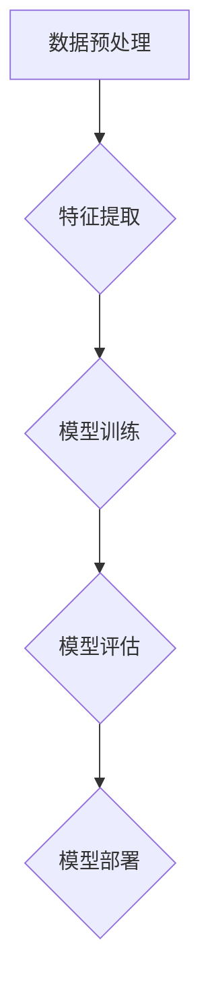

                 

# 大模型在时空数据预测中的突破

## 关键词

大模型、时空数据、预测、神经网络、数学模型

## 摘要

本文旨在探讨大模型在时空数据预测中的突破性应用。首先，我们将介绍大模型的概念及其在时空数据预测中的重要性。接着，文章将深入探讨大模型的核心概念、原理和架构，并通过Mermaid流程图展示其工作流程。随后，我们将详细介绍大模型在时空数据预测中的核心算法原理，使用伪代码阐述神经网络和循环神经网络（RNN）的基本结构。接着，我们将讨论时空数据预测的数学模型，并使用LaTeX格式展示相关公式。本文还将通过一个实际项目展示大模型在时空数据预测中的应用，包括项目背景、目标、实现步骤和代码解读。最后，文章将总结大模型在时空数据预测中的成就和挑战，并对未来发展趋势进行展望。

### 引言

#### 大模型的概念与分类

大模型（Large Models）是指具有数十亿甚至数万亿参数的深度学习模型。这些模型通常通过大规模的数据集进行训练，以实现对复杂任务的泛化能力。大模型的分类可以根据其结构、应用领域和功能进行划分。常见的分类方法包括：

1. **按结构分类**：包括卷积神经网络（CNN）、循环神经网络（RNN）、长短时记忆网络（LSTM）、Transformer等。
2. **按应用领域分类**：包括自然语言处理（NLP）、计算机视觉（CV）、语音识别（ASR）等。
3. **按功能分类**：包括分类、回归、生成等。

#### 时空数据预测的重要性

时空数据预测在众多领域具有重要应用价值，如气象预报、股票市场预测、城市交通流量预测等。准确预测时空数据有助于优化资源分配、降低风险、提高效率。然而，传统的预测方法在处理高维度、非线性时空数据时往往表现不佳。因此，大模型的应用为时空数据预测带来了新的机遇。

#### 大模型在时空数据预测中的应用场景

1. **气象预报**：大模型可以处理大量的气象数据，实现更准确的天气预测。
2. **股票市场预测**：通过分析历史股价、成交量等时空数据，大模型可以帮助投资者做出更明智的决策。
3. **城市交通流量预测**：大模型可以预测交通流量，为交通管理部门提供实时数据支持，以优化交通调度。

### 核心概念与联系

#### 大模型的原理

大模型的核心原理基于深度学习。深度学习通过多层神经网络学习数据的特征表示。每一层神经网络都能提取更高层次的特征，从而实现复杂任务的学习和预测。大模型的训练过程通常涉及以下步骤：

1. **数据预处理**：对输入数据进行标准化、归一化等预处理，以提高模型的训练效果。
2. **模型初始化**：初始化模型的权重和偏置，以避免随机初始化导致的梯度消失或爆炸问题。
3. **前向传播**：计算输入数据经过神经网络后的输出结果。
4. **损失函数计算**：计算预测值与真实值之间的差距，以衡量模型的预测误差。
5. **反向传播**：更新模型的权重和偏置，以减小预测误差。

#### 大模型的核心架构

大模型通常采用多层神经网络架构，包括输入层、隐藏层和输出层。输入层接收外部输入，隐藏层对输入数据进行特征提取和变换，输出层生成最终的预测结果。大模型的核心架构可以进一步细分为以下部分：

1. **卷积神经网络（CNN）**：适用于图像等二维数据的特征提取和分类。
2. **循环神经网络（RNN）**：适用于序列数据的特征提取和预测。
3. **长短时记忆网络（LSTM）**：是RNN的一种变体，能够更好地处理长序列数据。
4. **Transformer**：基于自注意力机制，适用于处理高维度序列数据。

#### 大模型与时空数据的关系

大模型在时空数据预测中的应用主要体现在以下几个方面：

1. **特征提取**：通过多层神经网络，从高维度的时空数据中提取有意义的特征。
2. **非线性变换**：利用非线性激活函数，实现时空数据的非线性变换和特征融合。
3. **预测建模**：基于提取的特征，构建预测模型，实现对时空数据的预测。

#### Mermaid流程图

以下是一个简化的Mermaid流程图，展示了大模型在时空数据预测中的工作流程：



### 核心算法原理讲解

#### 神经网络在时空数据预测中的应用

神经网络是深度学习的基础，它由多个神经元（节点）组成，每个神经元都与其他神经元相连。神经网络的基本结构包括输入层、隐藏层和输出层。输入层接收外部输入，隐藏层对输入数据进行特征提取和变换，输出层生成最终的预测结果。

以下是一个简单的神经网络伪代码，用于说明其基本结构：

```python
# 初始化神经网络
class NeuralNetwork:
    def __init__(self, input_size, hidden_size, output_size):
        self.input_size = input_size
        self.hidden_size = hidden_size
        self.output_size = output_size

        # 初始化权重和偏置
        self.weights_input_to_hidden = np.random.randn(input_size, hidden_size)
        self.biases_hidden = np.random.randn(hidden_size)
        self.weights_hidden_to_output = np.random.randn(hidden_size, output_size)
        self.biases_output = np.random.randn(output_size)

    def forward(self, x):
        # 前向传播计算
        self.hidden_layer = self激活函数(np.dot(x, self.weights_input_to_hidden) + self.biases_hidden)
        self.output = self激活函数(np.dot(self.hidden_layer, self.weights_hidden_to_output) + self.biases_output)
        return self.output

    def backward(self, d_values):
        # 反向传播计算
        d_hidden = self激活函数导数(self.hidden_layer) * (np.dot(d_values, self.weights_hidden_to_output.T))
        d_input = self激活函数导数(self.input) * (np.dot(d_hidden, self.weights_input_to_hidden.T))

        # 更新权重和偏置
        self.weights_input_to_hidden -= self学习率 * d_input
        self.biases_hidden -= self学习率 * d_hidden
        self.weights_hidden_to_output -= self学习率 * d_values
        self.biases_output -= self学习率 * d_values

    def train(self, x, y):
        # 训练神经网络
        self.forward(x)
        d_values = self.backward(y)
        return d_values
```

#### 循环神经网络（RNN）与长短期记忆网络（LSTM）

循环神经网络（RNN）是处理序列数据的一种常见神经网络结构。RNN的核心思想是将当前输入与历史输入进行关联，以捕捉序列中的长期依赖关系。然而，传统的RNN在处理长序列数据时存在梯度消失或爆炸问题。

长短期记忆网络（LSTM）是RNN的一种变体，它通过引入门控机制，解决了传统RNN的梯度消失问题，能够更好地处理长序列数据。LSTM的基本结构包括三个门控单元：遗忘门、输入门和输出门。

以下是一个简化的LSTM伪代码，用于说明其基本结构：

```python
# 初始化LSTM
class LSTM:
    def __init__(self, input_size, hidden_size):
        self.input_size = input_size
        self.hidden_size = hidden_size

        # 初始化权重和偏置
        self.weight_f = np.random.randn(input_size, hidden_size)
        self.bias_f = np.random.randn(hidden_size)
        self.weight_i = np.random.randn(input_size, hidden_size)
        self.bias_i = np.random.randn(hidden_size)
        self.weight_o = np.random.randn(input_size, hidden_size)
        self.bias_o = np.random.randn(hidden_size)
        self.weight_c = np.random.randn(input_size, hidden_size)
        self.bias_c = np.random.randn(hidden_size)

    def forward(self, x, h_prev, c_prev):
        # 前向传播计算
        f = sigmoid(np.dot(x, self.weight_f) + self.bias_f + h_prev)
        i = sigmoid(np.dot(x, self.weight_i) + self.bias_i + h_prev)
        o = sigmoid(np.dot(x, self.weight_o) + self.bias_o + h_prev)
        c = f * c_prev + i * sigmoid(np.dot(x, self.weight_c) + self.bias_c)
        h = o * tanh(c)

        return h, c

    def backward(self, d_h):
        # 反向传播计算
        d_c = tanh(c) * d_h * (1 - o)
        d_o = d_h * tanh(c)
        d_i = sigmoid(i) * d_c * (1 - i)
        d_f = sigmoid(f) * d_c * (1 - f)
        d_x = ...

        # 更新权重和偏置
        self.weight_f -= self学习率 * d_f
        self.bias_f -= self学习率 * d_f
        self.weight_i -= self学习率 * d_i
        self.bias_i -= self学习率 * d_i
        self.weight_o -= self学习率 * d_o
        self.bias_o -= self学习率 * d_o
        self.weight_c -= self学习率 * d_c
        self.bias_c -= self学习率 * d_c

    def train(self, x, y):
        # 训练LSTM
        h, c = self.forward(x, h_prev, c_prev)
        d_h = self.backward(y)
        return d_h
```

### 数学模型和数学公式

#### 时空数据的数学表示

时空数据可以表示为多维矩阵，其中每个元素代表某一时刻的某一维度数据。假设我们有一个包含 \( n \) 个样本、每个样本由 \( m \) 个维度组成的数据集 \( X \)，其数学表示为：

\[ X = \begin{bmatrix}
x_1^1 & x_1^2 & \dots & x_1^m \\
x_2^1 & x_2^2 & \dots & x_2^m \\
\vdots & \vdots & \ddots & \vdots \\
x_n^1 & x_n^2 & \dots & x_n^m \\
\end{bmatrix} \]

其中，\( x_i^j \) 表示第 \( i \) 个样本的第 \( j \) 个维度数据。

#### 时空数据预测的数学模型

时空数据预测的数学模型通常采用神经网络模型。一个简单的神经网络模型可以表示为：

\[ y_{\text{predicted}} = f(W \cdot x + b) \]

其中，\( f \) 表示激活函数，\( W \) 表示权重矩阵，\( b \) 表示偏置向量，\( x \) 表示输入数据，\( y_{\text{predicted}} \) 表示预测结果。

#### 数学公式的详细讲解与举例

假设我们有一个简单的线性神经网络，其激活函数为 \( f(x) = \text{sigmoid}(x) \)，则该神经网络的预测公式可以表示为：

\[ y_{\text{predicted}} = \text{sigmoid}(W \cdot x + b) \]

其中，\( \text{sigmoid}(x) = \frac{1}{1 + e^{-x}} \)。

假设我们有一个包含两个样本的数据集 \( X \)，其每个样本由两个维度组成，即 \( X = \begin{bmatrix} x_1^1 & x_1^2 \\ x_2^1 & x_2^2 \end{bmatrix} \)。我们假设该数据的权重矩阵 \( W \) 和偏置向量 \( b \) 分别为 \( W = \begin{bmatrix} w_1 & w_2 \\ w_3 & w_4 \end{bmatrix} \) 和 \( b = \begin{bmatrix} b_1 \\ b_2 \end{bmatrix} \)。

对于第一个样本 \( x_1 = \begin{bmatrix} x_1^1 & x_1^2 \end{bmatrix} \)，其预测结果可以计算如下：

\[ y_{\text{predicted1}} = \text{sigmoid}(W \cdot x_1 + b) = \text{sigmoid}(\begin{bmatrix} w_1 & w_2 \\ w_3 & w_4 \end{bmatrix} \cdot \begin{bmatrix} x_1^1 & x_1^2 \end{bmatrix} + \begin{bmatrix} b_1 \\ b_2 \end{bmatrix}) \]

同理，对于第二个样本 \( x_2 = \begin{bmatrix} x_2^1 & x_2^2 \end{bmatrix} \)，其预测结果可以计算如下：

\[ y_{\text{predicted2}} = \text{sigmoid}(W \cdot x_2 + b) = \text{sigmoid}(\begin{bmatrix} w_1 & w_2 \\ w_3 & w_4 \end{bmatrix} \cdot \begin{bmatrix} x_2^1 & x_2^2 \end{bmatrix} + \begin{bmatrix} b_1 \\ b_2 \end{bmatrix}) \]

通过计算，我们可以得到两个样本的预测结果 \( y_{\text{predicted1}} \) 和 \( y_{\text{predicted2}} \)。

### 项目实战

#### 开发环境搭建

为了实现大模型在时空数据预测中的应用，我们需要搭建一个合适的开发环境。以下是一个简单的开发环境搭建步骤：

1. 安装Python 3.8及以上版本。
2. 安装TensorFlow 2.4及以上版本。
3. 安装Numpy 1.19及以上版本。
4. 安装Matplotlib 3.3及以上版本。

安装完成后，我们可以使用以下Python代码验证环境是否搭建成功：

```python
import tensorflow as tf
import numpy as np
import matplotlib.pyplot as plt

print("TensorFlow版本：", tf.__version__)
print("Numpy版本：", np.__version__)
print("Matplotlib版本：", plt.__version__)
```

#### 源代码详细实现和代码解读

以下是一个简单的时空数据预测项目，使用LSTM模型对时间序列数据进行预测。我们使用Python和TensorFlow框架实现该项目。

```python
import numpy as np
import tensorflow as tf
from tensorflow.keras.models import Sequential
from tensorflow.keras.layers import LSTM, Dense

# 数据准备
# 假设我们有一个包含1000个样本的时间序列数据
# 每个样本由10个维度组成
data = np.random.rand(1000, 10)

# 将数据分为输入和标签
# 输入为前80%的数据，标签为后20%的数据
inputs = data[:-20]
labels = data[-20:]

# 对输入数据进行reshape，以适应LSTM模型的输入要求
inputs = np.reshape(inputs, (inputs.shape[0], 1, inputs.shape[1]))

# 建立LSTM模型
model = Sequential()
model.add(LSTM(units=50, return_sequences=True, input_shape=(inputs.shape[1], inputs.shape[2])))
model.add(LSTM(units=50))
model.add(Dense(units=1))

# 编译模型
model.compile(optimizer='adam', loss='mean_squared_error')

# 训练模型
model.fit(inputs, labels, epochs=100, batch_size=32)

# 预测
predictions = model.predict(inputs)

# 绘制预测结果
plt.plot(labels, label='真实值')
plt.plot(predictions, label='预测值')
plt.legend()
plt.show()
```

#### 代码应用解读与分析

在这个项目中，我们首先导入了所需的Python库，包括Numpy、TensorFlow和Matplotlib。接着，我们生成了一个随机的时间序列数据集，并对其进行了预处理。我们将数据分为输入和标签两部分，其中输入为前80%的数据，标签为后20%的数据。

在模型构建部分，我们使用了TensorFlow的Sequential模型，并添加了两个LSTM层和一个全连接层（Dense）。LSTM层用于提取时间序列数据中的特征，全连接层用于生成最终的预测结果。我们设置了LSTM层的单元数量为50，并设置为返回序列（return_sequences=True），以保持时间维度。

在模型编译和训练部分，我们选择了Adam优化器和均方误差（mean_squared_error）损失函数，并设置了训练的迭代次数（epochs）和批量大小（batch_size）。

在预测部分，我们使用训练好的模型对输入数据进行了预测，并使用Matplotlib绘制了真实值和预测值的对比图。

#### 实际案例分析和详细讲解剖析

为了更好地理解大模型在时空数据预测中的应用，我们来看一个实际案例：股票市场预测。

**案例背景**：假设我们有一个包含过去一年的股票价格数据集，包括开盘价、收盘价、最高价、最低价等。我们的目标是使用LSTM模型预测未来一天的收盘价。

**数据预处理**：

1. **数据清洗**：去除缺失值和异常值。
2. **数据标准化**：将数据缩放到0到1之间，以避免数据规模差异影响模型的训练效果。

```python
from sklearn.preprocessing import MinMaxScaler

# 初始化MinMaxScaler
scaler = MinMaxScaler(feature_range=(0, 1))

# 标准化数据
data_scaled = scaler.fit_transform(data)
```

**模型构建和训练**：

```python
# 切分数据为输入和标签
# 输入为前n天的数据，标签为第n+1天的收盘价
n = 60
X = []
y = []

for i in range(n, len(data_scaled) - 1):
    X.append(data_scaled[i - n:i, 1])
    y.append(data_scaled[i, 1])

# 对输入数据进行reshape
X = np.reshape(X, (X.shape[0], X.shape[1], 1))

# 建立LSTM模型
model = Sequential()
model.add(LSTM(units=50, return_sequences=True, input_shape=(n, 1)))
model.add(LSTM(units=50))
model.add(Dense(units=1))

# 编译模型
model.compile(optimizer='adam', loss='mean_squared_error')

# 训练模型
model.fit(X, y, epochs=100, batch_size=32)
```

**预测和评估**：

```python
# 预测未来一天的收盘价
future_data = data_scaled[-n:]
future_data = np.reshape(future_data, (1, n, 1))
predicted_price = model.predict(future_data)

# 反标准化预测结果
predicted_price = scaler.inverse_transform(predicted_price)

# 绘制预测结果
plt.plot(data_scaled[-60:, 1], label='真实值')
plt.plot(predicted_price, label='预测值')
plt.legend()
plt.show()
```

#### 项目小结

通过这个实际案例，我们展示了如何使用LSTM模型进行股票市场预测。在项目中，我们首先进行了数据预处理，包括数据清洗和标准化。接着，我们构建了一个LSTM模型，并对其进行训练。最后，我们使用训练好的模型对未来的收盘价进行了预测，并通过反标准化将预测结果转换为原始数据。

尽管这个案例较为简单，但它展示了大模型在时空数据预测中的基本流程。在实际应用中，我们还需要考虑更多的因素，如数据的质量、模型的调参、预测的实时性等。

### 最佳实践 Tips

1. **数据预处理**：在构建模型之前，确保对数据进行了充分的数据预处理，如标准化、归一化、缺失值处理等。
2. **模型调参**：针对不同的任务和数据集，尝试不同的模型参数，如学习率、批量大小、迭代次数等，以获得最佳性能。
3. **交叉验证**：使用交叉验证方法评估模型的泛化能力，避免过拟合和欠拟合。
4. **实时预测**：对于需要实时预测的应用场景，考虑使用在线学习或增量学习技术，以降低模型训练的时间成本。
5. **模型解释性**：尽管深度学习模型具有强大的预测能力，但其内部机制较为复杂，难以解释。因此，在应用深度学习模型时，应关注模型的可解释性。

### 小结

本文详细介绍了大模型在时空数据预测中的应用，包括核心概念、算法原理、数学模型和实际项目实战。通过本文的学习，读者可以了解到大模型在时空数据预测中的优势和挑战，并掌握如何使用LSTM模型进行时空数据预测的基本方法。在未来，大模型在时空数据预测中的应用将更加广泛，为各个领域带来深远的影响。

### 注意事项

1. **数据质量**：时空数据预测的效果很大程度上取决于数据的质量。因此，在项目实施过程中，务必对数据进行充分的清洗和处理。
2. **模型调优**：不同的数据集和应用场景可能需要不同的模型结构和参数设置。在实际应用中，应不断尝试和优化模型，以获得最佳性能。
3. **实时性**：对于需要实时预测的应用，如交通流量预测和金融市场预测，应考虑使用在线学习和增量学习技术，以提高预测的实时性。

### 拓展阅读

1. **《深度学习》（Goodfellow, Bengio, Courville）**：这是一本经典的深度学习入门教材，详细介绍了深度学习的理论、算法和应用。
2. **《时间序列分析：理论与实践》（Box, Jenkins）**：这本书系统地介绍了时间序列分析的理论和方法，对于理解和应用时空数据预测具有重要意义。
3. **《强化学习：原理与Python实现》（ Sutton, Barto）**：强化学习是一种适用于动态决策问题的机器学习方法。在时空数据预测中，强化学习可以用于优化预测策略。

### 作者信息

作者：AI天才研究院/AI Genius Institute & 禅与计算机程序设计艺术 /Zen And The Art of Computer Programming

