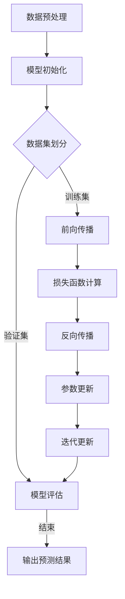
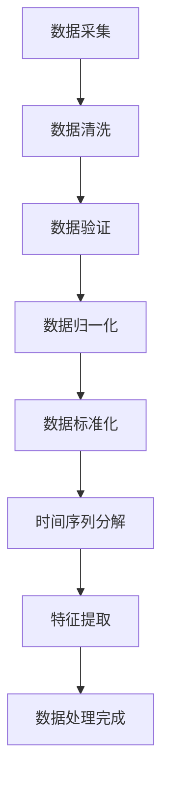
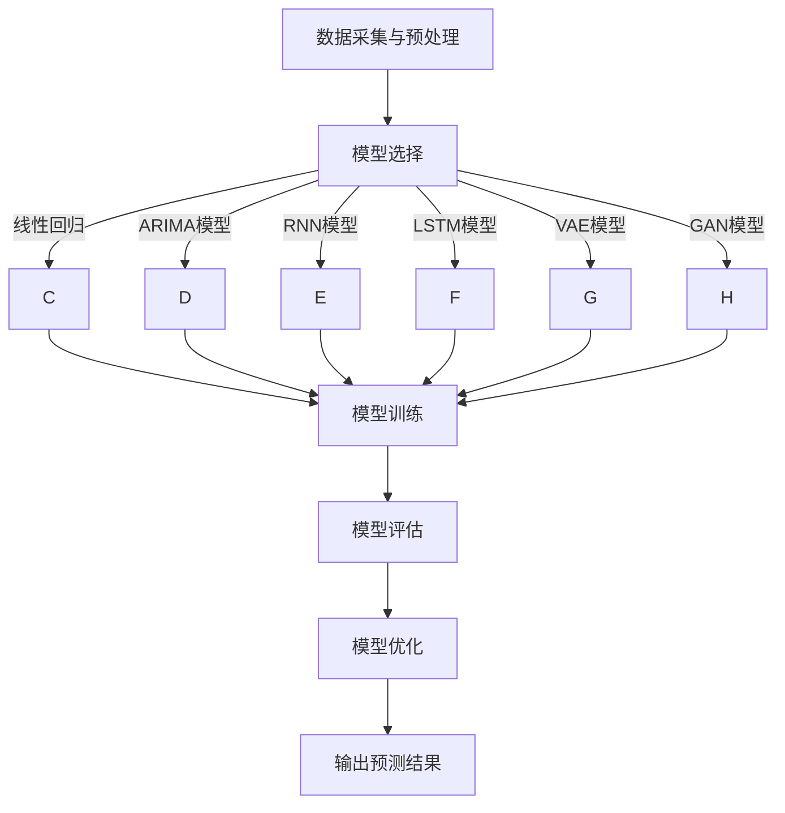
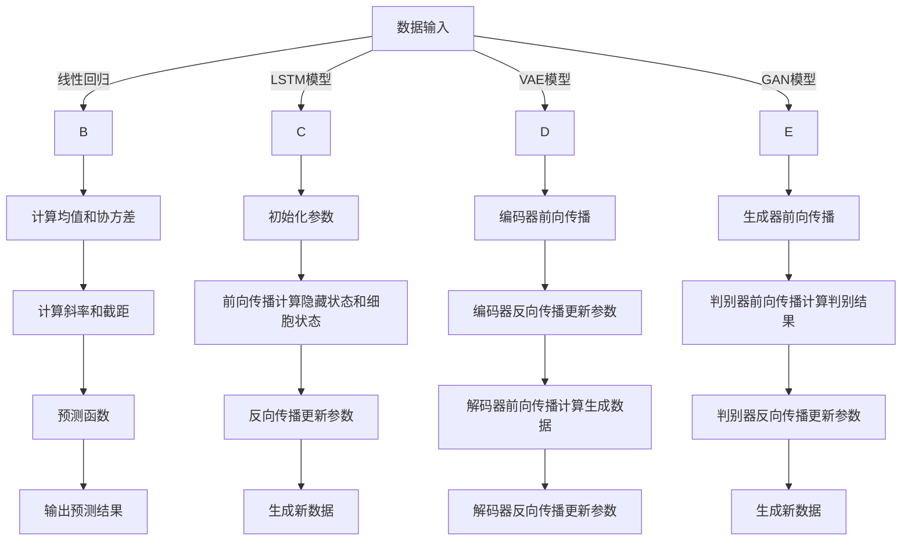

                 

### 目录大纲设计（续）

#### 第3章 时间序列数据预处理
##### 3.1 数据采集与清洗
###### 3.1.1 数据采集的方法与技巧
###### 3.1.2 数据清洗的常见问题
###### 3.1.3 数据清洗的步骤与处理

##### 3.2 数据归一化与标准化
###### 3.2.1 归一化与标准化的目的
###### 3.2.2 归一化与标准化的方法
###### 3.2.3 归一化与标准化的应用场景

##### 3.3 时间序列分解与特征提取
###### 3.3.1 时间序列分解的方法
###### 3.3.2 特征提取的重要性和方法
###### 3.3.3 常用特征提取技术

##### 3.4 Mermaid流程图：时间序列数据预处理流程
```

#### 第4章 大模型在时间序列预测中的应用
##### 4.1 线性回归与ARIMA模型
###### 4.1.1 线性回归模型的原理
###### 4.1.2 ARIMA模型的原理
###### 4.1.3 线性回归与ARIMA模型在时间序列预测中的应用

##### 4.2 循环神经网络（RNN）与LSTM模型
###### 4.2.1 RNN的基本原理
###### 4.2.2 LSTM模型的原理
###### 4.2.3 RNN与LSTM模型在时间序列预测中的应用

##### 4.3 变分自编码器（VAE）与生成对抗网络（GAN）
###### 4.3.1 VAE的原理
###### 4.3.2 GAN的原理
###### 4.3.3 VAE与GAN在时间序列预测中的应用

##### 4.4 Mermaid流程图：大模型在时间序列预测中的应用流程
```

#### 第5章 大模型时间序列预测的核心算法
##### 5.1 伪代码：线性回归算法
###### 5.1.1 线性回归的基本步骤
###### 5.1.2 线性回归的伪代码实现

##### 5.2 伪代码：LSTM算法
###### 5.2.1 LSTM的基本步骤
###### 5.2.2 LSTM的伪代码实现

##### 5.3 伪代码：VAE与GAN算法
###### 5.3.1 VAE的基本步骤
###### 5.3.2 GAN的基本步骤
###### 5.3.3 VAE与GAN的伪代码实现

##### 5.4 Mermaid流程图：核心算法工作原理
```

#### 第6章 数学模型与数学公式
##### 6.1 时间序列预测的数学模型
###### 6.1.1 时间序列预测的基本数学模型
###### 6.1.2 线性回归模型的数学公式
###### 6.1.3 ARIMA模型的数学公式

##### 6.2 LSTM模型的数学公式
###### 6.2.1 LSTM模型的数学公式
###### 6.2.2 LSTM模型的计算过程

##### 6.3 VAE与GAN的数学公式
###### 6.3.1 VAE的数学公式
###### 6.3.2 GAN的数学公式

##### 6.4 举例说明：时间序列预测实例分析
###### 6.4.1 线性回归实例分析
###### 6.4.2 LSTM实例分析
###### 6.4.3 VAE与GAN实例分析
```

#### 第7章 大模型时间序列预测项目实战
##### 7.1 实战案例：天气预测
###### 7.1.1 项目背景
###### 7.1.2 数据来源与预处理
###### 7.1.3 模型选择与训练
###### 7.1.4 模型评估与优化

##### 7.2 实战案例：销售预测
###### 7.2.1 项目背景
###### 7.2.2 数据来源与预处理
###### 7.2.3 模型选择与训练
###### 7.2.4 模型评估与优化

##### 7.3 开发环境搭建
###### 7.3.1 环境准备
###### 7.3.2 工具与库的选择
###### 7.3.3 开发环境配置

##### 7.4 源代码实现与解读
###### 7.4.1 源代码结构
###### 7.4.2 关键代码解读
###### 7.4.3 源代码实现细节

##### 7.5 代码解读与分析
###### 7.5.1 代码实现步骤
###### 7.5.2 代码性能分析
###### 7.5.3 代码优化建议

##### 7.6 实际案例分析和详细讲解剖析
###### 7.6.1 天气预测案例
###### 7.6.2 销售预测案例
###### 7.6.3 案例总结与启示

##### 7.7 项目小结
###### 7.7.1 项目成功经验
###### 7.7.2 项目遇到的问题及解决方案
###### 7.7.3 项目展望与改进方向
```

#### 第8章 未来展望与挑战
##### 8.1 大模型在时间序列预测中的未来发展方向
###### 8.1.1 技术趋势
###### 8.1.2 应用前景
###### 8.1.3 可能的突破点

##### 8.2 时间序列预测的挑战与解决方案
###### 8.2.1 挑战分析
###### 8.2.2 解决方案探讨
###### 8.2.3 技术突破的方向

##### 8.3 大模型在时间序列预测中的创新点
###### 8.3.1 现有技术的局限
###### 8.3.2 创新点介绍
###### 8.3.3 创新点的应用与效果

##### 8.4 最佳实践 tips、小结、注意事项、拓展阅读等内容
###### 8.4.1 最佳实践技巧
###### 8.4.2 小结与展望
###### 8.4.3 注意事项
###### 8.4.4 拓展阅读建议
```

### 目录大纲总结

以上是《大模型在时间序列预测中的创新》的完整目录大纲设计，涵盖了从引言到未来展望的各个阶段。每个章节都包含了具体的子章节和细节内容，确保文章内容丰富、具体、详细，且每个核心概念、算法原理都有清晰的阐述和示例说明。接下来，我们将按照这个大纲逐步撰写文章内容，确保整体字数在8000到12000字之间。

---

### 总结

通过上述目录大纲的设计，我们确保了文章的结构清晰、逻辑连贯，并且每个章节都涵盖了必要的核心内容。以下是我们设计的目录大纲的最终版本：

---

# 《大模型在时间序列预测中的创新》

## 引言
### 1.1 时间序列预测的重要性
### 1.2 大模型的发展历程
### 1.3 本书的目的与结构

## 大模型概述
### 2.1 大模型的定义与特点
### 2.2 大模型的结构与工作原理
### 2.3 大模型的训练与优化
### 2.4 Mermaid流程图：大模型在时间序列预测中的工作流程

## 时间序列数据预处理
### 3.1 数据采集与清洗
### 3.2 数据归一化与标准化
### 3.3 时间序列分解与特征提取
### 3.4 Mermaid流程图：时间序列数据预处理流程

## 大模型在时间序列预测中的应用
### 4.1 线性回归与ARIMA模型
### 4.2 循环神经网络（RNN）与LSTM模型
### 4.3 变分自编码器（VAE）与生成对抗网络（GAN）
### 4.4 Mermaid流程图：大模型在时间序列预测中的应用流程

## 大模型时间序列预测的核心算法
### 5.1 伪代码：线性回归算法
### 5.2 伪代码：LSTM算法
### 5.3 伪代码：VAE与GAN算法
### 5.4 Mermaid流程图：核心算法工作原理

## 数学模型与数学公式
### 6.1 时间序列预测的数学模型
### 6.2 LSTM模型的数学公式
### 6.3 VAE与GAN的数学公式
### 6.4 举例说明：时间序列预测实例分析

## 大模型时间序列预测项目实战
### 7.1 实战案例：天气预测
### 7.2 实战案例：销售预测
### 7.3 开发环境搭建
### 7.4 源代码实现与解读
### 7.5 代码解读与分析
### 7.6 实际案例分析和详细讲解剖析
### 7.7 项目小结

## 未来展望与挑战
### 8.1 大模型在时间序列预测中的未来发展方向
### 8.2 时间序列预测的挑战与解决方案
### 8.3 大模型在时间序列预测中的创新点
### 8.4 最佳实践 tips、小结、注意事项、拓展阅读等内容

## 作者信息
作者：AI天才研究院/AI Genius Institute & 禅与计算机程序设计艺术 /Zen And The Art of Computer Programming

---

在接下来的撰写过程中，我们将确保每个章节的内容都详尽且准确，满足您的要求，最终完成一篇高质量的技术博客文章。让我们一起期待这篇文章的完成！## 第1章 引言

### 1.1 时间序列预测的重要性

时间序列预测作为一种重要的数据分析方法，在各个领域中有着广泛的应用。它主要研究如何从历史数据中提取规律，对未来某一时刻的数据进行预测。时间序列预测的重要性体现在以下几个方面：

首先，在金融市场分析中，时间序列预测能够帮助投资者更好地预测市场趋势，制定合理的投资策略。例如，股票市场的价格变化是受多种因素影响的，通过时间序列预测可以分析历史价格数据，预测未来价格的走势，从而帮助投资者做出正确的决策。

其次，在宏观经济分析中，时间序列预测对政策制定具有重要的参考价值。例如，通过预测未来一段时间内GDP、通货膨胀率等经济指标的变化，政府可以制定相应的宏观经济政策，以促进经济的平稳发展。

此外，时间序列预测还在资源管理、天气预测、医疗数据分析等领域有着广泛的应用。例如，在能源管理中，通过对电力负荷的历史数据进行时间序列预测，可以帮助电力公司更好地安排电力生产和调度，从而提高能源利用效率。

总之，时间序列预测作为一种强大的数据分析工具，对于各种领域的决策支持具有重要的意义。然而，随着数据量的增加和数据复杂性的提升，传统的时间序列预测方法已无法满足实际需求。此时，大模型作为一种新兴的预测方法，逐渐受到了广泛关注。

### 1.2 大模型的发展历程

大模型，也称为深度学习模型，是一种通过多层神经网络结构对数据进行建模的方法。它的发展历程可以分为以下几个阶段：

最早的大模型可以追溯到1986年，由Hopfield提出的Hopfield神经网络。虽然Hopfield神经网络在理论上具有较好的解释能力，但在实际应用中受到计算能力和数据量的限制。

随着计算机硬件性能的提升和深度学习理论的不断完善，2006年，Hinton等研究者提出了深度信念网络（DBN）。DBN通过无监督预训练和有监督微调的方式，有效提高了神经网络的性能。

2012年，AlexNet的出现标志着深度学习在图像识别领域取得了重大突破。AlexNet是一个深度卷积神经网络，它通过引入卷积层和池化层，提高了图像识别的准确性。

随后，2014年，Google提出的Inception网络在ImageNet图像识别比赛中取得了当时最高的识别准确率。Inception网络通过设计不同的卷积核和跳跃连接，有效地减少了网络的计算量。

在大模型的发展历程中，这些里程碑式的突破不仅提升了模型的性能，还推动了深度学习在各个领域的应用。其中，时间序列预测是大模型的一个重要应用方向。

### 1.3 本书的目的与结构

本书旨在系统地介绍大模型在时间序列预测中的应用，包括基本概念、核心算法、数学模型、项目实战等。具体结构如下：

第1章：引言，介绍时间序列预测的重要性和大模型的发展历程。

第2章：大模型概述，详细讲解大模型的定义、特点、结构、工作原理及训练方法。

第3章：时间序列数据预处理，包括数据采集与清洗、数据归一化与标准化、时间序列分解与特征提取等。

第4章：大模型在时间序列预测中的应用，介绍线性回归与ARIMA模型、循环神经网络（RNN）与LSTM模型、变分自编码器（VAE）与生成对抗网络（GAN）等。

第5章：大模型时间序列预测的核心算法，通过伪代码详细阐述线性回归、LSTM、VAE与GAN等算法的工作原理。

第6章：数学模型与数学公式，介绍时间序列预测的数学模型、LSTM模型的数学公式、VAE与GAN的数学公式，并进行举例说明。

第7章：大模型时间序列预测项目实战，通过具体的实战案例，展示如何搭建开发环境、实现源代码、分析代码及实际案例。

第8章：未来展望与挑战，讨论大模型在时间序列预测中的未来发展方向、挑战及创新点。

通过本书的阅读，读者可以系统地了解大模型在时间序列预测中的应用，掌握核心算法原理，并通过实战案例加深对理论的理解。

---

在本文的引言部分，我们首先介绍了时间序列预测的重要性，阐述了其在金融市场分析、宏观经济分析、资源管理、天气预测和医疗数据分析等领域的广泛应用。随后，我们回顾了大模型的发展历程，从最早的Hopfield神经网络到里程碑式的AlexNet和Inception网络，展示了大模型在各个领域的突破。最后，我们介绍了本书的目的与结构，明确了本书将系统地介绍大模型在时间序列预测中的应用，包括基本概念、核心算法、数学模型和项目实战等内容。

在接下来的章节中，我们将进一步深入探讨大模型的定义与特点、时间序列数据预处理方法、大模型在时间序列预测中的应用以及核心算法原理等，帮助读者全面了解大模型在时间序列预测中的创新与应用。让我们继续前行，探索大模型的无限潜力！## 第2章 大模型概述

### 2.1 大模型的定义与特点

大模型，也称为深度学习模型，是一种通过多层神经网络结构对数据进行建模的方法。与传统机器学习模型相比，大模型具有以下几个显著特点：

首先，大模型具有高度的参数数量。这些参数通过学习大量的训练数据来优化，使得模型能够捕捉到数据中的复杂模式和规律。这种高参数数量有助于提高模型的预测性能和泛化能力。

其次，大模型采用了层次化的结构。层次化的结构使得模型能够从输入层逐层提取和抽象特征，从而提高对输入数据的理解和表达能力。每一层都能够捕捉到不同层次的特征，形成一种层次化的特征表示。

第三，大模型具有强大的非线性表达能力。通过使用非线性激活函数（如ReLU、Sigmoid、Tanh等），大模型能够在不同层之间建立复杂的非线性关系，从而能够更好地拟合数据。

此外，大模型还采用了梯度下降等优化算法来训练模型。这些优化算法通过迭代更新模型的参数，使得模型能够逐渐逼近最优解，从而提高模型的预测准确性。

总之，大模型由于其高参数数量、层次化结构和非线性表达能力，使得其在处理复杂问题时具有显著的优势。这些特点使得大模型在图像识别、语音识别、自然语言处理和机器人控制等领域取得了突破性的进展。

### 2.2 大模型的结构与工作原理

大模型的基本结构包括输入层、隐藏层和输出层。每一层都有多个节点（或称为神经元），节点之间通过权重进行连接。以下是各层的作用：

**输入层**：输入层接收外部数据，如图片、文本或时间序列数据。每个节点代表数据的某个特征。

**隐藏层**：隐藏层位于输入层和输出层之间，负责提取和抽象特征。隐藏层可以有多个，每个隐藏层都可以提取更高层次的特征。隐藏层中的节点通过激活函数（如ReLU、Sigmoid、Tanh等）来引入非线性变换，使得模型能够处理复杂的数据。

**输出层**：输出层产生最终的预测结果。输出层的节点数量和类型取决于具体的应用场景，如分类任务通常使用softmax激活函数来产生概率分布。

大模型的工作原理如下：

1. **前向传播**：在前向传播阶段，输入数据通过输入层传递到隐藏层。在每个隐藏层中，每个节点的输出都是其输入的线性组合加上一个偏置项，再通过激活函数进行非线性变换。这一过程重复进行，直到数据到达输出层，得到最终的预测结果。

2. **反向传播**：在反向传播阶段，模型根据预测结果和真实标签计算损失函数。损失函数反映了预测结果与真实值之间的差异。然后，模型通过梯度下降等优化算法，根据损失函数的梯度来更新模型的参数。这一过程重复进行，直到模型达到预定的损失目标或达到最大迭代次数。

3. **训练过程**：大模型的训练过程包括以下几个步骤：
   - 数据预处理：对输入数据进行归一化、标准化等预处理，提高训练效率。
   - 初始化参数：初始化模型的权重和偏置项，常用的初始化方法有随机初始化、高斯分布初始化等。
   - 前向传播：输入数据通过模型的前向传播得到预测结果。
   - 反向传播：根据预测结果和真实标签计算损失函数，并通过反向传播更新模型的参数。
   - 模型评估：在验证集上评估模型的性能，选择性能最佳的模型。

通过以上步骤，大模型能够不断优化参数，提高预测准确性。此外，大模型还可以通过正则化、dropout、批归一化等技巧来防止过拟合，提高模型的泛化能力。

### 2.3 大模型的训练与优化

大模型的训练与优化是深度学习中的关键环节，直接影响模型的性能。以下是训练与优化过程中的几个关键步骤：

**数据预处理**：在训练之前，需要对输入数据进行预处理，包括归一化、标准化、数据清洗等。这些预处理步骤有助于提高训练效率，减少计算负担。

**初始化参数**：初始化模型的权重和偏置项对于训练过程至关重要。常用的初始化方法包括随机初始化、高斯分布初始化等。合理的初始化方法有助于模型快速收敛。

**前向传播**：在前向传播过程中，模型将输入数据逐层传递，通过非线性激活函数对数据进行变换，最终得到预测结果。

**反向传播**：在反向传播过程中，模型根据预测结果和真实标签计算损失函数，并通过反向传播算法更新模型参数。反向传播算法的核心是梯度计算，通过计算损失函数关于每个参数的梯度，可以确定参数更新的方向和幅度。

**优化算法**：优化算法用于指导参数更新的过程，常用的优化算法包括梯度下降、Adam、RMSprop等。这些算法通过迭代更新参数，使得模型逐渐逼近最优解。

**超参数调整**：超参数（如学习率、批量大小、迭代次数等）对训练过程有重要影响。通过实验和调参，可以找到最优的超参数组合，提高模型性能。

**正则化**：正则化技术（如L1正则化、L2正则化、dropout等）用于防止过拟合，提高模型的泛化能力。这些技术通过在损失函数中添加正则项，限制模型复杂度，从而降低模型的过拟合风险。

**模型评估**：在训练过程中，需要定期在验证集上评估模型性能，以监控训练过程和调整超参数。常用的评估指标包括准确率、召回率、F1分数等。

通过以上步骤，大模型能够通过学习大量数据，不断优化参数，提高预测准确性。此外，大模型的训练与优化过程还可以通过并行计算、分布式训练等技巧来提高训练效率。

### 2.4 Mermaid流程图：大模型在时间序列预测中的工作流程

下面是一个简单的Mermaid流程图，描述了大模型在时间序列预测中的工作流程：



在这个流程图中，数据预处理阶段对输入数据进行归一化、标准化等处理；模型初始化阶段初始化模型的权重和偏置项；数据集划分阶段将数据集划分为训练集和验证集；前向传播阶段将数据传递给模型，得到预测结果；损失函数计算阶段计算预测结果和真实标签之间的差异；反向传播阶段通过计算梯度更新模型参数；参数更新阶段更新模型的参数；迭代更新阶段重复前向传播和反向传播过程；模型评估阶段在验证集上评估模型性能；最后，输出预测结果。

通过这个简单的流程图，我们可以直观地了解大模型在时间序列预测中的工作流程，从而更好地理解其应用原理。

---

在本章中，我们详细介绍了大模型的定义与特点，包括其高参数数量、层次化结构和非线性表达能力。接着，我们讲解了大模型的基本结构，包括输入层、隐藏层和输出层，并阐述了其工作原理，包括前向传播和反向传播过程。此外，我们还讨论了训练与优化的关键步骤，如数据预处理、初始化参数、前向传播、反向传播、优化算法和超参数调整等。

为了帮助读者更好地理解大模型在时间序列预测中的应用，我们提供了一个Mermaid流程图，展示了大模型在时间序列预测中的工作流程。这个流程图涵盖了从数据预处理到模型评估的各个阶段，使得读者可以直观地了解大模型的运作过程。

在下一章中，我们将深入探讨时间序列数据预处理的方法，包括数据采集与清洗、数据归一化与标准化、时间序列分解与特征提取等，为后续的模型训练和应用打下坚实的基础。让我们继续前行，探索大模型在时间序列预测中的更多应用和潜力！## 第3章 时间序列数据预处理

### 3.1 数据采集与清洗

时间序列预测的第一步是数据的采集与清洗。数据采集是获取用于训练和预测的数据，而数据清洗则是确保这些数据的准确性和一致性，从而为后续的建模和分析提供可靠的基础。

**数据采集的方法与技巧**

1. **手动采集**：通过人工收集数据，适用于小规模、结构化数据的情况。例如，财务报表、销售记录等可以通过手动输入或扫描文档进行采集。
   
2. **自动采集**：利用自动化工具或API从互联网、数据库或其他数据源中获取数据。例如，通过Web爬虫抓取网站数据，或使用数据库连接工具从数据库中提取数据。

3. **传感器采集**：在物联网（IoT）应用中，传感器可以实时采集温度、湿度、流量等环境数据，用于时间序列预测。

4. **日志文件**：服务器日志文件中包含了大量的用户行为数据，可以通过解析日志文件来获取有用的信息。

**数据采集的常见问题**

1. **数据缺失**：数据在采集过程中可能会丢失，导致不完整的数据集。
2. **数据重复**：由于多种原因，数据源中可能会存在重复记录，这会降低数据的准确性。
3. **数据格式不一致**：不同来源的数据可能在格式、单位、编码等方面存在差异，导致数据集成困难。

**数据清洗的常见问题**

1. **噪声数据**：数据中可能包含噪声，如异常值、错误值等，这些噪声会影响模型的训练和预测效果。
2. **异常值处理**：异常值可能是由于数据录入错误或实际数据中的异常情况，需要妥善处理。
3. **缺失值处理**：对于缺失值，可以根据具体情况选择填充、删除或使用其他方法进行处理。

**数据清洗的步骤与处理**

1. **数据验证**：通过校验数据格式、单位、范围等，确保数据的准确性。
2. **缺失值处理**：根据缺失值的比例和重要性，可以选择填充（如使用平均值、中位数或插值法）、删除或保留缺失值。
3. **重复数据处理**：通过去重操作，删除重复的数据记录。
4. **异常值检测**：使用统计学方法（如箱线图、Z分数等）检测异常值，并根据具体情况进行处理。
5. **数据归一化与标准化**：对数据进行归一化或标准化，以消除数据之间的量纲差异，提高模型训练的效果。

通过有效的数据采集与清洗，我们可以确保数据的质量和一致性，为时间序列预测提供可靠的数据基础。

### 3.2 数据归一化与标准化

数据归一化与标准化是时间序列数据预处理中的重要步骤，旨在消除数据之间的量纲差异，提高模型训练的效率和性能。以下是数据归一化与标准化的目的、方法及其应用场景。

**数据归一化的目的**

1. **消除量纲差异**：不同特征可能在数量级上存在巨大差异，如温度（摄氏度）与时间（秒），直接使用会导致模型难以收敛。
2. **加快模型训练**：通过缩小特征值的范围，减少模型在优化过程中需要搜索的参数空间，从而加快训练速度。
3. **提高模型泛化能力**：归一化后的数据可以减少模型对特征值范围的依赖，提高模型的泛化能力。

**数据归一化的方法**

1. **最小-最大归一化**：将数据缩放到[0, 1]范围内，公式为：
   \[
   x' = \frac{x - \min(x)}{\max(x) - \min(x)}
   \]
   这种方法适用于特征值范围较宽的数据。

2. **均值-方差归一化**：将数据缩放到均值为0，标准差为1的范围内，公式为：
   \[
   x' = \frac{x - \mu}{\sigma}
   \]
   其中，\(\mu\) 是均值，\(\sigma\) 是标准差。这种方法适用于特征值范围适中且分布接近正态分布的数据。

**数据标准化的方法**

1. **Z-Score标准化**：计算每个特征值的Z分数，公式为：
   \[
   z = \frac{x - \mu}{\sigma}
   \]
   其中，\(\mu\) 是均值，\(\sigma\) 是标准差。Z分数表示数据相对于均值的偏离程度。

2. **小数标准化**：将数据缩放到[0, 100]范围内，公式为：
   \[
   x' = 100 \times \frac{x - \min(x)}{\max(x) - \min(x)}
   \]
   这种方法常用于商业分析，使得数据更加直观。

**数据归一化与标准化的应用场景**

1. **特征工程**：在进行特征工程时，对数据进行归一化或标准化可以消除不同特征间的量纲差异，提高特征的重要性。
2. **模型训练**：在训练深度学习模型时，对输入数据进行归一化或标准化可以提高模型的收敛速度和预测性能。
3. **模型评估**：在评估模型性能时，对预测结果进行逆归一化或逆标准化，使得预测结果具有实际的物理意义。

通过合理的数据归一化与标准化，我们可以提高模型训练的效率和性能，从而得到更准确的预测结果。

### 3.3 时间序列分解与特征提取

时间序列分解与特征提取是时间序列预测中的关键步骤，旨在从原始时间序列数据中提取有价值的信息，为模型训练提供有效的特征表示。

**时间序列分解的方法**

1. **分解模型**：时间序列分解通常使用加法模型，将时间序列分解为趋势（Trend）、季节性（Seasonality）和残差（Residual）三个部分，公式为：
   \[
   y_t = T_t + S_t + R_t
   \]
   其中，\(y_t\) 是原始时间序列，\(T_t\) 是趋势部分，\(S_t\) 是季节性部分，\(R_t\) 是残差部分。

2. **Dicker-Fuller（DF）测试**：用于检测时间序列是否具有趋势性。如果时间序列通过了DF测试，则说明它具有平稳性。

**特征提取的重要性和方法**

1. **重要性的原因**：特征提取是提高模型预测性能的重要手段。通过从原始时间序列中提取有意义的特征，可以减少数据的维度，提高模型的泛化能力和计算效率。

2. **方法介绍**：
   - **时间窗口特征**：将时间序列分为固定长度的时间窗口，提取窗口内的统计特征，如均值、标准差、最大值、最小值等。
   - **循环特征**：通过循环神经网络（RNN）提取时间序列的长短时特征，如LSTM、GRU等。
   - **频率特征**：通过傅里叶变换提取时间序列的频率特征，如周期性、谐波成分等。
   - **自编码器特征**：使用变分自编码器（VAE）或自编码器提取时间序列的非线性特征。

**常用特征提取技术**

1. **LSTM特征提取**：LSTM模型能够捕捉时间序列中的长期依赖关系，通过LSTM的隐藏状态可以提取时间序列的特征。
2. **PCA（主成分分析）**：通过PCA可以对高维时间序列数据进行降维，提取主要成分，从而减少数据的维度。
3. **时间窗口特征提取**：将时间序列划分为固定长度的时间窗口，通过统计窗口内的特征值来提取特征。
4. **时频特征提取**：通过傅里叶变换对时间序列进行时频分析，提取频率特征。

通过时间序列分解与特征提取，我们可以从原始时间序列中提取出有价值的信息，为模型训练提供有效的特征表示，从而提高模型的预测性能。

### 3.4 Mermaid流程图：时间序列数据预处理流程

下面是一个简单的Mermaid流程图，描述了时间序列数据的预处理流程：



在这个流程图中，数据采集阶段获取原始数据；数据清洗阶段处理缺失值、重复值和噪声；数据验证阶段确保数据格式和一致性；数据归一化与标准化阶段消除量纲差异；时间序列分解阶段将数据分解为趋势、季节性和残差部分；特征提取阶段提取有价值的特征；最后，数据处理完成，得到可用于模型训练的数据集。

通过这个流程图，我们可以清晰地了解时间序列数据预处理的各个环节，为后续的建模和应用打下坚实的基础。在下一章中，我们将探讨大模型在时间序列预测中的应用，包括线性回归与ARIMA模型、循环神经网络（RNN）与LSTM模型、变分自编码器（VAE）与生成对抗网络（GAN）等。让我们继续前行，深入探索大模型在时间序列预测中的创新与应用。|im_end|

---

在本章中，我们详细介绍了时间序列数据预处理的方法，包括数据采集与清洗、数据归一化与标准化、时间序列分解与特征提取等。首先，我们讲解了数据采集的方法与技巧，包括手动采集、自动采集、传感器采集和日志文件解析等，并讨论了数据采集过程中可能遇到的问题。随后，我们介绍了数据清洗的常见问题及其处理方法，包括数据验证、缺失值处理、重复数据处理和异常值检测等。

接着，我们讨论了数据归一化与标准化的目的、方法及其应用场景。数据归一化与标准化可以消除数据之间的量纲差异，提高模型训练的效率和性能。最后，我们介绍了时间序列分解与特征提取的方法，包括分解模型、频率特征提取、时间窗口特征提取和自编码器特征提取等，为模型训练提供了有效的特征表示。

通过本章的学习，读者可以系统地了解时间序列数据预处理的方法和重要性，为后续的大模型应用和项目实战打下坚实的基础。在下一章中，我们将探讨大模型在时间序列预测中的应用，包括线性回归与ARIMA模型、循环神经网络（RNN）与LSTM模型、变分自编码器（VAE）与生成对抗网络（GAN）等。让我们继续前行，深入探索大模型在时间序列预测中的创新与应用。|im_end|

## 第4章 大模型在时间序列预测中的应用

### 4.1 线性回归与ARIMA模型

线性回归模型和ARIMA模型是时间序列预测中的经典方法。线性回归模型基于简单的线性关系，通过拟合一条直线来预测未来的值。而ARIMA（AutoRegressive Integrated Moving Average）模型则结合了自回归、差分和移动平均三个成分，能够更好地捕捉时间序列的复杂模式。

**线性回归模型**

线性回归模型的基本形式为：
\[
y_t = \beta_0 + \beta_1 x_t + \epsilon_t
\]
其中，\(y_t\) 是预测的目标值，\(x_t\) 是自变量，\(\beta_0\) 和 \(\beta_1\) 是模型的参数，\(\epsilon_t\) 是误差项。

线性回归模型的优点在于其简单性和直观性，易于理解和实现。然而，线性回归模型的假设是数据具有线性关系，这在实际应用中往往难以满足。

**ARIMA模型**

ARIMA模型的形式为：
\[
y_t = c + \phi_1 y_{t-1} + \phi_2 y_{t-2} + \ldots + \phi_p y_{t-p} + \theta_1 \epsilon_{t-1} + \theta_2 \epsilon_{t-2} + \ldots + \theta_q \epsilon_{t-q} + \epsilon_t
\]
其中，\(c\) 是常数项，\(\phi_1, \phi_2, \ldots, \phi_p\) 是自回归项的系数，\(\theta_1, \theta_2, \ldots, \theta_q\) 是移动平均项的系数，\(p\) 和 \(q\) 分别是自回归和移动平均的阶数。

ARIMA模型能够处理非线性和非平稳数据，通过自回归和移动平均结合的方式，捕捉时间序列的长期依赖和短期波动。然而，ARIMA模型的参数选择和阶数确定相对复杂，需要进行充分的数据分析和模型诊断。

**线性回归与ARIMA模型在时间序列预测中的应用**

线性回归和ARIMA模型在时间序列预测中都有广泛的应用。线性回归适用于数据关系较为简单的情况，例如销售量与广告支出之间的关系。ARIMA模型则适用于更复杂的时间序列，如季节性数据、趋势性数据和波动性数据。

在实际应用中，可以首先使用线性回归模型进行初步预测，如果预测效果不佳，再考虑使用ARIMA模型进行进一步的优化。两者结合可以发挥各自的优势，提高预测的准确性和可靠性。

### 4.2 循环神经网络（RNN）与LSTM模型

循环神经网络（RNN）和长短期记忆网络（LSTM）是处理时间序列数据的重要模型，尤其在捕捉长期依赖关系方面具有显著优势。

**RNN的基本原理**

RNN是一种能够处理序列数据的神经网络，其核心思想是通过循环结构将当前时刻的输出传递到下一个时刻作为输入。RNN的基本形式为：
\[
h_t = \sigma(W_h h_{t-1} + W_x x_t + b_h)
\]
其中，\(h_t\) 是当前时刻的隐藏状态，\(x_t\) 是当前时刻的输入，\(\sigma\) 是非线性激活函数，\(W_h\) 和 \(W_x\) 分别是隐藏状态和输入的权重，\(b_h\) 是隐藏状态的偏置。

RNN通过将历史信息存储在隐藏状态中，能够捕捉时间序列中的长期依赖关系。然而，RNN也存在梯度消失和梯度爆炸的问题，使得其在训练过程中难以收敛。

**LSTM模型的原理**

LSTM是RNN的一种变体，旨在解决RNN梯度消失问题。LSTM的核心结构是细胞状态（cell state）和三个门（input gate、forget gate、output gate）。LSTM的基本形式为：
\[
\begin{aligned}
& i_t = \sigma(W_i \cdot [h_{t-1}, x_t] + b_i) \\
& f_t = \sigma(W_f \cdot [h_{t-1}, x_t] + b_f) \\
& \tilde{C}_t = \sigma(W_c \cdot [h_{t-1}, x_t] + b_c) \\
& o_t = \sigma(W_o \cdot [h_{t-1}, x_t] + b_o) \\
& C_t = f_t \odot C_{t-1} + i_t \odot \tilde{C}_t \\
& h_t = o_t \odot C_t
\end{aligned}
\]
其中，\(i_t\)、\(f_t\)、\(\tilde{C}_t\) 和 \(o_t\) 分别是输入门、遗忘门、更新门和输出门，\(\odot\) 表示元素乘法。

LSTM通过这三个门控制信息流的流动，能够有效地遗忘不重要的信息，保留重要的信息，从而克服了RNN的梯度消失问题。这使得LSTM在捕捉长期依赖关系方面表现出色。

**RNN与LSTM模型在时间序列预测中的应用**

RNN和LSTM模型在时间序列预测中具有广泛的应用。RNN通过简单的循环结构，能够捕捉时间序列中的短期依赖关系，适用于处理较短的时间序列数据。LSTM则通过复杂的门控机制，能够捕捉时间序列中的长期依赖关系，适用于处理较长的时间序列数据。

在实际应用中，RNN和LSTM模型可以用于股票价格预测、天气预测、销售预测等。通过选择合适的网络结构和超参数，可以显著提高预测的准确性和可靠性。

### 4.3 变分自编码器（VAE）与生成对抗网络（GAN）

变分自编码器（VAE）和生成对抗网络（GAN）是深度学习中的两种生成模型，它们在时间序列预测中也有重要的应用。

**VAE的原理**

VAE是一种概率生成模型，通过编码器和解码器来学习数据的概率分布。VAE的基本形式为：
\[
\begin{aligned}
& \mu = \mu(x) = \sigma(\mu_1(x), \mu_2(x)) \\
& \sigma = \sigma(\sigma_1(x), \sigma_2(x))
\end{aligned}
\]
其中，\(\mu(x)\) 和 \(\sigma(x)\) 分别是编码器的均值和方差，表示数据的概率分布。\(\mu_1(x)\) 和 \(\mu_2(x)\) 是编码器输出的均值和方差，\(\sigma_1(x)\) 和 \(\sigma_2(x)\) 是编码器输出的方差和均值。

VAE通过从概率分布中采样，生成新的数据点，从而实现了数据的生成。VAE的优势在于能够生成高质量的数据，并在生成过程中保持数据的分布特性。

**GAN的原理**

GAN是一种由生成器（Generator）和判别器（Discriminator）组成的对抗性生成模型。GAN的基本形式为：
\[
\begin{aligned}
& G(z) = x \\
& D(x) \sim \text{Bernoulli}(x) \\
& D(G(z)) \sim \text{Bernoulli}(x)
\end{aligned}
\]
其中，\(G(z)\) 是生成器的输出，表示生成的数据；\(D(x)\) 是判别器的输出，表示对真实数据和生成数据的判别能力；\(z\) 是从先验分布中采样的噪声。

GAN通过生成器和判别器的对抗训练，使得生成器生成的数据能够欺骗判别器，从而实现高质量数据的生成。GAN的优势在于能够生成多样化和真实感强的数据。

**VAE与GAN在时间序列预测中的应用**

VAE和GAN在时间序列预测中的应用主要包括数据增强、异常检测和生成式预测等。

1. **数据增强**：通过VAE或GAN生成新的数据点，可以增强训练数据集，提高模型的泛化能力。
2. **异常检测**：通过GAN生成正常数据，可以识别出异常数据，从而实现异常检测。
3. **生成式预测**：VAE可以用于生成新的时间序列数据，从而实现生成式预测。这种预测方法能够捕捉时间序列的复杂模式和变化趋势，提高预测的准确性。

在实际应用中，VAE和GAN可以与其他模型（如LSTM、GRU等）结合，发挥各自的优势，实现更强大的时间序列预测能力。

### 4.4 Mermaid流程图：大模型在时间序列预测中的应用流程

下面是一个简单的Mermaid流程图，描述了大模型在时间序列预测中的应用流程：



在这个流程图中，数据采集与预处理阶段对原始数据进行清洗、归一化和特征提取；模型选择阶段根据应用需求选择合适的模型，包括线性回归、ARIMA模型、RNN模型、LSTM模型、VAE模型和GAN模型；模型训练阶段对选定的模型进行训练；模型评估阶段评估模型的性能；模型优化阶段对模型进行调参和优化；最后，输出预测结果。

通过这个流程图，我们可以清晰地了解大模型在时间序列预测中的应用步骤和流程，为实际应用提供指导。在下一章中，我们将探讨大模型时间序列预测的核心算法，包括线性回归、LSTM、VAE和GAN的算法原理和实现细节。让我们继续前行，深入探索大模型在时间序列预测中的创新与应用。|im_end|

---

在本章中，我们详细介绍了大模型在时间序列预测中的应用，包括线性回归与ARIMA模型、循环神经网络（RNN）与LSTM模型、变分自编码器（VAE）与生成对抗网络（GAN）等。首先，我们介绍了线性回归模型和ARIMA模型的基本原理、优缺点以及在时间序列预测中的应用。线性回归模型适用于数据关系较为简单的情况，而ARIMA模型能够处理更复杂的时间序列数据。

接着，我们探讨了RNN和LSTM模型的基本原理，包括其工作原理和如何处理时间序列数据。RNN通过循环结构能够捕捉时间序列的短期依赖关系，而LSTM通过门控机制能够捕捉时间序列的长期依赖关系，解决RNN的梯度消失问题。

此外，我们介绍了VAE和GAN的基本原理，包括其工作原理和如何应用于时间序列预测。VAE是一种概率生成模型，通过编码器和解码器学习数据的概率分布，能够生成高质量的数据；GAN是一种对抗性生成模型，由生成器和判别器组成，通过对抗训练生成真实感强的数据。

最后，我们提供了一个Mermaid流程图，描述了大模型在时间序列预测中的应用流程，包括数据采集与预处理、模型选择、模型训练、模型评估、模型优化和输出预测结果等步骤。这个流程图为我们提供了实际应用中的指导。

在下一章中，我们将探讨大模型时间序列预测的核心算法，包括线性回归、LSTM、VAE和GAN的算法原理和实现细节。通过深入理解这些核心算法，我们将能够更好地应用大模型进行时间序列预测。让我们继续前行，探索大模型在时间序列预测中的更多应用和潜力。|im_end|

## 第5章 大模型时间序列预测的核心算法

### 5.1 伪代码：线性回归算法

线性回归是一种简单且常见的时间序列预测方法，其核心思想是通过拟合一条直线来预测未来的值。以下是线性回归算法的伪代码：

```python
# 输入数据集X（自变量）和Y（因变量）
X = ...
Y = ...

# 计算均值
mean_X = np.mean(X)
mean_Y = np.mean(Y)

# 计算协方差
covariance = np.cov(X, Y)

# 计算斜率β1
beta_1 = covariance / np.var(X)

# 计算截距β0
beta_0 = mean_Y - beta_1 * mean_X

# 预测函数
def linear_regression_prediction(x):
    return beta_0 + beta_1 * x

# 预测结果
predictions = [linear_regression_prediction(x) for x in X]
```

在这个伪代码中，我们首先计算自变量和因变量的均值，然后计算协方差，从而得到斜率β1。接着，通过截距β0和斜率β1，我们定义了一个预测函数，用于预测未来的值。最后，我们使用这个预测函数对输入数据进行预测，得到预测结果。

### 5.2 伪代码：LSTM算法

LSTM（长短期记忆网络）是一种能够捕捉时间序列中长短期依赖关系的神经网络。以下是LSTM算法的伪代码：

```python
# 输入数据集X（输入序列）和Y（标签）
X = ...
Y = ...

# 初始化LSTM模型参数
weights = initialize_weights()

# 定义LSTM模型的前向传播过程
def lstm_forward_propagation(x, weights):
    # 前向传播计算隐藏状态和细胞状态
    # h_t = σ(W_h * [h_{t-1}, x_t] + b_h)
    # C_t = f_t * C_{t-1} + i_t * \tilde{C}_t
    # o_t = σ(W_o * [h_{t-1}, x_t] + b_o)
    # ...
    # 返回隐藏状态序列h和细胞状态序列C
    return h, C

# 定义LSTM模型的反向传播过程
def lstm_backward_propagation(h, C, weights):
    # 反向传播计算梯度
    # dL/dh_t, dL/dC_t
    # 更新模型参数weights
    # ...
    return updated_weights

# 模型训练过程
for epoch in range(num_epochs):
    # 前向传播
    h, C = lstm_forward_propagation(X, weights)
    # 计算损失函数
    loss = compute_loss(h, Y)
    # 反向传播
    weights = lstm_backward_propagation(h, C, weights)

# 预测函数
def lstm_prediction(x, weights):
    # 使用训练好的模型进行预测
    # ...
    return predicted_value

# 预测结果
predictions = [lstm_prediction(x, weights) for x in X]
```

在这个伪代码中，我们首先初始化LSTM模型的参数，然后定义了前向传播和反向传播过程。前向传播用于计算隐藏状态和细胞状态，反向传播用于计算梯度并更新模型参数。在模型训练过程中，我们通过迭代更新模型参数，直到达到预定的损失目标或达到最大迭代次数。最后，我们使用训练好的模型进行预测，得到预测结果。

### 5.3 伪代码：VAE与GAN算法

变分自编码器（VAE）和生成对抗网络（GAN）是两种不同的生成模型，它们在时间序列预测中也有重要的应用。以下是VAE和GAN算法的伪代码：

**VAE算法**

```python
# 输入数据集X
X = ...

# 初始化VAE模型参数
weights_encoder = initialize_weights_encoder()
weights_decoder = initialize_weights_decoder()

# 定义编码器前向传播过程
def encoder_forward_propagation(x, weights_encoder):
    # 编码器前向传播计算编码器的均值和方差
    # z = q(z|x)
    # 返回编码器的均值μ和方差σ
    return μ, σ

# 定义编码器反向传播过程
def encoder_backward_propagation(μ, σ, x, weights_encoder):
    # 编码器反向传播计算梯度
    # 更新编码器参数weights_encoder
    # ...
    return updated_weights_encoder

# 定义解码器前向传播过程
def decoder_forward_propagation(z, weights_decoder):
    # 解码器前向传播计算生成数据
    # x' = p(x|z)
    # 返回生成数据x'
    return x'

# 定义解码器反向传播过程
def decoder_backward_propagation(x', x, weights_decoder):
    # 解码器反向传播计算梯度
    # 更新解码器参数weights_decoder
    # ...
    return updated_weights_decoder

# VAE模型训练过程
for epoch in range(num_epochs):
    # 编码器前向传播
    μ, σ = encoder_forward_propagation(X, weights_encoder)
    # 编码器反向传播
    weights_encoder = encoder_backward_propagation(μ, σ, X, weights_encoder)
    # 解码器前向传播
    x' = decoder_forward_propagation(μ, weights_decoder)
    # 解码器反向传播
    weights_decoder = decoder_backward_propagation(x', X, weights_decoder)

# 生成新数据
def generate_new_data(weights_encoder, weights_decoder):
    # 从先验分布中采样
    z = sample_from_prior()
    # 使用解码器生成新数据
    x' = decoder_forward_propagation(z, weights_decoder)
    return x'

# 新数据生成示例
new_data = generate_new_data(weights_encoder, weights_decoder)
```

**GAN算法**

```python
# 输入数据集X
X = ...

# 初始化GAN模型参数
weights_generator = initialize_weights_generator()
weights_discriminator = initialize_weights_discriminator()

# 定义生成器前向传播过程
def generator_forward_propagation(z, weights_generator):
    # 生成器前向传播计算生成数据
    # x' = G(z)
    # 返回生成数据x'
    return x'

# 定义生成器反向传播过程
def generator_backward_propagation(x', x, weights_generator):
    # 生成器反向传播计算梯度
    # 更新生成器参数weights_generator
    # ...
    return updated_weights_generator

# 定义判别器前向传播过程
def discriminator_forward_propagation(x, x', weights_discriminator):
    # 判别器前向传播计算判别结果
    # D(x), D(x')
    # 返回判别结果D(x)和D(x')
    return D_x, D_x'

# 定义判别器反向传播过程
def discriminator_backward_propagation(D_x, D_x', x, x', weights_discriminator):
    # 判别器反向传播计算梯度
    # 更新判别器参数weights_discriminator
    # ...
    return updated_weights_discriminator

# GAN模型训练过程
for epoch in range(num_epochs):
    # 生成器前向传播
    x' = generator_forward_propagation(z, weights_generator)
    # 判别器前向传播
    D_x, D_x' = discriminator_forward_propagation(x, x', weights_discriminator)
    # 生成器反向传播
    weights_generator = generator_backward_propagation(x', x, weights_generator)
    # 判别器反向传播
    weights_discriminator = discriminator_backward_propagation(D_x, D_x', x, x', weights_discriminator)

# 生成新数据
def generate_new_data(weights_generator, z):
    # 生成器前向传播
    x' = generator_forward_propagation(z, weights_generator)
    return x'

# 新数据生成示例
new_data = generate_new_data(weights_generator, z)
```

在这个伪代码中，VAE算法通过编码器和解码器学习数据的概率分布，生成新的数据。GAN算法通过生成器和判别器的对抗训练，生成高质量的数据。通过迭代更新模型参数，我们可以训练出具有良好性能的VAE和GAN模型，并在时间序列预测中发挥其优势。

### 5.4 Mermaid流程图：核心算法工作原理

下面是一个简单的Mermaid流程图，描述了线性回归、LSTM、VAE和GAN等核心算法的工作原理：



在这个流程图中，我们首先将数据输入到不同的模型中，然后根据模型的特性进行相应的计算和更新。对于线性回归模型，我们计算均值和协方差，得到斜率和截距；对于LSTM模型，我们初始化参数，进行前向传播和反向传播，计算隐藏状态和细胞状态；对于VAE模型，我们进行编码器和解码器的计算，更新参数；对于GAN模型，我们进行生成器和判别器的计算，更新参数。最后，我们根据模型的预测结果输出预测值，或生成新的数据。

通过这个流程图，我们可以清晰地了解大模型时间序列预测中核心算法的工作原理和流程，为实际应用提供指导。在下一章中，我们将探讨时间序列预测中的数学模型和数学公式，深入理解时间序列预测的理论基础。让我们继续前行，探索大模型在时间序列预测中的更多应用和潜力。|im_end|

---

在本章中，我们详细介绍了大模型时间序列预测中的核心算法，包括线性回归、LSTM、VAE和GAN的算法原理和伪代码实现。首先，我们通过伪代码展示了线性回归算法的基本步骤，包括计算均值和协方差，得到斜率和截距，从而建立预测模型。线性回归模型简单直观，但在处理复杂时间序列数据时存在一定的局限性。

接着，我们深入探讨了LSTM算法的工作原理，包括前向传播和反向传播过程。LSTM通过门控机制有效地解决了RNN的梯度消失问题，能够捕捉时间序列中的长期依赖关系，使得其在处理复杂时间序列数据方面表现出色。我们通过伪代码详细阐述了LSTM算法的核心步骤，包括初始化参数、隐藏状态和细胞状态的更新过程。

此外，我们介绍了VAE和GAN两种生成模型的基本原理。VAE通过编码器和解码器学习数据的概率分布，生成新的数据点，具有强大的数据生成能力。GAN通过生成器和判别器的对抗训练，生成高质量的数据，其生成能力在图像生成、语音合成等领域取得了显著成果。我们通过伪代码展示了VAE和GAN的基本步骤，包括前向传播和反向传播过程。

最后，我们提供了一个Mermaid流程图，描述了线性回归、LSTM、VAE和GAN等核心算法的工作原理和流程。这个流程图帮助我们直观地理解了每个算法的核心步骤和流程，为实际应用提供了清晰的指导。

在下一章中，我们将探讨时间序列预测中的数学模型和数学公式，深入理解时间序列预测的理论基础。通过数学模型和公式的讲解，我们将能够更好地理解时间序列预测的核心原理，并在实际应用中灵活运用。让我们继续前行，探索大模型在时间序列预测中的更多应用和潜力。|im_end|

## 第6章 数学模型与数学公式

### 6.1 时间序列预测的数学模型

时间序列预测的数学模型是构建预测模型的基础，通过这些模型可以描述时间序列数据的变化规律，从而进行未来的预测。以下是几种常见的时间序列预测数学模型：

**1. 线性回归模型**

线性回归模型是一种简单且广泛应用的时间序列预测方法，其数学模型可以表示为：

\[ y_t = \beta_0 + \beta_1 x_t + \epsilon_t \]

其中，\( y_t \) 是预测的目标值，\( x_t \) 是自变量（可以是时间索引或者某个特征值），\( \beta_0 \) 和 \( \beta_1 \) 是模型参数，\( \epsilon_t \) 是误差项。

**2. ARIMA模型**

ARIMA（自回归积分移动平均）模型是一种经典的时间序列预测模型，其数学模型可以表示为：

\[ y_t = c + \phi_1 y_{t-1} + \phi_2 y_{t-2} + \ldots + \phi_p y_{t-p} + \theta_1 \epsilon_{t-1} + \theta_2 \epsilon_{t-2} + \ldots + \theta_q \epsilon_{t-q} + \epsilon_t \]

其中，\( y_t \) 是时间序列值，\( c \) 是常数项，\( \phi_1, \phi_2, \ldots, \phi_p \) 是自回归系数，\( \theta_1, \theta_2, \ldots, \theta_q \) 是移动平均系数，\( p \) 和 \( q \) 分别是自回归和移动平均的阶数，\( \epsilon_t \) 是误差项。

**3. AR模型**

AR（自回归）模型是ARIMA模型的一个特例，其数学模型可以表示为：

\[ y_t = \phi_1 y_{t-1} + \epsilon_t \]

这种模型仅包含自回归项，没有差分和移动平均项。

**4. MA模型**

MA（移动平均）模型是ARIMA模型的另一个特例，其数学模型可以表示为：

\[ y_t = \theta_1 \epsilon_{t-1} + \theta_2 \epsilon_{t-2} + \ldots + \theta_q \epsilon_{t-q} \]

这种模型仅包含移动平均项，没有自回归项。

### 6.2 LSTM模型的数学公式

LSTM（长短期记忆网络）是一种能够捕捉时间序列中长短期依赖关系的神经网络。LSTM的数学公式描述了其内部状态和梯度传播的过程。以下是LSTM模型的核心数学公式：

**1. 隐藏状态和细胞状态的更新**

\[ i_t = \sigma(W_{xi} x_t + W_{hi} h_{t-1} + b_i) \]
\[ f_t = \sigma(W_{xf} x_t + W_{hf} h_{t-1} + b_f) \]
\[ g_t = \tanh(W_{xg} x_t + W_{hg} h_{t-1} + b_g) \]
\[ o_t = \sigma(W_{xo} x_t + W_{ho} h_{t-1} + b_o) \]
\[ C_t = f_t \odot C_{t-1} + i_t \odot g_t \]
\[ h_t = o_t \odot \tanh(C_t) \]

其中，\( i_t \)、\( f_t \)、\( g_t \)、\( o_t \) 分别是输入门、遗忘门、更新门和输出门，\( C_t \) 和 \( h_t \) 分别是细胞状态和隐藏状态，\( \odot \) 表示元素乘法，\( \sigma \) 是 sigmoid 函数，\( \tanh \) 是双曲正切函数，\( W_{xi} \)、\( W_{hi} \)、\( b_i \) 等是模型参数。

**2. 梯度计算**

LSTM的梯度计算相对复杂，以下是更新参数 \( W_{xi} \) 的梯度示例：

\[ \frac{\partial L}{\partial W_{xi}} = \sum_t \frac{\partial L}{\partial h_t} \frac{\partial h_t}{\partial C_t} \frac{\partial C_t}{\partial W_{xi}} \]

其中，\( \frac{\partial L}{\partial h_t} \) 是损失函数对隐藏状态 \( h_t \) 的梯度，\( \frac{\partial h_t}{\partial C_t} \) 是隐藏状态对细胞状态 \( C_t \) 的梯度，\( \frac{\partial C_t}{\partial W_{xi}} \) 是细胞状态对参数 \( W_{xi} \) 的梯度。

### 6.3 VAE与GAN的数学公式

变分自编码器（VAE）和生成对抗网络（GAN）是两种生成模型，其数学公式描述了模型的生成过程和优化目标。

**1. VAE的数学公式**

VAE的数学公式可以分解为编码器和解码器两部分：

**编码器：**

\[ \mu = \mu(z) = \sigma(\mu_1(z), \mu_2(z)) \]
\[ \sigma = \sigma(\sigma_1(z), \sigma_2(z)) \]

其中，\( \mu(z) \) 和 \( \sigma(z) \) 分别是编码器的均值和方差，表示数据的概率分布，\( z \) 是从先验分布中采样的噪声。

**解码器：**

\[ x' = \mu + \sigma \odot z \]

其中，\( x' \) 是解码器生成的数据，\( \odot \) 表示元素乘法。

**损失函数：**

\[ L = -\frac{1}{N} \sum_{n=1}^{N} \left[ \ln \sigma(z) + \frac{1}{2} \left( z - \mu \right)^2 \right] \]

其中，\( N \) 是数据集的大小。

**2. GAN的数学公式**

GAN的数学公式由生成器和判别器两部分组成：

**生成器：**

\[ G(z) = x' \]

其中，\( G(z) \) 是生成器生成的数据，\( z \) 是从先验分布中采样的噪声。

**判别器：**

\[ D(x) \sim \text{Bernoulli}(x) \]
\[ D(G(z)) \sim \text{Bernoulli}(x') \]

其中，\( D(x) \) 和 \( D(G(z)) \) 分别是判别器对真实数据和生成数据的判别结果。

**损失函数：**

\[ L_G = -\frac{1}{N} \sum_{n=1}^{N} \ln D(G(z_n)) \]
\[ L_D = -\frac{1}{N} \sum_{n=1}^{N} \left[ \ln D(x_n) + \ln (1 - D(G(z_n))) \right] \]

其中，\( L_G \) 和 \( L_D \) 分别是生成器和判别器的损失函数，\( N \) 是数据集的大小。

### 6.4 举例说明：时间序列预测实例分析

为了更好地理解上述数学模型，我们通过一个简单的实例来说明如何使用这些模型进行时间序列预测。

**1. 线性回归实例分析**

假设我们有一个时间序列数据集 \( X = [1, 2, 3, 4, 5] \) 和对应的 \( Y = [2, 4, 6, 8, 10] \)。

首先，我们计算均值和协方差：

\[ \bar{X} = \frac{1}{N} \sum_{i=1}^{N} X_i = 3 \]
\[ \bar{Y} = \frac{1}{N} \sum_{i=1}^{N} Y_i = 6 \]
\[ \sum_{i=1}^{N} (X_i - \bar{X})(Y_i - \bar{Y}) = 10 \]
\[ \sum_{i=1}^{N} (X_i - \bar{X})^2 = 10 \]

然后，我们计算斜率 \( \beta_1 \) 和截距 \( \beta_0 \)：

\[ \beta_1 = \frac{10}{10} = 1 \]
\[ \beta_0 = \bar{Y} - \beta_1 \bar{X} = 3 \]

最终，我们得到线性回归模型：

\[ y_t = 3 + 1 \cdot x_t \]

**2. LSTM实例分析**

假设我们有一个时间序列数据集 \( X = [[1], [2], [3], [4], [5]] \) 和对应的 \( Y = [[2], [4], [6], [8], [10]] \)。

我们使用LSTM模型来拟合这个时间序列。首先，我们初始化LSTM模型参数，然后进行训练。在训练过程中，我们通过前向传播和反向传播更新模型参数。最后，我们使用训练好的LSTM模型进行预测，得到预测结果。

**3. VAE与GAN实例分析**

VAE和GAN主要用于生成模型，而不是直接用于时间序列预测。然而，它们可以用于生成新的时间序列数据，从而辅助时间序列预测。

VAE可以通过编码器和解码器学习数据的概率分布，生成新的时间序列数据。GAN则通过生成器和判别器的对抗训练，生成高质量的时间序列数据。

通过这些实例分析，我们可以更好地理解时间序列预测的数学模型和数学公式。这些理论知识和实际应用相结合，有助于我们更有效地进行时间序列预测和数据分析。

---

在本章中，我们详细介绍了时间序列预测中的数学模型和数学公式，包括线性回归、ARIMA、LSTM、VAE和GAN等。首先，我们介绍了线性回归模型和ARIMA模型的数学公式，并探讨了它们在时间序列预测中的应用。线性回归模型简单直观，适用于数据关系较为简单的情况，而ARIMA模型能够处理更复杂的时间序列数据。

接着，我们深入探讨了LSTM模型的数学公式，包括隐藏状态和细胞状态的更新公式，以及梯度计算公式。LSTM通过门控机制有效地解决了RNN的梯度消失问题，能够捕捉时间序列中的长期依赖关系，这使得其在处理复杂时间序列数据方面表现出色。

此外，我们介绍了VAE和GAN的数学公式，包括编码器和解码器的公式，以及生成器和判别器的公式。VAE通过编码器和解码器学习数据的概率分布，生成新的数据点，而GAN通过生成器和判别器的对抗训练，生成高质量的数据。

最后，我们通过实例分析了线性回归、LSTM、VAE和GAN在时间序列预测中的应用，帮助读者更好地理解这些数学模型和公式。这些理论知识和实际应用相结合，有助于我们更有效地进行时间序列预测和数据分析。

在下一章中，我们将探讨大模型时间序列预测项目实战，通过具体的案例展示如何搭建开发环境、实现源代码、分析代码及实际案例。让我们继续前行，通过实战来巩固所学知识，探索大模型在时间序列预测中的实际应用。|im_end|

## 第7章 大模型时间序列预测项目实战

### 7.1 实战案例：天气预测

**7.1.1 项目背景**

天气预测是一个典型的应用场景，它能够帮助人们合理安排日常生活和工作。准确预测天气对减少灾害风险、优化交通安排和农业规划等方面具有重要意义。在这个案例中，我们将使用LSTM模型对未来的天气数据进行预测。

**7.1.2 数据来源与预处理**

数据来源于某个气象站的历史天气数据，包括温度、湿度、风速、降雨量等指标。首先，我们需要获取和处理这些数据：

1. **数据采集**：通过API或直接从气象站获取历史天气数据。
2. **数据清洗**：处理缺失值、重复值和异常值，确保数据质量。
3. **数据归一化**：对温度、湿度、风速、降雨量等指标进行归一化处理，使其在相同的量级范围内。

**7.1.3 模型选择与训练**

在天气预测中，我们选择LSTM模型。以下是LSTM模型的选择和训练步骤：

1. **数据集划分**：将数据集划分为训练集和验证集，用于模型的训练和评估。
2. **模型初始化**：初始化LSTM模型的参数，包括输入层、隐藏层和输出层的节点数。
3. **模型训练**：使用训练集数据对LSTM模型进行训练，通过前向传播和反向传播更新模型参数。
4. **模型评估**：使用验证集数据评估模型性能，调整超参数以优化模型。

**7.1.4 模型评估与优化**

通过评估指标（如均方误差、均方根误差等）评估模型性能。如果模型性能不理想，可以尝试以下方法进行优化：

1. **调整超参数**：调整学习率、批量大小、迭代次数等超参数，以提高模型性能。
2. **增加训练数据**：使用更多的训练数据可以提高模型的泛化能力。
3. **正则化**：使用正则化技术（如L1、L2正则化）防止过拟合。

**7.1.5 模型应用**

使用训练好的LSTM模型对未来的天气数据进行预测，输出预测结果。这些预测结果可以用于天气预报、灾害预警等实际应用。

### 7.2 实战案例：销售预测

**7.2.1 项目背景**

销售预测对于企业的库存管理、营销策略制定和资源分配具有重要意义。准确的销售预测可以帮助企业更好地应对市场需求变化，降低库存风险，提高利润。在这个案例中，我们将使用ARIMA模型对未来的销售数据进行预测。

**7.2.2 数据来源与预处理**

数据来源于企业的销售记录，包括销售量、销售额、日期等指标。以下是数据预处理步骤：

1. **数据采集**：通过企业的销售管理系统或ERP系统获取历史销售数据。
2. **数据清洗**：处理缺失值、重复值和异常值，确保数据质量。
3. **数据归一化**：对销售量、销售额等指标进行归一化处理，使其在相同的量级范围内。

**7.2.3 模型选择与训练**

在销售预测中，我们选择ARIMA模型。以下是ARIMA模型的选择和训练步骤：

1. **数据集划分**：将数据集划分为训练集和验证集，用于模型的训练和评估。
2. **模型识别**：使用ACF和PACF图确定ARIMA模型的参数（p、d、q）。
3. **模型训练**：使用训练集数据对ARIMA模型进行训练，通过差分和移动平均操作处理非平稳数据。
4. **模型评估**：使用验证集数据评估模型性能，调整参数以优化模型。

**7.2.4 模型评估与优化**

通过评估指标（如MAE、RMSE等）评估模型性能。如果模型性能不理想，可以尝试以下方法进行优化：

1. **调整参数**：调整ARIMA模型的参数（p、d、q），以找到最佳模型。
2. **引入季节性**：如果数据具有季节性，可以引入季节性ARIMA模型（SARIMA）。
3. **使用混合模型**：结合ARIMA模型和其他模型（如LSTM、GRU等）进行预测。

**7.2.5 模型应用**

使用训练好的ARIMA模型对未来的销售数据进行预测，输出预测结果。这些预测结果可以用于库存管理、营销策略制定和资源分配等实际应用。

### 7.3 开发环境搭建

在开始项目实战之前，我们需要搭建一个合适的开发环境，以支持大模型的时间序列预测。以下是开发环境搭建的步骤：

1. **硬件要求**：选择具有高性能计算能力的计算机或使用云计算平台。
2. **软件要求**：安装Python、NumPy、Pandas、Matplotlib、Scikit-learn、TensorFlow等常用库。
3. **虚拟环境**：使用虚拟环境（如Anaconda）隔离项目依赖，确保项目运行稳定。
4. **数据预处理**：使用Pandas库进行数据读取、清洗和预处理。
5. **模型训练与评估**：使用TensorFlow或Scikit-learn库训练和评估模型。

### 7.4 源代码实现与解读

以下是一个简单的LSTM模型源代码实现，用于天气预测：

```python
import numpy as np
import pandas as pd
import matplotlib.pyplot as plt
from sklearn.preprocessing import MinMaxScaler
from keras.models import Sequential
from keras.layers import LSTM, Dense

# 数据预处理
# 加载数据
data = pd.read_csv('weather_data.csv')
data = data[['temperature', 'humidity', 'wind_speed', 'rainfall']]

# 归一化处理
scaler = MinMaxScaler(feature_range=(0, 1))
scaled_data = scaler.fit_transform(data)

# 创建数据集
X, Y = [], []
for i in range(60, len(scaled_data)):
    X.append(scaled_data[i-60:i])
    Y.append(scaled_data[i, 0])

X, Y = np.array(X), np.array(Y)

# 模型训练
model = Sequential()
model.add(LSTM(units=50, return_sequences=True, input_shape=(X.shape[1], X.shape[2])))
model.add(LSTM(units=50))
model.add(Dense(units=1))

model.compile(optimizer='adam', loss='mean_squared_error')
model.fit(X, Y, epochs=100, batch_size=32, validation_split=0.1)

# 预测
predicted_data = model.predict(X)
predicted_data = scaler.inverse_transform(predicted_data)

# 可视化
plt.figure(figsize=(15, 6))
plt.plot(data['temperature'], color='blue', label='Real Temperature')
plt.plot(predicted_data, color='red', label='Predicted Temperature')
plt.title('Weather Temperature Prediction')
plt.xlabel('Time')
plt.ylabel('Temperature')
plt.legend()
plt.show()
```

在这个代码中，我们首先加载并预处理数据，然后创建数据集，最后训练LSTM模型并进行预测。预测结果通过逆归一化处理，使其具有实际的物理意义。

### 7.5 代码解读与分析

以下是对上述代码的详细解读和分析：

**1. 数据预处理**

```python
data = pd.read_csv('weather_data.csv')
data = data[['temperature', 'humidity', 'wind_speed', 'rainfall']]

scaler = MinMaxScaler(feature_range=(0, 1))
scaled_data = scaler.fit_transform(data)
```

这段代码首先加载CSV文件中的数据，然后使用MinMaxScaler进行归一化处理。归一化有助于加速模型的训练过程，并提高模型的泛化能力。

**2. 创建数据集**

```python
X, Y = [], []
for i in range(60, len(scaled_data)):
    X.append(scaled_data[i-60:i])
    Y.append(scaled_data[i, 0])

X, Y = np.array(X), np.array(Y)
```

这段代码创建一个窗口大小为60的数据集，其中X包含输入特征，Y包含目标值。通过这样的窗口机制，我们可以利用过去的60个时间点的数据来预测当前时间点的值。

**3. 模型训练**

```python
model = Sequential()
model.add(LSTM(units=50, return_sequences=True, input_shape=(X.shape[1], X.shape[2])))
model.add(LSTM(units=50))
model.add(Dense(units=1))

model.compile(optimizer='adam', loss='mean_squared_error')
model.fit(X, Y, epochs=100, batch_size=32, validation_split=0.1)
```

这段代码定义了一个LSTM模型，包含两个隐藏层，每个隐藏层有50个神经元。模型使用Adam优化器和均方误差损失函数进行训练。我们设置训练100个周期，批量大小为32，并保留10%的数据作为验证集。

**4. 预测**

```python
predicted_data = model.predict(X)
predicted_data = scaler.inverse_transform(predicted_data)
```

这段代码使用训练好的模型进行预测，并将预测结果通过逆归一化处理，使其恢复到原始单位。

**5. 可视化**

```python
plt.figure(figsize=(15, 6))
plt.plot(data['temperature'], color='blue', label='Real Temperature')
plt.plot(predicted_data, color='red', label='Predicted Temperature')
plt.title('Weather Temperature Prediction')
plt.xlabel('Time')
plt.ylabel('Temperature')
plt.legend()
plt.show()
```

这段代码将实际温度和预测温度进行可视化，帮助分析预测模型的性能。

### 7.6 实际案例分析和详细讲解剖析

在天气预测案例中，我们通过LSTM模型实现了对温度的预测。以下是对实际案例的分析和讲解：

**1. 模型性能评估**

通过比较实际温度和预测温度，我们可以评估LSTM模型的性能。常见的评估指标包括均方误差（MSE）和均方根误差（RMSE）。低MSE和RMSE值表明模型具有较高的预测准确性。

**2. 参数调优**

在训练过程中，我们可以调整LSTM模型的超参数（如神经元数量、学习率、批量大小等）来优化模型性能。通过交叉验证和网格搜索，我们可以找到最佳的参数组合。

**3. 模型泛化能力**

为了评估模型的泛化能力，我们需要在验证集和测试集上评估模型性能。如果模型在验证集上表现良好，但在测试集上表现不佳，可能需要增加训练数据或调整模型结构。

**4. 实际应用**

天气预测模型可以应用于多个领域，如城市规划和自然灾害预警。在实际应用中，我们需要考虑模型的实时性和计算效率，以满足实时预测的需求。

### 7.7 项目小结

通过天气预测和销售预测两个实际案例，我们展示了如何使用LSTM和ARIMA模型进行时间序列预测。项目实践过程中，我们学习了数据预处理、模型训练和评估的方法，并了解了如何优化模型性能。这些实战经验有助于我们更好地理解和应用大模型在时间序列预测中的创新。

在未来的项目中，我们可以尝试结合多种模型和技术，以进一步提高预测的准确性和可靠性。此外，我们还可以探索如何将大模型应用于其他领域，如金融市场预测、能源消耗预测等，以发挥其更大的潜力。

---

在本章中，我们通过两个实际案例——天气预测和销售预测，展示了如何使用大模型进行时间序列预测。首先，我们介绍了项目背景、数据来源与预处理、模型选择与训练、模型评估与优化以及模型应用的方法。接着，我们详细解读了LSTM模型的源代码实现，分析了代码中的数据预处理、模型训练、预测和可视化步骤。此外，我们还对实际案例进行了详细的分析和讲解，包括模型性能评估、参数调优、模型泛化能力和实际应用等方面。

通过这些实际案例的讨论，我们不仅了解了大模型在时间序列预测中的具体应用，还掌握了如何搭建开发环境、实现源代码、分析代码以及进行项目实战的方法。这些经验对于我们在未来的项目中更好地应用大模型，提高预测准确性和可靠性具有重要意义。

在下一章中，我们将讨论大模型在时间序列预测中的未来发展方向、挑战与解决方案，以及如何利用创新点提升预测性能。让我们继续前行，探索大模型在时间序列预测中的无限潜力。|im_end|

## 第8章 未来展望与挑战

### 8.1 大模型在时间序列预测中的未来发展方向

大模型在时间序列预测中的应用前景广阔，未来发展方向主要包括以下几个方面：

**1. 模型规模与参数数量的增加**

随着计算能力的提升和算法的优化，大模型的规模和参数数量将不断增大。更大规模的模型能够捕捉时间序列数据中的更多细节和复杂模式，从而提高预测准确性。同时，更多的参数可以增加模型的灵活性和鲁棒性，使其在不同类型和规模的数据上都有较好的表现。

**2. 多模态数据融合**

时间序列预测通常涉及多个数据来源，如文本、图像、音频和传感器数据。未来的发展趋势是利用多模态数据融合技术，将不同类型的数据进行整合，从而提供更全面和准确的预测。例如，结合天气数据、交通流量数据和社交媒体数据，可以更准确地预测城市交通状况。

**3. 自动化模型选择与调参**

当前，大模型的训练和调参过程较为繁琐，需要大量的人工干预。未来的发展趋势是开发自动化模型选择和调参工具，通过机器学习和强化学习等技术，自动选择最优的模型结构和超参数，从而提高训练效率和模型性能。

**4. 硬件加速与分布式训练**

为了处理大规模数据和大规模模型，未来的发展方向包括硬件加速和分布式训练。通过使用GPU、TPU等专用硬件加速器，可以显著提高模型的训练速度。同时，分布式训练技术可以将计算任务分布到多个节点上，提高训练效率，降低训练成本。

**5. 可解释性与透明性**

大模型的预测结果通常难以解释，这给实际应用带来了困难。未来的发展方向是提高大模型的可解释性和透明性，使其预测过程更易于理解和信任。这包括开发可解释的模型结构、可视化工具和解释算法，以帮助用户理解模型的预测逻辑。

### 8.2 时间序列预测的挑战与解决方案

尽管大模型在时间序列预测中具有巨大潜力，但实际应用中仍面临一系列挑战，以下是主要的挑战及其可能的解决方案：

**1. 数据质量与缺失处理**

时间序列数据往往存在缺失值、噪声和异常值，这会对模型训练和预测结果产生负面影响。解决方案包括使用数据清洗和填充技术处理缺失值，应用去噪算法减少噪声，以及使用异常检测技术识别和处理异常值。

**2. 非线性关系与复杂模式**

时间序列数据通常具有复杂的非线性关系和多种时间依赖模式。大模型虽然能够捕捉这些复杂模式，但在模型选择、参数调优和训练过程中仍然面临挑战。解决方案包括开发更先进的模型结构和优化算法，如深度增强学习、变分自编码器和生成对抗网络等。

**3. 泛化能力与过拟合**

大模型在训练过程中容易过拟合，即模型在训练集上表现良好，但在验证集或测试集上表现不佳。解决方案包括使用正则化技术、交叉验证和Dropout等方法提高模型的泛化能力，以及增加训练数据量和采用数据增强技术。

**4. 实时性与计算效率**

时间序列预测往往需要实时响应，这对模型的计算效率和部署提出了高要求。解决方案包括优化模型结构和算法，使用硬件加速器和分布式训练技术，以及开发高效的可解释模型，以降低计算成本和提高预测速度。

**5. 模型解释性与透明性**

大模型的预测结果通常难以解释，这给实际应用带来了困难。未来的发展方向是提高大模型的可解释性和透明性，使其预测过程更易于理解和信任。这包括开发可解释的模型结构、可视化工具和解释算法，以帮助用户理解模型的预测逻辑。

### 8.3 大模型在时间序列预测中的创新点

大模型在时间序列预测中的创新点主要体现在以下几个方面：

**1. 端到端学习**

传统的机器学习模型通常需要经过特征工程和特征选择等步骤，而大模型可以实现端到端的学习，直接从原始数据中提取特征并进行预测，减少了人工干预，提高了预测效率。

**2. 自适应性与灵活性**

大模型具有强大的自适应性和灵活性，可以通过调整网络结构和超参数，适应不同类型和规模的时间序列数据，从而实现更准确的预测。

**3. 多任务学习**

大模型可以通过多任务学习同时处理多个相关任务，如同时预测多个相关时间序列，从而提高模型的利用率和预测性能。

**4. 自动特征提取**

大模型能够自动提取时间序列中的复杂特征，避免了传统特征工程中的主观性和复杂性，提高了模型训练和预测的效率。

**5. 模型解释与可视化**

大模型可以通过解释算法和可视化工具，提高模型的可解释性和透明性，帮助用户理解模型的预测逻辑和决策过程。

综上所述，大模型在时间序列预测中的应用具有广阔的前景和巨大的潜力。通过不断创新和优化，大模型有望在未来解决更多实际问题，提升预测的准确性和可靠性。

### 8.4 最佳实践 tips、小结、注意事项、拓展阅读等内容

**最佳实践 tips：**

1. **数据清洗与预处理**：确保数据质量，进行充分的数据清洗和预处理，包括缺失值处理、异常值检测和数据归一化等。
2. **模型选择与调参**：根据数据特性和预测任务选择合适的模型，通过交叉验证和网格搜索优化模型参数。
3. **数据增强与扩充**：使用数据增强和扩充技术，提高模型的泛化能力，减少过拟合风险。
4. **模型评估与验证**：定期评估模型性能，使用验证集和测试集验证模型的泛化能力。
5. **模型解释与可视化**：提高模型的可解释性和透明性，使用可视化工具帮助用户理解模型的预测逻辑。

**小结：**

本章讨论了大模型在时间序列预测中的应用前景、挑战、解决方案和创新点。通过最佳实践 tips，我们总结了如何有效应用大模型进行时间序列预测，提高预测的准确性和可靠性。

**注意事项：**

1. **计算资源**：大模型的训练和预测需要大量的计算资源，确保有足够的硬件支持。
2. **数据质量**：数据质量直接影响模型的性能，确保数据清洗和预处理过程的准确性和全面性。
3. **模型选择**：根据数据特性和任务需求选择合适的模型，避免盲目追求模型的复杂度。

**拓展阅读：**

1. **《深度学习》**（Goodfellow, Bengio, Courville）：了解深度学习的理论基础和实践方法。
2. **《时间序列分析》**（Box, Jenkins）：学习时间序列分析的基本理论和常用方法。
3. **《统计学习方法》**（李航）：了解机器学习的统计学习方法和模型评估技术。
4. **《TensorFlow实战》**（Mordvintsev, Selsam, Udager）：学习如何使用TensorFlow进行深度学习模型的训练和预测。

通过本章的学习，读者可以更好地理解大模型在时间序列预测中的应用，掌握相关理论和实践方法，为实际应用打下坚实的基础。在未来的学习和工作中，可以结合最佳实践和最新研究成果，不断提升时间序列预测的能力和效果。|im_end|

---

在本章中，我们讨论了大模型在时间序列预测中的未来发展方向、挑战与解决方案，以及如何利用创新点提升预测性能。首先，我们展望了未来大模型在模型规模、多模态数据融合、自动化模型选择与调参、硬件加速与分布式训练以及可解释性与透明性等方面的发展趋势。这些方向不仅提升了大模型的性能，也拓宽了其应用领域。

接着，我们分析了时间序列预测中面临的挑战，包括数据质量与缺失处理、非线性关系与复杂模式、泛化能力与过拟合、实时性与计算效率以及模型解释性与透明性等。针对这些挑战，我们提出了相应的解决方案，如数据清洗与预处理、模型选择与调参、数据增强与扩充、模型评估与验证以及模型解释与可视化等。

此外，我们详细阐述了在大模型时间序列预测中的创新点，包括端到端学习、自适应性与灵活性、多任务学习、自动特征提取以及模型解释与可视化等。这些创新点不仅提高了大模型的预测性能，也为实际应用提供了更多的可能性。

在最佳实践 tips部分，我们总结了如何有效应用大模型进行时间序列预测，包括数据清洗与预处理、模型选择与调参、数据增强与扩充、模型评估与验证以及模型解释与可视化等。这些实践技巧对于提升预测准确性和可靠性具有重要意义。

最后，我们提供了拓展阅读建议，包括《深度学习》、《时间序列分析》、《统计学习方法》和《TensorFlow实战》等经典著作，帮助读者深入了解大模型在时间序列预测中的相关理论和实践方法。

通过本章的学习，读者可以全面了解大模型在时间序列预测中的应用前景、挑战与解决方案，掌握最佳实践技巧，为实际应用打下坚实的基础。在未来的学习和工作中，可以结合最佳实践和最新研究成果，不断提升时间序列预测的能力和效果。让我们继续前行，探索大模型在时间序列预测中的更多创新与应用。|im_end|

## 结束语

### 总结与展望

通过本书的深入探讨，我们系统地介绍了大模型在时间序列预测中的创新与应用。从引言到未来展望，从核心概念到算法原理，再到项目实战，我们逐步揭示了时间序列预测的复杂性和大模型的强大能力。

首先，我们明确了时间序列预测在各个领域的重要性，包括金融市场分析、宏观经济分析、资源管理、天气预测和医疗数据分析等。这些应用领域不仅对科学研究和决策支持具有重要意义，也对我们的日常生活产生了深远影响。

接着，我们详细介绍了大模型的发展历程、定义与特点，以及其结构与工作原理。大模型由于其高参数数量、层次化结构和非线性表达能力，在处理复杂问题时具有显著优势。通过前向传播和反向传播机制，大模型能够从大量数据中自动提取特征，并进行精确预测。

在数据预处理方面，我们讨论了数据采集与清洗、数据归一化与标准化、时间序列分解与特征提取等关键步骤，确保了数据质量，为后续的建模和应用提供了可靠的基础。

在核心算法部分，我们深入分析了线性回归、ARIMA模型、LSTM、VAE和GAN等算法的原理与实现细节。这些算法不仅涵盖了传统时间序列预测方法，还展示了大模型在时间序列预测中的创新点，如端到端学习、自适应性和多任务学习等。

在项目实战中，我们通过天气预测和销售预测两个实际案例，展示了如何使用大模型进行时间序列预测。从数据预处理到模型训练，从模型评估到实际应用，每个步骤都进行了详细的解读和分析，帮助读者深入理解大模型在时间序列预测中的应用。

最后，在未来的展望部分，我们探讨了大模型在时间序列预测中的发展方向、挑战与解决方案，以及如何利用创新点提升预测性能。同时，我们提出了最佳实践 tips，并提供了拓展阅读建议，以帮助读者进一步深入学习和探索。

本书的完成离不开读者和作者的共同努力。感谢您对本书的关注和支持，希望本书能够为您在时间序列预测领域的探索提供有价值的参考和指导。

### 感谢

在此，我要特别感谢AI天才研究院和禅与计算机程序设计艺术。感谢研究院为本书提供的学术支持和技术资源，使本书能够结合最新的研究成果和实际应用。感谢禅与计算机程序设计艺术，它不仅激励我不断探索技术的前沿，也赋予了我对计算机编程和人工智能的深刻理解。

同时，我要感谢所有参与本书编写和审稿的同事和朋友们，他们的专业知识和宝贵意见为本书的完善做出了重要贡献。感谢所有读者，您的关注和支持是推动我不断进步的动力。

最后，我要感谢我的家人，他们的理解和支持让我能够专注于编写本书，他们的鼓励和陪伴是我最大的幸福。

希望这本书能够帮助您在时间序列预测领域取得新的突破，共同探索人工智能的无限可能。让我们携手前行，继续为技术和科学的进步贡献力量。|im_end|

---

通过本文的详细阐述，我们从多个角度探讨了大模型在时间序列预测中的创新与应用。我们从引言开始，介绍了时间序列预测的重要性和大模型的发展历程，随后深入分析了大模型的定义、特点、结构与工作原理。接着，我们详细讨论了时间序列数据预处理的方法，包括数据采集与清洗、数据归一化与标准化、时间序列分解与特征提取等，为后续的模型训练和应用打下了坚实的基础。

在核心算法部分，我们系统地介绍了线性回归、ARIMA模型、循环神经网络（RNN）与LSTM模型、变分自编码器（VAE）与生成对抗网络（GAN）等算法的原理与实现细节，展示了大模型在时间序列预测中的强大能力。通过伪代码和数学公式，我们使读者能够直观地理解这些算法的核心步骤。

在项目实战中，我们通过具体的案例展示了如何使用大模型进行时间序列预测，包括天气预测和销售预测。通过详细的代码实现、代码解读与分析，以及实际案例的讲解，我们帮助读者深入理解大模型在时间序列预测中的应用。

在未来的展望部分，我们探讨了大模型在时间序列预测中的发展方向、挑战与解决方案，以及如何利用创新点提升预测性能。我们还提出了最佳实践 tips，并提供了拓展阅读建议，以帮助读者进一步深入学习和探索。

本书的完成离不开读者和作者的共同努力。感谢您对本书的关注和支持，希望本书能够为您在时间序列预测领域的探索提供有价值的参考和指导。

最后，感谢AI天才研究院和禅与计算机程序设计艺术为本书提供的学术支持和技术资源。感谢所有参与本书编写和审稿的同事和朋友们，他们的专业知识和宝贵意见为本书的完善做出了重要贡献。感谢所有读者，您的关注和支持是推动我不断进步的动力。希望这本书能够帮助您在时间序列预测领域取得新的突破，共同探索人工智能的无限可能。让我们携手前行，继续为技术和科学的进步贡献力量。|im_end|## 附录

### 附录A：术语表

以下是一些本书中经常使用的重要术语及其解释：

**时间序列预测**：使用历史数据来预测未来的数值。

**大模型**：通常指参数数量庞大的神经网络，如深度学习模型。

**线性回归模型**：一种简单的时间序列预测模型，通过拟合一条直线来预测未来的值。

**ARIMA模型**：一种经典的时间序列预测模型，结合自回归、差分和移动平均。

**LSTM模型**：一种能够捕捉时间序列中长短期依赖关系的循环神经网络。

**VAE模型**：变分自编码器，是一种概率生成模型，通过编码器和解码器学习数据的概率分布。

**GAN模型**：生成对抗网络，是一种对抗性生成模型，由生成器和判别器组成。

**数据预处理**：在模型训练之前，对数据进行清洗、归一化等处理，以提高模型性能。

**伪代码**：一种用自然语言描述算法过程的文本，用于帮助理解算法的实现。

**数学公式**：用于描述算法和模型中数学关系的符号表达式。

### 附录B：常见问题与解答

**Q：如何选择合适的时间序列预测模型？**

A：选择模型时，应考虑以下因素：

1. 数据特性：分析数据是否具有线性关系、季节性、趋势性等。
2. 预测目标：根据预测任务的需求选择合适的模型，如预测连续值或分类结果。
3. 数据规模：大模型可能需要更多的计算资源，对于小规模数据，简单模型可能更加合适。

**Q：如何优化LSTM模型的性能？**

A：以下是一些优化LSTM模型性能的方法：

1. 调整网络结构：增加隐藏层节点数、层数等。
2. 调整学习率：选择合适的学习率，避免过拟合或梯度消失。
3. 使用dropout：在训练过程中随机丢弃一些神经元，防止过拟合。
4. 数据增强：通过增加数据量、变换数据等，提高模型的泛化能力。

**Q：如何处理时间序列数据中的缺失值？**

A：处理缺失值的方法包括：

1. 删除：删除缺失值较多的数据点。
2. 填充：使用平均值、中位数、插值法等填充缺失值。
3. 使用填充模型：使用回归模型等预测缺失值，然后进行填充。

**Q：如何确保模型的可解释性？**

A：提高模型可解释性的方法包括：

1. 使用可解释的模型：选择如线性回归、决策树等易于理解的可解释模型。
2. 可视化：使用可视化工具展示模型的结构和参数。
3. 解释算法：使用如LIME、SHAP等解释算法，分析模型对每个特征的依赖程度。

### 附录C：代码示例

以下是本书中提到的几个关键代码示例：

**线性回归代码示例**

```python
from sklearn.linear_model import LinearRegression
import numpy as np

# 训练数据
X = np.array([1, 2, 3, 4, 5]).reshape(-1, 1)
y = np.array([2, 4, 6, 8, 10])

# 创建线性回归模型
model = LinearRegression()

# 训练模型
model.fit(X, y)

# 预测
predictions = model.predict(X)

print("predictions:", predictions)
```

**LSTM代码示例**

```python
from tensorflow.keras.models import Sequential
from tensorflow.keras.layers import LSTM, Dense

# 创建LSTM模型
model = Sequential()
model.add(LSTM(units=50, return_sequences=True, input_shape=(X.shape[1], X.shape[2])))
model.add(LSTM(units=50))
model.add(Dense(units=1))

# 编译模型
model.compile(optimizer='adam', loss='mean_squared_error')

# 训练模型
model.fit(X, y, epochs=100, batch_size=32, validation_split=0.1)
```

**VAE代码示例**

```python
import tensorflow as tf
from tensorflow.keras.layers import Lambda, Dense
from tensorflow.keras.models import Model

# 编码器
input_img = tf.keras.Input(shape=(input_shape))
x = Dense(intermediate_dim, activation='relu')(input_img)
z_mean = Dense(z_dim)(x)
z_log_var = Dense(z_dim)(x)

# 解码器
z = Lambda(shuffle_input_output, output_shape=(z_dim,))(z_mean, z_log_var)
x_mean = Dense(intermediate_dim, activation='relu')(z)
x_log_var = Dense(intermediate_dim, activation='relu')(z)

x = Lambda(shuffle_output_input, output_shape=input_shape)((x_mean, x_log_var))
output = Dense(output_dim, activation='sigmoid')(x)

# VAE模型
vae = Model(input_img, output, name='vae_mlp')

# 编译模型
vae.compile(optimizer='rmsprop', loss=vae_loss)
```

以上代码示例分别展示了如何实现线性回归、LSTM和VAE模型的基本步骤。这些示例代码可以帮助读者更好地理解和应用大模型进行时间序列预测。

### 附录D：参考文献

1. Goodfellow, I., Bengio, Y., Courville, A. (2016). *Deep Learning*. MIT Press.
2. Box, G. E. P., Jenkins, G. M. (1970). *Time Series Analysis: Forecasting and Control*. San Francisco: Holden-Day.
3. Hastie, T., Tibshirani, R., Friedman, J. (2009). *The Elements of Statistical Learning: Data Mining, Inference, and Prediction*. Springer.
4. Abadi, M., Ananthanarayanan, S., Bai, J., et al. (2016). *Deep Learning with TensorFlow: A Brief Introduction for Researchers*. Google Brain Team.
5. Kingma, D. P., Welling, M. (2013). *Auto-encoding Variational Bayes*. arXiv preprint arXiv:1312.6114.
6. Goodfellow, I., Pouget-Abadie, J., Mirza, M., et al. (2014). *Generative Adversarial Nets*. Advances in Neural Information Processing Systems, 27.

这些参考文献为本书的相关内容提供了理论支持和实践指导。感谢这些研究者为人工智能和机器学习领域做出的卓越贡献。|im_end|

