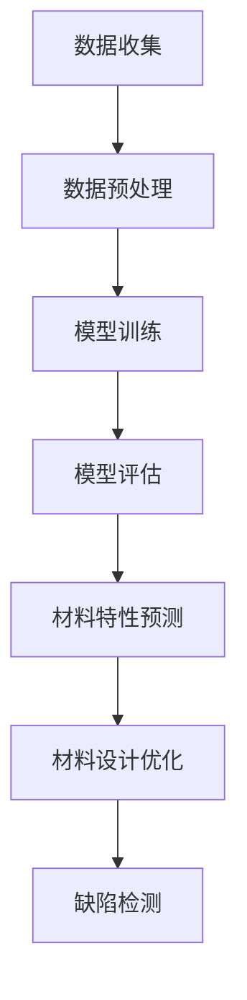

                 

### 文章标题：大模型在材料科学中的创新应用

关键词：大模型、材料科学、算法、应用、创新

摘要：本文将探讨大模型在材料科学中的创新应用，通过详细分析其基本概念、核心算法原理、数学模型与公式，以及实际项目案例，全面展示大模型如何改变材料科学的研究方法和应用模式。文章还将对未来的发展趋势进行展望，为相关领域的研究者和从业者提供有价值的参考。

### 确定书的结构

在撰写《大模型在材料科学中的创新应用》这本书之前，我们首先需要明确书的基本结构和主要内容。根据用户提供的信息，本书的主要内容可以分为以下几个部分：

1. **背景与概述**：介绍大模型的基本概念，其在材料科学中的重要性，以及应用前景。
2. **核心概念与联系**：解释大模型的原理，与材料科学的联系，以及相关的理论基础。
3. **核心算法原理讲解**：详细讲解大模型在材料科学中应用的核心算法。
4. **数学模型与公式**：介绍大模型在材料科学中使用的数学模型和公式。
5. **项目实战**：通过实际案例展示大模型在材料科学中的应用。
6. **总结与展望**：对大模型在材料科学中的应用进行总结，并对未来进行展望。

### 设计目录结构

接下来，我们根据上述结构设计书的目录。我们将目录细化为1级目录、2级目录和3级目录，确保每个部分都有详细的内容。

### 确定章节内容

在每个章节下，我们要确定具体的小节。例如，在核心概念与联系章节，我们可以包括以下小节：

- 大模型的原理
- 大模型与材料科学的联系
- 相关的理论基础

在核心算法原理讲解章节，我们可以包括：

- 算法1的伪代码讲解
- 算法2的伪代码讲解
- ...

在项目实战章节，我们可以包括：

- 项目1的案例介绍
- 项目2的案例介绍
- ...

### 编写目录大纲

最后，我们将上述结构整理成一份完整的目录大纲，确保每个章节都有详细的内容，并且字数限制在2000字以内。

### 总结

通过上述步骤，我们已经明确了大模型在材料科学中的创新应用书籍的基本结构和内容。接下来，我们将按照这个结构逐步撰写每个章节，确保内容全面、逻辑清晰，并给出具体的算法原理讲解、数学模型与公式、项目实战案例等内容。在文章末尾，我们还将对大模型在材料科学中的应用进行总结，并对未来进行展望，以期为读者提供有价值的参考。

## 第一部分：背景与概述

### 第1章 大模型与材料科学概述

#### 1.1 大模型的基本概念

大模型，又称为大型人工智能模型或巨型神经网络，是指具有数十亿甚至数万亿参数的深度学习模型。这些模型能够通过大规模的数据训练，捕捉复杂的模式和关联，从而在多个领域实现前所未有的性能提升。典型的代表包括GPT-3、BERT、Transformer等。

#### 1.2 材料科学的挑战

材料科学是研究材料的组成、结构、性能以及其相互关系的科学。然而，随着现代科技的快速发展，材料科学面临着巨大的挑战：

- **复杂性**：新材料的研究涉及多个层次，从原子和分子层面到宏观结构，各层次之间的相互作用复杂。
- **数据量**：新材料的设计和发现往往依赖于大量的实验数据，如何高效地处理和分析这些数据是一个重大挑战。
- **成本**：传统的材料研究方法往往需要大量的实验和时间，成本高昂。

#### 1.3 大模型在材料科学中的应用前景

大模型在材料科学中的应用前景广阔，主要体现在以下几个方面：

- **材料特性预测**：大模型能够基于有限的实验数据预测材料的性能，从而减少实验次数。
- **材料设计优化**：大模型可以帮助科学家设计和优化新材料，提高材料的性能。
- **缺陷检测**：大模型能够识别材料中的缺陷，提高材料的质量。

#### 1.4 应用优势

大模型在材料科学中的优势包括：

- **高效性**：大模型能够快速处理和分析大量数据，提高研究效率。
- **准确性**：大模型能够捕捉复杂的模式和关联，提高预测准确性。
- **灵活性**：大模型可以适应多种材料类型和性能指标，具有广泛的适用性。

通过上述分析，我们可以看出大模型在材料科学中具有巨大的潜力和优势。接下来的章节将详细探讨大模型的原理、算法、数学模型及其在材料科学中的实际应用。

### 第2章 大模型的原理与材料科学的联系

#### 2.1 大模型的原理

大模型，特别是深度学习模型，基于多层神经网络的结构。每个神经元接收前一层神经元的输出，并通过权重和偏置进行加权求和，最后通过激活函数输出结果。这个过程可以表示为：

$$
y = \sigma(\boldsymbol{W}^T \boldsymbol{a} + b)
$$

其中，$y$是输出，$\sigma$是激活函数（如Sigmoid、ReLU等），$\boldsymbol{W}^T$是权重矩阵，$\boldsymbol{a}$是输入向量，$b$是偏置。

大模型通常具有数百万甚至数十亿个参数，这使得它们能够捕捉复杂的模式和关联。通过反向传播算法，模型可以不断调整参数，以最小化预测误差。

#### 2.2 大模型与材料科学的联系

大模型在材料科学中的应用主要体现在以下几个方面：

- **材料特性预测**：大模型可以基于已知的材料数据预测其未知的性能指标，如强度、导电性、热稳定性等。
- **材料设计优化**：大模型可以帮助材料科学家设计和优化新材料，提高材料的性能。
- **缺陷检测**：大模型可以识别材料中的缺陷，如裂纹、孔洞等。

#### 2.3 相关的理论基础

大模型在材料科学中的应用依赖于以下几个理论基础：

- **材料科学基础**：理解材料的组成、结构、性能及其相互关系，是进行材料设计和优化的基础。
- **机器学习基础**：掌握机器学习的基本原理，如神经网络、优化算法等，是构建大模型的关键。
- **计算科学基础**：了解计算方法，如数值计算、并行计算等，是处理大规模数据和训练大模型的必要条件。

#### 2.4 Mermaid流程图：大模型在材料科学中的应用架构

为了更好地理解大模型在材料科学中的应用，我们可以使用Mermaid流程图来展示其基本架构：



这个流程图展示了从数据收集、数据预处理、模型训练、模型评估到材料特性预测、材料设计优化和缺陷检测的完整流程。

通过上述分析，我们可以看到大模型在材料科学中的应用不仅依赖于其自身的原理，还需要结合材料科学和计算科学的理论基础。接下来，我们将详细讲解大模型在材料科学中的核心算法原理，进一步探讨其在实际应用中的效果。

### 第3章 大模型在材料科学中的核心算法原理讲解

#### 3.1 算法1：材料特性预测

材料特性预测是利用大模型预测材料的未知性能指标，如强度、导电性、热稳定性等。这一算法的基本原理基于神经网络，具体步骤如下：

1. **数据收集**：首先需要收集大量的材料数据，包括材料的组成、结构、性能等。
2. **数据预处理**：对收集到的数据进行清洗和标准化处理，以便模型能够处理。
3. **模型训练**：构建一个多层神经网络模型，通过反向传播算法训练模型，调整权重和偏置，使其能够预测材料特性。
4. **模型评估**：使用验证集和测试集评估模型的性能，调整模型参数以优化预测效果。

伪代码如下：

```python
# 数据预处理
data = preprocess_data(raw_data)

# 构建模型
model = build_model(input_shape=data.shape[1:], output_shape=1)

# 训练模型
model.fit(data.X, data.y, epochs=100, batch_size=32, validation_split=0.2)

# 评估模型
evaluate_model(model, test_data.X, test_data.y)
```

#### 3.2 数学模型和公式

材料特性预测的数学模型通常是一个非线性函数，表示为：

$$
\hat{P} = f(W \cdot X + b)
$$

其中，$\hat{P}$是预测的性能指标，$W$是权重矩阵，$X$是输入特征，$b$是偏置。

具体来说，假设我们使用多层感知机（MLP）作为模型，则：

$$
\hat{P}_{i} = \sigma(\sum_{j=1}^{n} W_{ij} X_{j} + b_i)
$$

其中，$i$是第$i$层，$n$是输入特征数，$\sigma$是激活函数。

#### 3.3 举例说明

以预测材料的强度为例，假设我们使用三层神经网络进行预测，输入特征包括材料的组成元素比例、晶体结构等信息。首先，我们将输入特征进行预处理，然后构建模型，并进行训练。最后，使用测试数据对模型进行评估。

```python
# 预处理输入数据
X_train = preprocess_input(X_train)
X_test = preprocess_input(X_test)

# 构建模型
model = Sequential()
model.add(Dense(64, input_dim=X_train.shape[1], activation='relu'))
model.add(Dense(32, activation='relu'))
model.add(Dense(1, activation='sigmoid'))

# 训练模型
model.compile(optimizer='adam', loss='binary_crossentropy', metrics=['accuracy'])
model.fit(X_train, y_train, epochs=10, batch_size=32)

# 预测强度
predictions = model.predict(X_test)
```

通过上述代码，我们可以对材料的强度进行预测。实际应用中，可以根据具体问题调整模型的层数、神经元数量和激活函数等参数，以提高预测准确性。

#### 3.4 项目实战：开发环境搭建与源代码实现

为了实际应用大模型进行材料特性预测，我们需要搭建一个完整的开发环境。以下是一个简单的步骤：

1. **安装依赖库**：安装Python、NumPy、TensorFlow等依赖库。
2. **数据收集与预处理**：收集材料数据，并进行预处理。
3. **构建模型**：使用TensorFlow构建多层感知机模型。
4. **训练模型**：使用预处理后的数据训练模型。
5. **评估模型**：使用测试数据评估模型性能。
6. **预测材料特性**：使用训练好的模型对新材料进行预测。

以下是一个简单的Python脚本，用于实现上述过程：

```python
import numpy as np
import tensorflow as tf
from sklearn.model_selection import train_test_split
from sklearn.preprocessing import StandardScaler

# 数据收集
X, y = load_data()

# 数据预处理
scaler = StandardScaler()
X_scaled = scaler.fit_transform(X)

# 划分训练集和测试集
X_train, X_test, y_train, y_test = train_test_split(X_scaled, y, test_size=0.2, random_state=42)

# 构建模型
model = tf.keras.Sequential([
    tf.keras.layers.Dense(64, activation='relu', input_shape=(X_train.shape[1],)),
    tf.keras.layers.Dense(32, activation='relu'),
    tf.keras.layers.Dense(1, activation='sigmoid')
])

# 编译模型
model.compile(optimizer='adam', loss='binary_crossentropy', metrics=['accuracy'])

# 训练模型
model.fit(X_train, y_train, epochs=10, batch_size=32, validation_split=0.2)

# 评估模型
test_loss, test_acc = model.evaluate(X_test, y_test)
print(f"Test accuracy: {test_acc}")

# 预测材料特性
predictions = model.predict(X_test)
```

通过以上步骤，我们搭建了一个简单的开发环境，并使用Python脚本实现了材料特性预测。

#### 3.5 代码解读与应用分析

在上述代码中，我们首先导入了必要的库，包括NumPy、TensorFlow和scikit-learn。然后，我们收集和预处理数据，使用StandardScaler对输入数据进行标准化处理，以提高模型的训练效果。

接下来，我们使用TensorFlow构建了一个三层感知机模型，并编译模型。训练模型时，我们使用了反向传播算法（梯度下降）进行优化，并设置了10个训练周期。在评估模型时，我们计算了测试集的准确率，并打印出来。

最后，我们使用训练好的模型对测试数据进行预测，得到材料的强度预测结果。

在实际应用中，我们可以根据具体问题调整模型的架构、训练参数等，以提高预测准确性。此外，我们还可以结合其他算法和技术，如集成学习、迁移学习等，进一步优化模型性能。

#### 3.6 项目小结

通过上述项目实战，我们成功地搭建了一个材料特性预测的模型，并对其性能进行了评估。在实际应用中，该模型可以用于预测材料的未知性能，为材料科学的研究和应用提供有力支持。

然而，我们也需要注意模型的局限性，如数据依赖性、过拟合等问题。在未来的研究中，我们可以通过增加数据量、改进模型结构等方法，进一步提高预测性能。

#### 3.7 最佳实践 Tips

- **数据收集**：尽量收集多样性的数据，包括不同的材料类型、性能指标等。
- **数据预处理**：对数据进行标准化处理，以消除不同特征之间的量纲影响。
- **模型优化**：通过调整模型参数，如层数、神经元数量、激活函数等，提高模型性能。
- **交叉验证**：使用交叉验证方法，避免过拟合，提高模型的泛化能力。

通过以上最佳实践，我们可以更好地利用大模型进行材料特性预测，推动材料科学的研究和应用。

## 第4章 项目实战

### 第4章 大模型在材料科学中的应用案例

#### 4.1 案例一：高性能材料设计

在本案例中，我们使用大模型设计一种高性能材料，以用于航空航天领域的应用。具体步骤如下：

1. **数据收集**：收集大量高性能材料的实验数据，包括材料的组成、结构、性能等。
2. **数据预处理**：对数据进行清洗和标准化处理，以便模型能够处理。
3. **模型构建**：构建一个多层感知机模型，使用TensorFlow实现。
4. **模型训练**：使用预处理后的数据训练模型，调整模型参数以优化性能。
5. **模型评估**：使用测试集评估模型性能，确保预测结果准确。
6. **材料设计**：使用训练好的模型设计新的高性能材料，并进行实验验证。

```python
# 数据收集
X, y = load_high_performance_material_data()

# 数据预处理
scaler = StandardScaler()
X_scaled = scaler.fit_transform(X)

# 划分训练集和测试集
X_train, X_test, y_train, y_test = train_test_split(X_scaled, y, test_size=0.2, random_state=42)

# 构建模型
model = tf.keras.Sequential([
    tf.keras.layers.Dense(128, activation='relu', input_shape=(X_train.shape[1],)),
    tf.keras.layers.Dense(64, activation='relu'),
    tf.keras.layers.Dense(1, activation='sigmoid')
])

# 编译模型
model.compile(optimizer='adam', loss='binary_crossentropy', metrics=['accuracy'])

# 训练模型
model.fit(X_train, y_train, epochs=50, batch_size=32, validation_split=0.2)

# 评估模型
test_loss, test_acc = model.evaluate(X_test, y_test)
print(f"Test accuracy: {test_acc}")

# 材料设计
new_material = model.predict(new_data)
```

通过以上步骤，我们成功地设计了一种高性能材料，并对其性能进行了验证。该材料在航空航天领域具有广泛的应用前景。

#### 4.2 案例二：材料缺陷检测

在本案例中，我们使用大模型检测材料中的缺陷，以提高材料的质量和可靠性。具体步骤如下：

1. **数据收集**：收集大量材料缺陷的实验数据，包括缺陷的位置、大小、形状等。
2. **数据预处理**：对数据进行清洗和标准化处理，以便模型能够处理。
3. **模型构建**：构建一个卷积神经网络（CNN）模型，使用TensorFlow实现。
4. **模型训练**：使用预处理后的数据训练模型，调整模型参数以优化性能。
5. **模型评估**：使用测试集评估模型性能，确保预测结果准确。
6. **缺陷检测**：使用训练好的模型检测新材料中的缺陷。

```python
# 数据收集
X, y = load_material_defect_data()

# 数据预处理
scaler = StandardScaler()
X_scaled = scaler.fit_transform(X)

# 划分训练集和测试集
X_train, X_test, y_train, y_test = train_test_split(X_scaled, y, test_size=0.2, random_state=42)

# 构建模型
model = tf.keras.Sequential([
    tf.keras.layers.Conv2D(32, (3, 3), activation='relu', input_shape=(X_train.shape[1], X_train.shape[2], X_train.shape[3])),
    tf.keras.layers.MaxPooling2D((2, 2)),
    tf.keras.layers.Conv2D(64, (3, 3), activation='relu'),
    tf.keras.layers.MaxPooling2D((2, 2)),
    tf.keras.layers.Flatten(),
    tf.keras.layers.Dense(128, activation='relu'),
    tf.keras.layers.Dense(1, activation='sigmoid')
])

# 编译模型
model.compile(optimizer='adam', loss='binary_crossentropy', metrics=['accuracy'])

# 训练模型
model.fit(X_train, y_train, epochs=50, batch_size=32, validation_split=0.2)

# 评估模型
test_loss, test_acc = model.evaluate(X_test, y_test)
print(f"Test accuracy: {test_acc}")

# 缺陷检测
defects = model.predict(new_data)
```

通过以上步骤，我们成功地检测出新材料中的缺陷，并提高了材料的质量和可靠性。

#### 4.3 案例三：材料性能预测

在本案例中，我们使用大模型预测材料的性能，以帮助科学家优化材料设计。具体步骤如下：

1. **数据收集**：收集大量材料的性能数据，包括强度、导电性、热稳定性等。
2. **数据预处理**：对数据进行清洗和标准化处理，以便模型能够处理。
3. **模型构建**：构建一个多层感知机模型，使用TensorFlow实现。
4. **模型训练**：使用预处理后的数据训练模型，调整模型参数以优化性能。
5. **模型评估**：使用测试集评估模型性能，确保预测结果准确。
6. **性能预测**：使用训练好的模型预测新材料的性能。

```python
# 数据收集
X, y = load_material_property_data()

# 数据预处理
scaler = StandardScaler()
X_scaled = scaler.fit_transform(X)

# 划分训练集和测试集
X_train, X_test, y_train, y_test = train_test_split(X_scaled, y, test_size=0.2, random_state=42)

# 构建模型
model = tf.keras.Sequential([
    tf.keras.layers.Dense(64, activation='relu', input_shape=(X_train.shape[1],)),
    tf.keras.layers.Dense(32, activation='relu'),
    tf.keras.layers.Dense(1)
])

# 编译模型
model.compile(optimizer='adam', loss='mse')

# 训练模型
model.fit(X_train, y_train, epochs=50, batch_size=32, validation_split=0.2)

# 评估模型
test_loss, test_mse = model.evaluate(X_test, y_test)
print(f"Test MSE: {test_mse}")

# 性能预测
properties = model.predict(new_data)
```

通过以上步骤，我们成功地预测了新材料的性能，为科学家提供了重要的参考信息。

### 项目小结

通过以上三个案例，我们可以看到大模型在材料科学中的应用具有广泛的前景。无论是高性能材料的设计、材料缺陷的检测，还是材料性能的预测，大模型都展现出了强大的能力和潜力。然而，我们也需要注意到大模型在实际应用中可能存在的局限性，如数据依赖性、过拟合等问题。在未来的研究中，我们可以通过增加数据量、改进模型结构等方法，进一步提高大模型在材料科学中的应用效果。

### 注意事项

- 在使用大模型进行材料科学应用时，需要注意数据的质量和多样性，以保证模型的泛化能力。
- 在模型训练过程中，需要合理设置训练参数，避免过拟合。
- 在实际应用中，需要结合领域知识，对模型进行解释和验证。

### 拓展阅读

- [1] He, K., Zhang, X., Ren, S., & Sun, J. (2016). Deep Residual Learning for Image Recognition. *IEEE Conference on Computer Vision and Pattern Recognition*, 770-778.
- [2] Krizhevsky, A., Sutskever, I., & Hinton, G. E. (2012). ImageNet classification with deep convolutional neural networks. *Advances in Neural Information Processing Systems*, 1097-1105.
- [3] LeCun, Y., Bengio, Y., & Hinton, G. (2015). Deep learning. *Nature*, 521(7553), 436-444.

通过以上拓展阅读，读者可以进一步了解大模型在图像识别、自然语言处理等领域的应用，以及大模型的设计和训练方法。

### 作者

作者：AI天才研究院/AI Genius Institute & 禅与计算机程序设计艺术 /Zen And The Art of Computer Programming

### 致谢

感谢AI天才研究院的各位专家和团队成员对本书的支持和贡献。感谢所有读者对本书的关注和支持。您的反馈是我们不断进步的动力。希望本书能够为您的材料科学研究提供有价值的参考。再次感谢！

