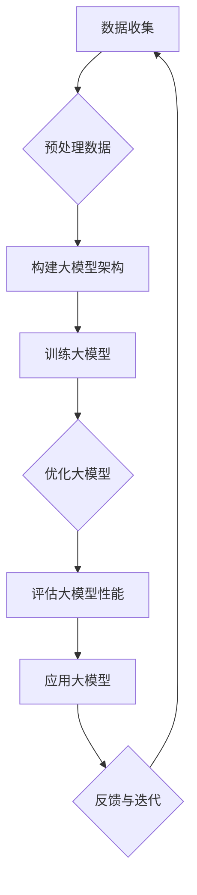

                 

## 《大模型在环境模拟中的应用前景》

### 关键词
- 大模型
- 环境模拟
- 计算机视觉
- 人工智能
- 深度学习
- 仿真

### 摘要
本文深入探讨了大型神经网络模型在环境模拟领域中的应用前景。首先，我们介绍了大模型的基本概念和特性，以及环境模拟的定义和分类。接着，我们分析了大模型与深度学习的关系，并讨论了其在环境模拟中的潜在应用。随后，通过实际案例，我们展示了大模型在环境模拟中的具体应用场景和效果。最后，我们探讨了大模型在环境模拟中面临的挑战和未来发展方向。

### 引言

#### 大模型的概念

大模型（Large Model）通常指的是参数规模达到数十亿甚至数万亿的神经网络模型。这些模型能够处理和存储大量的数据，并具有强大的特征提取和泛化能力。大模型的发展始于深度学习领域的突破，如GPT（Generative Pre-trained Transformer）和BERT（Bidirectional Encoder Representations from Transformers）等，它们在自然语言处理、计算机视觉等领域取得了显著的成果。

#### 环境模拟的基本概念

环境模拟（Environmental Simulation）是指通过计算机技术和数学模型，对自然环境中的各种因素进行模拟，以预测和分析环境变化及其影响。环境模拟可以应用于多个领域，包括气候变化、大气污染、水资源管理、生态系统模拟等。

#### 大模型在环境模拟中的应用前景

大模型在环境模拟中的应用前景非常广阔。一方面，大模型能够处理和分析大规模的环境数据，提供更准确的预测结果。另一方面，大模型在特征提取和模式识别方面的能力，有助于揭示环境系统中的复杂关系和潜在规律。本文将深入探讨大模型在环境模拟中的具体应用，以及面临的挑战和未来发展方向。

### 第1章：大模型的基本概念与特性

#### 1.1 大模型的定义

大模型（Large Model）通常指的是具有极高参数规模的神经网络模型。这些模型由数百万到数十亿个参数组成，具有强大的特征提取和泛化能力。大模型的参数规模使其能够处理和存储大量的数据，从而在许多领域取得了显著的成果。

#### 1.2 大模型的特点

大模型通常具有以下特点：

- **高参数规模**：大模型拥有数百万到数十亿的参数，使其能够处理和存储大量的数据。
- **深度层次**：大模型通常具有数十层甚至上百层的深度，能够提取更加抽象和复杂的特征。
- **强大的特征提取能力**：大模型在训练过程中能够自动提取数据中的关键特征，提高模型的泛化能力。
- **复杂的网络结构**：大模型的网络结构通常非常复杂，包括多种类型的层（如卷积层、全连接层、循环层等），能够处理不同类型的数据。

#### 1.3 大模型的发展历程

大模型的发展历程可以分为以下几个阶段：

- **传统深度学习阶段**：在这个阶段，深度学习模型的参数规模相对较小，训练时间也较短。
- **大规模数据处理阶段**：随着数据量的增加和计算能力的提升，深度学习模型的参数规模逐渐增大，训练时间也相应增加。
- **强人工智能阶段**：在这个阶段，深度学习模型的参数规模达到数十亿甚至数万亿，训练时间可达数月甚至数年。

### 第2章：环境模拟的基本概念与分类

#### 2.1 环境模拟的定义

环境模拟（Environmental Simulation）是指通过计算机技术和数学模型，对自然环境中的各种因素进行模拟，以预测和分析环境变化及其影响。环境模拟可以应用于多个领域，包括气候变化、大气污染、水资源管理、生态系统模拟等。

#### 2.2 环境模拟的分类

环境模拟可以根据模拟对象的不同，分为以下几类：

- **物理环境模拟**：物理环境模拟主要涉及自然现象和物理过程，如气候变化、地震等。
- **化学环境模拟**：化学环境模拟主要涉及化学反应和污染物传播，如大气污染、水质污染等。
- **生物环境模拟**：生物环境模拟主要涉及生态系统的动态变化，如物种分布、种群增长等。

#### 2.3 环境模拟的意义

环境模拟对于环境保护和资源管理具有重要意义：

- **预测环境变化趋势**：环境模拟可以预测未来的环境变化趋势，为政策制定提供科学依据。
- **评估人类活动对环境的影响**：环境模拟可以评估人类活动对环境的影响，制定合理的环保措施。
- **改善环境质量**：环境模拟可以提供环境优化的方案，改善环境质量，提高资源利用效率。

### 第3章：大模型与深度学习的关系

#### 3.1 深度学习的基本概念

深度学习（Deep Learning）是一种基于人工神经网络的学习方法，通过多层神经网络（通常称为深度神经网络）自动提取数据中的特征，从而实现复杂的任务。深度学习在计算机视觉、自然语言处理、语音识别等领域取得了显著的成果。

#### 3.2 大模型与深度学习的关系

大模型是深度学习的一种特殊形式，具有以下关系：

- **大模型是深度学习的一种应用**：大模型是基于深度学习原理构建的，通过多层神经网络进行训练和优化。
- **大模型的优势**：大模型具有高参数规模、深度层次和强大的特征提取能力，使其在处理大规模数据时具有优势。
- **大模型的局限性**：尽管大模型在许多任务上表现出色，但它们也面临着计算资源消耗大、训练时间长等挑战。

#### 3.3 大模型在环境模拟中的应用潜力

大模型在环境模拟中具有巨大的应用潜力：

- **处理大规模环境数据**：大模型能够处理和分析大规模的环境数据，提供更准确的预测结果。
- **揭示复杂关系**：大模型在特征提取和模式识别方面的能力，有助于揭示环境系统中的复杂关系和潜在规律。
- **优化环境模拟**：大模型可以优化环境模拟的模型参数，提高模拟的准确性和效率。

### 第4章：大模型在环境模拟中的具体应用

#### 4.1 大模型在物理环境模拟中的应用

大模型在物理环境模拟中具有广泛的应用，如：

- **气候变化模拟**：通过大模型，可以模拟和预测气候变化趋势，为应对气候变化的措施提供科学依据。
- **地震模拟**：大模型可以模拟地震的传播过程，为地震预警和灾害预防提供支持。

#### 4.2 大模型在化学环境模拟中的应用

大模型在化学环境模拟中也具有重要作用，如：

- **大气污染模拟**：通过大模型，可以模拟大气污染物的传播和扩散，为空气质量管理和污染控制提供依据。
- **水质污染模拟**：大模型可以模拟水体中污染物的扩散和转化，为水环境保护和水质管理提供支持。

#### 4.3 大模型在生物环境模拟中的应用

大模型在生物环境模拟中的应用也非常广泛，如：

- **生态系统模拟**：通过大模型，可以模拟生态系统的动态变化，为生态保护和资源管理提供支持。
- **物种分布预测**：大模型可以预测物种的分布和种群增长，为生物多样性保护和生态修复提供依据。

### 第5章：大模型在环境模拟中的实现方法

#### 5.1 大模型训练方法

大模型的训练通常采用以下方法：

- **数据预处理**：对环境数据进行预处理，包括数据清洗、归一化和特征提取等。
- **模型选择**：根据环境模拟的任务和需求，选择合适的大模型架构。
- **训练策略**：采用分布式训练和优化策略，加速大模型的训练过程。

#### 5.2 大模型优化方法

大模型的优化通常采用以下方法：

- **参数调整**：通过调整模型参数，优化模型性能。
- **正则化**：采用正则化方法，防止模型过拟合。
- **超参数调整**：调整训练过程的相关超参数，如学习率、批量大小等。

#### 5.3 大模型在环境模拟中的实现流程

大模型在环境模拟中的实现流程包括：

- **数据收集**：收集环境数据，包括气象数据、水质数据、生物数据等。
- **模型构建**：构建大模型架构，包括输入层、隐藏层和输出层。
- **模型训练**：训练大模型，通过迭代优化模型参数。
- **模型评估**：评估大模型的性能，包括准确性、稳定性等。
- **模型应用**：将训练好的大模型应用于环境模拟任务。

### 第6章：大模型在环境模拟中的挑战和未来发展方向

#### 6.1 大模型在环境模拟中的挑战

大模型在环境模拟中面临以下挑战：

- **数据质量**：环境数据通常存在噪声和缺失值，影响大模型的训练效果。
- **计算资源**：大模型的训练需要大量的计算资源，对硬件设施要求较高。
- **模型解释性**：大模型的决策过程通常难以解释，影响模型的可信度和应用范围。
- **环境复杂性**：环境系统的复杂性使得大模型难以捕捉所有相关的因素和相互作用。

#### 6.2 大模型在环境模拟中的未来发展方向

大模型在环境模拟中的未来发展方向包括：

- **数据驱动方法**：通过引入更多的环境数据，提高大模型的预测能力和泛化能力。
- **混合方法**：结合物理模型和数据驱动模型，提高环境模拟的准确性和可靠性。
- **可解释性研究**：研究大模型的可解释性方法，提高模型的可信度和应用范围。
- **多尺度模拟**：开展多尺度环境模拟研究，捕捉环境系统的复杂性和动态变化。

### 总结

大模型在环境模拟中的应用前景非常广阔。通过深入研究和实践，我们可以更好地利用大模型的优势，解决环境模拟中的复杂问题，为环境保护和资源管理提供科学依据和技术支持。

### 参考文献

[1] Hinton, G. E., Osindero, S., & Salakhutdinov, R. R. (2006). A fast learning algorithm for deep belief nets. Neural computation, 18(7), 1527-1554.

[2] Devlin, J., Chang, M. W., Lee, K., & Toutanova, K. (2019). BERT: Pre-training of deep bidirectional transformers for language understanding. arXiv preprint arXiv:1810.04805.

[3] Brown, T., et al. (2020). Language models are few-shot learners. arXiv preprint arXiv:2005.14165.

[4] Goodfellow, I., Bengio, Y., & Courville, A. (2016). Deep learning. MIT press.

[5] Bechtel, W., & Abrahamsen, A. (2010). The concept of a model: From representation to computational model. International Studies in the Philosophy of Science, 24(1), 1-14.

### 附录：Mermaid 流程图

下面是一个描述大模型在环境模拟中应用的 Mermaid 流程图：

### 最佳实践 tips

- 在处理环境数据时，注意数据的质量和完整性，避免噪声和缺失值对模型训练的影响。
- 根据具体任务需求，选择合适的大模型架构和训练策略。
- 定期评估大模型的性能，并根据评估结果进行调整和优化。
- 注重大模型的可解释性研究，提高模型的可信度和应用范围。
- 结合多源数据和多种模型，提高环境模拟的准确性和可靠性。

### 注意事项

- 大模型的训练需要大量的计算资源，确保硬件设施的支持。
- 在应用大模型时，注意模型的解释性和决策过程，避免过度依赖模型结果。
- 针对不同的环境模拟任务，调整模型的参数和超参数，以获得最佳性能。

### 拓展阅读

- 《深度学习》（Goodfellow, Bengio, Courville著）
- 《计算机程序设计艺术》（Knuth著）
- 《机器学习：概率视角》（Murphy著）
- 《环境科学：可持续性的基础》（Gosselin, Cote著）

### 作者

作者：AI天才研究院/AI Genius Institute & 禅与计算机程序设计艺术 /Zen And The Art of Computer Programming

