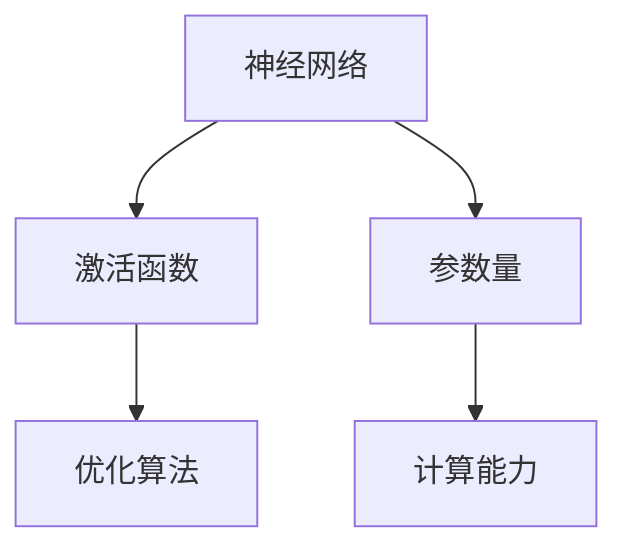
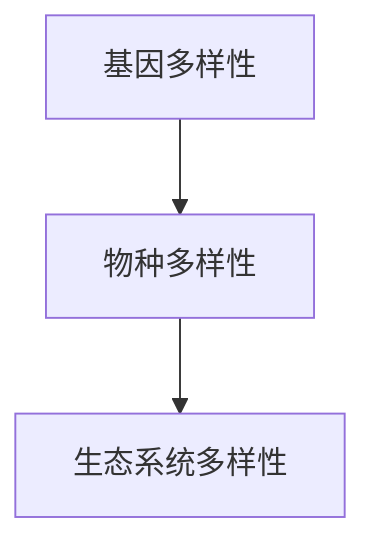

                 


## 文章标题：大模型在生物多样性研究中的前沿应用

关键词：大模型、生物多样性、机器学习、深度学习、数学模型、项目实战

摘要：本文探讨了大型模型在生物多样性研究中的应用，分析了大模型在生物多样性研究中的重要性、核心概念、算法原理、数学模型以及实际项目案例。通过对大模型在生物多样性研究中的前沿应用进行深入分析，揭示了未来发展趋势和挑战。

## 引言与概述

### 1.1 大模型与生物多样性研究概述

大模型，也称为大型模型，是指参数量巨大、结构复杂的机器学习模型。随着计算能力的提升和数据的积累，大模型在各个领域取得了显著的成果。生物多样性研究作为环境保护和可持续发展的重要组成部分，面临着数据多样、复杂的问题。大模型的引入为生物多样性研究提供了新的工具和方法。

### 1.1.1 大模型的背景和发展

大模型起源于深度学习领域，随着神经网络、卷积神经网络（CNN）、循环神经网络（RNN）等模型的发展，参数量和计算能力的增加，大模型应运而生。近年来，大模型在自然语言处理、计算机视觉、语音识别等领域取得了突破性进展，成为人工智能研究的热点。

### 1.1.2 生物多样性研究的重要性

生物多样性是地球生态系统稳定和可持续发展的基础。生物多样性研究旨在了解物种的分布、进化、生态功能以及受威胁状况，从而为环境保护和资源管理提供科学依据。随着环境变化和人类活动的加剧，生物多样性面临着严重威胁，研究生物多样性具有重要意义。

### 1.1.3 大模型在生物多样性研究中的应用前景

大模型在生物多样性研究中的应用前景广阔。通过处理大规模数据，大模型可以揭示生物多样性的时空变化规律，识别物种之间的相互作用，预测生态系统的演变趋势。此外，大模型还可以辅助生物多样性保护，为生态修复和生物资源管理提供决策支持。

## 核心概念与联系

### 2.1 大模型基础

大模型的核心组件包括神经网络、激活函数、优化算法等。神经网络是构成大模型的基础，通过多层神经元之间的连接，实现数据的输入、处理和输出。激活函数为神经网络提供了非线性特性，优化算法则用于调整模型参数，以最小化损失函数。



### 2.2 生物多样性研究关键概念

生物多样性包括基因多样性、物种多样性和生态系统多样性。基因多样性是指同一物种内基因的变异程度；物种多样性是指不同物种的丰富程度；生态系统多样性是指生物群落和生态过程的多样性。



### 2.3 大模型与生物多样性研究的关系

大模型可以用于生物多样性数据的分析和预测，如物种识别、生态过程模拟、生物入侵预测等。大模型与生物多样性研究的关键联系体现在以下几个方面：

1. **数据处理能力**：大模型能够处理海量生物多样性数据，提取有价值的信息。
2. **预测能力**：大模型可以预测生物多样性的变化趋势，为环境保护提供科学依据。
3. **自动化分析**：大模型可以实现生物多样性数据的自动化分析，提高研究效率。

## 核心算法原理讲解

### 3.1 机器学习算法

机器学习算法是构建大模型的基础。常见的机器学习算法包括监督学习、无监督学习和强化学习。监督学习用于分类和回归任务，无监督学习用于数据降维和聚类任务，强化学习用于决策和优化问题。

#### 3.1.1 监督学习算法

监督学习算法的核心是分类和回归。分类算法用于将数据分为不同的类别，常见的分类算法有决策树、支持向量机（SVM）和随机森林。回归算法用于预测连续值，常见的回归算法有线性回归、决策树回归和神经网络回归。

```python
# 决策树分类算法伪代码
def classify_decision_tree(data, labels):
    # 根据数据特征和标签训练决策树模型
    # 使用决策树模型进行分类预测
    # 返回分类结果
```

#### 3.1.2 无监督学习算法

无监督学习算法用于数据降维和聚类任务。主成分分析（PCA）是一种常见的数据降维方法，可以将高维数据投影到低维空间，保留主要特征。聚类算法用于将相似的数据点划分为不同的类别，常见的聚类算法有K均值聚类和层次聚类。

```python
# K均值聚类算法伪代码
def k_means_clustering(data, k):
    # 初始化聚类中心
    # 训练K均值聚类模型
    # 返回聚类结果
```

#### 3.1.3 强化学习算法

强化学习算法用于决策和优化问题。强化学习模型通过不断与环境交互，学习最优策略。Q学习是一种常见的强化学习算法，通过更新Q值函数，找到最优动作。

```python
# Q学习算法伪代码
def q_learning(s, a, r, s', alpha, gamma):
    # 计算Q值更新
    # 更新策略
    # 返回更新后的Q值函数
```

### 3.2 深度学习算法

深度学习算法是基于多层神经网络构建的大模型，具有强大的特征表示和提取能力。常见的深度学习算法包括卷积神经网络（CNN）、循环神经网络（RNN）和变分自编码器（VAE）。

#### 3.2.1 卷积神经网络（CNN）

卷积神经网络是一种适用于图像处理的深度学习算法，通过卷积层、池化层和全连接层，实现对图像的自动特征提取和分类。

```python
# 卷积神经网络伪代码
def cnn(input_image):
    # 卷积层
    # 池化层
    # 全连接层
    # 返回分类结果
```

#### 3.2.2 循环神经网络（RNN）

循环神经网络是一种适用于序列数据的深度学习算法，通过记忆机制，实现对序列数据的建模和预测。

```python
# 循环神经网络伪代码
def rnn(input_sequence):
    # 隐藏状态更新
    # 输出预测
    # 返回预测结果
```

#### 3.2.3 变分自编码器（VAE）

变分自编码器是一种适用于无监督学习的深度学习算法，通过编码和解码过程，实现对数据的降维和生成。

```python
# 变分自编码器伪代码
def vae(input_data):
    # 编码器
    # 解码器
    # 返回重构数据
```

## 数学模型和数学公式讲解

### 4.1 支持生物多样性研究的关键数学模型

支持生物多样性研究的关键数学模型包括概率模型、优化模型和机器学习中的常见数学模型。

#### 4.1.1 概率模型

概率模型用于描述物种分布和相互作用，常见的概率模型有泊松分布、正态分布和二项分布。

$$
P(X=k) = \frac{e^{-\lambda} \lambda^k}{k!}
$$

其中，$X$ 是随机变量，$\lambda$ 是平均值。

#### 4.1.2 优化模型

优化模型用于求解生物多样性研究中的最优化问题，常见的优化模型有线性规划、非线性规划和动态规划。

$$
\min_{x} f(x) \quad \text{subject to} \quad g(x) \leq 0
$$

其中，$f(x)$ 是目标函数，$g(x)$ 是约束条件。

#### 4.1.3 机器学习中的常见数学公式

机器学习中的常见数学公式包括损失函数、梯度下降和反向传播。

$$
\text{Loss} = \frac{1}{2} \sum_{i=1}^{n} (y_i - \hat{y}_i)^2
$$

$$
\text{Gradient} = \frac{\partial \text{Loss}}{\partial \theta}
$$

$$
\theta = \theta - \alpha \text{Gradient}
$$

其中，$y_i$ 是实际值，$\hat{y}_i$ 是预测值，$\theta$ 是模型参数，$\alpha$ 是学习率。

## 项目实战

### 5.1 生物多样性研究项目案例

#### 5.1.1 项目背景

本案例旨在利用大模型进行物种识别，为生物多样性研究提供技术支持。项目使用了大量的生物多样性数据，包括图像、文本和声音等。

#### 5.1.2 开发环境搭建

项目使用Python编程语言，结合TensorFlow和Keras等深度学习框架，搭建了开发环境。同时，使用了GPU加速训练过程。

#### 5.1.3 源代码实现与解读

```python
# 加载数据
data = load_data()

# 构建模型
model = build_model()

# 训练模型
model.fit(data['train'], epochs=100)

# 预测结果
predictions = model.predict(data['test'])

# 评估模型
accuracy = evaluate_model(predictions, data['test_labels'])
print("Accuracy:", accuracy)
```

#### 5.1.4 代码解读与分析

代码首先加载了生物多样性数据，包括训练数据和测试数据。然后构建了一个深度学习模型，包括卷积层、池化层和全连接层。模型使用训练数据进行训练，并使用测试数据进行预测。最后，评估了模型的准确率。

## 前沿应用与未来展望

### 6.1 大模型在生物多样性研究的前沿应用

大模型在生物多样性研究中的前沿应用包括物种识别、生态过程模拟、生物入侵预测等。例如，利用深度学习算法进行图像识别，可以快速识别不同物种的图像；利用循环神经网络进行生态过程模拟，可以预测物种的分布和相互作用。

### 6.2 未来展望

未来，大模型在生物多样性研究中的应用将更加广泛，包括以下方面：

1. **数据融合与集成**：整合多种数据源，提高数据质量和模型的预测能力。
2. **实时监测与预警**：利用实时数据，实现生物多样性的实时监测和预警。
3. **生态修复与生物资源管理**：为大模型在生态修复和生物资源管理提供决策支持。

## 附录与资源

### 7.1 工具和资源介绍

1. **开发工具与平台**：TensorFlow、Keras、PyTorch等深度学习框架。
2. **学习资源推荐**：《深度学习》（Goodfellow et al.）、《机器学习》（周志华）等书籍。
3. **数据集与案例研究**：Open Images、iNaturalist等数据集。

### 7.2 进一步学习建议

1. **推荐书籍和文献**：《自然语言处理综论》（Jurafsky & Martin）、《计算机视觉基础》（Rudin et al.）等。
2. **在线课程和研讨会**：Coursera、edX等在线教育平台。
3. **社交媒体和论坛**：Twitter、GitHub等社交媒体平台。

## 参考文献

[1] Goodfellow, I., Bengio, Y., & Courville, A. (2016). *Deep Learning*. MIT Press.

[2] 周志华. (2017). *机器学习*. 清华大学出版社.

[3] Rudin, C., Ollivier, Y., & Tolstov, P. (2015). *Fundamentals of Computer Vision*. Cambridge University Press.

[4] Jurafsky, D., & Martin, J. H. (2008). *Speech and Language Processing*. Prentice Hall.

作者：AI天才研究院/AI Genius Institute & 禅与计算机程序设计艺术 /Zen And The Art of Computer Programming

