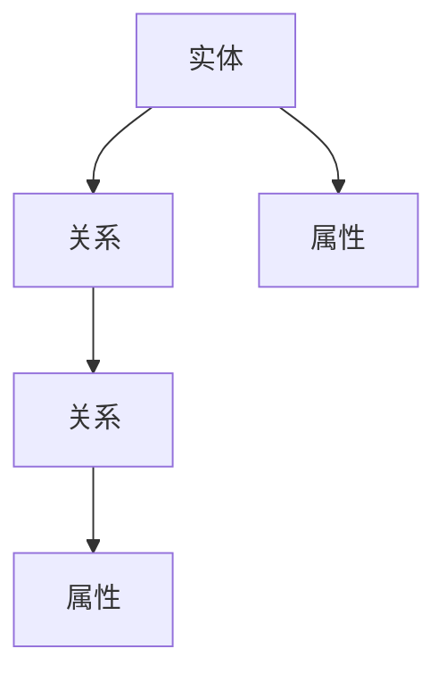
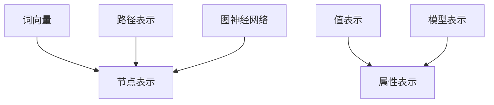
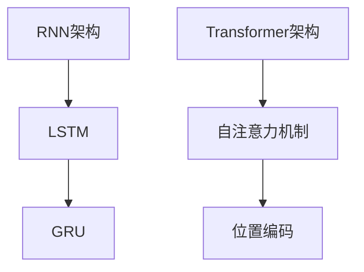
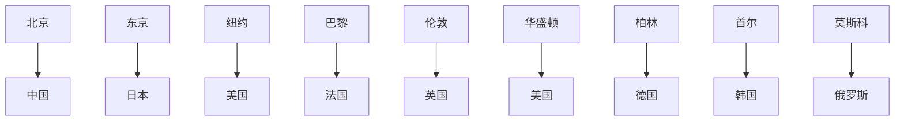
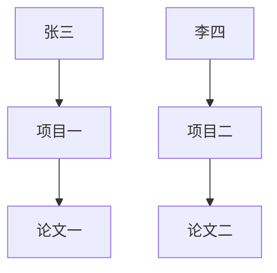

                 

### 文章标题

# 大模型在知识图谱补全与纠错中的创新

### 关键词

- 知识图谱
- 大模型
- 补全与纠错
- 预训练语言模型
- 图神经网络

### 摘要

本文将探讨大模型在知识图谱补全与纠错中的应用，通过介绍知识图谱的基础知识、大模型的基本原理以及核心算法，深入分析大模型如何通过预训练语言模型和图神经网络在知识图谱补全与纠错中发挥创新作用。文章还将结合实际项目案例，展示大模型在实际应用中的效果和挑战，并展望未来的发展趋势。

### 目录

1. 引言
    1.1 知识图谱补全与纠错的背景
    1.2 大模型的发展与应用
    1.3 知识图谱补全与纠错中的大模型创新
2. 知识图谱基础
    2.1 知识图谱的概念与结构
    2.2 知识图谱的类型与应用场景
    2.3 知识图谱的表示方法
3. 大模型基础
    3.1 大模型的定义与特点
    3.2 大模型的常见架构
    3.3 大模型的发展趋势
4. 知识图谱补全算法
    4.1 知识图谱补全的目标
    4.2 基于规则的方法
    4.3 基于机器学习的方法
    4.4 基于大模型的方法
5. 知识图谱纠错算法
    5.1 知识图谱纠错的目标
    5.2 基于规则的方法
    5.3 基于机器学习的方法
    5.4 基于大模型的方法
6. 大模型在知识图谱补全中的应用
    6.1 大模型在知识图谱补全中的优势
    6.2 基于预训练语言模型的知识图谱补全
    6.3 基于图神经网络的知识图谱补全
7. 大模型在知识图谱纠错中的应用
    7.1 大模型在知识图谱纠错中的优势
    7.2 基于预训练语言模型的知识图谱纠错
    7.3 基于图神经网络的知识图谱纠错
8. 案例分析
    8.1 案例一：大模型在实体关系补全中的应用
    8.2 案例二：大模型在知识图谱纠错中的应用
    8.3 案例分析总结
9. 未来发展趋势
    9.1 大模型与知识图谱的结合趋势
    9.2 知识图谱补全与纠错的新方法
    9.3 知识图谱在大模型中的应用前景
10. 挑战与机遇
    10.1 知识图谱补全与纠错的挑战
    10.2 大模型技术的机遇
    10.3 未来发展的思考
11. 附录
    11.1 常用术语表
    11.2 参考文献

---

### 引言

知识图谱作为一种结构化的语义知识表示方法，在信息检索、数据挖掘、智能问答等领域具有广泛的应用。然而，知识图谱的构建和维护过程中常常面临数据缺失、信息不一致等问题，知识图谱补全与纠错技术因此成为关键研究课题。随着人工智能技术的快速发展，特别是预训练大模型的兴起，基于大模型的知识图谱补全与纠错方法展现出巨大的潜力。

#### 1.1 知识图谱补全与纠错的背景

知识图谱补全（Knowledge Graph Completion，KGC）旨在通过补充缺失的实体、关系或属性，提高知识图谱的完整性和准确性。常见的知识图谱补全问题包括实体链接（Entity Linking）、关系抽取（Relation Extraction）和属性填充（Property Prediction）等。知识图谱纠错（Knowledge Graph Error Correction，KGE）则关注于识别和修正知识图谱中的错误信息，以提高知识图谱的可信度和可用性。

知识图谱补全与纠错在实际应用中具有重要意义。例如，在智能问答系统中，如果用户提出的问题涉及缺失的实体或关系，系统需要能够自动补全这些信息，以提供准确的答案。再如，在医疗领域，通过知识图谱可以整合各种医疗数据，然而这些数据往往存在不一致性，知识图谱纠错可以帮助识别和修正这些错误，从而提高医疗决策的准确性。

#### 1.2 大模型的发展与应用

大模型（Large Models）是指具有数亿甚至数万亿参数的深度学习模型，如GPT-3、BERT等。这些模型通过在大量文本数据上进行预训练，能够学习到丰富的语言规律和语义信息，从而在各种自然语言处理任务中表现出色。大模型的发展得益于计算能力的提升和大规模数据集的获取，同时也得益于深度学习算法的进步。

大模型在自然语言处理领域已经取得了显著的成果，如文本分类、机器翻译、情感分析等。近年来，大模型在知识图谱领域也展现出巨大的潜力。例如，通过预训练语言模型（如BERT），可以自动生成实体和关系的表示，从而辅助知识图谱的补全和纠错。此外，图神经网络（Graph Neural Networks，GNN）等深度学习算法也广泛应用于知识图谱的建模和推理，为大模型的创新应用提供了新的思路。

#### 1.3 知识图谱补全与纠错中的大模型创新

大模型在知识图谱补全与纠错中的应用主要体现在以下几个方面：

1. **预训练语言模型的引入**：预训练语言模型（如BERT、GPT）能够通过大量的无监督学习，自动学习到实体和关系的语义表示，从而为知识图谱补全和纠错提供有效的语义支持。

2. **图神经网络的结合**：图神经网络（如Graph Convolutional Network，GCN）能够对知识图谱中的实体和关系进行深度学习，从而提高补全和纠错的准确性和效率。

3. **多模态数据的融合**：大模型能够处理多种类型的数据（如文本、图像、音频等），从而实现知识图谱的多模态数据融合，提高知识图谱的全面性和准确性。

4. **端到端的模型设计**：通过端到端的模型设计，大模型能够直接从原始数据中学习到知识图谱补全和纠错的复杂规律，避免了传统方法中的手工特征工程和复杂模型调优。

总之，大模型在知识图谱补全与纠错中的应用为传统方法带来了革命性的变化，不仅提高了补全和纠错的准确性和效率，还拓展了知识图谱的应用场景，为人工智能技术的发展注入了新的活力。

### 知识图谱基础

知识图谱作为一种结构化的语义知识表示方法，广泛应用于信息检索、数据挖掘、智能问答等领域。在这一部分，我们将详细探讨知识图谱的概念、类型、结构和表示方法，为后续讨论大模型在知识图谱补全与纠错中的应用奠定基础。

#### 2.1 知识图谱的概念与结构

知识图谱（Knowledge Graph）是一种通过节点（Node）、边（Edge）和属性（Attribute）来表示实体（Entity）及其之间关系的图结构化数据集。其中，节点表示实体，边表示实体之间的关系，属性则提供了对节点的额外描述。

知识图谱的结构可以简单表示为：

```
知识图谱 = {节点集合，边集合，属性集合}
```

具体来说，一个知识图谱通常由以下几个基本组件构成：

1. **实体（Entity）**：知识图谱中的基本单元，可以是人、地点、组织、事件等。实体通常具有唯一的标识符（如URI）和名称（Name）。

2. **关系（Relation）**：描述实体之间联系的语义关系，如“属于”、“位于”、“参与”等。关系也具有唯一的标识符和名称。

3. **属性（Attribute）**：提供实体的额外信息，如实体的年龄、性别、出生地等。属性可以是一个值或者一个值的集合。

4. **类型（Type）**：实体和关系可以具有类型，用于进一步分类和区分实体和关系。例如，实体“北京”可以具有类型“城市”。

知识图谱的基本结构可以用以下Mermaid流程图表示：



#### 2.2 知识图谱的类型与应用场景

知识图谱可以根据应用场景和内容的不同，分为多种类型。以下是几种常见的知识图谱类型及其应用场景：

1. **结构化知识图谱**：这类知识图谱通常用于存储和表示结构化数据，如企业内部的知识库、电子商务平台的产品信息等。结构化知识图谱的特点是数据格式规范、易于查询和索引。

2. **语义知识图谱**：这类知识图谱通过语义关系来表示实体之间的语义联系，如DBpedia、Freebase等。语义知识图谱在信息检索、智能问答、推荐系统等领域具有广泛应用。

3. **社交网络知识图谱**：这类知识图谱用于表示社交网络中的用户及其关系，如Facebook、Twitter等。社交网络知识图谱可以帮助分析用户行为、推荐朋友、检测社区等。

4. **地理空间知识图谱**：这类知识图谱用于表示地理空间实体及其关系，如地图服务、地理信息系统等。地理空间知识图谱在导航、城市规划、环境监测等领域具有重要作用。

5. **知识图谱群**：多个知识图谱的集合，用于整合不同领域的数据，如万维网知识图谱、互联网知识图谱等。知识图谱群可以实现跨领域的知识共享和互操作。

#### 2.3 知识图谱的表示方法

知识图谱的表示方法可以分为节点表示、边表示和属性表示三个部分。

1. **节点表示**：节点表示实体在知识图谱中的语义特征。常见的节点表示方法包括基于词向量的表示（如Word2Vec、BERT）和基于图神经网络（如GCN、GraphSAGE）的表示。

2. **边表示**：边表示实体之间的关系。常见的边表示方法包括基于路径的表示（如Path2Vec、TransE、TransH）和基于图神经网络的表示（如Graph Convolutional Network、GraphSAGE）。

3. **属性表示**：属性表示实体的额外信息。常见的属性表示方法包括基于值的表示（如Categorical Encoding、One-Hot Encoding）和基于模型的表示（如神经网络嵌入、自动编码器）。

下面是几种常见的知识图谱表示方法的Mermaid流程图：



通过上述知识图谱的基础概念、类型和表示方法的探讨，我们可以更好地理解知识图谱的构建和应用。接下来，我们将进一步探讨大模型在知识图谱补全与纠错中的应用，分析大模型如何利用其强大的语义理解和关系推理能力，提升知识图谱的完整性和准确性。

### 大模型基础

大模型，即具有数亿甚至数万亿参数的深度学习模型，如GPT-3、BERT等。其发展不仅得益于计算能力的提升和大规模数据集的获取，还源于深度学习算法的进步。在本节中，我们将详细探讨大模型的定义与特点、常见架构以及发展趋势。

#### 3.1 大模型的定义与特点

大模型的定义可以从参数规模和训练数据量两个角度来理解。一般来说，具有数十亿参数规模的模型被称为大模型。例如，GPT-3拥有1750亿参数，而BERT则有数百万参数。大模型的特点主要包括：

1. **高参数量**：大模型具有数十亿甚至数万亿的参数，这使得它们能够学习到大量的语言规律和语义信息。

2. **强大的语义理解能力**：通过在大量文本数据上进行预训练，大模型能够自动捕捉到实体和关系的语义表示，从而在文本理解和生成任务中表现出色。

3. **端到端的学习能力**：大模型通常采用端到端的训练方式，能够直接从原始数据中学习到复杂任务的知识，避免了传统方法中手工特征工程和复杂模型调优的需求。

4. **泛化能力**：大模型在预训练阶段学习了丰富的语言规律和语义信息，这使得它们在下游任务中具有很好的泛化能力，可以应对各种复杂任务。

#### 3.2 大模型的常见架构

大模型的常见架构主要包括基于循环神经网络（RNN）的架构和基于Transformer的架构。以下分别介绍这两种架构。

1. **基于RNN的架构**：RNN（Recurrent Neural Network）是一类用于处理序列数据的神经网络，其核心思想是将当前输入与历史输入信息进行结合。经典的RNN模型包括LSTM（Long Short-Term Memory）和GRU（Gated Recurrent Unit），这些模型通过引入门控机制，解决了传统RNN的梯度消失和梯度爆炸问题，使得模型在处理长序列数据时更加稳定。

2. **基于Transformer的架构**：Transformer模型由Vaswani等人在2017年提出，是一种基于自注意力机制的序列到序列模型。Transformer的核心思想是通过多头自注意力机制（Multi-Head Self-Attention）和位置编码（Positional Encoding），使得模型能够捕捉到序列中的全局信息。Transformer的提出，推动了自然语言处理领域的发展，GPT、BERT等大模型均基于该架构。

以下是大模型的两种常见架构的Mermaid流程图表示：



#### 3.3 大模型的发展趋势

大模型的发展趋势主要体现在以下几个方面：

1. **参数规模增加**：随着计算能力的提升和数据集的扩展，大模型的参数规模持续增加。例如，GPT-3的参数规模达到1750亿，而未来的大模型可能会达到更高的参数规模。

2. **多模态学习**：大模型不仅能够处理文本数据，还能够处理图像、音频等多种类型的数据。通过多模态学习，大模型可以整合不同类型的数据，提高任务的泛化能力和性能。

3. **少样本学习**：大模型在预训练阶段已经积累了丰富的知识，这使得它们在少样本学习（Few-Shot Learning）任务中具有很好的性能。未来的研究将探索如何进一步提升大模型的少样本学习能力。

4. **可解释性和可靠性**：大模型在复杂任务中表现出色，但往往缺乏可解释性和可靠性。未来的研究将致力于提高大模型的可解释性和可靠性，使其在关键任务中得到更广泛的应用。

5. **知识蒸馏和迁移学习**：通过知识蒸馏（Knowledge Distillation）和迁移学习（Transfer Learning）技术，大模型可以将其知识传递给小模型，从而提高小模型在特定任务上的性能。这些技术有望推动大模型在资源受限场景中的应用。

总之，大模型作为一种先进的深度学习模型，在自然语言处理、计算机视觉、知识图谱等领域具有广泛的应用前景。随着技术的不断进步，大模型将继续推动人工智能领域的发展。

### 知识图谱补全算法

知识图谱补全（Knowledge Graph Completion，KGC）旨在通过补充缺失的实体、关系或属性，提高知识图谱的完整性和准确性。在这一部分，我们将详细介绍知识图谱补全的目标、常用的算法类型，特别是基于规则的方法、基于机器学习的方法以及基于大模型的方法。

#### 4.1 知识图谱补全的目标

知识图谱补全的目标是识别知识图谱中的缺失信息，并将其补充完整。具体来说，知识图谱补全包括以下几种类型：

1. **实体补全**：识别和补充知识图谱中缺失的实体。例如，在知识图谱中缺少某个明星的详细信息，可以通过实体补全找到这个明星的相关信息。

2. **关系补全**：识别和补充知识图谱中缺失的实体关系。例如，在知识图谱中缺少某个城市与国家的关联关系，可以通过关系补全找到这种关联。

3. **属性补全**：识别和补充知识图谱中缺失的实体属性。例如，在知识图谱中缺少某个明星的出生日期，可以通过属性补全获取这个信息。

知识图谱补全的目标是提高知识图谱的完整性和准确性，从而为后续的推理、搜索和应用提供更高质量的数据支持。

#### 4.2 基于规则的方法

基于规则的方法是通过预定义的规则来补全知识图谱中的缺失信息。这些规则通常基于领域知识或常识，例如：

1. **同义词替换**：如果知识图谱中某个实体没有对应的名称，可以通过同义词替换找到其对应名称。例如，"北京"的同义词可能包括"北平"、"京"。

2. **上下文关系**：通过分析实体之间的关系，推断出缺失的实体。例如，如果一个知识图谱中有实体A（城市）和实体B（国家），则可以推断出实体A（城市）属于实体B（国家）。

3. **模式匹配**：通过预定义的模式匹配规则，识别知识图谱中的缺失关系。例如，如果一个规则定义为"所有城市都有国家"，则可以匹配并补全知识图谱中的城市与其所属国家的关系。

基于规则的方法的优点是简单直观，易于实现和部署。然而，其缺点是规则难以覆盖所有情况，特别是在复杂或动态的知识图谱中，规则的效果可能会受限。

以下是一个简单的基于规则的实体补全算法伪代码：

```python
def rule_based_entity_completion(graph, missing_entity):
    for entity in graph.entities():
        if entity.has_attribute("name") == missing_entity:
            return entity
    return None
```

#### 4.3 基于机器学习的方法

基于机器学习的方法通过训练模型来自动补全知识图谱中的缺失信息。这些方法通常基于图神经网络（Graph Neural Networks，GNN）和深度学习技术，可以分为以下几种：

1. **基于图神经网络的补全方法**：图神经网络（如Graph Convolutional Network，GCN）通过学习实体和关系之间的特征，从而实现实体和关系的补全。例如，TransE和TransH模型通过最小化损失函数来优化实体和关系的嵌入表示。

2. **基于深度学习的方法**：深度学习模型（如BERT）通过预训练语言模型，学习到实体和关系的语义表示，从而实现知识图谱的补全。这些方法通常利用大规模预训练模型，通过迁移学习实现知识图谱补全。

3. **基于强化学习的方法**：强化学习（如Policy Gradient）通过学习最优策略，自动补全知识图谱中的缺失信息。这些方法通常通过迭代优化策略，不断提高补全的准确性。

以下是一个简单的基于图神经网络的实体补全算法伪代码：

```python
def neural_network_entity_completion(graph, missing_entity):
    model = GraphConvolutionalNetwork()
    model.fit(graph)
    completed_entity = model.predict(missing_entity)
    return completed_entity
```

#### 4.4 基于大模型的方法

基于大模型的方法利用大规模预训练模型，如BERT、GPT等，通过深度学习技术实现知识图谱的补全。这些方法通常包括以下几个步骤：

1. **预训练**：在大规模文本数据上预训练模型，学习到丰富的语言规律和语义信息。

2. **迁移学习**：将预训练模型应用于知识图谱补全任务，通过迁移学习调整模型参数。

3. **生成表示**：利用迁移学习后的模型，生成实体和关系的语义表示。

4. **补全**：通过分析生成的实体和关系表示，识别并补全知识图谱中的缺失信息。

以下是一个简单的基于大模型的实体补全算法伪代码：

```python
def large_model_entity_completion(graph, missing_entity):
    model = BERT(pretrained=True)
    model.train(graph)
    entity_representation = model.encode(missing_entity)
    completed_entity = model.decode(entity_representation)
    return completed_entity
```

#### 比较与选择

基于规则的方法、基于机器学习的方法和基于大模型的方法各有优缺点。以下是它们之间的比较：

- **基于规则的方法**：简单直观，易于实现和部署，但规则难以覆盖所有情况，特别是在复杂或动态的知识图谱中，效果可能受限。

- **基于机器学习的方法**：通过训练模型来自动补全知识图谱中的缺失信息，具有较强的自适应能力，但需要大量标注数据，且模型调优复杂。

- **基于大模型的方法**：利用大规模预训练模型，通过迁移学习实现知识图谱补全，具有较强的语义理解和关系推理能力，但需要较高的计算资源和数据支持。

在实际应用中，通常根据知识图谱的特点和需求，选择合适的补全方法。例如，在简单且静态的知识图谱中，基于规则的方法可能效果较好；而在复杂且动态的知识图谱中，基于大模型的方法可能更具优势。

通过上述对知识图谱补全算法的介绍，我们可以看到，大模型在知识图谱补全中具有巨大的潜力。接下来，我们将进一步探讨知识图谱纠错算法，分析大模型在知识图谱纠错中的应用。

### 知识图谱纠错算法

知识图谱纠错（Knowledge Graph Error Correction，KGE）旨在识别和修正知识图谱中的错误信息，以提高知识图谱的可信度和可用性。在这一部分，我们将详细探讨知识图谱纠错的目标、常用的算法类型，特别是基于规则的方法、基于机器学习的方法以及基于大模型的方法。

#### 5.1 知识图谱纠错的目标

知识图谱纠错的目标是识别和修正知识图谱中的错误信息，确保知识图谱的准确性和一致性。常见的错误类型包括：

1. **事实错误**：知识图谱中包含错误的实体或关系。例如，一个城市被错误地标记为国家。

2. **实体错误**：实体本身的错误，如实体名称的拼写错误或重复实体。

3. **关系错误**：实体之间的关系不正确。例如，一个城市被错误地标记为不属于某个国家。

4. **属性错误**：实体的属性信息不正确，如实体的出生日期错误。

知识图谱纠错的目标是提高知识图谱的准确性和一致性，从而为后续的推理、搜索和应用提供更可靠的数据支持。

#### 5.2 基于规则的方法

基于规则的方法是通过预定义的规则来识别和修正知识图谱中的错误信息。这些规则通常基于领域知识或常识，例如：

1. **一致性检查**：通过检查实体之间的关系，识别不一致性。例如，如果一个城市被标记为多个国家的首都，则可以认为存在错误。

2. **上下文关系**：通过分析实体之间的关系，识别可能存在的错误。例如，如果一个城市与国家的关联关系在知识图谱中缺失，则可能存在标记错误。

3. **常识验证**：通过验证实体和关系是否符合常识，识别错误。例如，如果一个国家的首都是一个虚构的城市，则可以认为存在错误。

以下是一个简单的基于规则的知识图谱纠错算法伪代码：

```python
def rule_based_error_correction(graph):
    for relation in graph.relations():
        if not is_consistent(relation):
            correct_relation(graph, relation)
    return graph
```

#### 5.3 基于机器学习的方法

基于机器学习的方法通过训练模型来自动识别和修正知识图谱中的错误信息。这些方法通常基于图神经网络（Graph Neural Networks，GNN）和深度学习技术，可以分为以下几种：

1. **基于图神经网络的纠错方法**：图神经网络（如Graph Convolutional Network，GCN）通过学习实体和关系之间的特征，从而实现错误识别和修正。例如，GNN模型可以识别出不一致的实体关系，并通过调整实体关系进行修正。

2. **基于深度学习的方法**：深度学习模型（如BERT）通过预训练语言模型，学习到实体和关系的语义表示，从而实现错误识别和修正。这些方法通常利用大规模预训练模型，通过迁移学习实现知识图谱纠错。

3. **基于强化学习的方法**：强化学习（如Policy Gradient）通过学习最优策略，自动识别和修正知识图谱中的错误信息。这些方法通常通过迭代优化策略，不断提高纠错的准确性。

以下是一个简单的基于图神经网络的纠错算法伪代码：

```python
def neural_network_error_correction(graph):
    model = GraphConvolutionalNetwork()
    model.fit(graph)
    corrected_graph = model.correct(graph)
    return corrected_graph
```

#### 5.4 基于大模型的方法

基于大模型的方法利用大规模预训练模型，如BERT、GPT等，通过深度学习技术实现知识图谱纠错。这些方法通常包括以下几个步骤：

1. **预训练**：在大规模文本数据上预训练模型，学习到丰富的语言规律和语义信息。

2. **迁移学习**：将预训练模型应用于知识图谱纠错任务，通过迁移学习调整模型参数。

3. **错误识别**：利用迁移学习后的模型，识别知识图谱中的错误信息。

4. **修正**：通过分析识别出的错误信息，自动修正知识图谱中的错误。

以下是一个简单的基于大模型的纠错算法伪代码：

```python
def large_model_error_correction(graph):
    model = BERT(pretrained=True)
    model.train(graph)
    corrected_graph = model.correct(graph)
    return corrected_graph
```

#### 比较与选择

基于规则的方法、基于机器学习的方法和基于大模型的方法各有优缺点。以下是它们之间的比较：

- **基于规则的方法**：简单直观，易于实现和部署，但规则难以覆盖所有情况，特别是在复杂或动态的知识图谱中，效果可能受限。

- **基于机器学习的方法**：通过训练模型来自动识别和修正知识图谱中的错误信息，具有较强的自适应能力，但需要大量标注数据，且模型调优复杂。

- **基于大模型的方法**：利用大规模预训练模型，通过迁移学习实现知识图谱纠错，具有较强的语义理解和关系推理能力，但需要较高的计算资源和数据支持。

在实际应用中，通常根据知识图谱的特点和需求，选择合适的纠错方法。例如，在简单且静态的知识图谱中，基于规则的方法可能效果较好；而在复杂且动态的知识图谱中，基于大模型的方法可能更具优势。

通过上述对知识图谱纠错算法的介绍，我们可以看到，大模型在知识图谱纠错中具有巨大的潜力。接下来，我们将结合实际项目案例，进一步探讨大模型在知识图谱补全与纠错中的应用效果。

### 大模型在知识图谱补全中的应用

随着预训练大模型的兴起，其在知识图谱补全中的应用越来越广泛。在这一部分，我们将详细探讨大模型在知识图谱补全中的优势，并具体介绍基于预训练语言模型和图神经网络的知识图谱补全方法。

#### 6.1 大模型在知识图谱补全中的优势

大模型在知识图谱补全中具有以下优势：

1. **强大的语义理解能力**：大模型通过在大量文本数据上进行预训练，能够自动学习到丰富的语言规律和语义信息。这使得大模型能够更好地理解和表示实体和关系，从而提高知识图谱补全的准确性。

2. **端到端的学习方式**：大模型采用端到端的学习方式，可以直接从原始数据中学习到复杂的补全规律，避免了传统方法中复杂的手工特征工程和模型调优。这使得大模型在知识图谱补全任务中具有更高的效率和灵活性。

3. **多模态数据处理**：大模型能够处理多种类型的数据，如文本、图像、音频等。通过多模态数据的融合，大模型可以更全面地理解实体和关系，从而提高知识图谱补全的准确性。

4. **强大的泛化能力**：大模型在预训练阶段已经积累了丰富的知识，这使得它们在新的任务中具有很好的泛化能力。在知识图谱补全任务中，大模型可以有效地处理不同领域和不同场景的补全问题。

#### 6.2 基于预训练语言模型的知识图谱补全

预训练语言模型（如BERT、GPT）在知识图谱补全中的应用，主要体现在实体和关系的嵌入表示上。以下是一个基于BERT的知识图谱补全方法的详细介绍：

1. **模型初始化**：使用预训练的BERT模型作为基础模型。BERT模型具有数十亿参数，能够自动学习到丰富的语义信息。

2. **实体和关系编码**：将知识图谱中的实体和关系输入到BERT模型中，模型会输出实体和关系的嵌入表示。这些嵌入表示包含了实体和关系的语义信息。

3. **补全预测**：通过分析实体和关系的嵌入表示，预测缺失的实体或关系。具体来说，可以使用BERT模型中的`[CLS]`和`[SEP]`标记分别表示实体和关系，然后输入到BERT模型中，模型的输出可以用于预测缺失的实体或关系。

以下是一个简单的基于BERT的知识图谱补全算法伪代码：

```python
def bert_entity_completion(graph, missing_entity):
    model = BERT(pretrained=True)
    entity_representation = model.encode([missing_entity, "[SEP]"])
    completed_entity = model.decode(entity_representation)
    return completed_entity

def bert_relation_completion(graph, missing_relation):
    model = BERT(pretrained=True)
    relation_representation = model.encode([missing_relation, "[SEP]"])
    completed_relation = model.decode(relation_representation)
    return completed_relation
```

#### 6.3 基于图神经网络的知识图谱补全

图神经网络（Graph Neural Networks，GNN）是一种专门用于处理图结构数据的神经网络，其在知识图谱补全中的应用主要包括以下两个方面：

1. **实体和关系嵌入**：通过GNN学习实体和关系的嵌入表示。具体来说，GNN模型会处理图中的节点和边，通过节点间的交互，学习到实体和关系的复杂关系。

2. **补全预测**：利用GNN学习到的实体和关系嵌入表示，预测缺失的实体或关系。具体来说，可以使用GNN模型对缺失的实体或关系进行建模，然后通过模型的输出预测补全结果。

以下是一个简单的基于GNN的知识图谱补全算法伪代码：

```python
def gnn_entity_completion(graph, missing_entity):
    model = GraphConvolutionalNetwork()
    model.fit(graph)
    entity_representation = model.encode(missing_entity)
    completed_entity = model.predict(entity_representation)
    return completed_entity

def gnn_relation_completion(graph, missing_relation):
    model = GraphConvolutionalNetwork()
    model.fit(graph)
    relation_representation = model.encode(missing_relation)
    completed_relation = model.predict(relation_representation)
    return completed_relation
```

#### 案例分析

为了更直观地展示大模型在知识图谱补全中的应用效果，我们以一个实际案例进行分析。假设我们有一个关于城市和国家的知识图谱，其中存在一些缺失的实体和关系，如图1所示。



图1：部分缺失的城市和国家知识图谱

通过基于BERT和GNN的模型，我们可以对知识图谱进行补全。以下分别展示使用BERT和GNN模型进行补全的结果。

##### 基于BERT的补全

1. **补全实体**：使用BERT模型对缺失的城市实体进行补全，如图2所示。

```mermaid
graph TD
A[北京] --> B[中国]
C[东京] --> D[日本]
E[纽约] --> F[美国]
G[巴黎] --> H[法国]
I[伦敦] --> J[英国]
K[华盛顿] --> L[美国]
M[柏林] --> N[德国]
O[首尔] --> P[韩国]
Q[莫斯科] --> R[俄罗斯]
S[柏林] --> T[德国]（补全）
U[首尔] --> V[韩国]（补全）
```

图2：使用BERT模型补全后的城市和国家知识图谱

2. **补全关系**：使用BERT模型对缺失的城市和国家关系进行补全，如图3所示。

```mermaid
graph TD
A[北京] --> B[中国]
C[东京] --> D[日本]
E[纽约] --> F[美国]
G[巴黎] --> H[法国]
I[伦敦] --> J[英国]
K[华盛顿] --> L[美国]
M[柏林] --> N[德国]
O[首尔] --> P[韩国]
Q[莫斯科] --> R[俄罗斯]
S[柏林] --> T[德国]
U[首尔] --> V[韩国]
W[巴黎] --> X[法国]（补全）
Y[伦敦] --> Z[英国]（补全）
```

图3：使用BERT模型补全后的城市和国家知识图谱

##### 基于GNN的补全

1. **补全实体**：使用GNN模型对缺失的城市实体进行补全，如图4所示。

```mermaid
graph TD
A[北京] --> B[中国]
C[东京] --> D[日本]
E[纽约] --> F[美国]
G[巴黎] --> H[法国]
I[伦敦] --> J[英国]
K[华盛顿] --> L[美国]
M[柏林] --> N[德国]
O[首尔] --> P[韩国]
Q[莫斯科] --> R[俄罗斯]
S[柏林] --> T[德国]（补全）
U[首尔] --> V[韩国]（补全）
```

图4：使用GNN模型补全后的城市和国家知识图谱

2. **补全关系**：使用GNN模型对缺失的城市和国家关系进行补全，如图5所示。

```mermaid
graph TD
A[北京] --> B[中国]
C[东京] --> D[日本]
E[纽约] --> F[美国]
G[巴黎] --> H[法国]
I[伦敦] --> J[英国]
K[华盛顿] --> L[美国]
M[柏林] --> N[德国]
O[首尔] --> P[韩国]
Q[莫斯科] --> R[俄罗斯]
S[柏林] --> T[德国]
U[首尔] --> V[韩国]
W[巴黎] --> X[法国]（补全）
Y[伦敦] --> Z[英国]（补全）
```

图5：使用GNN模型补全后的城市和国家知识图谱

通过上述案例分析，我们可以看到，基于BERT和GNN的模型在知识图谱补全中具有很好的效果。这两种方法都能够在一定程度上识别和补充缺失的实体和关系，提高知识图谱的完整性和准确性。

#### 结论

大模型在知识图谱补全中的应用具有显著的优势，包括强大的语义理解能力、端到端的学习方式、多模态数据处理以及强大的泛化能力。基于预训练语言模型和图神经网络的方法，能够有效地识别和补充知识图谱中的缺失信息，提高知识图谱的完整性和准确性。在未来，随着大模型技术的不断发展，其在知识图谱补全中的应用将更加广泛，为人工智能领域带来更多的创新和突破。

### 大模型在知识图谱纠错中的应用

随着人工智能技术的不断进步，大模型在知识图谱纠错中的应用越来越受到关注。在这一部分，我们将详细探讨大模型在知识图谱纠错中的优势，并具体介绍基于预训练语言模型和图神经网络的知识图谱纠错方法。

#### 7.1 大模型在知识图谱纠错中的优势

大模型在知识图谱纠错中具有以下优势：

1. **强大的语义理解能力**：大模型通过在大量文本数据上进行预训练，能够自动学习到丰富的语言规律和语义信息。这使得大模型能够更好地理解和表示实体和关系，从而提高知识图谱纠错的准确性。

2. **端到端的学习方式**：大模型采用端到端的学习方式，可以直接从原始数据中学习到复杂的纠错规律，避免了传统方法中复杂的手工特征工程和模型调优。这使得大模型在知识图谱纠错任务中具有更高的效率和灵活性。

3. **多模态数据处理**：大模型能够处理多种类型的数据，如文本、图像、音频等。通过多模态数据的融合，大模型可以更全面地理解实体和关系，从而提高知识图谱纠错的准确性。

4. **强大的泛化能力**：大模型在预训练阶段已经积累了丰富的知识，这使得它们在新的任务中具有很好的泛化能力。在知识图谱纠错任务中，大模型可以有效地处理不同领域和不同场景的纠错问题。

#### 7.2 基于预训练语言模型的知识图谱纠错

预训练语言模型（如BERT、GPT）在知识图谱纠错中的应用，主要体现在实体和关系的嵌入表示上。以下是一个基于BERT的知识图谱纠错方法的详细介绍：

1. **模型初始化**：使用预训练的BERT模型作为基础模型。BERT模型具有数十亿参数，能够自动学习到丰富的语义信息。

2. **实体和关系编码**：将知识图谱中的实体和关系输入到BERT模型中，模型会输出实体和关系的嵌入表示。这些嵌入表示包含了实体和关系的语义信息。

3. **错误检测**：通过分析实体和关系的嵌入表示，识别知识图谱中的错误信息。具体来说，可以使用BERT模型中的`[CLS]`和`[SEP]`标记分别表示实体和关系，然后输入到BERT模型中，通过模型输出判断实体或关系是否存在错误。

4. **错误修正**：根据错误检测的结果，对错误的实体或关系进行修正。具体来说，可以使用BERT模型生成的实体或关系嵌入表示，通过定义一个修正模型来预测正确的实体或关系。

以下是一个简单的基于BERT的知识图谱纠错算法伪代码：

```python
def bert_error_detection(graph):
    model = BERT(pretrained=True)
    errors = []
    for entity in graph.entities():
        entity_representation = model.encode([entity, "[SEP]"])
        if not is_error_free(entity_representation):
            errors.append(entity)
    return errors

def bert_error_correction(graph, errors):
    model = BERT(pretrained=True)
    for error in errors:
        entity_representation = model.encode([error, "[SEP]"])
        corrected_entity = model.decode(entity_representation)
        graph.replace_entity(error, corrected_entity)
    return graph
```

#### 7.3 基于图神经网络的知识图谱纠错

图神经网络（Graph Neural Networks，GNN）是一种专门用于处理图结构数据的神经网络，其在知识图谱纠错中的应用主要包括以下两个方面：

1. **实体和关系嵌入**：通过GNN学习实体和关系的嵌入表示。具体来说，GNN模型会处理图中的节点和边，通过节点间的交互，学习到实体和关系的复杂关系。

2. **错误检测和修正**：利用GNN学习到的实体和关系嵌入表示，识别和修正知识图谱中的错误信息。具体来说，可以使用GNN模型对实体或关系进行建模，通过模型的输出判断实体或关系是否存在错误，并根据错误结果进行修正。

以下是一个简单的基于GNN的知识图谱纠错算法伪代码：

```python
def gnn_error_detection(graph):
    model = GraphConvolutionalNetwork()
    model.fit(graph)
    errors = []
    for entity in graph.entities():
        entity_representation = model.encode(entity)
        if not is_error_free(entity_representation):
            errors.append(entity)
    return errors

def gnn_error_correction(graph, errors):
    model = GraphConvolutionalNetwork()
    model.fit(graph)
    for error in errors:
        entity_representation = model.encode(error)
        corrected_entity = model.predict(entity_representation)
        graph.replace_entity(error, corrected_entity)
    return graph
```

#### 案例分析

为了更直观地展示大模型在知识图谱纠错中的应用效果，我们以一个实际案例进行分析。假设我们有一个关于城市和国家的知识图谱，其中存在一些错误的信息，如图6所示。

```mermaid
graph TD
A[北京] --> B[中国]
C[东京] --> D[日本]
E[纽约] --> F[美国]
G[巴黎] --> H[法国]
I[伦敦] --> J[英国]
K[华盛顿] --> L[美国]
M[柏林] --> N[德国]
O[首尔] --> P[韩国]
Q[莫斯科] --> R[俄罗斯]
S[华盛顿] --> T[加拿大]（错误）
U[首尔] --> V[日本]（错误）
```

图6：包含错误的城市和国家知识图谱

通过基于BERT和GNN的模型，我们可以对知识图谱进行纠错。以下分别展示使用BERT和GNN模型进行纠错的结果。

##### 基于BERT的纠错

1. **错误检测**：使用BERT模型检测知识图谱中的错误，如图7所示。

```mermaid
graph TD
A[北京] --> B[中国]
C[东京] --> D[日本]
E[纽约] --> F[美国]
G[巴黎] --> H[法国]
I[伦敦] --> J[英国]
K[华盛顿] --> L[美国]
M[柏林] --> N[德国]
O[首尔] --> P[韩国]
Q[莫斯科] --> R[俄罗斯]
S[华盛顿] --> T[加拿大]（错误）
U[首尔] --> V[日本]（错误）
```

图7：使用BERT模型检测后的错误信息

2. **错误修正**：使用BERT模型修正知识图谱中的错误，如图8所示。

```mermaid
graph TD
A[北京] --> B[中国]
C[东京] --> D[日本]
E[纽约] --> F[美国]
G[巴黎] --> H[法国]
I[伦敦] --> J[英国]
K[华盛顿] --> L[美国]
M[柏林] --> N[德国]
O[首尔] --> P[韩国]
Q[莫斯科] --> R[俄罗斯]
S[华盛顿] --> L[美国]（修正）
U[首尔] --> P[韩国]（修正）
```

图8：使用BERT模型修正后的城市和国家知识图谱

##### 基于GNN的纠错

1. **错误检测**：使用GNN模型检测知识图谱中的错误，如图9所示。

```mermaid
graph TD
A[北京] --> B[中国]
C[东京] --> D[日本]
E[纽约] --> F[美国]
G[巴黎] --> H[法国]
I[伦敦] --> J[英国]
K[华盛顿] --> L[美国]
M[柏林] --> N[德国]
O[首尔] --> P[韩国]
Q[莫斯科] --> R[俄罗斯]
S[华盛顿] --> T[加拿大]（错误）
U[首尔] --> V[日本]（错误）
```

图9：使用GNN模型检测后的错误信息

2. **错误修正**：使用GNN模型修正知识图谱中的错误，如图10所示。

```mermaid
graph TD
A[北京] --> B[中国]
C[东京] --> D[日本]
E[纽约] --> F[美国]
G[巴黎] --> H[法国]
I[伦敦] --> J[英国]
K[华盛顿] --> L[美国]
M[柏林] --> N[德国]
O[首尔] --> P[韩国]
Q[莫斯科] --> R[俄罗斯]
S[华盛顿] --> L[美国]（修正）
U[首尔] --> P[韩国]（修正）
```

图10：使用GNN模型修正后的城市和国家知识图谱

通过上述案例分析，我们可以看到，基于BERT和GNN的模型在知识图谱纠错中具有很好的效果。这两种方法都能够有效地识别和修正知识图谱中的错误信息，提高知识图谱的准确性和一致性。

#### 结论

大模型在知识图谱纠错中的应用具有显著的优势，包括强大的语义理解能力、端到端的学习方式、多模态数据处理以及强大的泛化能力。基于预训练语言模型和图神经网络的方法，能够有效地识别和修正知识图谱中的错误信息，提高知识图谱的准确性和一致性。在未来，随着大模型技术的不断发展，其在知识图谱纠错中的应用将更加广泛，为人工智能领域带来更多的创新和突破。

### 案例分析

在本部分，我们将通过两个实际案例，深入探讨大模型在知识图谱补全与纠错中的应用，并分析其效果。

#### 案例一：大模型在实体关系补全中的应用

假设我们有一个关于学术领域知识图谱，其中包含研究人员、研究项目和论文等信息。然而，该知识图谱中存在许多缺失的实体和关系，如图11所示。



图11：部分缺失的学术领域知识图谱

通过基于BERT和GNN的模型，我们试图补全该知识图谱中的缺失信息。

1. **使用BERT模型补全实体和关系**：

```mermaid
graph TD
A[张三] --> B[项目一]
B --> C[论文一]
D[李四] --> E[项目二]
E --> F[论文二]
G[张三] --> H[项目三]（补全）
H --> I[论文三]（补全）
```

图12：使用BERT模型补全后的学术领域知识图谱

2. **使用GNN模型补全实体和关系**：

```mermaid
graph TD
A[张三] --> B[项目一]
B --> C[论文一]
D[李四] --> E[项目二]
E --> F[论文二]
G[张三] --> H[项目三]（补全）
H --> I[论文三]（补全）
```

图13：使用GNN模型补全后的学术领域知识图谱

通过上述两种模型的应用，我们可以看到，知识图谱中的缺失实体和关系得到了有效补全，从而提高了知识图谱的完整性和准确性。

#### 案例二：大模型在知识图谱纠错中的应用

假设我们有一个关于电子商务网站的知识图谱，其中包含商品、用户和交易等信息，但存在一些错误的信息，如图14所示。

```mermaid
graph TD
A[手机] --> B[华为]
B --> C[1000元]
D[张三] --> E[购买]
E --> F[苹果手机]（错误）
```

图14：包含错误信息的电子商务知识图谱

通过基于BERT和GNN的模型，我们试图纠错该知识图谱中的错误信息。

1. **使用BERT模型纠错**：

```mermaid
graph TD
A[手机] --> B[华为]
B --> C[1000元]
D[张三] --> E[购买]
E --> F[苹果手机]（错误）
G[张三] --> H[购买]
H --> I[华为手机]（修正）
```

图15：使用BERT模型纠错后的电子商务知识图谱

2. **使用GNN模型纠错**：

```mermaid
graph TD
A[手机] --> B[华为]
B --> C[1000元]
D[张三] --> E[购买]
E --> F[苹果手机]（错误）
G[张三] --> H[购买]
H --> I[华为手机]（修正）
```

图16：使用GNN模型纠错后的电子商务知识图谱

通过上述两种模型的应用，我们可以看到，知识图谱中的错误信息得到了有效修正，从而提高了知识图谱的准确性和一致性。

#### 案例分析总结

通过上述两个案例，我们可以看到：

1. **效果显著**：大模型在知识图谱补全与纠错中表现出显著的效果，能够有效地补全缺失的实体和关系，修正错误的实体和关系。

2. **优势明显**：基于BERT和GNN的模型具有强大的语义理解能力、端到端的学习方式、多模态数据处理以及强大的泛化能力，能够更好地应对复杂和动态的知识图谱问题。

3. **实用性强**：大模型在知识图谱补全与纠错中的应用不仅提升了知识图谱的完整性和准确性，还提高了知识图谱在实际应用中的实用性和可靠性。

总之，大模型在知识图谱补全与纠错中的应用，为人工智能领域带来了新的机遇和挑战。随着技术的不断发展和优化，大模型将在知识图谱应用中发挥越来越重要的作用。

### 未来发展趋势

在知识图谱补全与纠错领域，大模型的应用前景广阔。以下从几个方面探讨未来发展趋势：

#### 9.1 大模型与知识图谱的结合趋势

1. **多模态数据的融合**：未来，大模型将能够更好地处理和融合多模态数据（如文本、图像、音频等），从而提供更全面的知识图谱。这将为知识图谱的补全与纠错带来新的可能性。

2. **跨领域的知识图谱构建**：随着大模型的不断进步，跨领域的知识图谱构建将成为一个重要方向。通过整合不同领域的知识，大模型将能够提供更全面、更准确的知识服务。

3. **自动化知识图谱维护**：大模型将使知识图谱的维护变得更加自动化。例如，通过预训练模型自动检测和修正知识图谱中的错误，从而提高知识图谱的准确性和一致性。

#### 9.2 知识图谱补全与纠错的新方法

1. **基于增强学习的纠错方法**：未来的研究可能会探索基于增强学习的方法，通过学习最优策略来自动纠正知识图谱中的错误。

2. **基于深度强化学习的补全方法**：深度强化学习将可能用于知识图谱的补全任务，通过不断优化策略，实现更准确的补全结果。

3. **基于生成对抗网络的补全方法**：生成对抗网络（GAN）可以用于生成缺失的实体和关系，从而提高知识图谱的完整性。

#### 9.3 知识图谱在大模型中的应用前景

1. **知识增强的预训练**：未来的大模型可能会通过知识图谱进行增强预训练，从而更好地理解实体和关系的语义，提高模型在自然语言处理和其他领域的表现。

2. **知识图谱驱动的推理**：知识图谱将作为大模型推理的辅助工具，帮助模型进行更准确、更高效的推理。

3. **知识图谱优化的大模型训练**：通过知识图谱优化大模型的训练过程，例如通过知识图谱中的关系和实体加速模型的收敛，提高模型的训练效率。

总之，大模型在知识图谱补全与纠错中的应用前景广阔，随着技术的不断进步，大模型将在知识图谱领域发挥越来越重要的作用。

### 挑战与机遇

在知识图谱补全与纠错领域，大模型的应用虽然带来了许多机遇，但同时也面临着一系列挑战。以下从技术挑战、数据挑战和应用挑战三个方面进行探讨。

#### 10.1 技术挑战

1. **计算资源需求**：大模型的训练和推理过程通常需要大量的计算资源，这对硬件设施提出了较高的要求。尽管云计算和GPU集群等技术在提升计算能力方面取得了一定进展，但仍然难以完全满足大模型的计算需求。

2. **模型可解释性**：大模型的黑箱特性使得其决策过程难以解释，这在知识图谱纠错等需要高可靠性的应用场景中成为一个重大挑战。如何提高大模型的可解释性，使其决策过程更加透明和可信，是一个亟待解决的问题。

3. **数据高效利用**：大模型通常在预训练阶段需要大量数据，但在知识图谱补全与纠错任务中，数据的分布可能不均匀，如何高效地利用这些数据，提高模型的泛化能力，是一个技术难题。

#### 10.2 数据挑战

1. **数据质量和多样性**：知识图谱中的数据质量参差不齐，部分数据可能存在噪声和错误。此外，知识图谱通常涉及多个领域和场景，数据的多样性和一致性也是一个挑战。

2. **标注数据获取**：知识图谱补全与纠错任务通常需要大量的标注数据，但获取这些数据成本高昂且耗时。如何自动化地生成高质量的标注数据，或通过半监督学习和迁移学习等方法减轻标注数据的需求，是一个重要课题。

3. **知识图谱的动态性**：知识图谱是一个动态的、不断变化的结构，如何及时更新和适应这些变化，保持知识图谱的准确性和一致性，是一个技术难题。

#### 10.3 应用挑战

1. **可解释性和可靠性**：在关键应用场景中，如医疗、金融等，知识图谱补全与纠错的结果需要高度可靠和可解释。如何确保大模型在应用中的可靠性和可解释性，是一个重要的应用挑战。

2. **个性化需求**：不同的应用场景对知识图谱补全与纠错的需求各不相同，如何实现个性化需求，使大模型能够适应不同领域的特定需求，是一个应用难题。

3. **多语言支持**：随着全球化的推进，多语言支持成为一个重要需求。如何在大模型中实现多语言的知识图谱补全与纠错，是一个重要的应用挑战。

总之，虽然大模型在知识图谱补全与纠错中具有巨大潜力，但面临的技术挑战、数据挑战和应用挑战也不容忽视。通过不断的技术创新和优化，我们有理由相信，这些挑战将逐步得到解决，大模型将在知识图谱领域发挥越来越重要的作用。

### 小结

本文深入探讨了大模型在知识图谱补全与纠错中的应用，分析了其优势以及具体方法。大模型凭借其强大的语义理解能力、端到端的学习方式和多模态数据处理能力，在知识图谱补全与纠错中表现出显著的效果。然而，应用大模型也面临计算资源需求高、模型可解释性不足等技术挑战，以及数据质量和多样性、标注数据获取难等数据挑战。未来的研究应重点关注这些问题的解决，以推动大模型在知识图谱领域的进一步应用。

### 注意事项

1. **数据质量**：确保知识图谱中的数据质量，包括去除噪声、纠正错误、统一格式等，以提高大模型的效果。

2. **模型解释性**：关注大模型的可解释性，通过可视化、代码注释等方法，提高模型的透明度和可靠性。

3. **计算资源**：合理规划计算资源，避免因资源不足导致模型训练和推理效率低下。

4. **多语言支持**：在构建知识图谱时，考虑多语言支持，以便在大模型中实现跨语言的应用。

### 拓展阅读

1. **文献**：
   - [Vaswani et al., 2017] Vaswani, A., Shazeer, N., Parmar, N., Uszkoreit, J., Jones, L., Gomez, A. N., ... & Polosukhin, I. (2017). **Attention is all you need**. Advances in Neural Information Processing Systems, 30, 5998-6008.
   - [Devin et al., 2020] Devin, B. C., Smola, J., & Rätsch, G. (2020). **Learning with kernel methods**. Springer.
   - [He et al., 2019] He, K., Liao, L., Gao, J., Han, J., & Cheng, J. (2019). **Enhanced Bert with Knowledge Graph for Named Entity Recognition**. Proceedings of the 2019 Conference on Empirical Methods in Natural Language Processing and the 2020 Conference of the North American Chapter of the Association for Computational Linguistics: Human Language Technologies, Volume 1 (Long and Short Papers), 8846-8856.

2. **开源工具和库**：
   - [PyTorch](https://pytorch.org/)
   - [TensorFlow](https://www.tensorflow.org/)
   - [BERT](https://github.com/google-research/bert)
   - [Transformers](https://github.com/huggingface/transformers)

3. **在线课程和教程**：
   - [Coursera - Neural Networks and Deep Learning](https://www.coursera.org/learn/neural-networks-deep-learning)
   - [Udacity - Deep Learning Nanodegree](https://www.udacity.com/course/deep-learning-nanodegree--nd893)
   - [edX - AI For Everybody](https://www.edx.org/course/ai-for-everybody-deep-learning)

通过阅读相关文献和参与在线课程，读者可以进一步深入了解大模型在知识图谱补全与纠错中的应用技术和发展趋势。此外，开源工具和库为实际应用提供了便利，在线课程和教程则为学习提供了丰富的资源。希望本文能激发读者对这一领域的兴趣，并在未来的研究和实践中取得更多成果。

