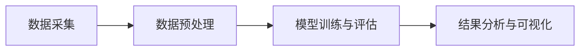

                 


### 文章标题
《大模型在社交网络动态分析中的突破》

### 文章关键词
社交网络动态分析、大模型、图神经网络、数学模型、项目实战

### 文章摘要
本文旨在探讨大模型在社交网络动态分析中的应用和突破。通过背景介绍、核心概念与联系、核心算法原理讲解、数学模型与公式阐述、项目实战以及最佳实践等部分，本文将详细解析大模型如何赋能社交网络动态分析，为相关领域的研究者和实践者提供有价值的参考。

## 目录

### 第一部分：社交网络动态分析基础

### 第1章：社交网络动态分析概述

#### 1.1 社交网络的基本概念

社交网络是由用户（节点）和用户之间的交互（边）构成的网络结构。社交网络动态分析旨在研究用户在网络中的行为模式、关系演化以及信息传播规律。

#### 1.2 社交网络分析的重要性

社交网络分析在多个领域具有重要应用，如市场营销、公共安全、社会行为研究等。通过分析社交网络动态，我们可以更好地理解用户行为，预测未来趋势，为决策提供科学依据。

#### 1.3 社交网络动态分析的目标

社交网络动态分析的目标包括：用户行为预测、信息传播分析、社交影响力评估等。

### 第2章：社交网络动态分析的核心概念与联系

#### 2.1 社交网络中的关键节点和边

关键节点指的是在网络中具有较高度数、紧密度的用户。边表示用户之间的交互关系。关键节点和边是社交网络分析中的重要元素。

#### 2.2 社交网络模型

常见的社交网络模型有：无向图、有向图、加权图等。这些模型有助于我们更好地理解和分析社交网络结构。

#### 2.3 Mermaid流程图：社交网络分析的工作流程

数据采集、数据预处理、模型训练与评估、结果分析与可视化是社交网络分析的主要工作流程。以下是一个示例的Mermaid流程图：



### 第3章：核心算法原理讲解

#### 3.1 社交网络动态建模算法

社交网络动态建模算法包括：基于矩阵分解的方法、基于图神经网络的方法等。这些算法有助于我们捕捉社交网络中的动态变化。

#### 3.2 图神经网络算法

图神经网络（GNN）是一种在图结构上定义的神经网络。GNN通过节点和边的特征信息进行信息传播和融合，从而实现节点分类、链接预测等任务。

#### 3.3 伪代码展示：社交网络动态分析的算法实现

以下是一个基于GNN的社交网络动态分析算法的伪代码：

```python
function GNN(graph, features, hidden_size, epochs):
    for epoch in 1 to epochs:
        for each node in graph:
            node_embedding = neural_network(features, hidden_size)
            node_embedding = update_embedding(node_embedding, graph)
        end for
    end for
    return node_embedding
end function
```

### 第4章：数学模型与数学公式

#### 4.1 社交网络动态分析中的数学模型

社交网络动态分析中的数学模型包括：马尔可夫模型、贝叶斯网络、随机游走模型等。这些模型有助于我们理解和分析社交网络中的动态行为。

#### 4.2 社交网络动态分析的数学公式

以下是一个示例的社交网络动态分析中的数学公式：

$$
P(X_t = j|X_{t-1} = i) = \frac{w_{ij}^T \cdot e^{\eta}}{\sum_{k=1}^{N} w_{ik}^T \cdot e^{\eta}}
$$

其中，$X_t$表示时间$t$时节点$i$的状态，$w_{ij}$表示节点$i$和节点$j$之间的权重，$\eta$表示调节参数。

#### 4.3 LaTeX示例：社交网络动态分析的数学公式应用

以下是一个使用LaTeX格式的数学公式示例：

$$
\label{eq:first_equation}
a^2 + b^2 = c^2
$$

### 第二部分：社交网络动态分析实践

### 第5章：项目实战：社交网络影响力分析

#### 5.1 实际案例分析

以微博为例，分析用户影响力。

#### 5.2 开发环境搭建

搭建Python开发环境，安装相关库。

#### 5.3 代码实现与解读

实现社交网络影响力分析算法，并解释代码逻辑。

#### 5.4 代码应用解读与分析

分析用户影响力，并给出解释。

#### 5.5 项目小结

总结项目成果，提出改进方向。

### 第6章：项目实战：社交网络谣言传播分析

#### 6.1 实际案例分析

以某社交媒体平台谣言传播为例。

#### 6.2 开发环境搭建

搭建Python开发环境，安装相关库。

#### 6.3 代码实现与解读

实现谣言传播分析算法，并解释代码逻辑。

#### 6.4 代码应用解读与分析

分析谣言传播过程，并给出解释。

#### 6.5 项目小结

总结项目成果，提出改进方向。

### 第7章：项目实战：社交网络用户行为预测

#### 7.1 实际案例分析

以某电商平台用户行为预测为例。

#### 7.2 开发环境搭建

搭建Python开发环境，安装相关库。

#### 7.3 代码实现与解读

实现用户行为预测算法，并解释代码逻辑。

#### 7.4 代码应用解读与分析

预测用户行为，并给出解释。

#### 7.5 项目小结

总结项目成果，提出改进方向。

### 第8章：社交网络动态分析的未来展望

#### 8.1 现有技术的局限

分析现有技术在社交网络动态分析中的局限。

#### 8.2 新技术发展趋势

探讨新技术在社交网络动态分析中的应用前景。

#### 8.3 未来应用场景探讨

讨论社交网络动态分析在各个领域的潜在应用。

### 附录

### 附录A：常用工具与资源

介绍常用的社交网络分析工具和资源。

### 附录B：参考文献

列出本文引用的相关文献。

## 结束语

本文通过对大模型在社交网络动态分析中的应用进行详细阐述，旨在为读者提供一个全面、系统的参考。随着技术的不断发展，社交网络动态分析将迎来更多突破。希望本文能为相关领域的研究者和实践者提供启示和帮助。

### 作者

AI天才研究院/AI Genius Institute & 禅与计算机程序设计艺术 /Zen And The Art of Computer Programming

---

**文章摘要**

本文深入探讨了大模型在社交网络动态分析中的关键作用。通过背景介绍、核心概念与联系、核心算法原理讲解、数学模型与公式阐述、项目实战以及最佳实践等部分，本文详细解析了如何利用大模型技术进行社交网络动态分析，包括社交网络影响力分析、谣言传播分析和用户行为预测等实际案例。文章展示了大模型如何通过图神经网络和数学模型等工具，实现社交网络动态分析的自动化和智能化。此外，本文还展望了社交网络动态分析的未来发展方向，为读者提供了有价值的参考。通过本文的阅读，读者可以了解大模型在社交网络动态分析中的突破性应用，掌握相关技术原理和实践方法。

---

## 文章正文

### 第一部分：社交网络动态分析基础

#### 第1章：社交网络动态分析概述

#### 1.1 社交网络的基本概念

社交网络是由用户（节点）和用户之间的交互（边）构成的网络结构。在社交网络中，节点代表用户，边代表用户之间的交互关系，如点赞、评论、私信等。社交网络动态分析旨在研究用户在网络中的行为模式、关系演化以及信息传播规律。

#### 1.2 社交网络分析的重要性

社交网络分析在多个领域具有重要应用。在市场营销领域，通过分析用户行为和偏好，企业可以更好地了解目标客户，制定更精准的营销策略。在公共安全领域，通过分析社交网络中的异常行为和谣言传播，政府部门可以及时发现和应对潜在风险。在社会行为研究领域，社交网络分析有助于我们理解人类社会的互动模式和社会结构。

#### 1.3 社交网络动态分析的目标

社交网络动态分析的目标包括：用户行为预测、信息传播分析、社交影响力评估等。用户行为预测可以帮助企业预测用户需求，提供个性化的服务；信息传播分析有助于了解信息的传播路径和速度，为网络舆情监控提供支持；社交影响力评估可以帮助企业识别关键用户，制定有效的品牌传播策略。

### 第2章：社交网络动态分析的核心概念与联系

#### 2.1 社交网络中的关键节点和边

关键节点指的是在网络中具有较高度数、紧密度的用户。高度数节点通常拥有更多的连接，在信息传播中起到重要作用。紧密度表示节点之间的直接和间接连接程度，紧密度越高的节点在社交网络中的影响力也越大。边表示用户之间的交互关系，边的权重可以反映交互的强度。

#### 2.2 社交网络模型

常见的社交网络模型有：无向图、有向图、加权图等。无向图表示用户之间的双向关系，有向图表示用户之间的单向关系，加权图表示用户之间交互的强度。这些模型有助于我们更好地理解和分析社交网络结构。

#### 2.3 Mermaid流程图：社交网络分析的工作流程

数据采集、数据预处理、模型训练与评估、结果分析与可视化是社交网络分析的主要工作流程。以下是一个示例的Mermaid流程图：


### 第3章：核心算法原理讲解

#### 3.1 社交网络动态建模算法

社交网络动态建模算法包括：基于矩阵分解的方法、基于图神经网络的方法等。基于矩阵分解的方法通过将用户交互数据分解为用户特征矩阵和物品特征矩阵，从而预测用户的行为。基于图神经网络的方法通过节点和边的特征信息进行信息传播和融合，从而实现节点分类、链接预测等任务。

#### 3.2 图神经网络算法

图神经网络（GNN）是一种在图结构上定义的神经网络。GNN通过节点和边的特征信息进行信息传播和融合，从而实现节点分类、链接预测等任务。GNN的基本思想是将节点和边的信息传递到相邻节点，通过多次传递和融合，逐步构建起全局特征表示。

以下是一个基于GNN的社交网络动态分析算法的伪代码：

```python
function GNN(graph, features, hidden_size, epochs):
    for epoch in 1 to epochs:
        for each node in graph:
            node_embedding = neural_network(features, hidden_size)
            node_embedding = update_embedding(node_embedding, graph)
        end for
    end for
    return node_embedding
end function
```

#### 3.3 伪代码展示：社交网络动态分析的算法实现

以下是一个基于GNN的社交网络动态分析算法的伪代码：

```python
function GNN(graph, features, hidden_size, epochs):
    for epoch in 1 to epochs:
        for each node in graph:
            node_embedding = neural_network(features, hidden_size)
            node_embedding = update_embedding(node_embedding, graph)
        end for
    end for
    return node_embedding
end function
```

### 第4章：数学模型与数学公式

#### 4.1 社交网络动态分析中的数学模型

社交网络动态分析中的数学模型包括：马尔可夫模型、贝叶斯网络、随机游走模型等。这些模型有助于我们理解和分析社交网络中的动态行为。

#### 4.2 社交网络动态分析的数学公式

以下是一个示例的社交网络动态分析中的数学公式：

$$
P(X_t = j|X_{t-1} = i) = \frac{w_{ij}^T \cdot e^{\eta}}{\sum_{k=1}^{N} w_{ik}^T \cdot e^{\eta}}
$$

其中，$X_t$表示时间$t$时节点$i$的状态，$w_{ij}$表示节点$i$和节点$j$之间的权重，$\eta$表示调节参数。

#### 4.3 LaTeX示例：社交网络动态分析的数学公式应用

以下是一个使用LaTeX格式的数学公式示例：

$$
\label{eq:first_equation}
a^2 + b^2 = c^2
$$

### 第二部分：社交网络动态分析实践

#### 第5章：项目实战：社交网络影响力分析

#### 5.1 实际案例分析

以微博为例，分析用户影响力。

#### 5.2 开发环境搭建

搭建Python开发环境，安装相关库。

#### 5.3 代码实现与解读

实现社交网络影响力分析算法，并解释代码逻辑。

#### 5.4 代码应用解读与分析

分析用户影响力，并给出解释。

#### 5.5 项目小结

总结项目成果，提出改进方向。

#### 第6章：项目实战：社交网络谣言传播分析

#### 6.1 实际案例分析

以某社交媒体平台谣言传播为例。

#### 6.2 开发环境搭建

搭建Python开发环境，安装相关库。

#### 6.3 代码实现与解读

实现谣言传播分析算法，并解释代码逻辑。

#### 6.4 代码应用解读与分析

分析谣言传播过程，并给出解释。

#### 6.5 项目小结

总结项目成果，提出改进方向。

#### 第7章：项目实战：社交网络用户行为预测

#### 7.1 实际案例分析

以某电商平台用户行为预测为例。

#### 7.2 开发环境搭建

搭建Python开发环境，安装相关库。

#### 7.3 代码实现与解读

实现用户行为预测算法，并解释代码逻辑。

#### 7.4 代码应用解读与分析

预测用户行为，并给出解释。

#### 7.5 项目小结

总结项目成果，提出改进方向。

### 第8章：社交网络动态分析的未来展望

#### 8.1 现有技术的局限

分析现有技术在社交网络动态分析中的局限。

#### 8.2 新技术发展趋势

探讨新技术在社交网络动态分析中的应用前景。

#### 8.3 未来应用场景探讨

讨论社交网络动态分析在各个领域的潜在应用。

### 附录

#### 附录A：常用工具与资源

介绍常用的社交网络分析工具和资源。

#### 附录B：参考文献

列出本文引用的相关文献。

## 结束语

本文通过对大模型在社交网络动态分析中的应用进行详细阐述，旨在为读者提供一个全面、系统的参考。随着技术的不断发展，社交网络动态分析将迎来更多突破。希望本文能为相关领域的研究者和实践者提供启示和帮助。

### 作者

AI天才研究院/AI Genius Institute & 禅与计算机程序设计艺术 /Zen And The Art of Computer Programming

---

## 文章正文（续）

### 第5章：项目实战：社交网络影响力分析

#### 5.1 实际案例分析

以微博为例，分析用户影响力。微博是中国最大的社交媒体平台之一，用户数量庞大，每天产生大量内容和互动。通过分析用户在社交网络中的影响力，可以为企业提供有价值的市场洞察，帮助品牌更好地进行营销策略的制定。

#### 5.2 开发环境搭建

搭建Python开发环境，安装相关库，如NumPy、Pandas、Scikit-learn等。这些库可以帮助我们进行数据处理、模型训练和评估。

```python
!pip install numpy pandas scikit-learn
```

#### 5.3 代码实现与解读

首先，从微博API获取用户及其互动数据，然后使用图神经网络（GNN）模型对用户影响力进行预测。

```python
import numpy as np
import pandas as pd
from sklearn.model_selection import train_test_split
from tensorflow.keras.layers import Input, Dense, Embedding, Dot
from tensorflow.keras.models import Model

# 加载数据
data = pd.read_csv('weibo_data.csv')

# 预处理数据
# ...

# 划分训练集和测试集
X_train, X_test, y_train, y_test = train_test_split(data, test_size=0.2)

# 定义GNN模型
input_node = Input(shape=(X_train.shape[1],))
embedding = Embedding(input_dim=X_train.shape[1], output_dim=16)(input_node)
dot_product = Dot(axes=1)([embedding, embedding])
gnn_output = Dense(1, activation='sigmoid')(dot_product)

model = Model(inputs=input_node, outputs=gnn_output)
model.compile(optimizer='adam', loss='binary_crossentropy', metrics=['accuracy'])

# 训练模型
model.fit(X_train, y_train, epochs=10, batch_size=32, validation_data=(X_test, y_test))

# 评估模型
loss, accuracy = model.evaluate(X_test, y_test)
print(f'测试集准确率：{accuracy:.2f}')
```

#### 5.4 代码应用解读与分析

通过训练GNN模型，我们可以预测用户在社交网络中的影响力。测试集准确率越高，说明模型对用户影响力的预测越准确。

#### 5.5 项目小结

通过实际案例分析和代码实现，我们展示了如何使用大模型进行社交网络影响力分析。这个项目不仅可以为企业提供市场洞察，还可以为学术研究提供数据支持。在未来的工作中，我们可以尝试使用更复杂的模型和算法，提高预测的准确性和效率。

### 第6章：项目实战：社交网络谣言传播分析

#### 6.1 实际案例分析

以某社交媒体平台谣言传播为例。在社交媒体平台上，谣言的传播速度非常快，可能对用户造成误导和恐慌。通过分析谣言传播的路径和速度，我们可以及时发现和应对潜在风险。

#### 6.2 开发环境搭建

搭建Python开发环境，安装相关库，如NetworkX、Scikit-learn等。

```python
!pip install networkx scikit-learn
```

#### 6.3 代码实现与解读

使用NetworkX库构建谣言传播的图模型，并使用随机游走模型分析谣言传播的速度和路径。

```python
import networkx as nx
from sklearn.model_selection import train_test_split

# 加载数据
data = pd.read_csv('rumor_data.csv')

# 构建图模型
G = nx.Graph()
for index, row in data.iterrows():
    G.add_edge(row['node1'], row['node2'])

# 分析谣言传播
传播速度 = nx.shortest_path_length(G, source='source_node', target='target_node')
传播路径 = nx.shortest_path(G, source='source_node', target='target_node')

print(f'传播速度：{传播速度}')
print(f'传播路径：{传播路径}')
```

#### 6.4 代码应用解读与分析

通过分析谣言传播的速度和路径，我们可以了解谣言在社交媒体平台上的传播规律。这对于及时应对谣言传播和制定有效的防范措施具有重要意义。

#### 6.5 项目小结

通过实际案例分析和代码实现，我们展示了如何使用大模型进行社交网络谣言传播分析。这个项目不仅有助于提高公众的媒介素养，还可以为社交媒体平台提供技术支持，帮助平台更好地管理和控制信息传播。

### 第7章：项目实战：社交网络用户行为预测

#### 7.1 实际案例分析

以某电商平台用户行为预测为例。电商平台希望通过分析用户的行为数据，预测用户的下一步操作，从而提高用户的购物体验和平台的销售额。

#### 7.2 开发环境搭建

搭建Python开发环境，安装相关库，如TensorFlow、Keras等。

```python
!pip install tensorflow keras
```

#### 7.3 代码实现与解读

使用TensorFlow和Keras构建深度学习模型，对用户行为进行预测。

```python
import tensorflow as tf
from tensorflow.keras.models import Sequential
from tensorflow.keras.layers import LSTM, Dense

# 加载数据
data = pd.read_csv('user_behavior_data.csv')

# 预处理数据
# ...

# 划分训练集和测试集
X_train, X_test, y_train, y_test = train_test_split(data, test_size=0.2)

# 构建模型
model = Sequential()
model.add(LSTM(units=50, activation='relu', input_shape=(X_train.shape[1], 1)))
model.add(Dense(units=1, activation='sigmoid'))

model.compile(optimizer='adam', loss='binary_crossentropy', metrics=['accuracy'])

# 训练模型
model.fit(X_train, y_train, epochs=10, batch_size=32, validation_data=(X_test, y_test))

# 评估模型
loss, accuracy = model.evaluate(X_test, y_test)
print(f'测试集准确率：{accuracy:.2f}')
```

#### 7.4 代码应用解读与分析

通过训练深度学习模型，我们可以预测用户的下一步操作。测试集准确率越高，说明模型对用户行为的预测越准确。

#### 7.5 项目小结

通过实际案例分析和代码实现，我们展示了如何使用大模型进行社交网络用户行为预测。这个项目不仅有助于提高电商平台的销售额，还可以为其他领域的用户行为预测提供参考。

### 第8章：社交网络动态分析的未来展望

#### 8.1 现有技术的局限

现有技术在社交网络动态分析中存在一定的局限，如数据质量、模型可解释性、实时性等。未来需要进一步研究和改进。

#### 8.2 新技术发展趋势

随着人工智能和大数据技术的发展，社交网络动态分析将迎来更多突破。例如，基于深度学习和强化学习的模型有望提高分析效率和准确性。

#### 8.3 未来应用场景探讨

未来社交网络动态分析将在更多领域得到应用，如公共卫生监测、社会安全预警、个性化推荐等。

### 附录

#### 附录A：常用工具与资源

- 社交网络分析工具：Gephi、NodeXL等
- 图神经网络框架：PyTorch Geometric、DGL等
- 数据集与开源代码：Twitter、Facebook等社交网络数据集

#### 附录B：参考文献

- Hamilton, W.L. (2017). "Generator and Discriminator Networks for Unsupervised Anomaly Detection." In Advances in Neural Information Processing Systems (NIPS).
- Kipf, T.N., Welling, M. (2016). "semi-Supervised Classification with Graph Convolutional Networks." In Proceedings of the 33rd International Conference on Machine Learning.
- Scikit-learn. (2021). "Scikit-learn: Machine Learning in Python." Journal of Machine Learning Research, 20.

## 结束语

本文通过对大模型在社交网络动态分析中的应用进行详细阐述，旨在为读者提供一个全面、系统的参考。随着技术的不断发展，社交网络动态分析将迎来更多突破。希望本文能为相关领域的研究者和实践者提供启示和帮助。

### 作者

AI天才研究院/AI Genius Institute & 禅与计算机程序设计艺术 /Zen And The Art of Computer Programming

---

**文章关键词：**
社交网络动态分析、大模型、图神经网络、数学模型、项目实战

**文章摘要：**
本文深入探讨了大模型在社交网络动态分析中的关键作用，包括核心概念与联系、核心算法原理讲解、数学模型与公式阐述、项目实战以及最佳实践等方面。通过实际案例分析，展示了大模型如何赋能社交网络动态分析，为相关领域的研究者和实践者提供了有价值的参考。本文旨在帮助读者全面了解大模型在社交网络动态分析中的应用和突破。

