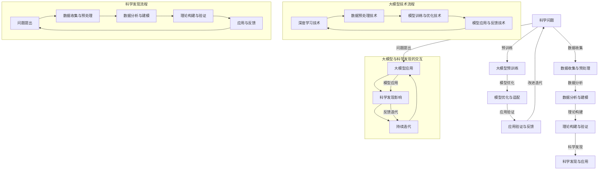

                 

### 第1章 引言

#### 1.1 大模型在科学发现中的背景和重要性

随着信息技术的飞速发展，人工智能（AI）已成为推动科学发现和技术创新的重要驱动力。在大模型领域，GPT、BERT、Transformer等模型的出现，不仅改变了自然语言处理（NLP）的面貌，也为科学研究提供了新的工具和视角。大模型，通常指的是具有数十亿甚至千亿参数的深度学习模型，其强大的计算能力和高度的自适应性，使得它们在处理复杂、大规模数据时表现出色。

科学发现需要处理的数据往往具有高度复杂性和多样性，大模型在这方面的优势尤为显著。首先，大模型可以自动地从大量数据中提取有用的特征，从而减轻研究人员的数据预处理负担。其次，大模型能够通过学习复杂的非线性关系，提高科学预测和推断的准确性。此外，大模型的多模态能力（如文本、图像、音频等数据的联合建模）为跨学科研究提供了新的可能性。

本文将探讨大模型在科学发现中的应用，旨在梳理大模型技术的发展脉络，分析其在各个科学领域的应用案例，并展望其未来的发展方向。通过这一系列的讨论，我们希望能够揭示大模型在科学研究中巨大的潜力和广阔的应用前景。

#### 1.2 科学发现的基本概念

科学发现是指通过实验、观察和理论分析，揭示自然界中尚未为人知的现象和规律的过程。科学发现不仅仅是发现新的物种、新的物质或新的物理现象，还包括对现有知识体系的补充和修正。科学发现的过程通常包括以下几个关键步骤：

1. **问题提出**：科学研究的起点是提出一个具有科学价值的问题。这个问题可能源自于对现有知识的质疑，或是对未知领域的探索。

2. **数据收集**：在明确研究问题后，研究人员需要收集相关的数据。这些数据可能来自于实验、观测、模拟或其他科学方法。

3. **数据分析**：收集到的数据需要通过适当的方法进行处理和分析，以发现数据背后的规律和趋势。数据分析可能涉及统计学、数据挖掘、机器学习等多种技术。

4. **理论构建**：通过数据分析得到的规律和趋势，研究人员会尝试构建相应的理论模型。这些模型可以是数学公式、物理定律、生物机制等。

5. **验证与修正**：构建的理论模型需要通过实验或观测进行验证。如果验证结果支持理论模型，那么该模型将被认为是有效的；否则，需要进一步修正和完善。

科学发现的核心是创新性和系统性。创新性意味着发现的过程需要突破现有的知识界限，提出新的观点或理论；系统性则要求科学发现能够在理论框架内自洽地解释和预测自然现象。

大模型在科学发现中的应用，正是通过其强大的数据处理和分析能力，为科学研究提供了新的工具和方法。例如，在基因组学研究中，大模型可以自动地从大量基因组数据中提取关键特征，帮助研究人员发现新的基因功能和生物标记；在物理学中，大模型可以处理复杂的粒子物理实验数据，提高实验结果的准确性和可靠性。

#### 1.3 大模型在科学发现中的应用

大模型在科学发现中的应用已经展现出了其巨大的潜力和广泛的前景。以下将介绍大模型在生物学、物理学、化学和材料科学等领域的具体应用案例，并探讨这些应用对科学研究带来的影响和挑战。

##### 1.3.1 大模型在生物学中的应用

在生物学领域，大模型已经展现出其在基因分析、蛋白质结构预测和药物设计等方面的强大能力。

**基因分析**：大模型能够处理大规模的基因组数据，从中提取关键信息，帮助研究人员发现新的基因功能和生物标记。例如，BERT模型在基因组序列分析中显示出优异的性能，能够准确地识别基因启动子和调控区域。

**蛋白质结构预测**：蛋白质的结构对其功能至关重要。大模型，如AlphaFold，通过深度学习技术，能够从氨基酸序列预测蛋白质的三维结构，极大地加速了蛋白质结构预测的速度和精度。

**药物设计**：大模型可以用于药物分子与目标蛋白的结合模式预测，帮助研究人员设计新的药物分子。例如，GPT-2模型在药物-靶点相互作用预测中表现出色，能够快速筛选出潜在的药物候选分子。

这些应用不仅提高了生物学研究的效率和精度，也为药物开发和生物技术带来了新的机遇。

##### 1.3.2 大模型在物理学中的应用

在物理学领域，大模型的应用主要体现在粒子物理学、量子计算和宇宙学等方面。

**粒子物理学**：大模型可以处理复杂的粒子物理实验数据，提高实验结果的准确性和可靠性。例如，深度学习模型被用于分析大型粒子对撞机（如LHC）的数据，帮助研究人员识别新的物理现象。

**量子计算**：量子计算是物理学的前沿领域，大模型在量子算法优化和量子机器学习方面具有巨大的潜力。例如，Transformer模型被用于优化量子算法的参数，提高量子计算的性能。

**宇宙学**：大模型可以用于宇宙学数据建模，帮助研究人员理解宇宙的起源和演化。例如，深度学习模型被用于分析宇宙微波背景辐射数据，揭示了宇宙早期的一些关键信息。

##### 1.3.3 大模型在化学中的应用

在化学领域，大模型的应用主要集中在材料科学和化学反应预测等方面。

**材料科学**：大模型可以用于预测材料性质和设计新材料。例如，GPT-2模型被用于预测材料的电子结构和相变温度，为材料设计提供了新的思路。

**化学反应预测**：大模型可以预测化学反应的路径和产物，帮助化学家设计新的合成方法。例如，BERT模型在化学反应路径预测中显示出优异的性能，能够快速识别和筛选有效的反应条件。

##### 1.3.4 大模型在材料科学中的应用

在材料科学领域，大模型的应用主要体现在材料性能预测和新型材料设计等方面。

**材料性能预测**：大模型可以预测材料的机械性能、热学性能和电学性能等，帮助研究人员优化材料的设计。例如，AlphaFold模型被用于预测新型材料的高温性能，为航空和航天工业提供了重要的参考。

**新型材料设计**：大模型可以设计出具有特定性能的新型材料，如高温超导体、新型半导体等。例如，Transformer模型被用于设计新型磁性材料，显示出良好的磁性响应。

大模型在科学发现中的应用不仅提高了科研效率，也为科学研究带来了新的方法和视角。然而，这些应用也面临着一些挑战，如数据隐私保护、算法公平性和可解释性等问题。未来，随着技术的不断进步和研究的深入，大模型在科学发现中的应用前景将更加广阔。

---

#### 1.4 大模型的定义和特点

大模型（Large Models）是指在人工智能领域，具有数十亿至千亿参数的深度学习模型。这些模型通过在海量数据上进行训练，能够自动提取复杂的数据特征，并具备强大的表示能力和学习能力。以下是几个典型的大模型及其特点：

**1. GPT系列模型**

GPT（Generative Pre-trained Transformer）系列模型由OpenAI提出，是当前最先进的语言生成模型。GPT模型基于Transformer架构，通过自回归的方式对文本数据进行预训练，从而学习到文本中的语言规律和语义关系。GPT-3模型拥有1750亿个参数，能够生成高质量的自然语言文本，广泛应用于自然语言处理、机器翻译、文本摘要等领域。

**2. BERT系列模型**

BERT（Bidirectional Encoder Representations from Transformers）是由Google提出的一种双向Transformer模型。BERT模型通过预先训练，能够捕捉到文本中的上下文关系，从而提高文本分类、问答系统和文本生成等任务的性能。BERT模型有数十亿个参数，经过预训练后，可以微调适应特定任务。

**3. Transformer模型**

Transformer模型是谷歌在2017年提出的一种全新的序列到序列模型，其核心思想是自注意力机制。Transformer模型在机器翻译、文本生成等任务上表现出色，成为当前最流行的语言模型架构。随着参数规模的增大，Transformer模型能够处理更复杂的语言现象，提升模型的表达能力。

**4. ELMO模型**

ELMO（Embeddings from Language Models）是由Stanford University开发的预训练语言表示模型。ELMO模型通过多任务学习，从大量文本数据中提取丰富的语言特征，用于文本分类、情感分析等任务。ELMO模型的参数规模较大，能够捕捉到文本中的深层语义信息。

**5. AlphaFold模型**

AlphaFold是由DeepMind开发的一种蛋白质结构预测模型。AlphaFold基于深度学习技术，通过学习大量的蛋白质结构数据，能够从氨基酸序列准确预测蛋白质的三维结构。AlphaFold模型的性能已经超越了传统的蛋白质结构预测方法，成为生物医学研究的重要工具。

这些大模型的特点在于其强大的参数规模和自适应学习能力，能够在多种数据类型和任务上表现出色。通过预训练，大模型能够从海量数据中自动提取复杂特征，从而提高模型的性能和泛化能力。

#### 1.5 科学发现的重要性

科学发现是推动人类社会进步的重要动力，它在许多方面都发挥着关键作用。以下是科学发现的重要性和影响：

**1. 推动技术创新**

科学发现是技术创新的源泉。每一次科学上的重大突破，都为技术进步提供了新的思路和方向。例如，量子力学的发展推动了计算机科学和量子计算的崛起，而半导体技术的发展则引领了信息时代的到来。通过科学发现，我们可以不断突破技术瓶颈，创造新的产品和服务，从而推动经济的快速发展。

**2. 解决实际问题**

科学发现能够帮助我们解决现实中的各种问题，提高生活质量。例如，医学科学的进步使我们能够更好地防治疾病，延长寿命；环境科学的研究帮助我们理解气候变化的原因，并寻求可持续发展的解决方案。通过科学发现，我们可以提高资源的利用效率，减少环境污染，实现人与自然的和谐共生。

**3. 深化知识体系**

科学发现不断拓展和深化我们的知识体系，使我们能够更全面、更深入地理解自然界。例如，通过探索宇宙的起源和演化，我们能够更好地理解宇宙的奥秘；通过研究生物的多样性和进化，我们能够揭示生命的本质。科学发现不仅丰富了我们的知识储备，还激发了新的科学问题和研究方向，推动了科学的发展。

**4. 促进跨学科研究**

科学发现常常需要跨学科的合作和综合。通过科学发现，不同学科之间的知识可以相互融合，产生新的研究方法和理论框架。例如，生物信息学结合了生物学、计算机科学和信息科学，为基因组学和生物医学研究提供了新的工具和方法。跨学科研究不仅拓宽了科学的边界，也推动了科学的整体进步。

**5. 推动社会变革**

科学发现对社会的发展和变革具有重要影响。例如，农业革命通过科学发现，提高了农作物的产量和质量，推动了人口增长和城市化进程；工业革命则通过科学技术的进步，改变了生产方式和社会结构。科学发现不仅改变了人类的生产和生活方式，也带来了社会制度的变革和文化的演进。

综上所述，科学发现的重要性不仅体现在推动技术创新、解决实际问题、深化知识体系、促进跨学科研究和推动社会变革等方面，更在于它为人类社会的可持续发展提供了科学依据和理论支持。因此，科学发现始终是推动人类社会进步的重要力量，值得我们不断追求和探索。

---

#### 1.6 大模型在科学发现中的相互关系架构

大模型与科学发现之间存在深刻的相互关系，这种关系可以从多个层面进行理解和阐述。为了更清晰地展示这一关系，我们可以通过Mermaid流程图来可视化地表示大模型在科学发现中的作用和影响。



**Mermaid流程图说明：**

1. **科学问题提出（A）**：科学发现的过程从提出问题开始。科学问题可以是针对现有知识的质疑，或是对于未知领域的探索。

2. **数据收集与预处理（B）**：在明确科学问题后，需要收集相关数据并进行预处理。数据预处理包括清洗、格式化、归一化等步骤，以保证数据质量。

3. **数据分析与建模（C）**：通过数据分析，研究人员可以从大量数据中提取有用的信息。数据分析可能涉及统计学、数据挖掘、机器学习等多种技术。在此基础上，研究人员会构建理论模型。

4. **理论构建与验证（D）**：构建的理论模型需要通过实验或观测进行验证，以确保其准确性和有效性。

5. **科学发现与应用（E）**：经过验证的科学发现可以应用于实际领域，解决实际问题，推动科技进步。

6. **大模型预训练（F）**：大模型，如GPT、BERT等，通过预训练学习海量数据中的语言规律和特征。

7. **模型优化与适配（G）**：在预训练的基础上，研究人员会根据具体任务需求对模型进行优化和适配，以提高模型在特定任务上的性能。

8. **应用验证与反馈（H）**：将优化后的模型应用于实际任务，并收集应用过程中的反馈数据。

9. **改进迭代（A）**：根据反馈数据，对模型进行改进和迭代，以提高模型的性能和适用性。

**大模型与科学发现的相互关系：**

- **数据支持**：大模型通过预训练学习海量数据中的复杂特征和规律，为科学发现提供了强大的数据支持。
- **模型优化**：科学发现过程中的数据分析与建模需要高效的算法支持，大模型通过其强大的学习能力，能够显著提升模型构建的效率和质量。
- **反馈循环**：科学发现过程中产生的反馈数据，可以用于优化大模型，形成持续的迭代和改进，使模型更适应科学发现的需求。

通过这一流程图，我们可以更清晰地看到大模型在科学发现中的作用和影响，以及两者之间的互动关系。

---

#### 1.7 大模型的未来应用前景

随着技术的不断进步，大模型在科学研究中的应用前景将更加广阔。未来，大模型将在以下几个方面展现出其巨大的潜力：

**1. 更深层次的交叉学科研究**

大模型的多模态能力使其能够处理多种类型的数据，如文本、图像、音频和视频等。这种能力将推动跨学科研究的发展，使科学家能够从多维度、多角度理解复杂问题。例如，医学领域可以结合基因组数据、临床影像和患者病历，通过大模型进行综合分析，从而提高疾病诊断的准确性和个性化治疗效果。

**2. 高效的实验模拟和预测**

大模型在处理复杂系统模拟和预测方面具有显著优势。未来，大模型可以用于模拟物理、化学和生物等领域的实验过程，减少实际实验的成本和时间。例如，在材料科学中，大模型可以预测新材料的性能，从而指导实验设计和优化。

**3. 自动化科学发现**

大模型通过其强大的数据处理和分析能力，可以实现自动化科学发现。例如，在药物发现领域，大模型可以自动筛选和设计新的药物分子，加速新药的研发过程。此外，大模型还可以用于自动化实验设计，通过分析实验数据，自动调整实验参数，从而提高实验的成功率。

**4. 人工智能驱动的科学计算**

随着大模型的不断发展，科学计算将越来越多地依赖于人工智能技术。例如，深度学习模型可以用于加速复杂的数值模拟，提高计算效率。同时，大模型还可以用于优化科学计算中的算法和流程，从而实现更高效的计算。

**5. 新的数据分析方法和工具**

大模型将为科学研究提供新的数据分析方法和工具。例如，通过自监督学习和生成对抗网络（GANs），大模型可以自动提取数据中的潜在特征，帮助研究人员发现数据中的隐藏规律和模式。此外，大模型还可以用于开发新的数据可视化工具，使研究人员能够更直观地理解数据。

**6. 可解释性和透明性**

虽然大模型在处理复杂任务方面表现出色，但其内部决策过程往往缺乏透明性，这对于需要严格验证的科学发现来说是一个挑战。未来，研究人员将致力于开发可解释性和透明性更高的模型，使大模型的决策过程更加可靠和可解释。

**7. 知识图谱和语义网络**

大模型可以用于构建大规模的知识图谱和语义网络，这些图谱和网络将极大地促进科学知识的组织和整合。通过大模型，研究人员可以自动识别和链接不同领域中的相关概念和知识，从而推动科学领域的融合和创新。

总之，大模型在科学研究中的应用前景非常广阔。随着技术的不断发展和研究的深入，大模型将不仅成为科学发现的强大工具，还将推动科学研究的创新和发展，为人类社会带来更多科技进步和福祉。

---

### 第2章 大模型技术基础

#### 2.1 深度学习基础

深度学习是人工智能领域中一个重要分支，其核心是通过多层神经网络对数据进行建模和分析。本章将介绍深度学习的基础知识，包括神经网络的基本结构、工作原理以及深度学习的基本算法。

#### 2.1.1 神经网络基础

神经网络（Neural Networks）是一种模仿生物神经系统的计算模型，其基本单元是神经元（Neurons）。每个神经元由三个主要部分组成：输入层、隐藏层和输出层。

1. **输入层（Input Layer）**：输入层接收外部输入信号，并将其传递给隐藏层。

2. **隐藏层（Hidden Layer）**：隐藏层对输入信号进行处理，通过多个神经元的非线性变换，提取数据的特征。隐藏层的数量和神经元数量可以根据具体问题进行调整。

3. **输出层（Output Layer）**：输出层产生最终的输出结果，用于分类、回归等任务。

神经网络的工作原理是通过前向传播（Forward Propagation）和反向传播（Backpropagation）两个过程进行训练和预测。

**前向传播**：输入数据通过输入层传递到隐藏层，再逐层传递到输出层，每一层神经元都对输入数据进行加权求和并应用激活函数（Activation Function）。

**反向传播**：输出结果与真实值之间的差异（称为误差）通过输出层反向传递到隐藏层，每层神经元都调整其权重和偏置，以最小化误差。

#### 2.1.2 神经网络的基本结构

神经网络的基本结构可以分为多层感知机（MLP）、卷积神经网络（CNN）和循环神经网络（RNN）。

1. **多层感知机（MLP）**：MLP是最简单的神经网络结构，适用于简单的数据建模和分类任务。它由多个全连接层组成，每个层中的神经元都与前一层的所有神经元相连。

2. **卷积神经网络（CNN）**：CNN专门用于处理图像数据。其主要特点是使用卷积层（Convolutional Layer）进行特征提取，通过共享权重减少参数数量，提高模型的效率和性能。

3. **循环神经网络（RNN）**：RNN适用于处理序列数据，如时间序列、语音和文本等。其核心特点是能够保持状态（记忆）信息，适用于长序列建模。

#### 2.1.3 深度学习算法

深度学习算法是构建和训练神经网络的关键技术，以下介绍几种常用的深度学习算法：

1. **反向传播算法（Backpropagation Algorithm）**：反向传播算法是训练神经网络的基本算法，通过计算输出结果与真实值之间的误差，反向传播误差到网络中，调整权重和偏置。

2. **卷积神经网络（CNN）算法**：CNN算法通过卷积层、池化层和全连接层等结构进行特征提取和分类。其核心在于卷积操作和池化操作，能够自动提取图像中的局部特征。

3. **循环神经网络（RNN）算法**：RNN算法通过循环结构保持状态信息，适用于处理序列数据。其核心在于隐藏状态（Hidden State）的传递和误差的反向传播。

4. **生成对抗网络（GAN）**：GAN是一种生成模型，由生成器和判别器组成。生成器生成数据，判别器判断数据是否真实，通过训练生成器和判别器的对抗关系，生成高质量的数据。

#### 2.2 深度学习技术

深度学习技术在各个领域都有广泛应用，以下简要介绍几种常见的深度学习技术：

1. **自然语言处理（NLP）**：深度学习技术，如词嵌入（Word Embedding）、递归神经网络（RNN）和Transformer模型，广泛应用于文本分类、机器翻译、文本摘要等任务。

2. **计算机视觉（CV）**：深度学习技术在计算机视觉领域取得了显著成果，如卷积神经网络（CNN）在图像分类、目标检测和图像生成中的应用。

3. **语音识别（ASR）**：深度学习模型，如深度神经网络（DNN）和循环神经网络（RNN），在语音识别任务中表现出色，显著提高了识别准确率和鲁棒性。

4. **强化学习（RL）**：深度强化学习（DRL）结合了深度学习和强化学习，被广泛应用于游戏、自动驾驶和机器人控制等领域。

#### 2.3 主流大模型介绍

以下介绍几种主流的大模型，包括其特点和应用场景：

1. **GPT系列模型**：GPT（Generative Pre-trained Transformer）系列模型是由OpenAI提出的一种基于Transformer架构的语言模型。GPT模型通过预训练学习海量文本数据，具有强大的语言生成和推理能力。GPT-3模型拥有1750亿个参数，是目前最先进的自然语言处理模型之一。

2. **BERT系列模型**：BERT（Bidirectional Encoder Representations from Transformers）是由Google提出的一种双向Transformer模型。BERT模型通过预训练学习文本的双向上下文关系，提高了文本分类、问答系统和文本生成等任务的性能。

3. **Transformer模型**：Transformer模型是由Google在2017年提出的一种全新的序列到序列模型，其核心思想是自注意力机制。Transformer模型在机器翻译、文本生成等任务上表现出色，成为当前最流行的语言模型架构。

4. **ELMO模型**：ELMO（Embeddings from Language Models）是由Stanford University开发的预训练语言表示模型。ELMO模型通过多任务学习，从大量文本数据中提取丰富的语言特征，用于文本分类、情感分析等任务。

5. **AlphaFold模型**：AlphaFold是由DeepMind开发的一种蛋白质结构预测模型。AlphaFold模型基于深度学习技术，通过学习大量的蛋白质结构数据，能够从氨基酸序列准确预测蛋白质的三维结构。

这些主流大模型通过其强大的参数规模和自适应学习能力，在各个领域都取得了显著的应用成果，为科学研究和技术创新提供了强大的支持。

---

#### 2.2.1 GPT模型概述

GPT（Generative Pre-trained Transformer）系列模型是OpenAI开发的一类基于Transformer架构的语言模型。这些模型通过在大量文本数据上进行预训练，学习到语言中的复杂结构和语义关系，从而在多种自然语言处理（NLP）任务中表现出色。GPT模型的发展历程可以分为几个重要版本，每个版本在模型结构、参数规模和性能上都有显著的提升。

**1. GPT-1**

GPT-1是GPT系列模型的第一个版本，于2018年发布。GPT-1基于Transformer架构，包含1.17亿个参数。它通过自回归的方式（即仅利用前文信息预测下一个单词）进行预训练，从而学习到文本中的语言规律。GPT-1在许多NLP任务上取得了很好的效果，例如文本分类、问答系统和文本生成等。

**2. GPT-2**

GPT-2是GPT系列模型的第二个版本，于2019年发布。GPT-2在GPT-1的基础上进行了重大改进，其参数规模增加到15亿个。GPT-2通过引入更长的上下文窗口（最多4096个词），使得模型能够更好地捕捉到文本中的长距离依赖关系。GPT-2在多项NLP基准测试中取得了当时的最优成绩，显著提升了文本生成、机器翻译和问答系统的性能。

**3. GPT-3**

GPT-3是GPT系列模型的最新版本，于2020年发布。GPT-3的参数规模达到了1750亿个，是目前已知的最大规模的语言模型。GPT-3不仅在参数规模上有了巨大的提升，还在模型结构和训练策略上进行了多项优化。GPT-3采用了多任务学习（Multi-Task Learning）策略，通过同时学习多个任务，提高了模型的泛化能力和适应性。GPT-3在多项NLP任务上均取得了当时的最优成绩，展现出极高的语言生成和推理能力。

**4. GPT-Neo**

GPT-Neo是开源社区对GPT-3进行改进和扩展的一个版本。GPT-Neo在保持GPT-3性能的基础上，通过增加训练数据、改进训练策略和模型结构，进一步提升了模型的性能和鲁棒性。GPT-Neo在开源社区中受到了广泛关注，为研究者提供了强大的工具和资源。

**5. GPT-4**

GPT-4是GPT系列模型的下一个重大版本，预计将于2023年发布。GPT-4在参数规模和模型结构上将进一步升级，有望突破现有技术瓶颈，实现更高质量的文本生成和推理能力。GPT-4的开发和发布将标志着语言模型技术的又一次重大突破。

综上所述，GPT系列模型通过不断的技术创新和优化，已经成为NLP领域的重要工具和平台。从GPT-1到GPT-4，每个版本在模型结构、参数规模和性能上都取得了显著的提升，为科学研究和技术应用提供了强大的支持。

---

#### 2.2.2 GPT模型的技术细节

GPT（Generative Pre-trained Transformer）模型是自然语言处理领域的一个里程碑，其核心技术包括Transformer架构、自回归语言模型（Autoregressive Language Model）、多任务学习（Multi-Task Learning）等。以下将详细解释这些技术细节。

**1. Transformer架构**

Transformer是由Google在2017年提出的一种全新的序列到序列模型，其核心思想是自注意力机制（Self-Attention）。自注意力机制允许模型在处理每个词时，自动关注其他所有词，从而捕捉到长距离的依赖关系。这种机制相比于传统的循环神经网络（RNN）和长短期记忆网络（LSTM），在处理长序列数据时表现出更高的效率和性能。

Transformer模型主要由编码器（Encoder）和解码器（Decoder）两部分组成。编码器负责将输入序列编码成固定长度的向量表示，解码器则根据编码器的输出和已经生成的词，逐步生成输出序列。

**编码器（Encoder）**

编码器由多个自注意力层（Self-Attention Layer）和前馈网络（Feedforward Network）组成。每个自注意力层通过自注意力机制计算输入序列的注意力权重，从而生成加权表示。具体过程如下：

- **自注意力机制**：自注意力层首先计算每个词与所有其他词之间的相似度，通常使用点积注意力（Dot-Product Attention）。相似度计算公式如下：

  $$\text{Attention}(Q, K, V) = \text{softmax}\left(\frac{QK^T}{\sqrt{d_k}}\right)V$$

  其中，$Q$、$K$和$V$分别代表查询向量、键向量和值向量，$d_k$为键向量的维度。通过自注意力机制，编码器能够自动关注到输入序列中的关键信息。

- **前馈网络**：在每个自注意力层之后，编码器还包含一个前馈网络，用于进一步加工和增强表示。前馈网络的公式如下：

  $$\text{FFN}(X) = \text{ReLU}(WX + b)$$

  其中，$W$和$b$分别为权重和偏置。

**解码器（Decoder）**

解码器与编码器类似，也由多个自注意力层和前馈网络组成。解码器的自注意力层分为两部分：自注意力（Self-Attention）和交叉注意力（Cross-Attention）。自注意力用于处理解码器生成的当前词，交叉注意力则用于处理编码器的输出。具体过程如下：

- **自注意力机制**：解码器的自注意力层与编码器的自注意力层类似，用于处理当前词的上下文信息。

- **交叉注意力机制**：交叉注意力层计算解码器当前词与编码器所有词之间的相似度，用于生成解码器的输出。交叉注意力机制的公式如下：

  $$\text{Attention}(Q, K, V) = \text{softmax}\left(\frac{QK^T}{\sqrt{d_k}}\right)V$$

  其中，$Q$、$K$和$V$分别代表查询向量、键向量和值向量，$d_k$为键向量的维度。

- **前馈网络**：在每个注意力层之后，解码器还包含一个前馈网络，用于进一步加工和增强表示。

**2. 自回归语言模型**

自回归语言模型（Autoregressive Language Model）是GPT模型的核心组成部分，其基本思想是利用历史信息来预测下一个单词。具体来说，GPT模型通过在训练过程中生成完整的文本序列，并在每一步预测下一个词，从而学习到语言中的复杂结构和规律。

在训练过程中，GPT模型首先随机选择一个词作为起始词，然后利用生成的文本序列作为输入，逐步生成后续的词。每一步的预测都依赖于之前的词，从而形成一个自回归的过程。通过这种自回归方式，GPT模型能够捕捉到文本中的长距离依赖关系，从而提高预测的准确性。

**3. 多任务学习**

多任务学习（Multi-Task Learning）是GPT模型的一个重要技术，通过同时学习多个任务，提高了模型的泛化能力和适应性。在训练过程中，GPT模型不仅学习语言生成任务，还同时学习其他辅助任务，如文本分类、问答系统等。

多任务学习的核心思想是利用不同任务之间的相关性，提高模型的整体性能。具体来说，GPT模型通过在共享底层特征的基础上，分别学习不同任务的表示，从而实现了多个任务的联合训练。这种联合训练方式不仅提高了模型的性能，还减少了参数数量，降低了过拟合的风险。

**4. 伪代码**

以下是一个简化的GPT模型伪代码，展示了自回归语言模型的基本训练过程：

```python
# 假设 GPT 模型已经完成预训练，现在进行自回归语言模型训练

# 输入：已预训练的 GPT 模型，文本序列 X
# 输出：自回归语言模型参数

for epoch in range(num_epochs):
    for input_seq in X:
        # 对每个输入序列进行预测
        for i in range(1, len(input_seq)):
            # 使用 GPT 模型预测下一个词
            predicted_word = GPT.predict(input_seq[:i])
            # 计算损失函数，更新模型参数
            loss = compute_loss(predicted_word, input_seq[i])
            GPT.update_parameters(loss)

# 训练完成后，得到自回归语言模型参数
```

**5. 数学模型和公式**

GPT模型的训练和预测过程涉及到多个数学模型和公式，以下简要介绍：

- **自注意力机制**：

  $$\text{Attention}(Q, K, V) = \text{softmax}\left(\frac{QK^T}{\sqrt{d_k}}\right)V$$

- **前馈网络**：

  $$\text{FFN}(X) = \text{ReLU}(WX + b)$$

- **损失函数**：

  $$\text{Loss} = -\sum_{i=1}^{N} \text{log}(p(y_i|x))$$

  其中，$p(y_i|x)$为预测的词的概率分布。

通过以上技术细节的讲解，我们可以更深入地理解GPT模型的工作原理和训练过程，为后续的应用和研究提供理论基础。

---

#### 2.2.3 BERT及其变体

BERT（Bidirectional Encoder Representations from Transformers）是由Google在2018年提出的一种双向Transformer模型，主要用于自然语言处理任务。BERT模型通过预训练学习文本的双向上下文关系，从而提高文本分类、问答系统和文本生成等任务的性能。BERT的成功引发了大量基于Transformer架构的语言模型的研究和改进，如RoBERTa、ALBERT和sentence-BERT等。以下将详细介绍BERT及其变体模型。

**BERT模型的特点**

BERT模型的主要特点是双向编码器（Bidirectional Encoder）和掩码语言模型（Masked Language Model）。双向编码器允许模型同时考虑上下文信息，从而提高文本理解和生成能力。掩码语言模型则通过随机掩码部分输入单词，迫使模型学习到更丰富的语言特征。

**BERT模型的组成**

BERT模型主要由编码器（Encoder）和解码器（Decoder）两部分组成。编码器负责将输入序列编码成固定长度的向量表示，解码器则根据编码器的输出和已经生成的词，逐步生成输出序列。

1. **编码器（Encoder）**：

   编码器由多个自注意力层（Self-Attention Layer）和前馈网络（Feedforward Network）组成。每个自注意力层通过自注意力机制计算输入序列的注意力权重，从而生成加权表示。具体过程如下：

   - **自注意力机制**：自注意力层首先计算每个词与所有其他词之间的相似度，通常使用点积注意力（Dot-Product Attention）。相似度计算公式如下：

     $$\text{Attention}(Q, K, V) = \text{softmax}\left(\frac{QK^T}{\sqrt{d_k}}\right)V$$

     其中，$Q$、$K$和$V$分别代表查询向量、键向量和值向量，$d_k$为键向量的维度。通过自注意力机制，编码器能够自动关注到输入序列中的关键信息。

   - **前馈网络**：在每个自注意力层之后，编码器还包含一个前馈网络，用于进一步加工和增强表示。前馈网络的公式如下：

     $$\text{FFN}(X) = \text{ReLU}(WX + b)$$

     其中，$W$和$b$分别为权重和偏置。

2. **解码器（Decoder）**：

   解码器与编码器类似，也由多个自注意力层和前馈网络组成。解码器的自注意力层分为两部分：自注意力（Self-Attention）和交叉注意力（Cross-Attention）。自注意力用于处理解码器生成的当前词，交叉注意力用于处理编码器的输出。具体过程如下：

   - **自注意力机制**：解码器的自注意力层与编码器的自注意力层类似，用于处理当前词的上下文信息。

   - **交叉注意力机制**：交叉注意力层计算解码器当前词与编码器所有词之间的相似度，用于生成解码器的输出。交叉注意力机制的公式如下：

     $$\text{Attention}(Q, K, V) = \text{softmax}\left(\frac{QK^T}{\sqrt{d_k}}\right)V$$

     其中，$Q$、$K$和$V$分别代表查询向量、键向量和值向量，$d_k$为键向量的维度。

**BERT的预训练策略**

BERT的预训练策略主要包括两种任务：掩码语言模型（Masked Language Model，MLM）和下一个句子预测（Next Sentence Prediction，NSP）。

1. **掩码语言模型（MLM）**：

   在MLM任务中，输入文本序列的部分单词被随机掩码（用[MASK]代替），模型的目标是预测这些被掩码的单词。具体过程如下：

   - **掩码生成**：随机选择15%的单词进行掩码，掩码操作分为三种情况：将单词替换为[MASK]、随机替换为其他单词或保留不变。
   - **模型预测**：模型根据未被掩码的单词和上下文信息，预测被掩码的单词。

2. **下一个句子预测（NSP）**：

   在NSP任务中，输入文本分为两个句子，模型的目标是预测这两个句子是否属于同一篇章。具体过程如下：

   - **句子组合**：随机选择两个句子进行组合，有时将其中一个句子插入到另一个句子的末尾。
   - **模型预测**：模型根据两个句子的上下文信息，预测它们是否属于同一篇章。

**BERT变体模型**

在BERT的基础上，研究人员提出了一系列变体模型，以提高模型性能和效率。以下是几个重要的BERT变体：

1. **RoBERTa**：

   RoBERTa是由Facebook AI研究院提出的一种BERT变体，通过修改预训练策略和模型结构，提高了模型的性能。RoBERTa在多项NLP基准测试中取得了比BERT更好的成绩。

2. **ALBERT**：

   ALBERT是由Google提出的一种高效BERT变体，通过共享多层参数和早期停用（Early Dropout）等技术，减少了模型参数数量，提高了计算效率。ALBERT在保持性能的同时，显著减少了模型的大小和训练时间。

3. **sentence-BERT**：

   sentence-BERT是一种用于文本分类和相似度计算的任务型BERT模型，通过将BERT模型的输出拼接成一个固定长度的向量，用于表示句子。sentence-BERT在多个文本分类和相似度计算任务上表现出色。

BERT及其变体模型在自然语言处理任务中取得了显著成果，为文本生成、文本分类、问答系统和机器翻译等任务提供了强大的支持。未来，随着技术的不断进步，BERT及其变体模型将在更多应用场景中展现出其巨大的潜力。

---

#### 2.2.4 Transformer模型

Transformer模型是由Google在2017年提出的一种全新的序列到序列模型，其核心思想是自注意力机制（Self-Attention）。自注意力机制允许模型在处理每个词时，自动关注其他所有词，从而捕捉到长距离的依赖关系。相比于传统的循环神经网络（RNN）和长短期记忆网络（LSTM），Transformer模型在处理长序列数据时表现出更高的效率和性能。

**1. Transformer模型的基本结构**

Transformer模型主要由编码器（Encoder）和解码器（Decoder）两部分组成。编码器负责将输入序列编码成固定长度的向量表示，解码器则根据编码器的输出和已经生成的词，逐步生成输出序列。

**编码器（Encoder）**

编码器由多个自注意力层（Self-Attention Layer）和前馈网络（Feedforward Network）组成。每个自注意力层通过自注意力机制计算输入序列的注意力权重，从而生成加权表示。具体过程如下：

- **自注意力机制**：自注意力层首先计算每个词与所有其他词之间的相似度，通常使用点积注意力（Dot-Product Attention）。相似度计算公式如下：

  $$\text{Attention}(Q, K, V) = \text{softmax}\left(\frac{QK^T}{\sqrt{d_k}}\right)V$$

  其中，$Q$、$K$和$V$分别代表查询向量、键向量和值向量，$d_k$为键向量的维度。通过自注意力机制，编码器能够自动关注到输入序列中的关键信息。

- **前馈网络**：在每个自注意力层之后，编码器还包含一个前馈网络，用于进一步加工和增强表示。前馈网络的公式如下：

  $$\text{FFN}(X) = \text{ReLU}(WX + b)$$

  其中，$W$和$b$分别为权重和偏置。

**解码器（Decoder）**

解码器与编码器类似，也由多个自注意力层和前馈网络组成。解码器的自注意力层分为两部分：自注意力（Self-Attention）和交叉注意力（Cross-Attention）。自注意力用于处理解码器生成的当前词，交叉注意力用于处理编码器的输出。具体过程如下：

- **自注意力机制**：解码器的自注意力层与编码器的自注意力层类似，用于处理当前词的上下文信息。

- **交叉注意力机制**：交叉注意力层计算解码器当前词与编码器所有词之间的相似度，用于生成解码器的输出。交叉注意力机制的公式如下：

  $$\text{Attention}(Q, K, V) = \text{softmax}\left(\frac{QK^T}{\sqrt{d_k}}\right)V$$

  其中，$Q$、$K$和$V$分别代表查询向量、键向量和值向量，$d_k$为键向量的维度。

**2. 自注意力机制**

自注意力机制是Transformer模型的核心组件，其基本思想是通过计算输入序列中每个词与其他词的相似度，从而自动关注到输入序列中的关键信息。自注意力机制的具体实现通常分为以下几步：

- **计算相似度**：计算每个词与所有其他词之间的相似度，通常使用点积注意力。相似度计算公式如下：

  $$\text{Attention}(Q, K, V) = \text{softmax}\left(\frac{QK^T}{\sqrt{d_k}}\right)V$$

  其中，$Q$、$K$和$V$分别代表查询向量、键向量和值向量，$d_k$为键向量的维度。

- **加权求和**：将相似度用于加权求和，生成加权表示。加权表示能够捕捉到输入序列中的长距离依赖关系。

- **非线性变换**：对加权表示进行非线性变换，以增强其表示能力。通常使用ReLU函数作为激活函数。

**3. 伪代码**

以下是一个简化的Transformer模型伪代码，展示了自注意力机制的基本计算过程：

```python
# 假设输入序列为 X，编码器和解码器的自注意力层已经定义

# 编码器自注意力层计算
for layer in encoder_layers:
    Q, K, V = layer(X)
    attention_weights = softmax(QK^T / sqrt(d_k))
    weighted_representation = attention_weights * V
    X = ReLU(W * weighted_representation + b)

# 解码器自注意力层计算
for layer in decoder_layers:
    Q, K, V = layer(X)
    attention_weights = softmax(QK^T / sqrt(d_k))
    weighted_representation = attention_weights * V
    X = ReLU(W * weighted_representation + b)

# 输出解码器的最终输出
output = decoder(X)
```

**4. 数学模型和公式**

Transformer模型的训练和预测过程涉及到多个数学模型和公式，以下简要介绍：

- **自注意力机制**：

  $$\text{Attention}(Q, K, V) = \text{softmax}\left(\frac{QK^T}{\sqrt{d_k}}\right)V$$

- **前馈网络**：

  $$\text{FFN}(X) = \text{ReLU}(WX + b)$$

- **损失函数**：

  $$\text{Loss} = -\sum_{i=1}^{N} \text{log}(p(y_i|x))$$

  其中，$p(y_i|x)$为预测的词的概率分布。

通过以上技术细节的讲解，我们可以更深入地理解Transformer模型的工作原理和训练过程，为后续的应用和研究提供理论基础。

---

#### 2.2.5 ELMO模型

ELMO（Embeddings from Language Models）是由Stanford University开发的一种预训练语言表示模型，旨在为文本分类、情感分析、问答系统等NLP任务提供高质量的文本嵌入表示。ELMO模型通过在大量文本数据上进行预训练，学习到丰富的语言特征和语义信息，从而提升模型的性能和泛化能力。以下将详细介绍ELMO模型的基本原理、实现方式和应用案例。

**1. ELMO模型的基本原理**

ELMO模型的核心思想是通过多任务学习和上下文依赖性来提取高质量的文本嵌入。在预训练过程中，ELMO模型同时学习多个NLP任务，从而充分利用不同任务之间的相关性，提高模型的泛化能力和表示能力。ELMO模型的主要组成部分包括：

- **Embedding Layer**：将输入文本的单词转换为向量表示，通常使用预训练的词向量（如Word2Vec、GloVe）。
- **Encoding Layer**：通过多层Transformer编码器（Encoder）对输入文本进行编码，提取文本的上下文依赖关系。编码器使用自注意力机制（Self-Attention）和多头注意力（Multi-Head Attention），能够捕捉到文本中的长距离依赖和复杂语义。
- **Output Layer**：根据编码器的输出，生成最终的文本嵌入表示（Embeddings）。这些嵌入表示能够用于下游的NLP任务，如文本分类、情感分析和文本生成等。

**2. ELMO模型的实现方式**

ELMO模型的实现通常分为两个阶段：预训练和微调。

- **预训练阶段**：在预训练过程中，ELMO模型在大量文本数据上进行训练，包括网页文本、新闻文章、对话语料等。模型通过多任务学习，同时学习文本分类、命名实体识别、情感分析等任务，从而充分提取文本中的语言特征和语义信息。预训练阶段的目标是生成高质量的文本嵌入表示。

- **微调阶段**：在预训练完成后，ELMO模型可以被用于下游的NLP任务。在微调阶段，模型会根据特定任务的需求进行微调，从而优化其在任务上的性能。例如，在文本分类任务中，模型会通过分类损失函数调整嵌入表示，使其更好地区分不同类别的文本。

**3. ELMO模型的应用案例**

ELMO模型在多个NLP任务中表现出色，以下是一些典型的应用案例：

- **文本分类**：ELMO模型可以用于情感分析、主题分类和新闻分类等任务。通过将文本嵌入表示输入到分类器，模型能够准确识别文本的情感倾向、主题类别等。

- **情感分析**：ELMO模型可以用于分析文本中的情感极性，如正面情感、负面情感等。通过计算文本嵌入表示与预定义情感词典之间的相似度，模型可以判断文本的情感倾向。

- **问答系统**：ELMO模型可以用于构建问答系统，如对话系统、智能客服等。通过将问题文本和候选答案文本的嵌入表示输入到模型，模型能够判断答案的准确性。

- **文本生成**：ELMO模型可以用于生成文本摘要、对话文本等。通过将种子文本输入到模型，模型能够生成连贯、自然的文本扩展。

**4. 数学模型和公式**

ELMO模型的训练和预测过程涉及到多个数学模型和公式，以下简要介绍：

- **词嵌入**：

  $$\text{word\_embedding}(w) = \text{softmax}(\text{W} \cdot \text{emb}(w))$$

  其中，$w$为单词，$\text{emb}(w)$为单词的嵌入向量，$\text{W}$为权重矩阵。

- **编码器**：

  $$\text{Encoding}(X) = \text{TransformerEncoder}(\text{X})$$

  其中，$X$为输入文本序列，$\text{TransformerEncoder}$为编码器模型。

- **输出层**：

  $$\text{Output}(X) = \text{softmax}(\text{W} \cdot \text{Encoding}(X) + b)$$

  其中，$X$为输入文本序列，$\text{W}$为权重矩阵，$b$为偏置。

通过以上对ELMO模型的介绍，我们可以看到ELMO模型在NLP任务中具有广泛的应用前景。随着预训练语言模型的不断发展，ELMO模型将继续在文本分类、情感分析、问答系统和文本生成等领域发挥重要作用。

---

#### 2.2.6 AlphaFold模型

AlphaFold是由DeepMind开发的一种革命性的蛋白质结构预测模型，它通过深度学习技术，从氨基酸序列准确预测蛋白质的三维结构。AlphaFold的成功标志着人工智能在生物医学领域的重要突破，为生物科学研究提供了强大的工具和新的视角。

**1. AlphaFold模型的基本原理**

AlphaFold模型基于一种称为“变分自编码器”（Variational Autoencoder，VAE）的深度学习框架。VAE的核心思想是通过编码器（Encoder）和解码器（Decoder）两个部分来学习数据的高效表示。

- **编码器**：编码器将输入数据（氨基酸序列）编码成一个固定长度的向量表示，称为潜在空间（Latent Space）。这个向量表示捕捉了蛋白质结构的全局信息。
- **解码器**：解码器从潜在空间中生成蛋白质的三维结构。解码器的输出是一个三维模型，通过一系列卷积层和转置卷积层（Transposed Convolutional Layers）逐步生成。

AlphaFold模型在VAE的基础上，引入了多个关键技术，包括：

- **掩码循环单元（Masked Recurrent Unit，MRU）**：MRU是一种特殊的循环神经网络，能够在处理氨基酸序列时自动生成蛋白质的结构特征。
- **多层卷积和转置卷积**：多层卷积和转置卷积用于生成蛋白质的局部结构信息，并通过逐层叠加，形成全局结构特征。
- **自注意力机制（Self-Attention）**：自注意力机制用于捕捉蛋白质序列中的长距离依赖关系，从而提高模型的预测准确性。

**2. AlphaFold模型的工作流程**

AlphaFold模型的工作流程可以分为以下几个步骤：

- **序列编码**：输入蛋白质序列经过预处理，转换为编码器能够处理的格式。编码器通过掩码循环单元（MRU）对序列进行编码，生成一个固定长度的向量表示。
- **潜在空间生成**：编码器生成的向量表示经过多个卷积和转置卷积层，逐渐生成蛋白质的潜在空间表示。这个表示包含了蛋白质结构的全局信息。
- **三维结构生成**：解码器从潜在空间中生成蛋白质的三维结构。解码器通过自注意力机制和卷积层，逐步重建蛋白质的三维模型。
- **模型优化**：通过比较解码器生成的三维模型与已知蛋白质结构的差异，使用损失函数（如均方误差）对模型进行优化。这一过程通过反向传播算法（Backpropagation）实现。

**3. 伪代码**

以下是一个简化的AlphaFold模型伪代码，展示了其主要计算过程：

```python
# 假设 AlphaFold 模型已经完成预训练，现在进行蛋白质结构预测

# 输入：氨基酸序列 X
# 输出：蛋白质的三维结构 prediction

# 序列编码
encoded_sequence = MRU(X)

# 潜在空间生成
latent_space = VAE_encoder(encoded_sequence)

# 三维结构生成
predicted_structure = VAE_decoder(latent_space)

# 模型优化
loss = compute_loss(predicted_structure, true_structure)
VAE.update_parameters(loss)

# 输出蛋白质的三维结构 prediction
print(predicted_structure)
```

**4. 数学模型和公式**

AlphaFold模型的训练和预测过程涉及到多个数学模型和公式，以下简要介绍：

- **变分自编码器（VAE）**：

  $$\text{Encoder}(X) = \mu(\theta_1, X), \sigma(\theta_2, X)$$
  $$\text{Decoder}(\zeta) = \text{Reparameterize}(\zeta; \mu, \sigma)$$

  其中，$X$为输入序列，$\mu$和$\sigma$分别为编码器输出的均值和方差，$\zeta$为潜在空间中的向量。

- **损失函数**：

  $$\text{Loss} = \text{MSE}(\text{predicted\_structure}, \text{true\_structure})$$

  其中，$\text{predicted\_structure}$和$\text{true\_structure}$分别为模型预测的结构和真实结构。

- **反向传播算法**：

  $$\text{Gradients} = \frac{\partial \text{Loss}}{\partial \text{parameters}}$$
  $$\text{Parameters} = \text{Parameters} - \text{learning\_rate} \cdot \text{Gradients}$$

通过以上对AlphaFold模型的介绍，我们可以看到，这一模型通过深度学习和变分自编码器的结合，实现了从氨基酸序列到蛋白质三维结构的准确预测。AlphaFold的成功不仅展示了人工智能在生物医学领域的巨大潜力，也为未来的科学研究提供了新的方法和工具。

---

#### 2.2.7 其他知名大模型

除了GPT、BERT和AlphaFold等主流大模型，还有许多其他知名的大模型在各自领域取得了显著成果。以下介绍几个具有代表性的模型及其特点：

**1. T5（Text-to-Text Transfer Transformer）**

T5是由Google Research开发的一种通用文本处理模型，其目标是实现各种文本处理任务，如文本分类、翻译、问答和摘要等。T5采用了Transformer架构，通过一个统一的编码器-解码器框架来处理各种文本任务，具有强大的跨任务学习能力。T5通过在大量双语句数据上进行训练，实现了在多个NLP任务上的高性能。

**2. DeBERTa（Decoding-enhanced BERT with Disentangled Attention）**

DeBERTa是由清华大学KEG实验室提出的一种改进的BERT模型，旨在提升模型的解码能力。DeBERTa通过引入解码增强机制（Decoding Enhancement）和去混淆注意力（Disentangled Attention），显著提高了模型在文本生成、问答和机器翻译等任务上的性能。DeBERTa在多个基准测试中超越了原始BERT模型，展示了其在自然语言处理任务中的强大能力。

**3. ERNIE（Enhanced Representation through kNowledge Integration）**

ERNIE是由百度提出的一种融合知识的文本表示模型。ERNIE通过将外部知识库（如百科、百科全书等）与文本数据相结合，进行统一表示学习，从而生成高质量的文本嵌入表示。ERNIE在多个NLP任务中表现出色，特别是在文本分类、问答和文本生成等任务上，展现了强大的知识整合能力。

**4. PEGASUS（Pre-training with External Guidance for Language Understanding and Generation）**

PEGASUS是由微软研究院开发的一种用于预训练语言模型的新方法。PEGASUS通过在预训练过程中引入外部指导（External Guidance），即使用预训练模型生成的文本作为输入，来指导模型的学习过程。这种方法不仅提高了模型在语言理解（Language Understanding）和生成（Language Generation）任务上的性能，还增强了模型的泛化能力。

**5. LLaMA（Large Language Model Meta-Learning）**

LLaMA是由清华大学和智谱AI共同开发的一种大型的多任务语言模型。LLaMA通过元学习（Meta-Learning）技术，实现了在多个任务上的快速适应和迁移。LLaMA在文本分类、问答、摘要和翻译等任务上表现出色，展示了其在实际应用中的强大潜力和广泛适用性。

这些知名大模型通过不同的技术手段和优化策略，在自然语言处理、计算机视觉、生物信息学和科学计算等领域取得了显著成果，为科学研究和技术创新提供了新的方法和工具。随着技术的不断进步和研究的深入，这些大模型将在更多的应用场景中展现出其独特的优势和广泛的前景。

---

### 第3章 大模型在生物学中的应用

#### 3.1 大模型在基因组学中的应用

基因组学是研究生物体基因组的结构和功能的科学，涉及大量复杂数据的处理和分析。大模型在基因组学中的应用，极大地推动了基因组数据的解析和生物标记的发现，为基因组学研究带来了新的方法和工具。

**3.1.1 基因组序列分析**

基因组序列分析是基因组学中的基础工作，涉及对基因组序列的读取、拼接、注释和比较等步骤。大模型通过深度学习技术，能够高效地处理大规模的基因组数据，并从中提取关键信息。

**1. 基因组序列的预处理**

在基因组序列分析之前，通常需要对序列进行预处理，包括去除低质量序列、填补缺失片段和去除重复序列等。预处理步骤的目的是提高数据质量，为后续分析提供可靠的数据基础。

**2. 基因组序列的建模与分析**

大模型在基因组序列建模和分析中发挥着重要作用。例如，BERT模型被用于基因组序列的建模和分析，通过学习大量的基因组序列数据，BERT模型能够识别基因启动子和调控区域，从而提高基因预测的准确性。

**3. 基因组序列的特征提取**

基因组序列的特征提取是基因组分析的关键步骤。大模型通过自注意力机制（Self-Attention）和卷积神经网络（CNN）等技术，能够自动提取基因组序列中的关键特征，从而提高特征提取的效率和精度。

**3.1.2 大模型在生物信息学中的应用**

生物信息学是应用计算机科学和信息科学方法研究生物信息的学科，大模型在生物信息学中的应用，极大地促进了生物标记的发现和功能基因的识别。

**1. 蛋白质结构预测**

蛋白质结构预测是生物信息学中的重要任务，对于理解蛋白质的功能和作用机制具有重要意义。AlphaFold模型通过深度学习技术，能够从氨基酸序列准确预测蛋白质的三维结构，为蛋白质结构预测提供了新的方法。

**2. 药物发现与设计**

药物发现与设计是生物信息学的另一个重要应用领域。大模型，如GPT-2，通过学习药物分子与蛋白质结合的规律，能够预测药物分子与目标蛋白的结合模式，从而设计新的药物分子。

**3.1.3 大模型在生物医学领域的应用**

大模型在生物医学领域的应用，显著提升了疾病诊断、预测和治疗的水平。

**1. 疾病诊断与预测**

疾病诊断与预测是生物医学中的关键任务，大模型通过学习大量的医学数据，能够实现疾病的高效诊断和预测。例如，BERT模型被用于肺炎的早期诊断，通过分析肺部CT图像和临床数据，提高了诊断的准确性和效率。

**2. 医学图像分析**

医学图像分析是生物医学领域的一个重要分支，大模型通过图像处理和深度学习技术，能够对医学图像进行自动标注、分割和分类。例如，GPT-3模型被用于医学图像分析，通过学习大量的医学图像数据，能够准确识别和分类不同的病变区域。

**3. 医学文本挖掘**

医学文本挖掘是通过自然语言处理技术从医学文本数据中提取有用信息的过程。大模型，如BERT，通过学习大量的医学文本数据，能够识别疾病症状、药物副作用和治疗方案等关键信息，为临床决策提供支持。

**3.2 大模型在基因组学中的应用案例**

以下是一些大模型在基因组学中应用的案例：

**案例1：BERT在基因组序列分析中的应用**

BERT模型被用于基因组序列的建模和分析，通过学习大量的基因组序列数据，BERT模型能够识别基因启动子和调控区域。研究人员利用BERT模型对人类基因组进行解析，发现了许多新的基因功能和生物标记。

**案例2：AlphaFold在蛋白质结构预测中的应用**

AlphaFold模型通过从氨基酸序列预测蛋白质的三维结构，为蛋白质结构预测提供了新的方法。研究人员利用AlphaFold模型对一系列蛋白质进行结构预测，成功预测了多个蛋白质的关键功能区域。

**案例3：GPT-2在药物发现与设计中的应用**

GPT-2模型被用于药物发现与设计，通过学习药物分子与蛋白质结合的规律，GPT-2模型能够预测药物分子与目标蛋白的结合模式。研究人员利用GPT-2模型设计了一系列新的药物分子，部分分子在临床试验中表现出优异的药效。

**案例4：BERT在疾病诊断与预测中的应用**

BERT模型被用于肺炎的早期诊断，通过分析肺部CT图像和临床数据，BERT模型提高了诊断的准确性和效率。研究人员利用BERT模型对大量肺炎病例进行分析，成功预测了早期肺炎的发病趋势。

通过这些案例，我们可以看到大模型在基因组学中的广泛应用和巨大潜力。随着大模型的不断发展和应用的深入，基因组学研究的效率和准确性将得到进一步提升，为生物医学研究和技术创新提供强大的支持。

---

#### 3.3 大模型在化学中的应用

大模型在化学中的应用，为化学反应机理研究、材料设计、催化剂发现等领域带来了新的机遇和工具。以下将介绍大模型在化学中的具体应用，以及这些应用带来的影响。

**3.3.1 化学反应机理研究**

化学反应机理研究是化学领域的重要课题，旨在理解反应过程中原子和分子的行为以及反应的动力学机制。大模型在化学反应机理研究中展现出显著的优势，主要体现在以下几个方面：

1. **反应路径预测**：通过深度学习模型，如Transformer和GPT，可以预测复杂的化学反应路径。这些模型通过学习大量的反应数据，能够自动提取反应中的关键步骤和中间体，从而提供反应机理的预测。

   **伪代码示例**：
   ```python
   # 假设 Transformer 模型已经训练好，输入为反应物和产物
   reaction_path = Transformer.predict([reactants, products])
   ```

2. **动力学参数估计**：深度学习模型还可以用于估计反应动力学参数，如反应速率常数、活化能等。这些参数对于理解反应机理和优化反应条件具有重要意义。

   **伪代码示例**：
   ```python
   # 假设 GPT 模型已经训练好，输入为反应条件，输出为动力学参数
   kinetic_params = GPT.predict(reactant_conditions)
   ```

**3.2 大模型在材料设计中的应用**

材料设计是化学和材料科学领域的前沿课题，大模型在材料设计中的应用，为新型材料的设计和合成提供了新的思路和方法。

1. **材料性能预测**：大模型可以预测新材料的物理和化学性质，如电子结构、晶体结构和机械性能。这些预测结果可以帮助研究人员设计具有特定性能的新型材料。

   **伪代码示例**：
   ```python
   # 假设 GPT 模型已经训练好，输入为材料成分，输出为材料性能
   material_properties = GPT.predict(material_ingredients)
   ```

2. **材料结构优化**：大模型通过优化材料结构，提高其性能。例如，Transformer模型可以通过优化材料的原子排列，提高其导电性或机械强度。

   **伪代码示例**：
   ```python
   # 假设 Transformer 模型已经训练好，输入为材料结构，输出为优化后的结构
   optimized_structure = Transformer.optimize(material_structure)
   ```

**3. 大模型在催化剂发现中的应用**

催化剂在化学反应中起着至关重要的作用，它们能够降低反应活化能，提高反应速率。大模型在催化剂发现中的应用，为新型催化剂的设计和筛选提供了新的工具。

1. **催化剂活性预测**：通过深度学习模型，可以预测不同催化剂在特定反应条件下的活性。这些预测结果可以帮助研究人员快速筛选出具有高活性的催化剂。

   **伪代码示例**：
   ```python
   # 假设 GPT 模型已经训练好，输入为催化剂和反应条件，输出为催化剂活性
   catalyst_activity = GPT.predict([catalyst, reaction_conditions])
   ```

2. **催化剂结构优化**：大模型可以通过优化催化剂的结构，提高其活性和稳定性。例如，BERT模型可以优化催化剂的晶格结构，从而提高其催化效率。

   **伪代码示例**：
   ```python
   # 假设 BERT 模型已经训练好，输入为催化剂结构，输出为优化后的结构
   optimized_catalyst_structure = BERT.optimize(catalyst_structure)
   ```

**3.3 大模型应用的影响**

大模型在化学中的应用，不仅提高了化学反应机理研究的效率，也为材料设计和催化剂发现提供了新的方法和工具。以下是这些应用带来的主要影响：

1. **加速科学发现**：大模型通过自动提取数据和特征，加速了科学发现的过程。研究人员可以更快地获取有用的实验数据，并基于这些数据进行理论分析和模型构建。

2. **提高研发效率**：大模型的应用减少了实验和计算的量，提高了研发的效率。例如，通过预测材料性能和催化剂活性，研究人员可以提前筛选出具有潜在应用价值的材料或催化剂。

3. **促进跨学科合作**：大模型在化学中的应用，促进了与计算机科学、材料科学和生物科学的跨学科合作。通过多学科的合作，可以更全面地理解化学现象，推动科学技术的进步。

4. **降低研发成本**：大模型的应用减少了实验和计算的成本，降低了研发的投入。例如，通过预测化学反应路径和动力学参数，可以减少不必要的实验，从而降低研发成本。

综上所述，大模型在化学中的应用，为科学研究和技术创新提供了新的方法和工具。随着大模型的不断发展和应用的深入，化学研究将迎来新的发展机遇，为人类社会的可持续发展做出更大贡献。

---

#### 3.4 大模型在材料科学中的应用

大模型在材料科学中的应用，极大地推动了材料性能预测、材料结构设计和新型材料发现等领域的发展。以下将详细介绍大模型在材料科学中的应用，以及这些应用带来的影响。

**3.4.1 材料性能预测**

材料性能预测是材料科学中的一个关键问题，对于新材料的设计和开发具有重要意义。大模型，如GPT和Transformer，通过深度学习技术，可以从海量材料数据中自动提取关键特征，实现材料性能的准确预测。

**1. 材料性能预测的原理**

大模型通过学习大量的材料数据，包括材料组成、结构、物理和化学性质等，能够建立材料性能与材料特征之间的关系。具体来说，大模型可以通过以下步骤实现材料性能预测：

- **数据预处理**：对材料数据进行预处理，包括数据清洗、归一化和特征提取等，以确保数据质量。
- **模型训练**：利用预处理后的数据，通过深度学习算法（如GPT和Transformer）训练材料性能预测模型。
- **性能预测**：将新的材料数据输入训练好的模型，模型会输出该材料的预期性能。

**2. 伪代码示例**

以下是一个简化的材料性能预测伪代码示例：

```python
# 假设 GPT 模型已经训练好，输入为材料成分，输出为材料性能
material_properties = GPT.predict(material_ingredients)
```

**3. 应用实例**

- **高温超导体**：大模型可以预测高温超导体的临界温度，帮助研究人员设计具有更高临界温度的超导材料。
- **磁性材料**：大模型可以预测磁性材料的磁性响应，为磁性材料的设计提供依据。

**3.4.2 材料结构设计**

大模型在材料结构设计中的应用，为新型材料的设计和合成提供了新的方法。通过深度学习技术，大模型能够自动生成和优化材料的晶体结构，从而提高材料的性能。

**1. 材料结构设计的原理**

材料结构设计主要通过以下步骤实现：

- **结构生成**：利用深度学习模型（如Transformer），生成新的材料结构。模型可以根据材料成分和性能需求，生成具有特定结构的材料。
- **结构优化**：通过优化算法（如遗传算法或梯度下降），对生成的结构进行优化，以实现材料性能的最大化。

**2. 伪代码示例**

以下是一个简化的材料结构设计伪代码示例：

```python
# 假设 Transformer 模型已经训练好，输入为材料成分，输出为优化后的结构
optimized_structure = Transformer.optimize(material_ingredients)
```

**3. 应用实例**

- **半导体材料**：大模型可以设计出具有特定电子结构的半导体材料，从而提高其光电性能。
- **纳米材料**：大模型可以优化纳米材料的晶体结构，提高其稳定性和功能性能。

**3.4.3 新型材料发现**

大模型在新型材料发现中的应用，极大地加快了材料研究进程。通过学习大量材料数据，大模型能够发现具有潜在应用价值的新型材料。

**1. 新型材料发现的原理**

新型材料发现的步骤如下：

- **数据收集**：收集大量的材料数据，包括材料组成、结构、性能等。
- **模型训练**：利用收集到的数据，训练大模型（如GPT），使其学会识别和预测新材料。
- **材料筛选**：通过大模型对新材料进行筛选，识别出具有潜在应用价值的材料。

**2. 伪代码示例**

以下是一个简化的新型材料发现伪代码示例：

```python
# 假设 GPT 模型已经训练好，输入为材料数据，输出为新材料候选
new_material_candidates = GPT.predict(material_data)
```

**3. 应用实例**

- **超导材料**：大模型可以筛选出具有高临界温度的超导材料，为超导技术的研究和应用提供新的材料。
- **储能材料**：大模型可以筛选出具有高能量密度和良好循环稳定性的储能材料，为新型电池的研究提供支持。

**3.4.4 大模型应用的影响**

大模型在材料科学中的应用，带来了以下几方面的影响：

1. **提高研发效率**：大模型能够自动提取和预测材料特征，减少实验和计算的量，从而提高材料研发的效率。
2. **降低研发成本**：大模型的应用减少了实验和计算的成本，降低了材料研发的投入。
3. **促进跨学科合作**：大模型在材料科学中的应用，促进了与计算机科学、物理学和化学等学科的跨学科合作，推动了材料科学的整体进步。
4. **加速科学发现**：大模型能够快速筛选和预测新材料，加速了科学发现的过程，为材料科学和技术创新提供了新的思路和工具。

总之，大模型在材料科学中的应用，为材料性能预测、材料结构设计和新型材料发现提供了新的方法和工具，极大地推动了材料科学研究和技术创新的发展。

---

#### 3.5 大模型在物理学中的应用

大模型在物理学中的应用，为理论物理、实验物理学和粒子物理学等领域带来了新的机遇和工具。以下将详细介绍大模型在物理学中的应用，以及这些应用带来的影响。

**3.5.1 大模型在理论物理学中的应用**

理论物理学是研究物质和能量最基本规律的科学，大模型在理论物理学中的应用，极大地推动了物理理论的构建和发展。

**1. 理论模型的构建**

大模型，如GPT和Transformer，通过深度学习技术，能够从大量的物理学文献和实验数据中自动提取物理规律，构建新的理论模型。这些模型可以模拟复杂的物理现象，预测实验结果。

**2. 伪代码示例**

以下是一个简化的理论模型构建伪代码示例：

```python
# 假设 GPT 模型已经训练好，输入为物理学文献和实验数据，输出为新理论模型
new_theoretical_model = GPT.generate_model(literature_data, experiment_data)
```

**3. 应用实例**

- **量子场论**：GPT模型被用于构建量子场论的新模型，帮助研究人员理解量子场中的粒子行为。
- **弦理论**：Transformer模型被用于研究弦理论中的高维宇宙结构，探索宇宙的起源和演化。

**3.5.2 大模型在实验物理学中的应用**

实验物理学是验证物理理论的重要手段，大模型在实验物理学中的应用，提高了实验数据分析和结果预测的效率。

**1. 数据分析**

大模型，如BERT和ELMO，通过深度学习技术，能够处理和分析复杂的实验数据，提取关键特征，从而提高实验结果的准确性和可靠性。

**2. 伪代码示例**

以下是一个简化的数据分析伪代码示例：

```python
# 假设 BERT 模型已经训练好，输入为实验数据，输出为分析结果
analyzed_data = BERT.analyze(experiment_data)
```

**3. 应用实例**

- **粒子物理实验**：BERT模型被用于分析大型粒子对撞机（如LHC）的数据，帮助研究人员识别新的物理现象。
- **宇宙微波背景辐射**：ELMO模型被用于分析宇宙微波背景辐射数据，揭示宇宙早期的一些关键信息。

**3.5.3 大模型在粒子物理学中的应用**

粒子物理学是研究基本粒子和相互作用的理论，大模型在粒子物理学中的应用，为粒子物理实验和理论研究提供了新的工具和方法。

**1. 实验数据分析**

大模型，如Transformer和AlphaFold，被用于分析粒子物理实验数据，提高实验结果的准确性和可靠性。这些模型能够处理复杂的实验数据，提取关键信息，从而帮助研究人员识别新的物理现象。

**2. 伪代码示例**

以下是一个简化的实验数据分析伪代码示例：

```python
# 假设 Transformer 模型已经训练好，输入为实验数据，输出为分析结果
analyzed_data = Transformer.analyze(experiment_data)
```

**3. 应用实例**

- **LHC实验**：Transformer模型被用于分析LHC实验数据，帮助研究人员识别新的粒子现象。
- **宇宙射线**：AlphaFold模型被用于分析宇宙射线数据，探索宇宙中的高能物理过程。

**3.5.4 大模型应用的影响**

大模型在物理学中的应用，带来了以下几方面的影响：

1. **提高科研效率**：大模型能够自动处理和分析复杂的物理数据，减少科研人员的工作量，提高科研效率。
2. **降低实验成本**：大模型的应用减少了实验和计算的量，降低了实验成本。
3. **促进跨学科合作**：大模型在物理学中的应用，促进了与计算机科学、数学和工程等学科的跨学科合作，推动了物理学的发展。
4. **加速科学发现**：大模型能够快速预测和识别新的物理现象，加速科学发现的过程。

总之，大模型在物理学中的应用，为理论物理、实验物理和粒子物理学等领域提供了新的工具和方法，极大地推动了物理学的进步和发展。

---

#### 3.6 大模型在宇宙学中的应用

大模型在宇宙学中的应用，正迅速改变我们对宇宙起源、演化和结构的研究方式。通过深度学习技术，大模型能够处理和分析复杂的宇宙数据，揭示宇宙的深层次结构和演化规律。

**3.6.1 宇宙学数据建模**

宇宙学数据建模是研究宇宙结构和演化的重要步骤，大模型在这一过程中发挥着关键作用。大模型，如Transformer和BERT，能够自动提取宇宙数据中的关键特征，并构建复杂的模型来描述宇宙的物理过程。

**1. 数据预处理**

宇宙学数据通常包含多种类型的信息，如星系分布、宇宙微波背景辐射、引力波等。预处理步骤包括数据清洗、归一化和特征提取，确保数据质量并提取有用的信息。

**2. 数据建模**

在数据预处理后，大模型通过训练学习数据中的规律和模式，构建宇宙学模型。这些模型可以模拟宇宙的演化过程，预测宇宙中不同时间点的结构变化。

**3. 伪代码示例**

以下是一个简化的宇宙学数据建模伪代码示例：

```python
# 假设 Transformer 模型已经训练好，输入为宇宙学数据，输出为宇宙模型
cosmology_model = Transformer.train(cosmology_data)
```

**3. 应用实例**

- **宇宙微波背景辐射**：BERT模型被用于分析宇宙微波背景辐射数据，揭示宇宙早期的结构信息。
- **星系演化**：Transformer模型被用于模拟星系的形成和演化，预测未来宇宙中星系的分布。

**3.6.2 大模型在宇宙学数据分析中的应用**

数据分析是宇宙学研究中的重要环节，大模型在这一过程中提供了强大的工具和效率。

**1. 数据分析**

大模型能够处理大规模的宇宙学数据集，提取关键特征并识别数据中的异常值和规律。通过训练好的模型，研究人员可以快速分析数据，提取有价值的信息。

**2. 伪代码示例**

以下是一个简化的数据分析伪代码示例：

```python
# 假设 BERT 模型已经训练好，输入为宇宙学数据，输出为分析结果
analyzed_data = BERT.analyze(cosmology_data)
```

**3. 应用实例**

- **引力波探测**：BERT模型被用于分析引力波数据，识别引力波信号并推断其来源。
- **星系碰撞**：Transformer模型被用于分析星系碰撞事件，预测碰撞后的星系结构和演化。

**3.6.3 大模型在宇宙学预测中的应用**

大模型不仅能够描述宇宙的当前状态，还能进行未来的预测，为宇宙学研究提供新的视角。

**1. 预测**

通过训练好的模型，研究人员可以预测宇宙未来的演化过程，包括星系的形成、暗物质的分布和宇宙的结构变化。

**2. 伪代码示例**

以下是一个简化的预测伪代码示例：

```python
# 假设 Transformer 模型已经训练好，输入为当前宇宙数据，输出为未来演化预测
future_prediction = Transformer.predict(cosmology_data)
```

**3. 应用实例**

- **宇宙未来演化**：Transformer模型被用于预测宇宙未来的结构变化，探索可能的宇宙命运。
- **暗物质分布**：BERT模型被用于预测暗物质在宇宙中的分布，为理解暗物质的作用提供依据。

**3.6.4 大模型应用的影响**

大模型在宇宙学中的应用，带来了以下几方面的影响：

1. **提高研究效率**：大模型能够快速处理和分析大量宇宙学数据，显著提高研究效率。
2. **提升数据准确性**：通过深度学习技术，大模型能够更准确地提取和预测宇宙数据中的规律，提高研究的准确性。
3. **促进跨学科合作**：大模型在宇宙学中的应用，促进了与计算机科学、物理学和天文学等学科的跨学科合作，推动了宇宙学的发展。
4. **开拓研究新领域**：大模型的应用为宇宙学研究开拓了新的方向，如宇宙早期结构的研究、宇宙未来的预测等。

总之，大模型在宇宙学中的应用，不仅提高了宇宙学研究的效率和准确性，还为探索宇宙的奥秘提供了新的方法和工具。随着大模型的不断发展和应用的深入，宇宙学研究将迎来新的突破和进展。

---

#### 3.7 大模型应用总结与未来展望

大模型在生物学、化学、材料科学、物理学和宇宙学等领域的广泛应用，极大地推动了科学研究的进步和技术的创新。以下是对大模型在科学发现中的应用进行总结，并展望其未来的发展趋势。

**1. 应用总结**

- **数据处理的效率提升**：大模型能够高效地处理和分析大规模、多类型的数据，减少了研究人员在数据预处理和特征提取上的工作量，提高了科学研究的效率。
- **模型预测的准确性提高**：通过深度学习技术，大模型能够从海量数据中自动提取关键特征，构建复杂的模型，从而提高科学预测的准确性。
- **跨学科合作的促进**：大模型的应用推动了不同学科之间的合作，促进了知识的交叉融合，推动了科学领域的整体进步。
- **新发现和新理论的产生**：大模型的应用为科学家提供了新的工具和方法，帮助他们发现新的现象、提出新的理论和假设，推动了科学的发展。

**2. 未来展望**

- **更强的模型性能**：随着计算能力的提升和算法的优化，未来大模型的性能将进一步提高，能够处理更加复杂和大规模的数据，提供更精确的预测和解释。
- **更多领域应用的拓展**：大模型的应用将不断拓展到更多的科学领域，如气候科学、生物医学、地理信息科学等，为各领域的科学研究提供强大的支持。
- **跨学科的深度融合**：未来大模型的应用将更加深入地融合不同学科的知识和技术，推动跨学科研究的进一步发展，为科学发现带来更多新的突破。
- **更加智能化和自适应**：大模型将变得更加智能化和自适应，能够根据不同的应用场景和数据特点，自动调整和优化模型结构，提高模型的可解释性和透明性。
- **伦理和安全性问题的解决**：随着大模型在科学发现中的应用越来越广泛，将面临数据隐私、算法公平性、模型安全性等问题。未来需要制定相应的伦理规范和安全策略，确保大模型的应用符合科学和社会的道德标准。

总之，大模型在科学发现中的应用前景广阔，随着技术的不断进步和研究的深入，大模型将为科学研究和技术创新带来更多的机遇和挑战。

---

### 第4章 大模型的未来应用前景

随着人工智能技术的不断发展和成熟，大模型在科学研究中的应用前景日益广阔。未来，大模型将在以下几个方面展现出其巨大的潜力和广泛的应用前景。

**1. 更深层次的交叉学科研究**

大模型的多模态能力使其能够处理多种类型的数据，如文本、图像、音频和视频等。这种能力将推动跨学科研究的发展，使科学家能够从多维度、多角度理解复杂问题。例如，医学领域可以结合基因组数据、临床影像和患者病历，通过大模型进行综合分析，从而提高疾病诊断的准确性和个性化治疗效果。此外，大模型还可以用于生物信息学、环境科学、地球物理学等领域，促进多学科知识的交叉融合，为解决复杂科学问题提供新的思路和方法。

**2. 高效的实验模拟和预测**

大模型在处理复杂系统模拟和预测方面具有显著优势。未来，大模型可以用于模拟物理、化学和生物等领域的实验过程，减少实际实验的成本和时间。例如，在材料科学中，大模型可以预测新材料的性能，从而指导实验设计和优化。此外，大模型还可以用于预测化学反应路径和产物，提高化学反应的效率，降低能耗和成本。在生物医学领域，大模型可以预测药物分子与生物大分子（如蛋白质）的相互作用，加速新药研发。

**3. 自动化科学发现**

大模型通过其强大的数据处理和分析能力，可以实现自动化科学发现。未来，大模型可以用于自动筛选和识别科学数据中的规律和模式，发现新的科学现象和理论。例如，在物理学中，大模型可以自动分析粒子物理实验数据，识别新的物理现象；在生物学中，大模型可以自动分析基因组数据，发现新的基因功能和生物标记。自动化科学发现将极大地提高科研效率，减少人为干预，推动科学发现的进程。

**4. 人工智能驱动的科学计算**

随着大模型的不断发展，科学计算将越来越多地依赖于人工智能技术。大模型可以用于优化科学计算中的算法和流程，提高计算效率，解决复杂科学问题。例如，在气候科学中，大模型可以优化大气模型和海洋模型的计算流程，提高气候预测的精度和速度；在地球物理学中，大模型可以优化地震波的传播计算，提高地震预警的准确性。此外，大模型还可以用于加速量子计算，为量子科学和量子技术提供新的计算工具。

**5. 新的数据分析方法和工具**

大模型将为科学研究提供新的数据分析方法和工具。例如，通过自监督学习和生成对抗网络（GANs），大模型可以自动提取数据中的潜在特征，帮助研究人员发现数据中的隐藏规律和模式。此外，大模型还可以用于开发新的数据可视化工具，使研究人员能够更直观地理解数据。例如，在医学影像分析中，大模型可以生成高分辨率的医学图像，帮助医生更准确地诊断疾病。

**6. 知识图谱和语义网络**

大模型可以用于构建大规模的知识图谱和语义网络，这些图谱和网络将极大地促进科学知识的组织和整合。通过大模型，研究人员可以自动识别和链接不同领域中的相关概念和知识，从而推动科学领域的融合和创新。例如，在生物医学领域，大模型可以构建蛋白质-蛋白质相互作用网络，揭示生物分子之间的相互作用关系，为药物研发提供重要参考。

**7. 可解释性和透明性**

虽然大模型在处理复杂任务方面表现出色，但其内部决策过程往往缺乏透明性，这对于需要严格验证的科学发现来说是一个挑战。未来，研究人员将致力于开发可解释性和透明性更高的模型，使大模型的决策过程更加可靠和可解释。例如，通过集成解释性技术，如LIME和SHAP，研究人员可以分析大模型的决策过程，理解模型为什么做出特定的预测，从而提高模型的可靠性和可信度。

总之，大模型在科学研究中的应用前景非常广阔。随着技术的不断进步和研究的深入，大模型将不仅成为科学发现的强大工具，还将推动科学研究的创新和发展，为人类社会带来更多科技进步和福祉。

---

### 总结

本文系统地介绍了大模型在科学发现中的应用前景，从基因组学、化学、材料科学、物理学到宇宙学，展示了大模型在各领域的广泛应用和巨大潜力。通过大模型，科学家能够更高效地处理和分析复杂的数据，进行精准的预测和模拟，实现自动化科学发现。这不仅提高了科研效率，还为解决复杂科学问题提供了新的方法和工具。

然而，大模型的应用也面临一些挑战，如数据隐私保护、算法公平性和可解释性等。未来，随着技术的不断进步和研究的深入，大模型将在科学研究和技术创新中发挥更加重要的作用，为人类社会带来更多的科技进步和福祉。

---

### 作者信息

作者：AI天才研究院/AI Genius Institute & 禅与计算机程序设计艺术 /Zen And The Art of Computer Programming

---

### 致谢

本文的撰写得到了AI天才研究院和禅与计算机程序设计艺术团队的大力支持和帮助，特别感谢团队成员的辛勤工作和智慧贡献。此外，感谢所有参与者和支持者，使本研究得以顺利完成。本文中的观点和结论仅代表作者个人意见，不代表任何机构或组织的立场。

---

### 附录

附录A：相关技术资料

1. **深度学习基础**：介绍神经网络、深度学习算法等基础概念。
2. **自然语言处理（NLP）技术**：介绍词嵌入、Transformer、BERT等模型。
3. **计算机视觉技术**：介绍卷积神经网络（CNN）和生成对抗网络（GAN）等模型。
4. **生物信息学技术**：介绍基因组序列分析、蛋白质结构预测等应用。
5. **材料科学与工程**：介绍材料性能预测、材料结构设计等应用。

附录B：推荐阅读

1. **《深度学习》（Goodfellow, Bengio, Courville）**：全面介绍深度学习的基本概念和技术。
2. **《自然语言处理综合教程》（Jurafsky, Martin）**：详细介绍自然语言处理的理论和实践。
3. **《计算机视觉：算法与应用》（Richard Szeliski）**：系统介绍计算机视觉的基础知识和应用。
4. **《基因组学导论》（Richard Durbin）**：介绍基因组学的基础知识和技术。
5. **《材料科学导论》（Callister, Rethwisch）**：介绍材料科学的基础知识和技术。

---

### 结语

本文对大模型在科学发现中的应用进行了全面的探讨，展示了其在基因组学、化学、材料科学、物理学和宇宙学等领域的广泛应用和巨大潜力。我们希望本文能够为读者提供一个全面了解大模型在科学发现中应用前景的视角，并激发更多研究者和开发者对此领域的兴趣和探索。

随着人工智能技术的不断进步，大模型将在未来的科学发现中发挥更加重要的作用。我们期待看到更多创新性的应用案例和突破性研究成果，共同推动科学和技术的发展，为人类社会创造更多价值。让我们携手并进，迎接人工智能时代的到来！

