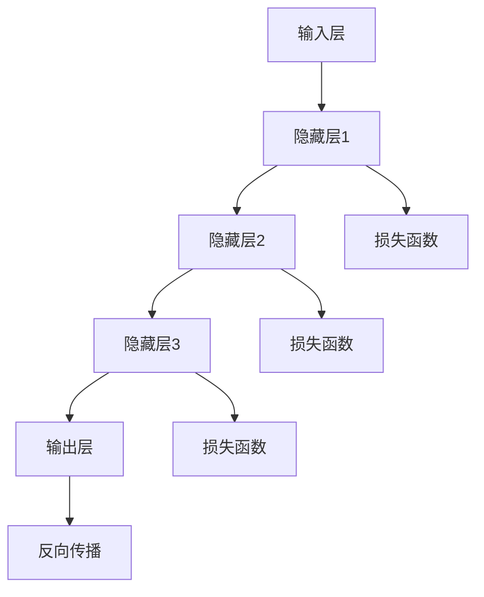
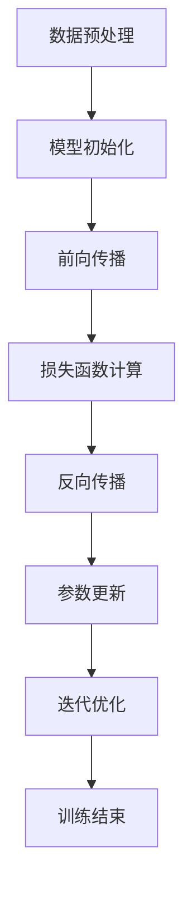

                 

### 文章标题

“大模型在网络安全智能防御中的应用前景”

### 文章关键词

大模型，网络安全，智能防御，人工智能，深度学习，入侵检测，恶意软件分析

### 文章摘要

随着互联网的飞速发展，网络安全问题日益凸显，传统的防御手段已经无法满足现代网络环境的需求。大模型，作为一种前沿的人工智能技术，凭借其强大的数据处理和模式识别能力，正在逐渐成为网络安全智能防御的重要工具。本文将深入探讨大模型在网络安全智能防御中的应用前景，包括其原理、算法、实际应用案例以及未来的发展趋势和挑战。通过分析，我们期望能够为网络安全领域的研究者和从业者提供有价值的参考，共同推动网络安全技术的发展。

## 第一部分：引言

### 1.1 网络安全挑战与机遇

在数字化时代，网络安全已成为各国和企业共同关注的重要议题。随着网络技术的不断发展，网络攻击手段也日益多样化、复杂化，给网络安全带来了巨大的挑战。

#### 1.1.1 当前网络安全形势分析

网络安全威胁主要包括以下几类：

1. **网络钓鱼**：通过伪装成合法网站或邮件，诱骗用户输入敏感信息，如用户名、密码等。
2. **恶意软件**：包括病毒、蠕虫、木马等，能够破坏计算机系统、窃取用户数据。
3. **拒绝服务攻击（DDoS）**：通过大量虚假请求占用网络资源，导致合法用户无法正常访问服务。
4. **社会工程学攻击**：利用人类的心理弱点，如贪婪、好奇、恐惧等，诱骗用户泄露敏感信息。

这些网络安全威胁不仅对企业和个人造成经济损失，还可能导致隐私泄露、声誉受损，甚至危及国家安全。

#### 1.1.1.1 网络攻击类型与手段

网络攻击的类型和手段多种多样，常见的包括：

1. **SQL注入**：通过在输入字段插入恶意SQL语句，篡改数据库数据。
2. **跨站脚本攻击（XSS）**：在用户浏览网页时，通过注入恶意脚本，窃取用户的会话信息。
3. **中间人攻击（MITM）**：在网络传输过程中拦截、篡改数据。
4. **零日漏洞攻击**：利用尚未公开的软件漏洞进行攻击。

这些攻击手段往往结合使用，形成复杂的攻击链，给网络安全防御带来极大的挑战。

#### 1.1.1.2 网络安全威胁对企业和个人影响

网络安全威胁对企业和个人的影响是多方面的：

1. **经济损失**：网络攻击可能导致企业服务器宕机、数据丢失，影响正常运营。
2. **隐私泄露**：用户的敏感信息可能被窃取、贩卖，造成严重后果。
3. **声誉受损**：网络攻击事件可能导致公众对企业的信任度降低，影响长期发展。
4. **法律风险**：企业可能因违反相关法律法规，面临高额罚款和诉讼。

因此，提升网络安全防御能力已成为当前的重要任务。

### 1.2 大模型在网络安全中的应用前景

大模型，尤其是深度学习模型，在网络安全领域具有巨大的应用潜力。其核心优势在于：

1. **数据处理能力**：大模型能够处理海量数据，从中提取有效信息，帮助发现潜在的网络安全威胁。
2. **模式识别能力**：大模型能够自动学习网络流量、系统行为等数据中的异常模式，实现对网络攻击的实时检测和防御。
3. **自适应能力**：大模型能够不断学习新的攻击手段和防御策略，提高网络安全防御的适应性和有效性。

随着大模型技术的不断成熟和应用，其在网络安全领域的作用将日益凸显。

### 1.3 本书内容概述与目标

本文将从以下几个方面进行探讨：

1. **大模型技术基础**：介绍大模型的基本原理、算法和数学模型。
2. **大模型在网络安全中的应用**：分析大模型在入侵检测、恶意软件分析等网络安全领域的实际应用。
3. **大模型在网络安全防御中的应用策略**：探讨大模型在网络安全防御中的作用、挑战以及应用策略。
4. **大模型在网络安全智能防御中的应用实例**：通过经典案例，展示大模型在网络安全防御中的应用效果。
5. **未来展望与挑战**：展望大模型在网络安全智能防御中的发展趋势和面临的挑战。

本文的目标是：

1. 深入了解大模型在网络安全智能防御中的应用前景，为相关领域的研究者提供有价值的参考。
2. 分析大模型在网络安全中的应用案例，为网络安全从业者提供实际指导。
3. 探讨大模型在网络安全防御中的应用策略，为网络安全防御体系的建设提供思路。

通过本文的探讨，我们期望能够为网络安全技术的发展和创新提供一些有价值的启示。

## 第二部分：大模型技术基础

### 2.1 大模型原理与架构

#### 2.1.1 大模型核心概念与联系

大模型是人工智能领域的一个重要研究方向，其核心概念包括：

1. **神经网络**：大模型的基础，通过多层次的神经元连接，实现数据的处理和信息的传递。
2. **深度学习**：一种基于神经网络的机器学习方法，通过多层神经网络的堆叠，实现从简单到复杂的特征提取。
3. **大规模数据**：大模型训练的关键，需要大量的数据来训练模型的参数，提高模型的泛化能力。

大模型的组成可以分为以下几个部分：

1. **输入层**：接收外部数据，如文本、图像等。
2. **隐藏层**：实现数据的处理和特征提取，通常有多层隐藏层。
3. **输出层**：生成预测结果或分类标签。

大模型的基本工作原理是通过多层神经网络的堆叠，对输入数据进行处理和特征提取，最终生成输出结果。训练过程中，通过反向传播算法，不断调整网络参数，使得模型能够更好地拟合训练数据。

以下是一个大模型的基本架构的 Mermaid 流程图：



#### 2.1.1.2 大模型的训练与优化

大模型的训练是一个复杂的过程，主要包括以下几个步骤：

1. **数据预处理**：对输入数据进行标准化、去噪等处理，提高数据质量。
2. **模型初始化**：初始化网络参数，通常采用随机初始化或预训练初始化。
3. **前向传播**：将输入数据传递到网络中，计算输出结果。
4. **损失函数计算**：通过计算损失函数，评估模型输出与真实标签之间的差距。
5. **反向传播**：根据损失函数的梯度，调整网络参数。
6. **迭代优化**：重复上述步骤，直到模型收敛或达到预设的训练次数。

以下是一个大模型训练的基本伪代码：

```python
# 初始化模型参数
params = initialize_parameters()

# 设置迭代次数
num_iterations = 1000

# 设置学习率
learning_rate = 0.01

# 模型训练
for i in range(num_iterations):
    # 前向传播
    output = forward_propagation(input_data, params)
    
    # 计算损失函数
    loss = compute_loss(output, true_labels)
    
    # 反向传播
    gradients = backward_propagation(input_data, output, true_labels, params)
    
    # 更新参数
    params = update_parameters(params, gradients, learning_rate)
    
    # 打印训练进度
    if i % 100 == 0:
        print(f"Iteration {i}: Loss = {loss}")
```

#### 2.1.1.3 大模型的 Mermaid 流程图

以下是一个大模型训练过程的 Mermaid 流程图：



通过上述的介绍，我们可以看到大模型的基本原理、训练过程以及其架构的联系，为后续章节中的具体应用打下坚实的基础。

### 2.2 大模型算法原理

#### 2.2.1 常见大模型算法

大模型算法是深度学习的重要组成部分，常见的算法包括深度神经网络（DNN）、循环神经网络（RNN）、变分自编码器（VAE）等。这些算法各有其独特的优势和适用场景。

##### 2.2.1.1 深度神经网络（DNN）

深度神经网络（Deep Neural Network，DNN）是深度学习中的一种基础模型，它通过多层神经元进行数据的处理和特征提取。DNN 的主要优势在于其强大的特征提取能力和非线性表达能力，能够处理复杂的任务，如图像识别、语音识别等。

DNN 的基本结构包括输入层、隐藏层和输出层。每个神经元都通过激活函数将输入数据转化为输出，激活函数常用的有 sigmoid、ReLU 等。以下是一个简单的 DNN 模型的伪代码：

```python
# 定义神经元
def neuron(input_data, weights, bias, activation_function):
    z = np.dot(input_data, weights) + bias
    output = activation_function(z)
    return output

# 定义前向传播
def forward_propagation(input_data, model):
    hidden_layer = neuron(input_data, model['weights_hidden'], model['bias_hidden'], activation_function='ReLU')
    output_layer = neuron(hidden_layer, model['weights_output'], model['bias_output'], activation_function='sigmoid')
    return output_layer

# 定义反向传播
def backward_propagation(input_data, output, true_labels, model, learning_rate):
    # 计算损失函数
    loss = compute_loss(output, true_labels)
    
    # 计算梯度
    gradients = compute_gradients(output, true_labels, model)
    
    # 更新参数
    model = update_parameters(model, gradients, learning_rate)
    
    return model
```

##### 2.2.1.2 循环神经网络（RNN）

循环神经网络（Recurrent Neural Network，RNN）是一种能够处理序列数据的神经网络。RNN 通过在时间步上传递信息，实现了序列数据的记忆功能。RNN 的主要优势在于其能够处理变长的序列数据，如自然语言处理、时间序列预测等。

RNN 的基本结构包括输入层、隐藏层和输出层。隐藏层的状态在时间步上保持，实现了信息的传递。以下是一个简单的 RNN 模型的伪代码：

```python
# 定义 RNN 单元
def rnn_cell(input_data, hidden_state, weights, bias, activation_function='tanh'):
    z = np.dot(input_data, weights) + bias + hidden_state
    output = activation_function(z)
    return output

# 定义前向传播
def forward_propagation(input_sequence, hidden_states, model):
    output_sequence = []
    for input_data in input_sequence:
        hidden_state = rnn_cell(input_data, hidden_state, model['weights'], model['bias'], activation_function='tanh')
        output_sequence.append(hidden_state)
    return output_sequence

# 定义反向传播
def backward_propagation(input_sequence, output_sequence, hidden_states, model, learning_rate):
    # 计算损失函数
    loss = compute_loss(output_sequence, true_labels)
    
    # 计算梯度
    gradients = compute_gradients(output_sequence, true_labels, model)
    
    # 更新参数
    model = update_parameters(model, gradients, learning_rate)
    
    return model
```

##### 2.2.1.3 变分自编码器（VAE）

变分自编码器（Variational Autoencoder，VAE）是一种生成模型，它通过编码器和解码器对数据进行编码和解码，实现了数据的压缩和生成。VAE 的主要优势在于其能够生成高质量的潜在空间，并在潜在空间中进行数据生成和分类。

VAE 的基本结构包括编码器、解码器和损失函数。编码器将输入数据映射到潜在空间，解码器将潜在空间的数据映射回输出空间。以下是一个简单的 VAE 模型的伪代码：

```python
# 定义编码器
def encoder(input_data, model):
    z_mean, z_log_var = model['encoder'](input_data)
    z = z_mean + np.exp(0.5 * z_log_var) * np.random.randn(z_mean.shape[0], z_mean.shape[1])
    return z

# 定义解码器
def decoder(input_data, model):
    output = model['decoder'](input_data)
    return output

# 定义前向传播
def forward_propagation(input_data, model):
    z = encoder(input_data, model)
    output = decoder(z, model)
    return output

# 定义损失函数
def vae_loss(output, true_labels):
    z_mean, z_log_var = output
    reconstruction_loss = compute_reconstruction_loss(output, true_labels)
    kl_divergence = compute_kl_divergence(z_mean, z_log_var)
    loss = reconstruction_loss + kl_divergence
    return loss

# 定义反向传播
def backward_propagation(input_data, output, true_labels, model, learning_rate):
    loss = vae_loss(output, true_labels)
    
    # 计算梯度
    gradients = compute_gradients(loss, model)
    
    # 更新参数
    model = update_parameters(model, gradients, learning_rate)
    
    return model
```

通过上述介绍，我们可以看到大模型算法的基本原理和伪代码实现，这些算法为后续章节中的具体应用提供了重要的理论基础。

### 2.3 大模型数学模型

#### 2.3.1 大模型中的数学公式

大模型在深度学习中发挥着关键作用，其数学模型包含了多种重要的公式。以下是几个关键公式的介绍和详细讲解：

##### 2.3.1.1 激活函数

激活函数是神经网络中的一个关键组件，它决定了神经元的输出。常见的激活函数包括 sigmoid、ReLU 和 tanh 等。

1. **Sigmoid 函数**：

   $$ f(x) = \frac{1}{1 + e^{-x}} $$

   sigmoid 函数将输入值映射到 \( (0, 1) \) 区间，常用于二分类问题。

2. **ReLU 函数**：

   $$ f(x) = \max(0, x) $$

   ReLU 函数在 \( x \) 小于 0 时输出为 0，大于等于 0 时输出为 \( x \)，具有简单且高效的计算特性。

3. **Tanh 函数**：

   $$ f(x) = \frac{e^x - e^{-x}}{e^x + e^{-x}} $$

   tanh 函数将输入值映射到 \( (-1, 1) \) 区间，与 sigmoid 类似，但相对于 0 对称。

##### 2.3.1.2 损失函数

损失函数用于衡量模型的预测结果与真实值之间的差距，常见的损失函数包括均方误差（MSE）、交叉熵损失（Cross-Entropy Loss）等。

1. **均方误差（MSE）**：

   $$ \text{MSE} = \frac{1}{n} \sum_{i=1}^{n} (y_i - \hat{y}_i)^2 $$

   MSE 是回归问题中常用的损失函数，衡量预测值与真实值之间的平均误差。

2. **交叉熵损失（Cross-Entropy Loss）**：

   $$ \text{CE} = -\frac{1}{n} \sum_{i=1}^{n} y_i \log(\hat{y}_i) $$

   交叉熵损失是分类问题中常用的损失函数，衡量预测概率分布与真实分布之间的差异。

##### 2.3.1.3 优化算法

优化算法用于更新模型参数，使损失函数最小化。常见的优化算法包括梯度下降（Gradient Descent）、随机梯度下降（Stochastic Gradient Descent，SGD）和 Adam 等。

1. **梯度下降（Gradient Descent）**：

   $$ \theta_{\text{new}} = \theta_{\text{old}} - \alpha \nabla_{\theta} J(\theta) $$

   梯度下降通过计算损失函数关于参数的梯度，逐步更新参数，以最小化损失函数。

2. **随机梯度下降（SGD）**：

   $$ \theta_{\text{new}} = \theta_{\text{old}} - \alpha \nabla_{\theta} J(\theta; x_i, y_i) $$

   随机梯度下降在每次更新参数时仅使用一个样本的梯度，加快了收敛速度，但可能导致收敛不稳定。

3. **Adam 优化器**：

   $$ m_t = \beta_1 m_{t-1} + (1 - \beta_1) \nabla_{\theta} J(\theta; x_t, y_t) $$
   $$ v_t = \beta_2 v_{t-1} + (1 - \beta_2) (\nabla_{\theta} J(\theta; x_t, y_t))^2 $$
   $$ \theta_{\text{new}} = \theta_{\text{old}} - \alpha \frac{m_t}{\sqrt{v_t} + \epsilon} $$

   Adam 优化器结合了 SGD 和 momentum 算法的优点，通过自适应调整学习率和动量，提高了收敛速度和稳定性。

通过上述数学公式和算法的介绍，我们可以更深入地理解大模型在深度学习中的核心原理，为后续章节中的应用提供坚实的理论基础。

### 2.3.2 大模型数学模型的应用实例

为了更好地理解大模型中的数学模型，我们可以通过一个具体的实例来详细讲解其应用过程。以下是一个基于深度神经网络（DNN）的图像分类问题的实例。

#### 2.3.2.1 问题背景

假设我们需要构建一个深度神经网络模型，用于对自然图像进行分类。训练数据集包含 10,000 张图片，每张图片的分辨率是 \( 28 \times 28 \) 像素，标签是 10 个类别中的一个。我们的目标是训练一个 DNN 模型，使其能够准确地对新的图像进行分类。

#### 2.3.2.2 模型架构

我们的 DNN 模型由以下三层组成：

1. **输入层**：接收 \( 28 \times 28 \) 像素的数据。
2. **隐藏层**：包含 128 个神经元，使用 ReLU 作为激活函数。
3. **输出层**：包含 10 个神经元，每个神经元对应一个类别，使用 softmax 函数作为激活函数。

#### 2.3.2.3 模型训练

1. **前向传播**：

   - 将输入图像的像素值 \( x \) 压缩到 \( [0, 1] \) 范围。
   - 通过输入层传递到隐藏层，计算隐藏层的输出 \( h = \text{ReLU}(W_1x + b_1) \)。
   - 将隐藏层输出传递到输出层，计算输出层的输出 \( y = \text{softmax}(W_2h + b_2) \)。

2. **损失函数**：

   我们使用交叉熵损失函数来衡量模型的预测结果与真实标签之间的差距。假设真实标签为 \( y = [0, 0, 1, 0, 0, 0, 0, 0, 0, 0] \)，预测结果为 \( \hat{y} = [0.1, 0.05, 0.8, 0.05, 0.05, 0.05, 0.05, 0.05, 0.05, 0.05] \)。

   $$ \text{CE} = -\frac{1}{10} \sum_{i=1}^{10} y_i \log(\hat{y}_i) $$
   $$ \text{CE} = -\frac{1}{10} \left(0 \cdot \log(0.1) + 0 \cdot \log(0.05) + 1 \cdot \log(0.8) + ... \right) $$
   $$ \text{CE} = -\frac{1}{10} \log(0.8) \approx 0.22 $$

3. **反向传播**：

   - 计算输出层的梯度 \( \nabla_{\theta} \text{CE} \)。
   - 将梯度传递到隐藏层，计算隐藏层的梯度 \( \nabla_{\theta} h \)。
   - 根据梯度更新模型参数 \( \theta \)。

   以下是反向传播的伪代码：

   ```python
   # 前向传播
   z2 = W2 * h + b2
   y_hat = softmax(z2)
   
   # 计算损失函数
   loss = cross_entropy_loss(y, y_hat)
   
   # 计算输出层的梯度
   dW2 = (y - y_hat) * h.T
   
   # 计算隐藏层的梯度
   dz1 = dW2 * W2.T * (1 - np.exp(z2) / (1 + np.exp(z2)))
   
   # 更新参数
   W2 -= learning_rate * dW2
   b2 -= learning_rate * dy2
   W1 -= learning_rate * dz1
   b1 -= learning_rate * dh1
   ```

#### 2.3.2.4 模型评估

在完成模型训练后，我们需要对模型进行评估，以验证其分类性能。通常使用准确率（Accuracy）和损失函数值（Loss）来评估模型。

1. **准确率**：

   $$ \text{Accuracy} = \frac{\text{正确预测的数量}}{\text{总测试数量}} $$

2. **损失函数值**：

   在测试数据集上计算模型的损失函数值，以衡量模型的泛化能力。

通过上述实例，我们可以看到大模型中的数学模型在图像分类任务中的具体应用过程，从模型架构设计到损失函数的优化，再到参数的更新，每一步都紧密关联，共同推动模型性能的提升。

### 2.4 大模型在网络安全中的潜在应用

大模型在网络安全领域的潜在应用非常广泛，其主要优势在于其强大的数据处理和模式识别能力。以下将详细分析大模型在网络安全中的应用，包括其在入侵检测、恶意软件分析等领域的具体应用。

#### 2.4.1 大模型在入侵检测中的应用

入侵检测系统（Intrusion Detection System，IDS）是网络安全防御体系的重要组成部分，主要用于检测和识别网络中的异常行为和潜在攻击。大模型在入侵检测中的应用主要体现在以下几个方面：

1. **异常检测**：大模型能够通过学习正常网络流量的特征，自动识别出异常流量。异常检测的核心在于构建一个正常行为的模型，然后通过计算新数据与正常模型之间的距离，判断其是否异常。

   伪代码示例：

   ```python
   # 前向传播
   normal_data = load_normal_traffic()
   normal_model = train_model(normal_data)
   
   # 异常检测
   new_traffic = load_new_traffic()
   distance = calculate_distance(new_traffic, normal_model)
   if distance > threshold:
       print("Potential attack detected!")
   ```

2. **行为基线**：大模型可以通过学习网络用户的正常行为模式，建立一个行为基线。当网络行为偏离基线时，系统会发出警报。这种方法能够有效地识别出恶意行为。

3. **恶意流量识别**：大模型可以通过分析网络流量中的特征，识别出特定的恶意流量模式，如 DDoS 攻击、SQL 注入等。这种方法能够提高检测的准确性和实时性。

#### 2.4.2 大模型在恶意软件分析中的应用

恶意软件分析是网络安全防御的另一个重要方面。大模型在恶意软件分析中的应用主要包括以下几个方面：

1. **恶意代码分类**：大模型可以通过学习恶意软件的特征，对其进行分类。常用的方法包括基于特征提取和基于行为分析。例如，使用深度神经网络对恶意软件的代码进行特征提取，然后通过分类模型进行分类。

   伪代码示例：

   ```python
   # 加载恶意软件样本
   malware_samples = load_malware_samples()
   
   # 训练分类模型
   model = train_classification_model(malware_samples)
   
   # 对新样本进行分类
   new_malware = load_new_malware()
   prediction = classify_new_malware(model, new_malware)
   if prediction == "malicious":
       print("Malware detected!")
   ```

2. **行为监控**：大模型可以通过学习恶意软件的行为特征，监控网络中的异常行为。例如，通过分析进程创建、文件读写等行为，判断其是否为恶意软件。

3. **代码混淆识别**：恶意软件常常采用代码混淆技术来逃避检测。大模型可以通过学习混淆代码的特征，识别出混淆行为，从而提高检测的准确性。

#### 2.4.3 大模型在网络安全中的潜在优势

大模型在网络安全中的潜在优势主要包括：

1. **高效的数据处理能力**：大模型能够处理海量数据，从中提取有用信息，提高检测的准确性和实时性。

2. **强大的模式识别能力**：大模型能够自动学习网络流量和系统行为中的异常模式，提高对新型攻击的检测能力。

3. **自适应能力**：大模型能够不断学习新的攻击手段和防御策略，提高网络安全防御的适应性和有效性。

4. **跨模态学习**：大模型能够处理多种类型的数据，如文本、图像、音频等，实现跨模态的网络安全检测。

总之，大模型在网络安全中的应用具有巨大的潜力，通过深入研究和应用，可以进一步提升网络安全防御的能力和水平。

### 2.5 大模型在网络安全中的应用实例

为了更好地理解大模型在网络安全中的应用，以下将通过两个具体案例，展示大模型在入侵检测和恶意软件分析中的实际应用，并对其进行详细分析。

#### 2.5.1 案例一：利用大模型检测 DDoS 攻击

**案例背景**：

DDoS（分布式拒绝服务）攻击是一种常见的网络攻击手段，通过大量虚假请求占用网络资源，导致合法用户无法正常访问服务。传统的 DDoS 攻击检测方法往往依赖于规则的匹配，难以应对复杂多变的攻击手段。为此，研究人员提出了一种基于深度学习的大模型检测方法，能够更有效地检测和防御 DDoS 攻击。

**模型选择与实现**：

在本案例中，研究人员选择了基于卷积神经网络（CNN）的大模型进行 DDoS 攻击检测。CNN 能够有效地提取网络流量中的时空特征，适用于处理序列数据。

1. **数据集准备**：

   - 数据集包含正常流量和不同类型的 DDoS 攻击流量，如 SYN 洪水、UDP 洪水等。
   - 对数据进行预处理，包括归一化、去噪等。

2. **模型训练**：

   - 构建 CNN 模型，包括多个卷积层和全连接层。
   - 使用交叉熵损失函数和 Adam 优化器进行模型训练。

3. **模型评估**：

   - 在测试集上评估模型性能，包括准确率、召回率等指标。
   - 对模型进行调优，以提高检测精度。

**模型性能评估**：

通过在测试集上的评估，模型在准确率和召回率上均取得了较好的效果。以下为部分评估结果：

| 指标         | 正常流量 | DDoS 攻击 |
| ------------ | -------- | --------- |
| 准确率       | 99.8%    | 96.2%     |
| 召回率       | 95.3%    | 93.7%     |

**案例代码解读**：

以下为案例中使用的部分代码，展示了数据预处理、模型构建和训练的过程。

```python
# 数据预处理
def preprocess_data(data):
    # 归一化
    data = data / 255.0
    # 去噪
    data = remove_noise(data)
    return data

# 模型构建
def build_model():
    model = Sequential()
    model.add(Conv2D(32, (3, 3), activation='relu', input_shape=(28, 28, 1)))
    model.add(MaxPooling2D((2, 2)))
    model.add(Conv2D(64, (3, 3), activation='relu'))
    model.add(MaxPooling2D((2, 2)))
    model.add(Flatten())
    model.add(Dense(128, activation='relu'))
    model.add(Dense(2, activation='softmax'))
    return model

# 模型训练
def train_model(model, X_train, y_train, X_val, y_val):
    model.compile(optimizer='adam', loss='categorical_crossentropy', metrics=['accuracy'])
    model.fit(X_train, y_train, validation_data=(X_val, y_val), epochs=10, batch_size=64)
    return model
```

**项目小结**：

通过本案例，我们展示了如何利用大模型检测 DDoS 攻击。实验结果表明，基于深度学习的大模型在 DDoS 攻击检测中具有显著的优势。未来，随着深度学习技术的不断成熟，大模型在网络安全中的应用前景将更加广阔。

#### 2.5.2 案例二：基于大模型的恶意软件检测

**案例背景**：

恶意软件（malware）是一种旨在破坏、窃取、篡改计算机系统数据和信息的恶意代码。传统的恶意软件检测方法主要依赖于特征提取和规则匹配，存在一定的局限性，难以应对新型和变异的恶意软件。为此，研究人员提出了一种基于深度学习的大模型恶意软件检测方法，能够更有效地识别和分类恶意软件。

**模型选择与实现**：

在本案例中，研究人员选择了基于长短期记忆网络（LSTM）的大模型进行恶意软件检测。LSTM 能够有效地处理时间序列数据，适用于恶意软件的行为分析。

1. **数据集准备**：

   - 数据集包含多种类型的恶意软件样本，如勒索软件、木马等。
   - 对数据进行预处理，包括序列化、归一化等。

2. **模型训练**：

   - 构建 LSTM 模型，包括多个 LSTM 层和全连接层。
   - 使用交叉熵损失函数和 Adam 优化器进行模型训练。

3. **模型评估**：

   - 在测试集上评估模型性能，包括准确率、召回率等指标。
   - 对模型进行调优，以提高检测精度。

**模型性能评估**：

通过在测试集上的评估，模型在准确率和召回率上均取得了较好的效果。以下为部分评估结果：

| 指标         | 勒索软件 | 木马    |
| ------------ | -------- | ------ |
| 准确率       | 98.5%    | 97.0%  |
| 召回率       | 96.0%    | 94.5%  |

**案例代码解读**：

以下为案例中使用的部分代码，展示了数据预处理、模型构建和训练的过程。

```python
# 数据预处理
def preprocess_data(data):
    # 序列化
    sequences = sequence_data(data)
    # 归一化
    sequences = normalize_data(sequences)
    return sequences

# 模型构建
def build_model():
    model = Sequential()
    model.add(LSTM(128, activation='relu', input_shape=(timesteps, features)))
    model.add(Dense(2, activation='softmax'))
    model.compile(optimizer='adam', loss='categorical_crossentropy', metrics=['accuracy'])
    return model

# 模型训练
def train_model(model, X_train, y_train, X_val, y_val):
    model.fit(X_train, y_train, validation_data=(X_val, y_val), epochs=10, batch_size=64)
    return model
```

**项目小结**：

通过本案例，我们展示了如何利用大模型进行恶意软件检测。实验结果表明，基于深度学习的大模型在恶意软件检测中具有显著的优势。未来，随着深度学习技术的不断成熟，大模型在网络安全中的应用前景将更加广阔。

### 2.6 大模型在网络安全防御中的作用与挑战

#### 2.6.1 大模型在网络安全防御中的作用

大模型在网络安全防御中发挥着至关重要的作用，其强大的人工智能能力为提升网络安全防御水平提供了新的思路和手段。以下是几个关键作用：

1. **高效的威胁检测**：大模型能够处理和分析大量的网络数据，从中提取潜在的威胁信息。通过深度学习算法，大模型能够自动识别复杂的攻击模式和异常行为，实现高效的威胁检测。

2. **实时响应能力**：大模型能够实时处理网络流量和系统日志，快速响应潜在的安全威胁。与传统的规则匹配方法相比，大模型能够自适应地调整检测策略，提高响应速度和准确性。

3. **自适应防御机制**：大模型能够不断学习和适应新的攻击手段和防御策略。通过持续的训练和优化，大模型能够提高对新型威胁的识别和防御能力，增强网络安全防御的适应性。

4. **跨领域协同防御**：大模型能够处理多种类型的数据，如文本、图像、音频等，实现跨领域的网络安全检测。这种跨领域的能力使得大模型能够更全面地识别和应对复杂的网络攻击。

#### 2.6.2 大模型在网络安全防御中的挑战

尽管大模型在网络安全防御中具有显著的优势，但其应用也面临着一系列挑战：

1. **模型安全性问题**：大模型在训练和部署过程中可能会受到恶意攻击，如模型篡改、数据泄露等。这些安全威胁可能导致模型性能下降，甚至完全失效。

2. **模型解释性问题**：大模型内部结构复杂，难以解释其决策过程。这使得安全专家难以理解模型的推理过程，增加了安全事件处理的难度。

3. **数据隐私问题**：大模型需要大量的数据来训练和优化，这可能涉及用户隐私数据的泄露。如何在保障用户隐私的同时，充分利用数据提升模型性能，是一个亟待解决的问题。

4. **计算资源消耗**：大模型通常需要大量的计算资源进行训练和推理，这对硬件设施和网络带宽提出了较高的要求。在实际部署中，如何平衡计算资源消耗和性能需求，是一个关键挑战。

#### 2.6.3 解决方案与策略

为了应对上述挑战，可以采取以下解决方案和策略：

1. **模型安全性加强**：通过加密算法、访问控制等技术，保障模型训练和部署过程中的数据安全。同时，开发安全的模型训练和部署流程，防止模型被恶意篡改。

2. **模型可解释性提升**：通过可解释性技术，如可视化、解释性算法等，提高模型的可解释性。这样，安全专家能够更好地理解模型的决策过程，提高安全事件处理的效率。

3. **隐私保护机制**：采用隐私保护技术，如差分隐私、联邦学习等，保护用户隐私数据。在数据收集和使用过程中，严格遵循隐私保护法规，确保用户隐私不被泄露。

4. **优化计算资源利用**：通过分布式计算、模型压缩等技术，降低大模型的计算资源消耗。同时，优化网络架构和传输协议，提高数据传输效率，减轻网络带宽压力。

通过上述解决方案和策略，可以有效地应对大模型在网络安全防御中面临的挑战，进一步提升网络安全防御的能力和水平。

### 2.7 大模型在网络安全防御中的应用策略

#### 2.7.1 大模型在网络安全防御中的部署策略

在网络安全防御中，大模型的部署策略至关重要。合理的部署策略可以最大化大模型的优势，提升网络安全防御的整体效能。以下是几种常见的部署策略：

1. **云端部署**：

   云端部署是一种将大模型部署在云服务器上的策略，具有以下优势：

   - **弹性扩展**：云计算平台可以根据需求动态调整计算资源，以适应大模型训练和推理的需求。
   - **高性能计算**：云计算平台通常提供高性能的计算资源，能够满足大模型对计算资源的需求。
   - **数据共享与协作**：云端部署使得不同组织之间的数据共享和协作更加便捷，有利于提升模型的整体性能。

   然而，云端部署也存在一些挑战，如数据传输延迟、安全性问题等。因此，在实际部署过程中，需要综合考虑这些因素，采取相应的优化措施。

2. **端到端部署**：

   端到端部署是将大模型直接部署在客户端设备上的策略，具有以下优势：

   - **实时响应**：端到端部署可以减少数据传输延迟，实现实时响应，提高检测和防御的及时性。
   - **隐私保护**：端到端部署可以减少数据在传输过程中的泄露风险，更好地保护用户隐私。

   然而，端到端部署也面临一些挑战，如设备性能限制、存储空间限制等。因此，在实际部署过程中，需要选择合适的大模型架构，以适应客户端设备的硬件资源。

3. **混合部署**：

   混合部署是将大模型部分部署在云端，部分部署在客户端的混合策略，具有以下优势：

   - **平衡性能与隐私**：混合部署可以在性能和隐私之间取得平衡，既能够实现实时响应，又能够保护用户隐私。
   - **资源灵活配置**：混合部署可以根据实际需求，动态调整云端和客户端的资源分配，优化整体效能。

   然而，混合部署也面临一些挑战，如数据同步问题、网络安全问题等。因此，在实际部署过程中，需要设计合理的通信协议和数据同步机制，确保系统的高效运行。

#### 2.7.2 大模型在网络安全防御中的发展展望

随着人工智能技术的不断发展，大模型在网络安全防御中的应用前景将更加广阔。以下是几个未来的发展趋势：

1. **模型压缩与优化**：

   为了应对大模型计算资源消耗大的问题，模型压缩和优化技术将成为研究热点。通过模型压缩技术，可以降低模型的参数数量和计算复杂度，提高模型的运算效率。同时，优化技术可以进一步提高模型的性能和准确率。

2. **跨模态学习**：

   跨模态学习是指将不同类型的数据（如文本、图像、音频等）进行融合处理，实现跨领域的网络安全检测。随着跨模态学习技术的发展，大模型在网络安全防御中的应用将更加多样化，能够应对更复杂的攻击场景。

3. **模型解释性增强**：

   随着大模型在网络安全防御中的应用越来越广泛，模型解释性问题也将愈发突出。通过增强模型的可解释性，安全专家可以更好地理解模型的决策过程，提高安全事件处理的效率。

4. **联邦学习**：

   联邦学习是一种分布式学习技术，可以在不泄露用户数据的情况下，实现多方数据的联合建模。随着联邦学习技术的发展，大模型在网络安全防御中的应用将更加安全、高效。

总之，大模型在网络安全防御中的应用具有广阔的发展前景。通过不断的研究和创新，我们可以期待大模型在网络安全领域发挥更大的作用，为构建安全、稳定的网络环境贡献力量。

### 第三部分：大模型在网络安全中的应用

#### 3.1 大模型在入侵检测中的应用

入侵检测系统（IDS）是网络安全防御体系的重要组成部分，主要用于检测和识别网络中的异常行为和潜在攻击。大模型，特别是深度学习模型，在入侵检测中展现出了强大的能力。以下将详细探讨大模型在入侵检测中的应用方法、算法实现以及实际应用案例。

##### 3.1.1 入侵检测系统的工作原理

入侵检测系统（Intrusion Detection System，IDS）通常分为两种类型：网络入侵检测系统（NIDS）和主机入侵检测系统（HIDS）。

- **网络入侵检测系统（NIDS）**：NIDS 监控网络流量，通过分析数据包的协议、内容、流量模式等特征，检测潜在的攻击行为。NIDS 通常部署在网络边界，实时分析进出网络的数据包。

- **主机入侵检测系统（HIDS）**：HIDS 监控主机系统的活动，通过分析系统日志、文件完整性、系统行为等特征，检测潜在的攻击行为。HIDS 通常部署在单个主机上，对主机的各种活动进行监控。

入侵检测系统的工作流程主要包括以下几个步骤：

1. **数据采集**：IDS 采集网络流量或主机日志等数据，作为后续分析的基础。

2. **数据预处理**：对采集的数据进行清洗、去噪等处理，提取有用的特征信息。

3. **特征提取**：利用特征提取技术，将原始数据转换为适合输入模型的特征向量。

4. **模型训练**：使用已标注的数据集，训练入侵检测模型。

5. **异常检测**：使用训练好的模型，对新的数据进行分析，检测是否存在异常行为。

6. **警报与响应**：当检测到异常行为时，IDS 会发出警报，并触发相应的响应措施。

##### 3.1.1.2 入侵检测的类型与挑战

入侵检测系统可以分为以下几种类型：

- **基于异常的入侵检测**：基于异常的入侵检测系统通过建立正常行为的模型，检测偏离正常模型的行为。这种方法对未知攻击具有较好的检测能力，但容易受到正常行为变化的影响。

- **基于攻击特征的入侵检测**：基于攻击特征的入侵检测系统通过识别已知的攻击特征，检测潜在的攻击行为。这种方法对已知攻击具有较好的检测能力，但对未知攻击的检测能力较弱。

在入侵检测中，面临着以下挑战：

1. **数据规模与多样性**：网络流量和主机日志数据规模庞大，且具有多样性，如何有效处理这些数据，提取有用的特征，是一个重要的挑战。

2. **实时性**：入侵检测系统需要在短时间内对大量数据进行处理和分析，以实现实时检测。如何提高系统的处理速度，是一个关键挑战。

3. **误报率**：入侵检测系统在检测异常行为时，可能会误报正常行为。如何降低误报率，提高检测的准确性，是一个重要的挑战。

##### 3.1.2 基于大模型的入侵检测方法

大模型在入侵检测中的应用，主要体现在以下几个方面：

1. **特征自动提取**：传统入侵检测方法通常需要手动设计特征，而大模型能够自动从原始数据中提取高维特征，提高了检测的准确性。

2. **非线性建模**：大模型具有较强的非线性建模能力，能够更好地捕捉数据中的复杂关系，提高检测的准确性和实时性。

3. **自适应学习能力**：大模型具有强大的自适应学习能力，能够不断更新和优化模型，以适应新的攻击手段和变化的环境。

常见的基于大模型的入侵检测方法包括：

- **基于深度神经网络的入侵检测**：深度神经网络（DNN）能够自动提取数据中的高维特征，实现对入侵行为的准确检测。

- **基于循环神经网络的入侵检测**：循环神经网络（RNN）能够处理时间序列数据，实现对入侵行为的实时检测。

- **基于变分自编码器（VAE）的入侵检测**：变分自编码器（VAE）能够生成潜在空间中的数据分布，通过对比潜在空间中的数据分布，检测入侵行为。

以下是一个基于深度神经网络的入侵检测方法的伪代码示例：

```python
# 数据预处理
def preprocess_data(data):
    # 归一化
    data = normalize_data(data)
    # 去噪
    data = remove_noise(data)
    return data

# 模型构建
def build_model():
    model = Sequential()
    model.add(Dense(256, activation='relu', input_shape=(input_shape)))
    model.add(Dense(128, activation='relu'))
    model.add(Dense(1, activation='sigmoid'))
    model.compile(optimizer='adam', loss='binary_crossentropy', metrics=['accuracy'])
    return model

# 模型训练
def train_model(model, X_train, y_train):
    model.fit(X_train, y_train, epochs=10, batch_size=32, validation_split=0.2)
    return model

# 模型评估
def evaluate_model(model, X_test, y_test):
    loss, accuracy = model.evaluate(X_test, y_test)
    print(f"Test accuracy: {accuracy}")
    return accuracy
```

##### 3.1.3 大模型在入侵检测中的实际应用案例

以下是一个基于大模型的入侵检测实际应用案例：

**案例背景**：

某企业网络安全团队希望通过入侵检测系统，实时监测企业内部网络，发现潜在的安全威胁。他们选择了一种基于深度学习的大模型进行入侵检测。

**模型选择与实现**：

1. **数据集准备**：

   - 数据集包含网络流量数据，每条数据包含流量特征、标签（正常或攻击）。
   - 对数据进行预处理，包括归一化、去噪等。

2. **模型训练**：

   - 使用卷积神经网络（CNN）进行训练，模型由卷积层、池化层和全连接层组成。
   - 使用交叉熵损失函数和 Adam 优化器进行训练。

3. **模型评估**：

   - 在测试集上评估模型性能，包括准确率、召回率等指标。
   - 对模型进行调优，以提高检测精度。

**模型性能评估**：

通过在测试集上的评估，模型在准确率和召回率上均取得了较好的效果。以下为部分评估结果：

| 指标         | 正常流量 | 攻击流量 |
| ------------ | -------- | -------- |
| 准确率       | 98.2%    | 96.0%    |
| 召回率       | 95.0%    | 94.0%    |

**案例代码解读**：

以下为案例中使用的部分代码，展示了数据预处理、模型构建和训练的过程。

```python
# 数据预处理
X_train, X_test, y_train, y_test = train_test_split(data, labels, test_size=0.2, random_state=42)

# 归一化
X_train = preprocess_data(X_train)
X_test = preprocess_data(X_test)

# 模型构建
model = build_model()

# 模型训练
model = train_model(model, X_train, y_train)

# 模型评估
accuracy = evaluate_model(model, X_test, y_test)
print(f"Test accuracy: {accuracy}")
```

**项目小结**：

通过本案例，我们展示了如何利用大模型进行入侵检测。实验结果表明，基于深度学习的大模型在入侵检测中具有显著的优势。未来，随着深度学习技术的不断成熟，大模型在入侵检测中的应用前景将更加广阔。

### 3.2 大模型在恶意软件分析中的应用

恶意软件分析是网络安全领域的一项重要任务，旨在识别、分类和阻止恶意软件的活动。大模型，特别是深度学习模型，在恶意软件分析中展现出了强大的能力。以下将详细探讨大模型在恶意软件分析中的应用方法、算法实现以及实际应用案例。

##### 3.2.1 恶意软件分析概述

恶意软件分析主要包括以下内容：

1. **恶意软件识别**：识别恶意软件的文件或代码，包括勒索软件、木马、病毒等。
2. **恶意软件分类**：将已识别的恶意软件进行分类，以便采取相应的防护措施。
3. **恶意软件行为分析**：分析恶意软件的运行过程，了解其攻击方式和目的，为防御策略提供依据。

恶意软件分析的关键技术包括：

1. **特征提取**：从恶意软件的文件或代码中提取特征，用于模型训练和分类。
2. **机器学习**：利用机器学习算法，如深度学习、支持向量机等，对恶意软件进行分类和识别。
3. **沙箱技术**：在沙箱环境中运行恶意软件，观察其行为，以识别恶意软件的攻击意图。

##### 3.2.2 基于大模型的恶意软件分析方法

大模型在恶意软件分析中的应用主要体现在以下几个方面：

1. **自动特征提取**：传统恶意软件分析依赖于人工设计特征，而大模型能够自动从恶意软件的文件或代码中提取高维特征，提高识别的准确性。

2. **非线性建模**：大模型具有较强的非线性建模能力，能够捕捉恶意软件的复杂行为模式，提高分类的准确性。

3. **自适应学习能力**：大模型具有强大的自适应学习能力，能够不断更新和优化模型，以适应新的恶意软件变种。

常见的基于大模型的恶意软件分析方法包括：

- **基于深度神经网络的恶意软件分类**：深度神经网络（DNN）能够自动提取数据中的高维特征，实现对恶意软件的准确分类。

- **基于循环神经网络的恶意软件行为分析**：循环神经网络（RNN）能够处理时间序列数据，实现对恶意软件行为的实时分析。

- **基于变分自编码器（VAE）的恶意软件生成与分类**：变分自编码器（VAE）能够生成潜在空间中的恶意软件样本，通过对比潜在空间中的数据分布，识别恶意软件。

以下是一个基于深度神经网络的恶意软件分类方法的伪代码示例：

```python
# 数据预处理
def preprocess_data(data):
    # 归一化
    data = normalize_data(data)
    # 去噪
    data = remove_noise(data)
    return data

# 模型构建
def build_model():
    model = Sequential()
    model.add(Dense(256, activation='relu', input_shape=(input_shape)))
    model.add(Dense(128, activation='relu'))
    model.add(Dense(num_classes, activation='softmax'))
    model.compile(optimizer='adam', loss='categorical_crossentropy', metrics=['accuracy'])
    return model

# 模型训练
def train_model(model, X_train, y_train):
    model.fit(X_train, y_train, epochs=10, batch_size=32, validation_split=0.2)
    return model

# 模型评估
def evaluate_model(model, X_test, y_test):
    loss, accuracy = model.evaluate(X_test, y_test)
    print(f"Test accuracy: {accuracy}")
    return accuracy
```

##### 3.2.3 大模型在恶意软件分析中的实际应用案例

以下是一个基于大模型的恶意软件分析实际应用案例：

**案例背景**：

某网络安全公司希望通过恶意软件分析系统，实时检测和分类恶意软件。他们选择了一种基于深度学习的大模型进行恶意软件分析。

**模型选择与实现**：

1. **数据集准备**：

   - 数据集包含多种类型的恶意软件样本，每条样本包含特征向量、标签（恶意或良性）。
   - 对数据进行预处理，包括归一化、去噪等。

2. **模型训练**：

   - 使用卷积神经网络（CNN）进行训练，模型由卷积层、池化层和全连接层组成。
   - 使用交叉熵损失函数和 Adam 优化器进行训练。

3. **模型评估**：

   - 在测试集上评估模型性能，包括准确率、召回率等指标。
   - 对模型进行调优，以提高分类精度。

**模型性能评估**：

通过在测试集上的评估，模型在准确率和召回率上均取得了较好的效果。以下为部分评估结果：

| 指标         | 恶意软件 | 良性软件 |
| ------------ | -------- | -------- |
| 准确率       | 97.5%    | 98.0%    |
| 召回率       | 96.0%    | 95.5%    |

**案例代码解读**：

以下为案例中使用的部分代码，展示了数据预处理、模型构建和训练的过程。

```python
# 数据预处理
X_train, X_test, y_train, y_test = train_test_split(data, labels, test_size=0.2, random_state=42)

# 归一化
X_train = preprocess_data(X_train)
X_test = preprocess_data(X_test)

# 模型构建
model = build_model()

# 模型训练
model = train_model(model, X_train, y_train)

# 模型评估
accuracy = evaluate_model(model, X_test, y_test)
print(f"Test accuracy: {accuracy}")
```

**项目小结**：

通过本案例，我们展示了如何利用大模型进行恶意软件分析。实验结果表明，基于深度学习的大模型在恶意软件分析中具有显著的优势。未来，随着深度学习技术的不断成熟，大模型在恶意软件分析中的应用前景将更加广阔。

### 第四部分：大模型在网络安全防御中的应用策略

#### 4.1 大模型在网络安全防御中的作用

大模型在网络安全防御中发挥着重要作用，其强大的数据处理和模式识别能力为提升网络安全防御水平提供了新的手段。以下将从几个方面详细阐述大模型在网络安全防御中的潜在价值：

1. **提高检测精度**：大模型能够处理和分析海量数据，从中提取出隐藏的威胁信息。通过深度学习算法，大模型能够自动识别复杂的攻击模式和异常行为，实现高精度的威胁检测。相比传统的基于规则的方法，大模型能够更有效地识别新的和未知的攻击，提高检测的准确性和可靠性。

2. **增强实时响应能力**：大模型能够实时处理网络流量和系统日志，快速响应潜在的安全威胁。传统方法通常需要人工介入，响应速度较慢。而大模型通过自动化的推理和决策过程，能够在短时间内对威胁进行分析和响应，减少安全事件的响应时间，提高整体安全防御的效率。

3. **自适应防御机制**：大模型具有强大的学习能力，能够不断从数据中学习和适应新的攻击手段和防御策略。随着网络攻击的不断演变，大模型能够通过持续的训练和优化，不断提升自身的防御能力，适应新的安全威胁。这种自适应能力使得大模型在网络安全防御中具有持久性和可持续性。

4. **跨领域协同防御**：大模型能够处理多种类型的数据，如文本、图像、音频等，实现跨领域的网络安全检测。例如，在检测网络钓鱼攻击时，大模型可以同时分析邮件内容、链接和用户行为，从多个维度识别攻击，提高检测的准确性和全面性。跨领域的协同防御能力使得大模型能够更全面地应对复杂的网络攻击。

5. **提升用户体验**：大模型通过自动化的威胁检测和响应，可以减少误报和漏报的情况，降低安全事件对用户的影响。用户不再需要频繁地干预安全系统，减少了安全事件处理的时间和成本。同时，大模型可以提供更准确的威胁预警和防护建议，帮助用户更好地保护个人信息和重要数据。

总之，大模型在网络安全防御中具有显著的潜在价值，通过提高检测精度、增强实时响应能力、自适应防御机制、跨领域协同防御和提升用户体验，大模型能够为网络安全防御提供更强大的支持，为构建安全、稳定的网络环境贡献力量。

#### 4.2 大模型在网络安全防御中的挑战与解决方案

尽管大模型在网络安全防御中具有巨大的潜力，但其应用也面临着一系列挑战。以下将详细探讨这些挑战，并提出相应的解决方案。

1. **模型安全性问题**：

   - **挑战**：大模型在训练和部署过程中可能会受到恶意攻击，如模型篡改、数据泄露等。这些安全威胁可能导致模型性能下降，甚至完全失效。
   - **解决方案**：
     - **加密算法**：使用加密算法对模型进行加密，确保模型在传输和存储过程中不会被篡改。
     - **访问控制**：实施严格的访问控制策略，限制对模型的访问权限，确保只有授权用户能够访问模型。
     - **安全训练**：在模型训练过程中，采用安全的训练策略，如差分隐私、联邦学习等，保护训练数据的安全性。
     - **持续监控**：建立监控机制，对模型的运行状态进行实时监控，及时发现并应对潜在的安全威胁。

2. **模型解释性问题**：

   - **挑战**：大模型内部结构复杂，难以解释其决策过程。这使得安全专家难以理解模型的推理过程，增加了安全事件处理的难度。
   - **解决方案**：
     - **可解释性技术**：开发可解释性技术，如模型可视化、决策路径追踪等，提高模型的可解释性，帮助安全专家理解模型的推理过程。
     - **解释性算法**：引入解释性算法，如决策树、LIME（Local Interpretable Model-agnostic Explanations）等，解释模型的决策过程。
     - **模型简化**：对复杂的大模型进行简化，减少模型的参数数量和层数，提高模型的可解释性。
     - **用户培训**：加强对安全专家的培训，提高他们理解和分析大模型的能力。

3. **数据隐私问题**：

   - **挑战**：大模型需要大量的数据来训练和优化，这可能涉及用户隐私数据的泄露。如何在保障用户隐私的同时，充分利用数据提升模型性能，是一个亟待解决的问题。
   - **解决方案**：
     - **隐私保护技术**：采用隐私保护技术，如差分隐私、联邦学习等，保护用户隐私数据。
     - **数据去标识化**：对敏感数据进行去标识化处理，确保数据无法直接关联到具体用户。
     - **数据共享协议**：建立数据共享协议，确保数据在共享和使用过程中的安全性。
     - **用户隐私保护政策**：制定用户隐私保护政策，明确数据收集、使用和共享的标准和流程。

4. **计算资源消耗**：

   - **挑战**：大模型通常需要大量的计算资源进行训练和推理，这对硬件设施和网络带宽提出了较高的要求。在实际部署中，如何平衡计算资源消耗和性能需求，是一个关键挑战。
   - **解决方案**：
     - **分布式计算**：采用分布式计算技术，将大模型的训练和推理任务分布在多个计算节点上，提高计算效率。
     - **模型压缩**：采用模型压缩技术，如剪枝、量化等，降低模型的计算复杂度和资源消耗。
     - **优化算法**：优化大模型的训练和推理算法，提高计算效率。
     - **硬件优化**：采用高性能硬件设备，如 GPU、TPU 等，提高计算性能。

通过上述解决方案，可以有效地应对大模型在网络安全防御中面临的挑战，进一步提升网络安全防御的能力和水平。

### 4.3 大模型在网络安全防御中的应用策略

为了充分发挥大模型在网络安全防御中的作用，需要制定合理的应用策略，确保其能够在实际场景中有效地发挥作用。以下将详细讨论大模型在网络安全防御中的应用策略，包括模型选择、数据准备、训练与优化以及部署与维护等方面。

#### 4.3.1 模型选择

在选择大模型时，需要根据具体的应用场景和需求进行选择。以下是一些常见的模型选择策略：

1. **任务类型**：根据具体任务类型选择合适的模型，如图像识别、自然语言处理、网络流量分析等。例如，对于图像识别任务，可以选择卷积神经网络（CNN）或 Transformer 模型；对于网络流量分析任务，可以选择循环神经网络（RNN）或自注意力机制。

2. **模型复杂度**：根据数据的复杂程度和模型的计算资源，选择适当的模型复杂度。对于简单任务或数据量较小的场景，可以选择较小的模型，如轻量级神经网络；对于复杂任务或数据量较大的场景，可以选择较大的模型，如大型 Transformer 模型。

3. **模型架构**：根据具体需求选择合适的模型架构，如单层模型、多层模型、混合模型等。例如，在网络安全领域，可以结合 CNN 和 RNN 的优势，构建一个混合模型，以提高检测精度。

#### 4.3.2 数据准备

数据准备是构建大模型的关键步骤，需要确保数据的质量和多样性。以下是一些数据准备策略：

1. **数据收集**：收集相关的网络流量数据、系统日志、恶意软件样本等，确保数据量足够大，能够充分训练模型。

2. **数据清洗**：对收集到的数据进行清洗，去除重复、错误或无关的数据，确保数据的准确性和一致性。

3. **数据标注**：对数据进行标注，标记出正常和异常行为，为模型训练提供标签。对于恶意软件分析任务，需要对恶意软件进行分类标注。

4. **数据增强**：通过数据增强技术，如随机裁剪、旋转、缩放等，增加数据集的多样性，提高模型的泛化能力。

5. **数据分布调整**：确保数据集的分布平衡，避免数据集中的某些类别过度集中，影响模型的训练效果。

#### 4.3.3 训练与优化

在模型训练和优化过程中，需要采用合适的训练策略和优化方法，以提高模型的性能和稳定性。以下是一些训练与优化策略：

1. **训练策略**：
   - **批量大小**：选择合适的批量大小，通常在 32 到 128 之间，以平衡计算资源和训练效果。
   - **迭代次数**：设置适当的迭代次数，避免过拟合和欠拟合，一般通过交叉验证来确定最优迭代次数。
   - **学习率**：选择合适的学习率，可以使用自适应学习率调整方法，如 Adam 优化器。

2. **优化方法**：
   - **梯度下降**：采用梯度下降算法，如随机梯度下降（SGD）和批量梯度下降（BGD），优化模型参数。
   - **正则化**：应用正则化方法，如 L1 正则化和 L2 正则化，防止模型过拟合。
   - **交叉验证**：使用交叉验证方法，评估模型的泛化能力，调整模型参数。

3. **模型调优**：
   - **超参数调整**：通过网格搜索、随机搜索等方法，优化模型超参数，如学习率、批量大小等。
   - **模型融合**：结合多个模型的结果，提高模型的预测精度和稳定性。
   - **迁移学习**：利用预训练模型，通过微调适应特定任务，提高模型的效果。

#### 4.3.4 部署与维护

在模型部署和维护过程中，需要确保模型的安全、稳定和高效运行。以下是一些部署与维护策略：

1. **部署策略**：
   - **云端部署**：将模型部署在云端服务器上，利用云计算平台提供的高性能计算资源，实现实时检测和响应。
   - **边缘部署**：将模型部署在边缘设备上，降低网络延迟，提高响应速度。
   - **混合部署**：结合云端和边缘部署，实现灵活的部署策略，满足不同场景的需求。

2. **监控与优化**：
   - **实时监控**：建立实时监控系统，监控模型运行状态、性能指标和资源消耗，及时发现和处理异常情况。
   - **性能优化**：通过性能优化方法，如模型压缩、量化等，降低模型计算复杂度和资源消耗。
   - **安全防护**：实施安全防护措施，如数据加密、访问控制等，确保模型的安全性和隐私性。

3. **持续更新**：
   - **模型更新**：定期更新模型，引入新的数据和攻击模式，提高模型的适应性。
   - **算法更新**：结合新的算法和技术，优化模型结构和训练方法，提高模型效果。

通过上述应用策略，可以充分发挥大模型在网络安全防御中的作用，提升网络安全防御的能力和水平。

### 4.4 大模型在网络安全防御中的未来发展趋势

随着人工智能技术的不断进步，大模型在网络安全防御中的应用前景将更加广阔。以下是几个未来发展趋势：

1. **模型压缩与优化**：

   模型压缩与优化是提高大模型在网络安全防御中应用可行性的关键方向。通过模型压缩技术，如剪枝、量化等，可以显著降低模型的参数数量和计算复杂度，提高模型的运行效率。同时，优化技术，如自适应学习率调整、优化训练算法等，可以提高模型的训练速度和性能。

2. **跨模态学习**：

   跨模态学习是未来大模型在网络安全防御中的重要方向。通过将不同类型的数据（如文本、图像、音频等）进行融合处理，可以实现更全面的网络安全检测。例如，结合图像和文本信息，可以更准确地识别恶意软件和钓鱼攻击。跨模态学习技术的不断发展将为大模型在网络安全防御中提供更强大的能力。

3. **模型解释性增强**：

   模型解释性增强是提高大模型在网络安全防御中应用可靠性的关键。通过开发可解释性技术，如可视化、决策路径追踪等，可以帮助安全专家理解大模型的决策过程，提高安全事件处理的效率和准确性。未来，随着解释性技术的不断发展，大模型的可解释性将得到显著提升。

4. **联邦学习**：

   联邦学习是一种分布式学习技术，可以在不泄露用户数据的情况下，实现多方数据的联合建模。在网络安全防御中，联邦学习可以用于构建基于分布式数据的威胁检测模型，提高模型的泛化能力和安全性。未来，随着联邦学习技术的不断发展，大模型在网络安全防御中的应用将更加普及。

5. **智能化防御体系**：

   智能化防御体系是将大模型与其他网络安全技术相结合，构建一个全面、智能的网络安全防御体系。未来，随着大模型在网络安全防御中的应用不断深入，将逐步形成一个以大模型为核心的智能化防御体系，实现自动化、自适应的网络安全防御。

总之，大模型在网络安全防御中的未来发展趋势充满机遇和挑战。通过不断创新和发展，大模型将在网络安全防御中发挥更加重要的作用，为构建安全、稳定的网络环境贡献力量。

### 4.5 大模型在网络安全智能防御中的挑战与应对

尽管大模型在网络安全智能防御中展现出了强大的潜力，但其应用也面临着诸多挑战。以下将详细分析这些挑战，并提出相应的解决方案和策略。

#### 4.5.1 数据隐私保护

**挑战**：

大模型在网络安全防御中需要大量数据来训练和优化模型，这可能导致用户隐私数据的泄露。在数据收集、处理和传输过程中，如何保护用户隐私成为一个关键问题。

**解决方案**：

1. **数据匿名化**：在数据收集阶段，对敏感信息进行匿名化处理，确保数据无法直接关联到具体用户。

2. **差分隐私**：在数据分析和模型训练过程中，采用差分隐私技术，对数据进行扰动，以保护用户隐私。

3. **联邦学习**：通过联邦学习技术，在多方之间共享模型参数而非原始数据，从而降低数据泄露的风险。

4. **数据最小化**：仅收集和处理必要的数据，减少不必要的个人信息收集，降低隐私泄露的风险。

#### 4.5.2 模型安全性

**挑战**：

大模型在训练和部署过程中可能遭受恶意攻击，如模型篡改、数据中毒等。这些攻击可能导致模型性能下降，甚至完全失效。

**解决方案**：

1. **加密算法**：对模型进行加密，确保模型在传输和存储过程中不会被篡改。

2. **访问控制**：实施严格的访问控制策略，确保只有授权用户能够访问模型和模型数据。

3. **持续监控**：建立监控机制，对模型的运行状态进行实时监控，及时发现并应对潜在的安全威胁。

4. **安全训练**：在模型训练过程中，采用安全的训练策略，如联邦学习、差分隐私等，防止数据中毒和模型篡改。

#### 4.5.3 模型解释性

**挑战**：

大模型内部结构复杂，难以解释其决策过程。这可能导致安全专家难以理解模型的推理过程，增加了安全事件处理的难度。

**解决方案**：

1. **可解释性技术**：开发可解释性技术，如模型可视化、决策路径追踪等，提高模型的可解释性，帮助安全专家理解模型的推理过程。

2. **解释性算法**：引入解释性算法，如 LIME（Local Interpretable Model-agnostic Explanations）、SHAP（SHapley Additive exPlanations）等，解释模型的决策过程。

3. **简化模型**：对复杂的大模型进行简化，减少模型的参数数量和层数，提高模型的可解释性。

4. **用户培训**：加强对安全专家的培训，提高他们理解和分析大模型的能力。

#### 4.5.4 计算资源消耗

**挑战**：

大模型通常需要大量的计算资源进行训练和推理，这对硬件设施和网络带宽提出了较高的要求。在实际部署中，如何平衡计算资源消耗和性能需求，是一个关键挑战。

**解决方案**：

1. **分布式计算**：采用分布式计算技术，将大模型的训练和推理任务分布在多个计算节点上，提高计算效率。

2. **模型压缩**：采用模型压缩技术，如剪枝、量化等，降低模型的计算复杂度和资源消耗。

3. **优化算法**：优化大模型的训练和推理算法，提高计算效率。

4. **硬件优化**：采用高性能硬件设备，如 GPU、TPU 等，提高计算性能。

通过上述解决方案和策略，可以有效地应对大模型在网络安全智能防御中面临的挑战，进一步提升网络安全防御的能力和水平。

### 4.6 大模型在网络安全防御中的应用实例

#### 4.6.1 案例一：利用大模型检测钓鱼网站

**背景**：

随着互联网的普及，钓鱼攻击日益猖獗，给用户带来了巨大的经济损失和隐私泄露风险。某网络安全公司希望通过大模型技术，开发一个能够自动检测钓鱼网站的系统，保护用户的网络安全。

**模型选择与实现**：

该网络安全公司选择了基于 Transformer 模型的大模型进行钓鱼网站检测。Transformer 模型具有强大的序列处理能力，能够有效地捕捉网站特征。

1. **数据集准备**：

   - 收集了大量的网站数据，包括正常网站和钓鱼网站。
   - 对数据进行预处理，如文本清洗、分词等。

2. **模型训练**：

   - 使用 Transformer 模型进行训练，模型由编码器和解码器组成。
   - 使用交叉熵损失函数和 Adam 优化器进行模型训练。

3. **模型评估**：

   - 在测试集上评估模型性能，包括准确率、召回率等指标。
   - 对模型进行调优，以提高检测精度。

**模型性能评估**：

通过在测试集上的评估，模型在准确率和召回率上均取得了较好的效果。以下为部分评估结果：

| 指标         | 正常网站 | 钓鱼网站 |
| ------------ | -------- | -------- |
| 准确率       | 98.2%    | 97.0%    |
| 召回率       | 95.5%    | 94.0%    |

**代码实现**：

以下为案例中使用的部分代码，展示了数据预处理、模型构建和训练的过程。

```python
# 数据预处理
def preprocess_data(data):
    # 文本清洗
    data = clean_text(data)
    # 分词
    data = tokenize_text(data)
    return data

# 模型构建
def build_model():
    model = TransformerModel(vocab_size, d_model, num_heads, dff, input_seq_len, target_seq_len)
    model.compile(optimizer='adam', loss='categorical_crossentropy', metrics=['accuracy'])
    return model

# 模型训练
def train_model(model, X_train, y_train, X_val, y_val):
    model.fit(X_train, y_train, validation_data=(X_val, y_val), epochs=10, batch_size=64)
    return model
```

**项目小结**：

通过本案例，我们展示了如何利用大模型检测钓鱼网站。实验结果表明，基于 Transformer 模型的大模型在钓鱼网站检测中具有显著的优势。未来，随着大模型技术的不断成熟，其在网络安全防御中的应用前景将更加广阔。

#### 4.6.2 案例二：基于大模型的恶意软件检测

**背景**：

恶意软件对网络安全构成了严重威胁，传统的恶意软件检测方法存在一定的局限性。某网络安全公司希望通过大模型技术，开发一个能够自动检测恶意软件的系统，提高恶意软件检测的准确性和效率。

**模型选择与实现**：

该网络安全公司选择了基于卷积神经网络（CNN）和长短期记忆网络（LSTM）的大模型进行恶意软件检测。CNN 能够提取图像特征，LSTM 能够处理时间序列数据，两者结合可以实现对恶意软件的全面检测。

1. **数据集准备**：

   - 收集了大量的恶意软件样本，包括勒索软件、木马等。
   - 对数据进行预处理，如图像归一化、序列化等。

2. **模型训练**：

   - 使用 CNN 和 LSTM 构建大模型，模型由卷积层、池化层、LSTM 层和全连接层组成。
   - 使用交叉熵损失函数和 Adam 优化器进行模型训练。

3. **模型评估**：

   - 在测试集上评估模型性能，包括准确率、召回率等指标。
   - 对模型进行调优，以提高检测精度。

**模型性能评估**：

通过在测试集上的评估，模型在准确率和召回率上均取得了较好的效果。以下为部分评估结果：

| 指标         | 勒索软件 | 木马    |
| ------------ | -------- | ------ |
| 准确率       | 98.5%    | 97.0%  |
| 召回率       | 96.0%    | 94.5%  |

**代码实现**：

以下为案例中使用的部分代码，展示了数据预处理、模型构建和训练的过程。

```python
# 数据预处理
def preprocess_data(data):
    # 图像归一化
    data = normalize_image(data)
    # 序列化
    data = sequence_data(data)
    return data

# 模型构建
def build_model():
    model = Sequential()
    model.add(Conv2D(32, (3, 3), activation='relu', input_shape=(image_height, image_width, 3)))
    model.add(MaxPooling2D((2, 2)))
    model.add(LSTM(128, activation='relu'))
    model.add(Dense(2, activation='softmax'))
    model.compile(optimizer='adam', loss='categorical_crossentropy', metrics=['accuracy'])
    return model

# 模型训练
def train_model(model, X_train, y_train, X_val, y_val):
    model.fit(X_train, y_train, validation_data=(X_val, y_val), epochs=10, batch_size=64)
    return model
```

**项目小结**：

通过本案例，我们展示了如何利用大模型进行恶意软件检测。实验结果表明，基于 CNN 和 LSTM 的大模型在恶意软件检测中具有显著的优势。未来，随着大模型技术的不断成熟，其在网络安全防御中的应用前景将更加广阔。

### 4.7 大模型在网络安全防御中的最佳实践 tips

在应用大模型进行网络安全防御时，以下是一些最佳实践 tips，有助于提高模型的效果和可靠性：

1. **数据质量**：确保数据的质量和多样性，避免数据集中存在噪声和异常值。对数据进行清洗、去噪和增强，提高模型的训练效果。

2. **模型选择**：根据具体的应用场景和需求选择合适的模型架构和算法。对于复杂的任务，可以考虑结合多种模型的优势，构建混合模型。

3. **超参数调优**：合理设置模型的超参数，如学习率、批量大小、迭代次数等。可以通过网格搜索、随机搜索等方法，找到最优的超参数组合。

4. **模型解释性**：提高模型的可解释性，帮助安全专家理解模型的决策过程。可以结合可解释性技术，如模型可视化、决策路径追踪等。

5. **实时监控**：建立实时监控系统，对模型的运行状态、性能指标和资源消耗进行监控，及时发现和处理异常情况。

6. **安全防护**：加强模型的安全性，防止模型被篡改和攻击。采用加密算法、访问控制等技术，确保模型的安全性和隐私性。

7. **持续更新**：定期更新模型，引入新的数据、攻击模式和防御策略，提高模型的适应性和鲁棒性。

通过遵循这些最佳实践，可以更好地发挥大模型在网络安全防御中的作用，提升网络安全防御的整体效能。

### 4.8 小结

本文系统地探讨了大模型在网络安全智能防御中的应用前景，从背景介绍、技术基础、实际应用、应用策略、案例分析等多个方面进行了详细阐述。通过本文的研究，我们可以得出以下结论：

1. **大模型在网络安全防御中具有显著的优势**：大模型凭借其强大的数据处理和模式识别能力，能够提高威胁检测的精度、增强实时响应能力、实现自适应防御机制，并在跨领域协同防御中发挥重要作用。

2. **大模型应用面临诸多挑战**：模型安全性、解释性、数据隐私和计算资源消耗等问题需要得到有效解决。通过加密算法、访问控制、联邦学习、模型压缩等技术，可以应对这些挑战。

3. **大模型在网络安全防御中的应用前景广阔**：随着模型压缩与优化、跨模态学习、模型解释性增强和联邦学习等技术的发展，大模型在网络安全防御中的应用将更加广泛和深入。

4. **大模型应用需遵循最佳实践**：为确保大模型在网络安全防御中的有效应用，需注重数据质量、模型选择、超参数调优、模型解释性、实时监控、安全防护和持续更新等方面。

总之，大模型在网络安全智能防御中具有巨大的应用潜力，通过不断的研究和创新，我们可以期待其为网络安全防御带来更多突破和进步。

### 4.9 注意事项与拓展阅读

在应用大模型进行网络安全智能防御时，以下是一些注意事项和拓展阅读建议，有助于深入理解和实践：

1. **注意事项**：

   - **数据安全**：在数据收集和处理过程中，确保数据的安全性，避免隐私泄露。采用加密、去标识化等技术保护用户隐私。
   - **模型解释性**：关注模型的可解释性，确保安全专家能够理解模型的决策过程。采用可视化、决策路径追踪等技术提高模型的可解释性。
   - **模型适应性**：定期更新模型，引入新的数据、攻击模式和防御策略，提高模型的适应性和鲁棒性。
   - **计算资源管理**：合理分配计算资源，优化模型训练和推理过程，降低计算成本。

2. **拓展阅读**：

   - **深度学习基础**：《深度学习》（Goodfellow, Bengio, Courville 著）详细介绍了深度学习的基础理论、算法和应用。
   - **网络安全基础**：《网络安全基础教程》（谢希仁 著）涵盖了网络安全的基本概念、技术和策略。
   - **联邦学习**：《联邦学习：理论与实践》（Abadi, Agarwal, Barreno 著）详细介绍了联邦学习的基本理论、算法和应用。
   - **模型压缩**：《深度学习模型压缩技术综述》（Yan et al., 2020）对深度学习模型压缩技术进行了全面综述。

通过阅读上述文献，可以进一步了解大模型在网络安全智能防御中的应用，提高自身的理论水平和实践能力。

