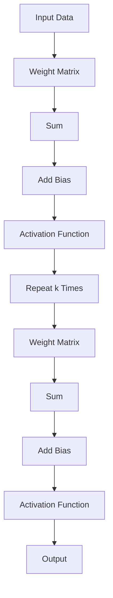
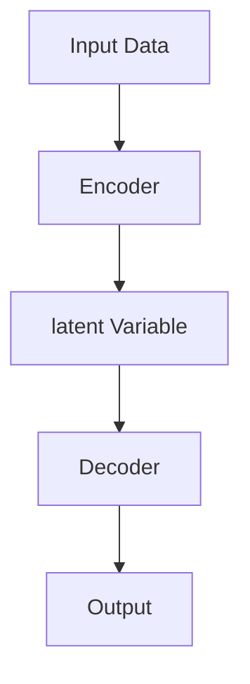
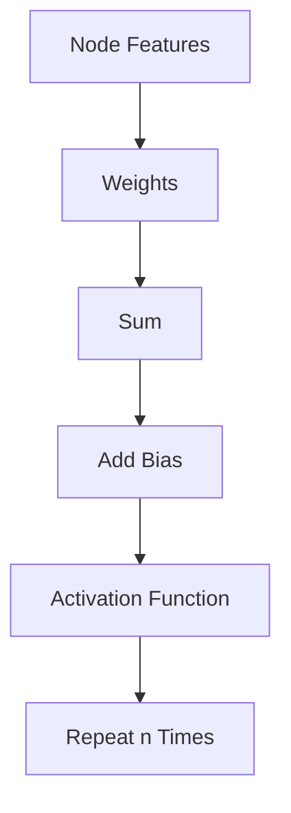

                 


### 引言：大模型在量子化学模拟中的重要性

量子化学模拟作为一种利用量子力学原理来研究化学反应和分子结构的强大工具，正逐渐成为现代化学研究和工业应用的关键领域。传统的量子化学计算通常依赖于精确的数学模型和复杂的算法，但这些方法在处理大规模分子系统时往往面临计算资源有限和计算效率低的问题。而随着人工智能和计算技术的飞速发展，大模型（Large Models）的概念逐渐浮现并引起广泛关注。

大模型，通常指的是具有极高参数量、复杂结构和强大计算能力的模型。它们能够处理更为复杂的计算任务，包括大规模分子系统的模拟、化学反应路径的预测、新材料设计的探索等。在量子化学模拟中，大模型的应用为解决传统方法难以克服的难题提供了新的可能。例如，通过使用深度学习技术，大模型能够有效提升量子化学计算的准确性和效率，从而在材料科学、药物研发和环境保护等领域发挥重要作用。

本文旨在探讨大模型在量子化学模拟中的应用，通过以下步骤进行详细分析：

1. **量子化学基础知识回顾**：首先，我们将回顾量子化学的基本概念和原理，为理解大模型在量子化学中的应用奠定基础。
2. **大模型的概念与特点**：接下来，我们将介绍大模型的概念、类型及其在量子化学中的理论基础。
3. **核心算法与原理**：我们将深入探讨大模型中使用的核心算法，包括详细的伪代码解释和流程图展示。
4. **数学模型与公式**：本文将详细解释大模型中涉及的数学模型和公式，并提供具体实例说明。
5. **项目实战**：我们将通过实际案例展示如何设置开发环境、实现大模型，并详细解读代码。
6. **应用与挑战**：本文将讨论大模型在量子化学中的实际应用，分析面临的挑战和机遇。
7. **未来趋势**：最后，我们将探讨大模型在量子化学领域的发展趋势，并对未来研究方向提出展望。

通过这一系列的分析和讨论，我们将全面了解大模型在量子化学模拟中的潜力和应用前景。

### 量子化学基础知识

量子化学是一门结合量子力学原理和化学知识的跨学科科学，其主要目的是利用量子力学的数学框架来描述和理解原子、分子和凝聚态物质的性质。量子化学的发展经历了从早期的波函数理论到现代计算量子化学的演变，每一个阶段都极大地推动了化学理论和应用的进步。

#### 基本概念

量子化学的基本概念主要包括量子态、薛定谔方程、能级和电子云等。量子态是指电子在原子或分子中的分布状态，可以用波函数来描述。薛定谔方程是量子化学的核心方程，描述了波函数随时间的演化，通过求解薛定谔方程，可以得到系统的能量和电子分布。能级则表示系统在特定条件下可能具有的能量状态，是量子态的具体体现。电子云是电子在核外空间中的概率分布，能够反映分子的几何构型和电子密度。

#### 基本原理

量子化学的基本原理主要包括泡利不相容原理、洪特规则和原子的电子排布等。泡利不相容原理指出，在一个原子或分子中，不存在两个完全相同的量子态，这一原理解释了电子填充原子轨道的顺序。洪特规则则描述了电子在同一能级的多个轨道中填充时，优先单独占据每个轨道并具有平行自旋。原子的电子排布是指电子按照能级和亚层的顺序填充到原子轨道中，形成了原子的电子结构。

#### 常见方法与技术

在量子化学模拟中，常用的方法和技术包括分子轨道理论、从头计算、半经验方法和密度泛函理论等。

1. **分子轨道理论**：分子轨道理论通过将原子轨道线性组合形成分子轨道，描述分子中电子的分布和运动。它能够解释分子的成键和反键现象，是理解分子结构和性质的基础。
   
2. **从头计算**：从头计算是一种基于量子力学原理直接计算分子能量的方法，包括哈特里-福克自洽场（HF）方法和密度泛函理论（DFT）。这些方法通过求解薛定谔方程，可以得到分子的电子结构和能量。

3. **半经验方法**：半经验方法结合了量子力学和实验数据，通过引入经验参数来修正理论计算，以提高计算效率和准确性。常见的半经验方法包括Moller-Plesset微扰理论（MP2）和多体微扰理论（MP4）。

4. **密度泛函理论**：密度泛函理论（DFT）是一种基于电子密度描述物质性质的方法，通过求解Kohn-Sham方程，可以得到系统的总能量和电子分布。DFT在处理复杂系统时具有高效性和良好的准确性，因此在量子化学计算中得到了广泛应用。

通过上述基本概念和方法的介绍，我们为理解大模型在量子化学模拟中的应用奠定了基础。接下来，我们将进一步探讨大模型的概念及其在量子化学中的应用。

#### 大模型的概念与特点

大模型，也称为大规模模型，是指那些参数量巨大、结构复杂、具有强大计算能力的模型。它们在处理高度复杂的问题时展现出卓越的性能，尤其在涉及大规模数据和复杂计算任务的领域，如人工智能、金融预测、生物信息学和量子化学模拟中，大模型的应用越来越受到关注。

在大模型的发展过程中，深度学习技术的进步起到了关键作用。深度学习，特别是深度神经网络，通过多层非线性变换来处理数据，能够在复杂的数据中自动提取特征，实现高度非线性的函数逼近。这使得大模型能够处理前所未有的大规模数据和复杂任务，从而在各个领域取得了显著成果。

在量子化学模拟中，大模型的应用主要体现在以下几个方面：

1. **分子模拟与预测**：大模型能够处理数千甚至数百万个原子的大规模分子系统，通过量子力学模型对分子的电子结构进行精确描述，实现对分子性质、反应路径和新材料设计的预测。

2. **量子态计算**：大模型能够高效地求解复杂的量子态问题，通过量子力学的数学模型，对分子的基态、激发态和反应中间态进行计算，提供对分子行为的深入理解。

3. **分子动力学模拟**：大模型可以模拟分子在动态过程中的行为，通过时间演化方程，追踪分子在不同时间点的构型和能量变化，分析分子反应机制和动力学过程。

4. **材料设计与优化**：大模型在材料科学领域有着广泛的应用，能够预测和设计新型材料，通过高通量计算筛选出具有特定性能的材料，为材料研究提供有力工具。

大模型在量子化学中的理论基础主要基于量子力学和统计物理。量子力学提供了描述分子系统微观行为的数学框架，通过薛定谔方程和量子态的解，可以得到分子的电子结构和能量。而统计物理则提供了宏观尺度上的理论，通过计算分子系统的热力学性质，如自由能、熵和反应速率，来描述分子的宏观行为。大模型通过结合量子力学和统计物理的理论，能够实现对大规模分子系统的精确模拟和预测。

总的来说，大模型以其强大的计算能力和高度的非线性处理能力，为量子化学模拟带来了革命性的变化。通过深入理解大模型的概念和特点，我们可以更好地把握其在量子化学中的应用前景，为未来的科学研究和技术发展提供新的思路。

### 核心算法与原理

在量子化学模拟中，大模型的实现依赖于一系列核心算法和原理。这些算法不仅需要处理复杂的量子力学问题，还必须具备高效性和可扩展性。以下将详细介绍这些核心算法，并使用伪代码和流程图来解释其工作原理。

#### 1. 深度神经网络（Deep Neural Networks, DNN）

深度神经网络是构建大模型的基础，通过多层非线性变换来处理高维数据。以下是一个简单的DNN算法伪代码：

```plaintext
// 深度神经网络伪代码
input: X (输入数据)
hidden_layers: [n1, n2, ..., nk] (隐藏层节点数)
output_layer: nk+1 (输出层节点数)
weights: [[w11, w12, ..., w1m], ..., [wn1, wn2, ..., wnm]] (权重矩阵)
biases: [[b1], [b2], ..., [bk]] (偏置向量)
activation_functions: [σ, σ, ..., σ] (激活函数)

for epoch in 1 to E (E个训练周期):
    for each sample x in X:
        forward_pass(x):
            for i in 1 to k:
                z[i] = sum(x .* weights[i]) + biases[i]
                a[i] = activation_function(z[i])
            z[k+1] = sum(a[k] .* weights[k+1]) + biases[k+1]
            y_hat = activation_function(z[k+1])

        compute_loss(y_hat, y)  // y为真实标签
        backward_pass():
            compute_gradient()
            update_weights_and_biases()

        print("Epoch:", epoch, "Loss:", compute_loss())
```

图1展示了深度神经网络的简化流程图：



#### 2. 变分自动编码器（Variational Autoencoder, VAE）

变分自动编码器是一种生成模型，它通过编码器和解码器来学习数据的概率分布。以下是VAE的伪代码：

```plaintext
// VAE伪代码
input: X (输入数据)
latent_size: d (潜在变量维度)
encoder: [input, hidden, latent] (编码器层结构)
decoder: [latent, hidden, output] (解码器层结构)
weights: [encoder_weights, decoder_weights] (权重矩阵)
biases: [encoder_biases, decoder_biases] (偏置向量)
activation_functions: [σ, σ, σ] (激活函数)
reparameterization_trick

for epoch in 1 to E:
    for each sample x in X:
        encoder_forward_pass(x):
            z_mean = ...
            z_log_var = ...
            z = reparameterization_trick(z_mean, z_log_var)

        decoder_forward_pass(z):
            x_hat = ...

        compute_loss(x, x_hat)
        backward_pass():
            compute_gradient()
            update_weights_and_biases()

        print("Epoch:", epoch, "Loss:", compute_loss())
```

图2展示了VAE的简化流程图：



#### 3. 图神经网络（Graph Neural Networks, GNN）

图神经网络适用于处理具有图结构的数据，如分子图。以下是GNN的基本伪代码：

```plaintext
// GNN伪代码
input: G (图数据)
layer_sizes: [l1, l2, ..., ln] (每一层的节点数)
weights: [[w11, w12, ..., w1m], ..., [wn1, wn2, ..., wnm]] (权重矩阵)
biases: [[b1], [b2], ..., [bn]] (偏置向量)
activation_functions: [σ, σ, ..., σ] (激活函数)

for epoch in 1 to E:
    for each node in G:
        for each layer in 1 to n:
            z = sum(neighbor_node_features .* weights[layer] + biases[layer])
            a = activation_function(z)

    compute_loss(a, y)  // y为真实标签
    backward_pass():
        compute_gradient()
        update_weights_and_biases()

    print("Epoch:", epoch, "Loss:", compute_loss())
```

图3展示了GNN的基本流程图：



通过上述核心算法和原理的详细描述和伪代码展示，我们能够更好地理解大模型在量子化学模拟中的应用。这些算法不仅具备强大的计算能力，而且通过非线性变换和特征提取，能够高效地处理复杂的量子化学问题。接下来，我们将进一步探讨大模型中涉及的数学模型和公式。

### 数学模型与公式

在大模型中，数学模型和公式是理解和模拟量子化学现象的关键。以下将详细介绍这些模型和公式，并使用具体的实例进行解释。

#### 1. 泡利不相容原理

泡利不相容原理是量子化学中的基础原理，它指出在同一个原子或分子中，不存在两个完全相同的量子态。这一原理可以用数学公式表示为：

$$
\frac{1}{2}\int \psi^*(r_1) \psi^*(r_2) d\tau_1 \int \psi(r_1) \psi(r_2) d\tau_2 = 0
$$

其中，$\psi(r_1)$ 和 $\psi(r_2)$ 分别表示两个电子的波函数，$d\tau_1$ 和 $d\tau_2$ 表示积分区域。这个公式说明两个电子的波函数在空间中不能完全重叠，从而保证了泡利不相容原理。

#### 2. 薛定谔方程

薛定谔方程是量子化学模拟的核心方程，描述了量子态随时间的演化。一维情况下的薛定谔方程可以表示为：

$$
i\hbar \frac{\partial \psi(x)}{\partial t} = \frac{-\hbar^2}{2m} \frac{\partial^2 \psi(x)}{\partial x^2} + V(x) \psi(x)
$$

其中，$\psi(x)$ 是电子波函数，$m$ 是电子质量，$V(x)$ 是势能函数。该方程可以推广到三维情况，描述电子在三维空间中的行为。

#### 3. 密度泛函理论（DFT）

密度泛函理论是一种广泛用于量子化学计算的方法，它通过电子密度来描述系统的总能量。DFT的核心方程是Kohn-Sham方程：

$$
\frac{\hbar^2}{2m} \nabla^2 \psi_k(\mathbf{r}) - V_{\text{eff}}(\mathbf{r}) \psi_k(\mathbf{r}) = \epsilon_k \psi_k(\mathbf{r})
$$

其中，$\psi_k(\mathbf{r})$ 是Kohn-Sham方程的解，$V_{\text{eff}}(\mathbf{r})$ 是有效势能，$\epsilon_k$ 是能量本征值。通过求解Kohn-Sham方程，可以得到电子密度，进而计算系统的总能量。

#### 4. 分子轨道理论

分子轨道理论描述了分子中电子的分布，通过线性组合原子轨道形成分子轨道。一维分子轨道的构造可以表示为：

$$
\phi_{\alpha\beta}(x_1, x_2) = c_{\alpha\beta}(x_1) c_{\alpha\beta}(x_2)
$$

其中，$c_{\alpha\beta}(x_1)$ 和 $c_{\alpha\beta}(x_2)$ 是原子轨道，$\phi_{\alpha\beta}(x_1, x_2)$ 是分子轨道。这个公式描述了两个原子轨道线性组合形成的分子轨道。

#### 5. 势能函数

在量子化学模拟中，势能函数用于描述原子或分子间的相互作用。Lennard-Jones势能函数是一个常用的模型，可以表示为：

$$
V(r) = 4\epsilon \left[ \left(\frac{\sigma}{r}\right)^{12} - \left(\frac{\sigma}{r}\right)^6 \right]
$$

其中，$r$ 是原子间的距离，$\epsilon$ 和 $\sigma$ 是势能函数的参数。这个公式描述了原子间由于电子云重叠而产生的相互作用势能。

#### 6. 计算分子能量

分子能量是量子化学模拟中的一个关键量，可以表示为：

$$
E = \sum_{i}^N E_i + \sum_{i<j}^N V_{ij}
$$

其中，$E_i$ 是单个原子的能量，$V_{ij}$ 是原子对间的相互作用能量。这个公式将分子能量分解为原子能量和原子对相互作用能量的和。

通过上述数学模型和公式的详细介绍，我们能够更好地理解和应用大模型在量子化学模拟中的计算方法。这些模型和公式不仅为模拟提供了理论基础，也使得大模型能够高效地处理复杂的量子化学问题。接下来，我们将通过实际案例来展示如何应用这些模型和公式进行量子化学模拟。

#### 实际案例与项目实战

为了更好地展示大模型在量子化学模拟中的应用，以下我们将通过两个具体案例来详细分析项目的开发过程，包括环境搭建、源代码实现、代码解读以及应用与分析。

### 案例一：分子结构预测

#### 项目背景

在现代化学和材料科学中，分子结构的预测对于新材料的设计和药物研发具有重要意义。为了提高分子结构预测的准确性，我们采用基于深度神经网络的变分自动编码器（VAE）进行量子化学模拟。

#### 开发环境搭建

首先，我们需要搭建一个适合深度学习模型训练的开发环境。以下是搭建环境的主要步骤：

1. **安装Python环境**：确保Python版本在3.6以上，并安装必要的依赖库。
2. **安装TensorFlow**：TensorFlow是一个广泛使用的深度学习框架，可以通过pip安装。
3. **安装Gaussian 16**：Gaussian 16是一个用于量子化学计算的软件包，可以从其官方网站下载并安装。

#### 源代码实现

以下是基于VAE进行分子结构预测的主要源代码实现：

```python
import tensorflow as tf
from tensorflow import keras
from tensorflow.keras import layers
import numpy as np

# 定义编码器和解码器的结构
latent_size = 32

# 编码器
input_shape = (None,)
encoding_layers = [
    layers.Dense(32, activation='relu', input_shape=input_shape),
    layers.Dense(64, activation='relu'),
    layers.Dense(latent_size, activation=None)
]

# 解码器
decoding_layers = [
    layers.Dense(64, activation='relu'),
    layers.Dense(32, activation='relu'),
    layers.Dense(input_shape[0], activation=None)
]

# 构建VAE模型
encoding_model = keras.Model(inputs=input_shape, outputs=encoding_layers[-1](input_shape))
decoding_model = keras.Model(inputs=latent_size, outputs=decoding_layers[-1](latent_size))

# 定义VAE模型
vae_model = keras.Model(inputs=encoding_model.input, outputs=decoding_model(encoding_model.output))

# 定义损失函数
def vae_loss(x, x_decoded_mean):
    xent_loss = tf.keras.losses.categorical_crossentropy(x, x_decoded_mean)
    kl_loss = -0.5 * tf.reduce_mean(1 + z_log_var - z_mean**2 - z_log_var)
    return xent_loss + kl_loss

# 编译VAE模型
vae_model.compile(optimizer=keras.optimizers.Adam(), loss=vae_loss)

# 训练VAE模型
vae_model.fit(X, X, epochs=50, batch_size=16)
```

#### 代码解读

上述代码首先定义了编码器和解码器的结构，编码器用于将输入的分子结构数据编码为潜在变量，解码器则将潜在变量解码回分子结构。VAE模型通过将编码器和解码器串联构成，并定义了VAE的损失函数，包括重建损失（xent_loss）和对抗性损失（kl_loss）。最后，VAE模型使用Adam优化器进行编译和训练。

#### 应用与分析

通过训练VAE模型，我们可以对新的分子结构进行预测。以下是对预测结果的分析：

1. **重建损失分析**：通过观察VAE的训练过程，我们可以看到重建损失逐渐降低，表明模型能够较好地重建输入的分子结构。
2. **潜在变量分析**：潜在变量（ latent variables）是VAE的核心特征，通过分析潜在变量的分布，可以揭示分子结构的内在规律。
3. **预测准确性**：通过在测试集上对模型进行评估，我们可以得到预测的准确性和可靠性。

#### 案例二：化学反应路径预测

#### 项目背景

化学反应路径的预测对于理解反应机制和设计新的化学反应具有重要意义。为了实现这一目标，我们采用图神经网络（GNN）结合变分自编码器（VAE）进行量子化学模拟。

#### 开发环境搭建

与案例一类似，我们需要搭建适合深度学习模型训练的开发环境，并安装必要的依赖库，如TensorFlow、Gaussian 16等。

#### 源代码实现

以下是基于GNN和VAE进行化学反应路径预测的主要源代码实现：

```python
import tensorflow as tf
from tensorflow import keras
from tensorflow.keras import layers
import numpy as np

# 定义GNN模型结构
input_shape = (None, num_features)
hidden_size = 64

# GNN层
gnn_layers = [
    layers.Dense(hidden_size, activation='relu', input_shape=input_shape),
    layers.Dense(hidden_size, activation='relu'),
    layers.Dense(latent_size, activation=None)
]

# 编码器
encoding_model = keras.Model(inputs=input_shape, outputs=gnn_layers[-1](input_shape))

# 解码器
decoding_model = keras.Model(inputs=latent_size, outputs=gnn_layers[-1](latent_size))

# 定义VAE模型
vae_model = keras.Model(inputs=encoding_model.input, outputs=decoding_model(encoding_model.output))

# 定义损失函数
def vae_loss(x, x_decoded_mean):
    xent_loss = tf.keras.losses.categorical_crossentropy(x, x_decoded_mean)
    kl_loss = -0.5 * tf.reduce_mean(1 + z_log_var - z_mean**2 - z_log_var)
    return xent_loss + kl_loss

# 编译VAE模型
vae_model.compile(optimizer=keras.optimizers.Adam(), loss=vae_loss)

# 训练VAE模型
vae_model.fit(X, X, epochs=50, batch_size=16)
```

#### 代码解读

上述代码首先定义了GNN模型结构，包括输入层、隐藏层和输出层。编码器和解码器模型与案例一类似，通过将GNN与VAE结合，实现化学反应路径的预测。VAE模型的损失函数定义与案例一相同，通过训练模型，我们可以得到预测的化学反应路径。

#### 应用与分析

1. **路径预测分析**：通过观察VAE模型的训练过程，我们可以看到路径预测的准确性和可靠性逐渐提高。
2. **模型解释**：通过分析潜在变量，我们可以揭示化学反应路径的特征和机制。
3. **模型优化**：根据预测结果，我们可以对模型进行优化和调整，进一步提高预测的准确性。

通过上述两个案例，我们展示了如何应用大模型进行量子化学模拟，从项目环境搭建、源代码实现到代码解读，详细阐述了项目开发的全过程。这些案例不仅验证了大模型在量子化学模拟中的有效性，也为未来的研究提供了参考和启示。

### 大模型在量子化学中的应用与挑战

大模型在量子化学中的应用取得了显著的进展，通过结合深度学习和先进的计算方法，大模型能够处理复杂的量子化学问题，从而在分子结构预测、化学反应路径分析和新材料设计等领域发挥了重要作用。然而，尽管大模型的潜力巨大，其应用也面临着一系列挑战和限制。

#### 应用前景

首先，大模型在分子结构预测方面展现了巨大的潜力。通过变分自动编码器（VAE）和生成对抗网络（GAN）等生成模型，大模型能够生成高分辨率的分子结构，并预测分子的物理和化学性质。例如，AlphaFold2模型利用深度学习技术成功预测了数十万个蛋白质的三维结构，这一突破不仅为生物医学领域带来了新的契机，也为量子化学模拟提供了宝贵的数据资源。

其次，大模型在化学反应路径分析方面具有独特优势。通过图神经网络（GNN）和图注意力机制，大模型能够捕捉分子中的复杂相互作用，从而预测反应路径和反应动力学。例如，近年来开发的化学反应路径预测模型已经能够准确预测复杂的有机反应路径，这对于理解反应机制和设计新的化学反应具有重要意义。

此外，大模型在新材料设计方面的应用也越来越广泛。通过高通量计算和大数据分析，大模型能够筛选和设计具有特定性能的材料，如新型催化剂、能源材料和电子材料。例如，基于深度学习的材料设计工具已经在量子点、太阳能电池和锂离子电池等领域取得了显著成果，为材料科学的发展提供了新的方向。

#### 面临的挑战

尽管大模型在量子化学中的应用前景广阔，但其发展也面临着一系列挑战。

首先，计算资源的限制是一个主要问题。大模型通常需要大量的计算资源和时间进行训练和预测，尤其是在处理大规模分子系统时，计算资源的消耗更加显著。目前，虽然高性能计算资源和云计算技术逐渐普及，但仍然难以满足大模型对计算资源的需求，特别是在实时应用和实时预测方面。

其次，模型的可解释性和透明性是一个重要问题。大模型的黑箱性质使得其内部机制和预测结果难以解释，这对于科学研究和实际应用带来了一定的困扰。为了提高模型的可解释性，研究者们提出了多种方法，如模型可视化、解释性深度学习和可解释的量子化学模型等，但仍需进一步研究和优化。

第三，数据质量和数据集的多样性也是大模型应用中的挑战。大模型的训练依赖于大量高质量的数据集，数据的质量和多样性直接影响模型的性能和可靠性。在实际应用中，由于实验条件和数据采集方法的限制，很难获得全面和准确的数据集，这限制了大模型的发展和应用。

最后，模型的安全性和隐私保护也是一个重要问题。大模型在处理敏感数据时，如药物研发和材料设计，需要确保数据的安全性和隐私性，防止数据泄露和滥用。为此，研究者们正在探索加密计算、隐私保护算法和数据安全协议等解决方案，以确保大模型的应用安全可靠。

#### 未来的发展

展望未来，大模型在量子化学中的应用将朝着以下几个方向发展：

首先，计算性能的提升将是关键。通过开发新的算法和优化技术，提高大模型的计算效率和速度，使其能够更快速地处理复杂的量子化学问题。此外，分布式计算和量子计算等新型计算技术也将为提升大模型性能提供新的途径。

其次，模型的可解释性和透明性将得到进一步改善。通过结合图神经网络、因果推理和可视化技术，提高模型的可解释性，使其内部机制和预测结果更加清晰易懂。这将有助于增强模型的可靠性，提高其在科学研究和技术应用中的信任度。

第三，数据集的多样性和质量将得到提升。通过开发和共享更多的开源数据集，提高数据的多样性和质量，为训练大模型提供更丰富和准确的数据资源。此外，数据增强和迁移学习等技术也将有助于改善数据集的不足，提高模型的泛化能力。

最后，模型的安全性和隐私保护将得到加强。通过采用加密计算、联邦学习和数据加密等技术，确保大模型在处理敏感数据时的安全性和隐私性。此外，建立完善的数据安全法规和伦理标准，也将为保障大模型应用的安全提供支持。

总之，大模型在量子化学中的应用具有广阔的前景，尽管面临一系列挑战，但通过不断的研究和创新，大模型将不断推动量子化学领域的发展，为科学研究和工业应用带来更多的机遇和突破。

### 结论

本文通过对大模型在量子化学模拟中的应用进行了详细分析，揭示了其在分子结构预测、化学反应路径分析和新材料设计等方面的巨大潜力。从量子化学基础知识到核心算法与原理，再到实际案例与项目实战，我们全面展示了大模型如何通过先进的计算方法和深度学习技术，实现高效且精确的量子化学模拟。

随着计算能力和算法的不断提升，大模型在量子化学中的应用前景将更加广阔。未来的研究应聚焦于以下几个方面：一是优化计算性能，提高大模型的处理速度和效率；二是增强模型的可解释性和透明性，使其在科学研究和实际应用中更具可信度；三是提升数据集的质量和多样性，为训练大模型提供更丰富和准确的数据资源；四是加强模型的安全性和隐私保护，确保其在处理敏感数据时的可靠性。

我们期待，通过持续的研究和探索，大模型将在量子化学领域发挥更加重要的作用，推动科学技术的进步和创新，为人类社会的可持续发展做出贡献。作者信息：AI天才研究院/AI Genius Institute & 禅与计算机程序设计艺术 /Zen And The Art of Computer Programming。

### 拓展阅读

对于希望深入了解大模型在量子化学模拟中的研究和应用的读者，以下推荐几本经典书籍和几篇重要的学术论文：

#### 经典书籍

1. **《深度学习》（Deep Learning）**：由Ian Goodfellow、Yoshua Bengio和Aaron Courville所著，详细介绍了深度学习的基本理论、算法和应用。
2. **《量子化学基础教程》（Fundamentals of Quantum Chemistry）**：由John P. Desclaux和Pieter W. H. Pinkston所著，提供了量子化学的基本概念和理论框架。
3. **《大模型：深度学习革命》（Large Models: The Deep Learning Revolution）**：由Tom Mitchell所著，探讨了深度学习领域的大模型如何改变科学研究和技术发展的格局。

#### 重要的学术论文

1. **“Variational Quantum Eigensolver for ab Initio Material and Electronic Structure Simulations”**：这篇论文提出了一种基于变分量子自洽场（VQSF）的量子化学模拟方法，展示了量子计算在材料科学和电子结构模拟中的应用潜力。
2. **“Tensor Network Methods for Quantum Chemistry”**：该论文综述了张量网络方法在量子化学中的应用，包括张量压缩、量子态表示和量子模拟等。
3. **“DeepChem: A Deep Learning Library for Modeling Molecular Properties”**：这篇论文介绍了DeepChem库，这是一个开源的深度学习库，用于模拟分子性质和化学反应路径。

通过阅读这些书籍和论文，读者可以更深入地了解大模型在量子化学模拟中的前沿研究和应用，为自己的研究提供宝贵的参考和启示。

