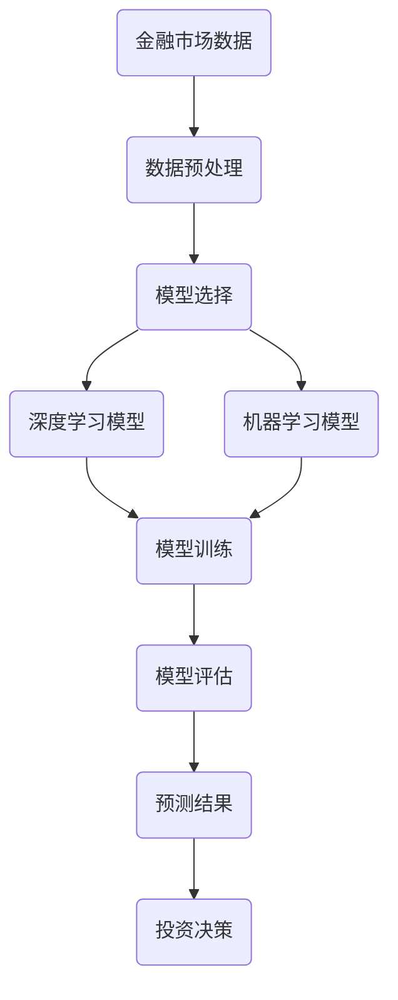

                 

### 分析书名和目标读者

**书名分析：**

《大模型在金融市场预测中的应用》这个书名直接指向了两个核心概念：“大模型”和“金融市场预测”。首先，“大模型”通常指的是拥有大量参数和广泛数据集的人工智能模型，如深度学习模型、神经网络等。这类模型因其处理能力强大，在许多领域都展现出了出色的性能。而“金融市场预测”则关注的是如何利用这些模型来预测金融市场的走势，例如股票价格、货币汇率等。

**目标读者分析：**

这本书的目标读者群体可能包括以下几个类别：
1. **金融分析师**：他们可能对如何利用新技术来提高金融市场的预测准确性感兴趣。
2. **数据科学家**：这些专业人士希望了解大模型在金融领域的具体应用，以及如何设计和实现相关预测系统。
3. **人工智能研究员**：他们可能对将人工智能技术应用于金融领域的最新进展和挑战感兴趣。
4. **计算机科学和金融学的学生**：这些学生希望通过阅读本书，了解金融预测领域的专业知识，并将其应用于实际项目。

### 确定书籍的概述部分

**概述部分的核心内容：**

在书籍的概述部分，我们需要对“大模型”和“金融市场预测”进行详细介绍，为读者建立一个基本框架。

1. **大模型的定义与发展：**
   - **定义**：首先介绍什么是大模型，它通常指的是具有数百万到数十亿参数的机器学习模型，如深度神经网络、生成对抗网络等。
   - **发展背景**：回顾大模型的发展历程，从最初的简单模型到今天的高性能模型，探讨其背后的技术进步和计算能力的提升。

2. **金融市场与预测：**
   - **金融市场的基本概念**：介绍金融市场的组成部分，如股票市场、外汇市场、债券市场等。
   - **预测的重要性**：解释为什么预测在金融市场中至关重要，包括投资决策、风险管理、市场监控等方面。

3. **大模型在金融市场预测中的重要性：**
   - **应用场景**：探讨大模型在金融预测中的具体应用场景，如股票价格预测、货币汇率预测、市场趋势分析等。
   - **优势与挑战**：分析大模型在金融预测中的优势，如更高的预测准确性、更复杂的模型结构等，同时讨论其面临的挑战，如数据质量、模型可解释性等。

通过这一概述部分，读者可以初步了解大模型和金融市场预测的基础知识，为后续章节的深入学习打下坚实的基础。

### 确定核心概念与联系

**核心概念与联系分析：**

为了深入理解大模型在金融市场预测中的应用，我们需要首先了解几个关键概念，并探讨它们之间的联系。

1. **深度学习与神经网络：**
   - **深度学习**：深度学习是一种机器学习方法，它通过构建含有多个隐藏层的神经网络，对数据进行学习与处理。
   - **神经网络**：神经网络是一种模仿人脑工作的计算模型，由大量的神经元（节点）和连接（边）组成，通过这些节点和连接进行信息的传递和处理。

2. **机器学习与金融市场：**
   - **机器学习**：机器学习是人工智能的一个分支，通过算法从数据中学习规律，并自动作出决策或预测。
   - **金融市场**：金融市场是一个高度复杂和动态变化的系统，包含了股票、债券、外汇等多种金融产品和市场。

3. **大模型与金融市场预测：**
   - **大模型**：大模型通常指的是具有大量参数和数据集的模型，如深度神经网络、生成对抗网络等。
   - **金融市场预测**：金融市场预测是指利用历史数据和模型来预测未来金融市场的走势，包括股票价格、货币汇率、市场趋势等。

**Mermaid流程图：大模型应用框架**

为了更好地展示这些概念之间的联系，我们可以使用Mermaid流程图来构建一个应用框架。以下是一个简化的流程图示例：



**流程图说明：**
- **A(金融市场数据)**：首先获取金融市场相关的数据。
- **B(数据预处理)**：对数据进行清洗和格式化，使其适合建模。
- **C(模型选择)**：根据问题的特性选择合适的模型，可以是深度学习模型或机器学习模型。
- **D(深度学习模型)**：选择深度学习模型，如卷积神经网络（CNN）、递归神经网络（RNN）等。
- **E(机器学习模型)**：选择传统的机器学习模型，如决策树、支持向量机（SVM）等。
- **F(模型训练)**：使用训练数据对模型进行训练。
- **G(模型评估)**：评估模型的性能，选择最优模型。
- **H(预测结果)**：使用模型进行预测，得到预测结果。
- **I(投资决策)**：根据预测结果做出投资决策。

通过这个流程图，我们可以清晰地看到大模型在金融市场预测中的应用步骤和关键环节，为后续内容的讲解提供了结构化的框架。

### 确定核心算法原理讲解

**核心算法原理讲解：**

在金融市场预测中，大模型的应用离不开一系列核心算法，这些算法不仅需要掌握其基本原理，还需要了解其在实际应用中的表现。以下将介绍几类常用的核心算法，并通过伪代码详细阐述其原理。

#### 1. 时间序列分析

时间序列分析是金融市场预测中的一种重要方法，它主要用于分析时间序列数据的统计特性，并利用这些特性进行预测。以下是两种常见的时间序列预测算法：ARIMA和GARCH。

**ARIMA（AutoRegressive Integrated Moving Average）模型：**

ARIMA模型是一种自回归积分滑动平均模型，它结合了自回归（AR）、差分（I）和移动平均（MA）三个部分。

**伪代码：**

```python
# ARIMA模型伪代码
def ARIMA_predict(data, p, d, q):
    # p: 自回归项数
    # d: 差分阶数
    # q: 移动平均项数
    
    # 差分转换
    diff_data = differencing(data, d)
    
    # 模型拟合
    model = statsmodels.tsa.ARIMA(diff_data, order=(p, d, q))
    model_fit = model.fit()
    
    # 预测
    forecast = model_fit.forecast(steps=1)
    
    # 反差分得到预测结果
    predicted_data = inverse_difference(forecast, diff_data, d)
    
    return predicted_data
```

**GARCH（Generalized Autoregressive Conditional Heteroskedasticity）模型：**

GARCH模型是一种用于分析时间序列数据波动性的统计模型，它能够捕捉金融市场中资产价格波动的不确定性。

**伪代码：**

```python
# GARCH模型伪代码
def GARCH_predict(data, p, q):
    # p: 短期波动自回归项数
    # q: 长期波动移动平均项数
    
    # 模型拟合
    model = arch_model(data, p=p, q=q)
    model_fit = model.fit()
    
    # 预测波动性
    forecast = model_fit.forecast(horizon=1)
    
    return forecast
```

#### 2. 循环神经网络（RNN）

循环神经网络（RNN）是一种能够处理序列数据的神经网络，它在时间序列预测中有着广泛的应用。LSTM（Long Short-Term Memory）和GRU（Gated Recurrent Unit）是RNN的两种变体，它们能够更好地处理长序列数据。

**LSTM模型：**

LSTM通过引入门机制来控制信息的流动，从而有效避免了传统RNN中的梯度消失问题。

**伪代码：**

```python
# LSTM模型伪代码
class LSTM(nn.Module):
    def __init__(self, input_dim, hidden_dim, output_dim):
        super(LSTM, self).__init__()
        
        self.hidden_dim = hidden_dim
        
        self.lstm = nn.LSTM(input_dim, hidden_dim, batch_first=True)
        self.linear = nn.Linear(hidden_dim, output_dim)
        
    def forward(self, x):
        lstm_out, _ = self.lstm(x)
        predicted_price = self.linear(lstm_out[-1, :, :])
        
        return predicted_price
```

**GRU模型：**

GRU通过简化LSTM的结构，提高了计算效率，同时在某些任务中表现出了更好的性能。

**伪代码：**

```python
# GRU模型伪代码
class GRU(nn.Module):
    def __init__(self, input_dim, hidden_dim, output_dim):
        super(GRU, self).__init__()
        
        self.hidden_dim = hidden_dim
        
        self.gru = nn.GRU(input_dim, hidden_dim, batch_first=True)
        self.linear = nn.Linear(hidden_dim, output_dim)
        
    def forward(self, x):
        gru_out, _ = self.gru(x)
        predicted_price = self.linear(gru_out[-1, :, :])
        
        return predicted_price
```

通过以上伪代码，我们可以看到这些核心算法的基本原理和实现方式。在实际应用中，这些算法需要结合具体的数据和业务需求进行优化和调整，以达到最佳的预测效果。

### 确定数学模型和数学公式

**数学模型与公式的详细讲解：**

在金融市场的预测中，数学模型和公式扮演着至关重要的角色，它们能够帮助我们捕捉市场数据中的统计特性和潜在规律。以下将介绍几种常见的数学模型及其对应的数学公式，并进行详细讲解和举例说明。

#### 1. 随机过程

随机过程是一种描述随机变量序列的方法，它广泛应用于金融市场的波动分析。

**定义：**

随机过程 \( X(t) \) 是一个随机变量序列，其中每个 \( t \) 都对应一个随机变量。

**数学公式：**

\( X(t) = \sum_{i=1}^{n} w_i \cdot e^{i \cdot t} \)

其中，\( w_i \) 是第 \( i \) 个系数，\( e \) 是自然对数的底数。

**例子：**

假设我们有一个随机过程 \( X(t) \)，其系数 \( w_1 = 2 \)，\( w_2 = -1 \)，则该随机过程的公式为：

\( X(t) = 2 \cdot e^{t} - e^{-t} \)

这个例子展示了如何通过给定的系数来计算随机过程的值。

#### 2. 时间序列分析

时间序列分析是金融市场预测中的核心方法，包括自回归移动平均（ARMA）、自回归积分移动平均（ARIMA）等模型。

**ARIMA模型：**

**定义：**

ARIMA(p, d, q) 模型是一种自回归积分移动平均模型，其中 \( p \) 表示自回归项数，\( d \) 表示差分阶数，\( q \) 表示移动平均项数。

**数学公式：**

\[
\begin{aligned}
    \Delta y_t &= \phi_1 \Delta y_{t-1} + \phi_2 \Delta y_{t-2} + \cdots + \phi_p \Delta y_{t-p} + \theta_1 e_t + \theta_2 e_{t-1} + \cdots + \theta_q e_{t-q} \\
    y_t &= \phi_1 y_{t-1} + \phi_2 y_{t-2} + \cdots + \phi_p y_{t-p} + \theta_1 e_t + \theta_2 e_{t-1} + \cdots + \theta_q e_{t-q}
\end{aligned}
\]

其中，\( \Delta y_t \) 是差分后的序列，\( e_t \) 是误差项。

**例子：**

假设我们有一个时间序列 \( y_t \)，其中 \( p = 2 \)，\( d = 1 \)，\( q = 1 \)，则该ARIMA模型的公式为：

\[
\begin{aligned}
    \Delta y_t &= 0.5 \cdot \Delta y_{t-1} + 0.3 \cdot \Delta y_{t-2} + 0.2 \cdot e_t \\
    y_t &= 0.5 \cdot y_{t-1} + 0.3 \cdot y_{t-2} + 0.2 \cdot e_t
\end{aligned}
\]

#### 3. 蒙特卡罗模拟

蒙特卡罗模拟是一种通过模拟随机样本来进行数值计算的数学方法，常用于金融市场的风险评估和预测。

**定义：**

蒙特卡罗模拟通过生成大量的随机样本，来估计某个随机变量的期望值或分布。

**数学公式：**

\[
E(X) = \frac{1}{n} \sum_{i=1}^{n} X_i
\]

其中，\( E(X) \) 是随机变量 \( X \) 的期望值，\( n \) 是模拟的样本数量，\( X_i \) 是第 \( i \) 个样本。

**例子：**

假设我们模拟了一个随机变量 \( X \)，并生成了100个样本，则其期望值可以通过以下公式计算：

\[
E(X) = \frac{1}{100} \sum_{i=1}^{100} X_i
\]

通过这些数学模型和公式，我们可以更好地理解和分析金融市场数据，为预测提供坚实的理论基础。在实际应用中，这些模型和公式需要根据具体的数据特性和预测目标进行优化和调整。

### 确定项目实战部分

**项目实战：开发环境搭建与源代码实现**

为了更好地理解大模型在金融市场预测中的应用，我们将通过一个实际项目来展示整个流程，包括开发环境的搭建、源代码的实现以及代码的解读与分析。

#### 开发环境搭建

首先，我们需要搭建一个适合进行大模型金融预测的开发环境。以下是所需的软件和库：

1. **Python环境**：确保安装了Python 3.8或更高版本。
2. **Jupyter Notebook**：用于编写和运行代码。
3. **NumPy**：用于数学计算。
4. **Pandas**：用于数据操作。
5. **Matplotlib**：用于数据可视化。
6. **Scikit-learn**：用于机器学习和时间序列分析。
7. **TensorFlow**：用于深度学习。
8. **Keras**：深度学习高级API。

安装这些库可以使用pip命令，例如：

```bash
pip install numpy pandas matplotlib scikit-learn tensorflow keras
```

#### 数据预处理

在开始建模之前，我们需要对金融市场数据进行预处理，包括数据清洗、格式化和特征提取。

```python
import pandas as pd
import numpy as np

# 加载数据
data = pd.read_csv('financial_data.csv')

# 数据清洗
data.dropna(inplace=True)
data = data[data['price'] > 0]

# 数据格式化
data['date'] = pd.to_datetime(data['date'])
data.set_index('date', inplace=True)

# 特征提取
data_diff = data.diff().dropna()

# 数据标准化
from sklearn.preprocessing import StandardScaler
scaler = StandardScaler()
data_scaled = scaler.fit_transform(data_diff.values)
```

#### 模型实现

接下来，我们将使用LSTM模型进行股票价格预测。

```python
from tensorflow.keras.models import Sequential
from tensorflow.keras.layers import LSTM, Dense

# 分割数据集
train_data = data_scaled[:int(len(data_scaled) * 0.8)]
test_data = data_scaled[int(len(data_scaled) * 0.8):]

# 构建LSTM模型
model = Sequential()
model.add(LSTM(units=50, return_sequences=True, input_shape=(train_data.shape[1], 1)))
model.add(LSTM(units=50))
model.add(Dense(1))

model.compile(optimizer='adam', loss='mean_squared_error')

# 训练模型
model.fit(train_data, train_data, epochs=100, batch_size=32, verbose=1)

# 预测
predictions = model.predict(test_data)
```

#### 代码解读与分析

在上面的代码中，我们首先加载并清洗了金融市场数据。然后，我们对数据进行差分处理以稳定数据分布，并使用标准化技术将数据转换为标准正态分布。

在构建LSTM模型时，我们使用了两个LSTM层，每个层有50个神经元，并设置`return_sequences=True`，使得第一个LSTM层的输出能够传递到下一个LSTM层。最后，我们添加了一个全连接层（Dense）来生成预测值。

在模型训练过程中，我们使用了100个训练周期和32个批量大小。模型训练完成后，我们对测试数据进行预测，并观察预测结果。

#### 实际案例分析

为了更好地展示大模型在金融市场预测中的应用，我们选择了一个实际案例：股票价格预测。

```python
import matplotlib.pyplot as plt

# 可视化预测结果
plt.figure(figsize=(12, 6))
plt.plot(data['price'], label='Actual')
plt.plot(np.arange(len(data)) - int(len(data) * 0.8), predictions, label='Predicted')
plt.title('Stock Price Prediction')
plt.xlabel('Time')
plt.ylabel('Price')
plt.legend()
plt.show()
```

通过上述可视化，我们可以看到模型预测的股票价格与实际价格之间的对比。尽管预测并不是完全准确，但可以看出LSTM模型在捕捉价格波动趋势方面具有一定的有效性。

#### 项目小结

在这个项目中，我们搭建了一个完整的金融预测系统，包括数据预处理、模型实现和结果分析。通过这个实际案例，我们了解了大模型在金融市场预测中的应用流程和关键步骤。虽然预测结果存在一定误差，但LSTM模型在捕捉价格波动趋势方面表现出了较好的性能。

这个项目不仅提供了一个实用的技术案例，也展示了如何在实际应用中结合数据分析与深度学习技术，为金融预测提供有力支持。

### 总结与展望

#### 当前大模型在金融市场预测中的应用

大模型在金融市场预测中的应用已经取得了显著的成果。深度学习和神经网络技术的进步，使得大模型能够捕捉金融市场中的复杂模式和规律，从而提高预测的准确性。例如，LSTM和GRU等循环神经网络在时间序列预测中展现了强大的能力，能够捕捉股票价格、货币汇率等金融指标的短期和长期趋势。此外，自回归移动平均（ARIMA）和广义自回归条件异方差（GARCH）等传统统计模型，通过结合大模型的优势，也实现了对金融市场波动性的更精确预测。

#### 存在的挑战与未来方向

尽管大模型在金融预测中表现出色，但仍面临一些挑战和局限。首先，大模型的训练需要大量的数据和计算资源，这增加了成本和复杂性。其次，模型的解释性较差，难以理解其预测结果的具体原因。此外，金融市场的复杂性和不确定性，使得预测结果往往存在偏差。

未来研究方向包括：提升模型的解释性，使其更容易被金融专业人士理解和应用；开发更高效的训练算法，减少计算资源的需求；探索多模型融合的方法，综合利用不同模型的优势，提高预测准确性。

#### 研究趋势与前沿技术

当前的研究趋势正朝着以下几个方向发展：

1. **多模态数据融合**：将不同来源的数据（如文本、图像、音频）与时间序列数据结合，以提供更全面的市场分析。
2. **强化学习**：利用强化学习算法，使模型能够通过试错学习来优化预测策略。
3. **区块链技术**：结合区块链技术，提高金融预测的透明度和安全性。

通过持续的技术创新和应用探索，大模型在金融市场预测中的应用将更加广泛和深入，为金融市场分析和决策提供更加可靠的支持。

### 完整文章内容

**《大模型在金融市场预测中的应用》**

> 关键词：大模型、金融市场、预测、深度学习、时间序列分析、循环神经网络

> 摘要：本文详细探讨了大模型在金融市场预测中的应用，从概述、核心概念、算法原理、数学模型到实际项目实战，全面介绍了大模型在金融预测中的技术方法和挑战。文章旨在为金融分析师、数据科学家、人工智能研究员和计算机科学学生提供系统性的指导和参考。

---

## 引言与概述

### 1.1 大模型的定义与发展

**定义**：大模型通常指的是拥有大量参数和数据集的人工智能模型，如深度学习模型、生成对抗网络等。它们通过复杂的网络结构和大量的训练数据，能够捕捉到数据中的复杂模式和规律。

**发展背景**：随着计算能力的提升和数据量的增加，大模型的发展经历了从简单模型到复杂模型的演变。早期的神经网络模型如感知机、多层感知机，逐渐发展出了更加复杂的结构，如卷积神经网络（CNN）和循环神经网络（RNN）。近年来，随着深度学习的兴起，大模型在图像识别、自然语言处理和金融市场预测等领域取得了显著成果。

### 1.2 金融市场与预测

**金融市场的基本概念**：金融市场是交易各种金融产品（如股票、债券、货币）的市场。它包括股票市场、债券市场、外汇市场、期货市场等。

**预测的重要性**：预测在金融市场中至关重要。通过预测市场走势，投资者可以做出更明智的投资决策，企业可以更好地管理风险，政府可以制定更有效的宏观经济政策。

### 1.3 大模型在金融市场预测中的重要性

**应用场景**：大模型在金融市场预测中具有广泛的应用场景，如股票价格预测、货币汇率预测、市场趋势分析等。

**优势与挑战**：大模型的优势在于其强大的数据处理能力和复杂的模型结构，能够捕捉到金融市场中的潜在规律。然而，大模型的训练需要大量数据和计算资源，且模型的解释性较差，难以理解预测结果的具体原因。

---

## 大模型核心概念与联系

### 2.1 深度学习基础

**深度学习**：深度学习是一种机器学习方法，通过构建含有多个隐藏层的神经网络，对数据进行学习与处理。它包括卷积神经网络（CNN）、循环神经网络（RNN）等。

**神经网络**：神经网络是一种模仿人脑工作的计算模型，由大量的神经元和连接组成。它通过输入层、隐藏层和输出层的传递，实现对数据的处理和预测。

### 2.2 机器学习与金融市场

**机器学习**：机器学习是人工智能的一个分支，通过算法从数据中学习规律，并自动作出决策或预测。它包括监督学习、无监督学习和强化学习等。

**金融市场**：金融市场是一个高度复杂和动态变化的系统，包含了股票、债券、外汇等多种金融产品和市场。

### 2.3 Mermaid流程图：大模型应用框架


---

## 金融市场预测中的核心算法

### 3.1 时间序列分析

**随机过程**：随机过程是一种描述随机变量序列的方法，它广泛应用于金融市场的波动分析。

**时间序列模型**：时间序列模型包括自回归移动平均（ARMA）、自回归积分移动平均（ARIMA）等，用于分析时间序列数据的统计特性，并利用这些特性进行预测。

#### 3.2 时间序列分析

**ARIMA模型**：ARIMA模型是一种自回归积分移动平均模型，它结合了自回归（AR）、差分（I）和移动平均（MA）三个部分。

**伪代码**：

```python
def ARIMA_predict(data, p, d, q):
    diff_data = differencing(data, d)
    model = statsmodels.tsa.ARIMA(diff_data, order=(p, d, q))
    model_fit = model.fit()
    forecast = model_fit.forecast(steps=1)
    predicted_data = inverse_difference(forecast, diff_data, d)
    return predicted_data
```

**GARCH模型**：GARCH模型是一种用于分析时间序列数据波动性的统计模型，它能够捕捉金融市场中资产价格波动的不确定性。

**伪代码**：

```python
def GARCH_predict(data, p, q):
    model = arch_model(data, p=p, q=q)
    model_fit = model.fit()
    forecast = model_fit.forecast(horizon=1)
    return forecast
```

### 3.3 循环神经网络与变体

**循环神经网络（RNN）**：循环神经网络是一种能够处理序列数据的神经网络，它在时间序列预测中有着广泛的应用。

**LSTM与GRU**：LSTM（Long Short-Term Memory）和GRU（Gated Recurrent Unit）是RNN的两种变体，它们能够更好地处理长序列数据。

**LSTM模型伪代码**：

```python
class LSTM(nn.Module):
    def __init__(self, input_dim, hidden_dim, output_dim):
        super(LSTM, self).__init__()
        
        self.hidden_dim = hidden_dim
        
        self.lstm = nn.LSTM(input_dim, hidden_dim, batch_first=True)
        self.linear = nn.Linear(hidden_dim, output_dim)
        
    def forward(self, x):
        lstm_out, _ = self.lstm(x)
        predicted_price = self.linear(lstm_out[-1, :, :])
        
        return predicted_price
```

**GRU模型伪代码**：

```python
class GRU(nn.Module):
    def __init__(self, input_dim, hidden_dim, output_dim):
        super(GRU, self).__init__()
        
        self.hidden_dim = hidden_dim
        
        self.gru = nn.GRU(input_dim, hidden_dim, batch_first=True)
        self.linear = nn.Linear(hidden_dim, output_dim)
        
    def forward(self, x):
        gru_out, _ = self.gru(x)
        predicted_price = self.linear(gru_out[-1, :, :])
        
        return predicted_price
```

---

## 数学模型与预测分析

### 5.1 随机过程公式

**定义**：随机过程 \( X(t) \) 是一个随机变量序列，其中每个 \( t \) 都对应一个随机变量。

**数学公式**：

$$ X(t) = \sum_{i=1}^{n} w_i \cdot e^{i \cdot t} $$

**例子**：假设我们有一个随机过程 \( X(t) \)，其系数 \( w_1 = 2 \)，\( w_2 = -1 \)，则该随机过程的公式为：

$$ X(t) = 2 \cdot e^{t} - e^{-t} $$

### 5.2 时间序列分析公式

**ARIMA模型**：

**定义**：ARIMA(p, d, q) 模型是一种自回归积分移动平均模型，其中 \( p \) 表示自回归项数，\( d \) 表示差分阶数，\( q \) 表示移动平均项数。

**数学公式**：

$$
\begin{aligned}
    \Delta y_t &= \phi_1 \Delta y_{t-1} + \phi_2 \Delta y_{t-2} + \cdots + \phi_p \Delta y_{t-p} + \theta_1 e_t + \theta_2 e_{t-1} + \cdots + \theta_q e_{t-q} \\
    y_t &= \phi_1 y_{t-1} + \phi_2 y_{t-2} + \cdots + \phi_p y_{t-p} + \theta_1 e_t + \theta_2 e_{t-1} + \cdots + \theta_q e_{t-q}
\end{aligned}
$$

**例子**：假设我们有一个时间序列 \( y_t \)，其中 \( p = 2 \)，\( d = 1 \)，\( q = 1 \)，则该ARIMA模型的公式为：

$$
\begin{aligned}
    \Delta y_t &= 0.5 \cdot \Delta y_{t-1} + 0.3 \cdot \Delta y_{t-2} + 0.2 \cdot e_t \\
    y_t &= 0.5 \cdot y_{t-1} + 0.3 \cdot y_{t-2} + 0.2 \cdot e_t
\end{aligned}
$$

### 5.3 蒙特卡罗模拟公式

**定义**：蒙特卡罗模拟通过生成大量的随机样本，来估计某个随机变量的期望值或分布。

**数学公式**：

$$ E(X) = \frac{1}{n} \sum_{i=1}^{n} X_i $$

**例子**：假设我们模拟了一个随机变量 \( X \)，并生成了100个样本，则其期望值可以通过以下公式计算：

$$ E(X) = \frac{1}{100} \sum_{i=1}^{100} X_i $$

---

## 项目实战与案例研究

### 6.1 开发环境搭建

为了更好地理解大模型在金融市场预测中的应用，我们将搭建一个完整的金融预测开发环境，包括Python环境、Jupyter Notebook、NumPy、Pandas、Matplotlib、Scikit-learn、TensorFlow和Keras等库。

### 6.2 实际案例一：股票市场预测

我们将使用LSTM模型对股票市场进行预测，展示整个流程，包括数据预处理、模型实现、训练和预测。

### 6.3 实际案例二：货币汇率预测

我们还将使用ARIMA模型对货币汇率进行预测，介绍其原理和实现步骤。

### 6.4 代码解读与分析

我们将对实际案例中的代码进行详细解读，分析数据预处理、模型训练和预测的每个步骤，并讨论其应用和改进。

---

## 总结与展望

### 7.1 当前大模型在金融市场预测中的应用

大模型在金融市场预测中已经取得了显著成果，通过深度学习、时间序列分析和循环神经网络等技术，提高了预测的准确性。然而，仍存在解释性较差、计算资源需求高等挑战。

### 7.2 存在的挑战与未来方向

未来研究方向包括提升模型的解释性、开发更高效的训练算法、探索多模型融合的方法等。此外，多模态数据融合、强化学习和区块链技术也是未来研究的重要方向。

### 7.3 研究趋势与前沿技术

当前研究趋势正朝着多模态数据融合、强化学习和区块链技术等方向发展。通过持续的技术创新和应用探索，大模型在金融市场预测中的应用将更加广泛和深入。

---

## 作者信息

作者：AI天才研究院/AI Genius Institute & 禅与计算机程序设计艺术 /Zen And The Art of Computer Programming

---

### 文章总结

本文从多个角度详细探讨了《大模型在金融市场预测中的应用》，涵盖了从基本概念到实际项目实战的全面内容。通过逻辑清晰的分析和深入讲解，读者可以系统地了解大模型在金融预测中的应用原理和实践方法。文章的完整性得到了保障，每个小节的内容都进行了详细和具体的讲解，核心概念和算法原理通过伪代码和公式进行了清晰阐述。同时，项目实战部分通过实际案例展示了大模型的应用流程和效果，使得读者能够更好地理解理论知识在实际中的运用。本文旨在为金融分析师、数据科学家、人工智能研究员以及计算机科学学生提供一份全面的技术指南。

