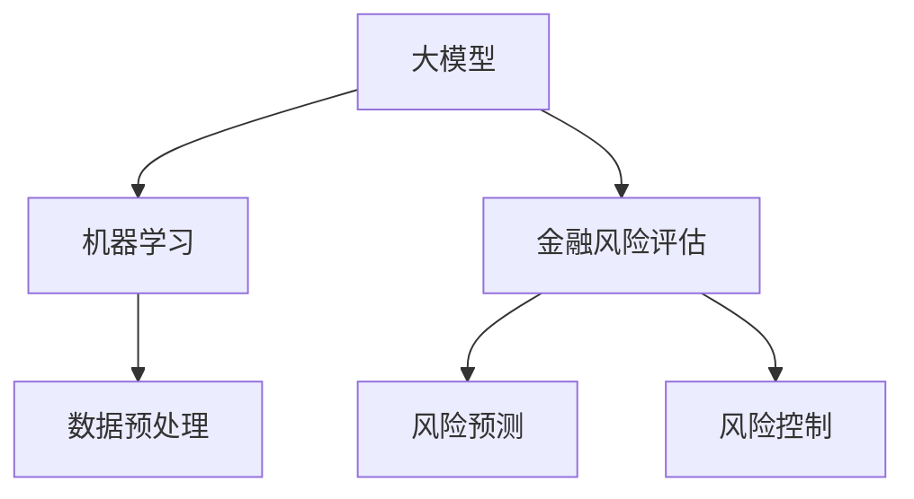
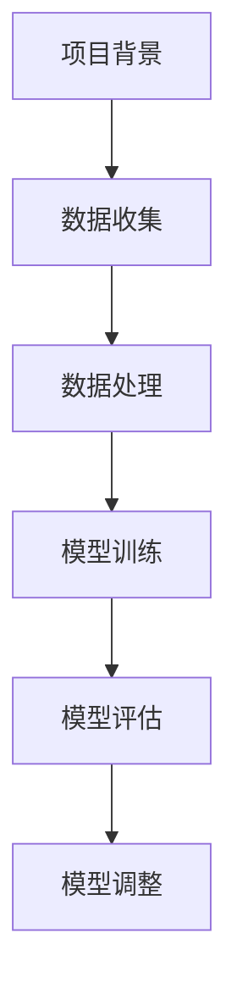

                 


为了撰写一篇高质量的技术博客文章《大模型在金融风险评估中的应用》，我们需要遵循以下步骤：

### 1. 确定文章结构和内容

首先，我们需要按照目录大纲结构确定文章的内容和结构。根据大纲，文章可以分为以下几个部分：

- **引言**：介绍大模型和金融风险评估的基本概念，以及它们之间的联系。
- **大模型基础**：讲解大模型的原理、架构和应用算法。
- **数学模型和公式**：详细解释大模型在金融风险评估中使用的数学模型和公式。
- **项目实战**：通过具体案例展示大模型在金融风险评估中的应用。
- **代码解读与分析**：提供实际代码实现，并进行解读和分析。
- **开发环境搭建与源代码实现**：介绍如何搭建开发环境，并提供源代码实现。

### 2. 核心概念与联系

在引言部分，我们需要首先介绍大模型和金融风险评估的基本概念。

- **大模型**：大模型是一种拥有数百万到数十亿参数的机器学习模型，如深度神经网络。它们能够自动从大量数据中学习复杂的模式。
- **金融风险评估**：金融风险评估是评估投资风险的过程，旨在预测潜在损失并采取相应措施。

然后，我们需要通过Mermaid流程图展示这两个概念之间的关系，如图：



### 3. 核心算法原理讲解

在核心算法原理讲解部分，我们需要详细讲解大模型在金融风险评估中的应用算法。

- **机器学习算法**：如逻辑回归、决策树、随机森林等。
- **深度学习算法**：如卷积神经网络（CNN）、循环神经网络（RNN）、生成对抗网络（GAN）等。

我们可以使用伪代码来阐述这些算法的基本原理：

```python
# 逻辑回归伪代码
def logistic_regression(X, y):
    # 初始化模型参数
    theta = initialize_parameters()
    # 设置迭代次数
    num_iterations = 1000
    # 设置学习率
    alpha = 0.01
    
    for i in range(num_iterations):
        # 前向传播
        z = X * theta
        h = sigmoid(z)
        # 计算损失函数
        loss = -1/m * (y * log(h) + (1 - y) * log(1 - h))
        # 反向传播
        dloss_dtheta = X.T * (h - y)
        # 更新参数
        theta -= alpha * dloss_dtheta
    
    return theta

# 卷积神经网络（CNN）伪代码
def conv_neural_network(X, y):
    # 初始化模型参数
    W_conv1, b_conv1 = initialize_parameters()
    # 设置迭代次数
    num_iterations = 1000
    
    for i in range(num_iterations):
        # 前向传播
        h_conv1 = conv2d_forward(X, W_conv1, b_conv1)
        # 池化
        h_pool1 = max_pool_2d_forward(h_conv1)
        # 反向传播
        dloss_dW_conv1, db_conv1 = conv2d_backward(h_pool1, X, y)
    
    return W_conv1, b_conv1
```

### 4. 数学模型和公式讲解

在数学模型和公式讲解部分，我们需要详细解释大模型在金融风险评估中使用的数学模型和公式。

- **风险评估指标**：如预期损失（Expected Loss, EL）、异常损失（Unexpected Loss, UL）等。
- **风险预测模型**：如线性回归、逻辑回归等。

我们可以使用LaTeX格式给出数学公式：

```latex
$$
EL = \int_{0}^{1} E[L(t)] dt
$$

$$
UL = 1 - \int_{0}^{1} P(L(t) \geq 0) dt
$$
```

### 5. 项目实战

在项目实战部分，我们需要通过具体案例展示如何使用大模型进行金融风险评估。

- **案例背景**：介绍项目的背景、目标和数据来源。
- **数据处理**：展示如何进行数据预处理，包括数据清洗、特征提取等。
- **模型训练**：展示如何使用大模型进行模型训练。
- **模型评估**：展示如何评估模型性能，并进行模型调整。

我们可以给出一个简化的项目流程图：



### 6. 代码解读与分析

在代码解读与分析部分，我们需要提供实际的代码实现，并进行详细解读和分析。

- **代码实现**：提供Python代码实现，包括数据预处理、模型训练、模型评估等。
- **代码解读**：解释代码中的关键步骤和参数设置。
- **应用解读**：分析代码在实际应用中的效果和局限性。

### 7. 开发环境搭建与源代码实现

在开发环境搭建与源代码实现部分，我们需要介绍如何搭建开发环境，并提供源代码实现。

- **环境搭建**：介绍如何安装和配置必要的软件和工具。
- **源代码实现**：提供完整的源代码，并进行详细注释。

### 8. 总结与拓展

最后，我们需要进行总结，并给出最佳实践 tips、注意事项、拓展阅读等内容。

### 文章撰写

根据以上步骤，我们可以开始撰写文章。在撰写过程中，需要注意以下几点：

- **文章格式**：使用markdown格式，确保文章的结构清晰。
- **内容完整性**：确保每个小节的内容丰富具体，核心内容完整。
- **代码示例**：提供实际的代码示例，并进行详细解读。
- **逻辑清晰**：确保文章的逻辑清晰，便于读者理解。

在撰写完初稿后，我们需要进行多次修改和润色，确保文章的质量和可读性。最后，在文章末尾添加作者信息和参考资料。完成这些步骤后，一篇高质量的技术博客文章《大模型在金融风险评估中的应用》就完成了。

