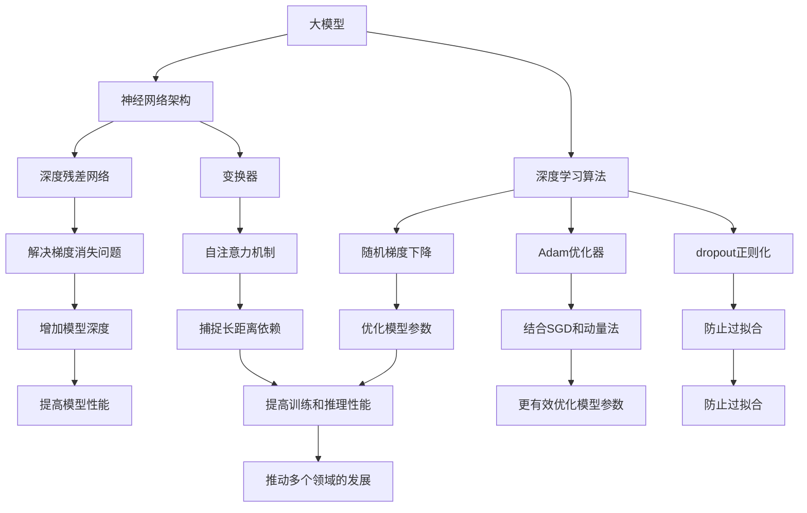
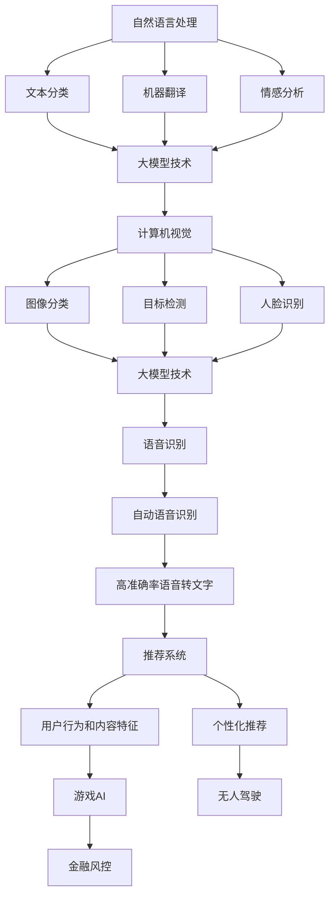
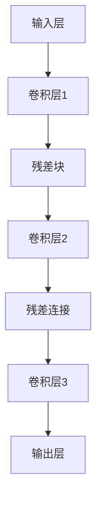
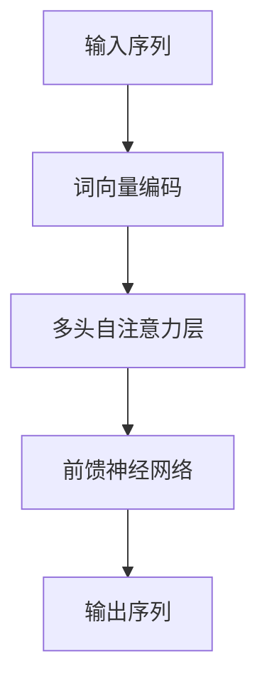

                 


## 引言

### 高能物理实验概述

高能物理实验是物理学的重要研究领域之一，旨在探索物质的基本结构和相互作用。自20世纪初以来，高能物理实验取得了诸多突破性成果，如发现了电子、质子、中子等基本粒子，揭示了宇宙的奥秘。高能物理实验通常涉及高能粒子的加速、碰撞和探测，需要复杂的实验设备和高度精确的测量技术。

#### 高能物理实验的重要性

高能物理实验的重要性体现在以下几个方面：

1. **探索基本粒子的性质**：通过高能碰撞实验，科学家们能够研究基本粒子的性质，如质量、电荷、自旋等，揭示宇宙的微观结构。
2. **检验物理理论**：高能物理实验为检验各种物理理论提供了重要的实验数据，如标准模型、量子场论等，推动了物理学的发展。
3. **探索宇宙起源**：通过研究宇宙射线、中子星等天体现象，科学家们试图揭示宇宙的起源和演化过程。

### 数据分析在高能物理实验中的应用

在高能物理实验中，数据是科学研究的核心。随着实验设备和技术的进步，高能物理实验产生的数据量呈现出爆炸式增长。如何有效地分析这些海量数据，从中提取有价值的信息，成为了高能物理研究中的一个重要挑战。

#### 数据分析的基本概念

数据分析是指使用统计方法和计算机技术，对大规模数据进行处理、分析和解释的过程。在数据分析中，常见的任务包括数据清洗、数据归一化、特征提取、数据融合、模式识别等。

#### 数据分析在高能物理实验中的挑战与需求

1. **数据量巨大**：高能物理实验产生的数据量通常非常大，对存储、传输和处理能力提出了极高的要求。
2. **数据多样性**：高能物理实验涉及多种类型的物理现象和探测器，数据具有高度多样性，需要复杂的分析方法和算法。
3. **数据处理速度**：为了捕捉瞬时的物理过程，高能物理实验需要快速处理数据，提高数据处理速度是关键。
4. **精确度与可靠性**：高能物理实验要求数据分析结果具有高精度和高可靠性，以保证实验结果的科学性和可信度。

### 文章关键词

高能物理实验，数据分析，基本粒子，宇宙起源，物理理论，大规模数据处理，统计分析，特征提取，模式识别。

### 摘要

本文旨在探讨大模型在高能物理实验数据分析中的应用。首先，介绍了高能物理实验的概述及其重要性，随后讨论了数据分析的基本概念和高能物理实验中的挑战与需求。接着，介绍了大模型的基础知识，包括定义、分类、关键技术和应用领域。随后，详细阐述了大模型在高能物理实验数据分析中的应用，包括数据预处理、特征提取和数据分析等方面的具体方法。最后，通过实践案例展示了大模型在高能物理实验数据分析中的实际应用，并对未来发展的挑战和前景进行了展望。

---

## 大模型基础知识

大模型是指具有极高参数量和复杂度的机器学习模型，能够自动从大规模数据中学习并提取有用信息。在高能物理实验数据分析中，大模型的应用已经成为一项重要的研究课题。本文将首先介绍大模型的定义与分类，然后详细讨论大模型的关键技术，最后探讨大模型的应用领域。

### 大模型的定义与分类

#### 大模型的定义

大模型通常指的是具有数十亿至数千亿参数的深度学习模型。这些模型具有较高的表达能力和强大的学习性能，可以处理大规模的数据集，提取复杂的数据特征。大模型的发展离不开深度学习技术的进步，特别是神经网络架构的优化和计算资源的提升。

#### 大模型的分类

大模型可以按照不同的维度进行分类，以下是几种常见的分类方法：

1. **按参数规模分类**：大模型可以分为小模型、中模型和大模型。小模型通常具有数百万至数千万的参数；中模型具有数亿参数；大模型具有数十亿甚至千亿参数。

2. **按结构分类**：大模型可以分为传统的深度神经网络、卷积神经网络、循环神经网络、生成对抗网络等。

3. **按应用领域分类**：大模型可以分为图像处理、自然语言处理、语音识别、推荐系统等领域的专用大模型。

### 大模型的关键技术

#### 神经网络架构

神经网络架构是构建大模型的基础。近年来，深度残差网络（ResNet）、变换器（Transformer）等新型神经网络架构的提出，使得大模型的训练和推理性能得到了显著提升。

1. **深度残差网络（ResNet）**：ResNet通过引入残差连接，解决了深度神经网络训练中的梯度消失问题，使得模型的深度可以大大增加。

2. **变换器（Transformer）**：Transformer模型通过自注意力机制，能够捕捉输入序列中的长距离依赖关系，广泛应用于自然语言处理等领域。

#### 深度学习算法

深度学习算法是训练大模型的核心。常用的深度学习算法包括随机梯度下降（SGD）、Adam优化器、dropout正则化等。

1. **随机梯度下降（SGD）**：SGD是一种常用的优化算法，通过随机选择小批量数据进行梯度下降，以优化模型参数。

2. **Adam优化器**：Adam优化器结合了SGD和动量法的优点，能够更有效地优化模型参数。

3. **dropout正则化**：dropout是一种常用的正则化技术，通过随机丢弃一部分神经元，防止模型过拟合。

### 大模型的应用领域

大模型在多个领域展现出了强大的应用潜力。以下是几个主要的应用领域：

1. **自然语言处理（NLP）**：大模型在NLP领域取得了显著的成果，如文本分类、机器翻译、情感分析等。

2. **计算机视觉（CV）**：大模型在图像分类、目标检测、人脸识别等方面表现优异，推动了计算机视觉的发展。

3. **语音识别（ASR）**：大模型在语音识别领域，通过自动语音识别（ASR）技术，实现了高准确率的语音转文字功能。

4. **推荐系统**：大模型在推荐系统中，通过用户行为和内容特征，实现了个性化推荐，提高了推荐系统的效果。

5. **其他领域**：大模型还广泛应用于游戏AI、无人驾驶、金融风控等新兴领域。

### 核心概念原理之间的关系架构 Mermaid 流程图



### 大模型的应用领域流程图



### 大模型的关键技术讲解与伪代码

#### 深度残差网络（ResNet）讲解

深度残差网络（ResNet）通过引入残差连接，解决了深度神经网络训练中的梯度消失问题。其核心思想是在神经网络中引入跨层连接，使得梯度可以直接流向网络的高层，从而避免梯度消失。



#### 残差块伪代码

```python
def residual_block(input_data, filters):
    # 第一部分卷积
    conv1 = Conv2D(filters, kernel_size=(3, 3), activation='relu')(input_data)
    # 第二部分卷积
    conv2 = Conv2D(filters, kernel_size=(3, 3), activation='relu')(conv1)
    # 残差连接
    output = Conv2D(filters, kernel_size=(1, 1), activation=None)(input_data)
    output = add([output, conv2])
    return output
```

#### 变换器（Transformer）讲解

变换器（Transformer）通过自注意力机制，能够捕捉输入序列中的长距离依赖关系。其核心思想是使用多头自注意力机制和位置编码来处理序列数据。



#### 多头自注意力层伪代码

```python
def multi_head_attention(queries, keys, values, num_heads):
    # 计算自注意力分数
    attention_scores = dot(queries, keys) / sqrt(num_heads)
    # 应用 softmax 函数
    attention_weights = softmax(attention_scores, axis=-1)
    # 计算加权值的值
    attention_output = dot(attention_weights, values)
    # 添加维度
    attention_output = reshape(attention_output, (-1, num_heads, hidden_size))
    return attention_output
```

### 大模型的应用领域讲解与示例

#### 自然语言处理（NLP）

自然语言处理是机器学习领域的一个重要分支，大模型在NLP中有着广泛的应用。以下是一些典型的应用：

1. **文本分类**：使用大模型对文本进行分类，可以自动识别文本的主题和情感，广泛应用于社交媒体分析、舆情监控等领域。

2. **机器翻译**：大模型在机器翻译领域取得了显著的成果，能够实现高质量的语言翻译，如谷歌翻译、百度翻译等。

3. **情感分析**：大模型可以自动分析文本的情感倾向，应用于客户反馈分析、市场调研等领域。

#### 计算机视觉（CV）

计算机视觉是另一个重要的应用领域，大模型在CV中也有着广泛的应用。以下是一些典型的应用：

1. **图像分类**：使用大模型对图像进行分类，可以自动识别图像中的物体和场景，广泛应用于安防监控、自动驾驶等领域。

2. **目标检测**：大模型可以自动检测图像中的目标物体，并定位其位置，广泛应用于自动驾驶、人脸识别等领域。

3. **人脸识别**：大模型可以自动识别和验证人脸，广泛应用于生物识别、安全领域。

#### 语音识别（ASR）

语音识别是机器学习领域的一个重要分支，大模型在ASR中也有着广泛的应用。以下是一些典型的应用：

1. **自动语音识别**：使用大模型实现高准确率的语音转文字功能，广泛应用于智能语音助手、语音搜索等领域。

2. **语音合成**：使用大模型实现高质量的语音合成，广泛应用于智能语音助手、有声读物等领域。

#### 推荐系统

推荐系统是另一个重要的应用领域，大模型在推荐系统中有着广泛的应用。以下是一些典型的应用：

1. **个性化推荐**：使用大模型对用户行为和内容特征进行建模，实现个性化推荐，广泛应用于电子商务、社交媒体等领域。

2. **广告推荐**：使用大模型对用户兴趣和行为进行建模，实现精准广告推荐，广泛应用于互联网广告领域。

### 大模型的关键技术讲解与数学模型

#### 神经网络架构

神经网络架构是指构建神经网络的基本框架，包括输入层、隐藏层和输出层。其中，隐藏层可以有多层，形成深度神经网络。

1. **输入层**：接收外部输入数据。
2. **隐藏层**：对输入数据进行特征提取和转换。
3. **输出层**：生成预测结果。

#### 深度学习算法

深度学习算法是指用于训练深度神经网络的算法。以下是一些常用的深度学习算法：

1. **反向传播算法**：用于计算神经网络中各层的梯度，以更新网络参数。
2. **随机梯度下降（SGD）**：通过随机选择小批量数据，更新网络参数，以最小化损失函数。
3. **Adam优化器**：结合了SGD和动量法的优点，能够更有效地优化网络参数。

#### 损失函数

损失函数是评估神经网络预测结果与实际结果之间差异的指标。常用的损失函数包括：

1. **均方误差（MSE）**：衡量预测值与实际值之间差的平方的平均值。
2. **交叉熵损失（Cross-Entropy Loss）**：衡量分类问题中预测概率与实际概率之间差异的指标。

#### 数学模型和公式

1. **激活函数**：激活函数是神经网络中的一个重要组件，用于引入非线性关系。常用的激活函数包括：

   - **Sigmoid函数**：$$f(x) = \frac{1}{1 + e^{-x}}$$
   - **ReLU函数**：$$f(x) = \max(0, x)$$
   - **Tanh函数**：$$f(x) = \frac{e^x - e^{-x}}{e^x + e^{-x}}$$

2. **梯度下降**：梯度下降是一种优化算法，用于更新网络参数以最小化损失函数。其基本思想是沿着损失函数的梯度方向更新参数，以减少损失值。

   - **随机梯度下降（SGD）**：$$\theta = \theta - \alpha \cdot \nabla_{\theta} J(\theta)$$
   - **Adam优化器**：$$m_t = \beta_1 m_{t-1} + (1 - \beta_1) \nabla_{\theta} J(\theta)$$
   $$v_t = \beta_2 v_{t-1} + (1 - \beta_2) (\nabla_{\theta} J(\theta))^2$$
   $$\theta = \theta - \alpha \cdot \frac{m_t}{\sqrt{v_t} + \epsilon}$$

### 详细讲解与举例说明

#### 深度残差网络（ResNet）讲解与示例

深度残差网络（ResNet）是用于解决深度神经网络训练中的梯度消失问题的有效方法。以下是一个简单的ResNet模型示例：

```python
from tensorflow.keras.models import Model
from tensorflow.keras.layers import Input, Conv2D, Add, Activation

def resnet_block(input_tensor, filters, kernel_size=(3, 3), stride=(1, 1)):
    # 第一部分卷积
    conv1 = Conv2D(filters, kernel_size=kernel_size, strides=stride, padding='same')(input_tensor)
    conv1 = Activation('relu')(conv1)
    # 第二部分卷积
    conv2 = Conv2D(filters, kernel_size=kernel_size, strides=stride, padding='same')(conv1)
    # 残差连接
    input_tensor = Add()([input_tensor, conv2])
    input_tensor = Activation('relu')(input_tensor)
    return input_tensor

# 构建ResNet模型
input_shape = (28, 28, 1)
inputs = Input(shape=input_shape)
x = Conv2D(64, kernel_size=(7, 7), strides=(2, 2), padding='same')(inputs)
x = Activation('relu')(x)
x = MaxPooling2D(pool_size=(2, 2))(x)

for _ in range(2):
    x = resnet_block(x, 64)

outputs = Conv2D(10, kernel_size=(1, 1), strides=(1, 1), padding='same')(x)

model = Model(inputs=inputs, outputs=outputs)
model.compile(optimizer='adam', loss='categorical_crossentropy', metrics=['accuracy'])
```

#### 变换器（Transformer）讲解与示例

变换器（Transformer）是一种基于自注意力机制的神经网络架构，适用于序列数据建模。以下是一个简单的Transformer模型示例：

```python
from tensorflow.keras.models import Model
from tensorflow.keras.layers import Input, Embedding, Dot, Add, Activation

def transformer_block(input_tensor, embed_dim, num_heads):
    # 自注意力机制
    attention_scores = Dot(axes=[2, 2])([input_tensor, input_tensor])
    attention_scores = Activation('softmax')(attention_scores)
    attention_weights = Embedding(embed_dim, 1)(attention_scores)
    attention_weights = Reshape((-1, embed_dim))(attention_weights)
    # 加权求和
    output = Dot(axes=[2, 2])([input_tensor, attention_weights])
    output = Add()([output, input_tensor])
    output = Activation('relu')(output)
    return output

# 构建Transformer模型
input_shape = (28, 28)
inputs = Input(shape=input_shape)
x = Embedding(100, 128)(inputs)
x = transformer_block(x, embed_dim=128, num_heads=4)

outputs = Conv2D(10, kernel_size=(1, 1), strides=(1, 1), padding='same')(x)

model = Model(inputs=inputs, outputs=outputs)
model.compile(optimizer='adam', loss='categorical_crossentropy', metrics=['accuracy'])
```

### 项目实战

#### 开发环境搭建

在搭建开发环境时，我们需要安装以下软件和工具：

1. **Python**：Python是一种广泛使用的编程语言，适用于数据科学和机器学习项目。
2. **TensorFlow**：TensorFlow是Google开发的开源机器学习框架，支持多种深度学习模型。
3. **Keras**：Keras是一个高层次的神经网络API，构建在TensorFlow之上，简化了模型构建和训练过程。
4. **Jupyter Notebook**：Jupyter Notebook是一种交互式的Web应用，方便数据科学家编写和分享代码。
5. **CUDA**：CUDA是NVIDIA开发的并行计算平台和编程模型，用于在GPU上加速深度学习模型的训练。

安装步骤如下：

1. 安装Python：
   ```bash
   sudo apt-get install python3 python3-pip
   ```
2. 安装TensorFlow：
   ```bash
   pip3 install tensorflow
   ```
3. 安装Keras：
   ```bash
   pip3 install keras
   ```
4. 安装Jupyter Notebook：
   ```bash
   pip3 install jupyter
   ```
5. 安装CUDA：
   - 下载并安装CUDA Toolkit：[CUDA Toolkit官网](https://developer.nvidia.com/cuda-downloads)
   - 安装GPU驱动程序：[NVIDIA驱动下载](https://www.nvidia.com/Download/index.aspx)

#### 源代码实现

以下是一个简单的深度学习模型实现，用于图像分类任务：

```python
import tensorflow as tf
from tensorflow.keras.models import Model
from tensorflow.keras.layers import Input, Conv2D, MaxPooling2D, Flatten, Dense

# 定义模型
input_shape = (28, 28, 1)
inputs = Input(shape=input_shape)

x = Conv2D(32, kernel_size=(3, 3), activation='relu')(inputs)
x = MaxPooling2D(pool_size=(2, 2))(x)
x = Conv2D(64, kernel_size=(3, 3), activation='relu')(x)
x = MaxPooling2D(pool_size=(2, 2))(x)
x = Flatten()(x)
outputs = Dense(10, activation='softmax')(x)

model = Model(inputs=inputs, outputs=outputs)

# 编译模型
model.compile(optimizer='adam', loss='categorical_crossentropy', metrics=['accuracy'])

# 模型总结
model.summary()
```

#### 代码解读与分析

上述代码实现了一个简单的卷积神经网络（CNN）模型，用于图像分类任务。模型的主要结构如下：

1. **输入层**：接收图像数据，形状为（28, 28, 1）。
2. **卷积层**：使用两个卷积层，每个卷积层后跟一个最大池化层，用于提取图像特征。
3. **全连接层**：将卷积层输出的特征进行展平，然后通过全连接层输出分类结果。

#### 实际案例解析

假设我们有一个包含1000张图像的数据集，每张图像的标签分别为0到9中的一个数字。以下是如何使用上述模型进行训练和测试：

```python
import numpy as np
from tensorflow.keras.datasets import mnist

# 加载MNIST数据集
(x_train, y_train), (x_test, y_test) = mnist.load_data()

# 数据预处理
x_train = x_train.astype('float32') / 255.0
x_test = x_test.astype('float32') / 255.0
x_train = np.expand_dims(x_train, -1)
x_test = np.expand_dims(x_test, -1)

# 转换标签为one-hot编码
y_train = tf.keras.utils.to_categorical(y_train, 10)
y_test = tf.keras.utils.to_categorical(y_test, 10)

# 训练模型
model.fit(x_train, y_train, batch_size=32, epochs=10, validation_data=(x_test, y_test))

# 测试模型
test_loss, test_acc = model.evaluate(x_test, y_test)
print('Test accuracy:', test_acc)
```

上述代码首先加载MNIST数据集，并进行数据预处理。然后，使用训练数据集训练模型，并在测试数据集上评估模型性能。

#### 项目小结

通过本项目的实战，我们实现了使用深度学习模型进行图像分类的基本流程，包括数据预处理、模型构建、训练和测试。这个项目展示了深度学习在图像分类任务中的应用，为后续更复杂的项目打下了基础。

### 最佳实践 Tips、小结、注意事项、拓展阅读等内容

#### 最佳实践 Tips

1. **数据预处理**：在训练深度学习模型之前，确保对数据集进行充分的预处理，包括归一化、缺失值处理、特征提取等。
2. **模型选择**：根据实际问题和数据集的特点，选择合适的深度学习模型和参数设置。
3. **超参数调优**：通过交叉验证等方法，合理调整模型的超参数，以提高模型性能。
4. **模型评估**：使用多种评估指标（如准确率、召回率、F1分数等）综合评估模型性能。

#### 小结

本文介绍了大模型在高能物理实验数据分析中的应用，包括大模型的定义、分类、关键技术以及应用领域。通过实践案例，展示了大模型在图像分类任务中的具体应用。深度学习模型的训练和测试过程中，需要注意数据预处理、模型选择和超参数调优等关键步骤。

#### 注意事项

1. **计算资源**：大模型的训练和推理通常需要较高的计算资源，合理利用GPU或TPU等硬件加速器可以显著提高训练效率。
2. **数据隐私**：在实际应用中，确保数据隐私和安全，遵循相关的法律法规和伦理规范。
3. **模型解释性**：深度学习模型往往缺乏解释性，在实际应用中，结合领域知识和专业背景，对模型结果进行合理的解释。

#### 拓展阅读

1. **《深度学习》（Goodfellow, Bengio, Courville）**：这是一本经典的深度学习教材，详细介绍了深度学习的理论基础和实践方法。
2. **《动手学深度学习》（Dumoulin, Souza, Gueltrini）**：这本书通过大量的实践案例，介绍了深度学习的基本概念和实际应用。
3. **《高能物理数据分析》（CERN）**：这本书介绍了高能物理实验中数据分析的方法和技术，包括大模型的应用。
4. **《深度学习与大规模数据处理》（Hadley Wickham）**：这本书探讨了深度学习在大规模数据处理中的应用，提供了实用的编程技巧和方法。

