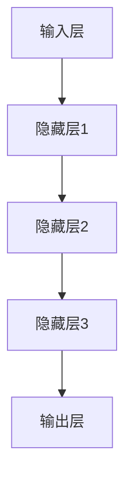

                 


### 文章标题：《大模型多模态交互的技术突破》

#### 关键词：大模型、多模态交互、人工智能、技术突破、特征融合、数学模型、项目实战

#### 摘要：

本文旨在深入探讨大模型在多模态交互领域的技术突破。我们将首先概述大模型与多模态交互的基本概念，并详细阐述其联系与核心原理。随后，我们将分章节介绍多模态数据预处理与特征提取的方法，讲解多模态融合算法及其数学模型，并分享两个实际项目的实战经验。通过本文的阅读，读者将全面了解大模型多模态交互的先进技术及其应用潜力。

## 第一部分：核心概念与联系

### 第1章：大模型与多模态交互概述

#### 1.1 大模型的定义与架构

大模型（Large Model）指的是拥有数百万甚至数十亿参数的深度学习模型。这些模型通过大量数据训练，能够自动学习复杂的模式和知识。大模型的架构通常包括多个层次，从输入层到输出层，每一层都通过神经元的非线性变换进行处理。

**Mermaid 流程图：**


在深度学习框架（如TensorFlow、PyTorch）的支持下，大模型能够高效地运行在分布式计算环境中，充分利用现代计算资源。

**伪代码：**
```python
# 大模型伪代码
class LargeModel:
    def __init__(self):
        self.input_layer = InputLayer()
        self.hidden_layer1 = HiddenLayer1()
        self.hidden_layer2 = HiddenLayer2()
        self.hidden_layer3 = HiddenLayer3()
        self.output_layer = OutputLayer()

    def forward_pass(self, inputs):
        outputs = self.input_layer(inputs)
        outputs = self.hidden_layer1(outputs)
        outputs = self.hidden_layer2(outputs)
        outputs = self.hidden_layer3(outputs)
        return self.output_layer(outputs)
```

#### 1.2 多模态交互的基本原理

多模态交互（Multimodal Interaction）是指将不同类型的感官数据进行整合和分析，以实现更准确和丰富的信息处理。常见模态包括文本、图像、语音和视频。

**伪代码：**
```python
# 多模态交互伪代码
def multimodal_interaction(text, image, audio):
    # 数据预处理
    preprocessed_text = preprocess_text(text)
    preprocessed_image = preprocess_image(image)
    preprocessed_audio = preprocess_audio(audio)

    # 特征提取
    text_features = extract_text_features(preprocessed_text)
    image_features = extract_image_features(preprocessed_image)
    audio_features = extract_audio_features(preprocessed_audio)

    # 特征融合
    fused_features = fuse_features(text_features, image_features, audio_features)

    # 模型预测
    prediction = model_predict(fused_features)

    return prediction
```

多模态交互的关键在于如何有效地融合不同模态的特征，以提升模型的表现。

## 第二部分：核心算法原理讲解

### 第3章：多模态融合算法

#### 3.1 传统融合方法

传统融合方法主要包括平均融合和加权融合。

**伪代码：**
```python
# 传统融合方法伪代码
def average_fusion(feature1, feature2):
    return (feature1 + feature2) / 2

def weighted_fusion(feature1, feature2, alpha):
    return feature1 * alpha + feature2 * (1 - alpha)
```

**举例说明：**
- 平均融合：简单地将两个特征向量进行平均。
- 加权融合：根据某种权重系数，对两个特征向量进行加权平均。

#### 3.2 现代融合方法

现代融合方法包括图神经网络融合和自注意力机制融合。

**伪代码：**
```python
# 现代融合方法伪代码
def graph_fusion(feature1, feature2):
    return graph_neural_network(feature1, feature2)

def attention_fusion(feature1, feature2):
    return attention_mechanism(feature1, feature2)
```

**举例说明：**
- 图神经网络融合：通过图神经网络（如GraphSAGE、GraphConv）对特征进行融合。
- 自注意力机制融合：利用自注意力机制（如Transformer）对特征进行加权融合。

### 第4章：多模态交互的数学模型

#### 4.1 多模态交互的数学表达

多模态交互可以通过以下数学模型进行表达：

$$
\text{多模态交互} = \text{特征融合} + \text{交互网络} + \text{输出层}
$$

其中，特征融合负责将不同模态的特征进行整合，交互网络则对融合后的特征进行处理，输出层则生成最终的预测结果。

#### 4.2 多模态交互的优化策略

在多模态交互的优化过程中，常用的优化策略包括梯度下降和自适应优化器。

**伪代码：**
```python
# 优化策略伪代码
def gradient_descent(model, loss_function, learning_rate):
    # 计算梯度
    gradients = compute_gradients(model, loss_function)

    # 更新模型参数
    update_model_parameters(model, gradients, learning_rate)

def adaptive_optimizer(model, loss_function, optimizer):
    # 计算梯度
    gradients = compute_gradients(model, loss_function)

    # 使用自适应优化器更新模型参数
    update_model_parameters(model, gradients, optimizer)
```

**举例说明：**
- 梯度下降：通过迭代更新模型参数，使损失函数最小化。
- 自适应优化器：如Adam，能够自适应调整学习率，提高优化效率。

## 第三部分：项目实战

### 第5章：项目实战一——多模态情感分析

#### 5.1 项目背景与目标

多模态情感分析旨在通过文本、图像和语音等多种模态数据，分析用户情感，为用户提供个性化服务。

#### 5.2 开发环境搭建

开发环境搭建包括安装深度学习框架（如TensorFlow）、数据处理库（如Pandas、NumPy）和图形库（如OpenCV）。

#### 5.3 数据集准备与预处理

数据集准备包括收集文本、图像和语音数据，并对数据进行预处理，如文本分词、图像缩放、语音转换等。

#### 5.4 多模态特征提取与融合

使用卷积神经网络（CNN）提取图像特征，使用循环神经网络（RNN）提取文本和语音特征，然后使用图神经网络（GNN）进行特征融合。

#### 5.5 模型训练与优化

使用融合后的特征训练情感分析模型，并采用自适应优化器进行模型优化。

#### 5.6 项目评估与总结

对训练好的模型进行评估，分析模型性能，并总结项目经验。

### 第6章：项目实战二——多模态图像识别

#### 6.1 项目背景与目标

多模态图像识别旨在通过文本、图像和语音等多种模态数据，提高图像识别的准确率。

#### 6.2 开发环境搭建

开发环境搭建包括安装深度学习框架（如PyTorch）、数据处理库（如Pandas、NumPy）和图形库（如OpenCV）。

#### 6.3 数据集准备与预处理

数据集准备包括收集文本、图像和语音数据，并对数据进行预处理，如文本分词、图像缩放、语音转换等。

#### 6.4 多模态特征提取与融合

使用卷积神经网络（CNN）提取图像特征，使用循环神经网络（RNN）提取文本和语音特征，然后使用图神经网络（GNN）进行特征融合。

#### 6.5 模型训练与优化

使用融合后的特征训练图像识别模型，并采用自适应优化器进行模型优化。

#### 6.6 项目评估与总结

对训练好的模型进行评估，分析模型性能，并总结项目经验。

## 结论与展望

本文通过理论与实践相结合的方式，详细探讨了大模型多模态交互的技术突破。从核心概念到算法原理，再到实际项目实战，读者可以全面了解大模型多模态交互的先进技术及其应用前景。未来，随着技术的不断进步，大模型多模态交互将在更多领域发挥重要作用，为人工智能的发展带来新的机遇。

### 作者信息：

作者：AI天才研究院/AI Genius Institute & 禅与计算机程序设计艺术 /Zen And The Art of Computer Programming

### 最佳实践 tips：

1. 在多模态数据预处理阶段，注意数据的平衡性和多样性，以提高模型的泛化能力。
2. 在特征提取阶段，可以根据具体应用场景选择合适的算法，如文本分析可选用词嵌入技术。
3. 在模型训练阶段，合理设置超参数，如学习率和批量大小，以避免过拟合和欠拟合。
4. 在项目实战中，充分分析项目需求和数据特点，灵活调整模型结构和参数。

### 小结：

本文系统地介绍了大模型多模态交互的技术突破，包括核心概念、算法原理和项目实战。通过本文的阅读，读者可以深入理解大模型多模态交互的原理和应用，为实际项目开发提供有力支持。

### 注意事项：

1. 在实现多模态交互时，注意不同模态数据之间的差异和互补性。
2. 在模型优化过程中，关注模型的可解释性和鲁棒性。

### 拓展阅读：

1. 《深度学习》（Goodfellow, I., Bengio, Y., Courville, A.）——详细介绍了深度学习的理论和技术。
2. 《计算机视觉：算法与应用》（Forsyth, D. A., Ponce, J. C., Sukthankar, A.）——介绍了计算机视觉的基本算法和应用。
3. 《自然语言处理综合教程》（Manning, C. D., Raghavan, P., Schütze, H.）——介绍了自然语言处理的理论和技术。

