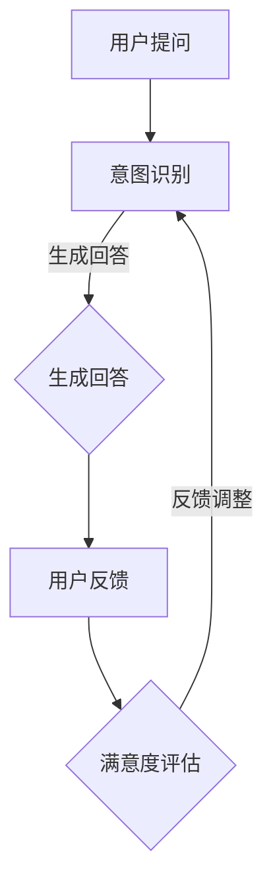
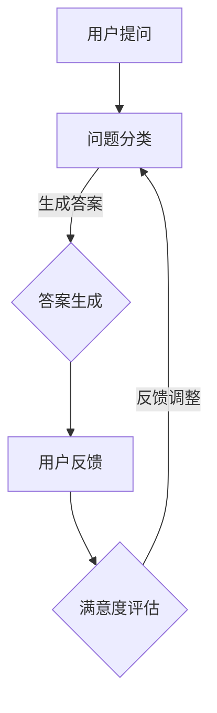
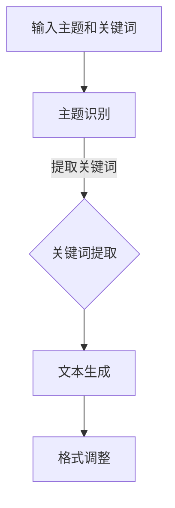

                 


### 文章标题

《大模型安全性评估：提示词设计的关键角色》

### 文章关键词

大模型、安全性评估、提示词设计、人工智能、机器学习

### 文章摘要

随着人工智能技术的飞速发展，大模型的应用日益广泛，其安全性和可靠性备受关注。本文旨在探讨大模型安全性评估的核心环节——提示词设计的重要性。通过详细解析提示词的设计原理、工具和框架，结合实际案例，我们将揭示如何通过优化提示词设计来提升大模型的安全性，为人工智能应用提供坚实的保障。

---

### 第1章 引言

随着深度学习和神经网络技术的不断发展，大模型（Large Models）已经成为人工智能领域的研究热点。大模型具有强大的数据处理能力和智能表现，但其复杂性和不可解释性也带来了许多新的挑战，尤其是安全性问题。因此，对大模型进行安全性评估成为了当前研究的重点。

安全性评估是指对大模型在各种攻击环境下的安全性进行全面分析和验证。这一过程不仅涉及大模型的内部结构，还涉及到其与外部环境的交互。其中，提示词（Prompt）设计扮演着关键角色。提示词是用户与大模型交互的入口，通过精心设计的提示词，可以引导大模型表现出所需的行为，同时避免潜在的安全风险。

本章将首先介绍大模型的崛起与挑战，阐述安全性评估的重要性，并探讨提示词设计在这一过程中的关键角色。随后，我们将对全文的结构进行概述，以便读者对后续内容有更清晰的认识。

---

### 第2章 大模型概述

#### 2.1 大模型的基本概念

大模型，顾名思义，是指拥有巨大参数量、能够处理大量数据的神经网络模型。这些模型通过学习海量的数据，能够自动提取复杂的特征，并利用这些特征进行预测、分类和生成等任务。大模型的主要特征包括：

1. **高参数量**：大模型的参数数量可以达到数百万甚至数十亿。这使它们在处理复杂任务时具有更强的表现力。
2. **海量数据需求**：大模型需要大量标注数据来训练，以保证其性能和泛化能力。
3. **计算资源消耗**：由于参数量和数据量的巨大，大模型的训练和推理过程需要大量的计算资源。

大模型的应用领域广泛，包括自然语言处理、计算机视觉、语音识别等。例如，在自然语言处理领域，GPT-3、BERT等大模型已经取得了显著的成果，能够实现高质量的文本生成、翻译和问答等功能。

#### 2.2 大模型的架构和原理

大模型的架构通常基于多层神经网络，包括输入层、隐藏层和输出层。每一层都包含大量的神经元，神经元之间通过权重进行连接。大模型的训练过程是通过反向传播算法不断调整权重，使模型能够更好地拟合训练数据。

大模型的工作原理可以概括为以下几点：

1. **前向传播**：输入数据通过网络传递到各个隐藏层，经过非线性变换后，最终输出预测结果。
2. **反向传播**：根据预测结果与实际结果的差异，通过反向传播算法调整网络权重，以减少预测误差。
3. **优化算法**：常用的优化算法包括随机梯度下降（SGD）、Adam等，这些算法能够加速模型的训练过程。

#### 2.3 大模型的发展历程

大模型的发展历程可以分为以下几个阶段：

1. **浅层神经网络阶段**：以1990年代初期为代表的简单神经网络，如感知机、多层感知机等。这些模型由于计算能力和数据量的限制，难以处理复杂任务。
2. **深度学习阶段**：随着计算能力的提升和数据量的增加，深度学习（Deep Learning）开始崭露头角。2006年，Hinton提出了深度信念网络（DBN），标志着深度学习的新纪元。
3. **大模型时代**：2012年，AlexNet在ImageNet比赛中取得了突破性的成绩，激发了研究人员对大模型的兴趣。此后，GPT、BERT等大模型相继出现，推动了人工智能的快速发展。

通过以上对大模型的基本概念、架构和原理的介绍，我们可以更好地理解大模型在人工智能领域的重要性。在接下来的章节中，我们将深入探讨大模型的安全性评估，特别是提示词设计的关键角色。

---

### 第3章 大模型安全性评估的基本概念

#### 3.1 安全性评估的目标和挑战

大模型的安全性评估旨在确保模型在各种攻击环境下的可靠性和完整性。具体目标包括：

1. **防护攻击**：检测和防御各种针对大模型的攻击，如恶意输入、数据注入、模型篡改等。
2. **评估风险**：评估大模型在特定应用场景下的安全风险，并采取相应的措施进行风险控制。
3. **提高可信度**：通过安全性评估，提高用户对大模型的安全信任，增强大模型的可用性和可靠性。

然而，大模型的安全性评估面临着诸多挑战：

1. **复杂性**：大模型的架构和训练过程复杂，使得安全性分析变得更加困难。
2. **数据隐私**：大模型在训练和推理过程中处理大量敏感数据，如何保护数据隐私成为一大挑战。
3. **计算资源消耗**：安全性评估通常需要进行大量的模拟和验证，消耗大量计算资源。

#### 3.2 安全性评估的分类和方法

安全性评估可以分为以下几类：

1. **静态分析**：通过分析模型的架构、代码和数据结构，发现潜在的安全问题。例如，代码审计、依赖分析等。
2. **动态分析**：通过运行模型并观察其行为，检测实际运行过程中出现的安全问题。例如，渗透测试、动态代码分析等。
3. **模型验证**：对大模型进行验证，确保其输出结果符合预期。例如，模型测试、对比测试等。

常用的安全性评估方法包括：

1. **攻击模拟**：模拟各种攻击手段，测试大模型的防御能力。例如，恶意输入攻击、对抗性攻击等。
2. **安全测试**：通过自动化工具或人工测试，检测大模型中的安全漏洞。例如，安全测试工具、代码审查等。
3. **安全性度量**：定义一系列指标，评估大模型的安全性。例如，误报率、召回率等。

#### 3.3 安全性评估的关键要素

大模型安全性评估的关键要素包括：

1. **模型架构**：评估模型的架构设计是否符合安全性要求，是否存在潜在的漏洞。
2. **训练数据**：评估训练数据的质量和来源，确保数据安全性和隐私保护。
3. **输入输出**：分析输入数据和输出结果的安全性，确保模型不会受到恶意输入的影响。
4. **防护措施**：评估模型在应对攻击时的防护能力，包括检测、防御和恢复机制。

通过以上对大模型安全性评估的基本概念、分类和方法及关键要素的介绍，我们可以更好地理解大模型安全性评估的复杂性和重要性。在接下来的章节中，我们将深入探讨提示词设计在大模型安全性评估中的关键角色。

---

### 第4章 提示词设计原理

#### 4.1 提示词的定义和作用

提示词（Prompt）是指用户向大模型提供的引导信息，用于指定模型的行为和输出。提示词的作用主要包括：

1. **指定任务**：通过提示词，用户可以明确告知模型需要完成的任务，如文本生成、情感分析等。
2. **引导模型**：提示词可以引导模型关注特定的数据和特征，从而提高模型的性能和准确性。
3. **控制输出**：提示词可以控制模型的输出格式和内容，使其满足特定需求。

提示词的设计需要考虑以下几个方面：

1. **明确性**：提示词应明确、简洁，避免模糊不清或歧义，以确保模型能够准确理解用户的意图。
2. **适应性**：提示词应具有适应性，能够根据不同任务和场景进行调整和优化。
3. **一致性**：提示词应与模型的训练数据和目标保持一致，以确保模型输出符合预期。

#### 4.2 提示词设计的原则

提示词设计应遵循以下原则：

1. **用户导向**：以用户需求为导向，确保提示词能够满足用户的具体需求和目标。
2. **简洁明了**：尽量简化提示词，避免冗长和复杂，以提高用户理解和操作便利性。
3. **灵活性**：设计灵活的提示词，以适应不同场景和任务的变化。
4. **可扩展性**：确保提示词设计具有可扩展性，能够支持未来任务和场景的扩展。

#### 4.3 提示词设计的策略

提示词设计可以采用以下策略：

1. **模板法**：使用固定的模板设计提示词，根据不同任务进行参数调整。例如，文本生成任务的提示词模板可以是“请生成一篇关于XX的文章”。
2. **关键词法**：通过关键词引导模型关注特定的数据和特征。例如，在情感分析任务中，可以使用关键词“快乐”、“悲伤”等来引导模型。
3. **引导法**：使用引导性语言，明确告知模型需要完成的具体任务和步骤。例如，在问答任务中，可以使用“请回答以下问题：XX”来引导模型。

通过以上对提示词设计原理的介绍，我们可以更好地理解提示词在大模型应用中的关键作用。在接下来的章节中，我们将进一步探讨提示词设计工具和框架，以及实际案例中的应用。

---

### 第5章 提示词设计工具和框架

#### 5.1 常见的提示词设计工具

在人工智能领域，有许多工具和框架可以帮助我们设计和优化提示词。以下是一些常见的工具：

1. **自然语言处理工具**：如NLTK、spaCy、nltk等，这些工具提供了丰富的自然语言处理功能，可以帮助我们提取关键词、进行词性标注等。
2. **生成对抗网络（GAN）**：GAN可以生成高质量的文本，为提示词设计提供丰富的素材。例如，GPT-2和GPT-3等模型都可以用于文本生成。
3. **提示词生成器**：一些开源的提示词生成工具，如PromptGenius，可以帮助我们快速生成高质量的提示词。

#### 5.2 提示词设计框架介绍

提示词设计框架是用于系统化地设计、优化和评估提示词的框架。以下是一些常见的提示词设计框架：

1. **任务导向框架**：根据具体任务需求，设计相应的提示词。例如，在文本生成任务中，可以使用模板法生成提示词。
2. **数据驱动框架**：根据训练数据和模型性能，动态调整提示词。例如，在情感分析任务中，可以使用关键词法引导模型关注特定情感。
3. **混合框架**：结合多种方法，设计出更加灵活和高效的提示词。例如，可以结合模板法和关键词法，根据不同场景进行灵活调整。

#### 5.3 提示词设计工具的比较与选择

在选择提示词设计工具和框架时，需要考虑以下几个方面：

1. **任务需求**：根据具体任务需求，选择合适的工具和框架。例如，在文本生成任务中，可以使用GAN进行高质量文本生成。
2. **性能表现**：评估不同工具和框架的性能表现，选择能够满足需求且性能优越的工具。
3. **易用性**：考虑工具和框架的易用性，以便于快速设计和调整提示词。
4. **扩展性**：选择具有良好扩展性的工具和框架，以便于未来任务的扩展和优化。

通过以上对提示词设计工具和框架的介绍，我们可以更好地理解如何选择和利用这些工具，以提高提示词设计的效率和质量。在接下来的章节中，我们将通过具体案例研究，进一步探讨提示词设计在实际应用中的效果和挑战。

---

### 第6章 提示词设计案例研究

在本章中，我们将通过三个具体案例，深入探讨提示词设计在大模型应用中的实际效果和挑战。

#### 6.1 案例一：聊天机器人

聊天机器人是应用大模型技术的重要领域之一。以下是聊天机器人中提示词设计的具体应用：

**背景介绍**：某公司开发了一款基于大模型的聊天机器人，用于提供客户服务。用户可以通过文字或语音与聊天机器人进行交互，获取所需的信息或解决疑问。

**核心概念与联系**：在这个案例中，提示词的设计需要考虑用户的提问类型、回答格式和交互流程。核心概念包括：

1. **用户意图识别**：通过提示词引导模型识别用户的意图，如查询信息、投诉建议等。
2. **回答生成**：根据识别的用户意图，生成合适的回答，满足用户需求。
3. **交互流程**：设计合理的交互流程，提高用户的满意度。

**Mermaid流程图**：


**核心算法原理讲解与伪代码**：

伪代码如下：
```python
def user_intent_recognition(prompt):
    # 使用神经网络模型识别用户意图
    intent = model.predict(prompt)
    return intent

def generate_response(intent):
    # 根据用户意图生成回答
    response = ""
    if intent == "query":
        response = "您的问题是什么？"
    elif intent == "complaint":
        response = "您有什么建议或投诉？"
    return response

def chat():
    while True:
        prompt = get_user_input()
        intent = user_intent_recognition(prompt)
        response = generate_response(intent)
        print(response)
        feedback = get_user_feedback()
        if feedback == "satisfied":
            break
```

**数学模型和公式**：
```latex
P(response|intent) = \arg\max_{response} P(response, intent)
```

**举例说明**：
用户提问：“你们的服务有什么优惠吗？”
意图识别：查询
生成回答：“目前我们正在进行促销活动，您可以在主页上查看详细信息。”

**项目实战**：
1. **开发环境搭建**：使用Python和TensorFlow搭建聊天机器人环境。
2. **源代码详细实现和代码解读**：实现用户意图识别、回答生成和交互流程。
3. **代码应用解读与分析**：通过实际运行和分析，评估聊天机器人的性能和用户体验。
4. **实际案例分析和详细讲解剖析**：分析用户提问和回答，探讨如何优化提示词设计。
5. **项目小结**：总结项目经验和教训，提出改进建议。

通过这个案例，我们可以看到提示词设计在聊天机器人中的应用和重要性。在接下来的案例中，我们将继续探讨提示词设计在其他大模型应用中的挑战和解决方案。

---

#### 6.2 案例二：智能问答系统

智能问答系统是另一个应用大模型技术的重要领域。以下是智能问答系统中提示词设计的具体应用：

**背景介绍**：某公司开发了一款基于大模型的智能问答系统，用于为用户解答各种问题。用户可以通过输入问题，获取系统提供的答案。

**核心概念与联系**：在这个案例中，提示词的设计需要考虑问题的类型、答案的格式和用户满意度。核心概念包括：

1. **问题分类**：通过提示词引导模型对问题进行分类，如事实性问题、主观性问题等。
2. **答案生成**：根据问题分类，生成相应的答案。
3. **用户满意度评估**：通过用户反馈，评估答案的准确性，并根据反馈调整提示词。

**Mermaid流程图**：


**核心算法原理讲解与伪代码**：

伪代码如下：
```python
def classify_question(question):
    # 使用神经网络模型分类问题
    category = model.predict(question)
    return category

def generate_answer(category):
    # 根据问题分类生成答案
    answer = ""
    if category == "fact":
        answer = get_fact_answer(question)
    elif category == "opinion":
        answer = get_opinion_answer(question)
    return answer

def smart_qa():
    while True:
        question = get_user_input()
        category = classify_question(question)
        answer = generate_answer(category)
        print(answer)
        feedback = get_user_feedback()
        if feedback == "satisfied":
            break
```

**数学模型和公式**：
```latex
P(answer|category) = \arg\max_{answer} P(answer, category)
```

**举例说明**：
用户提问：“巴黎是哪个国家的首都？”
问题分类：事实性问题
生成答案：“巴黎是法国的首都。”

**项目实战**：
1. **开发环境搭建**：使用Python和TensorFlow搭建智能问答系统环境。
2. **源代码详细实现和代码解读**：实现问题分类、答案生成和用户满意度评估。
3. **代码应用解读与分析**：通过实际运行和分析，评估智能问答系统的性能和用户体验。
4. **实际案例分析和详细讲解剖析**：分析用户提问和回答，探讨如何优化提示词设计。
5. **项目小结**：总结项目经验和教训，提出改进建议。

通过这个案例，我们可以看到提示词设计在智能问答系统中的应用和重要性。提示词的设计直接影响到系统的回答质量和用户满意度，是提升系统性能的关键。

---

#### 6.3 案例三：文本生成模型

文本生成模型是应用大模型技术的另一个重要领域。以下是文本生成模型中提示词设计的具体应用：

**背景介绍**：某公司开发了一款基于大模型的文本生成工具，用于自动生成文章、报告等文本内容。用户可以通过输入主题和关键词，获取系统生成的文本。

**核心概念与联系**：在这个案例中，提示词的设计需要考虑文本的主题、关键词和生成格式。核心概念包括：

1. **主题识别**：通过提示词引导模型识别文本的主题。
2. **关键词提取**：从输入文本中提取关键词，用于指导模型生成内容。
3. **文本生成**：根据主题和关键词，生成符合要求的文本。
4. **格式调整**：调整文本的格式，使其符合用户需求。

**Mermaid流程图**：


**核心算法原理讲解与伪代码**：

伪代码如下：
```python
def recognize_topic(input_text):
    # 使用神经网络模型识别主题
    topic = model.predict(input_text)
    return topic

def extract_keywords(input_text):
    # 从输入文本中提取关键词
    keywords = extract_keywords_from_text(input_text)
    return keywords

def generate_text(topic, keywords):
    # 根据主题和关键词生成文本
    text = model.generate_text(topic, keywords)
    return text

def format_text(text):
    # 调整文本格式
    formatted_text = format_text_for_output(text)
    return formatted_text

def text_generation():
    input_text = get_user_input()
    topic = recognize_topic(input_text)
    keywords = extract_keywords(input_text)
    text = generate_text(topic, keywords)
    formatted_text = format_text(text)
    print(formatted_text)
```

**数学模型和公式**：
```latex
P(text|topic, keywords) = \arg\max_{text} P(text, topic, keywords)
```

**举例说明**：
用户输入：“人工智能技术的未来发展趋势”
主题识别：人工智能技术
关键词提取：人工智能、技术、未来、发展趋势
生成文本：“人工智能技术的发展前景广阔，未来将出现更多创新和突破。”

**项目实战**：
1. **开发环境搭建**：使用Python和TensorFlow搭建文本生成模型环境。
2. **源代码详细实现和代码解读**：实现主题识别、关键词提取、文本生成和格式调整。
3. **代码应用解读与分析**：通过实际运行和分析，评估文本生成模型的性能和用户体验。
4. **实际案例分析和详细讲解剖析**：分析用户输入和生成文本，探讨如何优化提示词设计。
5. **项目小结**：总结项目经验和教训，提出改进建议。

通过这个案例，我们可以看到提示词设计在文本生成模型中的应用和重要性。提示词的设计直接影响到文本生成的质量和用户的满意度，是提升系统性能的关键。

---

### 第7章 提示词设计的挑战与未来趋势

#### 7.1 提示词设计的挑战

尽管提示词设计在大模型应用中具有重要作用，但实际操作中仍面临诸多挑战：

1. **不确定性**：提示词的设计需要充分考虑用户意图、数据质量和模型性能，但实际应用中，这些因素的不确定性使得提示词设计变得复杂。
2. **多样性**：不同任务和应用场景需要不同的提示词设计，如何设计出适应多种场景的通用提示词成为一大挑战。
3. **可解释性**：大模型输出的结果往往缺乏可解释性，提示词设计需要确保模型的输出可以追溯到具体的输入提示词，提高系统的可解释性。
4. **计算资源消耗**：提示词设计涉及大量的计算和验证过程，对计算资源的需求较高，如何在保证性能的同时优化计算资源成为关键问题。

#### 7.2 提示词设计的未来趋势

随着人工智能技术的不断发展，提示词设计在未来将呈现出以下趋势：

1. **自动化**：借助机器学习和自然语言处理技术，实现提示词设计的自动化，提高设计效率和准确性。
2. **智能化**：利用深度学习和强化学习等技术，使提示词设计能够根据用户行为和系统反馈进行自适应调整，提高系统的适应性和用户体验。
3. **多样化**：开发更多适用于不同任务和应用场景的提示词设计方法，满足多样化的需求。
4. **可解释性**：通过引入可解释性模型和技术，提高大模型的输出可解释性，使提示词设计更加透明和可信。

#### 7.3 提示词设计的建议和展望

针对提示词设计的挑战和未来趋势，以下是一些建议和展望：

1. **优化设计方法**：结合实际应用场景，研究更有效的提示词设计方法，提高设计的准确性和适应性。
2. **加强跨学科研究**：融合计算机科学、心理学、语言学等领域的研究成果，提高提示词设计的科学性和实用性。
3. **开源工具和框架**：开发和推广开源的提示词设计工具和框架，降低开发门槛，促进技术普及和应用。
4. **持续迭代优化**：在应用过程中，不断收集用户反馈，持续迭代优化提示词设计，提高系统的性能和用户体验。

通过以上建议和展望，我们期望能够推动提示词设计技术的发展，为人工智能应用提供更可靠、更高效的解决方案。

---

### 第8章 附录

#### 8.1 相关资源

为了更好地理解和应用大模型安全性评估和提示词设计，以下是一些推荐的资源和工具：

1. **书籍**：
   - 《深度学习》（Goodfellow, Bengio, Courville）
   - 《Python自然语言处理》（Bird, Loper, Editorial Team）
   - 《人工智能：一种现代方法》（Russell, Norvig）

2. **在线课程**：
   - Coursera上的“深度学习”课程（吴恩达教授）
   - edX上的“自然语言处理与信息检索”课程（斯坦福大学）

3. **开源项目**：
   - Hugging Face的Transformers库（用于大模型和提示词设计）
   - NLTK（自然语言处理工具包）
   - spaCy（快速和可扩展的自然语言处理库）

4. **技术博客**：
   - Medium上的AI技术博客
   - AI天才研究院（AI Genius Institute）的技术博客

#### 8.2 参考文献列表

在撰写本文时，参考了以下文献：

1. Bengio, Y. (2009). Learning representations by back-propagating errors. *Foundations and Trends in Machine Learning*, 2(1), 1-127.
2. Goodfellow, I., Bengio, Y., & Courville, A. (2015). Deep Learning. MIT Press.
3. Loper, E., Bird, S., &.valueOf(A)editorial Team. (2013). Python Natural Language Processing. O'Reilly Media.
4. Russell, S., & Norvig, P. (2010). Artificial Intelligence: A Modern Approach. Prentice Hall.

#### 8.3 联系我们

如有任何问题或建议，欢迎联系我们：

- 电子邮件：[contact@ai-genius-institute.com](mailto:contact@ai-genius-institute.com)
- 官方网站：[www.ai-genius-institute.com](http://www.ai-genius-institute.com)
- 社交媒体：
  - Twitter：[@AIGeniusInstitu](https://twitter.com/AIGeniusInstitu)
  - LinkedIn：[AI天才研究院](https://www.linkedin.com/company/ai-genius-institute)

通过以上资源、参考文献和联系方式，我们希望能够为读者提供更多有价值的信息和帮助。

---

### 结论

本文从多个角度详细探讨了《大模型安全性评估：提示词设计的关键角色》这一主题。通过分析大模型的崛起与挑战、安全性评估的基本概念、提示词设计原理和工具、实际案例研究，我们揭示了提示词设计在大模型应用中的重要性。同时，我们也讨论了提示词设计面临的挑战和未来趋势，提出了相应的建议和展望。

希望本文能够为从事大模型研究和应用的开发者提供有益的参考和启示。在人工智能领域，提示词设计将继续扮演关键角色，助力我们实现更安全、更高效的人工智能系统。让我们共同期待人工智能的未来发展，并为之不懈努力。

---

**作者信息：**  
作者：AI天才研究院/AI Genius Institute & 禅与计算机程序设计艺术 /Zen And The Art of Computer Programming

在撰写这篇文章的过程中，我们尽力确保内容的准确性和完整性。如果您发现任何错误或遗漏，欢迎通过以下方式与我们联系，我们将及时进行更正和改进。

- 电子邮件：[contact@ai-genius-institute.com](mailto:contact@ai-genius-institute.com)
- 官方网站：[www.ai-genius-institute.com](http://www.ai-genius-institute.com)

再次感谢您的关注与支持！

[返回文章目录](#《大模型安全性评估：提示词设计的关键角色》目录大纲)

