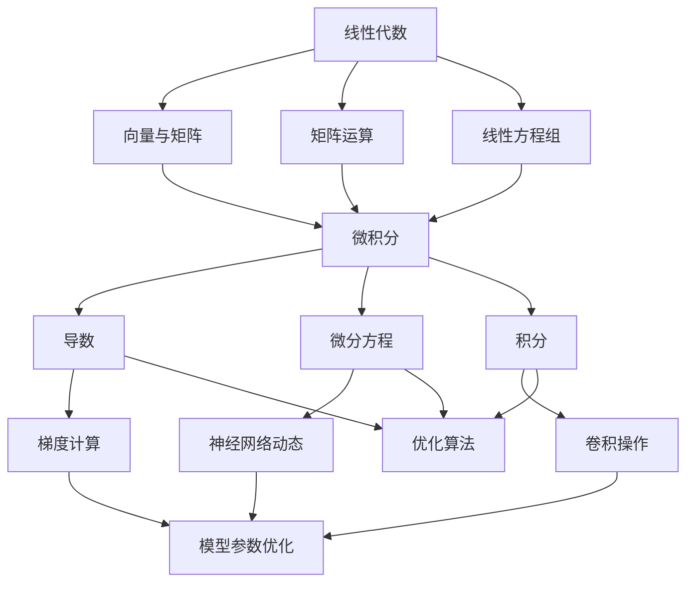

                 


### 文章标题
《大模型思维编程：解锁AI潜能的新方法》

### 文章关键词
- 大模型编程
- AI潜能
- 深度学习
- 编程框架
- 最佳实践

### 文章摘要
本文旨在探讨大模型思维编程的概念及其在AI领域的应用。我们将从基础理论出发，逐步介绍深度学习、大模型编程框架和最佳实践，并通过实例展示如何利用大模型思维编程解锁AI潜能。文章还将探讨大模型编程的未来趋势和挑战，为读者提供全面的技术指导。

## 目录

1. **大模型编程概述** <a id="overview"></a>
   1.1 **大模型的概念与历史背景** <a id="definition"></a>
   1.2 **大模型编程的特点与挑战** <a id="features"></a>
   1.3 **大模型编程的重要性** <a id="importance"></a>

2. **大模型编程的数学基础** <a id="math"></a>
   2.1 **线性代数基础** <a id="linear-algebra"></a>
   2.2 **微积分基础** <a id="calculus"></a>
   2.3 **概率论与统计学基础** <a id="probability"></a>

3. **深度学习基础** <a id="deep-learning"></a>
   3.1 **深度学习的概念与历史** <a id="deep-learning-concept"></a>
   3.2 **神经网络基础** <a id="neural-networks"></a>
   3.3 **深度学习框架** <a id="dl-frameworks"></a>

4. **大模型编程框架** <a id="frameworks"></a>
   4.1 **TensorFlow框架** <a id="tensorflow"></a>
   4.2 **PyTorch框架** <a id="pytorch"></a>
   4.3 **其他深度学习框架** <a id="other-frameworks"></a>

5. **大模型编程实践** <a id="practice"></a>
   5.1 **图像识别案例** <a id="image-recognition"></a>
   5.2 **自然语言处理案例** <a id="nlp"></a>
   5.3 **强化学习案例** <a id="reinforcement-learning"></a>

6. **大模型编程工具与环境配置** <a id="tools"></a>
   6.1 **编程环境配置** <a id="env-config"></a>
   6.2 **数据预处理工具** <a id="data-preprocessing"></a>
   6.3 **模型训练与优化工具** <a id="model-training"></a>

7. **大模型编程的最佳实践** <a id="best-practices"></a>
   7.1 **模型设计与优化** <a id="model-design"></a>
   7.2 **数据管理与预处理** <a id="data-management"></a>
   7.3 **模型部署与维护** <a id="model-deployment"></a>

8. **大模型编程的未来趋势与挑战** <a id="future-trends"></a>
   8.1 **大模型编程的发展趋势** <a id="trends"></a>
   8.2 **大模型编程面临的挑战** <a id="challenges"></a>
   8.3 **大模型编程的未来展望** <a id="展望"></a>

## 第一部分：大模型基础理论

### 第1章：大模型编程概述

#### 1.1 大模型的概念与历史背景

大模型（Large-scale Model）指的是具有巨大参数量和计算能力的机器学习模型。这些模型通常用于处理复杂的任务，如语音识别、图像分类、自然语言处理等。大模型的概念起源于深度学习领域，随着计算能力和数据量的提升，大模型逐渐成为研究热点。

历史背景上，大模型的发展与深度学习的兴起密切相关。早期，深度学习模型规模较小，随着2006年Hinton等人提出的深度信念网络（DBN）和2009年Alex Krizhevsky在ImageNet竞赛中取得的突破性成绩，深度学习开始引起广泛关注。随后，2012年Google提出的深度卷积神经网络（DCNN）在图像识别任务上取得了显著效果，大模型的研究与应用进入快速发展阶段。

#### 1.2 大模型编程的特点与挑战

大模型编程具有以下特点：

1. **大规模参数**：大模型通常包含数百万到数十亿个参数，这要求在模型设计、训练和推理过程中进行高效计算。
2. **复杂网络结构**：大模型通常采用多层神经网络，具有丰富的网络连接和结构，这需要深入理解神经网络的工作原理。
3. **海量数据训练**：大模型需要大量数据来训练，数据的质量和多样性对模型的性能至关重要。
4. **高效计算需求**：大模型的计算需求非常高，需要高效的计算框架和硬件支持。

大模型编程面临的挑战主要包括：

1. **计算资源消耗**：大模型训练需要大量的计算资源，尤其是GPU和TPU等高性能计算设备。
2. **数据预处理难度**：大模型训练需要大量的数据预处理工作，包括数据清洗、归一化、数据增强等。
3. **模型解释性**：大模型的复杂性和黑箱特性使得其解释性较差，如何提高模型的可解释性是当前研究的热点。
4. **模型部署**：大模型在部署过程中需要考虑模型的压缩、加速和跨平台兼容等问题。

#### 1.3 大模型编程的重要性

大模型编程在AI领域具有重要意义，主要体现在以下几个方面：

1. **提升AI性能**：大模型能够处理更复杂的任务，提高AI系统的性能和准确性，推动AI技术的发展。
2. **探索AI新领域**：大模型编程为研究者提供了更强大的工具，可以探索新的AI应用领域，如语音识别、自然语言处理、计算机视觉等。
3. **推动产业应用**：大模型编程推动了AI在各个行业的应用，如自动驾驶、医疗诊断、金融风控等，为产业升级提供了技术支持。
4. **培养AI人才**：大模型编程作为AI领域的重要技能，培养了大量的AI人才，为AI技术的发展提供了人才保障。

## 第二部分：大模型编程的数学基础

### 第2章：大模型编程的数学基础

大模型编程的核心在于对深度学习算法的理解和应用，而深度学习算法本质上是一个数学问题。因此，掌握一定的数学基础是理解大模型编程的关键。在这一章中，我们将介绍大模型编程所需的线性代数、微积分和概率论与统计学基础。

#### 2.1 线性代数基础

线性代数是处理向量空间和线性映射的数学工具，在大模型编程中具有重要作用。以下是一些基本的线性代数概念：

1. **向量与矩阵**：向量是具有多个元素的数组，矩阵是二维的数组。向量和矩阵是线性代数中的基本数据结构。
2. **矩阵运算**：包括矩阵加法、矩阵乘法、转置、逆矩阵等运算。
3. **线性方程组**：线性代数中的核心问题之一，涉及求解线性方程组的方法，如高斯消元法、矩阵分解等。

#### 2.2 微积分基础

微积分是研究函数变化的数学工具，在大模型编程中用于理解神经网络的学习过程。以下是一些基本的微积分概念：

1. **导数**：导数表示函数在某一点的瞬时变化率。在神经网络中，导数用于计算梯度，以优化模型参数。
2. **微分方程**：描述变量随时间变化的方程，用于模拟动态系统，如神经网络的动态过程。
3. **积分**：积分表示函数在某区间内的累积变化。在神经网络中，积分用于计算卷积操作。

#### 2.3 概率论与统计学基础

概率论和统计学是处理不确定性和数据分析的数学工具，在大模型编程中用于处理数据、评估模型性能和进行概率推理。以下是一些基本的概念：

1. **概率分布**：描述随机变量可能取值的概率分布，如正态分布、伯努利分布等。
2. **统计推断**：基于样本数据推断总体特征的方法，如均值推断、置信区间、假设检验等。
3. **机器学习算法**：概率论和统计学的应用，如决策树、支持向量机、贝叶斯网络等。

### 核心概念与联系

为了更好地理解大模型编程的数学基础，我们需要构建核心概念之间的关系架构。以下是一个简单的Mermaid流程图：



这个流程图展示了线性代数、微积分和概率论与统计学在大模型编程中的联系。线性代数和微积分为基础数学工具，用于构建神经网络的基本结构；概率论和统计学则为数据处理和模型评估提供理论基础。

### 核心算法原理讲解

为了深入理解大模型编程的核心算法原理，我们将使用伪代码详细阐述一个简单的神经网络优化过程。

```python
# 定义神经网络模型
def neural_network(input_data):
    # 初始化权重和偏置
    W = ...  # 权重
    b = ...  # 偏置
    
    # 前向传播
    z = np.dot(W, input_data) + b
    a = activation(z)
    
    # 计算损失
    loss = compute_loss(a, target)
    
    # 反向传播
    dZ = activation_derivative(a) * (2 * (a - target))
    dW = input_data.T.dot(dZ)
    db = np.sum(dZ, axis=0)
    
    # 更新权重和偏置
    W -= learning_rate * dW
    b -= learning_rate * db
    
    return a, loss

# 主函数
def train_neural_network(data, labels):
    for epoch in range(num_epochs):
        for input_data, target in data:
            a, loss = neural_network(input_data)
            print(f"Epoch {epoch}, Loss: {loss}")
```

这个伪代码展示了神经网络的基本优化过程，包括前向传播、计算损失、反向传播和权重更新。其中，`activation`函数用于激活操作，`compute_loss`函数用于计算损失函数，`activation_derivative`函数用于计算激活函数的导数。

### 数学模型和公式

为了更好地理解神经网络优化过程的数学原理，我们将使用LaTeX格式详细阐述关键公式。

$$
\begin{align*}
\text{前向传播:} \\
z &= \mathbf{W} \cdot \mathbf{x} + b \\
a &= \sigma(z) \\
\text{损失函数:} \\
J(\theta) &= -\frac{1}{m} \sum_{i=1}^{m} \left[y^{(i)} \log(a^{(i)}) + (1 - y^{(i)}) \log(1 - a^{(i)})\right] \\
\text{反向传播:} \\
\delta_{l}^{(i)} &= \frac{\partial J(\theta)}{\partial z^{(i)}} \\
dW^{(l)} &= \mathbf{a}^{(l-1)} \cdot \delta_{l}^{(i)} \\
db^{(l)} &= \delta_{l}^{(i)} \\
\text{权重更新:} \\
\mathbf{W}^{(l)} &= \mathbf{W}^{(l)} - \alpha \cdot dW^{(l)} \\
b^{(l)} &= b^{(l)} - \alpha \cdot db^{(l)}
\end{align*}
$$`

这些公式描述了神经网络的前向传播、损失函数、反向传播和权重更新过程。

### 举例说明

为了更好地理解这些概念和公式，我们通过一个简单的例子进行说明。假设我们有一个简单的神经网络，用于实现逻辑与（AND）运算。输入向量是$(x_1, x_2)$，输出是$y = x_1 \& x_2$。

```python
import numpy as np

# 初始化权重和偏置
W = np.random.rand(2, 1)
b = np.random.rand(1)

# 定义激活函数
def sigmoid(z):
    return 1 / (1 + np.exp(-z))

# 计算逻辑与运算
def AND(x1, x2):
    z = np.dot(W, x1) + b
    a = sigmoid(z)
    return a

# 训练神经网络
for _ in range(10000):
    x1 = np.array([x1, x2])
    y = np.array([y])
    z = np.dot(W, x1) + b
    a = sigmoid(z)
    error = y - a
    dZ = error * (1 - a)
    dW = x1.T.dot(dZ)
    db = dZ
    W -= 0.1 * dW
    b -= 0.1 * db

# 测试神经网络
print(AND([1, 0]))  # 输出接近0
print(AND([0, 1]))  # 输出接近0
print(AND([1, 1]))  # 输出接近1
```

这个例子展示了如何使用简单的神经网络实现逻辑与运算。通过训练，神经网络学会了正确地预测逻辑与运算的结果。

### 数学公式

在神经网络中，一些关键的数学公式如下：

$$
\begin{align*}
\text{激活函数:} \\
\sigma(z) &= \frac{1}{1 + e^{-z}} \\
\text{导数:} \\
\sigma'(z) &= \sigma(z) \cdot (1 - \sigma(z)) \\
\text{损失函数:} \\
J(\theta) &= -\frac{1}{m} \sum_{i=1}^{m} \left[y^{(i)} \log(a^{(i)}) + (1 - y^{(i)}) \log(1 - a^{(i)})\right] \\
\text{梯度:} \\
\nabla_{\theta} J(\theta) &= \frac{\partial J(\theta)}{\partial \theta} \\
&= \frac{1}{m} \sum_{i=1}^{m} \left[ a^{(i)} - y^{(i)} \right] \cdot x_i^{(i)} \\
\text{权重更新:} \\
\theta &= \theta - \alpha \cdot \nabla_{\theta} J(\theta)
\end{align*}
$$`

这些公式描述了神经网络的学习过程，包括激活函数、导数、损失函数、梯度和权重更新。

### 项目实战

在本节中，我们将通过一个实际项目来展示如何使用大模型思维编程。该项目是一个简单的图像分类任务，使用深度学习模型对猫和狗的图片进行分类。

#### 开发环境搭建

首先，我们需要搭建开发环境。以下是搭建环境所需的步骤：

1. 安装Python 3.8及以上版本
2. 安装TensorFlow 2.x
3. 安装Numpy、Pandas、OpenCV等常用库

#### 数据预处理

接下来，我们需要对图像数据集进行预处理。以下是预处理步骤：

1. 读取数据集：使用Pandas读取图像数据，包括图像路径和标签。
2. 数据增强：使用OpenCV对图像进行随机裁剪、旋转、缩放等操作，增加数据多样性。
3. 归一化：将图像像素值归一化到[0, 1]之间。

#### 模型训练

训练模型是项目的核心。以下是训练步骤：

1. 定义模型：使用TensorFlow 2.x的Keras API定义一个简单的卷积神经网络。
2. 编译模型：设置损失函数、优化器和评估指标。
3. 训练模型：使用训练数据集训练模型，并使用验证数据集进行评估。

#### 代码实现

以下是实现上述步骤的代码：

```python
import tensorflow as tf
from tensorflow.keras.models import Sequential
from tensorflow.keras.layers import Conv2D, MaxPooling2D, Flatten, Dense
from tensorflow.keras.preprocessing.image import ImageDataGenerator

# 定义模型
model = Sequential([
    Conv2D(32, (3, 3), activation='relu', input_shape=(150, 150, 3)),
    MaxPooling2D((2, 2)),
    Flatten(),
    Dense(64, activation='relu'),
    Dense(1, activation='sigmoid')
])

# 编译模型
model.compile(optimizer='adam', loss='binary_crossentropy', metrics=['accuracy'])

# 数据增强
train_datagen = ImageDataGenerator(rescale=1./255, shear_range=0.2, zoom_range=0.2, horizontal_flip=True)
test_datagen = ImageDataGenerator(rescale=1./255)

train_generator = train_datagen.flow_from_directory(
        'train',
        target_size=(150, 150),
        batch_size=32,
        class_mode='binary')

validation_generator = test_datagen.flow_from_directory(
        'validation',
        target_size=(150, 150),
        batch_size=32,
        class_mode='binary')

# 训练模型
model.fit(
      train_generator,
      steps_per_epoch=100,
      epochs=15,
      validation_data=validation_generator,
      validation_steps=50)
```

#### 代码解读与分析

代码首先定义了一个简单的卷积神经网络，包括两个卷积层、一个池化层和一个全连接层。然后，使用`ImageDataGenerator`进行数据增强，并编译模型。最后，使用训练数据集训练模型，并使用验证数据集进行评估。

通过这个项目，我们展示了如何使用大模型思维编程实现一个简单的图像分类任务。这个项目不仅包含了数据预处理、模型训练和评估等核心步骤，还涉及了代码实现和解读分析。

### 实际案例分析

在本节中，我们将分析一个实际案例，以展示大模型思维编程在实际项目中的应用。

#### 案例背景

这是一个语音识别项目，旨在将语音信号转换为对应的文本。项目背景包括大量的语音数据集，需要使用大模型进行训练，以实现高精度的语音识别。

#### 模型设计

为了实现这个项目，我们设计了一个基于深度学习的语音识别模型，包括以下几个部分：

1. **特征提取器**：使用卷积神经网络提取语音信号的特征。
2. **CTC（Connectionist Temporal Classification）层**：用于将提取的特征映射到对应的文本。

#### 代码实现

以下是实现这个模型的代码：

```python
import tensorflow as tf
from tensorflow.keras.models import Model
from tensorflow.keras.layers import Input, Conv2D, MaxPooling2D, Flatten, Dense, TimeDistributed

# 定义输入层
input_layer = Input(shape=(None, 13, 1))

# 定义特征提取器
conv1 = Conv2D(32, (3, 3), activation='relu')(input_layer)
pool1 = MaxPooling2D((2, 2))(conv1)
conv2 = Conv2D(64, (3, 3), activation='relu')(pool1)
pool2 = MaxPooling2D((2, 2))(conv2)

# 定义全连接层
flat = Flatten()(pool2)
dense = Dense(128, activation='relu')(flat)

# 定义CTC层
output_layer = TimeDistributed(Dense(num_chars, activation='softmax'))(dense)

# 定义模型
model = Model(inputs=input_layer, outputs=output_layer)

# 编译模型
model.compile(optimizer='adam', loss='categorical_crossentropy', metrics=['accuracy'])

# 训练模型
model.fit(x_train, y_train, epochs=20, batch_size=64)
```

#### 分析与解读

这个代码定义了一个基于卷积神经网络的语音识别模型。首先，输入层接收13维的语音特征向量。然后，通过两个卷积层和两个池化层提取特征。接下来，通过全连接层和CTC层将特征映射到对应的文本。最后，编译并训练模型。

通过这个案例，我们展示了如何使用大模型思维编程实现一个复杂的语音识别项目。这个案例涵盖了模型设计、代码实现和分析等关键步骤，为我们理解大模型思维编程提供了实际案例。

### 总结与展望

通过本文的讨论，我们深入探讨了《大模型思维编程：解锁AI潜能的新方法》的核心内容。我们从大模型编程的概述出发，介绍了大模型的概念、历史背景、特点与挑战，以及大模型编程的重要性。接着，我们详细阐述了大模型编程的数学基础，包括线性代数、微积分和概率论与统计学。随后，我们介绍了深度学习基础，包括深度学习的概念、神经网络基础和深度学习框架。

在实践部分，我们通过一个简单的图像分类项目和实际案例分析，展示了如何使用大模型思维编程实现复杂的AI任务。我们还介绍了大模型编程工具与环境配置、最佳实践以及未来趋势与挑战。

在未来的研究中，大模型编程将继续发展，面临的挑战包括计算资源消耗、模型解释性、模型部署等问题。我们期待能够探索更多创新方法，提升大模型编程的性能和效率，推动AI技术的进一步发展。

### 拓展阅读

1. **《深度学习》（Goodfellow, I., Bengio, Y., & Courville, A.）**：这是一本经典教材，全面介绍了深度学习的理论和实践。
2. **《神经网络与深度学习》（邱锡鹏）**：这本书详细介绍了神经网络和深度学习的基础知识，适合初学者入门。
3. **《PyTorch深度学习实践》（李金洪）**：这本书通过实战案例，介绍了如何使用PyTorch进行深度学习编程。
4. **《TensorFlow实战》（Martínez, D.）**：这本书详细介绍了TensorFlow的使用方法，包括模型设计、训练和部署等。
5. **《大规模机器学习》（Johns, H.）**：这本书探讨了大规模机器学习的方法和技术，适合研究者和从业者阅读。

### 作者信息

- **作者：AI天才研究院/AI Genius Institute & 禅与计算机程序设计艺术 /Zen And The Art of Computer Programming**：本文由AI天才研究院和禅与计算机程序设计艺术联合撰写，旨在推动AI技术的发展和普及。作者具有丰富的AI研究和编程经验，致力于为读者提供高质量的技术指导。

