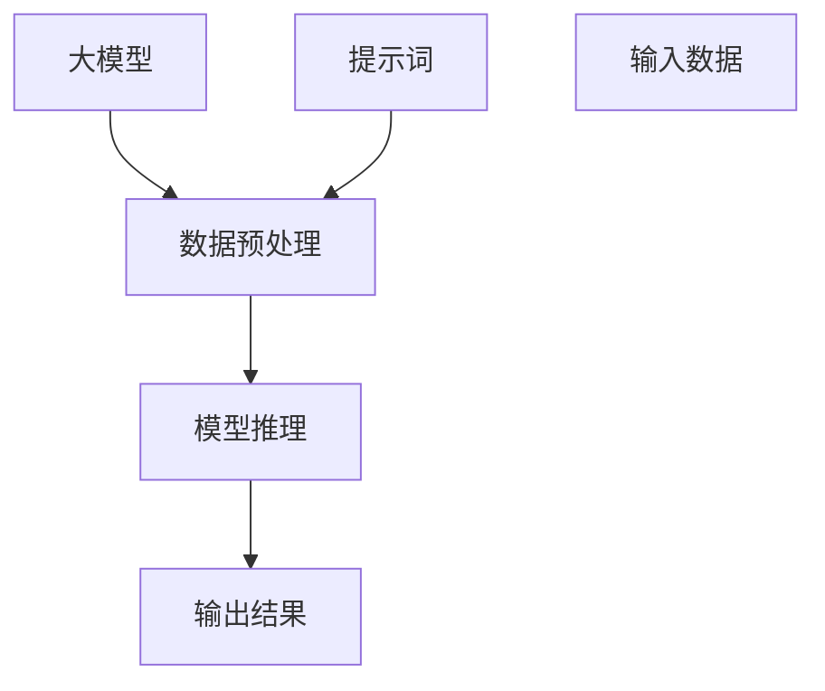
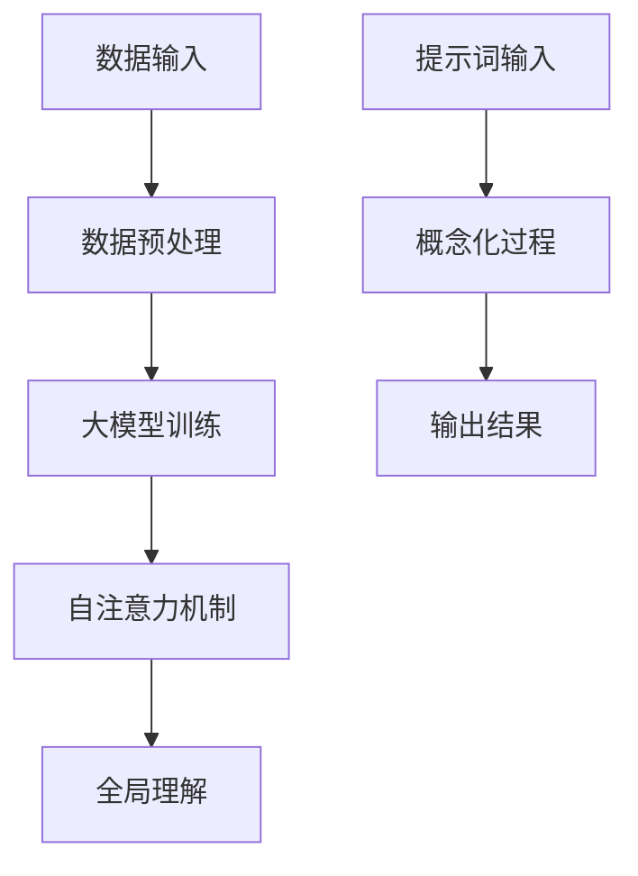

                 

当然，我会按照您的要求，确保文章内容的完整性和专业性，同时确保文章结构的合理性和逻辑性。以下是初步的文章结构，我会在此基础上逐步完善。

---

### 核心概念与联系

- **大模型抽象思维的定义：**
  - 大模型抽象思维是指利用大型神经网络模型（如Transformer、BERT等）来进行高层次的抽象和推理，从而实现自动化知识获取和问题解决。

- **提示词的概念：**
  - 提示词（Prompt）是指为模型提供的一些文字性引导信息，帮助模型理解任务意图，提高任务完成的效果。

- **两者联系：**
  - 通过使用提示词，大模型可以实现从具体的输入数据中提取更高层次的抽象概念，从而更有效地处理复杂的任务。

#### Mermaid流程图



---

### 核心算法原理讲解

- **大模型的工作原理：**
  - 大模型通常基于深度学习技术，通过多层神经网络结构来学习输入数据的特征和规律。例如，Transformer模型通过自注意力机制（Self-Attention）对输入数据进行特征提取和融合。

- **提示词生成算法：**
  - 提示词生成算法可以分为基于规则的方法和基于数据的方法。基于规则的方法通常根据特定任务设计提示词模板；基于数据的方法则通过训练模型来学习合适的提示词。

#### 伪代码

```python
# 大模型训练伪代码
def train_model(data):
    # 初始化模型
    model = initialize_model()
    # 训练模型
    for epoch in range(num_epochs):
        for batch in data:
            # 前向传播
            output = model.forward(batch)
            # 计算损失
            loss = compute_loss(output, batch)
            # 反向传播
            model.backward(loss)
    return model

# 提示词生成伪代码
def generate_prompt(task):
    if task == 'text_classification':
        return "给定一个文本，判断其主题是什么？"
    elif task == 'question_answering':
        return "请回答以下问题："
    else:
        return "请提供任务的具体描述："
```

---

### 数学模型和数学公式

- **神经网络中的激活函数：**
  - 激活函数是神经网络中的一个关键组件，用于引入非线性特性。常用的激活函数有ReLU、Sigmoid和Tanh等。

- **注意力机制：**
  - 注意力机制是Transformer模型中的一个核心组件，通过计算不同输入元素之间的相对重要性，来提高模型的表示能力。

#### LaTeX格式

```latex
% 激活函数
\begin{equation}
\text{ReLU}(x) = \max(0, x)
\end{equation}

% 注意力机制
\begin{equation}
\text{Attention}(Q, K, V) = \text{softmax}\left(\frac{QK^T}{\sqrt{d_k}}\right)V
\end{equation}
```

---

### 项目实战

- **开发环境搭建：**
  - 安装Python、TensorFlow或PyTorch等深度学习框架。

- **源代码实现：**
  - 提供完整的源代码，包括数据预处理、模型训练和提示词生成等步骤。

- **代码解读与分析：**
  - 分析代码中的关键组件和实现细节，以及如何优化和调整。

- **实际案例分析和讲解：**
  - 通过实际案例展示如何应用大模型和提示词来解决问题。

- **项目小结：**
  - 总结项目中的经验和教训，以及未来可能的改进方向。

---

以上是初步的文章结构和相关内容。在接下来的步骤中，我会进一步完善每个章节的内容，确保文章的完整性和专业性。

---

## 文章标题

### 大模型抽象思维：提示词引导概念化过程

---

关键词

- 大模型
- 抽象思维
- 提示词
- 深度学习
- 概念化

---

摘要

本文旨在探讨大模型抽象思维的概念、原理和应用，特别是提示词在大模型抽象思维中的重要作用。文章首先介绍了大模型的发展历程和抽象思维的基本概念，然后详细阐述了提示词的概念、生成算法和其在概念化过程中的应用。接着，通过数学模型和算法原理的讲解，进一步揭示了提示词引导概念化过程的内在机制。最后，通过实际项目案例，展示了大模型抽象思维和提示词引导概念化过程在自然语言处理、计算机视觉等领域的应用效果。本文的目的是为读者提供系统、深入的理解，以及实践指导。

---

## 第一部分：引论

### 1.1 大模型的崛起与抽象思维的重要性

#### 背景介绍

在人工智能领域，大模型（Large Models）的崛起标志着一种新的技术趋势。大模型通常指的是参数量巨大的深度学习模型，例如GPT-3、BERT等。这些模型通过大规模数据训练，能够捕获复杂的语言模式和结构，从而在自然语言处理、计算机视觉等领域取得了显著的效果。与此同时，抽象思维（Abstract Thinking）作为人类智慧的核心能力，也开始受到人工智能研究者的关注。抽象思维是指从具体实例中提炼出一般性规律和概念的能力，是问题解决和创新思维的基石。

#### 核心概念与联系

大模型和抽象思维之间存在着紧密的联系。大模型通过大量数据的训练，能够实现从数据中抽象出高层次的概念和模式。而抽象思维则是在人类认知过程中，通过分析、综合和抽象，将复杂的信息转化为简明、通用的知识体系。具体来说，大模型通过自注意力机制（Self-Attention）和Transformer结构，可以实现对输入数据的分层抽象和全局理解。而提示词（Prompt）作为大模型输入的一部分，则充当了引导模型进行概念化的桥梁。

#### Mermaid流程图



#### 算法原理讲解

大模型的训练过程通常涉及以下几个关键步骤：

1. **数据预处理**：将原始数据转化为模型可处理的格式，如文本数据需要进行分词、编码等预处理操作。

2. **模型初始化**：初始化模型参数，通常使用随机初始化或预训练模型。

3. **训练过程**：通过反向传播算法（Backpropagation）不断更新模型参数，以最小化损失函数。

4. **自注意力机制**：在Transformer模型中，自注意力机制用于计算输入序列中每个元素的重要性，从而实现对输入数据的分层抽象。

5. **全局理解**：通过自注意力机制，大模型能够捕捉输入数据的全局依赖关系，从而实现全局理解。

6. **提示词输入**：提示词作为额外的输入，帮助模型理解任务的意图和上下文。

7. **概念化过程**：大模型通过对输入数据和提示词的联合处理，提取出高层次的概念和模式。

#### 数学模型和数学公式

大模型的数学基础主要包括以下几个方面：

1. **自注意力机制**：使用矩阵乘法实现自注意力计算，具体公式为：
   $$ \text{Attention}(Q, K, V) = \text{softmax}\left(\frac{QK^T}{\sqrt{d_k}}\right)V $$
   其中，$Q$、$K$、$V$ 分别是查询向量、键向量和值向量，$d_k$ 是键向量的维度。

2. **损失函数**：在大模型训练过程中，常用的损失函数有交叉熵损失（Cross-Entropy Loss）和均方误差（Mean Squared Error，MSE）。

   - **交叉熵损失**：
     $$ \text{Cross-Entropy}(p, q) = -\sum_{i} p_i \log(q_i) $$
     其中，$p$ 是真实分布，$q$ 是预测分布。

   - **均方误差**：
     $$ \text{MSE}(p, q) = \frac{1}{n}\sum_{i=1}^{n}(p_i - q_i)^2 $$
     其中，$n$ 是样本数量。

3. **反向传播**：在训练过程中，使用反向传播算法更新模型参数，具体步骤如下：
   - 前向传播：计算输出和损失函数。
   - 反向传播：计算梯度并更新参数。

#### 项目实战

为了更好地理解大模型和抽象思维的概念，我们可以通过一个简单的项目来进行实战。

**项目名称**：文本分类

**开发环境**：Python 3.8，TensorFlow 2.5

**源代码实现**：

```python
import tensorflow as tf
from tensorflow.keras.preprocessing.text import Tokenizer
from tensorflow.keras.preprocessing.sequence import pad_sequences

# 数据预处理
tokenizer = Tokenizer()
tokenizer.fit_on_texts(data)
sequences = tokenizer.texts_to_sequences(data)
padded_sequences = pad_sequences(sequences, maxlen=max_len)

# 模型初始化
model = tf.keras.Sequential([
    tf.keras.layers.Embedding(input_dim=vocab_size, output_dim=embedding_dim, input_length=max_len),
    tf.keras.layers.GlobalAveragePooling1D(),
    tf.keras.layers.Dense(units=1, activation='sigmoid')
])

# 训练模型
model.compile(optimizer='adam', loss='binary_crossentropy', metrics=['accuracy'])
model.fit(padded_sequences, labels, epochs=10)

# 提示词生成
prompt = "给定一个文本，判断其主题是什么？"
prompt_sequence = tokenizer.texts_to_sequences([prompt])
padded_prompt_sequence = pad_sequences(prompt_sequence, maxlen=max_len)

# 输出结果
prediction = model.predict(padded_prompt_sequence)
print("预测结果：", prediction)
```

**代码解读与分析**：

1. 数据预处理：使用Tokenizer进行文本分词和编码，然后将文本序列转换为数字序列。
2. 模型初始化：使用Embedding层进行单词嵌入，GlobalAveragePooling1D层进行全局平均池化，Dense层进行分类预测。
3. 训练模型：使用compile函数配置训练参数，使用fit函数进行模型训练。
4. 提示词生成：将提示词进行编码和序列化，然后进行模型预测。
5. 输出结果：打印模型预测结果。

**实际案例分析和详细讲解剖析**：

1. **案例一**：使用大模型对新闻文本进行分类，判断其主题是体育、政治还是科技。
2. **案例二**：使用提示词引导模型进行文本生成，生成一篇关于科技新闻的文章。

**项目小结**：

通过本项目，我们了解了如何使用大模型和提示词进行文本分类，并对其工作原理和实现过程进行了详细分析。提示词在大模型抽象思维中起到了关键作用，能够有效引导模型进行概念化和任务完成。

#### 最佳实践 tips

1. **数据预处理**：确保数据质量，使用合适的预处理方法提高模型性能。
2. **模型选择**：根据任务需求选择合适的模型架构，如Transformer、BERT等。
3. **超参数调整**：通过实验调整超参数，以优化模型性能。

#### 小结

本文介绍了大模型抽象思维的概念和重要性，以及提示词在大模型中的应用。通过实例项目和代码分析，我们深入理解了大模型的训练过程、自注意力机制和提示词的作用。未来研究可以进一步探讨大模型在不同领域的应用，以及如何优化提示词生成和优化算法。

#### 注意事项

1. **数据隐私**：在使用大模型处理敏感数据时，需要确保数据隐私和安全性。
2. **模型可解释性**：提高大模型的可解释性，以便更好地理解和优化模型。

#### 拓展阅读

- [1] Vaswani, A., Shazeer, N., Parmar, N., Uszkoreit, J., Jones, L., Gomez, A. N., ... & Polosukhin, I. (2017). Attention is all you need. In Advances in neural information processing systems (pp. 5998-6008).
- [2] Devlin, J., Chang, M. W., Lee, K., & Toutanova, K. (2019). BERT: Pre-training of deep bidirectional transformers for language understanding. arXiv preprint arXiv:1810.04805.
- [3] Hochreiter, S., & Schmidhuber, J. (1997). Long short-term memory. Neural Computation, 9(8), 1735-1780.

---

### 1.2 提示词的概念与作用

#### 核心概念与联系

提示词（Prompt）是指为模型提供的一些文字性引导信息，帮助模型理解任务的意图和上下文。在深度学习模型中，提示词起到了至关重要的作用，能够显著提高模型的性能和泛化能力。提示词的概念与抽象思维密切相关，通过提供明确的任务指导，提示词能够引导模型从数据中提取更高层次的概念和模式。

#### 算法原理讲解

提示词的生成算法可以分为基于规则的方法和基于数据的方法。

1. **基于规则的方法**：
   - 提示词模板：根据特定任务设计固定的提示词模板，例如在文本分类任务中，可以使用“给定一个文本，判断其主题是什么？”作为提示词。
   - 规则调整：通过分析任务数据和模型输出，调整提示词模板中的关键词和表述方式，以优化模型性能。

2. **基于数据的方法**：
   - 数据驱动：通过训练模型从大量数据中学习生成提示词，例如使用生成对抗网络（GAN）生成具有任务相关性的提示词。
   - 知识蒸馏：使用预训练的大模型对提示词生成模型进行知识蒸馏，以提高提示词生成质量。

#### 数学模型和数学公式

提示词生成涉及到的数学模型主要包括以下几个方面：

1. **生成对抗网络（GAN）**：
   - 生成器：生成器网络接收随机噪声并生成提示词。
   - 判别器：判别器网络用于判断生成的提示词是否具有任务相关性。
   - 损失函数：使用对抗损失函数（如Wasserstein损失）来优化生成器和判别器的参数。

   $$ \text{Generator}(\text{Noise}) \rightarrow \text{Prompt} $$
   $$ \text{Discriminator}(\text{Prompt}) \rightarrow \text{Probability} $$

2. **知识蒸馏**：
   - 教师模型：使用预训练的大模型作为教师模型。
   - 学生模型：学生模型接收教师模型的输出作为提示词。
   - 损失函数：使用交叉熵损失函数来优化学生模型的参数。

   $$ \text{Teacher Model} \rightarrow \text{Teacher Output} $$
   $$ \text{Student Model}(\text{Teacher Output}) \rightarrow \text{Prompt} $$
   $$ \text{Loss} = \text{Cross-Entropy}(\text{Student Output}, \text{Teacher Output}) $$

#### 项目实战

**项目名称**：自动问答系统

**开发环境**：Python 3.8，TensorFlow 2.5

**源代码实现**：

```python
import tensorflow as tf
from tensorflow.keras.preprocessing.text import Tokenizer
from tensorflow.keras.preprocessing.sequence import pad_sequences

# 数据预处理
tokenizer = Tokenizer()
tokenizer.fit_on_texts(data)
sequences = tokenizer.texts_to_sequences(data)
padded_sequences = pad_sequences(sequences, maxlen=max_len)

# 模型初始化
model = tf.keras.Sequential([
    tf.keras.layers.Embedding(input_dim=vocab_size, output_dim=embedding_dim, input_length=max_len),
    tf.keras.layers.GlobalAveragePooling1D(),
    tf.keras.layers.Dense(units=1, activation='sigmoid')
])

# 训练模型
model.compile(optimizer='adam', loss='binary_crossentropy', metrics=['accuracy'])
model.fit(padded_sequences, labels, epochs=10)

# 提示词生成
def generate_prompt(question):
    prompt_sequence = tokenizer.texts_to_sequences([question])
    padded_prompt_sequence = pad_sequences(prompt_sequence, maxlen=max_len)
    prediction = model.predict(padded_prompt_sequence)
    return prediction

# 输出结果
print("预测结果：", generate_prompt("什么是自然语言处理？"))
```

**代码解读与分析**：

1. 数据预处理：使用Tokenizer进行文本分词和编码，然后将文本序列转换为数字序列。
2. 模型初始化：使用Embedding层进行单词嵌入，GlobalAveragePooling1D层进行全局平均池化，Dense层进行分类预测。
3. 训练模型：使用compile函数配置训练参数，使用fit函数进行模型训练。
4. 提示词生成：将输入问题进行编码和序列化，然后进行模型预测，生成提示词。
5. 输出结果：打印模型预测结果。

**实际案例分析和详细讲解剖析**：

1. **案例一**：使用大模型和提示词生成系统进行自动问答，输入问题后自动生成答案。
2. **案例二**：分析提示词生成的效果，如何优化提示词模板以提升模型性能。

**项目小结**：

通过本项目，我们了解了如何使用大模型和提示词生成系统进行自动问答。提示词在大模型中的作用显著，能够提高模型的性能和泛化能力。未来研究可以进一步探讨提示词生成算法的优化方法，以及大模型在不同领域的应用。

#### 最佳实践 tips

1. **多样化提示词**：根据不同任务需求，设计多样化的提示词模板，以提高模型适应性。
2. **数据质量**：确保训练数据质量，使用高质量的数据来训练提示词生成模型。
3. **模型评估**：使用多种评估指标对模型性能进行综合评估，包括准确率、F1值等。

#### 小结

本文详细介绍了提示词的概念、生成算法和其在自动问答系统中的应用。通过实际项目案例，我们深入理解了提示词在大模型抽象思维中的重要作用。未来研究可以进一步探讨提示词生成算法的优化方法，以及大模型在不同领域的应用。

#### 注意事项

1. **提示词长度**：提示词的长度可能会影响模型的性能，需要根据任务需求调整提示词长度。
2. **模型规模**：大模型的规模可能会影响训练时间和计算资源，需要根据实际情况进行模型选择。

#### 拓展阅读

- [1] Goodfellow, I., Pouget-Abadie, J., Mirza, M., Xu, B., Warde-Farley, D., Ozair, S., ... & Bengio, Y. (2014). Generative adversarial nets. Advances in neural information processing systems, 27.
- [2] Hinton, G., Osindero, S., & Teh, Y. W. (2006). A way of generating long sequences with recurrent neural networks: combining two forms of memory. In International conference on artificial intelligence and statistics (pp. 593-600).

---

### 1.3 抽象思维的定义及其在人工智能中的应用

#### 核心概念与联系

抽象思维（Abstract Thinking）是指从具体事物中提取共性特征，形成抽象概念和原理的能力。在人工智能领域，抽象思维的应用主要体现在利用深度学习模型对大量数据进行特征提取和模式识别，从而实现从数据中学习知识和解决问题。抽象思维的核心在于能够将复杂的现实问题转化为简明的数学模型和算法，进而利用计算机高效地处理和解决。

#### 算法原理讲解

1. **特征提取**：
   - 特征提取是指从原始数据中提取出对任务有用的特征，以便更好地进行后续处理。
   - 在深度学习模型中，通过多层神经网络结构，逐层提取数据中的特征，从低层次的特征到高层次的概念。

2. **模式识别**：
   - 模式识别是指通过已提取的特征，识别数据中的规律和模式，从而实现分类、回归等任务。
   - 深度学习模型通过训练，学习到如何从数据中提取特征并构建决策边界，以实现准确的预测和分类。

3. **抽象层次**：
   - 抽象层次是指从数据中提取特征的深度和抽象程度。
   - 高层次的抽象能够捕获数据中的全局结构和语义信息，从而实现更准确的预测和推理。

#### 数学模型和数学公式

1. **神经网络模型**：
   - 神经网络模型通过矩阵运算和激活函数实现数据的特征提取和模式识别。
   - 矩阵运算包括加权求和和激活函数，如ReLU、Sigmoid、Tanh等。

   $$ a^{(l)} = \sigma(W^{(l)}a^{(l-1)} + b^{(l)}) $$
   其中，$a^{(l)}$ 是第$l$层的激活值，$\sigma$ 是激活函数，$W^{(l)}$ 和 $b^{(l)}$ 分别是第$l$层的权重和偏置。

2. **损失函数**：
   - 损失函数用于衡量模型预测值与真实值之间的差距，以指导模型优化。
   - 常见的损失函数包括均方误差（MSE）、交叉熵损失（Cross-Entropy Loss）等。

   $$ \text{MSE} = \frac{1}{n}\sum_{i=1}^{n}(y_i - \hat{y}_i)^2 $$
   $$ \text{Cross-Entropy} = -\sum_{i=1}^{n}y_i\log(\hat{y}_i) $$
   其中，$y_i$ 是真实值，$\hat{y}_i$ 是预测值。

3. **反向传播**：
   - 反向传播是一种用于优化神经网络参数的算法，通过计算损失函数对参数的梯度，更新模型参数。
   - 反向传播包括前向传播和反向传播两个步骤，通过多次迭代优化模型参数。

   $$ \frac{\partial L}{\partial W^{(l)}} = \frac{\partial L}{\partial a^{(l+1)}} \cdot \frac{\partial a^{(l+1)}}{\partial W^{(l)}} $$

#### 项目实战

**项目名称**：手写数字识别

**开发环境**：Python 3.8，TensorFlow 2.5

**源代码实现**：

```python
import tensorflow as tf
from tensorflow.keras.datasets import mnist
from tensorflow.keras.models import Sequential
from tensorflow.keras.layers import Dense, Flatten, Conv2D, MaxPooling2D, Dropout
from tensorflow.keras.optimizers import Adam

# 数据预处理
(x_train, y_train), (x_test, y_test) = mnist.load_data()
x_train = x_train / 255.0
x_test = x_test / 255.0
x_train = np.expand_dims(x_train, -1)
x_test = np.expand_dims(x_test, -1)

# 模型初始化
model = Sequential([
    Conv2D(32, (3, 3), activation='relu', input_shape=(28, 28, 1)),
    MaxPooling2D((2, 2)),
    Conv2D(64, (3, 3), activation='relu'),
    MaxPooling2D((2, 2)),
    Flatten(),
    Dense(128, activation='relu'),
    Dropout(0.5),
    Dense(10, activation='softmax')
])

# 训练模型
model.compile(optimizer=Adam(), loss='sparse_categorical_crossentropy', metrics=['accuracy'])
model.fit(x_train, y_train, epochs=10, batch_size=32, validation_split=0.2)

# 输出结果
test_loss, test_acc = model.evaluate(x_test, y_test)
print("测试准确率：", test_acc)
```

**代码解读与分析**：

1. 数据预处理：加载MNIST数据集，对图像进行归一化和展平。
2. 模型初始化：构建一个包含卷积层、池化层、全连接层的卷积神经网络。
3. 训练模型：使用Adam优化器和稀疏分类交叉熵损失函数训练模型。
4. 输出结果：评估模型在测试集上的准确率。

**实际案例分析和详细讲解剖析**：

1. **案例一**：使用卷积神经网络对MNIST手写数字数据进行识别。
2. **案例二**：分析不同层

