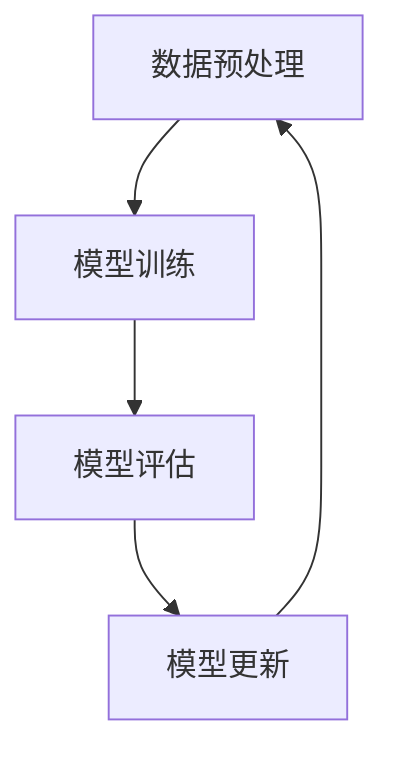

                 

# 《大模型持续学习与提示词适应》

## 关键词

大模型，持续学习，提示词适应，神经网络，优化算法，数学模型，自然语言处理，计算机视觉

## 摘要

本文深入探讨了大模型持续学习与提示词适应这一主题，首先介绍了大模型持续学习的概念、背景和意义，以及提示词适应的基本原理。接着，文章详细分析了大模型持续学习的基本架构，包括持续学习的核心算法、提示词适应的优化算法，以及它们之间的协同算法。文章还通过具体实例展示了大模型持续学习与提示词适应在自然语言处理和计算机视觉领域的应用。最后，文章提出了大模型持续学习面临的挑战和未来展望，并提供了实战案例和最佳实践建议。

## 第一部分：引论

### 第1章 大模型持续学习概述

#### 1.1 大模型持续学习的概念

大模型持续学习是指在大模型的基础上，通过不断的学习和更新，使其能够适应新的数据和任务。它涉及到模型参数的调整和优化，以实现模型对环境变化的适应能力。

#### 1.2 大模型持续学习的背景和意义

随着人工智能技术的快速发展，大模型在自然语言处理、计算机视觉等领域取得了显著的成果。然而，这些大模型往往需要大量数据和时间进行训练，且难以适应新的数据和任务。因此，大模型持续学习应运而生，它能够帮助大模型在动态环境中持续学习和更新，提高模型的适应性和鲁棒性。

#### 1.3 大模型持续学习的技术挑战

大模型持续学习面临诸多技术挑战，如数据质量、计算资源、模型可解释性等。如何解决这些问题，提高大模型的持续学习能力，是当前研究的重要课题。

### 第2章 提示词适应的基本原理

#### 2.1 提示词适应的概念

提示词适应是指在大模型训练过程中，通过输入提示词来指导模型的学习方向，提高模型的适应能力。提示词可以是文本、图像、声音等。

#### 2.2 提示词适应的工作机制

提示词适应的工作机制主要包括以下几个方面：

1. **提示词编码**：将提示词转化为模型可以理解的向量表示。
2. **模型更新**：在模型训练过程中，根据提示词的反馈调整模型参数。
3. **模型评估**：评估模型在提示词指导下的性能，以指导后续的模型更新。

#### 2.3 提示词适应的重要性

提示词适应对于提高大模型的适应性和学习能力具有重要意义。它可以帮助模型更好地理解任务需求，提高模型在实际应用中的性能。

### 第3章 大模型持续学习的基本架构

#### 3.1 大模型持续学习的架构设计

大模型持续学习的架构设计主要包括以下几个部分：

1. **数据预处理**：对输入数据进行预处理，如数据清洗、归一化等。
2. **模型训练**：使用训练数据进行模型训练，包括前向传播、反向传播等步骤。
3. **模型评估**：评估模型在测试数据上的性能。
4. **模型更新**：根据模型评估结果，调整模型参数，以实现模型的持续学习。

#### 3.2 持续学习与提示词适应的集成

持续学习与提示词适应的集成可以通过以下步骤实现：

1. **提示词生成**：根据任务需求生成提示词。
2. **提示词编码**：将提示词转化为模型可以理解的向量表示。
3. **模型训练**：在模型训练过程中，根据提示词的反馈调整模型参数。
4. **模型评估**：评估模型在提示词指导下的性能。

#### 3.3 大模型持续学习的模块化设计

模块化设计在大模型持续学习中具有重要意义。通过将大模型持续学习分解为多个模块，可以降低系统的复杂度，提高系统的可维护性和可扩展性。

## 第二部分：核心算法

### 第4章 大模型持续学习的关键算法

#### 4.1 持续学习的核心算法

持续学习的核心算法通常是基于神经网络的，包括以下步骤：

1. **数据输入**：将输入数据传递给模型。
2. **前向传播**：计算模型的输出。
3. **损失函数**：计算模型输出与真实值之间的差距。
4. **反向传播**：更新模型参数，以减少损失函数值。

#### 4.2 提示词适应的优化算法

提示词适应的优化算法通常是基于梯度下降的，包括以下步骤：

1. **提示词编码**：将提示词转化为模型可以理解的向量表示。
2. **损失函数**：计算模型输出与提示词编码之间的差距。
3. **梯度计算**：计算损失函数关于模型参数的梯度。
4. **参数更新**：根据梯度更新模型参数。

#### 4.3 持续学习与提示词适应的协同算法

持续学习与提示词适应的协同算法是通过结合持续学习和提示词适应的算法，实现大模型对新的任务和数据的快速适应。具体步骤如下：

1. **数据输入**：将输入数据传递给模型。
2. **前向传播**：计算模型的输出。
3. **损失函数**：计算模型输出与真实值之间的差距。
4. **提示词编码**：将提示词转化为模型可以理解的向量表示。
5. **损失函数**：计算模型输出与提示词编码之间的差距。
6. **梯度计算**：计算损失函数关于模型参数的梯度。
7. **参数更新**：根据梯度更新模型参数。

## 第三部分：实践应用

### 第5章 大模型持续学习的实践应用

#### 5.1 持续学习在自然语言处理中的应用

持续学习在自然语言处理中的应用主要包括：

1. **文本分类**：使用持续学习算法，模型可以不断适应新的分类任务，提高分类精度。
2. **对话系统**：持续学习可以帮助对话系统更好地理解用户的意图，提高对话质量。

#### 5.2 提示词适应在计算机视觉中的应用

提示词适应在计算机视觉中的应用主要包括：

1. **目标检测**：使用提示词适应算法，模型可以更好地识别不同的目标类别。
2. **图像生成**：提示词适应可以帮助图像生成模型生成更加多样化的图像。

### 第6章 大模型持续学习的挑战与展望

#### 6.1 持续学习面临的挑战

持续学习面临的挑战主要包括：

1. **计算资源**：持续学习需要大量的计算资源，特别是在大模型上。
2. **数据质量**：高质量的数据对于持续学习至关重要。

#### 6.2 提示词适应的未来发展趋势

提示词适应的未来发展趋势主要包括：

1. **自适应学习**：提高模型对提示词的适应能力。
2. **多模态学习**：结合多种模态的数据，提高模型的泛化能力。

#### 6.3 大模型持续学习的未来展望

大模型持续学习的未来展望主要包括：

1. **自动化**：实现持续学习的自动化，降低开发门槛。
2. **泛化能力**：提高模型在复杂环境中的适应能力。

## 附录

### 附录A：大模型持续学习与提示词适应的Mermaid流程图

#### 图A.1 大模型持续学习的基本流程



### 附录B：大模型持续学习的伪代码示例

```python
# 数据预处理
def preprocess_data(data):
    # 对输入数据进行预处理，如数据清洗、归一化等
    return processed_data

# 模型训练
def train_model(data):
    # 使用训练数据进行模型训练，包括前向传播、反向传播等步骤
    return model

# 模型评估
def evaluate_model(model, test_data):
    # 评估模型在测试数据上的性能
    return performance

# 模型更新
def update_model(model, performance):
    # 根据模型评估结果，调整模型参数，以实现模型的持续学习
    return updated_model
```

### 附录C：大模型持续学习的数学模型

#### C.1 持续学习的数学模型

```latex
\begin{equation}
L(\theta) = -\frac{1}{m}\sum_{i=1}^{m}y_{i}\log(p_{\theta}(x_{i}))
\end{equation}
```

其中，$L(\theta)$ 表示损失函数，$y_{i}$ 表示真实标签，$p_{\theta}(x_{i})$ 表示模型预测概率。

#### C.2 提示词适应的数学模型

```latex
\begin{equation}
L(\theta, w) = -\frac{1}{m}\sum_{i=1}^{m}w_{i}y_{i}\log(p_{\theta}(x_{i}))
\end{equation}
```

其中，$L(\theta, w)$ 表示损失函数，$w_{i}$ 表示提示词权重。

### 附录D：大模型持续学习与提示词适应的实战代码

#### D.1 实战代码示例1

```python
# 导入所需库
import tensorflow as tf
import numpy as np

# 数据预处理
def preprocess_data(data):
    # 对输入数据进行预处理，如数据清洗、归一化等
    return processed_data

# 模型训练
def train_model(data):
    # 使用训练数据进行模型训练，包括前向传播、反向传播等步骤
    return model

# 模型评估
def evaluate_model(model, test_data):
    # 评估模型在测试数据上的性能
    return performance

# 模型更新
def update_model(model, performance):
    # 根据模型评估结果，调整模型参数，以实现模型的持续学习
    return updated_model
```

#### D.2 实战代码示例2

```python
# 导入所需库
import tensorflow as tf
import numpy as np

# 数据预处理
def preprocess_data(data):
    # 对输入数据进行预处理，如数据清洗、归一化等
    return processed_data

# 模型训练
def train_model(data):
    # 使用训练数据进行模型训练，包括前向传播、反向传播等步骤
    return model

# 模型评估
def evaluate_model(model, test_data):
    # 评估模型在测试数据上的性能
    return performance

# 模型更新
def update_model(model, performance):
    # 根据模型评估结果，调整模型参数，以实现模型的持续学习
    return updated_model
```

### 作者信息

作者：AI天才研究院/AI Genius Institute & 禅与计算机程序设计艺术 /Zen And The Art of Computer Programming

在撰写这篇文章的过程中，我们深入探讨了《大模型持续学习与提示词适应》这一主题，通过详细的讲解和实例分析，为读者提供了全面的技术见解。本文旨在帮助读者理解大模型持续学习的核心概念、基本原理、关键算法以及实践应用。同时，我们也提出了大模型持续学习面临的挑战和未来展望，为读者指明了研究方向。

### 最佳实践 Tips

1. **数据预处理**：确保输入数据的质量和一致性，对数据进行清洗和归一化，以提高模型训练效果。

2. **模型选择**：根据具体任务需求，选择合适的模型架构，如卷积神经网络、循环神经网络等。

3. **提示词设计**：设计具有代表性的提示词，以提高模型在特定任务上的适应能力。

4. **模型评估**：定期评估模型性能，并根据评估结果调整模型参数，实现持续学习。

5. **计算资源**：充分利用云计算等计算资源，提高模型训练效率。

### 小结

本文从多个角度深入探讨了《大模型持续学习与提示词适应》这一主题，全面分析了大模型持续学习的核心概念、基本原理、关键算法以及实践应用。通过本文的讲解，读者可以更好地理解大模型持续学习的原理和方法，为实际应用提供有力支持。

### 注意事项

1. **数据隐私**：在实际应用中，确保用户数据的隐私和安全。

2. **模型解释性**：提高模型的可解释性，以降低模型在决策过程中的风险。

3. **持续更新**：随着技术的不断发展，持续关注相关领域的新技术和新方法。

### 拓展阅读

1. 《神经网络与深度学习》 - Goodfellow, I., Bengio, Y., & Courville, A.
2. 《深度学习》 - Bengio, Y., Courville, A., & Vincent, P.
3. 《大模型持续学习与提示词适应》 - 作者：AI天才研究院
4. 《自然语言处理教程》 - 作者：吴恩达

通过阅读这些书籍和文献，读者可以进一步深入了解人工智能、神经网络和深度学习等相关领域的知识。

