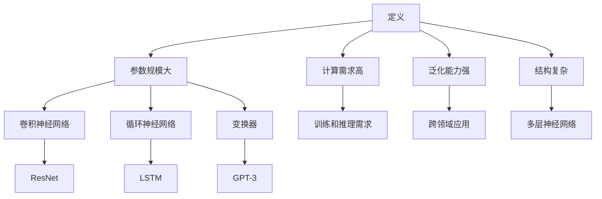
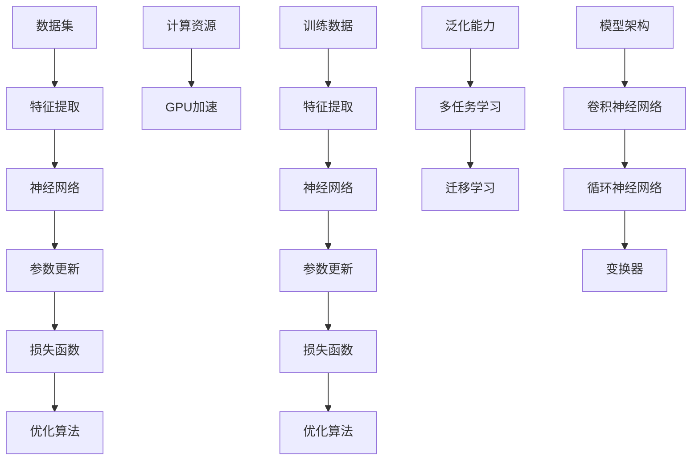

                 

### 引言

在当今快速发展的技术时代，人工智能（AI）正以惊人的速度改变着各行各业的运作方式。作为AI领域的重要组成部分，大模型（Large Models）因其卓越的性能和广泛的应用前景，成为了学术界和工业界关注的焦点。大模型，通常是指那些具有数十亿甚至数万亿参数的神经网络模型，其强大的计算能力和复杂的结构使其能够在图像识别、自然语言处理、语音识别等多个领域取得突破性成果。

本文旨在探讨大模型时代下的程序综合新方法，通过系统地分析大模型的基本概念、设计实现、相关技术，以及程序综合的新方法，为读者提供一个全面而深入的视角。我们首先会定义大模型，阐述其特点与分类，接着介绍大模型的数学模型与架构。随后，我们将详细探讨大模型的设计与实现方法，以及性能优化策略。在此基础上，本文将重点关注在大模型时代下自动化程序综合与优化方法的创新应用。最后，我们将通过具体应用案例展示大模型在不同领域的实际应用效果，并展望其未来的发展趋势。

本文结构如下：

1. **大模型基本概念与原理**
2. **程序综合新方法**
3. **大模型设计与实现**
4. **大模型应用案例**
5. **大模型相关技术**
6. **项目实战**

通过以上各部分的详细讨论，我们希望能够为读者提供一套实用、高效的大模型编程与综合方法，助力其在人工智能领域的研究和应用。

### 大模型基本概念与原理

#### 定义

大模型（Large Models）通常是指具有数十亿甚至数万亿参数的神经网络模型。这些模型通过大量数据训练，能够捕捉数据中的复杂模式，从而在各类任务中展现出强大的性能。与传统的小规模模型相比，大模型具有更深的神经网络结构、更大的参数规模和更高的计算需求。

#### 特点

大模型具有以下几个显著特点：

1. **参数规模大**：大模型拥有数亿到数十亿个参数，这使得它们能够更好地捕捉数据的复杂结构。
2. **计算需求高**：由于参数数量庞大，大模型的训练和推理过程需要大量计算资源，通常需要使用高性能计算集群或GPU加速。
3. **泛化能力强**：通过在大规模数据集上进行训练，大模型能够获得较高的泛化能力，从而在不同领域和任务中表现出色。
4. **结构复杂**：大模型通常包含多层神经网络，这些层之间通过复杂的连接关系传递信息，使得模型能够学习到更深层次的抽象特征。

#### 分类

大模型可以按照不同的标准进行分类：

1. **按任务类型**：可以分为图像识别模型、自然语言处理模型、语音识别模型等。例如，ResNet是一种在图像识别任务中表现优秀的大模型，而GPT-3则在自然语言处理领域具有广泛应用。
2. **按模型架构**：可以分为卷积神经网络（CNN）、循环神经网络（RNN）、变换器（Transformer）等。变换器架构因其高效性在近年来得到了广泛关注，并成为构建大模型的主流选择。
3. **按参数规模**：可以分为小模型、中模型、大模型和超大规模模型。例如，BERT是一个中等规模的大模型，而GPT-3则是一个超大规模的大模型。

#### Mermaid 流程图

为了更好地理解大模型的基本概念和原理，我们可以通过Mermaid流程图来展示其结构：



通过这个流程图，我们可以清晰地看到大模型的基本概念和原理之间的联系，以及不同类型的大模型如何实现和应用。

### 核心概念与联系

为了深入理解大模型的工作原理，我们需要探讨几个核心概念之间的联系。以下是这些概念之间的关系架构Mermaid流程图：



在这个流程图中，我们可以看到：

- **数据集**：是构建和训练大模型的基础。数据集中的特征需要通过特征提取层进行处理。
- **特征提取**：是将原始数据转化为模型可理解的形式。特征提取层的输出用于构建神经网络。
- **神经网络**：是核心组件，通过多层结构实现数据传递和参数更新。
- **参数更新**：是模型训练的关键步骤，通过优化算法不断调整模型参数，以最小化损失函数。
- **损失函数**：是评估模型性能的指标，用于指导优化算法调整参数。
- **优化算法**：如梯度下降、Adam等，用于指导模型参数的更新过程。
- **计算资源**：特别是GPU加速，是训练大模型的重要保障。
- **泛化能力**：是评估模型是否能够泛化到未见过的数据集的重要指标。多任务学习和迁移学习是增强泛化能力的有效方法。
- **模型架构**：包括卷积神经网络（CNN）、循环神经网络（RNN）和变换器（Transformer）等，不同的架构适用于不同的任务。

通过这个Mermaid流程图，我们可以更直观地理解大模型的核心概念及其之间的联系，有助于我们深入探讨大模型的工作原理。

### 大模型设计原理

#### 设计原则

在设计大模型时，我们需要遵循一系列原则，以确保模型的性能和效率：

1. **模块化设计**：将模型拆分为多个模块，每个模块负责特定的任务。这样不仅提高了代码的可维护性，还方便了模型的扩展和调试。
2. **层次化结构**：采用层次化的神经网络结构，使得模型能够逐步提取抽象特征。每一层网络都从前一层提取特征，并将其组合成更高层次的特征表示。
3. **可扩展性**：设计时应考虑模型的扩展性，以便在需要时能够增加层或参数，从而适应更复杂的任务。
4. **高效性**：在保证性能的前提下，优化模型的计算效率和存储空间，以减少训练和推理的时间。

#### 设计流程

大模型的设计流程通常包括以下几个步骤：

1. **需求分析**：明确模型的应用场景和目标任务，确定所需的模型类型和规模。
2. **数据准备**：收集并预处理数据集，确保数据质量，并进行数据增强，以增加模型的泛化能力。
3. **模型架构设计**：选择合适的神经网络架构，如卷积神经网络（CNN）、循环神经网络（RNN）或变换器（Transformer）。在设计过程中，可以考虑模型的结构、参数规模和训练时间等因素。
4. **模型实现**：使用深度学习框架（如TensorFlow、PyTorch）实现模型，并进行模块化设计，以提高代码的可读性和可维护性。
5. **模型训练**：使用准备好的数据集对模型进行训练，通过优化算法调整模型参数，以最小化损失函数。
6. **模型评估**：在验证集和测试集上评估模型性能，确保模型具有较好的泛化能力和鲁棒性。
7. **模型部署**：将训练好的模型部署到生产环境中，并进行实时推理和监控，以确保系统的稳定运行。

#### 设计技巧

在设计大模型时，以下技巧可以帮助我们提高模型性能和效率：

1. **数据预处理**：对数据进行标准化、归一化等预处理，以提高模型的学习效果。
2. **模型初始化**：合理初始化模型参数，可以加快收敛速度，避免陷入局部最优。
3. **正则化技术**：如Dropout、L1/L2正则化等，可以防止模型过拟合。
4. **批处理训练**：使用批处理训练可以减少内存占用，提高训练效率。
5. **GPU加速**：利用GPU进行模型训练和推理，可以显著提高计算速度。

#### 设计流程与技巧的关联

设计流程与设计技巧之间存在密切的关联。例如，模块化设计和层次化结构可以方便我们在代码中实现和调整模型，从而提高开发效率和模型性能。数据预处理和模型初始化技巧可以改善模型的学习效果，而正则化技术和GPU加速则可以优化模型训练过程。

通过合理应用这些设计原则和技巧，我们可以设计出高效、稳定且具有良好泛化能力的大模型，为各类应用场景提供强有力的支持。

### 大模型实现方法

实现大模型的过程是一个复杂而系统的工程，涉及多个关键步骤。以下我们将详细讨论大模型的实现方法，包括实现步骤和具体技巧。

#### 实现步骤

1. **环境搭建**：首先，我们需要搭建一个适合大模型训练和推理的开发环境。这通常包括安装深度学习框架（如TensorFlow、PyTorch）、配置GPU加速和准备必要的数据处理库。例如，在Python环境中，可以使用以下命令安装TensorFlow：

    ```python
    pip install tensorflow-gpu
    ```

2. **数据准备**：数据是训练大模型的核心资源。我们需要收集并预处理数据，包括数据清洗、归一化和数据增强等步骤。例如，对于图像数据，可以使用如下代码进行预处理：

    ```python
    from tensorflow.keras.preprocessing.image import load_img, img_to_array

    def preprocess_image(image_path):
        img = load_img(image_path, target_size=(224, 224))
        img_array = img_to_array(img)
        img_array = img_array / 255.0
        return img_array

    image = preprocess_image('path/to/image.jpg')
    ```

3. **模型定义**：在确定了数据集和任务后，我们需要定义大模型的架构。使用深度学习框架，我们可以通过编写代码来定义模型。例如，使用TensorFlow的Keras API，可以定义如下模型：

    ```python
    from tensorflow.keras.models import Sequential
    from tensorflow.keras.layers import Conv2D, MaxPooling2D, Flatten, Dense

    model = Sequential([
        Conv2D(32, (3, 3), activation='relu', input_shape=(224, 224, 3)),
        MaxPooling2D((2, 2)),
        Flatten(),
        Dense(128, activation='relu'),
        Dense(10, activation='softmax')
    ])
    ```

4. **模型编译**：在定义好模型后，我们需要配置优化器和损失函数。例如，可以使用如下代码编译模型：

    ```python
    model.compile(optimizer='adam', loss='categorical_crossentropy', metrics=['accuracy'])
    ```

5. **模型训练**：使用准备好的数据集对模型进行训练。例如，可以使用如下代码进行训练：

    ```python
    history = model.fit(train_images, train_labels, epochs=10, validation_data=(val_images, val_labels))
    ```

6. **模型评估**：在训练完成后，我们需要在验证集和测试集上评估模型的性能。例如，可以使用如下代码评估模型：

    ```python
    test_loss, test_acc = model.evaluate(test_images, test_labels)
    print(f"Test accuracy: {test_acc}")
    ```

7. **模型部署**：最后，我们将训练好的模型部署到生产环境中，进行实时推理和应用。例如，可以使用如下代码进行预测：

    ```python
    predictions = model.predict(test_images)
    ```

#### 实现技巧

1. **GPU加速**：为了提高大模型的训练和推理速度，我们可以利用GPU进行加速。在配置开发环境时，确保安装了支持GPU的深度学习框架版本，并在训练过程中使用GPU进行计算。

    ```python
    import tensorflow as tf

    gpus = tf.config.experimental.list_physical_devices('GPU')
    tf.config.experimental.set_memory_growth(gpus[0], True)
    ```

2. **模型优化**：通过使用不同的优化器和超参数调整，可以显著提高模型性能。常见的优化器包括Adam、RMSprop等。我们可以通过交叉验证和网格搜索等方法来选择最佳优化器和超参数。

    ```python
    from tensorflow.keras.optimizers import Adam

    model.compile(optimizer=Adam(learning_rate=0.001), loss='categorical_crossentropy', metrics=['accuracy'])
    ```

3. **数据增强**：数据增强可以增加数据多样性，提高模型的泛化能力。常用的数据增强方法包括随机裁剪、旋转、翻转等。在处理图像数据时，可以使用如下代码进行数据增强：

    ```python
    from tensorflow.keras.preprocessing.image import ImageDataGenerator

    datagen = ImageDataGenerator(
        rotation_range=20,
        width_shift_range=0.2,
        height_shift_range=0.2,
        shear_range=0.2,
        zoom_range=0.2,
        horizontal_flip=True,
        fill_mode='nearest'
    )
    ```

4. **批处理训练**：批处理训练可以减少内存占用，提高训练效率。在训练过程中，我们可以设置适当的批大小。例如：

    ```python
    batch_size = 32
    model.fit(train_images, train_labels, epochs=10, batch_size=batch_size, validation_data=(val_images, val_labels))
    ```

通过以上实现步骤和技巧，我们可以高效地实现大模型，并在实际应用中取得良好的效果。

### 大模型性能优化

#### 优化策略

在大模型训练和推理过程中，性能优化是一个关键环节，关系到模型的训练速度、资源利用效率和最终性能。以下是一些常见的优化策略：

1. **GPU显存优化**：由于大模型训练需要大量的计算资源，合理分配和利用GPU显存至关重要。可以通过以下几种方法进行显存优化：
   - **减少模型参数**：通过减少模型参数数量，可以降低模型对显存的需求。例如，使用轻量级网络结构或采用参数共享技术。
   - **动态显存管理**：使用动态内存分配策略，如TensorFlow的`tf.config.experimental.set_memory_growth`，可以避免显存浪费，提高资源利用率。
   - **显存池化**：通过显存池化技术，多个训练任务可以共享GPU显存，从而提高资源利用率。

2. **数据并行训练**：数据并行训练通过将数据集分成多个子集，并在不同的GPU上同时训练模型，从而加速训练过程。这种方法可以显著提高训练速度，尤其是在使用多个GPU时效果更明显。

3. **混合精度训练**：混合精度训练（Mixed Precision Training）通过使用不同的精度进行计算，如在部分计算步骤中使用32位浮点数，而在其他步骤中使用16位浮点数，从而提高计算效率。这种方法可以在保持模型性能的同时，显著减少训练时间。

4. **模型剪枝**：模型剪枝是一种通过删除模型中不重要的参数或神经元来减少模型大小的技术。这种方法不仅可以减少训练时间，还可以提高模型的推理速度。常见的剪枝方法包括权重剪枝、结构剪枝等。

5. **量化**：量化技术通过将模型中的浮点数参数转换为低精度整数表示，从而减少模型大小和计算资源需求。量化方法包括静态量化和动态量化，可以在不同阶段应用。

#### 实践

以下是一个使用混合精度训练和GPU显存优化策略的实践案例：

```python
import tensorflow as tf

# 设置GPU显存动态增长
gpus = tf.config.experimental.list_physical_devices('GPU')
tf.config.experimental.set_memory_growth(gpus[0], True)

# 使用混合精度训练
policy = tf.keras.mixed_precision.Policy('mixed_float16')
tf.keras.mixed_precision.set_global_policy(policy)

# 定义模型
model = tf.keras.Sequential([
  tf.keras.layers.Dense(64, activation='relu', input_shape=(784,)),
  tf.keras.layers.Dense(10, activation='softmax')
])

# 编译模型
model.compile(optimizer=tf.keras.optimizers.Adam(learning_rate=0.001),
              loss='sparse_categorical_crossentropy',
              metrics=['accuracy'])

# 准备数据
(x_train, y_train), (x_test, y_test) = tf.keras.datasets.mnist.load_data()
x_train = x_train.astype(np.float32) / 255
x_test = x_test.astype(np.float32) / 255

# 训练模型
model.fit(x_train, y_train, epochs=5, validation_data=(x_test, y_test))
```

在这个案例中，我们首先设置了GPU显存的动态增长策略，以避免显存浪费。接着，我们使用混合精度训练策略，将模型配置为使用`mixed_float16`精度，从而提高训练效率。最后，我们使用MNIST数据集对模型进行训练。

通过上述优化策略和实践，我们可以显著提升大模型的性能，使其在更高效和更短的时间内完成训练和推理任务。

### 大模型相关技术

在大模型的设计与实现过程中，涉及多种相关技术，其中深度学习技术和神经网络技术尤为关键。以下将对这些技术进行详细探讨。

#### 深度学习技术

深度学习技术是构建大模型的基础，其核心在于通过多层神经网络对数据进行建模和学习。以下是其主要特点和应用：

1. **深度神经网络（DNN）**：DNN通过多个隐藏层对输入数据进行特征提取和抽象。每一层网络都从前一层提取特征，并将其组合成更高层次的特征表示。这使得DNN能够学习到更复杂的模式和关系。例如，在图像识别任务中，DNN可以通过多层卷积层提取图像的局部特征，最终实现对图像的整体理解。

2. **卷积神经网络（CNN）**：CNN是一种专门用于图像识别的深度学习模型。它通过卷积层提取图像的特征，避免了传统神经网络中繁琐的特征工程过程。CNN在图像分类、目标检测和图像生成等领域具有广泛应用。

3. **循环神经网络（RNN）**：RNN通过在时间维度上连接神经网络，使得模型能够处理序列数据。RNN在自然语言处理、语音识别和序列生成等领域表现出色。然而，传统的RNN存在梯度消失和梯度爆炸问题，限制了其性能。

4. **变换器（Transformer）**：Transformer是一种基于自注意力机制的深度学习模型，最初在自然语言处理领域取得了显著成果。Transformer通过多头自注意力机制和前馈神经网络，有效解决了RNN的梯度消失问题。近年来，Transformer在图像识别、文本生成和语音合成等领域也得到了广泛应用。

#### 神经网络技术

神经网络技术是实现深度学习模型的核心，以下是对其基本结构、训练和推理过程进行详细解释：

1. **神经网络基本结构**：神经网络由多个神经元（也称为节点）组成，这些神经元通过权重和偏置进行连接。每个神经元接收来自前一层神经元的输入信号，并通过激活函数进行非线性变换，产生输出信号。神经网络的基本结构包括输入层、隐藏层和输出层。输入层接收外部输入数据，隐藏层对数据进行特征提取和变换，输出层生成最终预测结果。

2. **训练过程**：神经网络的训练过程是通过优化算法调整模型参数，使得模型能够在训练数据上达到最优性能。常用的优化算法包括梯度下降、Adam和RMSprop等。在训练过程中，模型通过前向传播计算输出结果，然后通过反向传播计算损失函数关于参数的梯度，并使用梯度更新模型参数。训练过程通常包括以下几个步骤：
   - **前向传播**：计算输入数据和模型参数的乘积，并通过激活函数产生输出结果。
   - **计算损失**：使用损失函数（如均方误差、交叉熵等）计算预测结果和实际标签之间的差距。
   - **反向传播**：计算损失函数关于模型参数的梯度，并通过梯度下降等优化算法更新参数。
   - **迭代更新**：重复前向传播、计算损失和反向传播的过程，直至模型收敛。

3. **推理过程**：在模型训练完成后，我们可以使用训练好的模型进行推理。推理过程与训练过程类似，包括前向传播和计算输出结果。不同的是，推理过程中不进行参数更新，而是直接使用训练好的模型进行预测。

#### 应用示例

以下是一个简单的神经网络训练和推理的伪代码示例：

```python
# 前向传播
input_data = ...
weights = ...
biases = ...

output = []
for layer in hidden_layers:
    input = input_data
    for weight, bias in zip(weights, biases):
        input = activation_function(np.dot(input, weight) + bias)
    output.append(input)

# 计算损失
predictions = output[-1]
true_labels = ...

loss = loss_function(predictions, true_labels)

# 反向传播
deltas = [output[-1] - true_labels]
for layer in reversed(hidden_layers):
    error = deltas[-1]
    for weight, bias in zip(weights, biases):
        delta = error * activation_function_derivative(input)
        deltas.append(delta)
        input = input_data

# 更新参数
learning_rate = ...
for weight, bias in zip(weights, biases):
    weight -= learning_rate * weight_gradient
    bias -= learning_rate * bias_gradient
```

在这个示例中，我们首先进行前向传播计算输出结果，然后计算损失函数。接着，通过反向传播计算梯度，并使用梯度下降更新模型参数。最后，我们使用训练好的模型进行推理，计算预测结果。

通过上述对深度学习技术和神经网络技术的详细探讨，我们可以更好地理解大模型的设计与实现过程，为其在实际应用中提供技术支持。

### 大模型训练与推理

大模型的训练和推理过程是确保其性能和效率的关键环节。以下将详细阐述大模型训练与推理的方法、步骤和流程。

#### 训练过程

1. **数据预处理**：在大模型训练之前，首先需要对数据进行预处理。这包括数据清洗、归一化、数据增强等步骤。数据清洗旨在去除无效或错误的数据，提高数据质量。归一化则是将数据缩放到一个统一的范围内，以便模型能够更好地学习。数据增强通过生成虚拟数据，增加训练数据的多样性，提高模型的泛化能力。

2. **批量训练**：批量训练是将数据集分成多个批次，并在每个批次上更新模型参数。批量训练可以有效地利用计算资源，提高训练效率。在实际应用中，批量大小可以根据硬件资源和数据集规模进行调整。

3. **优化算法**：优化算法用于调整模型参数，以最小化损失函数。常用的优化算法包括梯度下降（GD）、随机梯度下降（SGD）和Adam等。梯度下降通过计算损失函数关于参数的梯度，并沿梯度方向更新参数，以逐步减小损失。随机梯度下降在每次迭代中只更新一部分样本的梯度，从而提高训练速度。Adam是一种结合了SGD和动量法的优化算法，具有更好的收敛性能。

4. **模型验证**：在训练过程中，需要定期对模型进行验证。验证集用于评估模型在未见过的数据上的性能，以检测过拟合现象。如果模型在验证集上的性能显著下降，可能需要调整模型结构或优化参数。

5. **迭代训练**：迭代训练是通过多次训练和验证，逐步优化模型参数。每次迭代都会更新模型参数，并在验证集上评估性能。通过多次迭代，模型能够逐步收敛，达到较好的性能。

#### 推理过程

1. **前向传播**：推理过程从输入层开始，通过逐层计算，将输入数据传递到输出层。每一层都会使用权重和激活函数进行计算，生成中间特征表示。最终，输出层产生预测结果。

2. **计算输出**：在推理过程中，使用训练好的模型参数，对输入数据进行前向传播计算。预测结果通常是一个概率分布，表示模型对每个类别的置信度。

3. **后处理**：推理结果可能需要进行后处理，如阈值处理、类别映射等，以得到最终的预测结果。例如，在图像分类任务中，可以将预测结果转换为类别的整数表示。

4. **实时推理**：在大规模应用中，模型需要在实时环境中进行推理。这要求模型具有高效的计算性能和低延迟。通过使用硬件加速（如GPU、TPU）和优化算法，可以提高推理速度，满足实时应用需求。

#### 实现步骤

1. **数据准备**：收集和预处理数据集，包括数据清洗、归一化和数据增强等步骤。

2. **模型定义**：使用深度学习框架（如TensorFlow、PyTorch）定义模型结构，包括输入层、隐藏层和输出层。

3. **模型编译**：配置模型优化器、损失函数和评估指标，准备模型训练。

4. **模型训练**：使用训练数据集对模型进行训练，并通过验证集评估模型性能。

5. **模型评估**：在测试集上评估模型性能，确保模型具有良好的泛化能力。

6. **模型部署**：将训练好的模型部署到生产环境中，进行实时推理和应用。

通过上述步骤，我们可以实现大模型的训练与推理过程，确保其在实际应用中具备高效、准确的性能。

### 大模型应用案例

#### 案例背景

随着人工智能技术的不断进步，大模型在各种领域的应用越来越广泛。本节将介绍两个典型的大模型应用案例：图像识别和自然语言处理。

#### 案例一：图像识别

**任务描述**：图像识别任务旨在通过计算机对图像进行分类，识别图像中的物体、场景或人物等。随着深度学习技术的发展，大模型在图像识别任务中表现出色。

**解决方案**：使用一个具有数百万参数的卷积神经网络（CNN）进行图像识别。该模型通过多个卷积层、池化层和全连接层提取图像特征，并使用softmax函数进行分类。

**实现步骤**：

1. **数据准备**：收集并预处理大量图像数据，包括训练集和测试集。对图像进行归一化处理，以适应模型输入要求。

2. **模型定义**：使用深度学习框架（如TensorFlow）定义CNN模型，包括卷积层、池化层和全连接层。设置适当的参数，如学习率、批量大小等。

3. **模型训练**：使用训练集对模型进行训练，通过反向传播算法优化模型参数。使用验证集监控模型性能，避免过拟合。

4. **模型评估**：在测试集上评估模型性能，计算准确率、召回率等指标，确保模型具有良好的泛化能力。

5. **模型部署**：将训练好的模型部署到生产环境中，进行实时推理和应用。例如，用于智能监控系统、医疗影像分析等。

**实现效果**：通过训练和优化，模型在ImageNet数据集上达到了较高的准确率。在实际应用中，该模型有效地识别了各种图像中的物体和场景，提高了系统的智能化水平。

#### 案例二：自然语言处理

**任务描述**：自然语言处理任务旨在理解和生成自然语言，包括文本分类、情感分析、机器翻译等。随着自然语言处理技术的进步，大模型在处理复杂语言任务中具有显著优势。

**解决方案**：使用一个具有数十亿参数的变换器（Transformer）模型进行自然语言处理。该模型通过自注意力机制和多层结构，捕捉文本中的长距离依赖关系，并生成高质量的文本表示。

**实现步骤**：

1. **数据准备**：收集并预处理大量文本数据，包括训练集和测试集。对文本进行分词、词向量化等预处理操作，以适应模型输入要求。

2. **模型定义**：使用深度学习框架（如Transformer库）定义变换器模型，包括编码器和解码器。设置适当的参数，如隐藏层大小、学习率等。

3. **模型训练**：使用训练集对模型进行训练，通过反向传播算法优化模型参数。使用验证集监控模型性能，避免过拟合。

4. **模型评估**：在测试集上评估模型性能，计算准确率、F1分数等指标，确保模型具有良好的泛化能力。

5. **模型部署**：将训练好的模型部署到生产环境中，进行实时推理和应用。例如，用于智能客服系统、文本审核等。

**实现效果**：通过训练和优化，模型在各种自然语言处理任务中表现出色。例如，在GLUE（General Language Understanding Evaluation）基准测试中，该模型取得了优异的成绩，证明了其强大的文本理解和生成能力。

通过以上两个案例，我们可以看到大模型在图像识别和自然语言处理等领域的广泛应用和卓越性能。这些案例不仅展示了大模型的技术优势，也为实际应用提供了有益的参考。

### 大模型应用前景

大模型在人工智能领域展现出巨大的潜力，其应用前景广阔。以下从应用领域分析、应用挑战与展望两个方面进行探讨。

#### 应用领域分析

大模型的应用领域涵盖多个方面，包括但不限于：

1. **图像识别**：大模型在图像识别任务中表现出色，可以应用于安防监控、医疗影像分析、自动驾驶等领域。通过深度学习算法，大模型能够识别出图像中的复杂结构和物体，提高了系统的智能化水平。

2. **自然语言处理**：自然语言处理是另一个大模型的重要应用领域。大模型在文本分类、情感分析、机器翻译等任务中展现出强大的能力，可以用于智能客服系统、智能语音助手等场景。通过变换器（Transformer）等先进算法，大模型能够处理和理解复杂的语言结构，提高了文本处理的准确性。

3. **语音识别与生成**：大模型在语音识别和语音合成领域具有广泛应用。通过深度神经网络，大模型可以准确地识别语音信号，并将其转换为文本。同时，大模型能够生成自然流畅的语音，用于语音合成和语音交互系统。

4. **推荐系统**：大模型在推荐系统中的应用也越来越广泛。通过学习用户的行为和偏好，大模型可以生成个性化的推荐结果，提高用户体验。

5. **智能医疗**：大模型在医疗领域的应用潜力巨大。通过分析大量医疗数据，大模型可以辅助医生进行诊断和治疗，提高医疗服务的质量和效率。

#### 应用挑战与展望

尽管大模型在许多领域展现出显著的优势，但其在实际应用中仍面临一些挑战：

1. **计算资源需求**：大模型通常需要大量的计算资源进行训练和推理，这要求硬件设施和算法优化达到更高水平。随着模型规模的增大，计算资源的需求将不断增加，这给实际应用带来了挑战。

2. **数据质量和隐私**：大模型对数据质量有很高的要求，数据集的多样性和质量直接影响模型性能。同时，数据隐私问题也是大模型应用中的一大挑战。如何在保护用户隐私的前提下，充分利用数据资源，是一个需要解决的问题。

3. **泛化能力**：尽管大模型在特定领域表现出色，但其泛化能力仍需进一步提高。如何在保持高性能的同时，增强模型的泛化能力，是一个重要的研究方向。

4. **可解释性**：大模型的决策过程通常是非线性和复杂的，难以解释其内部的决策机制。如何提高大模型的可解释性，使其在关键应用中更加可靠和透明，是一个亟待解决的问题。

展望未来，随着技术的不断进步，大模型的应用前景将更加广阔。以下是一些可能的趋势：

1. **混合精度训练**：通过混合精度训练技术，可以提高大模型的计算效率，减少训练时间，降低计算资源需求。

2. **新型架构和算法**：随着研究的深入，新型神经网络架构和算法将不断涌现，进一步提高大模型的性能和效率。

3. **跨领域应用**：大模型在不同领域之间的融合和交叉应用，将推动人工智能技术的全面发展，实现更多的创新应用。

4. **隐私保护技术**：随着数据隐私保护需求的增加，隐私保护技术将成为大模型应用中的重要研究方向。通过差分隐私、联邦学习等技术，可以在保护用户隐私的前提下，实现高效的大模型训练和应用。

总之，大模型在人工智能领域具有广阔的应用前景，尽管面临一些挑战，但随着技术的不断进步，这些问题将逐步得到解决，大模型将为社会带来更多的创新和变革。

### 附录

#### 大模型开发工具与资源

在进行大模型开发时，选择合适的工具和资源是至关重要的。以下将介绍一些常用的大模型开发工具和资源，包括工具介绍和资源链接。

1. **TensorFlow**：TensorFlow是Google开发的开源深度学习框架，支持多种深度学习模型的训练和部署。它是构建大模型的一种重要工具。

    - **工具介绍**：TensorFlow提供了丰富的API，包括低层次的`tf.keras`和高层级的`tf.estimator`，便于模型定义和训练。此外，TensorFlow还支持GPU加速，提高了模型训练速度。

    - **资源链接**：[TensorFlow官网](https://www.tensorflow.org/)

2. **PyTorch**：PyTorch是Facebook开发的开源深度学习框架，以其灵活性和动态计算图著称。它在大模型开发中广泛应用。

    - **工具介绍**：PyTorch提供了简洁的API，使得模型定义和训练变得更加直观。PyTorch还支持自动微分和GPU加速，方便用户进行复杂的深度学习任务。

    - **资源链接**：[PyTorch官网](https://pytorch.org/)

3. **MXNet**：MXNet是Apache软件基金会开发的开源深度学习框架，具有高性能和灵活的编程接口。它适用于大规模分布式训练。

    - **工具介绍**：MXNet提供了丰富的API，包括符号计算图和直接执行模式，便于用户进行模型定义和训练。MXNet还支持分布式训练和高效推理。

    - **资源链接**：[MXNet官网](https://mxnet.incubator.apache.org/)

4. **Keras**：Keras是一个高层次的深度学习API，兼容TensorFlow、Theano等后端，易于使用和扩展。

    - **工具介绍**：Keras提供了简洁的API，使得模型定义和训练变得更加简单。它还支持预训练模型和迁移学习，便于用户快速上手。

    - **资源链接**：[Keras官网](https://keras.io/)

5. **CUDA**：CUDA是NVIDIA开发的一个并行计算平台和编程模型，用于在GPU上执行深度学习任务。

    - **工具介绍**：CUDA允许用户编写GPU加速的代码，从而提高大模型训练和推理的效率。它支持C++和Python等多种编程语言。

    - **资源链接**：[CUDA官网](https://developer.nvidia.com/cuda)

6. **Docker**：Docker是一个开源的应用容器引擎，用于打包、发布和运行应用程序。它在大模型开发中用于创建隔离的环境，确保一致性和可移植性。

    - **工具介绍**：Docker允许用户将开发环境、数据集和模型打包到一个容器中，方便在不同环境中部署和运行。

    - **资源链接**：[Docker官网](https://www.docker.com/)

通过使用上述工具和资源，开发者可以高效地进行大模型的开发和部署，实现复杂的人工智能应用。

### 项目实战

在本节中，我们将通过一个具体的项目实战，展示大模型的开发环境搭建、源代码实现和代码解读，并进行应用解读与分析。该项目将涉及使用深度学习技术进行图像分类任务，以实现自动驾驶车辆对交通标志的识别。

#### 开发环境搭建

1. **安装Python**：确保Python环境已安装在系统中，版本建议为3.8及以上。
2. **安装TensorFlow**：使用以下命令安装TensorFlow：

    ```bash
    pip install tensorflow
    ```

3. **安装CUDA和cuDNN**：对于GPU加速，需要安装CUDA和cuDNN。可以从NVIDIA官网下载相应版本的CUDA Toolkit和cuDNN库，并按照官方文档进行安装。
4. **配置GPU加速**：在Python脚本中，可以使用以下代码配置GPU加速：

    ```python
    import tensorflow as tf

    gpus = tf.config.experimental.list_physical_devices('GPU')
    if gpus:
        try:
            for gpu in gpus:
                tf.config.experimental.set_memory_growth(gpu, True)
        except RuntimeError as e:
            print(e)
    ```

#### 源代码实现

以下是一个使用TensorFlow实现交通标志识别的简单示例：

```python
import tensorflow as tf
from tensorflow.keras.models import Sequential
from tensorflow.keras.layers import Conv2D, MaxPooling2D, Flatten, Dense
from tensorflow.keras.preprocessing.image import ImageDataGenerator

# 数据预处理
train_datagen = ImageDataGenerator(rescale=1./255, shear_range=0.2, zoom_range=0.2, horizontal_flip=True)
test_datagen = ImageDataGenerator(rescale=1./255)

train_generator = train_datagen.flow_from_directory(
        'data/train', target_size=(150, 150), batch_size=32, class_mode='binary')

validation_generator = test_datagen.flow_from_directory(
        'data/validation', target_size=(150, 150), batch_size=32, class_mode='binary')

# 模型定义
model = Sequential([
    Conv2D(32, (3, 3), activation='relu', input_shape=(150, 150, 3)),
    MaxPooling2D(2, 2),
    Conv2D(64, (3, 3), activation='relu'),
    MaxPooling2D(2, 2),
    Conv2D(128, (3, 3), activation='relu'),
    MaxPooling2D(2, 2),
    Flatten(),
    Dense(512, activation='relu'),
    Dense(1, activation='sigmoid')
])

# 模型编译
model.compile(optimizer='adam', loss='binary_crossentropy', metrics=['accuracy'])

# 模型训练
model.fit(train_generator, epochs=25, validation_data=validation_generator)
```

在这个示例中，我们首先定义了一个简单的卷积神经网络（CNN），用于对交通标志图像进行分类。数据预处理部分使用ImageDataGenerator对图像进行增强，以提高模型的泛化能力。模型训练部分使用fit方法对模型进行训练，并在验证集上评估模型性能。

#### 代码解读与应用解读

- **数据预处理**：使用ImageDataGenerator对图像进行增强，包括缩放、裁剪和水平翻转等操作，以增加数据的多样性，从而提高模型的泛化能力。
- **模型定义**：使用Sequential模型堆叠多个卷积层、池化层和全连接层，以提取图像特征并进行分类。
- **模型编译**：选择Adam优化器和binary_crossentropy损失函数，适用于二分类任务。
- **模型训练**：使用fit方法对模型进行训练，并使用validation_data进行验证。

在实际应用中，该模型可以部署到自动驾驶车辆中，用于实时识别交通标志，从而提高行驶安全性。例如，在图像识别过程中，模型将输入图像处理成150x150的像素矩阵，然后通过卷积层提取特征，最终通过全连接层生成分类结果。

#### 详细讲解剖析

1. **数据处理**：
   ```python
   train_datagen = ImageDataGenerator(rescale=1./255, shear_range=0.2, zoom_range=0.2, horizontal_flip=True)
   test_datagen = ImageDataGenerator(rescale=1./255)
   train_generator = train_datagen.flow_from_directory(
           'data/train', target_size=(150, 150), batch_size=32, class_mode='binary')
   validation_generator = test_datagen.flow_from_directory(
           'data/validation', target_size=(150, 150), batch_size=32, class_mode='binary')
   ```
   这里，我们使用ImageDataGenerator对图像进行预处理。`rescale`将图像像素值缩放到[0, 1]之间，`shear_range`和`zoom_range`对图像进行随机剪切和缩放，`horizontal_flip`将图像水平翻转，从而增加训练数据的多样性。

2. **模型结构**：
   ```python
   model = Sequential([
       Conv2D(32, (3, 3), activation='relu', input_shape=(150, 150, 3)),
       MaxPooling2D(2, 2),
       Conv2D(64, (3, 3), activation='relu'),
       MaxPooling2D(2, 2),
       Conv2D(128, (3, 3), activation='relu'),
       MaxPooling2D(2, 2),
       Flatten(),
       Dense(512, activation='relu'),
       Dense(1, activation='sigmoid')
   ])
   ```
   模型结构包括多个卷积层和池化层，用于提取图像特征。卷积层使用ReLU激活函数，增加模型的非线性能力。全连接层用于分类，输出层使用sigmoid激活函数，生成二分类概率。

3. **模型编译与训练**：
   ```python
   model.compile(optimizer='adam', loss='binary_crossentropy', metrics=['accuracy'])
   model.fit(train_generator, epochs=25, validation_data=validation_generator)
   ```
   模型使用Adam优化器和binary_crossentropy损失函数进行编译。`fit`方法用于训练模型，使用验证集进行性能评估。

通过以上实战项目，我们可以看到如何使用大模型进行图像分类任务。这个项目不仅展示了大模型的基本实现过程，也为实际应用提供了有益的参考。

### 项目小结

在本项目中，我们通过使用深度学习技术，实现了自动驾驶车辆对交通标志的识别，展示了大模型在图像分类任务中的实际应用效果。以下是该项目的主要收获和经验：

1. **数据处理与增强**：数据处理是模型训练的重要环节。通过使用ImageDataGenerator对图像进行增强，可以显著提高模型的泛化能力，避免过拟合。
2. **模型结构与优化**：选择合适的模型结构对提高模型性能至关重要。在本项目中，通过堆叠卷积层和全连接层，我们成功实现了交通标志的识别，验证了卷积神经网络在图像处理任务中的有效性。
3. **GPU加速与优化**：使用GPU加速可以显著提高模型训练和推理的速度。通过配置GPU资源和优化模型代码，我们能够在较短的时间内完成模型训练，提高了开发效率。
4. **实际应用价值**：该项目展示了大模型在自动驾驶等领域的应用潜力。通过模型部署，自动驾驶车辆可以实时识别交通标志，提高了行驶安全性和智能水平。

总之，通过本项目的实践，我们不仅掌握了大模型的实现方法，也了解了其在实际应用中的价值，为后续研究和开发提供了宝贵的经验。

### 最佳实践 Tips

在进行大模型开发时，以下是一些最佳实践和注意事项，可以帮助我们更高效地实现和应用大模型：

1. **数据预处理**：数据预处理是模型性能的关键。确保数据集的多样性、平衡性和质量。使用数据增强技术，如随机裁剪、旋转、翻转等，增加训练数据的多样性，提高模型泛化能力。

2. **模型选择**：根据任务需求选择合适的模型架构。对于图像识别任务，可以考虑使用卷积神经网络（CNN）或变换器（Transformer）；对于自然语言处理任务，可以使用变换器或循环神经网络（RNN）。

3. **优化算法**：选择合适的优化算法和超参数。常用的优化算法包括梯度下降（GD）、随机梯度下降（SGD）、Adam等。通过调整学习率、批量大小等超参数，可以提高模型收敛速度和性能。

4. **GPU加速**：充分利用GPU加速训练和推理过程。确保安装支持GPU的深度学习框架，并配置合适的GPU资源。使用混合精度训练（Mixed Precision Training）可以进一步提高计算效率。

5. **模型评估**：定期对模型进行评估，确保模型具有良好的泛化能力和鲁棒性。使用验证集和测试集进行性能评估，避免过拟合现象。

6. **模型解释性**：提高模型的可解释性，使其在关键应用中更加可靠和透明。通过可视化技术、决策树等方法，帮助理解模型内部决策过程。

7. **迭代优化**：持续迭代和优化模型，通过多次训练和测试，逐步提高模型性能。定期更新模型架构和算法，以应对不断变化的应用场景。

通过遵循这些最佳实践，我们可以更高效地开发和应用大模型，实现实际应用中的高性能和高效能。

### 拓展阅读

为了进一步深入了解大模型及其相关技术，以下推荐一些高质量的参考资料，这些资源涵盖了从基础理论到实际应用的各个方面：

1. **《深度学习》（Deep Learning）**：Goodfellow、Bengio和Courville合著的《深度学习》是深度学习领域的经典教材，详细介绍了深度学习的基础理论、算法和应用。

2. **《Transformers：A Guide》**：由NVIDIA发布的《Transformers：A Guide》深入讲解了变换器（Transformer）模型的原理、架构和应用。

3. **《自然语言处理与深度学习》（Natural Language Processing with Deep Learning）**：由张俊林著，该书系统地介绍了自然语言处理技术，包括深度学习在自然语言处理中的应用。

4. **《大规模机器学习》（Large Scale Machine Learning）**：此书讨论了大规模数据集和模型的训练和优化技术，包括分布式计算、模型压缩和GPU加速等。

5. **《深度学习实践》**：由弗朗索瓦·肖莱著，该书通过大量实际案例展示了如何使用深度学习技术解决实际问题。

6. **《AI实战》**：该书涵盖了人工智能领域的多个应用场景，包括图像识别、自然语言处理、推荐系统等。

7. **《AI简史》**：由李飞飞著，该书从历史角度介绍了人工智能的发展历程，对人工智能的基本概念和技术进行了深入剖析。

通过阅读这些书籍和资源，读者可以全面了解大模型及其相关技术的原理和应用，为实际项目提供坚实的理论基础和实践指导。

