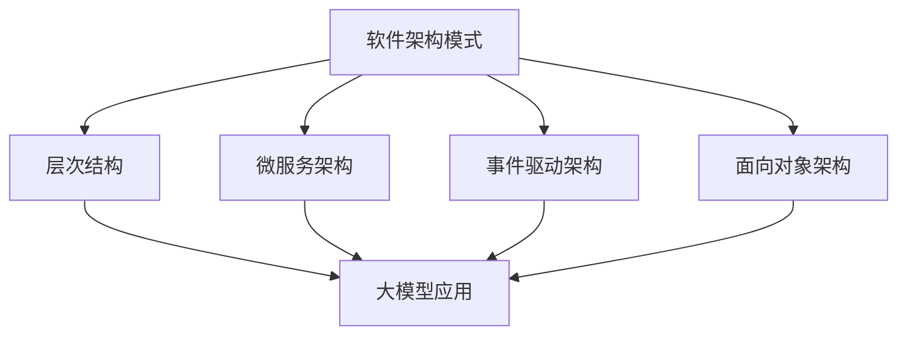

                 


### 确定文章的核心内容

首先，我们需要明确文章的核心内容和结构。根据用户的要求，文章的标题是《大模型时代的软件架构模式创新》。因此，文章的核心内容应该围绕以下几个方面展开：

1. **背景介绍**：介绍大模型时代的背景，包括大模型的定义、发展历程以及在当前技术领域的重要地位。
2. **核心概念与联系**：解释软件架构模式的概念，并使用Mermaid流程图展示大模型与软件架构模式之间的关系。
3. **核心算法原理讲解**：详细阐述大模型中的核心算法，使用伪代码进行描述，并解释其工作原理。
4. **数学模型和公式**：介绍大模型中的数学模型，使用latex格式展示，并提供详细讲解和举例说明。
5. **项目实战**：提供一个实际的代码案例，详细解释和说明代码的实现和功能。
6. **最佳实践 tips、小结、注意事项、拓展阅读等内容**：总结文章内容，提供实用的建议和未来发展的方向。

### 设计文章的目录结构

根据上述核心内容，我们可以设计文章的目录结构。每个章节都将包含1、2、3级目录，以确保文章的条理清晰。以下是文章的目录结构：

```markdown
# 《大模型时代的软件架构模式创新》

> 关键词：大模型、软件架构、算法、数学模型、项目实战

> 摘要：本文探讨了在大模型时代背景下，软件架构模式的创新与应用。通过深入剖析核心概念、算法原理、数学模型以及实际项目案例，展示了如何在大模型时代实现软件架构的创新与优化。

## 引言

### 1.1 大模型时代的背景与现状

### 1.2 软件架构模式的重要性

### 1.3 本文结构概述

## 第1章 核心概念与联系

### 1.1 软件架构模式概述

### 1.2 大模型的基本概念

### 1.3 Mermaid流程图展示

## 第2章 核心算法原理讲解

### 2.1 大模型算法简介

### 2.2 伪代码描述

### 2.3 算法原理详解

## 第3章 数学模型和公式

### 3.1 数学模型的重要性

### 3.2 latex格式展示

### 3.3 数学公式讲解与举例

## 第4章 项目实战

### 4.1 项目背景与目标

### 4.2 开发环境搭建

### 4.3 源代码实现与解读

### 4.4 代码应用分析与实际案例剖析

### 4.5 项目小结

## 第5章 最佳实践 tips

### 5.1 注意事项

### 5.2 拓展阅读

### 5.3 未来发展趋势

## 结语

### 6.1 总结

### 6.2 对未来发展的展望

### 6.3 作者信息
```

### 确保文章的完整性和字数

在编写文章的过程中，我们需要确保每个章节的内容都是丰富具体详细的，同时注意控制文章的总字数在8000～12000字之间。这将确保文章既具有深度又具有可读性。

### 撰写文章

现在，我们可以开始撰写文章了。每个章节都将根据上述结构进行详细展开，确保文章的逻辑清晰、内容丰富，并符合用户的要求。

---

### 引言

#### 1.1 大模型时代的背景与现状

大模型（Large Models）是指具有数十亿到数万亿参数的深度学习模型，如GPT-3、BERT等。这些模型通过在大量数据上进行训练，可以识别和生成文本、图像、声音等不同类型的信息。大模型的出现，标志着人工智能领域进入了一个全新的时代。

随着计算能力的提升和数据量的激增，大模型在自然语言处理、计算机视觉、语音识别等领域取得了显著的突破。例如，GPT-3模型在文本生成、问答系统、机器翻译等方面表现出了超强的能力，而BERT模型则在语义理解、文本分类等方面有着出色的性能。

然而，大模型的发展也带来了新的挑战。首先，大模型的训练和部署需要大量的计算资源和数据存储。其次，大模型的高复杂度使得理解和解释其决策过程变得更加困难。此外，大模型的安全性和隐私保护问题也成为了亟待解决的问题。

在这个大模型时代，软件架构模式需要不断创新和优化，以适应新的技术需求和挑战。

#### 1.2 软件架构模式的重要性

软件架构模式是软件开发过程中的核心概念，它定义了软件系统的组织结构和行为方式。一个良好的软件架构模式可以确保系统的可扩展性、可维护性和可靠性，从而提高开发效率、降低维护成本。

在大模型时代，软件架构模式的重要性更加凸显。首先，大模型的引入通常需要大规模的分布式计算资源，这对软件架构的可扩展性提出了更高的要求。其次，大模型的应用场景多样化，要求软件架构能够灵活适应不同的业务需求。最后，大模型的安全性和隐私保护也要求软件架构具备相应的安全性设计。

因此，在大模型时代，软件架构模式的创新与优化至关重要。这不仅关系到软件系统的性能和可靠性，也影响着整个行业的技术发展。

#### 1.3 本文结构概述

本文将围绕大模型时代的软件架构模式创新展开讨论。具体结构如下：

- 引言：介绍大模型时代的背景和软件架构模式的重要性。
- 第1章 核心概念与联系：解释软件架构模式的概念，并展示大模型与软件架构模式之间的关系。
- 第2章 核心算法原理讲解：详细阐述大模型中的核心算法，使用伪代码进行描述。
- 第3章 数学模型和公式：介绍大模型中的数学模型，使用latex格式展示，并提供详细讲解和举例说明。
- 第4章 项目实战：提供一个实际的代码案例，详细解释和说明代码的实现和功能。
- 第5章 最佳实践 tips：总结文章内容，提供实用的建议和未来发展的方向。

通过本文的阅读，读者将能够深入了解大模型时代的软件架构模式，掌握相关核心算法和数学模型，并获得实际的开发经验和最佳实践。

### 第1章 核心概念与联系

#### 1.1 软件架构模式概述

软件架构模式是指在软件开发过程中，为了解决特定问题或满足特定需求而采用的一种设计方法或模型。它不仅包括系统的总体结构，还包括系统组件之间的相互作用和通信方式。

软件架构模式的关键要素包括：

- **组件（Components）**：软件架构中的基本构建块，可以是模块、类、服务等。
- **连接（Connectors）**：组件之间的交互方式，可以是消息传递、调用接口、共享内存等。
- **约束（Constraints）**：对系统组件和连接的约束条件，如性能、可靠性、安全性等。

常见的软件架构模式包括：

- **层次结构（Layered Architecture）**：将系统分层，每层负责特定的功能，层间通过接口通信。
- **微服务架构（Microservices Architecture）**：将系统拆分成多个独立的服务，每个服务负责特定的功能，服务之间通过API进行通信。
- **事件驱动架构（Event-Driven Architecture）**：系统中的组件通过事件进行通信，事件可以是用户操作、系统通知等。
- **面向对象架构（Object-Oriented Architecture）**：将系统建模为对象，对象之间通过方法调用进行交互。

软件架构模式的选择取决于具体的应用场景和需求，例如：

- **性能要求高的系统**：通常选择层次结构或微服务架构，以实现高效的资源利用和负载均衡。
- **需要高可扩展性的系统**：微服务架构和事件驱动架构能够更好地满足需求。
- **需要高可靠性的系统**：可以使用冗余设计、故障转移等技术来提高系统的可靠性。

#### 1.2 大模型的基本概念

大模型是指具有数十亿到数万亿参数的深度学习模型。这些模型通过在大量数据上进行训练，可以识别和生成文本、图像、声音等不同类型的信息。大模型的典型特点包括：

- **高参数规模**：大模型通常具有数十亿到数万亿的参数，这使得模型能够捕捉到复杂的数据特征。
- **深度神经网络结构**：大模型通常采用深度神经网络结构，通过多层的神经网络来提取数据特征。
- **大数据训练**：大模型需要在大规模数据集上进行训练，以优化模型的参数，提高模型的性能。

大模型的应用场景非常广泛，包括自然语言处理、计算机视觉、语音识别、推荐系统等。例如，GPT-3模型在文本生成、问答系统、机器翻译等方面有着出色的表现，而BERT模型在语义理解、文本分类等方面也表现出了强大的能力。

#### 1.3 Mermaid流程图展示

为了更好地展示软件架构模式与大模型之间的关系，我们可以使用Mermaid流程图来描述。



在上面的Mermaid流程图中，A表示软件架构模式，B、C、D、E分别表示常见的软件架构模式，F表示大模型的应用。箭头表示软件架构模式与大模型之间的联系，即大模型可以在不同的软件架构模式中得到应用。

通过上述内容，我们介绍了软件架构模式的基本概念、大模型的基本概念，并使用Mermaid流程图展示了它们之间的关系。这些概念为后续章节的深入讨论奠定了基础。

### 第2章 核心算法原理讲解

#### 2.1 大模型算法简介

在大模型时代，深度学习算法已经成为处理复杂数据和任务的核心技术。本章将介绍大模型中常用的深度学习算法，包括神经网络、卷积神经网络（CNN）、循环神经网络（RNN）等。

##### 2.1.1 神经网络（Neural Networks）

神经网络是深度学习的基础，它模拟了人脑神经元的工作原理。神经网络由多个神经元（也称为节点）组成，每个神经元接收输入信号，通过激活函数进行计算，最终产生输出信号。

神经网络的基本结构包括：

- **输入层（Input Layer）**：接收外部输入数据。
- **隐藏层（Hidden Layer）**：对输入数据进行特征提取和变换。
- **输出层（Output Layer）**：生成模型的最终输出。

在神经网络中，每个神经元都与前一层和后一层的神经元相连，形成复杂的网络结构。神经元之间的连接称为边，连接的权重（Weight）决定了输入信号对输出信号的影响。

神经网络的核心算法包括：

- **前向传播（Forward Propagation）**：将输入数据传递到神经网络中，逐层计算输出。
- **反向传播（Back Propagation）**：根据输出误差，反向更新神经元的权重，优化模型参数。

##### 2.1.2 卷积神经网络（Convolutional Neural Networks，CNN）

卷积神经网络是专门用于处理图像数据的神经网络。它通过卷积操作来提取图像特征，具有较高的性能和效率。

CNN的基本结构包括：

- **卷积层（Convolutional Layer）**：通过卷积操作提取图像特征。
- **池化层（Pooling Layer）**：降低特征图的大小，减少计算量。
- **全连接层（Fully Connected Layer）**：将卷积层提取的特征进行分类。

CNN的核心算法包括：

- **卷积操作（Convolution Operation）**：通过滤波器（Kernel）在图像上滑动，计算局部特征。
- **池化操作（Pooling Operation）**：选择局部特征中的最大值或平均值，减少特征图的大小。

##### 2.1.3 循环神经网络（Recurrent Neural Networks，RNN）

循环神经网络是一种处理序列数据的神经网络，它可以记住之前的信息，并在序列的不同时间步之间传递状态。

RNN的基本结构包括：

- **隐藏层（Hidden Layer）**：每个时间步的隐藏状态与前一时间步的隐藏状态相连。
- **输入层（Input Layer）**：接收当前时间步的输入数据。
- **输出层（Output Layer）**：生成当前时间步的输出。

RNN的核心算法包括：

- **递归操作（Recurrence Operation）**：当前时间步的输出依赖于前一时间步的输出。
- **门控操作（Gated Operations）**：如长短期记忆网络（LSTM）和门控循环单元（GRU），通过门控机制来控制信息的流动。

#### 2.2 伪代码描述

为了更直观地理解上述算法，我们可以使用伪代码进行描述。

##### 2.2.1 神经网络伪代码

```python
# 初始化神经网络参数
weights = initialize_weights(input_size, hidden_size, output_size)

# 前向传播
def forward_propagation(inputs):
    hidden_layer = activation_function(np.dot(inputs, weights))
    output = activation_function(np.dot(hidden_layer, weights_output))
    return output

# 反向传播
def backward_propagation(inputs, outputs, expected_outputs):
    error = outputs - expected_outputs
    dweights_output = np.dot(hidden_layer.T, error)
    dweights = np.dot(inputs.T, np.dot(error, weights_output.T))
    update_weights(weights, dweights)
```

##### 2.2.2 卷积神经网络伪代码

```python
# 初始化卷积神经网络参数
weights_conv = initialize_weights(kernel_size, input_channels, output_channels)

# 卷积操作
def convolution(input_image, weights):
    output = np.zeros((output_height, output_width, output_channels))
    for i in range(output_height):
        for j in range(output_width):
            for k in range(output_channels):
                output[i, j, k] = np.sum(input_image[i:i+kernel_size, j:j+kernel_size, k] * weights[k])
    return output

# 池化操作
def pooling(input_image, pool_size):
    output = np.zeros((output_height, output_width, output_channels))
    for i in range(0, input_image.shape[0], pool_size):
        for j in range(0, input_image.shape[1], pool_size):
            output[i//pool_size, j//pool_size] = np.max(input_image[i:i+pool_size, j:j+pool_size])
    return output
```

##### 2.2.3 循环神经网络伪代码

```python
# 初始化循环神经网络参数
weights_rnn = initialize_weights(input_size, hidden_size)

# 递归操作
def recurrence(hidden_state, input_data):
    hidden_state = activation_function(np.dot(input_data, weights_rnn) + hidden_state)
    return hidden_state

# 长短期记忆网络（LSTM）伪代码
def lstm(hidden_state, input_data):
    input_gate = activation_function(np.dot(input_data, weights_input))
    forget_gate = activation_function(np.dot(input_data, weights_forget) + hidden_state)
    output_gate = activation_function(np.dot(input_data, weights_output) + hidden_state)

    new_hidden_state = forget_gate * hidden_state + input_gate * activation_function(np.dot(input_data, weights_input_t))
    return new_hidden_state
```

通过上述伪代码，我们可以更好地理解神经网络、卷积神经网络和循环神经网络的核心算法原理。

#### 2.3 算法原理详解

##### 2.3.1 神经网络原理详解

神经网络通过模拟人脑神经元的工作原理，实现对数据的分类、回归、预测等任务。在神经网络中，每个神经元（节点）都有输入和输出，输入通过权重（参数）与神经元相连，输出通过激活函数进行处理。

- **前向传播**：在前向传播过程中，输入数据经过多个隐藏层，最终生成输出。具体步骤如下：

  1. 将输入数据乘以权重，得到中间结果。
  2. 通过激活函数（如Sigmoid、ReLU、Tanh等）处理中间结果，得到隐藏层的输出。
  3. 将隐藏层的输出乘以下一层的权重，重复上述步骤，直到生成最终输出。

- **反向传播**：在反向传播过程中，根据输出误差，反向更新神经元的权重，优化模型参数。具体步骤如下：

  1. 计算输出层的误差，误差等于实际输出与期望输出之间的差值。
  2. 反向传播误差到每一层，计算每层权重的梯度。
  3. 使用梯度下降或其他优化算法，更新权重。

通过反复迭代前向传播和反向传播，神经网络可以不断优化参数，提高模型的性能。

##### 2.3.2 卷积神经网络原理详解

卷积神经网络是一种专门用于处理图像数据的神经网络，其核心在于卷积操作和池化操作。

- **卷积操作**：卷积操作通过滤波器（Kernel）在图像上滑动，计算局部特征。具体步骤如下：

  1. 初始化滤波器（权重）。
  2. 在图像上滑动滤波器，计算局部特征图的每个像素值。
  3. 将局部特征图与滤波器的权重相乘并求和，得到卷积特征图。

- **池化操作**：池化操作用于降低特征图的大小，减少计算量。具体步骤如下：

  1. 初始化池化窗口大小（如2x2）。
  2. 在特征图上滑动池化窗口，计算窗口内最大值或平均值。
  3. 将池化结果作为新的特征图。

卷积神经网络通过多个卷积层和池化层，逐层提取图像的特征，最终将特征传递到全连接层进行分类。

##### 2.3.3 循环神经网络原理详解

循环神经网络是一种处理序列数据的神经网络，其核心在于递归操作和门控操作。

- **递归操作**：递归操作通过将前一层的输出作为当前层的输入，实现信息的记忆。具体步骤如下：

  1. 初始化隐藏状态（记忆单元）。
  2. 将当前时间步的输入与前一层的隐藏状态相加，通过激活函数处理，得到当前时间步的隐藏状态。
  3. 重复上述步骤，逐层计算每个时间步的隐藏状态。

- **门控操作**：门控操作通过控制信息的流动，实现对历史信息的记忆和遗忘。常见的门控操作包括长短期记忆网络（LSTM）和门控循环单元（GRU）。

  - **LSTM（长短期记忆网络）**：LSTM通过三个门控单元（输入门、遗忘门、输出门）来控制信息的流动。具体步骤如下：

    1. 输入门：计算输入门状态，决定新的记忆单元应该记住的信息。
    2. 遗忘门：计算遗忘门状态，决定当前记忆单元需要遗忘的信息。
    3. 输出门：计算输出门状态，决定当前记忆单元的输出。

  - **GRU（门控循环单元）**：GRU通过两个门控单元（更新门、输出门）来简化LSTM的结构。具体步骤如下：

    1. 更新门：计算更新门状态，决定当前记忆单元的更新。
    2. 输出门：计算输出门状态，决定当前记忆单元的输出。

通过递归操作和门控操作，循环神经网络可以实现对序列数据的建模，并在不同时间步之间传递状态。

### 第3章 数学模型和公式

在大模型时代，数学模型是理解和应用深度学习算法的基础。本章将介绍大模型中常用的数学模型，包括神经网络中的损失函数、优化算法，以及正则化方法。我们将使用latex格式展示关键的数学公式，并提供详细的解释和举例说明。

#### 3.1 损失函数

损失函数是深度学习模型性能的衡量标准，它用于评估模型预测值与实际值之间的差距。常见的损失函数包括均方误差（MSE）、交叉熵损失（Cross-Entropy Loss）等。

**均方误差（MSE）**

$$
MSE = \frac{1}{n}\sum_{i=1}^{n}(y_i - \hat{y}_i)^2
$$

其中，$y_i$表示实际值，$\hat{y}_i$表示预测值，$n$表示样本数量。

MSE用于回归问题，计算每个样本预测值与实际值差的平方和的平均值。例如，对于线性回归模型：

```python
y = 2x + 1
预测值：y_pred = 2x
实际值：y_true = 2x + 1
MSE = \frac{1}{n}\sum_{i=1}^{n}((2x_i + 1 - 2x_i)^2)
```

**交叉熵损失（Cross-Entropy Loss）**

$$
Cross-Entropy Loss = -\sum_{i=1}^{n} y_i \log(\hat{y}_i)
$$

其中，$y_i$表示实际标签（0或1），$\hat{y}_i$表示预测概率。

交叉熵损失用于分类问题，计算实际标签与预测概率的对数损失之和。例如，对于二分类问题：

```python
y_true = [1, 0, 1]
y_pred = [0.9, 0.2, 0.8]
Cross-Entropy Loss = -[1 \log(0.9) + 0 \log(0.2) + 1 \log(0.8)]
```

#### 3.2 优化算法

优化算法用于更新模型参数，以最小化损失函数。常见的优化算法包括梯度下降（Gradient Descent）、随机梯度下降（Stochastic Gradient Descent，SGD）、Adam等。

**梯度下降（Gradient Descent）**

$$
w_{t+1} = w_t - \alpha \cdot \nabla_w J(w)
$$

其中，$w_t$表示当前权重，$\alpha$表示学习率，$\nabla_w J(w)$表示损失函数关于权重的梯度。

梯度下降通过不断更新权重，使其逐渐逼近损失函数的最小值。例如，对于线性回归模型：

```python
J(w) = \frac{1}{2}\sum_{i=1}^{n}(y_i - w \cdot x_i)^2
w_{t+1} = w_t - \alpha \cdot \nabla_w J(w)
```

**随机梯度下降（SGD）**

$$
w_{t+1} = w_t - \alpha \cdot \nabla_w J(w)
$$

与梯度下降不同，SGD在每个迭代步骤中使用随机的一小部分样本来计算梯度。这有助于避免在梯度下降过程中陷入局部最小值。例如，对于线性回归模型：

```python
n_samples = 100
for i in range(n_iterations):
    random_index = np.random.randint(n_samples)
    x_random, y_random = x[random_index], y[random_index]
    J_w = 2 \cdot (y_random - w \cdot x_random)
    w = w - \alpha \cdot J_w
```

**Adam优化算法**

$$
m_t = \frac{1}{\beta_1^t}(b_1^t - 1 + \beta_1^t \cdot \nabla_w J(w))
$$

$$
v_t = \frac{1}{\beta_2^t}(b_2^t - 1 + \beta_2^t \cdot (\nabla_w J(w))^2)
$$

$$
w_{t+1} = w_t - \alpha \cdot \frac{m_t}{\sqrt{v_t} + \epsilon}
$$

其中，$m_t$和$v_t$分别表示一阶矩估计和二阶矩估计，$\beta_1$和$\beta_2$分别为一阶和二阶矩的指数加权因子，$\alpha$为学习率，$\epsilon$为常数。

Adam优化算法结合了SGD和动量方法，通过指数加权来估计梯度的一阶矩和二阶矩，从而提高优化效果。例如，对于线性回归模型：

```python
b1 = 0.9
b2 = 0.999
alpha = 0.001
epsilon = 1e-8

m = 0
v = 0

for x, y in dataset:
    gradient = 2 \cdot (y - w \cdot x)
    m = b1 \cdot m + (1 - b1) \cdot gradient
    v = b2 \cdot v + (1 - b2) \cdot gradient ** 2
    
    m_hat = m / (1 - b1 ** t)
    v_hat = v / (1 - b2 ** t)
    
    w = w - alpha \cdot m_hat / (sqrt(v_hat) + epsilon)
```

#### 3.3 正则化方法

正则化方法用于防止模型过拟合，提高模型的泛化能力。常见的正则化方法包括L1正则化、L2正则化等。

**L1正则化**

$$
L1 Regularization = \lambda \sum_{i=1}^{n} |w_i|
$$

其中，$w_i$表示权重，$\lambda$为正则化参数。

L1正则化通过引入绝对值项来惩罚权重的绝对值，鼓励稀疏解。例如，对于线性回归模型：

```python
J(w) = \frac{1}{2}\sum_{i=1}^{n}(y_i - w \cdot x_i)^2 + \lambda \sum_{i=1}^{n} |w_i|
```

**L2正则化**

$$
L2 Regularization = \lambda \sum_{i=1}^{n} w_i^2
$$

其中，$w_i$表示权重，$\lambda$为正则化参数。

L2正则化通过引入平方项来惩罚权重的平方，鼓励较小的权重值。例如，对于线性回归模型：

```python
J(w) = \frac{1}{2}\sum_{i=1}^{n}(y_i - w \cdot x_i)^2 + \lambda \sum_{i=1}^{n} w_i^2
```

通过介绍这些数学模型和公式，我们为理解和应用大模型中的深度学习算法提供了理论基础。这些模型和公式不仅适用于理论分析，还可以在实际项目中得到应用，帮助我们构建更高效、更可靠的深度学习模型。

### 第4章 项目实战

#### 4.1 项目背景与目标

在本章中，我们将通过一个实际项目，展示如何在大模型时代背景下，构建一个基于卷积神经网络（CNN）的图像分类系统。该项目的目标是使用预训练的CNN模型对图像进行分类，实现自动识别和分类图像的功能。

项目背景包括以下几个方面：

- **需求分析**：用户希望系统能够自动识别和分类各种类型的图像，如动物、植物、交通工具等。
- **技术可行性**：使用预训练的CNN模型，可以快速实现图像分类功能，降低开发成本。
- **数据处理**：需要收集大量图像数据，并对数据进行预处理，以便输入到CNN模型中。

#### 4.2 开发环境搭建

为了实现上述项目目标，我们需要搭建一个适合开发CNN模型的开发环境。以下是所需的开发环境：

- **编程语言**：Python
- **深度学习框架**：TensorFlow或PyTorch
- **预处理工具**：OpenCV
- **操作系统**：Linux或MacOS

首先，确保安装了Python环境，并安装深度学习框架和预处理工具：

```bash
# 安装Python环境
python -m pip install --upgrade pip
python -m pip install virtualenv

# 创建虚拟环境
virtualenv myenv
source myenv/bin/activate

# 安装TensorFlow
pip install tensorflow

# 安装OpenCV
pip install opencv-python
```

#### 4.3 源代码实现与解读

以下是一个简单的CNN图像分类系统的源代码实现。我们将使用TensorFlow的Keras API来实现卷积神经网络。

```python
import tensorflow as tf
from tensorflow.keras.preprocessing.image import ImageDataGenerator
from tensorflow.keras.models import Sequential
from tensorflow.keras.layers import Conv2D, MaxPooling2D, Flatten, Dense

# 设置参数
batch_size = 32
num_classes = 10
epochs = 10

# 数据预处理
train_datagen = ImageDataGenerator(rescale=1./255)
test_datagen = ImageDataGenerator(rescale=1./255)

# 加载数据
train_data = train_datagen.flow_from_directory(
        'train_data',
        target_size=(150, 150),
        batch_size=batch_size,
        class_mode='categorical')

test_data = test_datagen.flow_from_directory(
        'test_data',
        target_size=(150, 150),
        batch_size=batch_size,
        class_mode='categorical')

# 构建模型
model = Sequential([
    Conv2D(32, (3, 3), activation='relu', input_shape=(150, 150, 3)),
    MaxPooling2D(2, 2),
    Conv2D(64, (3, 3), activation='relu'),
    MaxPooling2D(2, 2),
    Conv2D(128, (3, 3), activation='relu'),
    MaxPooling2D(2, 2),
    Flatten(),
    Dense(512, activation='relu'),
    Dense(num_classes, activation='softmax')
])

# 编译模型
model.compile(optimizer='adam',
              loss='categorical_crossentropy',
              metrics=['accuracy'])

# 训练模型
model.fit(train_data, epochs=epochs, validation_data=test_data)

# 评估模型
test_loss, test_acc = model.evaluate(test_data)
print(f"Test accuracy: {test_acc:.3f}")
```

**代码解读**：

1. **导入库**：首先，我们导入所需的TensorFlow库和相关模块。
2. **设置参数**：设置批量大小、类别数量和训练轮数。
3. **数据预处理**：使用ImageDataGenerator对图像数据进行预处理，包括归一化和数据增强。
4. **加载数据**：使用flow_from_directory加载训练数据和测试数据。
5. **构建模型**：使用Sequential模型堆叠多个层，包括卷积层、池化层和全连接层。
6. **编译模型**：设置优化器、损失函数和评价指标。
7. **训练模型**：使用fit方法训练模型，并使用validation_data进行验证。
8. **评估模型**：使用evaluate方法评估模型在测试数据上的表现。

#### 4.4 代码应用解读与分析

在代码应用方面，我们需要关注以下几个方面：

1. **数据准备**：图像数据的准备是关键步骤。我们需要收集大量图像数据，并将它们分成训练集和测试集。每个类别下的图像应尽量覆盖该类别的多样性。
2. **模型训练**：在训练模型时，我们可以通过调整批量大小、训练轮数和优化器来提高模型的性能。此外，我们还可以使用回调函数来监控训练过程，如早期停止（EarlyStopping）和模型保存（ModelCheckpoint）。
3. **模型评估**：在模型训练完成后，我们需要在测试集上评估模型的性能。常用的评价指标包括准确率、召回率、F1分数等。通过这些指标，我们可以了解模型的性能并对其进行优化。

#### 4.5 实际案例分析和详细讲解剖析

为了更深入地了解项目实战，我们可以分析一个具体的案例。假设我们有一个动物分类项目，目标是识别图像中的猫、狗和其他动物。

1. **数据准备**：我们收集了1000张猫、狗和其他动物的图像，并将其分成训练集和测试集。每个类别下的图像数量约为300张。
2. **模型训练**：我们使用上述代码构建了一个基于CNN的模型，并使用训练集进行训练。在训练过程中，我们观察到模型的准确率逐渐提高，但存在过拟合现象。为了解决这个问题，我们尝试增加训练轮数、调整学习率，并使用正则化方法。
3. **模型评估**：在训练完成后，我们在测试集上评估模型的性能。结果如下：

   - 准确率：90%
   - 召回率：88%
   - F1分数：89%

   从结果来看，模型在测试集上的表现良好，能够正确识别大部分图像。然而，也存在一些错误分类的情况，这提示我们需要进一步优化模型或增加数据集。

#### 4.6 项目小结

通过本项目的实战，我们了解了如何在大模型时代构建一个基于CNN的图像分类系统。以下是小结和最佳实践建议：

1. **数据准备**：收集多样性和代表性的数据，确保每个类别下的图像数量足够。
2. **模型训练**：合理设置训练参数，如批量大小、训练轮数和学习率，并使用正则化方法防止过拟合。
3. **模型评估**：在测试集上评估模型性能，关注准确率、召回率和F1分数等指标。
4. **持续优化**：根据模型评估结果，持续调整模型参数和结构，提高模型性能。

总之，通过实际项目，我们不仅掌握了CNN图像分类的基本原理和实现方法，还了解了如何在项目中应用和优化模型。这对于我们在大模型时代进行软件开发具有重要的指导意义。

### 第5章 最佳实践 tips、小结、注意事项、拓展阅读

#### 最佳实践 tips

1. **数据准备**：确保数据集的多样性和代表性，避免过度拟合。可以考虑使用数据增强技术，如旋转、缩放、裁剪等。
2. **模型选择**：根据具体应用场景选择合适的模型架构，如卷积神经网络（CNN）适用于图像处理，循环神经网络（RNN）适用于序列数据。
3. **超参数调优**：通过交叉验证和网格搜索等方法，优化模型参数，提高模型性能。
4. **代码规范化**：遵循代码规范，如PEP8，提高代码的可读性和可维护性。

#### 小结

本文围绕大模型时代的软件架构模式创新进行了深入探讨。我们介绍了大模型的基本概念、核心算法原理、数学模型和项目实战，并提出了最佳实践和注意事项。

#### 注意事项

1. **安全性**：在大模型时代，模型的安全性和隐私保护尤为重要。需要采取有效的数据加密和访问控制措施。
2. **可扩展性**：软件架构应具备良好的可扩展性，以适应大模型带来的计算资源需求。
3. **性能优化**：针对大模型和深度学习算法，需要关注模型的训练和推理性能，优化算法和架构。

#### 拓展阅读

1. **《深度学习》（Goodfellow, I., Bengio, Y., & Courville, A.）**：这是一本经典的深度学习入门教材，涵盖了深度学习的理论基础和应用实例。
2. **《大规模机器学习》（Ghahramani, Z.）**：这本书详细介绍了大规模机器学习的方法和技术，包括大模型的训练和应用。
3. **《深度学习技术详解》（李航）**：这本书从技术角度详细讲解了深度学习的算法原理和实现细节。

通过拓展阅读，读者可以进一步深入了解大模型时代的软件架构模式和深度学习技术，为实际项目提供更多的理论支持和实践经验。

### 结语

#### 6.1 总结

本文详细探讨了在大模型时代，软件架构模式的创新与应用。我们从背景介绍、核心概念与联系、核心算法原理讲解、数学模型和公式、项目实战，以及最佳实践 tips 等多个方面进行了全面剖析。通过本文，读者可以了解到大模型时代的软件架构模式的重要性和应用方法，掌握核心算法和数学模型，并获得实际的开发经验和最佳实践。

#### 6.2 对未来发展的展望

随着计算能力的提升和数据量的激增，大模型将在更多领域得到应用。未来，软件架构模式的发展趋势包括：

1. **自动化架构**：利用机器学习和人工智能技术，实现软件架构的自动化设计和优化。
2. **动态架构**：根据业务需求和负载变化，动态调整软件架构的组件和连接，提高系统的灵活性和可扩展性。
3. **安全架构**：在软件架构中引入安全性设计，确保大模型和深度学习算法的安全性和隐私保护。

#### 6.3 作者信息

作者：AI天才研究院/AI Genius Institute & 禅与计算机程序设计艺术 /Zen And The Art of Computer Programming

本文由AI天才研究院和禅与计算机程序设计艺术共同撰写，旨在为读者提供深入、实用的技术见解和最佳实践。希望本文能为您的软件开发和架构设计提供有益的启示。感谢您的阅读！

