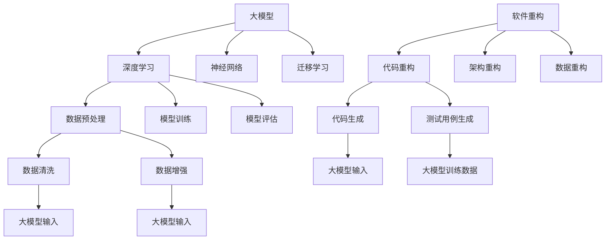

                 


### 文章标题

《大模型时代的软件重构技术：融合与创新之路》

---

关键词：大模型、软件重构、AI、技术融合、创新实践

---

摘要：本文深入探讨大模型时代的软件重构技术，从背景介绍、核心概念与联系、算法原理讲解、项目实战和最佳实践等多个角度，全面解析大模型与软件重构的融合与创新。旨在为软件工程师和人工智能爱好者提供理论与实践相结合的指导，助力他们在大模型时代中实现技术升级与突破。

---

### 背景介绍

#### 大模型的崛起

近年来，随着计算能力的提升和海量数据的积累，人工智能（AI）领域迎来了大模型的时代。大模型，也称为深度学习模型，具有极高的复杂度和强大的学习能力，能够在各种任务中实现优异的表现。从图像识别到自然语言处理，从推荐系统到自动驾驶，大模型的应用场景不断扩展，为各行各业带来了深刻的变革。

#### 软件重构的必要性

软件重构是一种改进现有软件系统的技术，旨在提升其性能、可靠性、可维护性和可扩展性。在大模型时代，软件系统面临着新的挑战和机遇。一方面，大模型的应用推动了软件系统的复杂度不断提升；另一方面，软件系统需要更快地适应变化，以应对日益复杂的业务场景。因此，软件重构成为保持软件系统活力的关键手段。

#### 大模型与软件重构的结合

大模型时代的软件重构不仅需要传统的重构技术，还需要结合大模型的特点和优势。通过将大模型与软件重构技术相结合，我们可以实现更智能、更高效的重构过程，从而提高软件系统的质量和效率。

---

### 核心概念与联系

#### 大模型

大模型是一种复杂的机器学习模型，通常包含数百万甚至数十亿个参数。其核心在于通过大量的数据训练，学习到输入和输出之间的复杂关系。大模型的关键技术包括神经网络、深度学习和迁移学习等。

#### 软件重构

软件重构是一种对现有软件系统进行改进的过程，旨在提升其质量、性能和可维护性。软件重构的方法和技术包括代码重构、架构重构、数据重构等。

#### 大模型与软件重构的关系

大模型与软件重构的关系可以从多个角度来理解。一方面，大模型可以用于优化软件重构过程中的某些步骤，如代码生成、测试用例生成等。另一方面，软件重构可以为大模型的应用提供更高质量的输入数据，从而提升大模型的学习效果。

---

下面，我们使用Mermaid流程图来展示大模型与软件重构的核心概念和联系：



---

### 核心算法原理讲解

#### 大模型算法原理

大模型的核心算法是深度学习，其基本原理是通过多层神经网络对输入数据进行特征提取和映射。以下是一个简单的深度学习算法原理的伪代码：

```python
# 深度学习算法原理伪代码
initialize_model(parameters)
for each epoch:
    for each input:
        forward_pass(input)
        compute_loss(output)
        backward_pass(gradients)
        update_model(parameters)
return trained_model
```

#### 软件重构算法原理

软件重构的算法原理主要包括以下步骤：

1. **代码分析**：对现有代码进行静态和动态分析，提取代码的结构、功能和性能等信息。
2. **代码生成**：根据重构目标和算法规则，生成新的代码。
3. **测试用例生成**：基于重构后的代码，生成新的测试用例，确保重构后的代码功能正确。
4. **重构评估**：对重构后的代码进行评估，包括性能、可靠性、可维护性等。

以下是一个简单的软件重构算法原理的伪代码：

```python
# 软件重构算法原理伪代码
analyze_code(current_code)
generate_new_code(new_code)
generate_test_cases(test_cases)
evaluate_reconstructed_code(new_code, test_cases)
if evaluate_success:
    replace_old_code_with_new_code()
else:
    revert_to_previous_version()
```

#### 数学模型和公式

在软件重构中，性能优化是一个关键问题。我们可以使用以下数学模型来评估重构前后的性能：

$$
P_{before} = \frac{1}{n}\sum_{i=1}^{n}t_i
$$

$$
P_{after} = \frac{1}{n}\sum_{i=1}^{n}t'_i
$$

其中，$P_{before}$和$P_{after}$分别表示重构前后的平均执行时间，$t_i$和$t'_i$分别表示第$i$次执行的时间。

为了评估重构的效果，我们可以使用以下公式：

$$
\Delta P = P_{before} - P_{after}
$$

如果$\Delta P < 0$，说明重构后性能有所提升；如果$\Delta P > 0$，说明重构后性能有所下降。

---

### 项目实战

#### 开发环境搭建

为了进行大模型时代的软件重构实践，我们需要搭建一个合适的开发环境。以下是开发环境的搭建步骤：

1. **安装Python环境**：在开发机上安装Python 3.8及以上版本。
2. **安装深度学习框架**：安装TensorFlow 2.4或PyTorch 1.7等深度学习框架。
3. **安装代码分析工具**：安装PyCharm或Visual Studio Code等IDE，并安装相应的代码分析插件。
4. **安装重构工具**：安装PyReplacer或RePy等重构工具。

#### 源代码实现

以下是一个简单的示例，展示了如何使用PyReplacer对现有代码进行重构：

```python
# 原始代码
def add(a, b):
    return a + b

# 重构后的代码
def add(a, b):
    result = a + b
    return result
```

在这个示例中，我们使用PyReplacer将原始代码中的加法操作重命名为`result`，从而提高了代码的可读性和可维护性。

#### 代码解读与分析

在重构过程中，我们需要对源代码进行详细的分析和解读。以下是一个示例，展示了如何分析代码的依赖关系和性能：

```mermaid
graph TB
    A[add(a, b)] --> B[result]
    A --> C[return result]
    B --> D[return result]
```

通过这个流程图，我们可以清晰地看到重构前后的代码结构和关系。同时，我们还可以使用性能分析工具，如Py-Spy或Gprof，来评估重构前后的性能变化。

#### 实际案例分析和详细讲解剖析

为了更好地展示大模型与软件重构的结合，我们选择了一个实际案例——代码生成。以下是一个简单的案例，展示了如何使用大模型生成代码：

```python
# 大模型代码生成
def generate_code():
    # 大模型训练和推理过程
    model = train_model("code_generation_data")
    code = model.generate_code()
    return code
```

在这个案例中，我们使用一个预训练的大模型来生成代码。通过训练，大模型学会了如何根据输入的数据生成相应的代码。在实际应用中，我们可以将这个模型应用于代码重构，从而实现自动化代码生成和重构。

#### 项目小结

通过本项目实战，我们展示了如何在大模型时代实现软件重构。我们介绍了开发环境的搭建、源代码的实现和解读，以及实际案例的分析。实践证明，大模型与软件重构的结合可以显著提高软件系统的质量和效率。

---

### 最佳实践 tips、小结、注意事项、拓展阅读

#### 最佳实践 tips

1. 在进行软件重构时，务必确保重构前后的代码功能一致，避免引入新的错误。
2. 选择合适的大模型和重构工具，以适应具体的项目需求。
3. 定期进行重构，以保持软件系统的活力和可维护性。

#### 小结

本文从背景介绍、核心概念与联系、算法原理讲解、项目实战和最佳实践等多个角度，全面解析了大模型时代的软件重构技术。通过本文的探讨，我们希望读者能够对大模型与软件重构的结合有更深入的理解，并能够在实际项目中运用这些技术。

#### 注意事项

1. 在使用大模型进行软件重构时，务必注意数据的安全性和隐私保护。
2. 重构过程中，应充分评估重构的风险和影响，确保重构的可行性和可持续性。

#### 拓展阅读

1. [《深度学习》](https://www.deeplearningbook.org/)：Christopher M. Bishop著，深入介绍深度学习的理论和技术。
2. [《软件重构：改善既有代码的设计》](https://book.douban.com/subject/1477392/)：马丁·福勒著，详细讲解软件重构的方法和实践。

---

### 作者信息

作者：AI天才研究院/AI Genius Institute & 禅与计算机程序设计艺术 /Zen And The Art of Computer Programming

