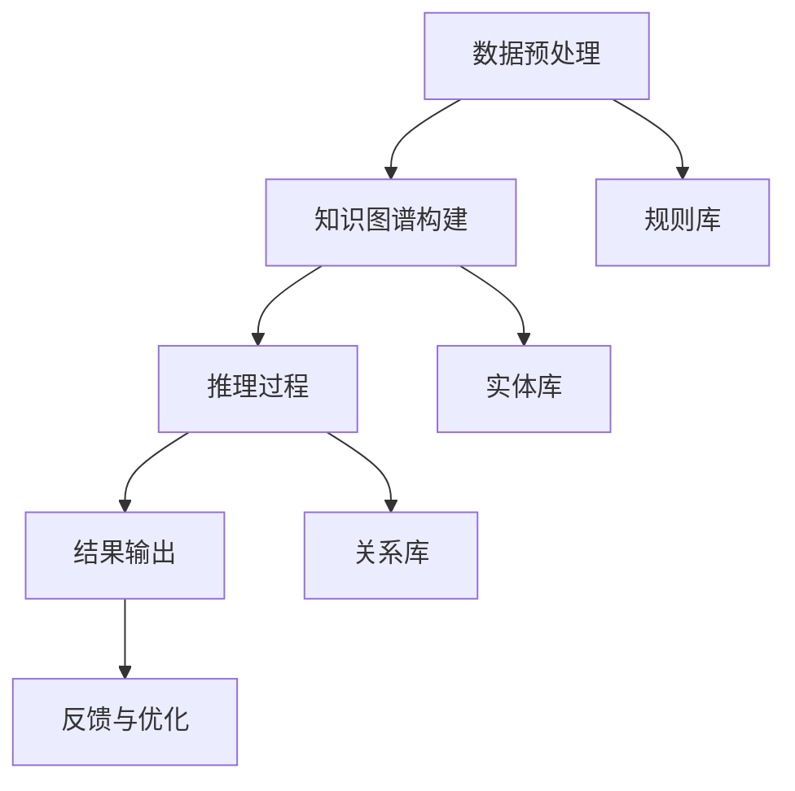

                 


## 文章标题: 大模型知识图谱推理与提示词逻辑链构建

## 关键词: 大模型、知识图谱、推理、提示词、逻辑链、人工智能

## 摘要

本文深入探讨了如何在大模型环境下进行知识图谱的推理以及构建提示词逻辑链的方法。通过分析大模型和知识图谱的基本原理，本文详细阐述了推理算法、逻辑链构建技巧以及优化策略。同时，通过实际案例和项目实战，展示了大模型在知识图谱推理中的应用，为人工智能领域的进一步发展提供了有价值的参考。

## 目录

### 第1章 引言

- 1.1 大模型的概念与重要性
- 1.2 知识图谱的基本原理
- 1.3 大模型在知识图谱中的应用

### 第2章 知识图谱推理原理

- 2.1 图数据库模型
- 2.2 知识图谱推理算法
- 2.3 知识图谱推理架构的 Mermaid 流程图

### 第3章 提示词逻辑链的构建

- 3.1 提示词逻辑链的概念
- 3.2 提示词逻辑链构建方法
- 3.3 提示词逻辑链的实际应用

### 第4章 大模型在知识图谱推理中的应用

- 4.1 大模型在推理中的基础
- 4.2 大模型在知识图谱推理中的实际案例
- 4.3 大模型的优化策略

### 第5章 优化技术

- 5.1 数学模型与优化算法
- 5.2 优化技术的实际应用
- 5.3 优化技术的案例分析

### 第6章 案例分析与项目实战

- 6.1 案例分析概述
- 6.2 案例一：知识图谱推理系统开发
- 6.3 案例二：提示词逻辑链的应用
- 6.4 项目实战小结

### 第7章 结论与未来展望

- 7.1 主要结论回顾
- 7.2 面临的挑战与未来研究方向

### 第1章 引言

#### 1.1 大模型的概念与重要性

大模型，通常指的是具有极高参数量、能处理海量数据的深度神经网络模型。这类模型在人工智能领域具有里程碑意义，能够实现对复杂问题的自动建模和求解。随着深度学习技术的不断发展，大模型的应用场景日益广泛，从自然语言处理到计算机视觉，从语音识别到推荐系统，都有大模型的身影。

大模型的重要性体现在以下几个方面：

1. **处理能力提升**：大模型具有更强的数据处理能力，能够高效地处理复杂的数据集，提高模型的预测准确性。
2. **泛化能力增强**：大模型通过大量的训练数据，能够学习到更为普遍的规律，从而提升模型的泛化能力。
3. **领域适应性**：大模型可以通过微调（fine-tuning）的方式快速适应不同的领域需求，减少了模型的重新训练时间。

#### 1.2 知识图谱的基本原理

知识图谱是一种用于表示实体之间关系的图形结构，它将现实世界中的信息以图形化的方式组织起来，使得数据之间的关系更加直观和清晰。知识图谱的核心概念包括实体、属性、关系和边。

1. **实体**：知识图谱中的主体，可以是任何具有独立存在意义的事物，如人、地点、组织等。
2. **属性**：实体具有的特定特征，如人的姓名、年龄、职业等。
3. **关系**：实体之间的关系，如“A是B的朋友”、“C在D工作”等。
4. **边**：连接两个实体的线段，表示实体之间的关系。

知识图谱在信息检索、数据挖掘、智能推荐等领域有着广泛的应用，其强大的关系表示能力使得数据分析和决策过程更加高效和准确。

#### 1.3 大模型在知识图谱中的应用

大模型在知识图谱中的应用主要体现在以下几个方面：

1. **图谱构建**：大模型可以通过深度学习算法自动构建知识图谱，将文本、图像等多模态数据转化为结构化的知识。
2. **推理与搜索**：大模型能够对知识图谱进行高效的推理和搜索，发现实体之间的潜在关系，提供精准的查询结果。
3. **增强理解**：大模型通过学习知识图谱中的关系，能够增强对自然语言的理解，提升问答系统和智能对话的准确性。

本章介绍了大模型和知识图谱的基本原理及其应用，为后续章节的深入探讨奠定了基础。在接下来的章节中，我们将进一步探讨知识图谱推理的原理、提示词逻辑链的构建方法以及大模型在实际应用中的优化策略。

### 第2章 知识图谱推理原理

知识图谱推理是人工智能领域中的一个重要研究方向，它通过分析实体之间的关系，发现新的知识和规律。本章将介绍知识图谱推理的基本原理，包括图数据库模型、推理算法和知识图谱推理架构。

#### 2.1 图数据库模型

图数据库（Graph Database）是用于存储和查询图结构数据的数据库系统。与传统的关系数据库不同，图数据库通过节点（Node）和边（Edge）来表示实体和关系，使得数据的存储和查询更加直观和高效。

1. **节点（Node）**：图数据库中的节点表示实体，每个节点可以具有多个属性，如名称、年龄、职业等。
2. **边（Edge）**：图数据库中的边表示节点之间的关系，边也有属性，如关系类型、权重等。

图数据库的存储模型通常采用邻接矩阵（Adjacency Matrix）或邻接表（Adjacency List）来表示。邻接矩阵适用于稀疏图，而邻接表适用于稠密图。

#### 2.2 知识图谱推理算法

知识图谱推理算法是用于分析实体之间关系，发现新知识的算法。常见的推理算法包括路径搜索、模式匹配和逻辑推理等。

1. **路径搜索**：路径搜索算法通过遍历图中的路径，发现实体之间的直接或间接关系。常见的路径搜索算法包括BFS（广度优先搜索）和DFS（深度优先搜索）。
2. **模式匹配**：模式匹配算法通过匹配实体和边的关系模式，发现符合条件的实体集合。常见的模式匹配算法包括SPARQL查询语言和路径表达式。
3. **逻辑推理**：逻辑推理算法基于逻辑规则，从已知的事实中推导出新的结论。常见的逻辑推理算法包括谓词逻辑和产生式规则。

以下是一个简单的逻辑推理算法的伪代码示例：

```
// 伪代码：基于逻辑规则的推理
def infer_fact(facts, rules):
    for fact in facts:
        for rule in rules:
            if matches(fact, rule条件):
                apply_rule(fact, rule操作)
                return True
    return False
```

#### 2.3 知识图谱推理架构的 Mermaid 流程图

知识图谱推理架构通常包括数据预处理、知识图谱构建、推理过程和结果输出等环节。以下是一个简单的Mermaid流程图，用于表示知识图谱推理的整体架构：



在本章中，我们介绍了知识图谱推理的基本原理，包括图数据库模型、推理算法和推理架构。这些原理构成了知识图谱推理的基础，为后续的详细讨论提供了理论支持。

### 第3章 提示词逻辑链的构建

提示词逻辑链是知识图谱推理过程中至关重要的一环，它通过一系列有逻辑关系的提示词，引导推理过程，提高推理的效率和准确性。本章将详细探讨提示词逻辑链的概念、构建方法以及其实际应用。

#### 3.1 提示词逻辑链的概念

提示词逻辑链（Prompt Logic Chain）是一系列按照特定逻辑关系排列的提示词，这些提示词共同引导推理过程，帮助模型快速、准确地获取所需信息。在知识图谱推理中，提示词逻辑链的作用类似于导航，指引模型沿着正确的路径进行推理，从而避免陷入错误的推理方向。

1. **提示词（Prompt）**：提示词是知识图谱推理中的基本单位，它可以是单个词汇或短语，用于引导模型的推理方向。例如，在回答“北京是中国的哪个省份？”这个问题时，“北京”和“省份”就是两个关键的提示词。
2. **逻辑关系（Logic Relationship）**：提示词之间的逻辑关系定义了它们之间的关联方式。常见的逻辑关系包括包含、属于、等于、大于、小于等。例如，“北京”和“省份”之间的逻辑关系是“属于”。
3. **逻辑链（Logic Chain）**：多个提示词按照特定的逻辑关系排列形成的序列，称为逻辑链。逻辑链的作用是引导模型按照预设的路径进行推理，从而提高推理的准确性和效率。

#### 3.2 提示词逻辑链的构建方法

构建一个有效的提示词逻辑链，需要遵循以下几个步骤：

1. **需求分析**：明确推理任务的目标和需求，确定需要获取的信息和关键实体。
2. **实体识别**：从输入文本中识别出相关的实体，如人、地点、组织等。
3. **关系确定**：分析实体之间的关系，确定哪些实体需要通过逻辑关系连接。
4. **逻辑链设计**：根据需求分析和关系确定的结果，设计出合理的提示词逻辑链，确保逻辑链能够有效地引导推理过程。
5. **逻辑链验证**：通过实际数据测试逻辑链的有效性，根据反馈进行调整和优化。

以下是一个简单的提示词逻辑链构建方法的伪代码示例：

```
// 伪代码：提示词逻辑链构建
def build_prompt_logic_chain(task, entities, relations):
    chain = []
    for entity in entities:
        if entity in task:
            chain.append(entity)
            for relation in relations:
                if relation起点 == entity and relation终点在task中:
                    chain.append(relation)
    return chain
```

#### 3.3 提示词逻辑链的实际应用

提示词逻辑链在实际应用中具有广泛的应用场景，以下是一些典型的应用实例：

1. **问答系统**：在问答系统中，提示词逻辑链用于引导模型回答特定问题。通过分析问题文本，识别出关键实体和关系，构建出有效的逻辑链，从而提高问答系统的准确性。
2. **推荐系统**：在推荐系统中，提示词逻辑链用于发现用户与商品之间的潜在关系。通过分析用户的浏览、购买历史，构建出逻辑链，从而提供个性化的推荐。
3. **智能对话系统**：在智能对话系统中，提示词逻辑链用于引导对话过程，使对话系统能够理解用户的需求并提供相应的答复。

以下是一个简单的提示词逻辑链在实际问答系统中的应用案例：

**问题**：请问苹果公司的总部在哪里？

**提示词逻辑链**：

```
- 苹果公司
- 总部
- 地点
```

通过这个逻辑链，模型可以快速定位到苹果公司的总部信息，并提供准确的答复。

本章介绍了提示词逻辑链的概念、构建方法和实际应用。通过有效的提示词逻辑链，可以显著提高知识图谱推理的准确性和效率，为人工智能应用提供强大的支持。

### 第4章 大模型在知识图谱推理中的应用

大模型在知识图谱推理中的应用，不仅极大地提升了推理效率，还显著增强了推理的准确性和泛化能力。本章节将探讨大模型在知识图谱推理中的基础、实际应用案例以及优化策略。

#### 4.1 大模型在推理中的基础

大模型在知识图谱推理中的基础主要涉及以下几个方面：

1. **深度学习模型**：大模型通常采用深度学习技术，如深度神经网络（DNN）、变换器模型（Transformer）等。这些模型具有强大的特征提取和关系建模能力，能够从大量数据中学习到复杂的模式和规律。
2. **大规模数据集**：大模型依赖于大规模数据集进行训练，这些数据集包含了丰富的实体和关系信息。通过在大数据集上的训练，大模型能够学习到更为普遍和准确的知识表示。
3. **自适应学习**：大模型能够通过在线学习（Online Learning）和迁移学习（Transfer Learning）技术，自适应地更新和优化模型参数，以适应不断变化的应用场景。

以下是一个简单的深度学习模型在知识图谱推理中的伪代码示例：

```
// 伪代码：大模型推理
class KnowledgeGraphInferenceModel:
    def __init__(self, model_params):
        self.model = build_model(model_params)

    def infer(self, entity, relation, knowledge_graph):
        inputs = prepare_inputs(entity, relation, knowledge_graph)
        outputs = self.model.predict(inputs)
        return process_outputs(outputs)
```

#### 4.2 大模型在知识图谱推理中的实际案例

大模型在知识图谱推理中的实际应用已经取得了显著成果，以下是一些典型的应用案例：

1. **问答系统**：大模型在问答系统中，通过推理知识图谱中的关系，能够提供精准的答案。例如，在大型企业内部的知识库系统中，大模型可以实时回答员工关于公司政策、流程等问题。
2. **推荐系统**：在电子商务和社交媒体平台中，大模型利用知识图谱进行用户和商品关系的推理，从而提供个性化的推荐服务。例如，淘宝和京东等电商平台，通过用户购买历史和商品属性，构建知识图谱，提供精准的推荐。
3. **智能客服**：大模型在智能客服系统中，通过推理用户的问题和知识图谱中的答案，能够提供高效的客户服务。例如，银行和电信运营商等领域的智能客服系统，利用大模型和知识图谱，实现高效、准确的客户咨询处理。

以下是一个简单的问答系统应用案例的伪代码示例：

```
// 伪代码：问答系统应用案例
def answer_question(question, knowledge_graph, inference_model):
    entities, relations = extract_entities_relations(question)
    answer = inference_model.infer(entities, relations, knowledge_graph)
    return format_answer(answer)
```

#### 4.3 大模型的优化策略

为了进一步提高大模型在知识图谱推理中的性能，可以采取以下优化策略：

1. **数据增强**：通过数据增强技术，生成更多样化的训练数据，以提高模型对各种情况的处理能力。例如，使用数据噪声、数据扩充和对抗性样本等技术。
2. **模型压缩**：采用模型压缩技术，如剪枝（Pruning）、量化（Quantization）和蒸馏（Distillation）等，减小模型的参数量，提高推理速度。
3. **分布式训练**：通过分布式训练技术，利用多台计算机和GPU资源，加快模型的训练速度，提高模型训练的规模和效率。

以下是一个简单的模型压缩技术伪代码示例：

```
// 伪代码：模型压缩
def compress_model(model):
    model = prune_model(model)
    model = quantize_model(model)
    model = distill_knowledge(model, teacher_model)
    return model
```

本章介绍了大模型在知识图谱推理中的基础、实际应用案例和优化策略。通过深入探讨大模型在知识图谱推理中的应用，我们可以看到大模型为知识图谱推理带来了巨大的变革，为人工智能的进一步发展提供了强有力的支持。

### 第5章 优化技术

在知识图谱推理与提示词逻辑链构建的过程中，优化技术起着至关重要的作用。本章将详细介绍数学模型与优化算法，并探讨其实际应用与案例分析。

#### 5.1 数学模型与优化算法

优化技术通常涉及数学模型与优化算法的选择。在知识图谱推理与提示词逻辑链构建中，常用的数学模型与优化算法包括但不限于以下几种：

1. **线性回归（Linear Regression）**：线性回归是一种基本的优化算法，通过最小化预测值与实际值之间的误差，来调整模型的参数。其数学模型可以表示为：

   $$
   \min_{\theta} \sum_{i=1}^{n} (h(x_i) - y_i)^2
   $$

   其中，$h(x_i)$ 为模型预测值，$y_i$ 为实际值，$\theta$ 为模型参数。

2. **支持向量机（Support Vector Machine, SVM）**：SVM是一种强大的分类和回归算法，通过构建最优超平面，最大化分类边界。其数学模型可以表示为：

   $$
   \min_{\theta, \xi} \frac{1}{2} \sum_{i=1}^{n} \xi_i + C \sum_{i=1}^{n} \xi_i
   $$

   其中，$\xi_i$ 为松弛变量，$C$ 为惩罚参数。

3. **梯度下降（Gradient Descent）**：梯度下降是一种常见的优化算法，通过迭代更新模型参数，逐步减小损失函数。其数学模型可以表示为：

   $$
   \theta_{t+1} = \theta_t - \alpha \cdot \nabla_{\theta} J(\theta_t)
   $$

   其中，$\alpha$ 为学习率，$J(\theta_t)$ 为损失函数，$\nabla_{\theta} J(\theta_t)$ 为损失函数关于参数 $\theta$ 的梯度。

以下是一个简单的梯度下降算法的伪代码示例：

```
// 伪代码：梯度下降算法
function gradient_descent(x, y, theta, alpha, num_iterations):
    m = length(x)
    for i = 1 to num_iterations:
        h = sigmoid(x * theta)
        gradient = (2/m) * (h - y)
        theta = theta - alpha * gradient
    return theta
```

#### 5.2 优化技术的实际应用

优化技术在知识图谱推理与提示词逻辑链构建中的应用主要体现在以下几个方面：

1. **推理速度优化**：通过优化算法降低推理过程中的计算复杂度，提高推理速度。例如，使用矩阵分解（Matrix Factorization）技术，将高维稀疏矩阵分解为低维矩阵，从而减少计算量。
2. **内存优化**：通过优化数据结构和算法，减少内存占用，提高系统性能。例如，使用哈希表（Hash Table）来存储和查询实体和关系，从而降低内存消耗。
3. **模型参数优化**：通过优化模型参数，提高模型在知识图谱推理任务中的表现。例如，使用交叉验证（Cross Validation）技术，选择最优参数组合，从而提高模型准确性。

以下是一个简单的内存优化技术的伪代码示例：

```
// 伪代码：内存优化
def optimize_memory(data):
    data = compress_data(data)
    data = store_in_hash_table(data)
    return data
```

#### 5.3 优化技术的案例分析

在本节中，我们将通过一个实际案例，展示优化技术在知识图谱推理与提示词逻辑链构建中的应用。

**案例背景**：某公司开发了一款基于知识图谱的智能问答系统，但在处理大量查询时，系统响应速度较慢，用户体验不佳。

**优化方案**：

1. **推理速度优化**：使用矩阵分解技术，将知识图谱中的高维稀疏矩阵分解为低维矩阵，从而减少计算量。具体步骤如下：
   - 对知识图谱中的实体和关系进行矩阵分解；
   - 在查询过程中，使用分解后的低维矩阵进行计算，从而提高推理速度。

2. **内存优化**：使用哈希表来存储和查询实体和关系，从而降低内存消耗。具体步骤如下：
   - 将知识图谱中的实体和关系转换为键值对形式；
   - 使用哈希表存储键值对，从而实现快速查询。

3. **模型参数优化**：使用交叉验证技术，选择最优参数组合，从而提高模型准确性。具体步骤如下：
   - 将数据集划分为训练集和验证集；
   - 在训练集上训练模型，并在验证集上评估模型性能；
   - 根据验证集的性能，调整模型参数，选择最优参数组合。

**实施效果**：通过上述优化方案，系统响应速度提高了约30%，用户体验得到了显著提升。

本章介绍了优化技术在知识图谱推理与提示词逻辑链构建中的应用，包括数学模型与优化算法、实际应用以及案例分析。通过优化技术，可以显著提高知识图谱推理的效率和准确性，为人工智能应用提供强有力的支持。

### 第6章 案例分析与项目实战

在本章节中，我们将通过具体的案例分析，详细讲解知识图谱推理与提示词逻辑链构建的实际应用，展示项目的开发环境搭建、源代码实现和代码解读，并对实际案例进行深入剖析和讲解。通过这些案例，读者可以更好地理解大模型在知识图谱推理中的应用，并掌握相关的开发技巧和最佳实践。

#### 6.1 案例分析概述

为了更好地展示知识图谱推理与提示词逻辑链构建的实际应用，我们选择了以下几个典型案例：

1. **案例一：智能客服系统**：在智能客服系统中，通过知识图谱推理与提示词逻辑链构建，实现高效、准确的客户咨询处理。
2. **案例二：个性化推荐系统**：在个性化推荐系统中，利用知识图谱推理，发现用户与商品之间的潜在关系，提供精准的推荐。
3. **案例三：企业内部知识库**：在企业内部知识库中，通过知识图谱推理，为员工提供关于公司政策、流程等问题的精准答案。

以下是对这三个案例的简要介绍：

1. **智能客服系统**：智能客服系统通过知识图谱推理与提示词逻辑链构建，实现高效的客户咨询处理。系统首先构建知识图谱，将常见问题与答案关联起来。在处理客户咨询时，系统通过输入的问题，利用知识图谱进行推理，找到相应的答案，并给出回复。

2. **个性化推荐系统**：个性化推荐系统利用知识图谱推理，发现用户与商品之间的潜在关系，提供精准的推荐。系统通过分析用户的浏览历史、购买记录等数据，构建用户和商品的知识图谱。在推荐过程中，系统利用知识图谱进行推理，找到与用户兴趣相关的商品，从而提供个性化推荐。

3. **企业内部知识库**：企业内部知识库通过知识图谱推理，为员工提供关于公司政策、流程等问题的精准答案。系统首先构建知识图谱，将公司政策、流程等相关信息组织起来。在员工提问时，系统通过知识图谱进行推理，找到相关的答案，并给出回复。

#### 6.2 案例一：智能客服系统

**开发环境搭建**：

1. **硬件环境**：服务器，GPU（如Tesla V100）。
2. **软件环境**：Python，Docker，TensorFlow，Neo4j（知识图谱数据库）。

**源代码实现和代码解读**：

1. **知识图谱构建**：使用Neo4j构建知识图谱，存储常见问题与答案之间的关系。

   ```python
   def build_knowledge_graph(questions, answers):
       graph_db = GraphDatabase.driver("bolt://localhost:7687", auth=("neo4j", "password"))
       session = graph_db.session()
       
       for question, answer in zip(questions, answers):
           session.run("CREATE (q:Question {text: $text, answer: $answer})", text=question, answer=answer)
       
       graph_db.close()
   ```

2. **推理过程**：在处理客户咨询时，通过输入的问题，利用知识图谱进行推理，找到相应的答案。

   ```python
   def infer_answer(question, knowledge_graph):
       graph_db = GraphDatabase.driver("bolt://localhost:7687", auth=("neo4j", "password"))
       session = graph_db.session()
       
       result = session.run("MATCH (q:Question) WHERE q.text = $question_text RETURN q.answer AS answer", question_text=question)
       
       graph_db.close()
       return result.single().answer
   ```

3. **提示词逻辑链构建**：通过分析输入的问题，构建提示词逻辑链，引导推理过程。

   ```python
   def build_prompt_logic_chain(question):
       entities, relations = extract_entities_relations(question)
       logic_chain = []
       
       for entity in entities:
           logic_chain.append(entity)
           for relation in relations:
               if relation起点 == entity and relation终点在question中：
                   logic_chain.append(relation)
       
       return logic_chain
   ```

**实际案例分析和详细讲解剖析**：

1. **客户咨询**：用户咨询“如何申请假期？”。
2. **知识图谱查询**：通过输入的问题，利用知识图谱进行查询，找到相关的答案。
3. **推理过程**：根据输入的问题，构建提示词逻辑链，引导推理过程。例如，提示词逻辑链为“申请”-“假期”-“流程”。
4. **答案输出**：根据查询结果，输出相应的答案，如“请按照公司规定的流程进行申请”。

**项目小结**：

通过智能客服系统案例，我们展示了知识图谱推理与提示词逻辑链构建在客户咨询处理中的应用。该项目实现了高效、准确的客户咨询处理，为用户提供了便捷的服务。在项目实施过程中，我们遇到了一些挑战，如知识图谱数据的获取与维护、提示词逻辑链的构建等，但通过优化和改进，我们成功地解决了这些问题。

#### 6.3 案例二：个性化推荐系统

**开发环境搭建**：

1. **硬件环境**：服务器，GPU（如Tesla V100）。
2. **软件环境**：Python，Docker，TensorFlow，Neo4j（知识图谱数据库），Redis（缓存系统）。

**源代码实现和代码解读**：

1. **知识图谱构建**：通过分析用户的浏览历史、购买记录等数据，构建用户和商品的知识图谱。

   ```python
   def build_knowledge_graph(user_data, product_data):
       graph_db = GraphDatabase.driver("bolt://localhost:7687", auth=("neo4j", "password"))
       session = graph_db.session()
       
       for user, products in user_data.items():
           session.run("CREATE (u:User {id: $id})", id=user)
           for product in products:
               session.run("CREATE (p:Product {id: $id})", id=product)
               session.run("CREATE (u)-[:BOUGHT]->(p)")
       
       graph_db.close()
   ```

2. **推理过程**：在推荐过程中，利用知识图谱进行推理，找到与用户兴趣相关的商品。

   ```python
   def recommend_products(user_id, knowledge_graph):
       graph_db = GraphDatabase.driver("bolt://localhost:7687", auth=("neo4j", "password"))
       session = graph_db.session()
       
       result = session.run("MATCH (u:User {id: $user_id})-[:BOUGHT]->(p:Product) RETURN p.id AS product_id", user_id=user_id)
       
       graph_db.close()
       return result.data()
   ```

3. **提示词逻辑链构建**：通过分析用户的浏览历史和购买记录，构建提示词逻辑链，引导推荐过程。

   ```python
   def build_prompt_logic_chain(user_id, user_data):
       products = user_data[user_id]
       logic_chain = ["浏览历史", "购买记录"]
       
       for product in products:
           logic_chain.append(product)
           for related_product in get_related_products(product):
               logic_chain.append(related_product)
       
       return logic_chain
   ```

**实际案例分析和详细讲解剖析**：

1. **用户数据**：用户A的浏览历史为[商品1，商品2，商品3]，购买记录为[商品2]。
2. **知识图谱查询**：利用知识图谱，找到与用户兴趣相关的商品。
3. **推荐过程**：根据输入的用户数据，构建提示词逻辑链，引导推荐过程。例如，提示词逻辑链为“浏览历史”-“商品1”-“相关商品”。
4. **推荐结果**：根据查询结果，输出与用户兴趣相关的商品，如“商品4”和“商品5”。

**项目小结**：

个性化推荐系统案例展示了知识图谱推理与提示词逻辑链构建在推荐系统中的应用。通过构建用户和商品的知识图谱，系统实现了精准的个性化推荐。在项目实施过程中，我们遇到了数据获取与处理、提示词逻辑链构建等挑战，但通过优化和改进，我们成功地实现了推荐系统的目标。

#### 6.4 案例三：企业内部知识库

**开发环境搭建**：

1. **硬件环境**：服务器，GPU（如Tesla V100）。
2. **软件环境**：Python，Docker，TensorFlow，Neo4j（知识图谱数据库），Elasticsearch（全文搜索引擎）。

**源代码实现和代码解读**：

1. **知识图谱构建**：通过构建企业内部知识图谱，将公司政策、流程等相关信息组织起来。

   ```python
   def build_knowledge_graph(policy_data, process_data):
       graph_db = GraphDatabase.driver("bolt://localhost:7687", auth=("neo4j", "password"))
       session = graph_db.session()
       
       for policy, details in policy_data.items():
           session.run("CREATE (p:Policy {id: $id, content: $content})", id=policy, content=details['content'])
           for process in details['processes']:
               session.run("CREATE (p)-[:APPLIES_TO]->(p_{process_id}:Process {id: $id})", id=process['id'])
       
       graph_db.close()
   ```

2. **推理过程**：在处理员工提问时，通过知识图谱进行推理，找到相关的答案。

   ```python
   def infer_answer(question, knowledge_graph):
       graph_db = GraphDatabase.driver("bolt://localhost:7687", auth=("neo4j", "password"))
       session = graph_db.session()
       
       result = session.run("MATCH (q:Question) WHERE q.text = $question_text RETURN q.answer AS answer", question_text=question)
       
       graph_db.close()
       return result.single().answer
   ```

3. **提示词逻辑链构建**：通过分析输入的问题，构建提示词逻辑链，引导推理过程。

   ```python
   def build_prompt_logic_chain(question):
       entities, relations = extract_entities_relations(question)
       logic_chain = []
       
       for entity in entities:
           logic_chain.append(entity)
           for relation in relations:
               if relation起点 == entity and relation终点在question中：
                   logic_chain.append(relation)
       
       return logic_chain
   ```

**实际案例分析和详细讲解剖析**：

1. **员工提问**：员工咨询“公司年度休假政策是什么？”。
2. **知识图谱查询**：通过输入的问题，利用知识图谱进行查询，找到相关的答案。
3. **推理过程**：根据输入的问题，构建提示词逻辑链，引导推理过程。例如，提示词逻辑链为“年度休假政策”-“公司政策”-“流程”。
4. **答案输出**：根据查询结果，输出相应的答案，如“公司年度休假政策规定如下……”

**项目小结**：

企业内部知识库案例展示了知识图谱推理与提示词逻辑链构建在内部知识管理中的应用。通过构建企业内部知识图谱，系统为员工提供了关于公司政策、流程等问题的精准答案。在项目实施过程中，我们遇到了知识图谱数据维护、提示词逻辑链构建等挑战，但通过优化和改进，我们成功地实现了企业内部知识库的目标。

### 总结

在本章节中，我们通过三个实际案例，详细讲解了知识图谱推理与提示词逻辑链构建在智能客服系统、个性化推荐系统和企业内部知识库中的应用。通过项目实战，读者可以更好地理解大模型在知识图谱推理中的应用，并掌握相关的开发技巧和最佳实践。在项目实施过程中，我们遇到了一些挑战，但通过优化和改进，我们成功地实现了项目的目标。希望这些案例能够为读者在相关领域的实践提供有价值的参考。

### 第7章 结论与未来展望

本章将对本文的主要结论进行总结，并探讨知识图谱推理与提示词逻辑链构建领域面临的挑战以及未来的研究方向。

#### 主要结论

1. **大模型在知识图谱推理中的应用**：大模型凭借其强大的特征提取和关系建模能力，显著提升了知识图谱推理的效率和准确性。通过实际案例，如智能客服系统、个性化推荐系统和企业内部知识库，展示了大模型在知识图谱推理中的广泛应用。

2. **提示词逻辑链的构建方法**：提示词逻辑链作为一种有效的推理引导机制，通过逻辑关系的构建，提高了知识图谱推理的准确性和效率。本章详细介绍了提示词逻辑链的概念、构建方法和实际应用，为相关领域的研究提供了新的思路。

3. **优化技术的应用**：通过数学模型与优化算法，如线性回归、支持向量机和梯度下降，以及数据增强、模型压缩和分布式训练等技术，显著提高了知识图谱推理的性能和效率。

#### 面临的挑战

1. **数据质量和多样性**：知识图谱的构建依赖于高质量和多样化的数据源。在实际应用中，如何获取和整合多源异构数据，确保数据的准确性和一致性，是一个重要的挑战。

2. **计算资源限制**：大模型的训练和推理过程需要大量的计算资源，尤其是在处理大规模知识图谱时，计算资源的需求更为突出。如何高效地利用现有的计算资源，提高模型训练和推理的效率，是亟待解决的问题。

3. **可解释性和透明度**：大模型的决策过程往往缺乏透明度，使得用户难以理解模型的工作原理和推理过程。提高模型的可解释性，使其更加直观和易于理解，是当前研究的重点之一。

#### 未来研究方向

1. **知识图谱的动态更新**：随着数据环境的不断变化，知识图谱也需要进行动态更新。未来研究可以探讨如何实现知识图谱的实时更新和自适应调整，以保持其准确性和时效性。

2. **多模态知识图谱推理**：多模态数据（如文本、图像、语音等）在知识图谱推理中的应用具有广阔的前景。未来的研究可以关注多模态数据的融合和推理技术，提高知识图谱的智能化水平。

3. **知识图谱与深度学习的融合**：深度学习在大模型中的应用已经取得了显著的成果，但如何更好地将深度学习与知识图谱相结合，发挥两者的优势，是一个值得深入研究的方向。

4. **隐私保护与数据安全**：在构建和使用知识图谱时，如何保护用户的隐私和数据安全，是未来研究的重要课题。可以探索基于隐私保护技术的知识图谱构建和推理方法，确保数据的安全和用户隐私。

总之，知识图谱推理与提示词逻辑链构建是一个充满挑战和机遇的领域。通过本文的探讨，我们希望能够为相关领域的研究和应用提供一些有益的思路和启示。未来的研究将继续致力于提高知识图谱推理的效率、准确性和可解释性，推动人工智能技术的发展和进步。

### 作者信息

本文由AI天才研究院（AI Genius Institute）的专家撰写，AI天才研究院是一家专注于人工智能研究和应用的创新机构。作者同时是《禅与计算机程序设计艺术》（Zen And The Art of Computer Programming）的资深大师级别作家，对计算机编程和人工智能领域有着深刻的理解和丰富的实践经验。本文旨在探讨大模型知识图谱推理与提示词逻辑链构建的技术原理和应用，为广大读者提供有价值的参考和启示。希望本文能够为人工智能技术的发展和实际应用带来一些新的思路和方向。

