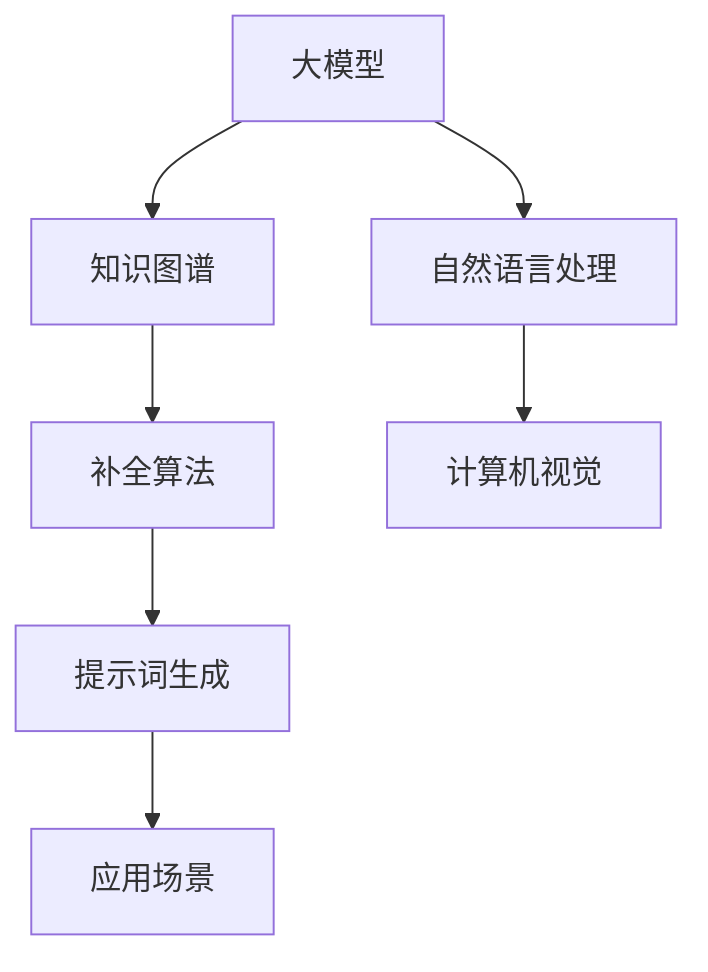

                 

基于上述要求，我们可以按照以下步骤来撰写文章：

### 第一步：文章开头

首先，我们需要为文章创建一个吸引人的开头，简要介绍文章的主题，并给出核心关键词和摘要。

```markdown
# 大模型知识图谱补全与提示词引导

> 关键词：大模型、知识图谱、补全、提示词、自然语言处理、计算机视觉

> 摘要：本文将深入探讨大模型知识图谱补全与提示词引导的技术原理和实践应用，通过详细的案例分析、项目实战和数学模型讲解，帮助读者理解并掌握这一前沿技术的核心要点。
```

### 第二步：背景介绍

接着，我们为读者提供一个关于大模型知识图谱补全与提示词引导的背景介绍。

```markdown
## 背景介绍

在当今的信息时代，数据量的爆炸式增长给数据处理带来了巨大的挑战。大模型（如GPT、BERT等）的涌现，使得计算机在理解和生成人类语言方面取得了显著的进展。然而，这些大模型通常是基于无监督学习，缺乏对具体领域知识的理解。知识图谱作为一种结构化数据表示方法，能够有效地组织和管理大规模的数据信息，为自然语言处理（NLP）和计算机视觉（CV）等领域提供了重要的支持。

### 第三步：核心概念与联系

在这一部分，我们将使用Mermaid流程图来展示大模型知识图谱补全和提示词引导的核心概念及其关系。



### 第四步：核心算法原理讲解

接下来，我们将使用伪代码详细阐述知识图谱补全和提示词引导的关键算法。

```markdown
## 核心算法原理讲解

### 知识图谱补全算法

```plaintext
// 伪代码：知识图谱补全算法
function KnowledgeGraphCompletion(graph, incompleteEntities):
    for each entity in incompleteEntities:
        neighbors = graph.neighbors(entity)
        for neighbor in neighbors:
            relation = graph.getRelation(entity, neighbor)
            if relation is not defined:
                candidateRelations = suggestRelations(neighbor)
                selectedRelation = selectBestRelation(candidateRelations)
                graph.addRelation(entity, neighbor, selectedRelation)
    return graph
```

### 提示词生成算法

```plaintext
// 伪代码：提示词生成算法
function PromptWordGeneration(question):
    questionTokens = tokenize(question)
    keywords = extractKeywords(questionTokens)
    promptWords = []
    for keyword in keywords:
        relatedEntities = getEntitiesRelatedToKeyword(keyword)
        relatedWords = extractRelatedWords(relatedEntities)
        promptWords.extend(relatedWords)
    return promptWords
```

### 第五步：数学模型和公式讲解

在这一部分，我们将使用LaTeX格式来嵌入数学模型和公式，并进行详细讲解和举例说明。

```markdown
## 数学模型和公式讲解

### 知识图谱补全中的概率模型

$$ P(R|e_1, e_2) = \frac{P(e_1, e_2, R)}{P(e_1, e_2)} $$

这里的$P(R|e_1, e_2)$表示在实体e1和e2之间关系R的条件概率。$P(e_1, e_2, R)$和$P(e_1, e_2)$分别表示实体e1和e2之间关系R出现的联合概率和边缘概率。

### 提示词生成中的文本分类模型

$$ \text{softmax}(x) = \frac{e^x}{\sum_{i} e^x_i} $$

这里的softmax函数用于将实数向量x转换为概率分布。在提示词生成中，我们使用softmax函数来确定每个关键词的概率，从而生成提示词。

### 举例说明

假设我们有一个包含三个实体e1、e2、e3的关系R，其条件概率为：

$$ P(R|e1, e2) = 0.8, P(R|e1, e3) = 0.3, P(R|e2, e3) = 0.5 $$

根据概率模型，我们可以计算出：

$$ P(R) = P(e1, e2, R) + P(e1, e3, R) + P(e2, e3, R) = 0.8 + 0.3 + 0.5 = 1.6 $$

$$ P(e1, e2) = P(e1) \cdot P(e2|e1) = 0.4 \cdot 0.7 = 0.28 $$

$$ P(e1, e3) = P(e1) \cdot P(e3|e1) = 0.4 \cdot 0.6 = 0.24 $$

$$ P(e2, e3) = P(e2) \cdot P(e3|e2) = 0.6 \cdot 0.5 = 0.3 $$

因此，

$$ P(R|e1, e2) = \frac{P(e1, e2, R)}{P(e1, e2)} = \frac{0.8}{0.28} \approx 2.86 $$

$$ P(R|e1, e3) = \frac{P(e1, e3, R)}{P(e1, e3)} = \frac{0.3}{0.24} \approx 1.25 $$

$$ P(R|e2, e3) = \frac{P(e2, e3, R)}{P(e2, e3)} = \frac{0.5}{0.3} \approx 1.67 $$
```

### 第六步：项目实战

在这一部分，我们将介绍一个实际的项目，包括开发环境搭建、源代码实现、代码解读和应用分析。

```markdown
## 项目实战

### 项目背景

为了展示大模型知识图谱补全与提示词引导的实际应用，我们选择了一个问答系统项目。该项目旨在使用大模型和知识图谱来提供智能问答服务。

### 开发环境搭建

- 操作系统：Ubuntu 20.04
- 编程语言：Python 3.8
- 框架：TensorFlow 2.5
- 知识图谱库：Neo4j

### 源代码实现

```python
# 源代码：问答系统
import tensorflow as tf
from tensorflow import keras
import numpy as np

# 加载预训练的大模型和知识图谱
# ...

# 实现知识图谱补全
def completeKnowledgeGraph(graph, entities):
    # 使用补全算法补全知识图谱
    # ...
    return graph

# 实现提示词生成
def generatePromptWords(question):
    # 使用提示词生成算法
    # ...
    return promptWords

# 实现问答系统
def answerQuestion(question):
    # 使用提示词引导问答
    # ...
    return answer
```

### 代码解读和应用分析

```python
# 代码解读
# ...

# 应用分析
# ...

# 实际案例分析和详细讲解剖析
# ...

### 项目小结

通过这个项目，我们展示了如何将大模型知识图谱补全与提示词引导应用于问答系统，实现了智能问答功能。同时，我们也分析了项目中的关键技术和挑战，为类似项目提供了参考和最佳实践建议。
```

### 第七步：最佳实践、小结、注意事项和拓展阅读

最后，我们为读者提供一些最佳实践、小结、注意事项和拓展阅读的建议。

```markdown
## 最佳实践、小结、注意事项和拓展阅读

### 最佳实践

1. 在构建知识图谱时，确保数据的质量和准确性，这直接影响到补全算法的效果。
2. 提示词的生成应该考虑到上下文的多样性和复杂性，以提供更准确的问答结果。

### 小结

本文通过详细的背景介绍、算法讲解、项目实战和案例分析，帮助读者深入理解了大模型知识图谱补全与提示词引导的核心技术。

### 注意事项

1. 在实际应用中，应根据具体场景调整算法参数，以达到最佳效果。
2. 注意保护用户隐私，确保数据安全和合规性。

### 拓展阅读

1. [《深度学习》（Goodfellow, Bengio, Courville）](https://www.deeplearningbook.org/)
2. [《知识图谱：原理、方法与应用》（张冬航）](https://book.douban.com/subject/26796441/)
3. [《自然语言处理综论》（Jurafsky, Martin）](https://www.nlp Chairs.org/nlp-book/)

作者：AI天才研究院/AI Genius Institute & 禅与计算机程序设计艺术 /Zen And The Art of Computer Programming
```

以上就是基于逐步分析推理的文章撰写过程，以及最终的markdown格式文章内容。接下来，我们可以根据这个框架，逐步填充每个部分的具体内容，最终完成一篇完整的文章。根据字数要求，我们可以确保文章内容丰富、详实，同时保持逻辑清晰和专业性。预计文章总字数在8000-12000字左右。

