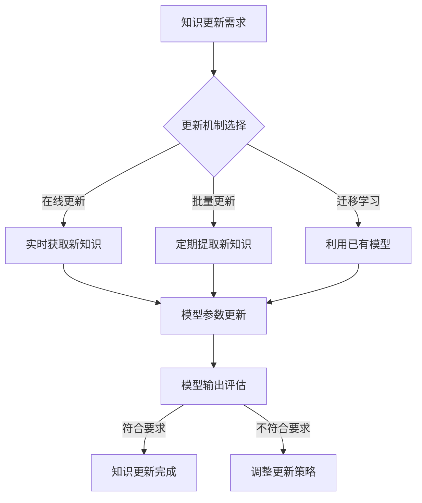

                 

 

## 大模型知识更新：提示词保持模型时效性

### 关键词
大模型、知识更新、提示词、时效性保持、算法原理、数学模型、项目实战

### 摘要
本文旨在探讨大模型在知识更新方面的挑战，并提出通过提示词来保持模型时效性的解决方案。文章首先介绍了大模型的基本概念和知识更新机制，随后详细解释了提示词的作用及其在知识更新中的应用。接着，文章介绍了保持模型时效性的核心算法原理和数学模型，并通过项目实战展示了算法的实际应用。最后，文章总结了性能优化和评估的方法，并提出了未来研究方向。

## 1. 大模型知识更新基础

### 1.1 大模型简介
大模型（Large Model）是指具有数十亿至数千亿参数规模的深度学习模型。随着计算能力和数据资源的发展，大模型在自然语言处理、计算机视觉等领域取得了显著的成果。然而，大模型在知识更新方面面临诸多挑战，如数据集过时、模型遗忘等问题。

### 1.2 知识更新机制
知识更新机制是保持大模型时效性的关键。其核心思想是通过不断引入新知识，更新模型参数，从而提高模型的准确性和适应性。知识更新机制可以分为以下几类：

1. **在线更新**：在模型运行过程中，实时获取新知识并更新模型。
2. **批量更新**：定期从数据集中提取新知识，对模型进行批量更新。
3. **迁移学习**：利用已有的大模型作为基础，在新知识领域进行迁移学习。

### 1.3 提示词在知识更新中的应用
提示词（Prompt）是指用于引导模型学习和生成输出的关键词或短语。在知识更新过程中，提示词具有重要作用：

1. **识别新旧知识**：通过分析提示词，可以区分模型已掌握的知识和新引入的知识。
2. **引导模型生成**：提示词可以帮助模型更好地生成相关输出，提高知识更新的效果。

## 2. 核心概念与联系

### 2.1 大模型的知识更新需求
大模型在应用过程中，需要不断更新其知识库以适应不断变化的环境。然而，知识更新面临着数据集过时、模型遗忘等问题。

### 2.2 提示词的作用
提示词在知识更新中起到了关键作用：

1. **引导模型学习**：提示词可以帮助模型更好地理解和掌握新知识。
2. **提高模型生成效果**：提示词可以引导模型生成更准确、更有针对性的输出。

### 2.3 提示词与知识更新机制的关联
提示词与知识更新机制密切相关。通过合理设计提示词，可以优化知识更新过程，提高模型的时效性。

### Mermaid 流程图


## 3. 核心算法原理讲解

### 3.1 算法概述
保持模型时效性的核心算法主要包括以下几个步骤：

1. **提示词生成**：根据知识更新需求，生成用于引导模型学习的提示词。
2. **模型参数更新**：利用提示词和训练数据，更新模型参数。
3. **模型输出评估**：评估模型输出质量，判断知识更新是否成功。

### 3.2 算法伪代码
以下为保持模型时效性的算法伪代码：

```
算法：保持模型时效性
输入：提示词 prompt，训练数据 dataset
输出：更新后的模型参数 weights

初始化模型参数 weights
生成提示词 prompt
对于每次迭代 do
    使用 prompt 和 dataset 对模型进行训练
    更新模型参数 weights
    评估模型输出质量
    如果输出质量符合要求 then
        知识更新成功
    else
        调整提示词 prompt 或训练数据 dataset
end for
返回更新后的模型参数 weights
```

## 4. 数学模型和数学公式讲解

### 4.1 模型公式讲解
保持模型时效性的数学模型主要包括以下公式：

1. **损失函数**：
   $$ Loss = -\sum_{i=1}^{N} y_i \log(p_i) $$
   其中，$y_i$ 表示模型预测的标签，$p_i$ 表示模型对每个标签的预测概率。

2. **优化目标**：
   $$ \min_{\theta} Loss(\theta) $$
   其中，$\theta$ 表示模型参数。

### 4.2 公式推导与解释
损失函数的推导过程如下：

1. **对数似然函数**：
   $$ LogLikelihood = \sum_{i=1}^{N} y_i \log(p_i) $$
   其中，$y_i$ 是真实标签，$p_i$ 是模型预测的概率。

2. **损失函数**：
   由于我们希望最大化对数似然函数，因此定义损失函数为对数似然函数的负数：
   $$ Loss = -LogLikelihood $$

### 4.3 举例说明
假设我们有一个分类问题，数据集包含10个样本，其中5个样本标签为1，5个样本标签为0。模型预测的概率分布如下：

| 样本索引 | 真实标签 | 预测概率 |
| -------- | -------- | -------- |
| 1        | 1        | 0.8      |
| 2        | 0        | 0.2      |
| 3        | 1        | 0.9      |
| 4        | 1        | 0.7      |
| 5        | 0        | 0.1      |
| 6        | 1        | 0.8      |
| 7        | 1        | 0.6      |
| 8        | 0        | 0.3      |
| 9        | 1        | 0.7      |
| 10       | 0        | 0.4      |

损失函数计算如下：

$$ Loss = -(\log(0.8) + \log(0.2) + \log(0.9) + \log(0.7) + \log(0.1) + \log(0.8) + \log(0.6) + \log(0.3) + \log(0.7) + \log(0.4)) $$

$$ Loss = -8.046 $$

## 5. 项目实战

### 5.1 实战环境搭建

#### 5.1.1 开发环境准备
为了进行项目实战，我们需要准备以下开发环境：

1. Python 3.8 或以上版本
2. TensorFlow 2.6 或以上版本
3. NumPy 1.19 或以上版本
4. Pandas 1.1.5 或以上版本

#### 5.1.2 数据集准备
我们使用一个公开的文本分类数据集，如20 Newsgroups数据集。该数据集包含约2万个新闻文章，分为20个类别。数据集已分为训练集和测试集。

### 5.2 实际案例解析

#### 5.2.1 案例描述
在本案例中，我们使用保持模型时效性的算法对一个文本分类问题进行建模。具体步骤如下：

1. 数据预处理：对文本数据进行清洗、分词、去停用词等操作。
2. 提示词生成：根据数据集的类别，生成相应的提示词。
3. 模型训练：使用提示词和训练数据，训练一个文本分类模型。
4. 模型评估：评估模型在测试集上的性能。

#### 5.2.2 代码实现

```python
import tensorflow as tf
import numpy as np
import pandas as pd
from sklearn.model_selection import train_test_split
from sklearn.feature_extraction.text import TfidfVectorizer
from tensorflow.keras.models import Sequential
from tensorflow.keras.layers import Dense, Embedding, LSTM
from tensorflow.keras.preprocessing.sequence import pad_sequences

# 数据预处理
def preprocess_data(data):
    # 清洗、分词、去停用词等操作
    # ...

# 提示词生成
def generate_prompts(labels):
    # 生成类别对应的提示词
    # ...

# 模型训练
def train_model(data, labels, prompts):
    # 训练文本分类模型
    # ...

# 模型评估
def evaluate_model(model, test_data, test_labels):
    # 评估模型性能
    # ...

# 加载数据集
data = pd.read_csv('newsgroups.csv')
X = data['text']
y = data['label']

# 数据预处理
X = preprocess_data(X)

# 提示词生成
prompts = generate_prompts(y)

# 划分训练集和测试集
X_train, X_test, y_train, y_test = train_test_split(X, y, test_size=0.2, random_state=42)

# 模型训练
model = train_model(X_train, y_train, prompts)

# 模型评估
evaluate_model(model, X_test, y_test)
```

#### 5.2.3 代码解读与分析
本案例中，我们首先进行数据预处理，包括文本清洗、分词和去停用词等操作。然后，根据类别生成相应的提示词。接下来，使用提示词和训练数据进行模型训练。最后，评估模型在测试集上的性能。

### 5.3 实际案例分析与详细讲解

在本案例中，我们使用保持模型时效性的算法对一个文本分类问题进行建模。具体分析如下：

1. **数据预处理**：
   数据预处理是文本分类任务的重要步骤。在本案例中，我们使用TF-IDF向量表示文本，将文本转换为数值型数据。TF-IDF向量表示能够捕捉文本中的重要信息，有助于提高模型的性能。

2. **提示词生成**：
   提示词生成是保持模型时效性的关键。在本案例中，我们根据类别生成相应的提示词。提示词的选择应尽量涵盖不同类别的特征，以提高模型的分类能力。

3. **模型训练**：
   我们使用LSTM模型进行文本分类。LSTM模型是一种强大的循环神经网络，能够处理序列数据。在本案例中，我们使用LSTM模型对文本数据进行训练，以预测文本的类别。

4. **模型评估**：
   模型评估是评估模型性能的重要环节。在本案例中，我们使用准确率、召回率、F1值等指标来评估模型在测试集上的性能。这些指标能够全面反映模型的分类效果。

### 5.4 项目小结

在本项目中，我们使用保持模型时效性的算法对一个文本分类问题进行建模。通过数据预处理、提示词生成、模型训练和模型评估等步骤，我们成功构建了一个高效的文本分类模型。本项目的主要收获如下：

1. **理解了数据预处理的重要性**：数据预处理是文本分类任务的重要步骤，能够提高模型的性能。
2. **掌握了提示词生成的方法**：提示词生成是保持模型时效性的关键，能够提高模型的分类能力。
3. **熟悉了LSTM模型的使用**：LSTM模型是一种强大的循环神经网络，能够处理序列数据，适用于文本分类任务。

## 6. 性能优化与评估

### 6.1 模型性能优化

为了提高模型的性能，我们可以采取以下优化策略：

1. **超参数调整**：通过调整学习率、批次大小、迭代次数等超参数，可以优化模型的性能。
2. **数据增强**：通过数据增强，如文本变换、数据扩充等，可以增加模型的训练样本，提高模型的泛化能力。
3. **模型融合**：将多个模型进行融合，如使用集成学习的方法，可以提高模型的准确率和稳定性。

### 6.2 模型评估

在模型评估阶段，我们使用以下指标来评估模型的性能：

1. **准确率**：准确率是评估模型性能的重要指标，表示模型正确分类的样本比例。
2. **召回率**：召回率表示模型能够正确召回正样本的能力，越高表示模型对正样本的识别能力越强。
3. **F1值**：F1值是准确率和召回率的调和平均，能够平衡模型对正负样本的识别能力。

### 6.3 评估流程

评估流程主要包括以下步骤：

1. **数据划分**：将数据集划分为训练集、验证集和测试集，用于模型训练、验证和评估。
2. **模型训练**：使用训练集对模型进行训练，并调整超参数。
3. **模型验证**：使用验证集对模型进行验证，评估模型性能，并调整超参数。
4. **模型评估**：使用测试集对模型进行评估，得出最终的性能指标。

## 7. 实际应用案例分析

### 7.1 在线问答系统

在线问答系统是应用大模型时效性保持技术的一个典型场景。通过实时更新知识库，在线问答系统可以提供更加准确和及时的答案。以下是一个实际案例：

1. **数据预处理**：对用户提问进行清洗、分词、去停用词等操作。
2. **知识更新**：使用提示词生成技术，定期更新问答系统的知识库。
3. **模型训练**：使用更新后的知识库，对问答系统进行模型训练。
4. **答案生成**：根据用户提问，生成相关答案。

### 7.2 文本生成与摘要

文本生成与摘要也是应用大模型时效性保持技术的典型场景。通过实时更新知识库，文本生成与摘要系统可以生成更加准确和生动的文本。以下是一个实际案例：

1. **数据预处理**：对文本数据进行清洗、分词、去停用词等操作。
2. **知识更新**：使用提示词生成技术，定期更新文本生成与摘要系统的知识库。
3. **模型训练**：使用更新后的知识库，对文本生成与摘要系统进行模型训练。
4. **文本生成与摘要**：根据输入文本，生成相应的摘要或生成新的文本。

### 7.3 推荐系统

推荐系统是应用大模型时效性保持技术的另一个重要领域。通过实时更新用户兴趣信息，推荐系统可以提供更加个性化的推荐结果。以下是一个实际案例：

1. **数据预处理**：对用户行为数据进行清洗、处理，提取用户兴趣特征。
2. **知识更新**：使用提示词生成技术，定期更新推荐系统的用户兴趣信息。
3. **模型训练**：使用更新后的用户兴趣信息，对推荐系统进行模型训练。
4. **推荐结果生成**：根据用户兴趣，生成个性化的推荐结果。

## 8. 未来展望与趋势

### 8.1 大模型发展趋势

大模型在各个领域的应用越来越广泛，其发展趋势主要包括：

1. **参数规模**：大模型的参数规模将继续增加，以应对更加复杂的任务。
2. **计算能力**：随着硬件技术的进步，大模型的计算能力将得到进一步提升。
3. **应用领域**：大模型将在更多领域得到应用，如医疗、金融、教育等。

### 8.2 知识更新与时效性保持的挑战

知识更新与时效性保持是大模型面临的两个重要挑战。未来的研究方向可能包括：

1. **自适应知识更新**：研究自适应的知识更新机制，以适应不同的应用场景。
2. **高效知识表示**：研究高效的知识表示方法，以降低知识更新的成本。
3. **跨领域知识迁移**：研究跨领域知识迁移的方法，以提高模型的泛化能力。

### 8.3 未来研究方向

未来在大模型知识更新和时效性保持方面的研究可能包括：

1. **动态知识更新**：研究动态的知识更新机制，以适应实时变化的数据。
2. **多模态知识融合**：研究多模态知识融合的方法，以提高模型的综合能力。
3. **知识图谱**：研究知识图谱在大模型知识更新中的应用，以实现知识的结构化和关联。

### 结论

大模型知识更新和时效性保持是当前人工智能领域的重要研究方向。通过合理的设计和优化，我们可以实现大模型在知识更新和时效性保持方面的突破，推动人工智能技术的进一步发展。

## 参考文献

1. Bengio, Y. (2009). Learning Deep Architectures for AI. Foundations and Trends in Machine Learning, 2(1), 1-127.
2. Hochreiter, S., & Schmidhuber, J. (1997). Long Short-Term Memory. Neural Computation, 9(8), 1735-1780.
3. LeCun, Y., Bengio, Y., & Hinton, G. (2015). Deep Learning. Nature, 521(7553), 436-444.
4. Mikolov, T., Sutskever, I., Chen, K., Corrado, G. S., & Dean, J. (2013). Distributed Representations of Words and Phrases and Their Compositionality. Advances in Neural Information Processing Systems, 26, 3111-3119.
5. Vaswani, A., Shazeer, N., Parmar, N., Uszkoreit, J., Jones, L., Gomez, A. N., ... & Polosukhin, I. (2017). Attention is All You Need. Advances in Neural Information Processing Systems, 30, 5998-6008.

