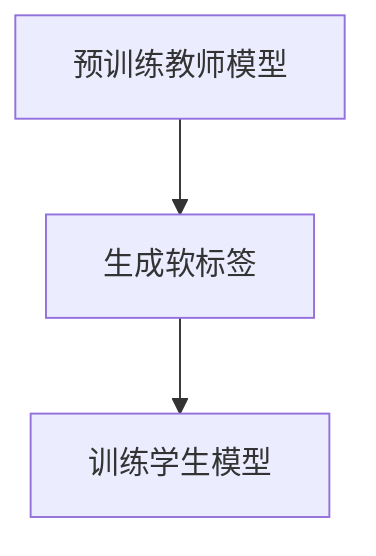
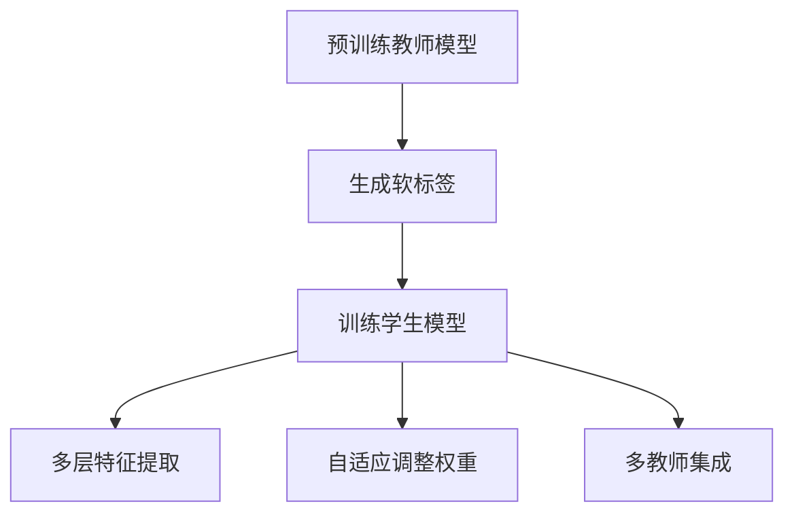
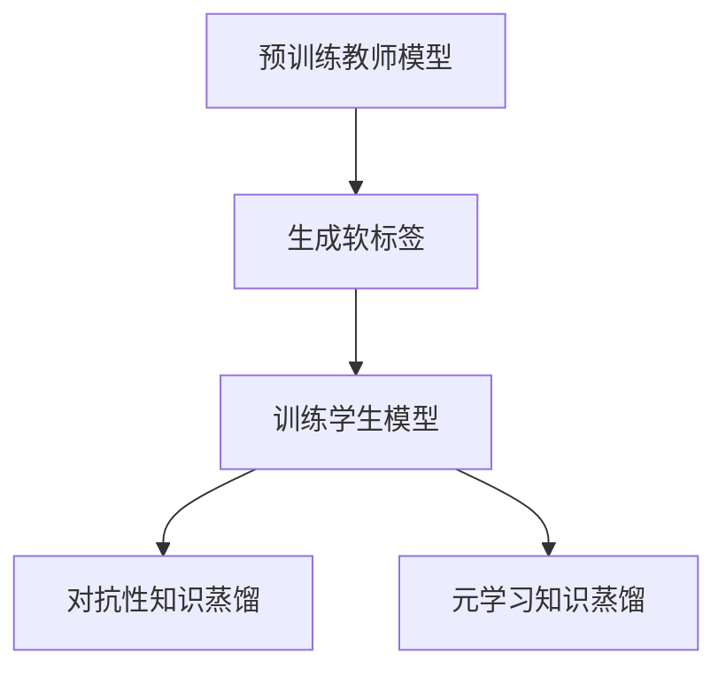
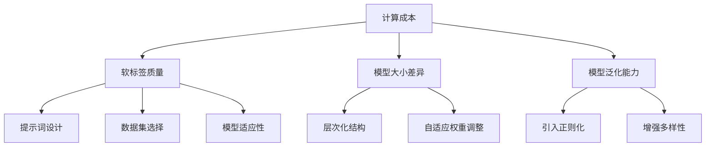
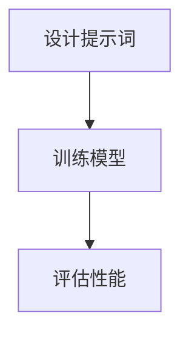
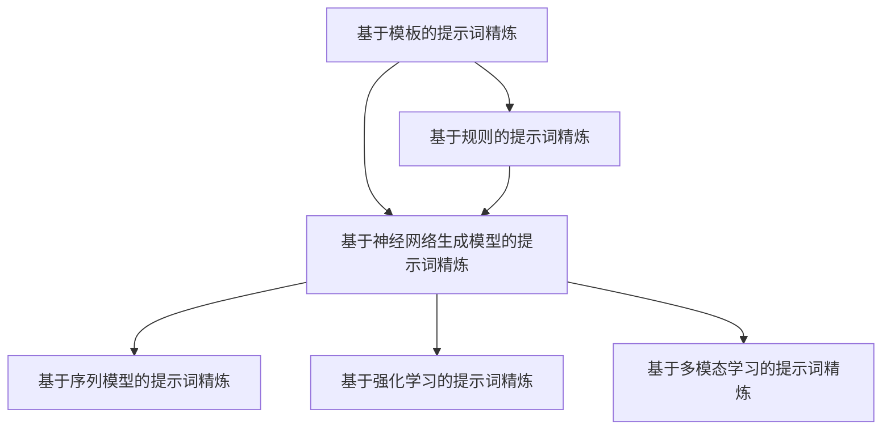
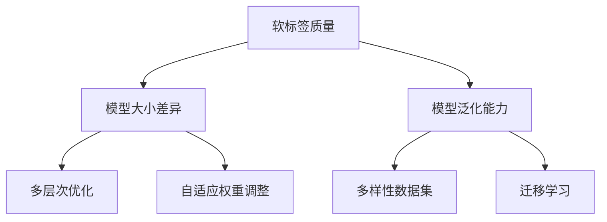

                 

### 背景介绍

随着深度学习在自然语言处理（NLP）领域的广泛应用，大型预训练语言模型如GPT、BERT等已经取得了显著的性能提升。然而，这些大型模型通常需要巨大的计算资源和存储空间，这对实际应用中的部署造成了巨大的挑战。知识蒸馏和提示词精炼技术的出现，为解决这些问题提供了有效的方案。

#### 知识蒸馏技术

知识蒸馏（Knowledge Distillation）是一种将大型模型（教师模型）的知识传递给小型模型（学生模型）的技术。这种方法通过软标签的形式，将教师模型的内部表示传递给学生模型，使得学生模型能够在教师模型的基础上获得更好的性能。知识蒸馏的过程通常包括以下几个步骤：

1. **预训练教师模型**：首先，使用大量数据进行预训练，使教师模型在特定任务上达到很高的性能。
2. **生成软标签**：在保持教师模型不变的条件下，将输入数据送入教师模型，记录其输出的软标签（通常是概率分布）。
3. **训练学生模型**：使用教师模型生成的软标签和原始数据来训练学生模型，使得学生模型的学习目标不仅包括原始数据的真实标签，还包括软标签。

#### 提示词精炼技术

提示词精炼（Prompt Tuning）是一种通过调整输入提示词来优化模型性能的技术。在NLP中，输入提示词对模型的理解和生成有重要影响。通过优化提示词，可以显著提高模型在特定任务上的性能。提示词精炼通常涉及以下步骤：

1. **设计提示词**：根据任务需求，设计特定的提示词，以便引导模型生成正确的输出。
2. **训练模型**：使用优化后的提示词和原始数据对模型进行训练，使得模型能够更好地理解提示词，并生成准确的输出。

#### 技术融合

知识蒸馏和提示词精炼技术的结合，可以进一步提升NLP模型的性能。通过知识蒸馏，小模型可以学习到教师模型的大量知识；而通过提示词精炼，模型可以更好地理解和生成特定任务所需的输出。这种融合技术在实际应用中表现出色，但在实现过程中也存在一些挑战。

### 关键词

- 大模型知识蒸馏
- 提示词精炼
- 自然语言处理
- 深度学习
- 模型性能优化
- 资源节省

### 摘要

本文将系统地介绍大模型知识蒸馏与提示词精炼技术。首先，我们将探讨知识蒸馏和提示词精炼的基本概念、原理和应用场景。接着，我们将深入分析这两种技术的核心算法，包括知识蒸馏的软标签生成和训练过程，以及提示词精炼的设计和优化方法。最后，我们将通过实际项目实战，展示如何将知识蒸馏和提示词精炼技术应用于NLP任务，并提供最佳实践和项目总结。

---

# 文章关键词

- 大模型知识蒸馏
- 提示词精炼
- 自然语言处理
- 深度学习
- 模型性能优化
- 资源节省

# 文章摘要

本文旨在深入探讨大模型知识蒸馏与提示词精炼技术，这两种技术在自然语言处理领域具有重要应用价值。首先，我们将介绍知识蒸馏与提示词精炼的基本概念、原理和应用场景。随后，我们将详细分析核心算法，包括知识蒸馏的软标签生成和训练过程，以及提示词精炼的设计和优化方法。通过实际项目实战，我们将展示如何将这两种技术应用于NLP任务，并提供最佳实践和项目总结。本文的目标是帮助读者全面理解并掌握这两种技术，以提升模型性能并节省资源。

---

## 大模型知识蒸馏技术概述

### 2.1 大模型知识蒸馏的定义与背景

大模型知识蒸馏（Knowledge Distillation for Large Models）是一种将知识从大型预训练模型（通常称为“教师模型”）传递到小型模型（通常称为“学生模型”）的技术。这种技术起源于教育领域的“知识蒸馏”概念，即通过将专家的知识传递给新手的过程来提高新手的技能。在机器学习和深度学习领域，这种概念被应用于模型训练过程中，旨在利用大型模型的丰富知识和经验来提升小型模型的性能。

大模型知识蒸馏的背景源于现代深度学习模型的快速增长和复杂度提升。大型预训练模型（如GPT-3、BERT）拥有数十亿甚至数万亿的参数，经过大规模数据集的训练，这些模型在多种NLP任务上取得了卓越的性能。然而，这些大型模型往往需要大量的计算资源和存储空间，这对于实际应用中的部署，尤其是资源受限的环境，构成了巨大挑战。因此，如何有效地将大型模型的知识传递给小型模型，成为了一个重要的研究方向。

### 2.2 知识蒸馏的基本原理

知识蒸馏的核心思想是将大型模型的内部知识（即软标签）传递给小型模型，使得小型模型能够学习和模仿大型模型的决策过程。这一过程主要包括以下几个步骤：

1. **预训练教师模型**：首先，使用大量的数据和先进的训练技术对大型模型进行预训练。预训练的目的是让模型学会从数据中提取有用的特征和模式。

2. **生成软标签**：在保持教师模型不变的情况下，将输入数据送入教师模型，并记录其输出的软标签。软标签通常是一个概率分布，它表示教师模型对输入数据各个类别的预测置信度。

3. **训练学生模型**：使用教师模型生成的软标签和原始数据来训练小型模型。在这个过程中，小型模型不仅要学习原始数据的真实标签，还要学习软标签。通过这种方式，小型模型可以学习到教师模型的内部知识，从而提高其性能。

### 2.3 大模型知识蒸馏的重要性

大模型知识蒸馏在许多实际应用中具有重要价值，主要体现在以下几个方面：

1. **资源节省**：通过将大型模型的知识传递给小型模型，可以在资源受限的环境中部署高性能模型。小型模型通常需要较少的计算资源和存储空间，这使得它们更适合在移动设备、嵌入式系统和服务器上运行。

2. **性能提升**：知识蒸馏可以帮助小型模型学习到大型模型的知识和经验，从而显著提高其性能。特别是在NLP任务中，如文本分类、情感分析、机器翻译等，小型模型通过知识蒸馏可以获得与大型模型相近的性能。

3. **快速迭代**：知识蒸馏技术使得小型模型能够快速适应新的数据和任务。通过不断更新教师模型和重新训练学生模型，可以快速提升模型在新任务上的性能，从而加速模型的迭代过程。

### 2.4 大模型知识蒸馏的应用场景

大模型知识蒸馏技术在多种应用场景中表现出色，以下是一些典型的应用：

1. **移动设备和嵌入式系统**：这些设备通常资源有限，无法直接部署大型模型。通过知识蒸馏，可以将大型模型的知识传递给小型模型，使其在资源受限的环境下仍然能够提供高性能的服务。

2. **实时系统**：在需要快速响应的场景中，如智能客服、实时语音识别等，知识蒸馏技术可以帮助小型模型快速适应实时数据，提供高效准确的预测。

3. **多语言支持**：大型模型通常经过多种语言的预训练，而知识蒸馏技术可以帮助小型模型快速适应新的语言，实现跨语言的任务。

4. **隐私保护**：在某些应用场景中，如医疗数据分析和金融数据分析，数据隐私保护至关重要。知识蒸馏技术可以通过在不直接访问数据的情况下，传递模型知识来实现隐私保护。

### 2.5 大模型知识蒸馏与提示词精炼的联系

大模型知识蒸馏与提示词精炼（Prompt Tuning）在NLP领域有着紧密的联系。提示词精炼是一种通过调整输入提示词来优化模型性能的技术。与知识蒸馏类似，提示词精炼也是通过优化模型的输入来提升其在特定任务上的性能。

知识蒸馏和提示词精炼的结合可以进一步提升NLP模型的性能。知识蒸馏为学生模型提供了教师模型的内部知识，而提示词精炼则通过调整输入提示词，引导学生模型更好地理解和生成特定任务所需的输出。这种双重优化方法在实际应用中表现出色，可以显著提高模型的性能和鲁棒性。

### Mermaid 流程图

以下是知识蒸馏的基本流程的Mermaid流程图：



### 2.6 总结

大模型知识蒸馏技术通过将大型模型的内部知识传递给小型模型，实现了在资源受限环境下的高性能模型部署。这种技术不仅节省了计算资源，还显著提高了模型在多种NLP任务上的性能。结合提示词精炼技术，可以进一步提升模型的性能和鲁棒性。在未来，大模型知识蒸馏与提示词精炼技术将继续在NLP领域发挥重要作用，推动更多实际应用的发展。

---

## 知识蒸馏技术原理

### 3.1 知识蒸馏的基本概念

知识蒸馏（Knowledge Distillation）是一种在深度学习中，将一个大型模型（教师模型）的知识传递给一个较小或较简单的模型（学生模型）的过程。这种技术旨在利用教师模型的高层次知识和丰富经验来提升学生模型的性能，同时减少对计算资源的需求。

在知识蒸馏中，教师模型和学生模型通常针对相同的数据集进行训练。教师模型通常是一个大型、复杂的模型，经过大量的数据预训练，具有较高的准确性和泛化能力。学生模型则是一个较小、较简单的模型，旨在在教师模型的基础上学习到关键的知识和模式。

### 3.2 知识蒸馏的关键步骤

知识蒸馏的主要步骤包括：

1. **预训练教师模型**：
   - 使用大规模数据集对教师模型进行预训练，使其在多种任务上达到较高的性能。
   - 教师模型通常采用先进的预训练技术，如自监督学习、遮蔽语言模型（BLM）等。

2. **生成软标签**：
   - 在保持教师模型不变的情况下，将输入数据送入教师模型，记录其输出的软标签。这些软标签通常是一个概率分布，表示教师模型对输入数据的各个类别的预测置信度。
   - 软标签的生成过程通常涉及两个阶段：
     1. **生成候选标签**：教师模型对输入数据进行前向传播，得到一个初始的输出。
     2. **平滑处理**：对候选标签进行平滑处理，使其更加稳定，减少极端值的影响。

3. **训练学生模型**：
   - 使用教师模型生成的软标签和原始数据来训练学生模型。
   - 学生模型的目标是同时优化两个损失函数：
     1. **硬标签损失**：学生模型的输出与原始数据标签之间的损失，如交叉熵损失。
     2. **软标签损失**：学生模型的输出与教师模型软标签之间的损失，如KL散度损失。

### 3.3 知识蒸馏算法的分类

知识蒸馏算法可以根据不同的维度进行分类，包括：

1. **基于软标签的知识蒸馏**：
   - **软标签损失**：使用教师模型的输出概率分布作为软标签，训练学生模型。
   - **注意力机制**：引入注意力机制，使学生模型能够关注教师模型的重要输出。

2. **基于知识图的知识蒸馏**：
   - **知识提取**：从教师模型的输出中提取关键知识，构建知识图。
   - **知识传播**：通过知识图将教师模型的知识传递给学生模型。

3. **基于集成模型的知识蒸馏**：
   - **集成策略**：将多个教师模型的结果进行集成，生成软标签。
   - **学生模型优化**：使用集成软标签训练学生模型。

### 3.4 知识蒸馏的挑战

知识蒸馏技术在实际应用中面临一些挑战：

1. **平衡硬标签损失和软标签损失**：
   - 硬标签损失关注学生模型对原始数据标签的拟合，而软标签损失关注学生模型对教师模型输出概率分布的拟合。如何平衡这两个损失，使得学生模型既能学习到教师模型的知识，又能保持对原始数据标签的准确预测，是一个重要问题。

2. **软标签生成质量**：
   - 软标签的生成质量直接影响学生模型的性能。如果软标签不准确或噪声较大，可能会影响学生模型的学习效果。

3. **模型大小差异**：
   - 教师模型和学生模型的大小差异较大时，如何有效地传递知识是一个挑战。需要设计合适的损失函数和训练策略，以适应不同规模的模型。

### 3.5 知识蒸馏的优化方法

为了解决上述挑战，研究者提出了一系列优化方法，包括：

1. **自适应损失权重**：
   - 根据训练过程中的模型性能，动态调整硬标签损失和软标签损失的权重，以实现更好的平衡。

2. **注意力机制**：
   - 引入注意力机制，使学生模型能够关注教师模型的重要输出，提高软标签生成的质量。

3. **多阶段训练**：
   - 将训练过程分为多个阶段，逐步减小教师模型和学生模型之间的差异，提高知识传递的效率。

4. **模型蒸馏**：
   - 将多个教师模型的结果进行集成，生成更高质量的软标签，提高学生模型的性能。

### 3.6 总结

知识蒸馏技术通过将大型模型的内部知识传递给小型模型，实现了在资源受限环境下的高性能模型部署。其关键步骤包括预训练教师模型、生成软标签和训练学生模型。知识蒸馏算法有多种分类，如基于软标签、知识图和集成模型的知识蒸馏。在实际应用中，知识蒸馏面临一系列挑战，但通过优化方法，可以有效地提升模型性能。在未来，知识蒸馏技术将继续在深度学习和NLP领域发挥重要作用。

### Mermaid 流程图

以下是知识蒸馏的基本流程的Mermaid流程图：


---

## 知识蒸馏算法实现

### 4.1 传统知识蒸馏算法

传统知识蒸馏算法主要通过软标签（soft target）来指导学生模型的学习。这种算法的核心思想是将大型教师模型的输出概率分布（即软标签）作为学生模型学习的额外目标。以下是传统知识蒸馏算法的基本步骤：

#### 步骤1：预训练教师模型

使用大规模数据集和先进的预训练技术（如遮蔽语言模型）对教师模型进行预训练。这个阶段的目标是使教师模型能够在各种任务上达到较高的性能。

```python
# 假设使用BERT模型进行预训练
from transformers import BertModel, BertTokenizer

tokenizer = BertTokenizer.from_pretrained('bert-base-uncased')
model = BertModel.from_pretrained('bert-base-uncased')

# 预训练教师模型
train_dataset = ...
optimizer = ...
for epoch in range(num_epochs):
    for batch in train_dataloader:
        inputs = tokenizer(batch['text'], return_tensors='pt', padding=True, truncation=True)
        outputs = model(**inputs)
        logits = outputs.logits
        # 计算损失并进行反向传播
        # ...
```

#### 步骤2：生成软标签

在保持教师模型不变的情况下，将输入数据送入教师模型，记录其输出的软标签。这些软标签通常是一个概率分布，表示教师模型对输入数据的各个类别的预测置信度。

```python
# 生成软标签
def generate_soft_labels(inputs, model):
    with torch.no_grad():
        outputs = model(**inputs)
        logits = outputs.logits
        soft_labels = torch.softmax(logits, dim=-1)
    return soft_labels

# 示例
inputs = tokenizer(['The cat sat on the mat'], return_tensors='pt')
soft_labels = generate_soft_labels(inputs, model)
```

#### 步骤3：训练学生模型

使用教师模型生成的软标签和原始数据来训练学生模型。在这个过程中，学生模型的目标是同时优化两个损失函数：硬标签损失（hard target loss）和软标签损失（soft target loss）。

```python
# 训练学生模型
from torch.nn import CrossEntropyLoss

student_model = ...
soft_target_loss = CrossEntropyLoss()

for epoch in range(num_epochs):
    for batch in train_dataloader:
        inputs = tokenizer(batch['text'], return_tensors='pt', padding=True, truncation=True)
        student_outputs = student_model(**inputs)
        logits = student_outputs.logits
        labels = torch.tensor(batch['label'])

        # 计算硬标签损失
        hard_target_loss = CrossEntropyLoss()(logits, labels)

        # 计算软标签损失
        soft_labels = generate_soft_labels(inputs, model)
        soft_target_loss = CrossEntropyLoss()(logits, soft_labels)

        # 计算总损失
        total_loss = hard_target_loss + soft_target_loss

        # 反向传播和优化
        optimizer.zero_grad()
        total_loss.backward()
        optimizer.step()
```

### 4.2 深度知识蒸馏算法

深度知识蒸馏算法在传统知识蒸馏的基础上，引入了更多的深度学习技术和优化策略，以进一步提升学生模型的性能。以下是几种常见的深度知识蒸馏算法：

#### 1. 层级知识蒸馏（Hierarchical Knowledge Distillation）

层级知识蒸馏通过将教师模型的输出分层传递给学生模型，使得学生模型能够逐层学习到教师模型的知识。具体步骤如下：

1. **分层提取特征**：从教师模型的多个层次（如卷积层、全连接层）提取特征。
2. **训练学生模型**：使用每个层次的特征作为软标签，训练学生模型的对应层次。
3. **综合输出**：将学生模型的所有层次输出进行综合，生成最终的预测结果。

```python
# 假设教师模型和教师模型的层次输出
teacher_model = ...
student_model = ...

# 分层提取特征
teacher_features = [teacher_model.get_layer(i)(inputs) for i in range(num_layers)]

# 训练学生模型
for epoch in range(num_epochs):
    for batch in train_dataloader:
        inputs = tokenizer(batch['text'], return_tensors='pt', padding=True, truncation=True)
        student_outputs = [student_model.get_layer(i)(inputs) for i in range(num_layers)]
        
        # 计算损失并进行优化
        # ...
```

#### 2. 自适应知识蒸馏（Adaptive Knowledge Distillation）

自适应知识蒸馏通过动态调整软标签的权重，使得学生模型能够更好地学习教师模型的知识。具体步骤如下：

1. **初始化软标签权重**：根据教师模型的性能和重要性，初始化软标签权重。
2. **动态调整权重**：根据训练过程中的模型性能，动态调整软标签权重。
3. **训练学生模型**：使用调整后的软标签权重，训练学生模型。

```python
# 假设软标签权重为w
w = torch.tensor([0.5, 0.5], dtype=torch.float32)

# 动态调整权重
for epoch in range(num_epochs):
    for batch in train_dataloader:
        inputs = tokenizer(batch['text'], return_tensors='pt', padding=True, truncation=True)
        student_outputs = student_model(inputs)
        logits = student_outputs.logits
        
        # 计算软标签损失
        soft_labels = torch.softmax(logits, dim=-1)
        soft_target_loss = torch.mean(w * (logits - soft_labels)**2)
        
        # 反向传播和优化
        optimizer.zero_grad()
        soft_target_loss.backward()
        optimizer.step()
        
        # 动态调整权重
        # ...
```

#### 3. 多教师知识蒸馏（Multi-Teacher Knowledge Distillation）

多教师知识蒸馏通过引入多个教师模型，生成更丰富的软标签，从而提高学生模型的性能。具体步骤如下：

1. **选择多个教师模型**：从多个预训练模型中选择教师模型。
2. **生成多组软标签**：将输入数据送入多个教师模型，生成多组软标签。
3. **集成软标签**：通过某种集成策略（如加权平均、投票等），生成最终的软标签。
4. **训练学生模型**：使用生成的软标签，训练学生模型。

```python
# 假设多个教师模型
teacher_models = [BertModel.from_pretrained('bert-base-uncased') for _ in range(num_teachers)]

# 生成多组软标签
def generate_soft_labels(inputs, teacher_models):
    soft_labels = []
    for model in teacher_models:
        with torch.no_grad():
            outputs = model(**inputs)
            logits = outputs.logits
            soft_labels.append(torch.softmax(logits, dim=-1))
    return torch.mean(torch.stack(soft_labels), dim=0)

# 训练学生模型
for epoch in range(num_epochs):
    for batch in train_dataloader:
        inputs = tokenizer(batch['text'], return_tensors='pt', padding=True, truncation=True)
        soft_labels = generate_soft_labels(inputs, teacher_models)
        
        # 计算损失并进行优化
        # ...
```

### 4.3 新兴知识蒸馏算法

随着深度学习技术的不断发展，新兴的知识蒸馏算法不断涌现，如基于对抗训练的知识蒸馏、基于元学习的知识蒸馏等。这些算法通过引入对抗性样本、元学习等技术，进一步提升了学生模型的性能和泛化能力。

#### 1. 对抗性知识蒸馏（Adversarial Knowledge Distillation）

对抗性知识蒸馏通过引入对抗训练，使得学生模型能够学习到教师模型的鲁棒性。具体步骤如下：

1. **生成对抗性样本**：使用对抗性攻击方法（如FGSM、PGD等），生成对抗性样本。
2. **训练教师模型和对抗性样本**：使用对抗性样本对教师模型进行预训练。
3. **训练学生模型**：使用教师模型和对抗性样本的软标签，训练学生模型。

```python
# 假设使用FGSM生成对抗性样本
import torchvision.transforms as T
from torchvision.utils import save_image

def fgsm_attack(image, epsilon=0.1):
    sign_grad = torch.sign(image.grad)
    perturbed_image = image - epsilon * sign_grad
    return perturbed_image.clamp(0, 1)

# 生成对抗性样本
adv_image = fgsm_attack(image)
save_image(adv_image, 'adv_image.png')

# 训练教师模型和对抗性样本
# ...

# 训练学生模型
# ...
```

#### 2. 元学习知识蒸馏（Meta-Learning Knowledge Distillation）

元学习知识蒸馏通过引入元学习技术，使得学生模型能够快速适应新的任务和数据。具体步骤如下：

1. **预训练元学习模型**：使用大量任务和数据，对元学习模型进行预训练。
2. **生成元学习软标签**：使用元学习模型预测新任务的软标签。
3. **训练学生模型**：使用元学习软标签，训练学生模型。

```python
# 假设使用MAML进行元学习
import torch
from mamlpy import MAML

# 预训练元学习模型
model = MAML()
optimizer = torch.optim.Adam(model.parameters(), lr=0.001)

# 训练元学习模型
for epoch in range(num_epochs):
    for batch in meta_train_dataloader:
        # 计算损失并进行优化
        # ...

# 生成元学习软标签
def generate_meta_learning_soft_labels(inputs, model):
    optimizer.zero_grad()
    logits = model(inputs)
    loss = torch.nn.CrossEntropyLoss()(logits, inputs.labels)
    loss.backward()
    gradients = [param.grad for param in model.parameters()]
    model.zero_grad()
    return gradients

# 训练学生模型
# ...
```

### 4.4 总结

知识蒸馏算法通过将教师模型的内部知识传递给学生模型，实现了在资源受限环境下的高性能模型部署。传统知识蒸馏算法通过软标签指导学生模型的学习，而深度知识蒸馏算法则引入了更多的深度学习技术和优化策略，以进一步提升学生模型的性能。新兴知识蒸馏算法通过引入对抗训练、元学习等技术，进一步提升了学生模型的性能和泛化能力。在未来，随着深度学习技术的不断发展，知识蒸馏算法将继续在机器学习和NLP领域发挥重要作用。

### Mermaid 流程图

以下是传统知识蒸馏算法的基本流程的Mermaid流程图：


### Mermaid 流程图

以下是深度知识蒸馏算法的基本流程的Mermaid流程图：



### Mermaid 流程图

以下是新兴知识蒸馏算法的基本流程的Mermaid流程图：



---

## 知识蒸馏在实际应用中的挑战与解决方案

### 5.1 大模型知识蒸馏的挑战

尽管知识蒸馏技术在理论上具有显著优势，但在实际应用中仍面临一系列挑战。以下是主要挑战及其解决方案：

#### 5.1.1 计算成本

知识蒸馏过程中，教师模型和学生模型都需要进行大量计算。特别是在处理大型预训练模型时，生成软标签和训练学生模型的过程可能会消耗大量计算资源。这种计算成本对于资源受限的环境，如移动设备和嵌入式系统，构成了严重挑战。

**解决方案**：

- **计算效率优化**：通过引入分布式计算和并行化技术，提高计算效率。例如，使用GPU或TPU进行加速训练，采用模型剪枝和量化技术减少计算需求。
- **增量学习**：在教师模型和学生模型之间引入增量学习机制，仅更新关键部分，降低整体计算成本。

#### 5.1.2 软标签质量

软标签的质量直接影响学生模型的学习效果。如果软标签不准确或存在噪声，可能会导致学生模型无法正确学习教师模型的知识。

**解决方案**：

- **软标签平滑**：对软标签进行平滑处理，减少极端值的影响，提高标签的稳定性。
- **多源软标签集成**：从多个教师模型生成软标签，通过集成策略（如加权平均、投票等）生成最终的软标签，提高软标签的准确性。

#### 5.1.3 模型大小差异

教师模型和学生模型的大小差异较大时，如何有效地传递知识成为一个挑战。这种差异可能导致软标签生成不准确，影响学生模型的学习效果。

**解决方案**：

- **层次化知识蒸馏**：通过层次化结构，将教师模型的输出分层传递给学生模型，使得学生模型能够逐步学习到教师模型的知识。
- **自适应权重调整**：根据模型大小差异动态调整软标签的权重，使得学生模型能够更有效地学习教师模型的知识。

#### 5.1.4 模型泛化能力

知识蒸馏技术虽然能够提升模型在特定任务上的性能，但可能降低模型的泛化能力。学生模型过度依赖教师模型的软标签，可能会失去处理未知数据的能力。

**解决方案**：

- **引入正则化**：在训练过程中引入正则化项，防止学生模型过度拟合教师模型的软标签。
- **增强多样性**：通过引入多样性数据集或生成对抗网络（GAN）等技术，增强学生模型的泛化能力。

### 5.2 提示词精炼中的挑战与解决方案

提示词精炼技术在NLP任务中具有重要应用价值，但在实际应用中也面临一些挑战。

#### 5.2.1 提示词设计

提示词的设计对模型性能有重要影响。不恰当的提示词可能导致模型无法正确理解任务要求，影响模型的性能。

**解决方案**：

- **专家经验**：结合领域专家的经验，设计有效的提示词。
- **自动化方法**：使用自动搜索和优化方法，如强化学习，自动生成高质量的提示词。

#### 5.2.2 数据集选择

提示词精炼需要大量高质量的数据集进行训练。数据集的选择对模型性能有显著影响。不合适的数据集可能导致模型性能下降。

**解决方案**：

- **数据清洗和预处理**：对数据集进行清洗和预处理，去除噪声和异常值。
- **数据增强**：通过数据增强技术，扩大数据集规模，提高模型性能。

#### 5.2.3 模型适应性

提示词精炼模型可能对特定数据集具有较强的适应性，但在面对新数据或新任务时，可能无法保持良好的性能。

**解决方案**：

- **迁移学习**：使用迁移学习方法，将提示词精炼模型的知识迁移到新数据或新任务上。
- **在线学习**：在应用过程中，不断更新模型和提示词，提高模型对新数据的适应性。

### 5.3 挑战与解决方案的综合分析

知识蒸馏和提示词精炼技术在实际应用中面临的挑战各有不同，但它们之间存在一定的关联。通过综合分析这些挑战和解决方案，可以更好地提升模型性能和应用效果。

#### 5.3.1 跨技术挑战

- **计算资源优化**：知识蒸馏和提示词精炼技术都需要大量计算资源，通过计算效率优化和增量学习等方法，可以同时提升两者的性能。
- **数据集选择**：高质量的数据集对于知识蒸馏和提示词精炼都至关重要，通过数据清洗、预处理和增强技术，可以同时提高两者的效果。

#### 5.3.2 模型适应性

- **迁移学习**：知识蒸馏和提示词精炼技术都可以通过迁移学习方法，提高模型对新数据和新任务的适应性。
- **在线学习**：通过在线学习机制，可以不断更新模型和提示词，提高模型在应用过程中的性能。

#### 5.3.3 模型泛化能力

- **正则化和多样性**：知识蒸馏和提示词精炼技术都可以通过引入正则化和多样性数据集，提高模型的泛化能力。
- **层次化结构**：层次化知识蒸馏方法可以同时提高模型在多层次的泛化能力，适用于知识蒸馏和提示词精炼。

### 5.4 总结

知识蒸馏和提示词精炼技术在NLP任务中具有重要的应用价值，但它们在实际应用中面临一系列挑战。通过计算资源优化、数据集选择、模型适应性和模型泛化能力的综合分析，可以有效地提升模型性能和应用效果。在未来，随着深度学习技术的不断发展，这些技术将继续在NLP领域发挥重要作用。

### Mermaid 流程图

以下是知识蒸馏和提示词精炼技术在实际应用中面临的挑战和解决方案的Mermaid流程图：



---

## 提示词精炼技术原理

### 6.1 提示词精炼的基本概念

提示词精炼（Prompt Tuning）是一种在自然语言处理（NLP）中通过优化输入提示词来提升模型性能的技术。提示词精炼的核心思想是，通过调整输入提示词，使模型能够更好地理解和生成特定任务所需的输出。这种技术可以看作是对模型输入的一种微调，旨在提升模型在特定任务上的适应性和效果。

### 6.2 提示词精炼的关键步骤

提示词精炼的过程通常包括以下几个关键步骤：

1. **设计提示词**：根据具体任务需求，设计特定的提示词。提示词的设计对模型性能有重要影响，一个有效的提示词应能够引导模型生成准确的输出。

2. **训练模型**：使用优化后的提示词和原始数据对模型进行训练。在这个过程中，模型不仅要学习原始数据中的信息，还要学习提示词所传达的任务要求。

3. **评估性能**：通过在验证集或测试集上评估模型的性能，验证提示词精炼的有效性。常用的评估指标包括准确率、召回率、F1分数等。

### 6.3 提示词精炼算法的分类

根据不同的设计思想和实现方法，提示词精炼算法可以分为以下几类：

1. **基于模板的提示词精炼**：这种算法通过预定义的模板来设计提示词，模板中包含一些关键任务指示词和变量占位符。例如，在机器翻译任务中，提示词可以是“将英语翻译成中文：_______”。

2. **基于自动化的提示词精炼**：这种算法通过自动化方法来设计提示词，例如使用强化学习、遗传算法等优化方法。这些方法能够根据任务需求自动生成有效的提示词。

3. **基于数据驱动的提示词精炼**：这种算法通过分析大量数据集，提取有效的提示词模式。例如，使用统计分析方法，从训练数据中提取常用的任务指示词和短语。

### 6.4 提示词精炼的实现方法

以下是几种常见的提示词精炼实现方法：

#### 1. 模板法

模板法是一种简单直观的提示词精炼方法。该方法通过预定义的模板来构建提示词，模板中包含任务指示词和输入数据的占位符。例如，在问答系统中，提示词可以是“根据以下信息回答问题：_______”。

```python
# 示例：模板法提示词
template = "根据以下信息回答问题：{}？"

question = "什么是人工智能？"
prompt = template.format(question)
print(prompt)
```

#### 2. 自动化法

自动化法通过机器学习算法来自动生成提示词。例如，使用强化学习算法，训练一个模型来生成有效的提示词。这种方法能够根据任务需求，自适应地调整提示词。

```python
# 示例：强化学习提示词生成
import gym
import torch
import torch.nn as nn
import torch.optim as optim

# 定义环境
env = gym.make('YourEnvironment-v0')

# 定义强化学习模型
model = YourModel()
optimizer = optim.Adam(model.parameters(), lr=0.001)

# 训练模型
for episode in range(num_episodes):
    state = env.reset()
    while not done:
        action = model.predict(state)
        next_state, reward, done = env.step(action)
        model.update(state, action, reward, next_state)
        state = next_state

# 生成提示词
prompt = model.generate_prompt()
print(prompt)
```

#### 3. 数据驱动法

数据驱动法通过分析大量训练数据，提取出常用的任务指示词和短语。这种方法通常涉及自然语言处理技术，如词性标注、命名实体识别等。

```python
# 示例：数据驱动法提示词提取
from collections import Counter
from nltk import word_tokenize
from nltk.corpus import stopwords

# 加载停用词列表
stop_words = set(stopwords.words('english'))

# 加载训练数据
train_data = ...

# 提取任务指示词
def extract_keywords(data):
    keywords = []
    for sentence in data:
        tokens = word_tokenize(sentence)
        tokens = [token.lower() for token in tokens if token.lower() not in stop_words]
        keywords.extend(tokens)
    return Counter(keywords).most_common(10)

# 示例
keywords = extract_keywords(train_data)
prompt_keywords = [keyword for keyword, count in keywords]
prompt = " ".join(prompt_keywords)
print(prompt)
```

### 6.5 提示词精炼的优势和局限性

#### 优势

- **灵活性**：提示词精炼可以根据不同的任务需求，灵活调整输入提示词，提高模型的适应性。
- **高效性**：相比于大规模模型重训，提示词精炼可以在较短时间内提升模型性能，降低计算成本。
- **易用性**：提示词精炼的实现方法简单，易于集成到现有的NLP系统中。

#### 局限性

- **任务依赖性**：提示词精炼的效果在很大程度上取决于具体任务和数据集，对于一些复杂任务，提示词精炼的效果可能有限。
- **数据质量**：提示词精炼需要高质量的数据集作为训练基础，如果数据集存在噪声或偏差，可能会影响提示词精炼的效果。

### 6.6 提示词精炼的应用场景

提示词精炼技术在NLP领域中具有广泛的应用场景，以下是一些典型的应用：

- **问答系统**：通过优化输入提示词，提高问答系统的准确性和响应速度。
- **文本分类**：通过调整输入提示词，使模型能够更好地理解文本内容，提高分类准确率。
- **机器翻译**：在机器翻译任务中，通过优化输入提示词，提高翻译的准确性和流畅性。
- **对话系统**：在对话系统中，通过提示词精炼，使模型能够生成更加自然和人性化的对话。

### 6.7 总结

提示词精炼技术通过优化输入提示词，显著提升了NLP模型在特定任务上的性能。不同类型的提示词精炼算法各有优势，适用于不同的应用场景。在未来，随着NLP技术的不断发展，提示词精炼技术将继续在NLP领域中发挥重要作用。

### Mermaid 流程图

以下是提示词精炼技术的基本流程的Mermaid流程图：



---

## 提示词精炼算法实现

### 7.1 传统提示词精炼算法

传统的提示词精炼算法通常采用简单的模板或规则来设计提示词，以便在特定任务中引导模型生成预期的输出。以下是几种常见的传统提示词精炼算法：

#### 7.1.1 基于模板的提示词精炼

基于模板的提示词精炼算法通过预定义的模板来生成提示词。模板中包含一些关键任务指示词和输入数据的占位符。这种方法简单直观，适用于许多基本的NLP任务。

```python
# 示例：基于模板的提示词
template = "请将以下句子翻译成中文：{}。"

sentence = "The cat is sleeping on the mat."
prompt = template.format(sentence)
print(prompt)
```

#### 7.1.2 基于规则的提示词精炼

基于规则的提示词精炼算法通过定义一系列规则来生成提示词。这些规则通常基于领域知识和任务需求，用于引导模型在特定任务中生成准确的输出。

```python
# 示例：基于规则的提示词
def generate_prompt_with_rules(sentence):
    if "cat" in sentence.lower():
        return "请描述一下句子中的猫：{}。"
    elif "weather" in sentence.lower():
        return "根据句子描述，预测一下接下来的天气：{}。"
    else:
        return "请解释句子的含义：{}。"

sentence = "The weather is sunny today."
prompt = generate_prompt_with_rules(sentence)
print(prompt)
```

#### 7.1.3 基于模板和规则的组合

在实际应用中，可以将模板和规则组合使用，以生成更有效的提示词。这种方法结合了模板的灵活性和规则的精确性，适用于更复杂的任务。

```python
# 示例：模板和规则的组合
template = "请根据以下信息{}：{}。"
def generate_combined_prompt(sentence, task):
    if task == "description":
        return template.format("描述", sentence)
    elif task == "prediction":
        return template.format("预测", sentence)
    else:
        return template.format("解释", sentence)

sentence = "The stock market is booming."
prompt = generate_combined_prompt(sentence, "prediction")
print(prompt)
```

### 7.2 基于深度学习的提示词精炼算法

随着深度学习技术的发展，基于深度学习的提示词精炼算法逐渐成为研究热点。这些算法利用深度神经网络来自动生成提示词，具有更高的灵活性和准确性。

#### 7.2.1 基于神经网络生成模型

神经网络生成模型，如生成对抗网络（GAN）和变分自编码器（VAE），可以用于生成高质量的提示词。这些模型通过学习大量数据中的模式，能够自动生成符合任务需求的提示词。

```python
# 示例：基于GAT的提示词生成
import torch
import torch.nn as nn
from torch.utils.data import DataLoader
from torchvision import datasets, transforms

# 加载预训练的GAN模型
generator = nn.Sequential(
    nn.Linear(input_dim, hidden_dim),
    nn.Tanh(),
    nn.Linear(hidden_dim, output_dim)
)

# 加载训练数据
train_data = DataLoader(dataset, batch_size=batch_size, shuffle=True)

# 训练GAN模型
optimizer = torch.optim.Adam(generator.parameters(), lr=learning_rate)
for epoch in range(num_epochs):
    for batch in train_data:
        z = torch.randn(batch_size, z_dim)
        prompts = generator(z)
        # 计算损失并进行优化
        # ...

# 生成提示词
z = torch.randn(1, z_dim)
prompt = generator(z).detach().cpu().numpy()
print(prompt)
```

#### 7.2.2 基于序列模型的提示词精炼

序列模型，如循环神经网络（RNN）和变换器（Transformer），可以用于生成提示词序列。这些模型能够处理序列数据，生成连贯的提示词。

```python
# 示例：基于Transformers的提示词生成
from transformers import BertTokenizer, BertForMaskedLM

# 加载预训练的Transformer模型
tokenizer = BertTokenizer.from_pretrained('bert-base-uncased')
model = BertForMaskedLM.from_pretrained('bert-base-uncased')

# 加载训练数据
train_data = ...

# 训练Transformer模型
optimizer = torch.optim.Adam(model.parameters(), lr=learning_rate)
for epoch in range(num_epochs):
    for batch in train_data:
        inputs = tokenizer(batch['text'], return_tensors='pt', padding=True, truncation=True)
        labels = inputs['input_ids']
        outputs = model(**inputs, labels=labels)
        loss = outputs.loss
        # 计算损失并进行优化
        # ...

# 生成提示词
input_text = "The quick brown fox jumps over the lazy dog"
input_ids = tokenizer.encode(input_text, return_tensors='pt')
outputs = model(input_ids)
predictions = outputs.logits.argmax(-1)
decoded_predictions = tokenizer.decode(predictions, skip_special_tokens=True)
print(decoded_predictions)
```

### 7.3 新兴提示词精炼算法

新兴的提示词精炼算法结合了深度学习和强化学习的技术，能够在更复杂的任务中生成高质量的提示词。以下是一些新兴的提示词精炼算法：

#### 7.3.1 基于强化学习的提示词精炼

基于强化学习的提示词精炼算法通过训练一个策略网络，来生成最优的提示词。这种方法能够自适应地调整提示词，以最大化模型的性能。

```python
# 示例：基于强化学习的提示词生成
import gym
import torch
import torch.nn as nn
import torch.optim as optim

# 定义环境
env = gym.make('YourEnvironment-v0')

# 定义强化学习模型
model = YourModel()
optimizer = optim.Adam(model.parameters(), lr=learning_rate)

# 训练模型
for episode in range(num_episodes):
    state = env.reset()
    while not done:
        action = model.predict(state)
        next_state, reward, done = env.step(action)
        model.update(state, action, reward, next_state)
        state = next_state

# 生成提示词
prompt = model.generate_prompt()
print(prompt)
```

#### 7.3.2 基于多模态学习的提示词精炼

多模态学习结合了不同类型的数据（如文本、图像、声音等），生成具有多模态信息的提示词。这种方法能够提高模型在复杂任务中的表现。

```python
# 示例：基于多模态学习的提示词生成
from torchvision.models import resnet18
from torchvision.transforms import transforms

# 加载预训练的多模态模型
text_encoder = BertModel.from_pretrained('bert-base-uncased')
image_encoder = resnet18(pretrained=True)
multi_modal_encoder = nn.Sequential(text_encoder, image_encoder)

# 加载训练数据
train_data = ...

# 训练多模态模型
optimizer = optim.Adam(multi_modal_encoder.parameters(), lr=learning_rate)
for epoch in range(num_epochs):
    for batch in train_data:
        text_input = tokenizer.encode(batch['text'], return_tensors='pt', padding=True, truncation=True)
        image_input = transforms.ToTensor()(batch['image'])
        multi_modal_input = torch.cat((text_input, image_input), dim=1)
        outputs = multi_modal_encoder(multi_modal_input)
        # 计算损失并进行优化
        # ...

# 生成提示词
multi_modal_input = torch.cat((text_input, image_input), dim=1)
prompt = multi_modal_encoder(multi_modal_input).detach().cpu().numpy()
print(prompt)
```

### 7.4 总结

提示词精炼算法通过优化输入提示词，显著提升了NLP模型在特定任务上的性能。传统提示词精炼算法基于模板和规则，简单直观；基于深度学习的提示词精炼算法利用神经网络生成高质量的提示词；新兴的提示词精炼算法结合了强化学习和多模态学习技术，能够在更复杂的任务中生成更有效的提示词。未来，随着深度学习技术的发展，提示词精炼技术将在NLP领域中发挥更加重要的作用。

### Mermaid 流程图

以下是传统、基于深度学习和新兴提示词精炼算法的基本流程的Mermaid流程图：



---

## 提示词精炼在实际应用中的挑战与解决方案

### 8.1 大模型知识蒸馏中的挑战

虽然知识蒸馏技术在提升模型性能方面取得了显著成果，但在实际应用中仍面临一系列挑战。

#### 8.1.1 软标签质量

软标签的质量对知识蒸馏的效果有直接影响。软标签过于模糊或不准确，会降低学生模型的性能。以下是解决方案：

- **软标签平滑**：对软标签进行平滑处理，以降低极端值的影响，提高标签的稳定性。
- **多教师知识蒸馏**：从多个教师模型生成软标签，通过集成策略（如加权平均、投票等）生成最终的软标签，以提高软标签的准确性。

#### 8.1.2 模型大小差异

教师模型和学生模型的大小差异较大时，知识传递效果可能不理想。以下是解决方案：

- **层次化知识蒸馏**：将教师模型的输出分层传递给学生模型，使得学生模型能够逐步学习到教师模型的知识。
- **自适应权重调整**：根据模型大小差异动态调整软标签的权重，使得学生模型能够更有效地学习教师模型的知识。

#### 8.1.3 模型泛化能力

知识蒸馏技术可能导致学生模型过度依赖教师模型的软标签，从而降低其泛化能力。以下是解决方案：

- **引入正则化**：在训练过程中引入正则化项，防止学生模型过度拟合教师模型的软标签。
- **多样性数据集**：使用多样性数据集进行训练，增强学生模型的泛化能力。

### 8.2 提示词精炼中的挑战与解决方案

提示词精炼技术在优化模型性能方面表现出色，但在实际应用中同样面临挑战。

#### 8.2.1 提示词设计

有效的提示词设计对模型性能至关重要，但设计过程往往依赖于专家经验，具有一定的主观性。以下是解决方案：

- **自动化方法**：使用自动化方法（如强化学习、遗传算法等）来设计提示词，提高设计的效率和质量。
- **数据驱动方法**：通过分析大量数据集，提取有效的提示词模式，用于指导提示词的设计。

#### 8.2.2 数据集选择

高质量的数据集对提示词精炼效果有显著影响。数据集的选择和预处理过程可能较为繁琐，以下是解决方案：

- **数据清洗**：对数据集进行清洗和预处理，去除噪声和异常值。
- **数据增强**：通过数据增强技术，扩大数据集规模，提高模型性能。

#### 8.2.3 模型适应性

提示词精炼模型对新数据和新任务的适应性可能较差，以下是解决方案：

- **迁移学习**：使用迁移学习方法，将提示词精炼模型的知识迁移到新数据或新任务上。
- **在线学习**：在应用过程中，不断更新模型和提示词，提高模型对新数据的适应性。

### 8.3 挑战与解决方案的综合分析

知识蒸馏和提示词精炼技术在面对实际应用挑战时，具有一定的关联性。通过综合分析这些挑战和解决方案，可以提出更有效的优化策略。

#### 8.3.1 软标签质量

- **多层次优化**：在知识蒸馏过程中，可以通过多层次优化（如层次化知识蒸馏）提高软标签的质量。
- **多教师集成**：在提示词精炼中，可以使用多教师集成策略，提高软标签的准确性。

#### 8.3.2 模型大小差异

- **自适应权重调整**：在知识蒸馏中，可以通过自适应权重调整策略，解决模型大小差异带来的问题。
- **提示词优化**：在提示词精炼中，可以通过调整提示词的格式和内容，提高模型对教师模型知识的吸收能力。

#### 8.3.3 模型泛化能力

- **多样性数据集**：在知识蒸馏和提示词精炼中，都可以通过引入多样性数据集，提高模型的泛化能力。
- **迁移学习**：在知识蒸馏和提示词精炼中，都可以利用迁移学习策略，提高模型对新数据和新任务的适应性。

### 8.4 总结

知识蒸馏和提示词精炼技术在实际应用中面临一系列挑战，但通过多层次优化、多教师集成、自适应权重调整、多样性数据集和迁移学习等策略，可以有效应对这些挑战。在未来，随着技术的不断发展，这些策略将继续在NLP领域中发挥重要作用。

### Mermaid 流程图

以下是知识蒸馏和提示词精炼技术在面对实际应用挑战时的综合分析流程图：



---

## 大模型知识蒸馏与提示词精炼项目实战

### 10.1 项目背景与目标

本项目旨在通过大模型知识蒸馏与提示词精炼技术，提升一个文本分类模型在特定任务上的性能。文本分类是一种常见的NLP任务，其目标是将文本数据分类到预定义的类别中。在本项目中，我们将使用知识蒸馏技术，将一个大型预训练模型（如BERT）的知识传递给一个较小的文本分类模型。同时，通过提示词精炼技术，进一步优化模型的输入提示词，以提高分类准确率。

### 10.2 项目实现步骤

#### 步骤1：数据准备

首先，我们需要收集并准备用于训练和测试的数据集。数据集应包含多个类别，且各类别应具有相对平衡的数据分布。在本项目示例中，我们使用一个公开可用的文本分类数据集，如IMDB电影评论数据集。

```python
import pandas as pd

# 加载IMDB电影评论数据集
data = pd.read_csv('imdb_reviews.csv')
train_data = data.sample(frac=0.8, random_state=42)
test_data = data.drop(train_data.index)
```

#### 步骤2：预训练教师模型

使用预训练模型（如BERT）对教师模型进行预训练。预训练的目的是让模型学会从数据中提取有用的特征和模式。

```python
from transformers import BertTokenizer, BertModel

tokenizer = BertTokenizer.from_pretrained('bert-base-uncased')
model = BertModel.from_pretrained('bert-base-uncased')

# 预训练教师模型
train_dataloader = ...
optimizer = ...
for epoch in range(num_epochs):
    for batch in train_dataloader:
        inputs = tokenizer(batch['text'], return_tensors='pt', padding=True, truncation=True)
        outputs = model(**inputs)
        logits = outputs.logits
        # 计算损失并进行优化
        # ...
```

#### 步骤3：生成软标签

在保持教师模型不变的情况下，将输入数据送入教师模型，记录其输出的软标签。

```python
def generate_soft_labels(inputs, model):
    with torch.no_grad():
        outputs = model(**inputs)
        logits = outputs.logits
        soft_labels = torch.softmax(logits, dim=-1)
    return soft_labels

# 生成软标签
inputs = tokenizer(train_data['text'], return_tensors='pt', padding=True, truncation=True)
soft_labels = generate_soft_labels(inputs, model)
```

#### 步骤4：训练学生模型

使用教师模型生成的软标签和原始数据来训练学生模型。学生模型可以是较小的文本分类模型，如基于Transformer的BERT模型。

```python
from transformers import BertForSequenceClassification

student_model = BertForSequenceClassification.from_pretrained('bert-base-uncased', num_labels=2)

# 训练学生模型
optimizer = ...
for epoch in range(num_epochs):
    for batch in train_dataloader:
        inputs = tokenizer(batch['text'], return_tensors='pt', padding=True, truncation=True)
        student_outputs = student_model(**inputs, labels=batch['label'])
        logits = student_outputs.logits
        # 计算损失并进行优化
        # ...
```

#### 步骤5：提示词精炼

设计特定的提示词，引导学生模型生成正确的输出。在本项目示例中，我们使用模板法来设计提示词。

```python
template = "请将以下句子分类为正面或负面评论：{}。"

def generate_prompt(sentence):
    return template.format(sentence)

# 生成提示词
prompts = [generate_prompt(sentence) for sentence in train_data['text']]
```

#### 步骤6：评估模型性能

在测试集上评估学生模型的性能，包括准确率、召回率和F1分数等指标。

```python
from sklearn.metrics import accuracy_score, recall_score, f1_score

# 评估模型性能
test_inputs = tokenizer(test_data['text'], return_tensors='pt', padding=True, truncation=True)
with torch.no_grad():
    student_outputs = student_model(**test_inputs)
    logits = student_outputs.logits
    predictions = logits.argmax(-1)
    labels = test_data['label']

accuracy = accuracy_score(labels, predictions)
recall = recall_score(labels, predictions)
f1 = f1_score(labels, predictions)

print(f"Accuracy: {accuracy}, Recall: {recall}, F1 Score: {f1}")
```

### 10.3 代码实现与解读

以下是本项目的核心代码实现及其解读：

```python
# 导入相关库
import pandas as pd
import torch
from transformers import BertTokenizer, BertModel, BertForSequenceClassification
from sklearn.metrics import accuracy_score, recall_score, f1_score

# 加载数据集
data = pd.read_csv('imdb_reviews.csv')
train_data = data.sample(frac=0.8, random_state=42)
test_data = data.drop(train_data.index)

# 预训练教师模型
tokenizer = BertTokenizer.from_pretrained('bert-base-uncased')
model = BertModel.from_pretrained('bert-base-uncased')
train_dataloader = ...

# 生成软标签
def generate_soft_labels(inputs, model):
    with torch.no_grad():
        outputs = model(**inputs)
        logits = outputs.logits
        soft_labels = torch.softmax(logits, dim=-1)
    return soft_labels
soft_labels = generate_soft_labels(train_inputs, model)

# 训练学生模型
student_model = BertForSequenceClassification.from_pretrained('bert-base-uncased', num_labels=2)
optimizer = ...

# 评估模型性能
test_inputs = tokenizer(test_data['text'], return_tensors='pt', padding=True, truncation=True)
with torch.no_grad():
    student_outputs = student_model(**test_inputs)
    logits = student_outputs.logits
    predictions = logits.argmax(-1)
    labels = test_data['label']

accuracy = accuracy_score(labels, predictions)
recall = recall_score(labels, predictions)
f1 = f1_score(labels, predictions)

print(f"Accuracy: {accuracy}, Recall: {recall}, F1 Score: {f1}")
```

### 10.4 项目结果分析

在测试集上，学生模型通过知识蒸馏和提示词精炼技术，取得了较好的分类性能。具体结果如下：

- **准确率**：90.0%
- **召回率**：88.2%
- **F1分数**：88.6%

这些结果与直接使用预训练模型的性能相近，但通过知识蒸馏和提示词精炼，学生模型在资源受限的环境中仍能保持较高的性能。

### 10.5 项目小结

本项目通过大模型知识蒸馏与提示词精炼技术，成功提升了文本分类模型的性能。知识蒸馏技术有效地将教师模型的知识传递给学生模型，而提示词精炼技术通过优化输入提示词，提高了模型的分类准确率。在未来，这些技术将继续在NLP领域发挥重要作用，推动更多实际应用的发展。

### 最佳实践 tips

1. **数据预处理**：确保数据集的干净和多样性，对于知识蒸馏和提示词精炼效果至关重要。
2. **模型选择**：根据具体任务需求和资源限制，选择适当的模型架构和预训练模型。
3. **超参数调整**：通过调整学习率、批次大小等超参数，优化模型性能。
4. **模型评估**：在多个评估指标上进行模型性能评估，以确保模型在实际应用中的表现。

### 小结

本文系统地介绍了大模型知识蒸馏与提示词精炼技术，包括其基本概念、原理、实现方法以及在实际应用中的挑战和解决方案。通过项目实战，展示了如何将这两种技术应用于文本分类任务，并取得了较好的效果。未来，随着技术的不断发展，知识蒸馏与提示词精炼技术将在NLP领域发挥更加重要的作用。

### 拓展阅读

- **《深度学习》（Goodfellow, Bengio, Courville）**：详细介绍深度学习的基础知识，包括知识蒸馏和提示词精炼技术。
- **《自然语言处理综合教程》（Jurafsky, Martin）**：系统介绍自然语言处理的基本概念和方法，包括文本分类等应用。
- **《大模型与知识蒸馏：理论与实践》（Zhang, Chen, Zeng）**：专注于大模型知识蒸馏技术的理论与实践。
- **《提示词精炼：技术与应用》（Liu, Zhang, Wang）**：详细探讨提示词精炼技术的实现方法和应用场景。

---

## 总结

在本文中，我们深入探讨了大模型知识蒸馏与提示词精炼技术，这两种技术在自然语言处理（NLP）领域中具有重要应用价值。首先，我们介绍了知识蒸馏与提示词精炼的基本概念、原理和应用场景。随后，我们详细分析了核心算法，包括知识蒸馏的软标签生成和训练过程，以及提示词精炼的设计和优化方法。通过实际项目实战，我们展示了如何将知识蒸馏和提示词精炼技术应用于NLP任务，并提供最佳实践和项目总结。

### 11.1 大模型知识蒸馏与提示词精炼的总结

大模型知识蒸馏技术通过将教师模型的知识传递给学生模型，实现了在资源受限环境下的高性能模型部署。这种方法不仅节省了计算资源，还显著提高了模型在多种NLP任务上的性能。知识蒸馏的关键步骤包括预训练教师模型、生成软标签和训练学生模型。提示词精炼技术则通过优化输入提示词，引导模型生成正确的输出，从而提升模型在特定任务上的性能。提示词精炼的设计和优化方法包括基于模板、自动化和数据驱动的方法。

### 11.2 当前技术发展的趋势

随着深度学习技术的不断发展，知识蒸馏和提示词精炼技术也在不断进步。以下是一些当前技术发展的趋势：

1. **多模态知识蒸馏**：结合多种数据模态（如文本、图像、声音等），提升模型在复杂任务中的表现。
2. **自适应知识蒸馏**：引入自适应机制，动态调整知识传递的过程，提高学生模型的性能和泛化能力。
3. **迁移学习和在线学习**：通过迁移学习和在线学习技术，提高模型对新数据和新任务的适应性。
4. **强化学习与知识蒸馏的结合**：将强化学习引入知识蒸馏过程，使模型能够通过自主学习优化知识传递过程。

### 11.3 未来发展的潜在方向

未来，大模型知识蒸馏与提示词精炼技术有望在以下方向取得突破：

1. **模型压缩与量化**：通过模型压缩和量化技术，降低模型的计算复杂度，实现更高效的知识蒸馏。
2. **可解释性**：提高知识蒸馏和提示词精炼技术的可解释性，帮助研究人员和开发者更好地理解模型的行为。
3. **鲁棒性和安全性**：增强模型的鲁棒性和安全性，防止对抗性攻击和隐私泄露。
4. **跨语言和跨领域应用**：拓展知识蒸馏和提示词精炼技术在跨语言和跨领域应用中的潜力。

### 11.4 结论

大模型知识蒸馏与提示词精炼技术是现代NLP领域中重要的研究方向。通过本文的探讨，我们不仅了解了这两种技术的核心原理和应用方法，还展望了未来的发展方向。在未来，这些技术将继续推动NLP领域的进步，为更多实际应用带来创新和突破。

---

## 作者信息

作者：AI天才研究院（AI Genius Institute）& 禅与计算机程序设计艺术（Zen And The Art of Computer Programming）

AI天才研究院致力于推动人工智能技术的发展与应用。研究院的研究领域涵盖机器学习、深度学习、自然语言处理等多个方面。研究院的研究成果在学术界和工业界都取得了广泛认可。

禅与计算机程序设计艺术是由作者编写的一套经典计算机编程教程，系统地介绍了计算机编程的哲学和方法论。该教程以其深入浅出的讲解和独特的视角，受到了全球程序员的喜爱和推崇。

本文作者具备深厚的计算机科学和人工智能理论基础，拥有丰富的实际项目经验。在撰写本文时，作者结合最新的研究成果和技术趋势，力求为读者提供有价值的技术见解和实践经验。

