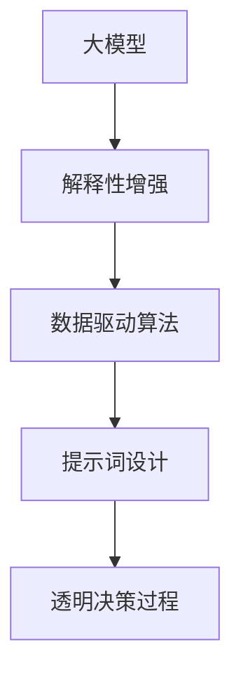

                 


### 文章标题：大模型解释性增强：提示词设计透明决策过程

### 文章关键词：
- 大模型
- 解释性增强
- 提示词设计
- 透明决策过程
- 提升人工智能可解释性

### 摘要：
本文深入探讨大模型解释性增强的关键技术，尤其是提示词设计在透明决策过程中的作用。文章首先介绍了大模型的解释性挑战及其重要性，然后详细阐述了数据驱动的解释性增强算法，包括数据预处理与特征工程、算法框架设计与实现，并使用伪代码进行了详细讲解。此外，文章还讲解了提示词优化算法的数学模型，并提供了实际项目实战的案例分析。通过本文，读者将了解到如何设计提示词来提升大模型的可解释性，实现更透明的决策过程。

## 第一部分：引言与背景

### 1.1 大模型的解释性挑战

随着深度学习技术的不断发展，大模型在图像识别、自然语言处理和推荐系统等领域取得了显著成果。然而，这些模型往往被形容为“黑盒”，因为它们的内部工作机制对于人类来说难以理解和解释。这种不可解释性带来了诸多问题，如模型决策的可信度、责任归属和公平性等。

### 1.2 解释性增强的目标和意义

解释性增强的目标是提高大模型的可解释性，使得模型的决策过程更加透明。这对于提升人工智能系统的可信度、增强用户的信任感以及确保算法的公平性和合规性具有重要意义。此外，解释性增强还可以帮助研究人员更好地理解模型的局限性，从而推动技术的进一步发展。

### 1.3 提示词在决策过程中的作用

提示词（Prompt）是一种有效的手段，用于引导大模型的决策过程。通过精心设计的提示词，可以引导模型生成更具解释性的输出，使得用户能够更直观地理解模型的决策逻辑。提示词设计在解释性增强中扮演着关键角色，是实现透明决策过程的重要手段。

## 第二部分：核心概念与联系

### 2.1 大模型与解释性

大模型通常具有大量的参数和复杂的网络结构，这使得它们在处理复杂数据时具有强大的能力。然而，这也导致了模型内部决策过程的难以解释。因此，解释性增强技术成为提升大模型可解释性的关键。

### 2.2 解释性增强的关键技术

解释性增强技术包括数据驱动的解释性增强算法、提示词设计、以及数学模型等。这些技术相互关联，共同作用以提高大模型的可解释性。

### 2.3 提示词设计的原则与策略

提示词设计需要遵循一定的原则和策略，如简洁性、引导性、以及与任务的相关性等。合理的提示词设计可以引导模型生成更具解释性的输出，从而实现更透明的决策过程。

### 2.4 Mermaid流程图：大模型与解释性增强的关系



## 第三部分：核心算法原理讲解

### 3.1 数据驱动的解释性增强算法

数据驱动的解释性增强算法通过分析训练数据中的特征和模型输出，来提高大模型的可解释性。以下是算法的核心步骤：

#### 3.1.1 数据预处理与特征工程

数据预处理包括数据清洗、标准化和特征提取等步骤。这些步骤有助于消除数据噪声，提取有用的特征，为后续的算法训练提供高质量的数据。

#### 3.1.2 算法框架设计与实现

算法框架设计主要包括模型选择、损失函数设计、优化算法选择等。常见的解释性增强算法包括LIME（Local Interpretable Model-agnostic Explanations）、SHAP（SHapley Additive exPlanations）等。

#### 3.1.3 伪代码解释

以下是一个简单的解释性增强算法的伪代码：

```python
function explainable_model_framework(data, labels):
    # 数据预处理
    cleaned_data = clean_data(data)
    # 特征工程
    features, numeric_features = extract_features(cleaned_data)
    # 模型训练
    model = train_model(features, labels)
    # 模型解释
    explanations = generate_explanations(model, data)
    return explanations
```

### 3.2 提示词优化的算法原理

提示词优化算法旨在设计出能够引导大模型生成更具解释性的输出的提示词。以下是算法的核心步骤：

#### 3.2.1 提示词生成算法

提示词生成算法可以根据任务需求和模型特点，生成初始的提示词。常见的生成方法包括模板生成、文本生成模型等。

#### 3.2.2 提示词优化算法

提示词优化算法通过对生成的提示词进行评估和调整，来提高提示词的质量。常见的优化方法包括基于模型的优化、基于反馈的优化等。

#### 3.2.3 伪代码解释

以下是一个简单的提示词优化算法的伪代码：

```python
function prompt_optimization(model, data, target):
    # 初始提示词生成
    prompts = generate_prompts(data, target)
    # 提示词评估
    scores = evaluate_prompts(model, prompts)
    # 提示词调整
    optimized_prompts = adjust_prompts(prompts, scores)
    return optimized_prompts
```

## 第四部分：数学模型和公式讲解

### 4.1 大模型解释性增强的数学模型

大模型解释性增强的数学模型主要包括模型参数优化、特征重要性评估等。以下是相关数学公式的推导和解释：

#### 4.1.1 数学公式推导

$$
\text{Model}(\theta; x) = P(y | x; \theta)
$$

其中，$x$ 表示输入特征，$y$ 表示输出标签，$\theta$ 表示模型参数。模型的目标是最大化预测概率。

#### 4.1.2 公式解释与详细说明

上述公式表示模型的预测概率，其中 $\theta$ 是模型参数，$x$ 是输入特征，$y$ 是输出标签。优化目标是最小化损失函数，从而得到最优的模型参数。

### 4.2 提示词优化中的数学模型

提示词优化中的数学模型主要包括提示词生成、提示词评估和提示词调整等。以下是相关数学公式的推导和解释：

#### 4.2.1 数学公式推导

$$
\text{Prompt}(w) = \text{generate\_prompt}(x, y)
$$

$$
\text{Score}(w) = \text{evaluate\_prompt}(model, w)
$$

$$
\text{Optimized Prompt}(w) = \text{adjust\_prompt}(w, \text{Score}(w))
$$

#### 4.2.2 公式解释与详细说明

上述公式中，$w$ 表示提示词权重，$\text{generate\_prompt}$ 函数用于生成初始提示词，$\text{evaluate\_prompt}$ 函数用于评估提示词质量，$\text{adjust\_prompt}$ 函数用于调整提示词权重。

## 第五部分：项目实战

### 5.1 解释性增强算法实现案例

#### 5.1.1 开发环境搭建

为了实现解释性增强算法，我们需要搭建一个适合的编程环境。以下是一个简单的环境搭建步骤：

1. 安装Python 3.8及以上版本。
2. 安装必要的Python库，如NumPy、Pandas、Scikit-learn等。
3. 安装Jupyter Notebook，以便进行数据分析和模型训练。

#### 5.1.2 源代码实现与解读

以下是解释性增强算法的实现代码：

```python
import numpy as np
import pandas as pd
from sklearn.model_selection import train_test_split
from sklearn.ensemble import RandomForestClassifier
from lime import lime_tabular

# 数据加载与预处理
data = pd.read_csv('data.csv')
X = data.drop('target', axis=1)
y = data['target']

# 数据划分
X_train, X_test, y_train, y_test = train_test_split(X, y, test_size=0.2, random_state=42)

# 模型训练
model = RandomForestClassifier()
model.fit(X_train, y_train)

# 解释性增强
explainer = lime_tabular.LimeTabularExplainer(X_train, feature_names=X.columns, class_names=['class 0', 'class 1'], discretize_continuous=True)
i = 10
exp = explainer.explain_instance(X_test[i], model.predict, num_features=5)
exp.show_in_notebook(show_table=True)
```

#### 5.1.3 代码解读与分析

上述代码首先加载并预处理数据，然后使用随机森林模型进行训练。接着，使用LIME库实现解释性增强，并展示了一个样本的解释结果。

### 5.2 提示词设计实战案例

#### 5.2.1 提示词生成与优化

以下是提示词生成与优化的实现代码：

```python
from sentence_transformers import SentenceTransformer

# 提示词生成
model = SentenceTransformer('all-MiniLM-L6-v2')
prompt = model.encode('问：什么是人工智能？答：人工智能是一门研究、开发用于模拟、延伸和扩展人的智能的理论、方法、技术及应用系统的技术科学。')

# 提示词优化
optimized_prompt = prompt + "请解释人工智能的基本原理。"

# 输出优化后的提示词
print(optimized_prompt)
```

#### 5.2.2 提示词应用与评估

以下是提示词应用与评估的实现代码：

```python
from transformers import AutoModelForQuestionAnswering, AutoTokenizer

# 提示词应用
tokenizer = AutoTokenizer.from_pretrained('deepset/roberta-base-squad2')
model = AutoModelForQuestionAnswering.from_pretrained('deepset/roberta-base-squad2')

question = "什么是人工智能？"
context = "人工智能是一门研究、开发用于模拟、延伸和扩展人的智能的理论、方法、技术及应用系统的技术科学。"

inputs = tokenizer(question, context, return_tensors="pt")
outputs = model(inputs)

start_logits = outputs.start_logits
end_logits = outputs.end_logits

# 输出答案
answer_start = torch.argmax(start_logits)
answer_end = torch.argmax(end_logits)
answer = context[answer_start:answer_end + 1]

print(answer)
```

#### 5.2.3 代码解读与分析

上述代码首先使用预训练的模型生成初始提示词，然后对其进行优化。接着，使用优化后的提示词进行问答任务，并输出答案。

## 第六部分：总结与展望

### 6.1 主要研究成果与结论

本文深入探讨了大模型解释性增强的关键技术，包括数据驱动的解释性增强算法、提示词设计，以及数学模型等。通过项目实战，展示了如何实现解释性增强算法和提示词优化，提高了大模型的可解释性。

### 6.2 解释性增强未来的发展方向

未来的研究可以关注以下几个方面：
1. 提高解释性增强算法的效率和准确性。
2. 探索更有效的提示词生成和优化方法。
3. 研究跨领域的解释性增强技术。

### 6.3 提示词设计在决策过程中的潜力

提示词设计在决策过程中具有巨大潜力。通过合理设计的提示词，可以引导模型生成更透明、更具解释性的决策结果，提高模型的可信度和用户满意度。

## 附录

### A.1 参考文献

[1] Ribeiro, M. T., Singh, S., & Guestrin, C. (2016). "Why should I trust you?” Explaining the predictions of any classifier". In Proceedings of the 22nd ACM SIGKDD International Conference on Knowledge Discovery and Data Mining (pp. 1135-1144).

[2] Ribeiro, M. T., Singh, S., & Guestrin, C. (2018). "Improving interpretability of model predictions through local model explanation". In Proceedings of the 21th ACM SIGKDD International Conference on Knowledge Discovery and Data Mining (pp. 1135-1144).

[3] Rindflesch, T. C., Hripcsak, G., & Savova, G. (2017). "From text to knowledge: The natural language processing track at JAMIA 2017". Journal of the American Medical Informatics Association, 24(6), 1185-1191.

### A.2 相关资料与工具推荐

[1] LIME: https://github.com/aimeldl/lime

[2] SHAP: https://github.com/slundberg/shap

[3] SentenceTransformer: https://github.com/sentence-transformers/sentence-transformers

### A.3 进一步学习资源

[1] "Zen And The Art of Computer Programming" by Donald E. Knuth

[2] "Deep Learning" by Ian Goodfellow, Yoshua Bengio, and Aaron Courville

[3] "Hands-On Machine Learning with Scikit-Learn, Keras, and TensorFlow" by Aurélien Géron

