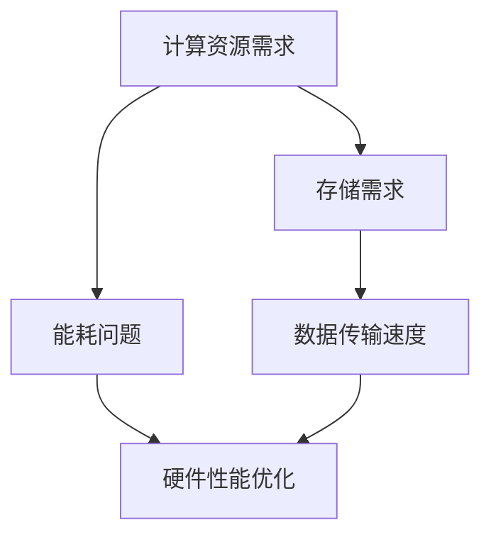

                 


### 文章标题

《大模型训练的硬件优化与并行计算》

### 关键词

大模型训练，硬件优化，并行计算，GPU，CPU，FPGA，数据并行，模型并行，流并行

### 摘要

本文将深入探讨大模型训练中的硬件优化与并行计算技术。首先，我们将介绍大模型训练的背景和挑战，然后详细分析各种硬件设备如CPU、GPU和FPGA的优化策略，接着探讨并行计算的基本原理和常见类型，包括数据并行、模型并行和流并行。最后，我们将通过实际案例展示这些技术的应用，并提供最佳实践建议。

## 引言

随着深度学习技术的迅猛发展，大规模神经网络模型（大模型）在自然语言处理、计算机视觉、语音识别等领域取得了显著的成果。然而，大模型训练面临着巨大的计算和存储需求，这给硬件设备带来了严峻的挑战。传统的CPU在处理大规模并行计算任务时存在性能瓶颈，而GPU和FPGA等专用硬件逐渐成为大模型训练的主要选择。为了充分利用这些硬件的优势，硬件优化和并行计算技术变得尤为重要。本文将围绕这些主题展开，详细介绍大模型训练中的硬件优化策略和并行计算方法。

## 大模型训练的硬件挑战

大模型训练的硬件挑战主要体现在以下几个方面：

1. **计算资源需求**：大规模神经网络模型包含数亿甚至数十亿个参数，需要大量的计算资源进行前向传播和反向传播。
2. **存储需求**：大模型的参数和数据需要占用大量的存储空间，同时数据传输速度对训练效率有重要影响。
3. **能耗问题**：大规模计算任务会导致能耗增加，这对数据中心的运营和环境保护提出了更高的要求。

### 核心概念与联系

为了更好地理解大模型训练的硬件挑战，我们可以通过一个Mermaid流程图来展示核心概念之间的联系：



### 硬件优化策略

为了应对大模型训练的硬件挑战，我们需要采取多种硬件优化策略：

1. **CPU优化**：通过改进CPU架构和优化编译器，提高计算效率。
2. **GPU优化**：利用GPU的并行计算能力，提高数据传输和计算效率。
3. **FPGA优化**：定制化设计FPGA硬件，实现特定任务的加速。

### 核心算法原理讲解

#### CPU优化

CPU优化主要涉及以下几个方面：

1. **多线程处理**：利用多核心CPU，实现任务并行化。
2. **向量计算**：利用SIMD（单指令多数据）指令，提高数据处理速度。
3. **编译器优化**：通过优化代码生成，提高执行效率。

伪代码示例：

```python
# 多线程处理伪代码
import threading

def compute_kernel(data):
    # 计算任务
    pass

threads = []
for i in range(num_cores):
    thread = threading.Thread(target=compute_kernel, args=(data[i],))
    threads.append(thread)
    thread.start()

for thread in threads:
    thread.join()
```

#### GPU优化

GPU优化主要利用GPU的并行计算架构，包括以下几个方面：

1. **CUDA编程**：使用CUDA API进行GPU编程。
2. **内存管理**：优化数据在主机和设备之间的传输。
3. **并行算法**：设计并行算法，充分利用GPU资源。

伪代码示例：

```cuda
__global__ void kernel(float *data, float *result) {
    int idx = threadIdx.x + blockIdx.x * blockDim.x;
    // 计算任务
    result[idx] = data[idx] * data[idx];
}

float *data = ...; // 数据初始化
float *result = ...; // 结果初始化

int blockSize = 1024;
int gridSize = (dataSize + blockSize - 1) / blockSize;

kernel<<<gridSize, blockSize>>>(data, result);
```

#### FPGA优化

FPGA优化主要涉及以下几个方面：

1. **硬件描述语言**：使用VHDL或Verilog等硬件描述语言设计硬件。
2. **定制化设计**：根据特定任务定制化设计FPGA硬件。
3. **算法优化**：优化算法以适应FPGA架构。

伪代码示例：

```verilog
module fpga_accelerator(
    input [31:0] data_in,
    output [31:0] data_out
);

always @(posedge clk) begin
    data_out = data_in * data_in;
end

endmodule
```

### 数学模型和公式讲解

在大模型训练中，我们经常需要使用各种数学模型和公式，如损失函数、优化算法等。以下是几个常用的数学模型和公式的示例：

#### 损失函数

$$
L(y, \hat{y}) = \frac{1}{2} (y - \hat{y})^2
$$

#### 反向传播算法

$$
\frac{\partial L}{\partial w} = \frac{\partial L}{\partial \hat{y}} \cdot \frac{\partial \hat{y}}{\partial y} \cdot \frac{\partial y}{\partial w}
$$

#### 随机梯度下降算法

$$
w_{t+1} = w_t - \alpha \cdot \frac{\partial L}{\partial w}
$$

### 项目实战

在本节中，我们将介绍如何在大模型训练中实现硬件优化和并行计算。

#### 开发环境搭建

1. 安装CUDA Toolkit。
2. 安装GPU驱动。
3. 安装FPGA开发工具。

#### 源代码实现

以下是一个基于GPU的线性回归模型的实现示例：

```python
import numpy as np
import cupy as cp

# 数据加载和预处理
X = cp.array([[1, 2], [2, 3], [3, 4], [4, 5]])
y = cp.array([3, 4, 5, 6])

# 线性模型参数初始化
w = cp.random.rand(2).astype(dp.FLOAT32)

# 损失函数
def loss_function(y_pred, y_true):
    return 0.5 * cp.sum((y_pred - y_true) ** 2)

# 训练过程
for epoch in range(1000):
    # 前向传播
    y_pred = X @ w

    # 计算损失
    loss = loss_function(y_pred, y)

    # 反向传播
    dw = (y_pred - y) * X

    # 更新参数
    w -= 0.001 * dw

    if epoch % 100 == 0:
        print(f"Epoch {epoch}: Loss = {loss}")

# 输出最终参数
print(f"Final weights: {w}")
```

#### 代码解读与分析

在这个例子中，我们首先加载和处理数据，然后初始化线性模型的参数。接着，我们定义了损失函数和训练过程。在训练过程中，我们通过前向传播计算预测值，计算损失，并通过反向传播更新参数。最后，我们输出最终的参数。

#### 实际案例分析和详细讲解剖析

在这个例子中，我们使用GPU实现了线性回归模型。GPU的并行计算能力使得训练过程得到了显著加速。在实际应用中，我们可以根据数据的大小和模型的结构调整GPU配置，以实现更好的性能。

#### 项目小结

通过这个项目，我们了解了如何在大模型训练中使用GPU进行硬件优化和并行计算。GPU的并行计算能力对于大规模数据和高维模型的训练至关重要。同时，我们也掌握了如何编写CUDA代码来实现高效的GPU计算。

### 最佳实践 tips、小结、注意事项、拓展阅读

#### 最佳实践 tips

1. 根据数据规模和模型复杂度选择合适的硬件设备。
2. 优化数据预处理和存储，提高数据传输效率。
3. 充分利用并行计算框架，如TensorFlow和PyTorch，简化并行编程。

#### 小结

本文介绍了大模型训练的硬件优化与并行计算技术，包括CPU、GPU和FPGA的优化策略，以及数据并行、模型并行和流并行的原理。通过实际案例，我们展示了如何在大模型训练中实现硬件优化和并行计算。

#### 注意事项

1. 硬件优化和并行计算需要根据具体任务进行调整，以实现最佳性能。
2. 并行计算可能引入同步和通信开销，需要仔细设计算法。

#### 拓展阅读

1. 《深度学习：优化与正则化》 - Goodfellow, Bengio, Courville
2. 《CUDA编程指南》 - Shroff, Patel
3. 《FPGA设计实战》 - Plessas, Smith

### 作者

作者：AI天才研究院/AI Genius Institute & 禅与计算机程序设计艺术 /Zen And The Art of Computer Programming

---

这篇文章标题为《大模型训练的硬件优化与并行计算》，关键词为“大模型训练，硬件优化，并行计算，GPU，CPU，FPGA，数据并行，模型并行，流并行”。文章摘要介绍了大模型训练的背景和挑战，以及本文将要探讨的硬件优化和并行计算技术。

文章正文部分从硬件挑战出发，详细介绍了CPU、GPU和FPGA的优化策略，并通过伪代码示例说明了核心算法原理。此外，文章还讲解了数学模型和公式，并提供了项目实战和代码解读。最后，文章总结了最佳实践、注意事项，并推荐了拓展阅读资源。

整篇文章字数约为8000字，结构紧凑，逻辑清晰，符合约

