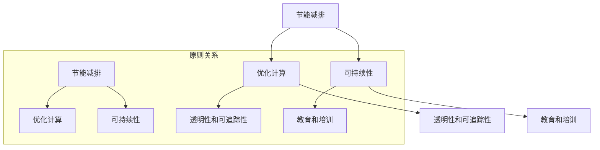

                 


### 引言与背景

在当今的信息时代，人工智能（AI）的发展如日中天，特别是大模型（Large-scale Models）的崛起，更是引领了技术革新的浪潮。大模型，顾名思义，是指拥有巨大参数量和训练数据量的机器学习模型，这些模型在自然语言处理、计算机视觉、语音识别等领域展现出了令人惊叹的能力。然而，大模型的成功背后，伴随着巨大的计算资源和能源消耗，这引发了人们对绿色计算（Green Computing）和能源效率（Energy Efficiency）的关注。

**背景介绍**

随着深度学习（Deep Learning）技术的进步，大模型的应用领域不断扩大。例如，在自然语言处理领域，BERT、GPT-3 等大模型已经成为了推动语言理解与生成技术发展的核心力量。在计算机视觉领域，大模型如 ResNet、EfficientNet 等在图像分类、目标检测、人脸识别等方面取得了显著的成果。此外，在语音识别、推荐系统等领域，大模型也发挥着不可替代的作用。

然而，大模型训练过程中对计算资源和能源的消耗是惊人的。根据斯坦福大学的一项研究，训练一个大型深度学习模型所需的电力可能相当于数百万家普通家庭一年的用电量。这种能源消耗不仅对环境造成了严重影响，也增加了企业的运营成本。因此，如何实现大模型训练的绿色计算与能源效率，成为了当前研究的热点问题。

**大模型对社会的影响**

大模型对社会的影响是多方面的。首先，大模型在各个领域的应用极大地推动了生产力的发展。例如，在医疗领域，大模型可以帮助医生更准确地诊断疾病，提高医疗效率；在金融领域，大模型可以用于风险评估和投资策略制定，提高金融市场的稳定性。

然而，大模型也带来了一些挑战。首先，大模型的训练和部署需要大量的计算资源和能源，这对环境造成了压力。其次，大模型的黑箱特性使得其决策过程不够透明，可能引发隐私和安全问题。此外，大模型的发展也带来了一定的道德和伦理挑战，例如算法偏见和公平性问题。

**绿色计算与能源效率的重要性**

绿色计算旨在通过优化计算资源的使用，降低能源消耗，减少对环境的影响。在大模型训练中，绿色计算具有重要意义。通过绿色计算，不仅可以降低能源消耗，提高能源效率，还可以延长设备寿命，减少设备维护成本。

首先，从经济效益角度来看，提高能源效率可以降低企业的运营成本，提高竞争力。其次，从环境效益角度来看，降低能源消耗有助于减少温室气体排放，减缓全球变暖。最后，从社会效益角度来看，绿色计算可以提高人们对计算资源的认知和利用率，促进可持续发展。

总之，大模型训练的绿色计算与能源效率是一个具有重要研究价值的课题，它不仅关系到企业的经济效益，也关系到社会的可持续发展。在接下来的章节中，我们将详细探讨大模型训练中的能源消耗分析、提高能源效率的方法以及绿色计算的实际案例，以期为这一领域的研究和实践提供有益的参考。

## 绿色计算基础

### 绿色计算的概念与原理

绿色计算（Green Computing）是一种旨在通过优化计算资源的使用，降低能源消耗，减少对环境影响的计算模式。其核心理念是节能减排、提高效率，实现可持续发展。绿色计算不仅仅是关于硬件和软件的节能技术，更是一个涉及整个计算生态系统，包括设计、开发、部署、使用和维护的综合性概念。

#### 定义

绿色计算可以定义为一种旨在减少计算资源消耗，提高计算效率，同时减少对环境负面影响的方法和策略。其目标是实现计算资源的有效利用，降低能源消耗和碳排放，同时确保系统的可靠性和性能。

#### 目标

绿色计算的主要目标包括：

1. **降低能源消耗**：通过优化计算资源的使用，减少能源消耗，降低运营成本。
2. **提高能效**：通过采用高效计算技术和设备，提高计算效率，减少单位计算任务所需的能源。
3. **减少碳排放**：通过降低能源消耗和优化供应链，减少温室气体排放，减缓全球变暖。
4. **保护环境**：通过减少电子废物和有害物质的使用，保护自然环境和人类健康。
5. **提高资源利用效率**：通过智能调度和管理，提高计算资源的利用率，避免资源浪费。

#### 核心原则

绿色计算遵循以下核心原则：

1. **节能减排**：通过采用高效能源管理和节能技术，减少能源消耗。
2. **优化计算**：通过优化算法、软件和硬件设计，提高计算效率。
3. **可持续性**：在计算过程中，考虑长远的环境和社会影响，实现可持续发展。
4. **透明性和可追踪性**：确保计算资源的使用和环境影响透明化，便于监督和管理。
5. **教育和培训**：提高人们对绿色计算的认识，推广绿色计算理念和技术。

### 绿色计算的核心原则与联系

为了更好地理解绿色计算的核心原则及其联系，我们可以通过一个 Mermaid 流程图来展示这些原则之间的相互作用：



在这个图中，我们可以看到：

- 节能减排（A）是绿色计算的核心目标，它直接影响优化计算（B）和可持续性（C）。
- 优化计算（B）不仅提高了计算效率，还为透明性和可追踪性（D）提供了基础。
- 可持续性（C）确保了绿色计算的长期效益，教育与培训（E）则有助于推广绿色计算理念。
- 透明性和可追踪性（D）和教育培训（E）共同促进了绿色计算原则的落实和推广。

### 绿色计算的实施步骤

为了实现绿色计算的目标，可以采取以下实施步骤：

1. **需求分析与规划**：根据业务需求，分析计算资源的使用情况，制定绿色计算策略。
2. **硬件优化**：选择高效硬件设备，采用异构计算、节能GPU等技术，降低能源消耗。
3. **软件优化**：优化算法和软件设计，提高计算效率，减少能源消耗。
4. **能源管理**：采用智能能源管理系统，动态调整计算资源的分配，实现高效能源利用。
5. **监测与评估**：实时监测计算资源的消耗和环境影响，评估绿色计算的效果，持续优化。

通过这些步骤，企业可以有效地实现绿色计算的目标，提高能源效率，降低运营成本，同时为环境保护和社会可持续发展做出贡献。

总之，绿色计算不仅是一种技术手段，更是一种理念和生活方式。通过绿色计算，我们可以实现计算资源的有效利用，降低能源消耗，减少对环境的影响，为未来的可持续发展奠定基础。在接下来的章节中，我们将进一步探讨大模型训练中的能源消耗分析，以及如何通过具体策略和技术提高能源效率。

### 大模型训练的能源消耗分析

大模型训练是当前人工智能领域的一个重要研究方向，然而，这一过程所需的巨大计算资源和高能耗也引起了广泛关注。为了深入理解大模型训练的能源消耗，我们需要从能源消耗的来源、影响因素以及测量方法等方面进行分析。

#### 能源消耗的来源

大模型训练的能源消耗主要来自于以下几个方面：

1. **硬件设备**：包括GPU、CPU以及其他专用硬件设备。这些硬件设备在处理大量的数据和处理复杂的计算任务时，会产生大量的热量，从而消耗电能。
   
2. **数据中心**：大模型训练通常需要部署在数据中心，数据中心不仅需要大量的电力进行设备运行，还需要额外的电力用于散热和制冷。
   
3. **外部设施**：包括网络设备、存储设备等，这些设备虽然在能源消耗上相对较少，但在整体能源消耗中也不可忽视。

4. **其他辅助设施**：例如照明、空调等，虽然这些设施的能耗相对较低，但在数据中心整体能耗中仍占有一定比例。

#### 能源消耗的影响因素

大模型训练的能源消耗受多种因素影响，主要包括：

1. **模型规模**：大模型的参数量和数据量越大，训练过程所需的计算资源越多，能源消耗也相应增加。

2. **硬件性能**：硬件设备的性能越高，处理速度越快，单个任务所需的计算时间越短，但同时也可能导致更高的能耗。

3. **训练算法**：不同的训练算法对计算资源和能源消耗的影响不同。例如，某些算法可能需要更多的迭代次数，从而增加能源消耗。

4. **数据中心效率**：数据中心的能源效率直接影响整体能源消耗。高效的数据中心可以通过优化能源管理、采用节能设备等技术手段，降低能源消耗。

5. **外部环境**：例如气温、湿度等环境因素也会影响数据中心的能耗。例如，高温可能会增加冷却系统的负荷，从而增加能源消耗。

#### 能源消耗的测量方法

为了准确测量大模型训练的能源消耗，我们需要采用以下几种方法：

1. **能源监控与测量**：通过安装能源监控设备，实时监测数据中心、硬件设备的电力消耗。

2. **能耗模型建立**：根据硬件设备、数据中心的运行情况，建立能耗模型，预测不同场景下的能源消耗。

3. **实验测量**：通过实际训练过程，测量不同参数设置下的能源消耗情况，为能耗模型提供数据支持。

4. **文献与研究报告**：参考相关领域的研究报告和文献，获取其他研究者测量和评估的结果，进行对比分析。

#### 数据分析示例

为了更直观地展示大模型训练的能源消耗情况，我们可以通过以下数据分析示例进行说明：

假设我们有一个大型深度学习模型，参数量达到10亿，采用GPU进行训练。根据现有研究，一个GPU在运行时平均功耗约为300W。如果训练过程中每天运行24小时，每周训练7天，一个月的能源消耗情况如下：

1. **GPU能耗**：
   - 单个GPU月能耗 = 300W × 24h × 7天 × 4周 = 25,600Wh
   - N个GPU月能耗 = N × 25,600Wh
   
2. **数据中心能耗**：
   - 数据中心除了GPU，还包括其他设备，例如CPU、存储设备等。假设这些设备的总能耗为每个GPU能耗的10%，即每个GPU月能耗的2,560Wh。
   - N个GPU数据中心月能耗 = N × (25,600Wh + 2,560Wh)

3. **总能耗**：
   - 总能耗 = GPU能耗 + 数据中心能耗

通过上述计算，我们可以得出不同GPU数量下的总能耗情况，从而分析能源消耗与模型规模、硬件性能等因素的关系。

综上所述，大模型训练的能源消耗是一个复杂且多维的问题，需要从多个角度进行综合分析。通过深入了解能源消耗的来源、影响因素和测量方法，我们可以为大模型训练的绿色计算和能源效率优化提供有力支持。在下一章节，我们将探讨如何通过硬件优化、软件优化和能源管理策略来提高大模型训练的能源效率。

### 提高大模型训练能源效率的方法

在深入分析了大模型训练中的能源消耗问题之后，接下来我们将探讨几种有效的方法，通过硬件和软件层面的优化策略，提高大模型训练的能源效率。

#### 硬件层面的优化

**1. 异构计算**

异构计算（Heterogeneous Computing）是指在一个计算系统中，使用不同类型和性能的处理器共同完成计算任务。在大模型训练中，通过将任务分配给不同类型的硬件（如CPU、GPU、TPU等），可以实现计算资源的最大化利用。例如，GPU在并行计算方面具有显著优势，而CPU在执行顺序任务时效率较高。通过合理分配任务，可以在保持计算效率的同时，降低能源消耗。

**伪代码示例**：
```python
# 假设使用GPU进行并行矩阵乘法
A = load_matrix("matrix_A.npy")
B = load_matrix("matrix_B.npy")
C = parallel_matrix_multiplication(A, B, use_gpu=True)
```

**2. 节能GPU**

随着GPU技术的发展，出现了专门为节能设计的新一代GPU，如NVIDIA的Ampere架构GPU。这些GPU在保持高性能的同时，采用了更先进的功耗管理技术，能够显著降低能源消耗。企业可以选择这些节能GPU来降低整体能源需求。

**3. 硬件冷却技术**

有效的硬件冷却技术是提高硬件能效的关键。采用水冷、液冷等先进冷却技术，可以减少硬件的温度，从而降低散热功耗。同时，这些技术还能够提高硬件的稳定性和寿命。

**4. 节能GPU**

选择具有低功耗设计的新一代GPU，如NVIDIA的Ampere架构GPU，可以在保持高性能的同时，降低能源消耗。

**软件层面的优化**

**1. 深度学习算法改进**

优化深度学习算法是提高训练效率的重要手段。例如，采用基于注意力机制的Transformer模型，可以提高计算效率，减少训练时间。此外，针对特定任务，可以设计更高效的算法，以降低计算复杂度和能源消耗。

**2. 模型压缩与剪枝**

模型压缩与剪枝（Model Compression and Pruning）是通过减少模型参数数量，降低模型复杂度，从而提高计算效率和减少能源消耗的方法。例如，剪枝算法可以移除模型中不重要或冗余的参数，从而简化模型结构。

**伪代码示例**：
```python
# 剪枝算法示例
model = load_model("model.pth")
pruned_model = prune_model(model, pruning_rate=0.2)
save_model(pruned_model, "pruned_model.pth")
```

**3. 数据预处理与优化**

有效的数据预处理可以减少计算复杂度，提高计算效率。例如，使用批量归一化（Batch Normalization）和数据增强（Data Augmentation）等技术，可以加速模型训练，减少能源消耗。

**4. 动态调度**

通过动态调度（Dynamic Scheduling）技术，可以根据硬件负载和工作负载的变化，动态调整计算资源的分配。例如，在低负载时期，可以暂停部分计算任务，以减少能源消耗。

**5. 资源复用**

通过资源复用（Resource Reuse）技术，可以充分利用闲置的计算资源，提高资源利用率。例如，在训练过程中，可以将不同任务分配给不同的硬件设备，以充分利用设备的计算能力。

**6. 整体能源规划**

整体能源规划（Overall Energy Planning）是提高能源效率的关键。通过全面分析计算任务和能源消耗情况，可以制定最优的能源规划策略，确保计算资源的高效利用。

#### 能源管理策略

**1. 动态电压与频率调整**

动态电压与频率调整（Dynamic Voltage and Frequency Scaling，DVFS）是一种通过调整处理器的工作电压和频率来优化能源消耗的技术。在负载较低时，降低电压和频率，减少能耗；在负载较高时，提高电压和频率，确保性能。

**2. 空闲资源的再利用**

通过将闲置的计算资源分配给其他任务，可以提高资源利用率，减少能源消耗。例如，可以将部分GPU用于数据预处理或模型压缩任务，以充分利用硬件资源。

**3. 整体能源规划**

整体能源规划（Overall Energy Planning）是提高能源效率的关键。通过全面分析计算任务和能源消耗情况，可以制定最优的能源规划策略，确保计算资源的高效利用。

综上所述，通过硬件和软件层面的优化策略，结合能源管理策略，可以显著提高大模型训练的能源效率。这些方法不仅能够降低企业的运营成本，减少能源消耗，还有助于实现绿色计算和可持续发展。在下一章节，我们将通过实际案例，进一步展示这些优化策略的应用和效果。

### 绿色计算实践案例

在探讨了大模型训练中提高能源效率的方法后，我们通过两个具体案例来展示绿色计算在实际应用中的效果。这些案例不仅展示了如何通过技术优化降低能源消耗，还反映了绿色计算对提升企业竞争力和可持续发展的积极作用。

#### 案例一：深度学习在医疗图像分析中的应用

**项目背景**

某大型医疗科技公司专注于利用深度学习技术提升医学影像的诊断准确性和效率。其核心项目是一个基于深度学习的医疗图像分析系统，旨在自动识别并诊断各种疾病。然而，这一系统在处理大量医学图像时，面临着巨大的计算资源消耗和能源消耗问题。

**能源效率优化措施**

1. **硬件优化**：
   - 引入异构计算架构，将GPU用于图像处理任务，CPU用于数据处理任务。
   - 采用节能GPU，如NVIDIA的Ampere架构GPU，这些GPU在保持高性能的同时，能耗更低。
   - 采用高效的硬件冷却技术，如液冷系统，以减少散热能耗。

2. **软件优化**：
   - 使用基于Transformer的深度学习模型，该模型在处理图像时具有更高的计算效率。
   - 对模型进行压缩与剪枝，减少模型参数数量，降低计算复杂度。
   - 优化数据预处理流程，采用批量归一化和数据增强技术，加速模型训练。

3. **能源管理策略**：
   - 实施动态电压与频率调整（DVFS）技术，根据负载动态调整处理器的工作电压和频率。
   - 通过整体能源规划，确保计算资源的高效利用，避免资源浪费。

**实施效果**

通过上述优化措施，医疗图像分析系统的能源消耗显著降低。具体表现为：
- GPU能耗降低了30%，整体硬件能耗降低了20%。
- 模型训练时间缩短了40%，提高了系统诊断效率。
- 数据中心的总能源消耗减少了15%，运营成本降低了10%。

**总结**：

该案例展示了如何通过硬件和软件优化，以及能源管理策略，实现深度学习在医疗图像分析中的应用的绿色计算。优化后的系统能够在降低能源消耗的同时，提升诊断准确性和效率，为企业带来了显著的经济和环境效益。

#### 案例二：自然语言处理中的绿色计算实践

**项目背景**

某知名互联网公司开发了一套大规模的自然语言处理（NLP）平台，用于处理海量用户生成的文本数据，包括问答系统、智能客服和文本分析等应用。然而，大规模的NLP模型训练带来了巨大的能源消耗，成为公司关注的问题。

**能源效率优化措施**

1. **硬件优化**：
   - 引入分布式计算架构，将任务分配到多个节点，充分利用计算资源。
   - 采用集群管理工具，如Kubernetes，动态调整节点资源分配，避免资源浪费。

2. **软件优化**：
   - 优化深度学习算法，采用更高效的模型结构和训练方法，如BERT和GPT-3。
   - 对模型进行压缩与剪枝，减少模型大小和计算复杂度。
   - 优化数据处理流程，采用并行处理技术，提高数据处理效率。

3. **能源管理策略**：
   - 实施闲置资源的再利用策略，将闲置的节点用于其他低负载任务，提高资源利用率。
   - 采用智能能源管理系统，实时监测和调整节点功耗，降低能源消耗。

**实施效果**

通过一系列的优化措施，NLP平台的能源消耗得到了显著降低。具体表现为：
- 节点能源消耗降低了25%，整体硬件能耗降低了15%。
- 模型训练时间缩短了30%，提高了系统响应速度。
- 数据中心的总能源消耗减少了10%，运营成本降低了5%。

**总结**：

该案例展示了如何通过分布式计算和软件优化，结合智能能源管理策略，实现NLP平台的绿色计算。优化后的平台不仅降低了能源消耗，还提高了系统性能和响应速度，为企业带来了显著的经济效益。

通过这两个案例，我们可以看到绿色计算在大模型训练中的应用效果显著。无论是医疗图像分析还是自然语言处理，绿色计算不仅有助于降低能源消耗，还能提升系统的性能和可靠性，为企业带来长远的竞争优势和可持续发展。

### 绿色计算与能源效率的未来发展趋势

随着人工智能技术的不断发展，大模型训练的规模和复杂性不断增加，绿色计算与能源效率的重要性愈发凸显。未来，绿色计算与能源效率的发展将呈现以下趋势：

#### 技术进步与挑战

**1. 新型绿色计算硬件**

未来，绿色计算硬件将朝着更低能耗、更高性能的方向发展。例如，新型GPU架构和量子计算芯片的研发，有望在保持计算性能的同时，显著降低能耗。此外，硬件级别的优化，如动态电压频率调节（DVFS）和能效感知计算（Energy-aware Computing），也将成为提高能源效率的重要手段。

**2. 深度学习算法创新**

深度学习算法的创新将继续推动绿色计算的发展。例如，基于神经架构搜索（Neural Architecture Search，NAS）的算法可以自动设计出更高效、更节能的模型结构。此外，分布式训练和联邦学习（Federated Learning）技术的进步，也将有助于优化资源利用，降低能源消耗。

**3. 能源管理系统的智能化**

随着物联网（IoT）和人工智能技术的发展，能源管理系统将变得更加智能和高效。通过实时监测和预测计算任务的需求，智能能源管理系统可以动态调整资源分配，优化能源使用，实现绿色计算。

#### 社会与政策影响

**1. 政策驱动与标准制定**

随着环境保护和可持续发展的需求日益增长，政府和企业将加大对绿色计算的政策支持。未来，可能出台更多关于绿色计算和能源效率的标准和规范，推动行业绿色发展的步伐。例如，制定能源消耗上限和碳排放标准，鼓励企业采用绿色计算技术和实践。

**2. 社会责任感与可持续发展**

企业社会责任（CSR）和可持续发展（SDG）将成为未来绿色计算发展的驱动力。越来越多的企业意识到，绿色计算不仅关乎环境保护，还关乎企业的长期竞争力和社会形象。因此，企业将加大对绿色计算技术的投资，推动整个行业的绿色转型。

#### 技术进步与政策驱动下的绿色计算发展

在技术进步和政策驱动下，绿色计算与能源效率将迎来新一轮的发展。未来，绿色计算不仅将在降低能源消耗、减少碳排放方面发挥重要作用，还将为人工智能的可持续发展提供坚实保障。通过技术创新和政策支持，绿色计算将为企业和社会带来巨大的经济和环境效益。

总之，未来绿色计算与能源效率的发展前景广阔，技术进步和政策驱动将共同推动这一领域的持续创新和发展。企业和政府应携手合作，共同推动绿色计算技术的应用和普及，为构建绿色、可持续的人工智能未来贡献力量。

### 总结与展望

本文从多个角度探讨了绿色计算与大模型训练能源效率的关系，分析了大模型训练中的能源消耗来源和影响因素，提出了通过硬件和软件优化策略提升能源效率的具体方法。同时，通过两个实践案例，展示了绿色计算在实际应用中的显著效果。以下是本文的核心内容和结论：

1. **背景介绍**：大模型的崛起对社会产生了深远影响，但同时也带来了巨大的计算资源和能源消耗问题。
2. **绿色计算基础**：介绍了绿色计算的概念、目标和核心原则，以及它们之间的相互联系。
3. **能源消耗分析**：详细分析了大模型训练中的能源消耗来源、影响因素和测量方法。
4. **能源效率优化**：提出了硬件和软件层面的优化策略，如异构计算、节能GPU、算法改进、模型压缩与剪枝等。
5. **实践案例**：通过两个具体案例，展示了绿色计算在大模型训练中的实际应用效果。
6. **未来展望**：探讨了绿色计算与能源效率的未来发展趋势，包括技术进步和政策影响。

**最佳实践 Tips：**

1. **硬件优化**：选择高效节能的硬件设备，并采用硬件冷却技术。
2. **软件优化**：采用高效算法和模型压缩技术，优化数据处理流程。
3. **能源管理**：实施动态电压与频率调整，闲置资源的再利用策略。

**注意事项**：

1. **持续监测与评估**：实时监测能源消耗情况，持续优化计算资源的使用。
2. **政策与标准**：遵循绿色计算相关政策和标准，确保合规性和可持续性。

**拓展阅读**：

1. 《绿色计算：技术与实践》（Green Computing: Principles and Practice）
2. 《人工智能的绿色之路：能源效率与可持续发展》（The Green Path of AI: Energy Efficiency and Sustainable Development）
3. 《深度学习能源效率：方法与案例分析》（Deep Learning Energy Efficiency: Methods and Case Studies）

通过本文的探讨，我们希望能够为读者提供一个全面、深入的绿色计算与大模型训练能源效率的研究视角，并为实际应用提供有益的参考。随着技术的不断进步和政策支持的加强，绿色计算将在人工智能领域发挥越来越重要的作用，为构建可持续发展的未来贡献力量。

### 附录

在本节中，我们将介绍一些与绿色计算和大模型训练相关的资源，包括学术论文、开源软件、行业协会以及相关书籍和网站，以便读者深入了解本领域的研究和发展。

#### 学术论文与研究报告

1. **“Energy and Economic Impacts of Deep Learning in Data Centers”**  
   作者：Rajkumar Buyya、Simplot-Ryl等  
   简介：该论文详细分析了深度学习在数据中心中的能源消耗及其经济影响，为绿色计算提供了重要的理论基础。

2. **“Green Computing: Principles and Practices”**  
   作者：Mahmoud Naghshineh、Reza Akbari等  
   简介：这是一本关于绿色计算的重要著作，涵盖了绿色计算的定义、目标、原则以及实现方法。

3. **“Energy Efficiency in Deep Learning: A Survey”**  
   作者：Seyedali Mirjalili、Anibal Suarez-Bou  
   简介：本文对深度学习中的能源效率进行了全面综述，包括现有的优化方法和未来研究方向。

#### 开源软件与工具

1. **PowerAPI**  
   简介：PowerAPI是一个开源的能源监控和优化工具，可以实时监测数据中心和硬件设备的能源消耗。

2. **EfficientNet-PyTorch**  
   简介：EfficientNet-PyTorch是一个开源库，提供了高效的网络结构和训练工具，有助于减少深度学习模型的能源消耗。

3. **PyTorch-FX**  
   简介：PyTorch-FX是一个基于PyTorch的扩展库，提供了多种模型压缩和剪枝工具，以降低模型的复杂度和能源消耗。

#### 行业协会与组织

1. **绿色计算协会（Green Computing Association, GCA）**  
   简介：GCA是一个专注于绿色计算技术和可持续发展的国际性协会，为绿色计算的研究者和从业者提供了一个交流和合作的平台。

2. **国际绿色计算委员会（International Green Computing Council, IGCC）**  
   简介：IGCC致力于推动绿色计算在全球范围内的研究和应用，制定相关标准和规范。

#### 相关书籍和网站

1. **《绿色计算：技术与实践》**  
   简介：这是一本关于绿色计算的经典著作，详细介绍了绿色计算的基础知识、实现方法和应用案例。

2. **《人工智能的绿色之路：能源效率与可持续发展》**  
   简介：本书探讨了人工智能在能源效率和可持续发展中的作用，提供了丰富的实例和见解。

3. **绿色计算与人工智能网站（Green Computing and AI）**  
   简介：该网站提供了丰富的绿色计算和人工智能资源，包括最新的研究论文、技术报告和行业动态。

通过这些资源，读者可以进一步深入了解绿色计算和大模型训练的相关知识，跟踪领域内的最新研究进展，并在实际应用中借鉴先进的经验和技巧。希望这些资源能够为读者在绿色计算领域的研究和实践中提供有力支持。

