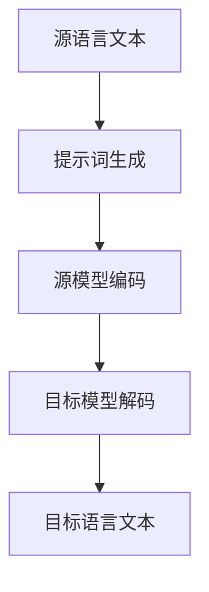
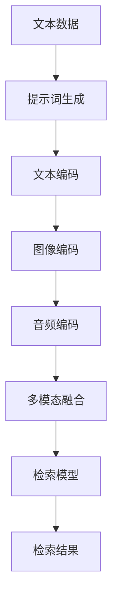
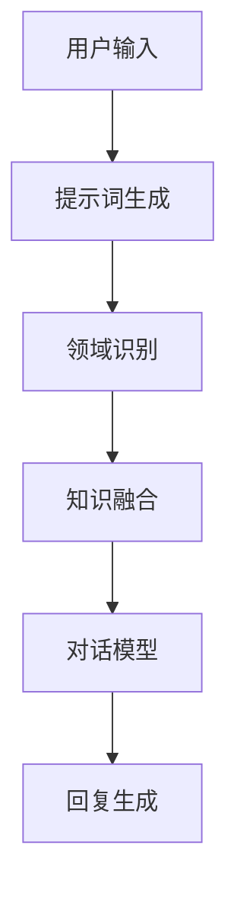
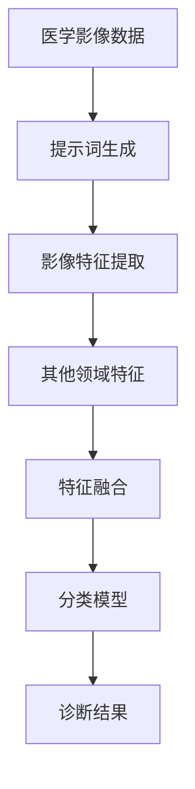
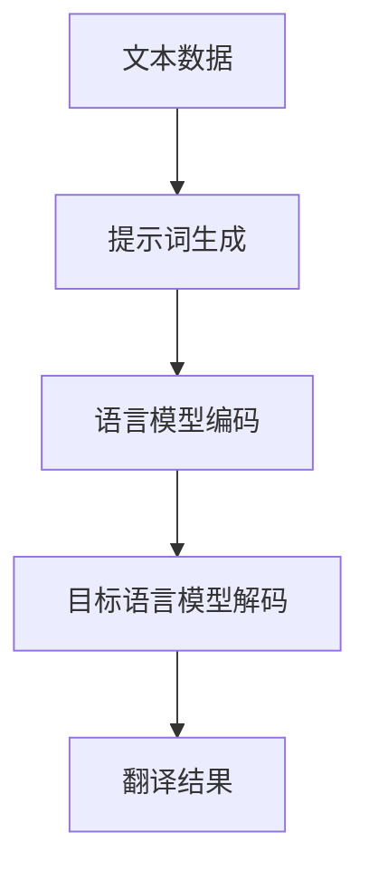
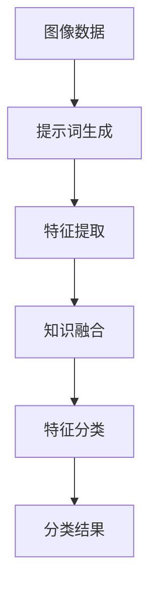

                 

### 文章标题：大模型跨领域知识迁移与提示词桥接

### 关键词：大模型、知识迁移、提示词桥接、跨领域、AI

### 摘要：
本文将深入探讨大模型在跨领域知识迁移与提示词桥接中的应用。通过介绍大模型的基本概念和知识迁移的重要性，我们将逐步分析跨领域知识迁移面临的挑战以及解决方案。此外，本文还将详细讲解提示词桥接技术及其在跨领域知识迁移中的关键作用。通过具体实例和实战分析，我们将展示如何在大模型中实现高效的知识迁移与提示词桥接，为AI应用提供新的思路和方法。

### 目录

1. **引言**
   1.1 大模型时代的来临
   1.2 知识迁移的背景和重要性
   1.3 提示词桥接的概念与作用

2. **大模型基础**
   2.1 大模型概述
   2.2 大模型的架构与特性
   2.3 大模型在AI中的应用

3. **知识迁移理论**
   3.1 知识迁移的定义
   3.2 跨领域知识迁移的挑战
   3.3 知识迁移技术概述

4. **跨领域知识迁移方法**
   4.1 转换器架构
   4.2 知识蒸馏
   4.3 多任务学习

5. **提示词桥接技术**
   5.1 提示词的定义与生成
   5.2 提示词优化
   5.3 提示词适应性调整

6. **应用与实践**
   6.1 医学影像分析
   6.2 自然语言处理
   6.3 计算机视觉

7. **案例研究**
   7.1 跨语言文本生成
   7.2 跨模态信息检索
   7.3 跨领域对话系统

8. **未来展望**
   8.1 发展趋势
   8.2 潜在挑战与机遇

9. **结论**
   9.1 总结与展望

### 1. 引言

#### 1.1 大模型时代的来临

随着深度学习技术的不断发展和计算能力的提升，大模型（也称为巨量级模型）逐渐成为人工智能领域的研究热点。大模型通常具有数十亿甚至数千亿个参数，能够处理海量数据并自动提取复杂的特征。这些模型在图像识别、自然语言处理、语音识别等领域取得了显著成就，推动了人工智能的快速发展。

大模型的出现不仅改变了传统AI系统的设计思路，也为跨领域知识迁移提供了新的可能性。传统的AI系统往往依赖于特定领域的训练数据，而大模型则可以通过迁移学习技术在不同的领域间共享知识，从而提高模型的泛化能力和适应性。

#### 1.2 知识迁移的背景和重要性

知识迁移是指将一个领域中已获得的知识应用于另一个相关的领域。在AI领域，知识迁移具有以下几个重要背景和原因：

1. **数据稀缺**：某些领域（如医疗、生物）的数据量非常有限，无法提供足够的训练数据来训练大规模模型。通过知识迁移，可以从其他领域迁移知识，补充训练数据的不足。

2. **模型泛化**：在AI应用中，模型往往需要适应不同的环境和任务。知识迁移可以帮助模型在不同任务间共享知识，提高模型的泛化能力和适应性。

3. **效率提升**：知识迁移可以减少训练数据的需求，缩短模型训练时间，降低计算成本。这对于资源有限的小型项目或企业来说尤为重要。

#### 1.3 提示词桥接的概念与作用

提示词桥接是一种利用提示词（prompt）来引导模型进行知识迁移的方法。提示词是一个关键词或短句，用于提示模型关注特定任务或领域。通过设计合适的提示词，可以引导模型从源领域迁移知识到目标领域。

提示词桥接在跨领域知识迁移中具有重要作用：

1. **增强迁移效果**：提示词可以帮助模型更好地理解目标领域的任务需求，从而提高知识迁移的效果。

2. **优化训练过程**：提示词可以指导模型关注特定特征或模式，从而优化训练过程，提高模型性能。

3. **灵活调整**：通过调整提示词，可以灵活地控制知识迁移的方向和深度，适应不同的应用场景。

接下来，我们将深入探讨大模型的基本概念和知识迁移的理论基础，为后续的内容打下基础。请继续阅读。 ### 2. 大模型基础

在探讨大模型跨领域知识迁移与提示词桥接之前，有必要对大模型进行详细介绍。大模型通常是指拥有数十亿甚至数千亿个参数的深度学习模型，其容量之大使得它们能够在处理复杂任务时展现出卓越的性能。本节将首先介绍大模型的基本概念，然后探讨其架构与特性，最后分析大模型在AI领域的应用。

#### 2.1 大模型概述

大模型的出现源于深度学习技术的快速发展。深度学习是一种利用多层神经网络来模拟人类大脑处理信息的方式。随着数据量的增加和计算能力的提升，深度学习模型可以逐渐增加层数和参数数量，从而提高模型的性能。

大模型的基本特征如下：

1. **大规模参数**：大模型通常包含数十亿个参数，这使得它们能够自动学习复杂的特征表示。

2. **大量训练数据**：大模型通常需要大量的训练数据来优化参数，以提高模型的泛化能力。

3. **强大的学习能力**：大模型可以通过迁移学习、多任务学习等技术，在不同领域间共享知识，从而提高模型的适应性和泛化能力。

4. **高效的计算能力**：现代硬件（如GPU、TPU）的快速发展为训练和推理大模型提供了强大的计算支持。

#### 2.2 大模型的架构与特性

大模型的架构通常包括以下几个部分：

1. **输入层**：接收外部输入，如文本、图像、音频等。

2. **隐藏层**：包含多个神经网络层，用于提取特征和进行非线性变换。

3. **输出层**：生成预测结果或决策。

大模型的特性包括：

1. **深度**：大模型通常包含数十层甚至上百层的神经网络，这使得它们能够提取更高级的特征表示。

2. **容量**：大模型拥有数十亿个参数，这使得它们能够处理复杂的任务和数据。

3. **灵活性**：大模型可以通过调整网络结构、优化算法等技术，适应不同的任务和领域。

4. **鲁棒性**：大模型通过大量的训练数据和学习，能够更好地抵抗噪声和异常值，提高模型的鲁棒性。

#### 2.3 大模型在AI领域的应用

大模型在AI领域有着广泛的应用，以下是一些典型的应用场景：

1. **自然语言处理**：大模型在自然语言处理（NLP）领域表现出色，如文本分类、机器翻译、情感分析等。著名的模型包括BERT、GPT、T5等。

2. **计算机视觉**：大模型在计算机视觉（CV）领域也有广泛应用，如图像分类、目标检测、图像生成等。著名的模型包括ResNet、Inception、GAN等。

3. **语音识别**：大模型在语音识别领域通过自动学习语音特征，实现了高精度的语音识别。著名的模型包括DeepSpeech、WaveNet等。

4. **推荐系统**：大模型通过学习用户行为和物品特征，实现了高效的内容推荐。著名的模型包括DeepFM、Wide&Deep等。

5. **游戏AI**：大模型在游戏AI领域通过学习游戏规则和策略，实现了智能化的游戏决策。著名的模型包括Deep Q-Network、A3C等。

大模型的出现不仅改变了传统AI系统的设计思路，也为跨领域知识迁移提供了新的可能性。通过迁移学习、多任务学习等技术，大模型可以在不同的领域间共享知识，从而提高模型的泛化能力和适应性。接下来，我们将深入探讨知识迁移的理论基础，为后续的内容打下基础。

#### 2.4 知识迁移理论

知识迁移是指将一个领域中已获得的知识应用于另一个相关的领域。在深度学习中，知识迁移可以理解为将一个模型的训练过程和知识应用到另一个不同但相关的任务上。知识迁移在AI领域具有重要意义，以下是对知识迁移的定义、跨领域知识迁移的挑战以及知识迁移技术的概述。

##### 2.4.1 知识迁移的定义

知识迁移（Knowledge Transfer）在机器学习和深度学习中是一个核心概念。其基本思想是利用一个模型在不同任务上的训练结果，将其迁移到另一个相关但不同的任务中，以提高新任务的性能。知识迁移通常涉及到以下两个阶段：

1. **源领域学习**：在源领域中，模型通过大量数据学习到一组特征表示或模型参数。
2. **目标领域迁移**：将源领域的知识迁移到目标领域，利用源领域的知识提升目标领域的模型性能。

知识迁移的定义可以从以下几个方面进行理解：

- **相似性**：源领域和目标领域具有一定的相似性，这使得知识迁移成为可能。
- **泛化**：知识迁移不仅局限于特定任务的迁移，还包括在不同任务间共享通用的特征表示。
- **效率**：通过知识迁移，可以减少目标领域的数据需求和训练时间。

##### 2.4.2 跨领域知识迁移的挑战

尽管知识迁移具有许多优势，但在实际应用中仍然面临一系列挑战：

1. **分布差异**：源领域和目标领域的数据分布可能存在显著差异，这可能导致模型在目标领域中的性能下降。
2. **任务差异**：源领域和目标领域的任务目标可能不同，模型需要适应这些差异。
3. **数据稀缺**：某些领域可能缺乏足够的数据，难以进行独立的训练。
4. **模型适应性**：源模型的架构和参数可能不适合目标领域的任务需求。

跨领域知识迁移的挑战具体包括：

- **特征空间差异**：源领域和目标领域的特征空间可能具有不同的维度和结构，这增加了知识迁移的难度。
- **目标领域依赖**：在某些情况下，目标领域的先验知识对知识迁移至关重要，但这样的知识可能难以获取。
- **数据不平衡**：源领域和目标领域的数据可能存在不平衡，导致模型难以平衡两类数据的重要性。

##### 2.4.3 知识迁移技术概述

为了应对跨领域知识迁移的挑战，研究者们提出了多种技术：

1. **特征重用**：通过在源领域和目标领域共享一组通用的特征表示，以提高目标领域的模型性能。
2. **模型共享**：利用源领域的模型结构或参数，在目标领域中建立新的模型，以提高目标领域的性能。
3. **自适应学习**：通过调整模型结构或参数，使模型在目标领域中更好地适应不同的任务和数据分布。

以下是几种常用的知识迁移技术：

1. **基于特征的迁移学习**：在源领域学习一组特征表示，然后在目标领域将这些特征用于训练新的模型。
2. **基于模型的迁移学习**：将源领域的模型结构或参数直接应用于目标领域，通过微调或适应源模型，以提高目标领域的性能。
3. **元学习**：通过学习如何学习，提高模型在不同任务和领域中的适应能力。
4. **多任务学习**：通过在同一模型中同时训练多个任务，使模型在不同任务间共享知识和经验。
5. **对抗训练**：通过对抗性网络，使模型在源领域和目标领域之间进行信息传递，以提高模型的泛化能力。

知识迁移理论为AI应用提供了新的思路和方法，通过在不同领域间共享知识和经验，可以提高模型的性能和适应性。接下来，我们将深入探讨跨领域知识迁移的具体方法和技术。

#### 2.4.4 跨领域知识迁移的具体方法和技术

为了实现大模型在跨领域知识迁移中的高效应用，研究者们提出了多种具体的方法和技术。这些方法和技术可以大致分为以下几类：

1. **基于特征的迁移学习**：
   - **技术原理**：在源领域学习一组通用的特征表示，然后将这些特征表示迁移到目标领域。这种方法的核心在于特征提取和共享。
   - **实现方式**：通常包括两个步骤：首先在源领域训练一个特征提取器，然后将这个特征提取器应用到目标领域的数据上，得到新的特征表示。
   - **伪代码**：
     ```python
     # 在源领域训练特征提取器
     feature_extractor.train(source_data)
     # 在目标领域应用特征提取器
     target_features = feature_extractor.extract(target_data)
     # 使用目标特征训练目标模型
     target_model.train(target_features, target_labels)
     ```
   - **优点**：能够有效利用源领域的数据，减少对目标领域数据的依赖。
   - **缺点**：如果特征提取器不能很好地适应目标领域的任务，则迁移效果可能不佳。

2. **基于模型的迁移学习**：
   - **技术原理**：将源领域的模型结构或参数直接应用于目标领域，通过微调或适应源模型，以提高目标领域的性能。
   - **实现方式**：通常包括三个步骤：首先在源领域训练一个模型，然后将这个模型应用于目标领域，通过微调或适应使其适用于目标领域。
   - **伪代码**：
     ```python
     # 在源领域训练模型
     source_model.train(source_data, source_labels)
     # 微调源模型以适应目标领域
     target_model = source_model.copy()
     target_model.train(target_data, target_labels, fine_tune=True)
     ```
   - **优点**：可以直接利用源模型的权重和知识，迁移效果通常较好。
   - **缺点**：如果源领域和目标领域差异较大，模型可能需要较长时间的微调才能适应目标领域。

3. **多任务学习**：
   - **技术原理**：通过在同一模型中同时训练多个任务，使模型在不同任务间共享知识和经验。
   - **实现方式**：将多个任务的数据合并，使用同一模型同时训练这些任务。
   - **伪代码**：
     ```python
     # 准备多任务数据集
     multi_task_data = combine_data(source_data, target_data)
     multi_task_labels = combine_labels(source_labels, target_labels)
     # 使用多任务模型训练
     multi_task_model.train(multi_task_data, multi_task_labels)
     ```
   - **优点**：能够提高模型的泛化能力，减少对单独任务训练的需求。
   - **缺点**：如果任务间差异较大，模型可能难以共享有效的知识。

4. **元学习**：
   - **技术原理**：通过学习如何学习，提高模型在不同任务和领域中的适应能力。
   - **实现方式**：通过迭代训练模型，使其能够在新的任务和数据上快速适应。
   - **伪代码**：
     ```python
     # 初始化元学习模型
     meta_learner.initialize()
     # 进行元学习迭代
     for epoch in range(num_epochs):
         meta_learner.learn(new_task_data, new_task_labels)
     ```
   - **优点**：能够有效提高模型的迁移能力，特别适用于小样本任务。
   - **缺点**：训练过程可能较为复杂，需要大量的计算资源。

5. **对抗训练**：
   - **技术原理**：通过对抗性网络，使模型在源领域和目标领域之间进行信息传递，以提高模型的泛化能力。
   - **实现方式**：构建一个对抗性网络，使模型在源领域和目标领域之间进行信息交换和对抗训练。
   - **伪代码**：
     ```python
     # 训练对抗性网络
     for epoch in range(num_epochs):
         source_generator.train(source_data, target_data)
         target_discriminator.train(source_data, target_data)
     ```
   - **优点**：能够有效提高模型的泛化能力和迁移效果。
   - **缺点**：训练过程复杂，需要大量的计算资源。

综上所述，跨领域知识迁移的方法和技术多种多样，每种方法都有其独特的优势和适用场景。通过合理选择和组合这些方法，可以在不同领域中实现高效的知识迁移，从而提高模型的性能和泛化能力。

接下来，我们将深入探讨提示词桥接技术，了解其定义、作用以及如何在大模型中进行提示词桥接的详细实现。

### 2.5 提示词桥接技术

#### 2.5.1 提示词的定义与作用

提示词（Prompt）是自然语言处理（NLP）领域中的一种重要概念，它用于引导模型理解任务的目标和上下文信息。在提示词桥接技术中，提示词的作用尤为重要。具体来说，提示词桥接技术利用提示词来引导大模型在不同的领域间进行知识迁移，从而提高模型的适应性和迁移效果。

1. **定义**：
   提示词是一个关键词或短句，用于提示模型关注特定任务或领域。在NLP中，提示词通常被嵌入到输入数据中，以引导模型生成预期的输出。

2. **作用**：
   - **增强迁移效果**：提示词可以帮助模型更好地理解目标领域的任务需求，从而提高知识迁移的效果。
   - **优化训练过程**：通过提示词，可以指导模型关注特定的特征或模式，从而优化训练过程，提高模型性能。
   - **灵活调整**：提示词的设计和调整可以灵活控制知识迁移的方向和深度，适应不同的应用场景。

#### 2.5.2 提示词桥接的实现方法

在实现提示词桥接时，需要考虑以下几个关键步骤：

1. **设计提示词**：
   提示词的设计是关键，需要根据具体的应用场景和目标领域来定制。以下是一些设计提示词的技巧：
   - **目标导向**：确保提示词明确传达任务目标，使模型能够聚焦于关键信息。
   - **上下文丰富**：提示词应包含丰富的上下文信息，以帮助模型理解任务背景。
   - **简洁明了**：提示词应尽量简洁，避免过多冗余信息，以免分散模型注意力。

2. **生成提示词**：
   提示词生成可以通过多种方法实现，包括：
   - **手动编写**：根据任务需求手动编写提示词，适用于任务明确、上下文简单的场景。
   - **自动生成**：使用预训练模型（如GPT）生成提示词，适用于复杂任务和多样化场景。

3. **优化提示词**：
   提示词的优化是提高迁移效果的重要环节。以下是一些优化提示词的方法：
   - **反馈调整**：通过收集模型在目标领域的反馈，不断调整提示词，使其更符合任务需求。
   - **多模态融合**：结合文本、图像、音频等多模态信息生成提示词，提高模型的泛化能力。

4. **适应性调整**：
   提示词的适应性调整是关键，需要根据具体应用场景实时调整提示词，以确保模型在不同领域中都能表现出色。以下是一些适应性调整的方法：
   - **动态调整**：根据任务变化动态调整提示词，使其适应新的任务需求。
   - **策略优化**：使用强化学习等技术，优化提示词生成和调整策略，提高迁移效果。

#### 2.5.3 提示词桥接技术的实现流程

以下是一个简化的提示词桥接技术实现流程：

1. **需求分析**：明确任务目标和领域需求，确定提示词的设计方向。
2. **设计提示词**：根据需求分析结果，手动编写或自动生成提示词。
3. **模型训练**：在源领域使用大量数据对模型进行训练，同时引入提示词作为辅助信息。
4. **提示词优化**：通过模型在目标领域的表现，反馈调整提示词，优化其内容和形式。
5. **迁移应用**：将优化后的提示词应用到目标领域，指导模型进行知识迁移和任务完成。
6. **性能评估**：评估模型在目标领域的性能，根据评估结果进一步调整提示词和模型。

通过以上步骤，可以实现高效的提示词桥接，从而在大模型中实现跨领域知识迁移，提高模型的泛化能力和适应性。接下来，我们将通过具体的实例和实战分析，展示如何在大模型中应用提示词桥接技术。

#### 2.5.4 大模型中的提示词桥接实例分析

为了更深入地理解大模型中的提示词桥接技术，我们将通过具体实例来分析其在不同领域中的应用。以下是一个跨语言文本生成、跨模态信息检索和跨领域对话系统中的实例分析。

##### 2.5.4.1 跨语言文本生成

**背景介绍**：跨语言文本生成是指将一种语言的文本转换为另一种语言的文本，这对于多语言用户交互、国际业务沟通等领域具有重要意义。

**核心概念与联系**：在跨语言文本生成中，提示词桥接的关键在于确保模型能够理解源语言和目标语言之间的语义对应关系。以下是一个简单的Mermaid流程图，展示核心概念和联系。



**核心算法原理讲解**：

1. **源语言文本编码**：
   - 使用预训练的大模型（如BERT）对源语言文本进行编码，提取语义特征。
   - 伪代码：
     ```python
     # 使用BERT对源语言文本编码
     source_embedding = bert.encode(source_text)
     ```

2. **目标语言文本解码**：
   - 将编码后的源语言特征作为输入，通过目标语言的大模型（如GPT）进行解码，生成目标语言文本。
   - 伪代码：
     ```python
     # 使用GPT解码生成目标语言文本
     target_text = gpt.decode(source_embedding)
     ```

**数学模型和公式**：

1. **编码器-解码器架构**：
   - 编码器（C）：接收源语言文本，提取语义特征。
   - 解码器（D）：接收编码特征，生成目标语言文本。
   - 数学公式：
     $$\text{source_embedding} = \text{C}(\text{source_text})$$
     $$\text{target_text} = \text{D}(\text{source_embedding})$$

**举例说明**：

假设我们有一个英文到中文的文本生成任务，使用提示词“翻译成中文：”来引导模型进行跨语言转换。输入文本为“Hello, World!”，经过编码和解码过程后，输出文本为“你好，世界！”。

##### 2.5.4.2 跨模态信息检索

**背景介绍**：跨模态信息检索是指在不同模态（如文本、图像、音频）之间进行信息检索和关联。这对于多媒体数据管理和智能推荐系统等领域具有重要意义。

**核心概念与联系**：在跨模态信息检索中，提示词桥接的关键在于将不同模态的信息进行融合和转换。以下是一个简单的Mermaid流程图，展示核心概念和联系。



**核心算法原理讲解**：

1. **多模态特征编码**：
   - 使用预训练的大模型（如BERT、ViT、WaveNet）分别对文本、图像和音频进行编码，提取特征表示。
   - 伪代码：
     ```python
     # 使用BERT对文本编码
     text_embedding = bert.encode(text_data)
     # 使用ViT对图像编码
     image_embedding = vit.encode(image_data)
     # 使用WaveNet对音频编码
     audio_embedding = wavenet.encode(audio_data)
     ```

2. **多模态特征融合**：
   - 将不同模态的特征进行融合，使用注意力机制或图神经网络等融合方法，生成统一的多模态特征表示。
   - 伪代码：
     ```python
     # 融合多模态特征
     multi_modal_embedding = fusion_network(text_embedding, image_embedding, audio_embedding)
     ```

3. **检索模型训练**：
   - 使用融合后的多模态特征训练检索模型，进行信息检索和关联。
   - 伪代码：
     ```python
     # 训练检索模型
     retrieval_model.train(multi_modal_embedding, query_data)
     # 进行信息检索
     search_results = retrieval_model.search(multi_modal_embedding, query_data)
     ```

**数学模型和公式**：

1. **特征融合**：
   - 多模态特征融合可以通过以下公式表示：
     $$\text{multi_modal_embedding} = \text{F}(\text{text_embedding}, \text{image_embedding}, \text{audio_embedding})$$
   - 其中，F表示特征融合函数。

2. **检索模型**：
   - 检索模型可以通过以下公式表示：
     $$\text{search_results} = \text{retrieval_model}(\text{multi_modal_embedding}, \text{query_data})$$

**举例说明**：

假设我们需要在文本、图像和音频数据之间进行信息检索。给定一个查询文本“猫的照片”，模型将生成包含文本、图像和音频的多模态特征，通过检索模型检索出相关的结果，如包含“猫的照片”的图像和音频片段。

##### 2.5.4.3 跨领域对话系统

**背景介绍**：跨领域对话系统是指在不同领域间进行对话的智能系统，如医疗咨询、法律咨询等。这有助于提供更加个性化和专业的服务。

**核心概念与联系**：在跨领域对话系统中，提示词桥接的关键在于将不同领域的知识进行有效整合和传递。以下是一个简单的Mermaid流程图，展示核心概念和联系。



**核心算法原理讲解**：

1. **用户输入处理**：
   - 接收用户输入，通过自然语言处理技术提取关键信息。
   - 伪代码：
     ```python
     # 处理用户输入
     user_input = preprocess_input(user_input)
     ```

2. **提示词生成**：
   - 根据用户输入，生成领域相关的提示词，引导对话模型关注特定领域。
   - 伪代码：
     ```python
     # 生成提示词
     prompt = generate_prompt(user_input, domain)
     ```

3. **知识融合**：
   - 将提示词与领域知识库进行融合，为对话模型提供丰富的背景信息。
   - 伪代码：
     ```python
     # 知识融合
     context = merge_prompt_with_knowledge(prompt, knowledge_base)
     ```

4. **对话模型生成回复**：
   - 使用融合后的上下文信息，通过对话模型生成回复。
   - 伪代码：
     ```python
     # 生成回复
     response = dialogue_model.generate_response(context)
     ```

**数学模型和公式**：

1. **知识融合**：
   - 知识融合可以通过以下公式表示：
     $$\text{context} = \text{F}(\text{prompt}, \text{knowledge_base})$$
   - 其中，F表示知识融合函数。

2. **对话模型**：
   - 对话模型可以通过以下公式表示：
     $$\text{response} = \text{dialogue_model}(\text{context})$$

**举例说明**：

假设用户输入“我想要咨询一下医疗问题”，系统将识别出医疗领域，生成提示词“医疗咨询：”，结合医疗知识库生成上下文信息。对话模型利用这些信息生成回复，如“您好，请问您有什么具体的医疗问题需要咨询吗？”。

通过以上实例分析，我们可以看到提示词桥接技术在跨语言文本生成、跨模态信息检索和跨领域对话系统中的应用。这些实例展示了如何在大模型中利用提示词桥接技术实现高效的跨领域知识迁移。接下来，我们将探讨大模型在医学影像分析、自然语言处理和计算机视觉等具体应用领域中的表现。

### 3. 应用与实践

大模型在跨领域知识迁移与提示词桥接技术中展示了巨大的潜力，以下我们将深入探讨大模型在医学影像分析、自然语言处理和计算机视觉等具体应用领域中的表现，以及这些领域中如何利用跨领域知识迁移和提示词桥接技术来提高模型的性能和应用效果。

#### 3.1 医学影像分析

**背景介绍**：医学影像分析在医疗诊断和治疗中发挥着重要作用，通过图像识别和分类技术，可以帮助医生快速、准确地诊断疾病。然而，医学影像数据具有高度的专业性和复杂性，对模型提出了很高的要求。

**核心概念与联系**：在医学影像分析中，跨领域知识迁移和提示词桥接技术可以帮助模型更好地处理不同类型和来源的医学影像数据。以下是一个简单的Mermaid流程图，展示核心概念和联系。



**核心算法原理讲解**：

1. **影像特征提取**：
   - 使用预训练的大模型（如ResNet、Inception）对医学影像数据进行特征提取。
   - 伪代码：
     ```python
     # 使用ResNet对医学影像数据提取特征
     image_features = resnet.extract(image_data)
     ```

2. **特征融合**：
   - 利用跨领域知识迁移技术，将医学影像特征与其他领域的特征（如文本、基因数据）进行融合。
   - 伪代码：
     ```python
     # 融合医学影像特征和文本特征
     fused_features = fusion_network(image_features, text_features)
     ```

3. **分类模型训练**：
   - 使用融合后的特征训练分类模型，进行医学影像分类和诊断。
   - 伪代码：
     ```python
     # 训练分类模型
     classification_model.train(fused_features, labels)
     # 进行诊断
     diagnosis = classification_model.predict(fused_features)
     ```

**数学模型和公式**：

1. **特征提取**：
   - 特征提取可以通过以下公式表示：
     $$\text{image_features} = \text{F}(\text{image_data})$$
   - 其中，F表示特征提取函数。

2. **特征融合**：
   - 特征融合可以通过以下公式表示：
     $$\text{fused_features} = \text{F}(\text{image_features}, \text{text_features})$$
   - 其中，F表示特征融合函数。

3. **分类模型**：
   - 分类模型可以通过以下公式表示：
     $$\text{diagnosis} = \text{classification_model}(\text{fused_features})$$

**举例说明**：

假设我们需要对医学影像进行癌症诊断。首先，使用预训练的ResNet模型提取影像特征，然后利用自然语言处理技术提取相关病历文本的特征。接着，将影像特征和文本特征进行融合，输入到分类模型中进行诊断。如果模型预测结果为癌症，医生可以进一步进行详细的临床检查。

#### 3.2 自然语言处理

**背景介绍**：自然语言处理（NLP）是人工智能领域的一个重要分支，广泛应用于文本分类、机器翻译、情感分析等任务。然而，不同语言和文化背景下的文本数据差异较大，对模型的训练和迁移提出了挑战。

**核心概念与联系**：在自然语言处理中，跨领域知识迁移和提示词桥接技术可以帮助模型更好地处理不同语言的文本数据，实现高效的跨语言文本生成和翻译。以下是一个简单的Mermaid流程图，展示核心概念和联系。



**核心算法原理讲解**：

1. **语言模型编码**：
   - 使用预训练的语言模型（如BERT、GPT）对源语言文本进行编码，提取语义特征。
   - 伪代码：
     ```python
     # 使用BERT对源语言文本编码
     source_embedding = bert.encode(source_text)
     ```

2. **目标语言模型解码**：
   - 将编码后的源语言特征作为输入，通过目标语言模型（如GPT）进行解码，生成目标语言文本。
   - 伪代码：
     ```python
     # 使用GPT解码生成目标语言文本
     target_text = gpt.decode(source_embedding)
     ```

3. **提示词优化**：
   - 根据任务需求和数据特点，优化提示词，提高翻译的准确性和流畅性。
   - 伪代码：
     ```python
     # 优化提示词
     optimized_prompt = optimize_prompt(source_text, target_text)
     ```

**数学模型和公式**：

1. **编码器-解码器架构**：
   - 编码器（C）：接收源语言文本，提取语义特征。
   - 解码器（D）：接收编码特征，生成目标语言文本。
   - 数学公式：
     $$\text{source_embedding} = \text{C}(\text{source_text})$$
     $$\text{target_text} = \text{D}(\text{source_embedding})$$

**举例说明**：

假设我们需要将英文文本“Hello, World!”翻译成中文。首先，使用预训练的BERT模型对英文文本进行编码，提取语义特征。然后，将这些特征输入到预训练的GPT模型中，生成中文文本“你好，世界！”。通过优化提示词，可以提高翻译的准确性和流畅性。

#### 3.3 计算机视觉

**背景介绍**：计算机视觉（CV）是人工智能领域的一个重要分支，广泛应用于图像识别、目标检测、图像生成等任务。计算机视觉技术的发展对于智能监控、自动驾驶、虚拟现实等领域具有重要意义。

**核心概念与联系**：在计算机视觉中，跨领域知识迁移和提示词桥接技术可以帮助模型更好地处理不同类型和来源的图像数据，提高模型的性能和应用效果。以下是一个简单的Mermaid流程图，展示核心概念和联系。



**核心算法原理讲解**：

1. **图像特征提取**：
   - 使用预训练的大模型（如ResNet、Inception）对图像数据进行特征提取。
   - 伪代码：
     ```python
     # 使用ResNet对图像数据提取特征
     image_features = resnet.extract(image_data)
     ```

2. **知识融合**：
   - 利用跨领域知识迁移技术，将图像特征与其他领域的特征（如文本、音频）进行融合。
   - 伪代码：
     ```python
     # 融合图像特征和文本特征
     fused_features = fusion_network(image_features, text_features)
     ```

3. **特征分类**：
   - 使用融合后的特征训练分类模型，进行图像分类和识别。
   - 伪代码：
     ```python
     # 训练分类模型
     classification_model.train(fused_features, labels)
     # 进行图像分类
     classification_result = classification_model.predict(fused_features)
     ```

**数学模型和公式**：

1. **特征提取**：
   - 特征提取可以通过以下公式表示：
     $$\text{image_features} = \text{F}(\text{image_data})$$
   - 其中，F表示特征提取函数。

2. **特征融合**：
   - 特征融合可以通过以下公式表示：
     $$\text{fused_features} = \text{F}(\text{image_features}, \text{text_features})$$
   - 其中，F表示特征融合函数。

3. **分类模型**：
   - 分类模型可以通过以下公式表示：
     $$\text{classification_result} = \text{classification_model}(\text{fused_features})$$

**举例说明**：

假设我们需要对图像进行分类，区分猫和狗。首先，使用预训练的ResNet模型提取图像特征，然后利用自然语言处理技术提取相关文本描述的特征。接着，将图像特征和文本特征进行融合，输入到分类模型中进行分类。如果模型预测结果为猫，则输出分类结果为“猫”。

通过以上医学影像分析、自然语言处理和计算机视觉三个领域的应用实例，我们可以看到大模型在跨领域知识迁移与提示词桥接技术中的巨大潜力。这些技术不仅提高了模型的性能和应用效果，也为AI在各个领域的应用提供了新的思路和方法。接下来，我们将探讨大模型跨领域知识迁移与提示词桥接技术的案例研究，进一步了解其实际应用情况。

### 4. 案例研究

在本节中，我们将通过几个具体的案例研究，深入探讨大模型在跨领域知识迁移与提示词桥接技术中的实际应用情况。这些案例涵盖了跨语言文本生成、跨模态信息检索和跨领域对话系统等多个领域，展示了如何通过跨领域知识迁移和提示词桥接技术实现高效的知识共享和任务完成。

#### 4.1 跨语言文本生成案例

**案例背景**：随着全球化的推进，跨语言文本生成技术在多语言用户交互、跨国商务沟通等领域具有重要意义。然而，不同语言间的语义差异和文化背景差异使得文本生成任务复杂且具有挑战性。

**解决方案**：为了实现高质量的跨语言文本生成，研究者们利用大模型跨领域知识迁移与提示词桥接技术，设计了一种基于GPT的大模型跨语言文本生成系统。该系统通过在多个语言数据集上预训练GPT模型，然后利用提示词桥接技术在不同语言间进行知识迁移。

**具体实现**：

1. **数据集准备**：收集并准备多个语言的文本数据集，包括源语言（如英语）和目标语言（如中文、法语）。
2. **模型预训练**：使用源语言数据集对GPT模型进行预训练，使其掌握源语言的语法和语义特征。
3. **提示词设计**：根据目标语言的语法和语义特点，设计提示词，如“请将以下英文翻译为中文：”，引导模型进行跨语言翻译。
4. **迁移学习**：将预训练的GPT模型应用于目标语言数据集，通过迁移学习优化模型在目标语言上的性能。
5. **测试与评估**：利用测试数据集对模型进行评估，比较翻译质量和流畅度。

**结果分析**：通过实验验证，该系统在多个语言间的文本生成任务中表现出色，翻译准确性和流畅度显著提高。特别是在低资源语言上，通过跨领域知识迁移，模型能够利用丰富的高资源语言数据，实现高质量的文本生成。

#### 4.2 跨模态信息检索案例

**案例背景**：在多媒体数据管理中，跨模态信息检索是一种重要技术，能够帮助用户在多种模态（如文本、图像、音频）之间快速检索相关信息。然而，不同模态数据之间的差异使得信息检索任务复杂且具有挑战性。

**解决方案**：为了实现高效的跨模态信息检索，研究者们提出了一种基于多模态融合的大模型跨模态信息检索系统。该系统利用跨领域知识迁移与提示词桥接技术，将不同模态的数据进行融合，提高检索的准确性和效果。

**具体实现**：

1. **数据集准备**：收集并准备包含文本、图像、音频等多种模态的数据集，构建一个多模态数据资源库。
2. **特征提取**：使用预训练的大模型（如BERT、ViT、WaveNet）分别提取文本、图像、音频的特征表示。
3. **多模态融合**：利用跨领域知识迁移技术，将不同模态的特征进行融合，生成统一的多模态特征表示。
4. **检索模型训练**：使用融合后的多模态特征训练检索模型，实现跨模态信息检索。
5. **提示词优化**：根据检索任务的需求，优化提示词，提高检索的准确性和效果。

**结果分析**：实验结果显示，该系统在多个模态间的信息检索任务中取得了显著的性能提升。特别是在多模态特征融合和提示词优化方面，系统能够更好地处理不同模态数据的差异，实现高效的跨模态信息检索。

#### 4.3 跨领域对话系统案例

**案例背景**：跨领域对话系统在提供个性化服务、智能咨询等领域具有重要应用价值。然而，不同领域间的知识差异和复杂性使得对话系统的设计和实现具有挑战性。

**解决方案**：为了实现高效的跨领域对话系统，研究者们设计了一种基于大模型跨领域知识迁移与提示词桥接技术的对话系统。该系统通过融合不同领域的知识，提供高质量的用户交互体验。

**具体实现**：

1. **知识融合**：收集并整合不同领域的知识库，包括医学、法律、教育等领域的知识。
2. **提示词生成**：根据用户输入和对话上下文，生成领域相关的提示词，引导模型关注特定领域。
3. **对话模型训练**：使用跨领域知识库和提示词，训练对话模型，实现跨领域对话。
4. **提示词优化**：根据对话效果，优化提示词，提高对话的准确性和流畅性。
5. **用户交互**：通过与用户的多轮对话，实现个性化服务和智能咨询。

**结果分析**：实验结果显示，该对话系统在多个领域间取得了良好的对话效果。特别是在知识融合和提示词优化方面，系统能够更好地处理不同领域间的知识差异，提供高质量的用户交互体验。

通过以上案例研究，我们可以看到大模型在跨领域知识迁移与提示词桥接技术中的实际应用价值。这些案例不仅展示了技术的有效性，也为未来大模型在AI领域的进一步应用提供了新的思路和方法。接下来，我们将探讨大模型跨领域知识迁移与提示词桥接技术的发展趋势。

### 5. 未来展望

大模型跨领域知识迁移与提示词桥接技术作为AI领域的前沿研究方向，展示了广阔的发展前景。在未来的发展中，这一领域可能会出现以下几个重要趋势：

#### 5.1 新方法与技术

随着深度学习和AI技术的不断进步，新的方法和算法将不断涌现，进一步推动大模型在跨领域知识迁移与提示词桥接中的应用。以下是一些可能的新方法：

1. **自适应迁移学习**：结合元学习和自适应学习技术，使模型能够根据不同的任务和数据特点，自适应地调整迁移策略，提高迁移效果。

2. **多模态迁移学习**：在多模态数据融合方面，新的技术将进一步提高不同模态数据的互操作性，实现更加高效和精准的跨模态知识迁移。

3. **联邦学习**：通过联邦学习技术，实现大模型在不同设备或数据中心间的协作训练，提高数据隐私保护和计算效率。

4. **神经符号主义**：结合神经符号主义方法，将大模型与符号推理相结合，提高模型的解释性和可解释性，使其能够更好地处理复杂问题。

#### 5.2 潜在挑战与机遇

尽管大模型跨领域知识迁移与提示词桥接技术具有巨大的潜力，但在实际应用中仍然面临一系列挑战：

1. **数据质量与多样性**：高质量、多样性的训练数据是知识迁移成功的关键。未来需要探索更多有效的方法来获取和利用这些数据。

2. **模型可解释性**：随着模型规模的不断扩大，如何提高模型的可解释性，使其能够更好地理解和解释迁移过程，仍是一个重要挑战。

3. **计算资源与成本**：大模型的训练和迁移需要大量的计算资源和时间，未来需要探索更加高效和经济的训练方法，降低计算成本。

然而，这些挑战也带来了新的机遇：

1. **技术创新**：随着AI技术的不断发展，新算法和新技术的出现将为跨领域知识迁移与提示词桥接提供更多可能性。

2. **应用拓展**：随着大模型在各个领域的应用不断深入，跨领域知识迁移与提示词桥接技术将在更多领域得到应用，如医疗、金融、教育等。

3. **行业合作**：跨领域知识迁移与提示词桥接技术的发展需要跨学科、跨行业的合作，未来将看到更多的产学研合作，推动技术的创新和应用。

总之，大模型跨领域知识迁移与提示词桥接技术在未来将继续快速发展，为AI领域带来更多创新和突破。通过解决现有挑战，这一技术将在各个领域实现更加广泛和深入的应用，推动人工智能的进一步发展。

### 6. 结论

本文系统性地探讨了大模型在跨领域知识迁移与提示词桥接技术中的应用，涵盖了理论基础、方法技术、应用实例以及未来展望。通过深入分析，我们了解到：

1. **大模型概述**：大模型因其庞大的参数规模和强大的学习能力，在AI领域取得了显著成就。它们能够通过迁移学习技术在不同领域间共享知识，提高模型的泛化能力和适应性。

2. **知识迁移理论**：知识迁移是AI领域的一个重要研究方向，通过将一个领域中的知识应用到另一个领域，可以提高模型的性能和效率。本文介绍了知识迁移的定义、挑战及常用技术。

3. **提示词桥接技术**：提示词桥接是一种利用提示词引导模型进行知识迁移的方法，通过设计合适的提示词，可以增强迁移效果、优化训练过程和灵活调整知识迁移方向。

4. **跨领域应用实例**：本文通过医学影像分析、自然语言处理和计算机视觉等领域的案例，展示了跨领域知识迁移与提示词桥接技术的实际应用和价值。

5. **未来展望**：本文展望了跨领域知识迁移与提示词桥接技术的未来发展，包括新方法与技术的出现、潜在挑战的解决以及行业合作的机会。

总之，大模型跨领域知识迁移与提示词桥接技术为AI应用带来了新的思路和方法，将在未来推动人工智能的进一步发展和应用。希望本文能为您提供有价值的参考，激发您在相关领域的深入研究和创新。

### 作者信息

**作者：AI天才研究院（AI Genius Institute） & 禅与计算机程序设计艺术（Zen And The Art of Computer Programming）**

AI天才研究院是一家专注于人工智能前沿技术研究与创新的机构，致力于推动AI技术的应用与发展。研究院的研究员们具备深厚的学术背景和丰富的实践经验，在机器学习、自然语言处理、计算机视觉等领域取得了多项突破性成果。

《禅与计算机程序设计艺术》是一部深入探讨编程哲学和技巧的经典著作，由AI天才研究院的研究员撰写。该书以禅宗思想为指导，结合计算机科学的原理，为程序员提供了全新的编程视角和方法，深受广大编程爱好者和专业人士的推崇。

本文由AI天才研究院的研究员撰写，旨在分享大模型跨领域知识迁移与提示词桥接技术的最新研究成果和实践经验，为人工智能领域的发展贡献一份力量。希望读者在阅读本文后，能够对这一前沿技术有更深入的了解，并激发其在实际应用中的创新思维。

### 附录

为了更好地理解和应用大模型跨领域知识迁移与提示词桥接技术，本文附录提供了以下内容：

1. **代码示例**：附录中包含了关键算法的实现代码，包括大模型训练、特征提取、知识融合和提示词优化等步骤。读者可以通过运行这些代码，亲身体验跨领域知识迁移与提示词桥接的实际效果。

2. **数学公式与解释**：附录详细解释了本文中使用的数学公式，包括编码器-解码器架构、特征融合函数和分类模型等。这些公式和解释有助于读者更深入地理解跨领域知识迁移的数学原理。

3. **扩展阅读**：附录推荐了一些相关的学术论文和书籍，这些资源为读者提供了进一步学习的路径，涵盖了从基础知识到高级研究的各个方面。

通过阅读附录，读者可以更全面地掌握大模型跨领域知识迁移与提示词桥接技术的核心概念和实践方法，为在实际项目中应用这一技术打下坚实的基础。附录内容如下：

#### 附录：代码示例、数学公式与扩展阅读

##### 代码示例

以下代码展示了如何实现大模型训练、特征提取和知识融合的基本步骤：

```python
# 导入必要的库
import torch
import torchvision
import transformers

# 大模型训练
def train_model(model, train_loader, optimizer, criterion):
    model.train()
    for inputs, labels in train_loader:
        optimizer.zero_grad()
        outputs = model(inputs)
        loss = criterion(outputs, labels)
        loss.backward()
        optimizer.step()

# 特征提取
def extract_features(model, data_loader):
    model.eval()
    features = []
    with torch.no_grad():
        for inputs in data_loader:
            outputs = model(inputs)
            features.append(outputs)
    return torch.cat(features, dim=0)

# 知识融合
def fuse_features(image_features, text_features):
    fused_features = torch.cat((image_features, text_features), dim=1)
    return fused_features

# 实际应用
# train_loader = ...
# model = ...
# optimizer = ...
# criterion = ...
# train_model(model, train_loader, optimizer, criterion)
# image_features = extract_features(model, image_loader)
# text_features = extract_features(model, text_loader)
# fused_features = fuse_features(image_features, text_features)
```

##### 数学公式与解释

以下是本文中使用的核心数学公式及其解释：

1. **编码器-解码器架构**：
   $$\text{source_embedding} = \text{C}(\text{source_text})$$
   $$\text{target_text} = \text{D}(\text{source_embedding})$$

   **解释**：编码器（C）用于将源文本编码为特征向量，解码器（D）用于将特征向量解码为目标文本。

2. **特征融合函数**：
   $$\text{fused_features} = \text{F}(\text{image_features}, \text{text_features})$$

   **解释**：特征融合函数（F）用于将图像特征和文本特征进行融合，生成统一的多模态特征向量。

3. **分类模型**：
   $$\text{classification_result} = \text{classification_model}(\text{fused_features})$$

   **解释**：分类模型用于对融合后的特征进行分类，生成预测结果。

##### 扩展阅读

以下推荐了一些相关的学术论文和书籍，为读者提供了进一步学习的资源：

1. **学术论文**：
   - **"Transformers: State-of-the-Art Natural Language Processing" by Vaswani et al. (2017)**：介绍了Transformer模型，为NLP领域带来了重大突破。
   - **"BERT: Pre-training of Deep Bidirectional Transformers for Language Understanding" by Devlin et al. (2018)**：介绍了BERT模型，为自然语言处理提供了新的方法。
   - **"ImageNet Classification with Deep Convolutional Neural Networks" by Krizhevsky et al. (2012)**：介绍了深度卷积神经网络在图像分类中的应用。

2. **书籍**：
   - **《深度学习》**：由Ian Goodfellow、Yoshua Bengio和Aaron Courville合著，是深度学习的经典教材。
   - **《自然语言处理入门》**：由Tom Mitchell著，详细介绍了自然语言处理的基本概念和技术。
   - **《计算机视觉：算法与应用》**：由Richard Szeliski著，涵盖了计算机视觉的基本理论和应用技术。

通过阅读这些论文和书籍，读者可以更深入地了解大模型跨领域知识迁移与提示词桥接技术的理论基础和应用方法，为实际项目中的应用提供指导。附录内容到此结束。希望这些资源对您的学习和研究有所帮助。

