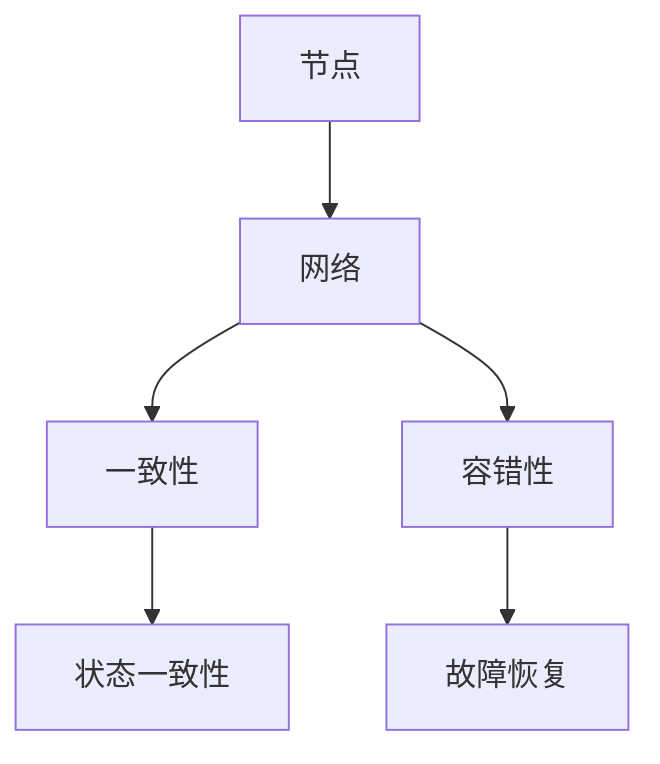

                 

### 文章标题

《大模型软件的分布式系统设计》

关键词：大模型软件，分布式系统，分布式计算，分布式存储，一致性算法，选举算法，分布式文件系统，分布式数据库

摘要：本文旨在探讨大模型软件在分布式系统设计中的关键技术和挑战。我们将从分布式系统的概述、算法与协议、分布式存储系统等方面进行深入分析，并结合实际案例，阐述如何设计高效、可靠的大模型软件分布式系统。通过本文，读者将了解到分布式系统在大模型软件中的应用，以及如何优化系统的性能、安全性和可扩展性。

----------------------------------------------------------------

### 文章正文

#### 第1章：分布式系统概述

分布式系统是一种通过网络连接的计算机节点组成的系统，这些节点协同工作以完成计算任务。分布式系统的核心目标是提高系统的可用性、可靠性和扩展性。在大模型软件中，分布式系统设计具有重要意义，因为它能够充分利用计算资源和存储资源，提高数据处理和模型训练的效率。

#### 核心概念与联系

分布式系统的主要概念包括：

- **节点**：网络中的计算机，负责执行计算任务。
- **网络**：连接节点的通信设施，实现节点间的数据传输。
- **一致性**：分布式系统中所有节点的状态一致。
- **容错性**：系统能够在部分节点失败时仍保持正常运行。

分布式系统的概念架构如下所示：

#### 第2章：分布式算法与协议

分布式算法和协议是分布式系统的核心，它们确保了系统的正确性和高效性。以下是几个重要的分布式算法和协议：

##### 2.1 一致性算法

一致性算法是分布式系统中确保节点状态一致的算法。一致性算法可以分为强一致性算法和弱一致性算法。

###### 2.1.1 脏读与一致性问题

脏读问题是指一个事务读取了另一个未提交事务的数据，导致数据不一致。一致性问题的关键是确保在分布式系统中避免脏读。

###### 2.1.2 强一致性算法

强一致性算法保证分布式系统中所有节点在同一时刻看到相同的数据。常见的强一致性算法包括两阶段提交（2PC）和三阶段提交（3PC）。

###### 2.1.3 弱一致性算法

弱一致性算法允许分布式系统中的节点在不同时刻看到不同的数据，但最终会达到一致性。常见的弱一致性算法包括最终一致性算法。

##### 2.2 选举算法

选举算法用于在分布式系统中选择主节点。选举算法必须保证选举过程的正确性和高效性。常见的选举算法包括脐带选举算法和脏选举算法。

###### 2.2.1 主节点选举

主节点是分布式系统中的核心节点，负责协调其他节点的操作。选举算法必须确保主节点的可靠性和高效性。

###### 2.2.2 脐带选举算法

脐带选举算法是一种基于心跳信号的选举算法，通过节点间的通信来选择主节点。该算法的优点是简单易实现，但缺点是容易受到网络延迟和分区的影响。

###### 2.2.3 脏选举问题

脏选举问题是指选举过程中出现了不正确的选举结果。解决脏选举问题的关键是确保选举算法的健壮性和可靠性。

##### 2.3 分布式锁与事务

分布式锁和事务是分布式系统中实现并发控制和数据一致性的重要机制。常见的分布式锁算法包括基于版本控制的锁算法和基于时间戳的锁算法。

#### 第3章：分布式存储系统

分布式存储系统是分布式系统的重要组成部分，它负责存储和检索数据。分布式存储系统具有高可用性、高性能和高可扩展性等特点。

##### 3.1 分布式文件系统

分布式文件系统是分布式存储系统的一种形式，它通过将数据分散存储在多个节点上来提高系统的可用性和性能。HDFS（Hadoop分布式文件系统）是一种典型的分布式文件系统。

###### 3.1.1 HDFS架构

HDFS由两部分组成：NameNode和DataNode。NameNode负责管理文件的元数据，DataNode负责存储数据。

###### 3.1.2 HDFS数据复制策略

HDFS采用数据复制策略来提高数据的可靠性和可用性。默认情况下，HDFS会将数据复制到三个不同的节点上。

###### 3.1.3 HDFS故障处理

HDFS在处理故障时，会根据数据复制策略自动恢复数据。例如，如果某个DataNode故障，HDFS会从其他副本中恢复数据。

##### 3.2 分布式数据库

分布式数据库是将数据分散存储在多个节点上的数据库系统。分布式数据库具有高可用性、高性能和高可扩展性等特点。

###### 3.2.1 分布式数据库架构

分布式数据库由多个节点组成，每个节点负责存储一部分数据。分布式数据库通常采用主从复制和分片技术来提高系统的性能和可用性。

###### 3.2.2 分布式事务管理

分布式事务管理是分布式数据库的重要功能，它确保分布式系统中的多个操作能够一致地提交或回滚。常见的分布式事务管理算法包括两阶段提交（2PC）和三阶段提交（3PC）。

###### 3.2.3 分布式数据库性能优化

分布式数据库性能优化包括数据分片策略、数据缓存策略和网络优化等。通过合理的优化策略，可以提高分布式数据库的性能和响应速度。

#### 第4章：大模型软件特点与分布式设计需求

大模型软件具有以下特点：

- **计算密集型**：大模型软件通常需要大量的计算资源来训练和推理模型。
- **数据密集型**：大模型软件需要处理大量的数据，包括训练数据和推理数据。
- **高可扩展性**：大模型软件需要能够根据需求动态调整计算资源和存储资源。

因此，分布式系统设计在大模型软件中具有重要意义，它能够提高系统的性能、可靠性和可扩展性。

#### 第5章：大模型分布式计算框架

大模型分布式计算框架是将大模型软件部署在分布式系统中的关键技术。常见的分布式计算框架包括TensorFlow、PyTorch等。

##### 5.1 分布式计算框架概述

分布式计算框架提供了将大模型软件部署在分布式系统中的工具和接口。分布式计算框架的主要功能包括：

- **任务调度**：将计算任务分配到不同的节点上。
- **数据传输**：在节点间传输数据和模型参数。
- **容错性**：在节点故障时自动恢复计算任务。

##### 5.2 分布式训练与推理

分布式训练和推理是分布式计算框架的核心功能。分布式训练和推理可以提高大模型软件的性能和效率。

###### 5.2.1 分布式训练策略

分布式训练策略包括数据并行和模型并行。数据并行将数据分成多个部分，同时在不同的节点上训练模型。模型并行将模型分成多个部分，同时在不同的节点上训练模型。

###### 5.2.2 分布式推理策略

分布式推理策略包括模型并行和推理并行。模型并行将模型分成多个部分，同时在不同的节点上进行推理。推理并行将推理任务分配到不同的节点上。

###### 5.2.3 分布式训练与推理性能优化

分布式训练和推理性能优化包括数据缓存策略、网络优化和节点调度等。通过合理的优化策略，可以提高分布式训练和推理的性能和效率。

#### 第6章：大模型分布式存储管理

大模型分布式存储管理是分布式系统设计中的重要环节。它负责存储和管理大模型软件中的数据和模型。

##### 6.1 分布式存储管理概述

分布式存储管理包括数据存储、数据传输和数据一致性等方面。分布式存储管理的关键技术包括：

- **数据分区策略**：根据数据的特点和需求，将数据划分为多个分区。
- **数据一致性**：确保分布式系统中各个节点的数据一致。
- **数据可靠性**：确保数据在存储和传输过程中的可靠性。

##### 6.2 分布式文件系统优化

分布式文件系统优化包括数据复制策略、数据缓存策略和存储资源调度等方面。通过合理的优化策略，可以提高分布式文件系统的性能和响应速度。

##### 6.2.1 HDFS性能优化

HDFS性能优化包括数据缓存策略、数据复制策略和存储资源调度等方面。通过合理的优化策略，可以提高HDFS的性能和响应速度。

##### 6.2.2 集群文件系统

集群文件系统是将多个文件系统集成在一起，形成一个统一的文件系统。集群文件系统可以提高系统的可用性和可扩展性。

#### 第7章：大模型软件分布式系统安全性

大模型软件分布式系统安全性是系统设计中的重要方面。它负责保护系统免受各种安全威胁，包括数据泄露、故障注入和拒绝服务攻击等。

##### 7.1 分布式系统安全威胁

分布式系统安全威胁包括：

- **数据泄露与篡改**：恶意攻击者获取和篡改系统的敏感数据。
- **故障注入与拒绝服务攻击**：恶意攻击者故意注入故障或攻击系统，导致系统瘫痪。

##### 7.2 安全性解决方案

安全性解决方案包括：

- **认证与授权**：确保只有授权用户才能访问系统。
- **数据加密**：对敏感数据进行加密，防止数据泄露和篡改。
- **网络隔离与监控**：在网络中设置隔离和监控机制，及时发现和应对安全威胁。

#### 第8章：大模型软件分布式系统设计案例

在本章中，我们将通过一个实际案例，展示如何设计大模型软件的分布式系统。

##### 8.1 案例背景

案例背景是一个大规模的自然语言处理项目，需要处理海量数据并进行模型训练和推理。

##### 8.2 系统设计目标

系统设计目标包括：

- **高性能**：充分利用分布式系统资源，提高数据处理和模型训练的效率。
- **高可用性**：确保系统在节点故障时仍能正常运行。
- **高可扩展性**：能够根据需求动态调整计算资源和存储资源。

##### 8.3 系统架构设计

系统架构设计包括计算层、存储层和网络层。

###### 8.3.1 计算层设计

计算层设计采用分布式计算框架，将计算任务分配到不同的节点上，实现高性能计算。

###### 8.3.2 存储层设计

存储层设计采用分布式文件系统，将数据分散存储在多个节点上，提高数据的可靠性和可用性。

###### 8.3.3 网络层设计

网络层设计采用高可用性网络架构，确保节点间的通信稳定可靠。

##### 8.4 系统实现与优化

系统实现与优化包括：

- **分布式训练实现**：通过分布式计算框架实现大规模模型训练。
- **分布式存储实现**：通过分布式文件系统实现大规模数据存储。
- **系统性能优化**：通过优化数据缓存策略、网络优化和存储资源调度，提高系统性能和响应速度。

#### 附录：相关工具与技术

附录部分将介绍一些相关的工具和技术，包括：

- **分布式文件系统**：HDFS、GlusterFS等。
- **分布式数据库**：Cassandra、MongoDB等。
- **分布式计算框架**：TensorFlow、PyTorch等。

通过本文，读者将了解到大模型软件分布式系统设计的关键技术和挑战，以及如何优化系统的性能、安全性和可扩展性。

### 作者信息

作者：AI天才研究院/AI Genius Institute & 禅与计算机程序设计艺术 /Zen And The Art of Computer Programming### 分布式系统概述

分布式系统是一种由多个计算机节点通过网络连接组成的系统，这些节点协同工作以完成复杂的计算任务。分布式系统的核心目标是提高系统的可用性、可靠性和扩展性。在大模型软件中，分布式系统设计尤为重要，因为它能够充分利用计算资源和存储资源，提高数据处理和模型训练的效率。

#### 核心概念与联系

分布式系统的核心概念包括：

- **节点**：网络中的计算机，负责执行计算任务。
- **网络**：连接节点的通信设施，实现节点间的数据传输。
- **一致性**：分布式系统中所有节点的状态一致。
- **容错性**：系统能够在部分节点失败时仍保持正常运行。

这些概念之间相互关联，共同构成了分布式系统的核心架构。节点是分布式系统的基本组成部分，它们通过网络进行通信，共享数据和资源。一致性是分布式系统的关键特性，它确保了系统中所有节点的状态一致，避免了数据冲突和错误。容错性则使系统能够在部分节点失败时继续正常运行，提高了系统的可靠性。

#### 分布式系统的架构

分布式系统通常由以下几部分组成：

1. **计算节点**：负责执行计算任务的计算机节点，可以是物理机或虚拟机。
2. **存储节点**：负责存储数据和模型的计算机节点。
3. **网络**：连接计算节点和存储节点的通信设施，实现节点间的数据传输。
4. **协调节点**：负责协调各个节点的操作，确保系统的一致性和容错性。

分布式系统的架构可以分为以下几种类型：

- **主从架构**：主节点负责协调其他节点的操作，从节点负责执行具体的计算任务。
- **对等架构**：所有节点具有相同的地位，互相协调，共同完成计算任务。
- **混合架构**：结合主从架构和对等架构，根据任务的特点和需求进行灵活部署。

#### 分布式系统的挑战与解决方案

分布式系统虽然具有许多优点，但同时也面临一些挑战。以下是一些常见的挑战和相应的解决方案：

1. **数据一致性**：在分布式系统中，数据的一致性是一个重要问题。为了解决数据一致性，可以采用以下几种策略：
   - **强一致性**：确保分布式系统中所有节点的状态一致，但可能会导致性能下降。
   - **最终一致性**：允许分布式系统中的节点在不同时刻看到不同的数据，但最终会达到一致性。
   - **一致性算法**：采用一致性算法（如Paxos、Raft等）来保证分布式系统的一致性。

2. **容错性**：在分布式系统中，节点的故障是不可避免的。为了提高系统的容错性，可以采用以下几种策略：
   - **副本机制**：将数据或服务在多个节点上复制，确保在部分节点故障时仍能正常运行。
   - **故障检测与恢复**：定期检查节点的状态，一旦发现故障，立即采取措施进行恢复。
   - **负载均衡**：合理分配计算任务到不同的节点上，避免某个节点过载。

3. **网络延迟与带宽**：在分布式系统中，节点间的网络延迟和带宽可能会影响系统的性能。为了解决网络延迟和带宽问题，可以采用以下几种策略：
   - **数据缓存**：在节点间设置缓存，减少数据传输的频率和延迟。
   - **数据压缩**：对数据进行压缩，减少数据传输的大小。
   - **负载均衡**：合理分配计算任务到不同的节点上，减少网络负载。

通过以上的挑战和解决方案，我们可以更好地理解分布式系统的设计原则和关键技术，为后续章节的深入学习打下基础。

#### 核心算法原理讲解

分布式系统中的核心算法和协议是确保系统正确性和高效性的关键。以下将详细讲解一些常见的核心算法原理，包括一致性算法、选举算法和分布式锁。

##### 一致性算法

一致性算法是分布式系统中确保节点状态一致的算法。一致性问题是分布式系统中的核心问题之一，因为如果多个节点对同一份数据进行读写操作，可能会出现数据不一致的情况。一致性算法可以分为强一致性算法和弱一致性算法。

###### 脏读与一致性问题

脏读是指一个事务读取了另一个未提交事务的数据，导致数据不一致。例如，假设有两个事务T1和T2，T1读取了数据A的值为1，随后T2将A的值修改为2，但尚未提交。如果T1再次读取A的值，可能会读取到2，从而导致数据不一致。

为了避免脏读问题，分布式系统需要确保在读取数据时，只有已经提交的事务才能读取到其他事务的修改结果。一致性算法通过不同的策略来实现这一目标。

###### 强一致性算法

强一致性算法保证分布式系统中所有节点在同一时刻看到相同的数据。强一致性算法的主要目标是确保在任何情况下，所有节点的数据状态都是一致的。

常见的强一致性算法包括：

- **两阶段提交（2PC）**：2PC是一种分布式事务管理协议，分为准备阶段和提交阶段。在准备阶段，协调者（Coordinator）向参与者（Participant）发送询问，参与者返回准备结果。如果所有参与者都准备好了，协调者向参与者发送提交命令，参与者执行事务提交。如果任何参与者未准备好，协调者向参与者发送回滚命令，参与者执行事务回滚。

- **三阶段提交（3PC）**：3PC是对2PC的改进，增加了预提交阶段。在预提交阶段，协调者向参与者发送预提交命令，参与者返回预提交结果。如果所有参与者都预提交成功，协调者向参与者发送提交命令，参与者执行事务提交。否则，协调者向参与者发送回滚命令，参与者执行事务回滚。

强一致性算法的优点是确保了数据的一致性，但缺点是可能会导致性能下降，因为需要等待所有节点的响应。

###### 弱一致性算法

弱一致性算法允许分布式系统中的节点在不同时刻看到不同的数据，但最终会达到一致性。弱一致性算法主要分为以下几类：

- **最终一致性**：最终一致性算法允许节点在不同时刻看到不同的数据，但最终会通过一些机制（如事件传播、时间戳等）达到一致性。常见的最终一致性算法包括Gossip协议和事件溯源。

- **部

