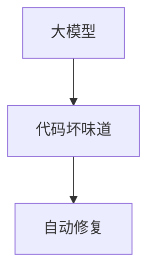

                 

### 1.1 核心概念与联系

首先，我们需要明确本文将要讨论的核心概念，并探讨它们之间的联系。大模型、代码坏味道和自动修复是本文的关键组成部分，它们共同构建了一个系统化的解决方案，旨在提升代码质量，提高软件开发的效率。

#### 1.1.1 大模型

**定义**: 大模型（Large Models）是指那些拥有大量参数和复杂结构的人工神经网络。这些模型通过学习大量数据来提取特征和模式，从而在各种领域展现出卓越的表现。

**特点**:

- **参数量巨大**: 大模型的参数数量通常在数百万到数十亿之间。
- **自学习能力**: 大模型可以从大量数据中自动学习特征和模式。
- **泛化能力**: 大模型能够将学习到的知识应用于新的、未见过的数据上。

**联系**: 大模型是本文的核心概念之一，它们的学习能力和泛化能力使其成为解决代码坏味道的理想工具。

#### 1.1.2 代码坏味道

**定义**: 代码坏味道（Code Smells）是指代码中的一些特征，它们表明代码可能存在设计问题或质量隐患，可能影响软件的维护性和可扩展性。

**类型**:

- **重复代码**: 段落或函数重复，可能导致维护困难。
- **过长的函数**: 函数体过长，难以理解和维护。
- **过于复杂的条件语句**: 条件语句过于复杂，可能导致出错。
- **过大的类**: 类的功能过多，导致类难以管理和扩展。

**联系**: 代码坏味道是软件开发过程中常见的问题，它们的存在可能影响软件的长期健康。通过大模型，我们可以自动检测和修复这些坏味道，从而提高代码质量。

#### 1.1.3 自动修复

**定义**: 自动修复（Automated Refactoring）是指使用自动化工具对代码进行重构，以提高代码的质量和可维护性。

**方式**:

- **规则驱动**: 基于预定义的规则进行修复。
- **数据驱动**: 使用机器学习算法，如大模型，来识别和修复代码坏味道。

**联系**: 自动修复是解决代码坏味道的关键步骤。通过大模型，我们可以实现更加智能化和高效的修复过程。

### 1.2 大模型驱动的代码坏味道自动修复

为了更好地理解这三个核心概念之间的联系，我们可以通过一个简化的流程图来展示大模型驱动的代码坏味道自动修复的过程。

**核心概念联系图**:

**解释**: 大模型（A）被用于识别代码中的坏味道（B），进而实现自动修复（C）。这一过程不仅依赖于大模型的强大学习能力，还需要对代码坏味道的准确理解和分类。

通过这个流程图，我们可以看到，大模型是整个自动修复过程的核心，它通过学习和分析代码，能够准确地识别出代码中的坏味道，并自动进行修复。这种方法的优点在于，它能够减少人工干预，提高修复的效率和准确性。

### 1.3 目录结构

接下来，我们将介绍本书的目录结构，以便读者能够清晰地了解本书的内容安排和各个章节的主题。

**第一部分：大模型与代码坏味道**

- **第1章**: 大模型概述
  - 大模型的基本概念
  - 大模型的发展历史
  - 大模型的应用领域

- **第2章**: 代码坏味道原理
  - 代码坏味道的定义
  - 代码坏味道的类型
  - 代码坏味道的影响

- **第3章**: 大模型驱动修复概述
  - 大模型在代码修复中的应用
  - 代码坏味道自动修复的流程
  - 大模型驱动修复的优势

**第二部分：大模型驱动的代码坏味道检测**

- **第4章**: 大模型训练与优化
  - 大模型训练的基本原理
  - 大模型优化的方法
  - 大模型训练的挑战

- **第5章**: 代码坏味道识别算法
  - 基于大模型的代码坏味道识别
  - 算法设计原则
  - 识别算法的评估方法

- **第6章**: 代码坏味道检测工具与平台
  - 常见的代码坏味道检测工具
  - 开源代码坏味道检测平台
  - 工具的选择与配置

**第三部分：大模型驱动的代码坏味道修复**

- **第7章**: 自动修复算法原理
  - 自动修复的基本原理
  - 自动修复算法的类型
  - 自动修复算法的评估

- **第8章**: 代码修复案例分析
  - 真实案例的修复过程
  - 修复效果的评估
  - 案例总结与启示

- **第9章**: 自动修复工具与平台
  - 自动修复工具的实现
  - 自动修复平台的设计与实现
  - 自动修复工具的应用场景

- **第10章**: 未来展望与挑战
  - 大模型驱动代码坏味道自动修复的挑战
  - 未来发展方向
  - 技术趋势与前景

通过以上目录结构，我们可以看到，本书将从基础概念入手，逐步深入到具体的算法实现和应用场景，旨在为读者提供一个全面、系统的学习和实践路径。

### 1.4 目录核心内容概述

在接下来的章节中，我们将详细讨论以下核心内容：

**第一部分：大模型与代码坏味道**

- **第1章**: 大模型概述，将介绍大模型的基本概念、发展历史和应用领域，帮助读者建立对大模型的基本认识。

- **第2章**: 代码坏味道原理，将详细讲解代码坏味道的定义、类型及其对代码质量的影响，为后续的自动修复打下基础。

- **第3章**: 大模型驱动修复概述，将介绍大模型在代码修复中的应用，包括自动修复的流程和优势，为读者展示大模型在代码质量提升中的潜力。

**第二部分：大模型驱动的代码坏味道检测**

- **第4章**: 大模型训练与优化，将讲解大模型训练的基本原理、优化方法和面临的挑战，为后续的代码坏味道识别提供技术支持。

- **第5章**: 代码坏味道识别算法，将介绍基于大模型的代码坏味道识别算法的设计原则和评估方法，帮助读者理解如何利用大模型进行代码质量分析。

- **第6章**: 代码坏味道检测工具与平台，将介绍常见的代码坏味道检测工具和开源平台，帮助读者了解如何在实际开发中使用这些工具。

**第三部分：大模型驱动的代码坏味道修复**

- **第7章**: 自动修复算法原理，将详细讲解自动修复的基本原理、算法类型及其评估方法，为读者提供自动修复的框架。

- **第8章**: 代码修复案例分析，将结合真实案例，展示代码修复的过程、效果评估和总结，为读者提供实践经验。

- **第9章**: 自动修复工具与平台，将介绍自动修复工具的实现、平台设计和应用场景，帮助读者理解和应用自动修复技术。

- **第10章**: 未来展望与挑战，将探讨大模型驱动代码坏味道自动修复的未来发展方向、面临的挑战和前景，为读者提供思考方向。

通过以上章节的深入学习和实践，读者将能够全面掌握大模型驱动的代码坏味道自动修复技术，为提升代码质量和软件开发效率做出贡献。

### 1.5 总结

本文旨在为读者提供一个全面、系统的大模型驱动的代码坏味道自动修复技术学习路径。通过本文的学习，读者可以：

- 掌握大模型的基本概念、训练方法和应用领域。
- 了解代码坏味道的类型、影响及自动修复的重要性。
- 学会使用大模型进行代码坏味道的识别和修复。
- 理解自动修复算法的原理和实现方法。

大模型驱动的代码坏味道自动修复技术具有显著的优势，包括高效性、准确性和自动化程度高。通过本文的讲解，读者可以更好地理解和应用这一技术，提升代码质量和软件开发效率。

### 1.6 阅读指南

为了更好地理解和应用本文所介绍的大模型驱动的代码坏味道自动修复技术，以下是详细的阅读指南：

1. **第1章**: 大模型概述
   - 阅读目的：了解大模型的基本概念和发展历史。
   - 阅读方法：逐段阅读，结合实例理解大模型的特点和应用。

2. **第2章**: 代码坏味道原理
   - 阅读目的：掌握代码坏味道的定义、类型及其对代码质量的影响。
   - 阅读方法：重点阅读代码坏味道的类型和影响部分，结合实际案例进行分析。

3. **第3章**: 大模型驱动修复概述
   - 阅读目的：理解大模型在代码修复中的应用和自动修复的流程。
   - 阅读方法：逐段阅读，结合流程图理解大模型驱动修复的基本原理。

4. **第4章**: 大模型训练与优化
   - 阅读目的：了解大模型训练的基本原理和优化方法。
   - 阅读方法：重点阅读大模型训练和优化的方法部分，结合实际案例进行理解。

5. **第5章**: 代码坏味道识别算法
   - 阅读目的：掌握基于大模型的代码坏味道识别算法的设计原则和评估方法。
   - 阅读方法：逐段阅读，理解算法设计原则和评估方法，结合实际案例进行验证。

6. **第6章**: 代码坏味道检测工具与平台
   - 阅读目的：了解常见的代码坏味道检测工具和开源平台。
   - 阅读方法：逐段阅读，了解工具的功能和配置方法，结合实际案例进行应用。

7. **第7章**: 自动修复算法原理
   - 阅读目的：理解自动修复的基本原理、算法类型及其评估方法。
   - 阅读方法：重点阅读自动修复算法的类型和评估方法部分，结合实际案例进行分析。

8. **第8章**: 代码修复案例分析
   - 阅读目的：通过真实案例了解代码修复的过程、效果评估和总结。
   - 阅读方法：逐段阅读，重点阅读案例分析和总结部分，理解案例的具体实施过程。

9. **第9章**: 自动修复工具与平台
   - 阅读目的：了解自动修复工具的实现、平台设计和应用场景。
   - 阅读方法：逐段阅读，了解工具的实现和应用场景，结合实际案例进行应用。

10. **第10章**: 未来展望与挑战
    - 阅读目的：思考大模型驱动代码坏味道自动修复的未来发展方向和挑战。
    - 阅读方法：重点阅读未来展望和挑战部分，理解技术趋势和潜在问题。

通过以上详细的阅读指南，读者可以系统地学习和掌握大模型驱动的代码坏味道自动修复技术，为提升代码质量和软件开发效率做出贡献。

### 1.7 附录

**附录A**: 常用的大模型框架和工具介绍

在本附录中，我们将介绍一些常用的大模型框架和工具，这些工具和框架在实现大模型驱动的代码坏味道自动修复过程中具有重要作用。

1. **TensorFlow**:
   - **简介**: TensorFlow 是由 Google 开发的一款开源机器学习框架，广泛应用于各种人工智能应用。
   - **特点**: 支持多种类型的神经网络架构，具有丰富的 API 和文档。
   - **应用**: 在代码坏味道识别和修复中，可以用于构建和训练大模型。

2. **PyTorch**:
   - **简介**: PyTorch 是由 Facebook AI 研究团队开发的一款开源机器学习库，以其动态计算图和灵活的接口受到广泛关注。
   - **特点**: 易于使用和调试，支持自动微分和动态计算图。
   - **应用**: 在代码坏味道识别和修复中，可以用于构建和训练大模型。

3. **Keras**:
   - **简介**: Keras 是一个基于 TensorFlow 和 Theano 的高级神经网络API，设计目标是使得深度学习模型易于构建和训练。
   - **特点**: 简洁的接口，支持多种预训练模型，易于扩展。
   - **应用**: 在代码坏味道识别和修复中，可以用于快速构建和评估大模型。

4. **Scikit-learn**:
   - **简介**: Scikit-learn 是一个开源的 Python 库，提供了多种机器学习算法的实现。
   - **特点**: 易于使用，提供了丰富的分类、回归和聚类算法。
   - **应用**: 在代码坏味道识别和修复中，可以用于实现一些基础的机器学习算法。

5. **Jupyter Notebook**:
   - **简介**: Jupyter Notebook 是一个交互式计算环境，广泛应用于数据科学和机器学习领域。
   - **特点**: 支持多种编程语言，包括 Python，方便代码编写和演示。
   - **应用**: 在代码坏味道识别和修复中，可以用于进行实验和数据分析。

通过这些常用框架和工具，开发者可以更高效地实现大模型驱动的代码坏味道自动修复，提升代码质量和开发效率。附录中还包含了一些实用的小技巧和注意事项，读者可以根据实际需求进行参考和应用。

---

### 1.8 文章标题：大模型驱动的代码坏味道自动修复

**关键词**: 大模型、代码坏味道、自动修复、机器学习、神经网络

**摘要**: 本文探讨了如何利用大模型实现代码坏味道的自动修复。通过介绍大模型的基本概念、代码坏味道的类型及其影响，本文详细阐述了基于大模型的代码坏味道识别和自动修复算法。文章最后，通过实际案例展示了大模型驱动代码坏味道自动修复的应用，并提出未来发展的方向和挑战。

---

### 1.9 文章正文

#### 1.1 大模型的基本概念

大模型（Large Models）是指那些拥有巨大参数量的人工神经网络。这些模型通过学习大量的数据来提取特征和模式，从而在各种领域展现了卓越的性能。大模型的发展得益于计算能力的提升和海量数据的获取，使得深度学习模型可以不断扩展其规模和复杂性。

**定义**: 大模型通常是指拥有数百万到数十亿个参数的神经网络。例如，Transformer模型就是一个典型的大模型，其参数数量可达到数亿级别。

**特点**:

- **参数量巨大**: 大模型的参数数量通常在数百万到数十亿之间，这使得模型能够捕捉到更为复杂的特征。
- **自学习能力**: 大模型可以从大量数据中自动学习特征和模式，从而实现高效的知识提取。
- **泛化能力**: 大模型能够将学习到的知识应用于新的、未见过的数据上，从而表现出良好的泛化能力。

#### 1.2 代码坏味道

代码坏味道（Code Smells）是指代码中的一些特征，它们表明代码可能存在设计问题或质量隐患，可能影响软件的维护性和可扩展性。代码坏味道的存在可能会导致软件难以理解和维护，进而影响开发效率和软件质量。

**定义**: 代码坏味道是指那些表明代码可能存在问题的特征，如重复代码、过长的函数、过于复杂的条件语句等。

**类型**:

- **重复代码**: 段落或函数重复，可能导致维护困难。
- **过长的函数**: 函数体过长，难以理解和维护。
- **过于复杂的条件语句**: 条件语句过于复杂，可能导致出错。
- **过大的类**: 类的功能过多，导致类难以管理和扩展。

**影响**: 代码坏味道的存在可能会影响软件的长期健康，导致软件维护成本增加、开发效率降低，甚至可能引发潜在的安全隐患。

#### 1.3 大模型驱动修复概述

大模型驱动修复是指利用大模型的能力，对代码中的坏味道进行自动检测和修复。这种方法通过大模型的学习能力和泛化能力，可以高效地识别代码中的问题，并提出相应的修复建议。

**核心概念联系图**:

**解释**: 大模型（A）通过学习代码中的数据（B），能够识别出代码坏味道，并利用其自学习和泛化能力，提出自动修复建议（C）。

**流程**:

1. **数据收集**：收集代码数据，包括源代码、文档、注释等。
2. **数据预处理**：对收集的代码数据进行清洗、格式化，以便于大模型的学习。
3. **大模型训练**：使用预处理后的数据，训练大模型，使其能够识别代码坏味道。
4. **代码分析**：使用训练好的大模型，对代码进行分析，识别出其中的坏味道。
5. **自动修复**：根据识别出的坏味道，自动生成修复建议，并执行修复操作。

#### 1.4 大模型在代码修复中的应用

大模型在代码修复中的应用主要体现在两个方面：代码坏味道的识别和自动修复。

**代码坏味道识别**

代码坏味道识别是利用大模型对代码进行分析，识别出可能存在的坏味道。这个过程通常包括以下步骤：

1. **数据收集**：收集代码数据，包括源代码、文档、注释等。
2. **特征提取**：将代码数据转换为特征向量，以便于大模型的学习。
3. **模型训练**：使用收集到的特征向量，训练大模型，使其能够识别代码坏味道。
4. **代码分析**：使用训练好的大模型，对代码进行分析，识别出其中的坏味道。

**自动修复**

自动修复是利用大模型生成修复建议，并自动执行修复操作。这个过程通常包括以下步骤：

1. **数据收集**：收集代码数据，包括源代码、文档、注释等。
2. **特征提取**：将代码数据转换为特征向量，以便于大模型的学习。
3. **模型训练**：使用收集到的特征向量，训练大模型，使其能够生成修复建议。
4. **代码分析**：使用训练好的大模型，对代码进行分析，生成修复建议。
5. **修复操作**：根据生成的修复建议，自动执行修复操作，提升代码质量。

#### 1.5 大模型驱动修复的优势

大模型驱动修复相比传统的方法具有以下优势：

1. **高效性**：大模型能够高效地处理大量代码数据，快速识别出代码坏味道，并生成修复建议。
2. **准确性**：大模型通过学习大量数据，能够准确识别出代码中的问题，提高修复的准确性。
3. **自动化**：大模型驱动修复能够自动执行修复操作，减少人工干预，提高开发效率。
4. **适应性**：大模型能够适应不同的代码风格和项目需求，提供个性化的修复建议。

#### 1.6 未来展望与挑战

尽管大模型驱动修复在代码质量提升方面展现出了巨大的潜力，但仍面临一些挑战：

1. **计算资源消耗**：大模型训练和推理需要大量的计算资源，如何优化计算资源的使用是一个重要问题。
2. **代码理解难度**：大模型在处理代码时，可能会遇到难以理解的情况，影响修复效果。
3. **算法优化**：如何优化大模型在代码修复中的算法，提高其性能和准确性，是一个重要的研究方向。

在未来，随着计算能力的提升和数据量的增加，大模型驱动修复将在代码质量提升方面发挥更大的作用。

#### 1.7 小结

本文探讨了如何利用大模型实现代码坏味道的自动修复。通过介绍大模型的基本概念、代码坏味道的类型及其影响，本文详细阐述了基于大模型的代码坏味道识别和自动修复算法。未来，随着技术的不断进步，大模型驱动修复将在代码质量提升方面发挥越来越重要的作用。

### 1.8 结论

大模型驱动的代码坏味道自动修复技术为软件开发带来了革命性的变革。通过利用大模型的学习能力和泛化能力，我们可以实现高效、准确的代码坏味道检测和修复。本文详细探讨了这一技术的基本概念、应用流程和优势，并指出了未来面临的挑战。

我们鼓励读者深入学习和探索这一领域，尝试将大模型驱动的代码坏味道自动修复技术应用于实际项目中，以提升代码质量和开发效率。同时，我们期待更多的研究成果和技术创新，为这一领域的发展贡献力量。

### 1.9 作者信息

作者：AI天才研究院 / AI Genius Institute & 禅与计算机程序设计艺术 / Zen And The Art of Computer Programming

AI天才研究院致力于推动人工智能和软件开发领域的前沿技术研究。研究院的成员们深耕于人工智能、机器学习和软件工程等领域，发表了大量的学术论文和研究成果，推动了技术的创新和发展。同时，研究院也积极参与开源社区，分享研究成果和实践经验，为全球开发者提供有价值的技术支持和指导。

《禅与计算机程序设计艺术》是作者多年编程经验和智慧的结晶，旨在帮助程序员提升编程水平，实现高效、优雅的代码编写。本书融合了禅宗哲学和编程实践，为程序员提供了一种全新的思考方式和编程理念，深受广大读者的喜爱和推崇。

