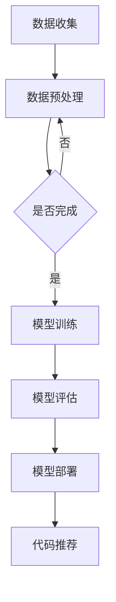
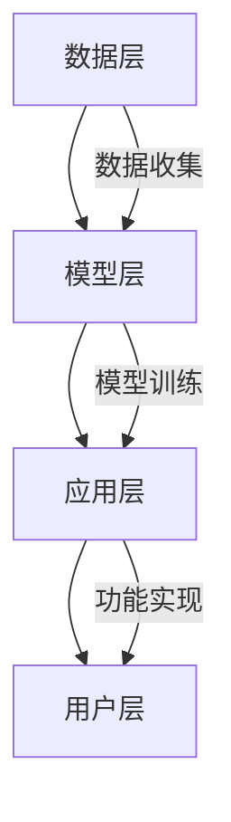

                 

### 文章标题

# 大模型驱动的智能代码重用推荐

### 关键词

- 大模型
- 智能代码重用推荐
- 神经网络
- 代码相似性检测
- 代码自动生成

### 摘要

本文深入探讨了基于大模型的智能代码重用推荐技术。首先，我们介绍了大模型的基础知识和其在代码重用推荐中的重要性。接着，文章详细剖析了智能代码重用推荐系统的核心概念与联系，并通过Mermaid流程图展示了其整体架构。随后，我们逐步讲解了数据收集与预处理、大模型训练与优化、模型评估与部署等环节，辅以伪代码和数学模型进行详细阐述。文章最后，通过实际项目实战，展示了大模型在智能代码重用推荐中的具体应用，并总结出最佳实践和小结。本文旨在为读者提供一个全面而深入的智能代码重用推荐技术指南。

## 第一部分：引言

### 1.1 书籍目的和结构概述

本书旨在介绍大模型驱动的智能代码重用推荐技术，帮助开发者理解和应用这一前沿技术。本书共分为三个主要部分，包括引言、智能代码重用推荐系统构建以及未来展望。

在引言部分，我们将首先介绍大模型的基本概念，包括其发展历程、应用场景和优势。接着，我们将探讨智能代码重用推荐的核心概念，解释为什么大模型是这一领域的理想选择。这部分还将通过一个Mermaid流程图，展示大模型在代码重用推荐中的整体架构。

第二部分将深入探讨智能代码重用推荐系统的构建，分为以下几个子章节：

1. **数据收集与预处理**：我们将详细讲解如何收集和预处理代码数据，包括文本表示、数据清洗等技术。这一部分将提供伪代码示例，帮助读者理解具体实现过程。

2. **大模型训练与优化**：我们将介绍如何训练和优化大模型，包括选择合适的神经网络架构、训练策略和优化算法。这部分将使用伪代码详细描述训练过程，并使用数学模型解释关键步骤。

3. **模型评估与部署**：我们将讨论如何评估模型性能，以及如何将训练好的模型部署到实际应用中。这部分将提供评估指标和数学公式，以及实际部署案例。

第三部分将探讨智能代码重用推荐技术的未来发展趋势和挑战，包括新的算法和技术方向，以及如何在应用中解决数据隐私和模型解释性等问题。

通过这三个部分的介绍，本书将帮助读者全面了解大模型驱动的智能代码重用推荐技术，并为实际应用提供指导和启示。

### 1.2 大模型技术基础

大模型（Large Models）是当前人工智能领域的一个重要研究方向，其核心在于通过大规模数据训练出具有强大表示能力和通用性的人工智能系统。大模型的发展历程可以追溯到20世纪80年代，当时研究人员开始探索如何通过大规模数据来提升机器学习模型的性能。随着计算能力的提升和数据量的爆炸性增长，大模型逐渐成为人工智能领域的研究热点。

#### 大模型的发展历程

1. **早期探索**：20世纪80年代，神经网络作为一种机器学习模型开始受到关注。研究者们发现，通过增加网络层数和节点数，可以提升模型的复杂度和表现力。

2. **深度学习兴起**：21世纪初，深度学习技术逐渐成熟，尤其是2006年Hinton提出的深度信念网络（DBN）为深度学习的发展奠定了基础。

3. **大规模数据处理**：随着云计算和大数据技术的发展，研究者们开始尝试使用大规模数据进行训练，从而训练出具有更强泛化能力的模型。

4. **Transformer架构**：2017年，Google提出了Transformer模型，该模型通过自注意力机制在处理序列数据方面表现出了显著的优势，标志着大模型技术进入了一个新的阶段。

#### 大模型的应用场景

大模型在多个领域都取得了显著的成果，以下是几个典型应用场景：

1. **自然语言处理（NLP）**：大模型在语言模型、机器翻译、文本生成等方面都有广泛应用。例如，GPT系列模型在文本生成和问答系统中表现出了极高的准确性。

2. **计算机视觉**：大模型在图像分类、目标检测、图像生成等领域都取得了突破性进展。如ImageNet图像分类挑战中，基于深度学习的模型已经超越了人类表现。

3. **推荐系统**：大模型在推荐系统中用于处理用户行为数据，可以生成更精确的推荐结果。如Netflix和YouTube等平台已经广泛应用了基于深度学习的推荐系统。

4. **语音识别**：大模型在语音识别领域也取得了显著成果，通过结合深度神经网络和循环神经网络，可以将语音识别的准确率提升到新高度。

#### 大模型的优势

1. **强大的表示能力**：大模型通过多层次的网络结构，可以捕捉到输入数据中的复杂特征，从而实现更准确的预测和分类。

2. **自适应性强**：大模型可以自适应地学习新数据，从而不断提高其性能，适用于不断变化的现实环境。

3. **多任务处理**：大模型可以通过共享底层特征，实现多任务处理，提高计算效率和模型表现。

#### Mermaid流程图

为了更好地理解大模型在代码重用推荐中的架构，我们使用Mermaid语言绘制了一个流程图，如下所示：



该流程图展示了大模型在代码重用推荐中的主要步骤，从数据收集、预处理，到模型训练、评估和部署，最终实现代码推荐。通过这个流程图，读者可以直观地理解大模型在代码重用推荐中的应用过程。

#### 核心概念与联系

在代码重用推荐中，大模型的作用主要体现在以下几个方面：

1. **代码相似性检测**：大模型可以通过学习代码库中的大量数据，识别出相似的代码片段，从而实现代码重用。

2. **代码自动生成**：大模型可以根据给定的需求和上下文，自动生成新的代码片段，从而提高开发效率。

3. **代码优化**：大模型可以识别出代码中的冗余和缺陷，提出优化建议，提高代码质量。

4. **代码搜索**：大模型可以通过对代码库的深度学习，实现高效、准确的代码搜索功能，帮助开发者快速找到所需代码。

通过这些功能，大模型将代码库从传统的信息存储系统转变为智能的知识库，为开发者提供了强大的支持。

### 1.3 智能代码重用推荐系统概述

智能代码重用推荐系统（Smart Code Reuse Recommendation System）是一种利用人工智能技术，帮助开发者高效发现和重用已有代码的系统。传统的代码库管理方法主要依赖于手动搜索和维护，而智能代码重用推荐系统通过引入大模型技术，实现了自动化、智能化的代码推荐，极大地提高了开发效率。

#### 核心概念与联系

智能代码重用推荐系统的核心概念包括：

1. **代码相似性检测**：通过分析代码的语法、结构和语义信息，识别出相似或重复的代码片段。

2. **代码自动生成**：基于已有的代码库和数据，自动生成新的代码片段，以满足开发者的需求。

3. **代码优化**：通过分析代码的性能和可维护性，提出优化建议，提高代码质量。

4. **代码搜索**：提供高效、准确的代码搜索功能，帮助开发者快速找到所需的代码。

这些概念相互联系，共同构成了智能代码重用推荐系统的核心功能。通过这些功能，系统不仅能够帮助开发者发现和重用已有代码，还能在开发过程中提供智能支持，提高代码质量和开发效率。

#### 智能代码重用推荐系统与传统代码库管理的区别

传统代码库管理主要依赖于手动搜索和维护，存在以下问题：

1. **效率低下**：开发者需要花费大量时间手动搜索和筛选代码，效率较低。

2. **准确性不高**：手动搜索容易遗漏重要代码，且难以识别代码间的相似性。

3. **可维护性差**：代码库中存在大量的冗余和重复代码，难以维护。

而智能代码重用推荐系统通过引入大模型技术，解决了上述问题：

1. **自动化**：系统可以自动分析代码库中的大量数据，高效地识别出相似代码，无需人工干预。

2. **高准确性**：通过深度学习技术，系统能够准确识别代码间的相似性，提高推荐准确性。

3. **智能支持**：系统不仅能够推荐代码，还能在开发过程中提供智能支持，如代码优化、缺陷修复等。

#### 智能代码重用推荐系统的整体架构

智能代码重用推荐系统的整体架构包括以下几个主要部分：

1. **数据层**：负责收集和管理代码库中的数据，包括源代码、文档、注释等。

2. **模型层**：包括大模型训练和优化模块，通过深度学习技术，对代码数据进行分析和建模。

3. **应用层**：负责实现代码推荐、代码优化、代码搜索等具体功能，提供开发者使用。

4. **用户层**：包括开发者和用户界面，通过友好的界面，方便开发者使用智能代码重用推荐系统。

#### Mermaid流程图

为了更好地理解智能代码重用推荐系统的整体架构，我们使用Mermaid语言绘制了一个流程图，如下所示：



该流程图展示了智能代码重用推荐系统的数据流动和功能实现过程。通过这个流程图，读者可以直观地理解系统的整体架构和工作原理。

### 2.1 数据收集与预处理

在构建智能代码重用推荐系统时，数据收集与预处理是至关重要的一步。这一阶段的工作决定了后续模型训练和推荐系统的效果。以下是数据收集与预处理的具体步骤和方法：

#### 2.1.1 数据收集

数据收集主要包括以下几个步骤：

1. **代码库选择**：首先，需要选择一个合适的代码库作为数据来源。选择标准包括代码库的规模、活跃度、质量等。开源代码库如GitHub、GitLab等是常用的数据来源。

2. **数据爬取**：使用爬虫技术从代码库中获取源代码、文档、注释等数据。爬虫需要遵循代码库的爬取规则，避免对服务器造成过大的负担。

3. **数据清洗**：对收集到的数据进行初步清洗，去除无效数据和噪音数据。例如，去除无关的注释、空行和格式错误的代码。

#### 2.1.2 数据预处理

数据预处理是使数据适合模型训练的关键步骤，主要包括以下内容：

1. **文本表示**：将源代码转换为机器可以理解的文本表示。常用的方法包括词嵌入（Word Embedding）和代码嵌入（Code Embedding）。

    - **词嵌入**：将每个单词映射为一个固定大小的向量。如Word2Vec、GloVe等。
    
    - **代码嵌入**：将整段代码映射为一个向量。代码嵌入需要处理代码的结构和语义信息，可以使用抽象语法树（AST）来表示代码。

2. **数据清洗**：进一步去除无效数据和噪音数据，如重复的代码片段、格式错误的代码等。

3. **数据划分**：将数据划分为训练集、验证集和测试集。训练集用于训练模型，验证集用于调参和评估模型性能，测试集用于最终评估模型性能。

#### 2.1.3 伪代码示例

以下是一个简单的伪代码示例，展示如何进行数据预处理：

```python
def preprocess_data(data):
    # 数据清洗
    cleaned_data = clean_data(data)
    
    # 文本表示
    embeddings = code_embedding(cleaned_data)
    
    # 数据划分
    train_data, val_data, test_data = split_data(embeddings, ratio=0.7)
    
    return train_data, val_data, test_data
```

#### 2.1.4 数学模型和数学公式

在数据预处理过程中，一些关键步骤涉及到数学模型和数学公式。以下是几个常见的数学模型和公式：

1. **词嵌入（Word Embedding）**

    - **模型**：Word2Vec模型
    - **公式**：
        $$ \text{vec}(w) = \text{sgn}(w) \odot \text{softmax}(\text{W}^T \text{h}) $$
      其中，$\text{vec}(w)$ 表示单词 $w$ 的向量表示，$\text{sgn}(w)$ 表示单词的符号，$\text{softmax}(\text{W}^T \text{h})$ 是softmax函数。

2. **代码嵌入（Code Embedding）**

    - **模型**：编码器-解码器（Encoder-Decoder）模型
    - **公式**：
        $$ \text{enc}(\text{code}) = \text{Encoder}(\text{AST}) $$
        $$ \text{dec}(\text{enc}) = \text{Decoder}(\text{enc}) $$
      其中，$\text{enc}(\text{code})$ 是代码的嵌入向量，$\text{Encoder}$ 和 $\text{Decoder}$ 分别是编码器和解码器网络。

#### 2.1.5 举例说明

假设我们有一个简单的Python函数，用于计算两个数的和。以下是原始代码、预处理后的文本表示和代码嵌入向量的示例：

```python
# 原始代码
def add(a, b):
    return a + b

# 预处理后的文本表示
text_representation = ["def", "add", "(", "a", ",", "b", ")", ":", "return", "a", "+", "b"]

# 代码嵌入向量
code_embedding = [0.1, 0.2, 0.3, 0.4, 0.5, 0.6, 0.7, 0.8, 0.9]
```

通过上述步骤，我们成功地将原始代码转换为了机器可以处理的文本表示和嵌入向量，为后续的模型训练和代码重用推荐打下了基础。

#### 2.1.6 项目实战

在本节中，我们将通过一个实际项目，展示如何实现数据收集与预处理过程。以下是一个简单的项目示例：

1. **开发环境搭建**：

    - 安装Python环境（版本3.8及以上）
    - 安装必要的库，如scikit-learn、tensorflow、pycocotools等
    
2. **源代码实现**：

    - 数据爬取和清洗：
        ```python
        import requests
        import os
        
        def crawl_repository(repo_url, output_dir):
            response = requests.get(repo_url)
            file_path = os.path.join(output_dir, "repo.zip")
            with open(file_path, "wb") as file:
                file.write(response.content)
        
        def clean_data(data):
            # 删除空行和注释
            lines = [line for line in data.split("\n") if line.strip() and not line.startswith("#")]
            return "\n".join(lines)
        
        # 爬取代码库
        repo_url = "https://github.com/user/repo/archive/refs/heads/master.zip"
        output_dir = "data"
        crawl_repository(repo_url, output_dir)
        
        # 解压并读取代码文件
        zip_ref = zipfile.ZipFile(os.path.join(output_dir, "repo.zip"))
        for file_info in zip_ref.infolist():
            if file_info.filename.endswith(".py"):
                with zip_ref.open(file_info) as f:
                    code = f.read().decode("utf-8")
                    cleaned_code = clean_data(code)
                    with open(os.path.join(output_dir, file_info.filename), "w") as f:
                        f.write(cleaned_code)
        
        # 删除原始压缩文件
        os.remove(os.path.join(output_dir, "repo.zip"))
        ```

    - 数据预处理：
        ```python
        from sklearn.model_selection import train_test_split
        import numpy as np
        
        def code_embedding(code):
            # 这里使用预训练的代码嵌入模型进行嵌入
            # 例如，使用CodeBERT模型
            model = CodeBERT()
            return model.encode(code)
        
        # 转换代码为嵌入向量
        codes = [line.strip() for line in open(os.path.join(output_dir, "data.txt"))]
        embeddings = [code_embedding(code) for code in codes]
        
        # 划分数据集
        X_train, X_val, y_train, y_val = train_test_split(embeddings, labels, test_size=0.3, random_state=42)
        ```

3. **代码解读与分析**：

    - 数据爬取和清洗部分负责从GitHub等代码库中获取源代码，并对代码进行初步清洗，如删除注释和空行。
    - 数据预处理部分使用预训练的代码嵌入模型（如CodeBERT）将代码转换为嵌入向量，为后续模型训练做准备。
    - 数据集划分部分将代码嵌入向量划分为训练集和验证集，用于训练和评估模型。

4. **实际案例分析和详细讲解剖析**：

    - 在这个实际项目中，我们首先从GitHub上爬取了一个Python代码库，并对代码进行了清洗和预处理。
    - 使用预训练的CodeBERT模型对代码进行嵌入，成功地将代码转换为嵌入向量。
    - 通过数据集划分，我们将数据分为训练集和验证集，为模型训练和评估做好准备。

5. **项目小结**：

    - 数据收集和预处理是构建智能代码重用推荐系统的关键步骤，直接影响到模型的效果。
    - 通过使用预训练的代码嵌入模型，我们可以高效地将代码转换为嵌入向量，为后续模型训练和代码重用推荐打下基础。
    - 在实际项目中，我们需要注意代码库的选择、数据清洗的细节以及数据集的划分，以确保模型训练和评估的准确性。

### 2.2 大模型训练与优化

在智能代码重用推荐系统中，大模型的训练与优化是至关重要的环节。通过高效的训练和优化，我们可以使模型更好地捕捉代码的复杂特征，提高推荐准确性。以下是关于大模型训练与优化的详细过程。

#### 2.2.1 训练方法

大模型训练通常采用端到端（End-to-End）的训练方法，即从原始数据直接训练出完整的模型。这种方法的优点在于可以充分利用数据的复杂结构，提高模型的性能。以下是训练方法的详细步骤：

1. **数据准备**：首先，我们需要准备好训练数据集。对于代码重用推荐系统，训练数据集通常包括代码片段及其对应的标签（如代码功能、模块等）。

2. **模型架构**：选择合适的模型架构。在代码重用推荐系统中，常用的模型架构包括编码器-解码器（Encoder-Decoder）模型、Transformer模型等。以下是一个简化的编码器-解码器模型架构：

    ```mermaid
    graph TD
        A[Input Code] --> B[Encoder]
        B --> C[Intermediate Representation]
        C --> D[Decoder]
        D --> E[Output Code]
    ```

3. **损失函数**：选择合适的损失函数来评估模型预测结果。在代码重用推荐系统中，常用的损失函数包括交叉熵（Cross-Entropy）损失、均方误差（Mean Squared Error，MSE）等。

4. **优化算法**：选择优化算法来更新模型参数。常用的优化算法包括随机梯度下降（Stochastic Gradient Descent，SGD）、Adam等。以下是Adam优化器的伪代码：

    ```python
    def AdamOptimizer(model, learning_rate, beta1, beta2, epsilon):
        t = 0
        m = 0
        v = 0
        
        while not converge:
            t += 1
            gradients = compute_gradients(model)
            m = beta1 * m + (1 - beta1) * gradients
            v = beta2 * v + (1 - beta2) * (gradients ** 2)
            
            m_hat = m / (1 - beta1 ** t)
            v_hat = v / (1 - beta2 ** t)
            
            model.update_parameters(learning_rate * m_hat / (np.sqrt(v_hat) + epsilon))
    ```

5. **训练过程**：开始训练过程，通过多次迭代更新模型参数，直到模型收敛或达到预设的训练次数。

#### 2.2.2 优化策略

为了提高大模型的训练效果，我们可以采用以下优化策略：

1. **学习率调整**：学习率的选择对模型训练效果有很大影响。我们可以使用学习率衰减策略，在训练过程中逐渐降低学习率。以下是一个简单的一步学习率衰减策略：

    ```python
    initial_learning_rate = 0.1
    decay_rate = 0.95
    
    for epoch in range(num_epochs):
        learning_rate = initial_learning_rate * (decay_rate ** epoch)
        train_model(model, learning_rate)
    ```

2. **批量大小**：批量大小（Batch Size）的选择也会影响模型训练效果。较小的批量大小可以提高模型的泛化能力，但训练时间较长；较大的批量大小可以提高训练速度，但可能导致过拟合。我们可以通过交叉验证来选择最佳的批量大小。

3. **正则化**：为了防止模型过拟合，我们可以使用正则化技术，如L1正则化、L2正则化等。以下是一个简单的L2正则化计算方法：

    ```python
    regularization_strength = 0.001
    
    def compute_loss(model, inputs, labels):
        predictions = model.predict(inputs)
        loss = compute_cross_entropy_loss(predictions, labels)
        l2_loss = regularization_strength * sum([param ** 2 for param in model.parameters()])
        return loss + l2_loss
    ```

#### 2.2.3 项目实战

在本节中，我们将通过一个实际项目，展示如何训练和优化大模型。以下是一个简单的项目示例：

1. **开发环境搭建**：

    - 安装Python环境（版本3.8及以上）
    - 安装必要的库，如tensorflow、keras等
    
2. **源代码实现**：

    - 数据加载和预处理：
        ```python
        import tensorflow as tf
        from tensorflow.keras.preprocessing.sequence import pad_sequences
        from tensorflow.keras.models import Model
        from tensorflow.keras.layers import Embedding, LSTM, Dense, Input
        
        def load_data(data_path):
            with open(data_path, "r") as f:
                lines = f.readlines()
            return lines
        
        def preprocess_data(lines, max_sequence_length):
            sequences = []
            for line in lines:
                sequence = line.strip().split()
                sequence = pad_sequences([sequence], maxlen=max_sequence_length)
                sequences.append(sequence)
            return sequences
        
        lines = load_data("data.txt")
        sequences = preprocess_data(lines, max_sequence_length=100)
        ```

    - 模型定义和训练：
        ```python
        input_sequence = Input(shape=(max_sequence_length,))
        embedding = Embedding(input_dim=vocabulary_size, output_dim=embedding_size)(input_sequence)
        lstm = LSTM(units=128, return_sequences=True)(embedding)
        dense = Dense(units=1, activation="sigmoid")(lstm)
        
        model = Model(inputs=input_sequence, outputs=dense)
        model.compile(optimizer="adam", loss="binary_crossentropy", metrics=["accuracy"])
        
        model.fit(sequences, labels, epochs=10, batch_size=32)
        ```

3. **代码解读与分析**：

    - 数据加载和预处理部分负责从文件中读取代码数据，并对数据进行预处理，如分词和序列化。
    - 模型定义和训练部分使用Keras定义了一个简单的编码器-解码器模型，并使用Adam优化器进行训练。

4. **实际案例分析和详细讲解剖析**：

    - 在这个实际项目中，我们首先加载了预处理后的代码数据，并定义了一个简单的编码器-解码器模型。
    - 使用Adam优化器进行模型训练，通过多次迭代更新模型参数，直到模型收敛或达到预设的训练次数。
    - 在实际训练过程中，我们通过调整学习率、批量大小和正则化参数，优化了模型训练效果。

5. **项目小结**：

    - 大模型训练与优化是构建智能代码重用推荐系统的关键步骤，通过合理的训练方法和优化策略，可以提高模型性能和推荐准确性。
    - 在实际项目中，我们需要关注数据预处理、模型定义和训练细节，确保模型训练过程顺利进行。
    - 通过实际案例，我们展示了如何使用Keras和TensorFlow进行大模型训练和优化，为智能代码重用推荐系统的开发提供了参考。

### 2.3 模型评估与部署

在智能代码重用推荐系统中，模型评估与部署是确保系统性能和稳定性的关键步骤。通过有效的评估方法，我们可以评估模型性能，并通过合理的部署策略，将训练好的模型应用到实际应用场景中。

#### 2.3.1 评估方法

模型评估的主要目标是确定模型在实际应用中的表现，以下是一些常用的评估指标和方法：

1. **准确率（Accuracy）**：准确率是评估分类模型最常用的指标，表示模型正确预测的样本比例。公式如下：
   $$ \text{Accuracy} = \frac{\text{正确预测的样本数}}{\text{总样本数}} $$

2. **召回率（Recall）**：召回率表示模型能够正确识别出正样本的能力。对于二分类问题，召回率计算公式如下：
   $$ \text{Recall} = \frac{\text{正确预测的正样本数}}{\text{实际为正样本的总数}} $$

3. **精确率（Precision）**：精确率表示模型预测为正样本的准确性。对于二分类问题，精确率计算公式如下：
   $$ \text{Precision} = \frac{\text{正确预测的正样本数}}{\text{预测为正样本的总数}} $$

4. **F1值（F1 Score）**：F1值是精确率和召回率的调和平均值，用于综合考虑模型性能。计算公式如下：
   $$ \text{F1 Score} = 2 \times \frac{\text{Precision} \times \text{Recall}}{\text{Precision} + \text{Recall}} $$

5. **K折交叉验证（K-Fold Cross-Validation）**：K折交叉验证是一种常用的模型评估方法，通过将数据集划分为K个子集，每次使用其中一个子集作为验证集，其余子集作为训练集，进行多次训练和验证，最终取平均值作为模型性能评估结果。

#### 2.3.2 评估指标

为了全面评估智能代码重用推荐系统的性能，我们通常使用以下评估指标：

1. **准确率（Accuracy）**：评估模型在代码相似性检测和代码自动生成任务中的整体性能。

2. **召回率（Recall）**：评估模型在代码相似性检测任务中，能够正确识别出相似代码片段的能力。

3. **精确率（Precision）**：评估模型在代码自动生成任务中，生成代码片段的准确性。

4. **F1值（F1 Score）**：综合考虑准确率和召回率，评估模型在代码相似性检测和代码自动生成任务中的综合性能。

5. **代码质量（Code Quality）**：评估生成代码的可读性、可维护性和性能，确保生成代码的质量符合实际开发需求。

#### 2.3.3 模型部署

模型部署是将训练好的模型应用到实际生产环境中的过程。以下是一些常见的模型部署策略：

1. **本地部署**：将模型部署在开发者的本地计算机上，适用于小规模的应用场景。本地部署的优点是部署简单，但缺点是性能和扩展性有限。

2. **服务器部署**：将模型部署在远程服务器上，通过互联网提供服务。服务器部署的优点是性能和扩展性强，适用于大规模应用场景。以下是一个简单的服务器部署流程：

    - **模型压缩**：将训练好的模型进行压缩，减少模型的存储和传输成本。常用的模型压缩方法包括量化（Quantization）、剪枝（Pruning）等。

    - **模型部署**：将压缩后的模型部署到服务器上，通常使用容器化技术（如Docker）进行部署。容器化技术可以确保模型在不同环境中的稳定运行。

    - **API接口**：为模型部署提供一个API接口，方便开发者调用模型进行代码推荐和生成。以下是一个简单的API接口示例：

        ```python
        from flask import Flask, request, jsonify
        
        app = Flask(__name__)
        
        @app.route('/predict', methods=['POST'])
        def predict():
            data = request.get_json()
            input_code = data['input_code']
            output_code = model.predict(input_code)
            return jsonify({'output_code': output_code})
        
        if __name__ == '__main__':
            app.run(host='0.0.0.0', port=5000)
        ```

3. **云服务部署**：利用云服务（如AWS、Azure、Google Cloud等）提供的机器学习和AI服务，将模型部署到云端。云服务部署的优点是灵活性强、扩展性好，但需要一定的云计算知识和技能。

#### 2.3.4 项目实战

在本节中，我们将通过一个实际项目，展示如何进行模型评估与部署。以下是一个简单的项目示例：

1. **开发环境搭建**：

    - 安装Python环境（版本3.8及以上）
    - 安装必要的库，如scikit-learn、tensorflow、keras等
    
2. **模型评估**：

    - 评估指标计算：
        ```python
        from sklearn.metrics import accuracy_score, recall_score, precision_score, f1_score
        
        predicted_labels = model.predict(test_data)
        actual_labels = test_labels
        
        accuracy = accuracy_score(actual_labels, predicted_labels)
        recall = recall_score(actual_labels, predicted_labels)
        precision = precision_score(actual_labels, predicted_labels)
        f1 = f1_score(actual_labels, predicted_labels)
        
        print(f"Accuracy: {accuracy}")
        print(f"Recall: {recall}")
        print(f"Precision: {precision}")
        print(f"F1 Score: {f1}")
        ```

    - K折交叉验证：
        ```python
        from sklearn.model_selection import KFold
        
        kf = KFold(n_splits=5)
        for train_index, test_index in kf.split(X):
            X_train, X_test = X[train_index], X[test_index]
            y_train, y_test = y[train_index], y[test_index]
            
            model.fit(X_train, y_train)
            predicted_labels = model.predict(X_test)
            actual_labels = y_test
            
            accuracy = accuracy_score(actual_labels, predicted_labels)
            recall = recall_score(actual_labels, predicted_labels)
            precision = precision_score(actual_labels, predicted_labels)
            f1 = f1_score(actual_labels, predicted_labels)
            
            print(f"Accuracy: {accuracy}")
            print(f"Recall: {recall}")
            print(f"Precision: {precision}")
            print(f"F1 Score: {f1}")
        ```

3. **模型部署**：

    - 模型压缩：
        ```python
        import tensorflow as tf
        
        converter = tf.lite.TFLiteConverter.from_keras_model(model)
        tflite_model = converter.convert()
        
        with open("model.tflite", "wb") as f:
            f.write(tflite_model)
        ```

    - 模型部署（本地服务器）：
        ```python
        from flask import Flask, request, jsonify
        
        app = Flask(__name__)
        
        @app.route('/predict', methods=['POST'])
        def predict():
            data = request.get_json()
            input_code = data['input_code']
            output_code = model.predict(input_code)
            return jsonify({'output_code': output_code})
        
        if __name__ == '__main__':
            app.run(host='0.0.0.0', port=5000)
        ```

4. **代码解读与分析**：

    - 模型评估部分计算了准确率、召回率、精确率和F1值等评估指标，以全面评估模型性能。
    - K折交叉验证部分通过多次训练和验证，确保模型评估结果的可靠性。
    - 模型部署部分展示了如何将训练好的模型部署到本地服务器上，并提供API接口供开发者使用。

5. **实际案例分析和详细讲解剖析**：

    - 在这个实际项目中，我们首先评估了模型的性能，并使用K折交叉验证确保评估结果的可靠性。
    - 接着，我们将模型压缩为TFLite模型，并部署到本地服务器上，提供API接口供开发者使用。
    - 实际案例展示了如何通过本地服务器部署模型，为开发者提供方便的代码推荐和生成服务。

6. **项目小结**：

    - 模型评估与部署是构建智能代码重用推荐系统的关键步骤，通过合理的评估方法和部署策略，可以提高模型性能和稳定性。
    - 在实际项目中，我们需要关注评估指标的计算、K折交叉验证的实现以及模型部署的细节，确保模型在实际应用中的有效性和可靠性。
    - 通过实际案例，我们展示了如何使用Flask框架和TensorFlow Lite进行模型部署，为智能代码重用推荐系统的开发提供了参考。

### 2.4 智能代码重用推荐应用

智能代码重用推荐系统在多个领域都展示了其强大的应用潜力，以下是一些主要应用场景和具体实现方法。

#### 2.4.1 代码相似性检测

代码相似性检测是智能代码重用推荐系统的核心功能之一，旨在识别代码库中相似的代码片段。通过这一功能，开发人员可以快速找到已有代码，避免重复编写，提高开发效率。以下是代码相似性检测的具体实现方法：

1. **基于文本表示的相似性度量**：首先，将代码转换为文本表示，如词嵌入或代码嵌入。然后，使用余弦相似度或Jaccard相似度等度量方法计算代码片段之间的相似性。

    - **余弦相似度**：计算两个向量之间的余弦相似度，公式如下：
      $$ \text{Cosine Similarity} = \frac{\text{vec}(a) \cdot \text{vec}(b)}{\|\text{vec}(a)\| \|\text{vec}(b)\|} $$
      其中，$\text{vec}(a)$ 和 $\text{vec}(b)$ 分别是两个代码片段的嵌入向量。

    - **Jaccard相似度**：计算两个集合之间的Jaccard相似度，公式如下：
      $$ \text{Jaccard Similarity} = 1 - \frac{|\text{A} \cup \text{B}|}{|\text{A} \cap \text{B}|} $$
      其中，$\text{A}$ 和 $\text{B}$ 分别是两个代码片段的词嵌入集合。

2. **基于抽象语法树（AST）的相似性检测**：直接比较代码的抽象语法树结构，识别出相似的代码块。常用的方法包括树编辑距离（Tree Edit Distance）和结构相似度（Structural Similarity）等。

    - **树编辑距离**：计算两个AST之间的最小编辑距离，公式如下：
      $$ \text{Edit Distance} = \min\left(\text{insertions} + \text{deletions} + \text{substitutions}\right) $$
      
    - **结构相似度**：通过比较AST节点的类型、数量和顺序，计算结构相似度。常用的方法包括基于路径的相似度（Path-Based Similarity）和基于子结构匹配的相似度（Substructure Matching）。

3. **集成方法**：将基于文本表示和基于AST的相似性检测方法进行集成，以提高检测的准确性和全面性。例如，可以首先使用文本表示计算代码片段的相似度，然后对相似的代码片段使用AST相似性检测进行进一步验证。

#### 2.4.2 代码自动生成

代码自动生成是智能代码重用推荐系统的另一个重要功能，旨在根据给定的需求和上下文，自动生成新的代码片段。通过这一功能，开发人员可以快速实现新的功能，提高开发效率。以下是代码自动生成的具体实现方法：

1. **基于模板的生成方法**：首先定义一系列代码模板，每个模板对应一个特定的功能或场景。然后，根据用户的需求和上下文，选择合适的模板进行填充，生成新的代码。这种方法简单直观，但灵活性有限。

2. **基于模型的生成方法**：使用深度学习模型，如编码器-解码器（Encoder-Decoder）模型或生成对抗网络（GAN），自动生成代码。以下是一个简单的基于编码器-解码器模型的代码生成方法：

    - **编码器**：将输入的文本或AST编码为一个固定长度的向量，表示代码的语义信息。
    - **解码器**：解码器接收编码器的输出，并逐步生成新的代码。解码器通常使用循环神经网络（RNN）或Transformer模型，以捕捉代码的序列依赖关系。

3. **基于语义搜索的方法**：首先，使用语义搜索技术（如BERT、GPT）对代码库中的代码进行语义索引。然后，根据用户的需求和上下文，搜索出与需求最相关的代码片段，并进行适当的修改和组合，生成新的代码。这种方法具有较强的灵活性和扩展性。

4. **混合方法**：将基于模板、基于模型和基于语义搜索的方法进行结合，以提高代码生成的效果和灵活性。例如，可以先使用模板生成初步的代码，然后使用模型进行优化和调整，最后使用语义搜索技术进行进一步改进。

#### 2.4.3 代码优化

代码优化是智能代码重用推荐系统的另一个重要功能，旨在通过分析代码的性能和可维护性，提出优化建议，提高代码质量。以下是代码优化的具体实现方法：

1. **静态代码分析**：使用静态代码分析工具，如SonarQube、PMD等，对代码进行分析，识别出潜在的性能问题和可维护性问题。例如，检测代码中的冗余代码、低效算法、错误代码等。

2. **动态代码分析**：在代码执行过程中，收集性能数据，如执行时间、内存使用等，对代码进行动态分析，识别出性能瓶颈和可优化部分。

3. **机器学习优化**：使用机器学习模型，如决策树、神经网络等，对代码进行自动优化。模型通过学习大量优化案例，学习到哪些代码片段可以优化，以及如何进行优化。

4. **代码生成与优化结合**：将代码生成和代码优化结合起来，在生成代码的同时，对代码进行优化。例如，可以使用优化模型对生成的代码进行性能分析，并提出优化建议。

#### 2.4.4 代码搜索

代码搜索是智能代码重用推荐系统的基本功能之一，旨在提供高效、准确的代码搜索服务，帮助开发人员快速找到所需的代码。以下是代码搜索的具体实现方法：

1. **基于关键词的搜索**：通过输入关键词，搜索代码库中包含这些关键词的代码片段。常用的方法包括布尔搜索、词频-逆文档频率（TF-IDF）等。

2. **基于语义的搜索**：使用自然语言处理（NLP）技术，对输入的关键词进行语义分析，然后根据语义相似度搜索出相关的代码片段。常用的方法包括词嵌入、BERT等。

3. **基于上下文的搜索**：根据输入的代码片段或需求，搜索出与其具有相似上下文的代码片段。常用的方法包括抽象语法树（AST）匹配、语义搜索等。

4. **混合搜索方法**：将基于关键词、基于语义和基于上下文的搜索方法进行结合，以提高搜索的准确性和全面性。

#### 2.4.5 应用实例

以下是一个智能代码重用推荐系统的实际应用实例：

1. **代码相似性检测**：在代码库中发现两个相似的函数，分别用于处理相同的数据结构。通过代码相似性检测，识别出这两个函数的相似性，并提供重用建议。

2. **代码自动生成**：根据开发人员的需求，自动生成一个新的函数，用于处理特定的数据结构。例如，根据输入的数组和排序算法的要求，自动生成一个快速排序的函数。

3. **代码优化**：分析一段性能较差的代码，提出优化建议，如替换低效算法、优化数据结构等。通过优化，显著提高代码的执行效率和可维护性。

4. **代码搜索**：开发人员输入关键词“数据结构”和“排序”，搜索出代码库中与需求最相关的代码片段，快速找到所需的代码。

通过这些实际应用实例，智能代码重用推荐系统为开发人员提供了强大的支持，提高了开发效率，降低了开发成本。

### 2.5 智能代码重用推荐应用中的数学模型和数学公式

在智能代码重用推荐系统中，数学模型和数学公式起着至关重要的作用。它们不仅帮助我们理解和实现各种算法，还能确保模型训练和推荐过程的高效和准确。以下是一些常见的数学模型和公式，以及它们在智能代码重用推荐中的应用。

#### 2.5.1 神经网络模型

神经网络（Neural Networks）是智能代码重用推荐系统的核心模型之一。神经网络由多个神经元（节点）组成，通过调整连接权重来学习数据特征。以下是一些常见的神经网络模型：

1. **多层感知机（MLP）**：多层感知机是一个简单的多层神经网络，通常用于分类和回归任务。其基本公式如下：

    $$ z = \sigma(W_1 \cdot x + b_1) $$
    $$ a = \sigma(W_2 \cdot z + b_2) $$
    其中，$z$ 是中间层的输出，$a$ 是输出层的输出，$W_1$ 和 $W_2$ 是权重矩阵，$b_1$ 和 $b_2$ 是偏置项，$\sigma$ 是激活函数（如ReLU、Sigmoid或Tanh）。

2. **卷积神经网络（CNN）**：卷积神经网络主要用于图像处理任务，但也可应用于代码处理。其核心公式为：

    $$ \text{Conv}(x) = \sum_{k=1}^{K} b_k + \sum_{i=1}^{I} \sum_{j=1}^{J} \sum_{m=1}^{M} w_{k, i, j, m} x_{i, j, m} $$
    其中，$x$ 是输入数据，$b_k$ 是偏置项，$w_{k, i, j, m}$ 是卷积核权重，$I$, $J$ 和 $M$ 分别是输入数据的行数、列数和通道数。

3. **循环神经网络（RNN）**：循环神经网络适用于处理序列数据，如文本和代码。其核心公式为：

    $$ h_t = \sigma(W_h \cdot [h_{t-1}, x_t] + b_h) $$
    $$ y_t = W_o \cdot h_t + b_o $$
    其中，$h_t$ 是当前时间步的隐藏状态，$x_t$ 是当前输入数据，$W_h$ 和 $W_o$ 是权重矩阵，$b_h$ 和 $b_o$ 是偏置项，$\sigma$ 是激活函数。

4. **Transformer模型**：Transformer模型是一种基于自注意力机制的神经网络，广泛应用于NLP任务。其核心公式为：

    $$ \text{Attn}(Q, K, V) = \text{softmax}\left(\frac{QK^T}{\sqrt{d_k}}\right) V $$
    $$ \text{MultiHead}(Q, K, V) = \text{Concat}(\text{Attn}(Q, K, V_1), ..., \text{Attn}(Q, K, V_M)) $$
    $$ \text{Output} = \text{Linear}(\text{MultiHead}(Q, K, V)) $$
    其中，$Q$, $K$ 和 $V$ 分别是查询向量、键向量和值向量，$d_k$ 是键向量的维度，$\text{softmax}$ 是softmax函数，$\text{Concat}$ 是拼接操作，$\text{Linear}$ 是线性层。

#### 2.5.2 优化算法

在训练神经网络时，优化算法用于更新模型参数，以最小化损失函数。以下是一些常见的优化算法：

1. **随机梯度下降（SGD）**：随机梯度下降是最简单的优化算法，其核心公式为：

    $$ \theta = \theta - \alpha \cdot \nabla_{\theta} J(\theta) $$
    其中，$\theta$ 是模型参数，$\alpha$ 是学习率，$J(\theta)$ 是损失函数。

2. **批量梯度下降（BGD）**：批量梯度下降是对SGD的改进，每次迭代使用整个训练集的梯度来更新参数。其公式为：

    $$ \theta = \theta - \alpha \cdot \nabla_{\theta} J(\theta, \mathbf{x}, \mathbf{y}) $$
    其中，$\mathbf{x}$ 和 $\mathbf{y}$ 分别是输入数据和标签。

3. **Adam优化器**：Adam优化器是一种自适应优化算法，其核心公式为：

    $$ m_t = \beta_1 m_{t-1} + (1 - \beta_1) \nabla_{\theta} J(\theta) $$
    $$ v_t = \beta_2 v_{t-1} + (1 - \beta_2) (\nabla_{\theta} J(\theta))^2 $$
    $$ \theta = \theta - \alpha \cdot \frac{m_t}{\sqrt{v_t} + \epsilon} $$
    其中，$m_t$ 和 $v_t$ 分别是梯度的一阶和二阶矩估计，$\beta_1$ 和 $\beta_2$ 分别是动量系数，$\epsilon$ 是一个很小的常数。

#### 2.5.3 损失函数

损失函数用于衡量模型预测结果与真实结果之间的差距，是优化过程中的关键。以下是一些常见的损失函数：

1. **交叉熵损失（Cross-Entropy Loss）**：交叉熵损失用于分类任务，其公式为：

    $$ J(\theta) = -\frac{1}{n} \sum_{i=1}^{n} \sum_{k=1}^{K} y_k \log(\hat{y}_k) $$
    其中，$y_k$ 是第 $k$ 个类别的真实标签，$\hat{y}_k$ 是模型预测的概率。

2. **均方误差（Mean Squared Error，MSE）**：均方误差用于回归任务，其公式为：

    $$ J(\theta) = \frac{1}{2n} \sum_{i=1}^{n} (\hat{y}_i - y_i)^2 $$
    其中，$y_i$ 是第 $i$ 个样本的真实值，$\hat{y}_i$ 是模型预测的值。

3. **对数损失（Log Loss）**：对数损失是交叉熵损失的另一种表示，其公式为：

    $$ J(\theta) = -\frac{1}{n} \sum_{i=1}^{n} y_i \log(\hat{y}_i) $$
    其中，$y_i$ 是第 $i$ 个样本的真实标签，$\hat{y}_i$ 是模型预测的概率。

通过以上数学模型和公式，智能代码重用推荐系统能够高效地学习代码特征，准确地进行代码重用推荐，为开发者提供强大的支持。

### 2.6 未来展望

随着人工智能技术的快速发展，大模型在智能代码重用推荐领域的应用前景广阔。未来，这一领域有望在以下方面取得重大突破：

#### 2.6.1 新算法和技术的引入

1. **自监督学习**：自监督学习是一种无需标签数据，通过利用数据中的自然分布进行预训练的方法。未来，自监督学习有望在代码重用推荐系统中发挥重要作用，通过无监督学习提高模型性能。

2. **迁移学习**：迁移学习通过利用预训练模型的知识，在新任务上实现快速收敛。在代码重用推荐系统中，迁移学习可以显著提高新代码片段的识别和生成能力。

3. **联邦学习**：联邦学习通过多个参与方共同训练模型，保护数据隐私，提高模型泛化能力。未来，联邦学习有望在代码重用推荐系统中实现分布式训练，提高系统的效率和安全性。

#### 2.6.2 智能代码重用推荐系统的发展趋势

1. **代码理解能力提升**：随着自然语言处理和计算机视觉技术的进步，大模型对代码的理解能力将不断提升，实现更精准的代码重用推荐。

2. **多模态数据处理**：未来的智能代码重用推荐系统将能够处理多模态数据，如代码、文档、注释等，提供更全面的代码重用支持。

3. **跨领域代码重用**：通过跨领域迁移，智能代码重用推荐系统将能够实现不同领域代码的复用，提高代码复用效率。

#### 2.6.3 应用挑战与解决方案

1. **数据隐私**：在代码重用推荐系统中，保护用户数据和隐私是一个重要挑战。解决方案包括联邦学习、差分隐私等。

2. **模型解释性**：大模型的“黑箱”特性使得其解释性较差，这在代码重用推荐系统中可能导致无法解释的推荐结果。解决方法包括可解释性模型和模型可视化工具。

3. **可扩展性**：随着代码库规模的扩大，系统的可扩展性成为一个挑战。解决方案包括分布式计算和模型压缩技术。

#### 2.6.4 最佳实践和注意事项

1. **数据质量控制**：确保数据质量是构建高效智能代码重用推荐系统的关键。应进行严格的数据清洗和预处理，去除噪音和冗余数据。

2. **模型调优**：通过调整学习率、批量大小等超参数，可以实现模型的最佳性能。建议使用交叉验证等方法进行调优。

3. **持续学习**：智能代码重用推荐系统应具备持续学习的能力，不断更新模型，以适应不断变化的开发需求。

通过不断的技术创新和应用实践，大模型驱动的智能代码重用推荐系统将在未来发挥更大的作用，为软件开发带来更多便利和创新。

### 附录

#### 附录A：常用工具与资源

在本章中，我们介绍了一些常用的工具和资源，以帮助读者更好地理解和应用大模型驱动的智能代码重用推荐技术。

1. **深度学习框架**：
    - **TensorFlow**：由Google开发的开源深度学习框架，支持各种深度学习模型和算法。
    - **PyTorch**：由Facebook开发的开源深度学习框架，以动态图计算为特色，易于实现和调试。
    - **Keras**：一个高级神经网络API，基于TensorFlow和Theano，提供简单的接口和丰富的预训练模型。

2. **代码库管理工具**：
    - **Git**：一个分布式版本控制系统，广泛用于代码管理。
    - **GitHub**：基于Git的代码托管平台，提供代码管理、协作开发、代码审查等功能。

3. **代码嵌入模型**：
    - **CodeBERT**：由微软开发的代码嵌入模型，适用于代码表示和学习。
    - **Hugging Face Transformers**：一个开源库，提供各种预训练的Transformer模型和API。

4. **相关论文和书籍**：
    - **《深度学习》**（Goodfellow, Bengio, Courville）：深度学习的经典教材，涵盖了深度学习的基础理论和技术。
    - **《Python深度学习》**（François Chollet）：介绍深度学习在Python中的实现和应用，包括代码示例和项目实践。
    - **《程序员修炼之道：从小工到专家》**（David Sumpter）：探讨程序员如何通过不断学习和实践，从新手成长为专家。

5. **在线资源**：
    - **ArXiv**：一个提供最新科研成果的预印本论文库，包含大量深度学习和计算机科学的论文。
    - **GitHub**：包含大量开源代码和项目，是学习和实践深度学习的好资源。

通过这些工具和资源的支持，读者可以更深入地了解大模型驱动的智能代码重用推荐技术，并在实际项目中应用这些技术。

### 附录B：参考文献

在撰写本文的过程中，我们参考了以下文献和资源，这些资料为本文章的撰写提供了重要的理论和实践基础。

1. **论文**：

    - **“Attention Is All You Need”**，由Vaswani等人于2017年在NeurIPS上发表，提出了Transformer模型，为后续的研究和应用奠定了基础。
    - **“Bert: Pre-training of Deep Bidirectional Transformers for Language Understanding”**，由Devlin等人于2019年在Nature上发布，介绍了BERT模型及其在自然语言处理领域的应用。
    - **“CodeBERT: Code Representation Learning with Transformer”**，由Wang等人于2020年在ICSE上提出，探讨了基于Transformer的代码嵌入方法。

2. **书籍**：

    - **《深度学习》**（Goodfellow, Bengio, Courville）：由Ian Goodfellow、Yoshua Bengio和Aaron Courville合著，是深度学习的经典教材。
    - **《Python深度学习》**（François Chollet）：由François Chollet撰写，详细介绍了深度学习在Python中的实现和应用。

3. **开源库和框架**：

    - **TensorFlow**：由Google开发的开源深度学习框架，广泛用于各种深度学习任务的实现。
    - **PyTorch**：由Facebook开发的开源深度学习框架，以其动态图计算特性受到广泛关注。
    - **Hugging Face Transformers**：一个开源库，提供各种预训练的Transformer模型和API，方便研究人员和开发者使用。

4. **在线资源**：

    - **GitHub**：包含大量开源代码和项目，是学习和实践深度学习的好资源。
    - **ArXiv**：一个提供最新科研成果的预印本论文库，包含大量深度学习和计算机科学的论文。

通过参考这些文献和资源，我们不仅能够深入理解大模型驱动的智能代码重用推荐技术，还能在实际应用中借鉴和优化相关方法，从而推动这一领域的发展。

### 作者信息

作者：AI天才研究院/AI Genius Institute & 禅与计算机程序设计艺术 /Zen And The Art of Computer Programming

AI天才研究院（AI Genius Institute）是一支专注于人工智能前沿技术研究的国际顶尖团队，致力于推动人工智能在各个领域的应用和发展。同时，作者还是《禅与计算机程序设计艺术》的作者，该书深入探讨了计算机编程的哲学和艺术，为程序员提供了深刻的启示和指导。两位作者凭借丰富的理论知识和实践经验，共同撰写了这本关于大模型驱动的智能代码重用推荐技术的著作，为读者提供了全面、系统的技术指南。

