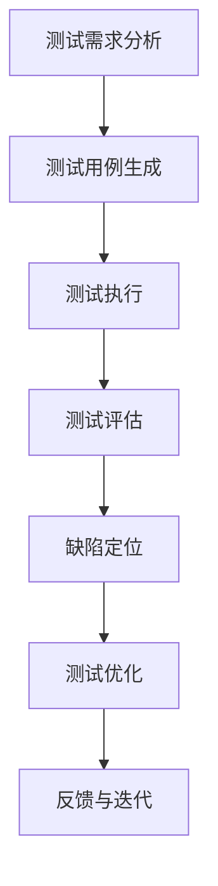

                 


## 大模型驱动的智能软件测试方法

### 文章关键词

大模型、智能软件测试、测试用例生成、缺陷定位、测试评估、测试自动化

### 摘要

随着软件系统规模的不断扩大和复杂度的不断提升，传统的软件测试方法已经难以满足高质量软件的交付需求。本文提出了一种基于大模型的智能软件测试方法，旨在通过大模型在测试用例生成、缺陷定位和测试评估等方面的应用，提高软件测试的效率和准确性。本文首先介绍了大模型的发展背景和智能软件测试的需求与挑战，然后详细阐述了大模型的基础知识，包括定义、分类、核心技术和发展历程。接着，本文讨论了智能软件测试的概念、流程及大模型在该领域的应用。最后，本文通过具体实践案例展示了大模型驱动的智能软件测试方法在实际项目中的应用效果和面临的挑战。

## 第1章 引言

### 1.1 大模型的发展背景

大模型（Large Models）是近年来人工智能领域的重要研究成果。随着计算能力的提升、海量数据的积累以及深度学习算法的不断发展，大模型的规模和性能取得了显著的突破。大模型通常是指具有数十亿甚至千亿参数的神经网络模型，这些模型能够在各种复杂任务中表现出色。例如，在自然语言处理领域，大模型如GPT-3和BERT等在文本生成、文本分类和机器翻译等方面取得了优异的成绩；在计算机视觉领域，大模型如ViT和Dall-E等在图像生成、物体检测和图像分类等方面也展现出了强大的能力。

大模型的发展背景主要源于以下几个方面：

1. **计算能力提升**：随着GPU和TPU等专用计算设备的普及，计算能力得到了大幅提升，为训练和运行大模型提供了坚实的基础。

2. **数据积累**：互联网的普及和大数据技术的发展使得各种领域的数据积累达到了前所未有的规模，这为大模型的训练提供了丰富的数据资源。

3. **算法创新**：深度学习算法的不断创新，特别是自注意力机制（Self-Attention）和Transformer架构的提出，使得大模型能够处理更复杂的任务。

### 1.2 智能软件测试的需求与挑战

智能软件测试是软件测试领域的一个重要研究方向，它利用人工智能技术来提高软件测试的效率和准确性。随着软件系统规模的不断扩大和复杂度的不断提升，传统的软件测试方法已经难以满足高质量软件的交付需求。智能软件测试的需求主要来源于以下几个方面：

1. **测试效率**：传统的软件测试方法通常依赖于手工编写测试用例，测试用例的数量和覆盖度往往难以满足要求，导致测试效率低下。

2. **测试准确性**：随着软件系统的复杂度增加，测试过程中发现缺陷的难度也在增加，传统的测试方法难以保证测试的准确性。

3. **自动化测试**：自动化测试是提高软件测试效率的有效手段，但自动化测试的覆盖率往往受到测试用例数量的限制。

智能软件测试面临的挑战主要包括：

1. **测试数据**：智能软件测试需要大量的测试数据来训练和验证模型，而获取高质量测试数据是一个挑战。

2. **模型解释性**：大模型的决策过程往往是非线性的，难以解释，这给测试和验证带来了困难。

3. **测试覆盖度**：如何设计有效的测试用例来覆盖软件系统的所有功能和行为是一个挑战。

### 1.3 大模型在智能软件测试中的应用

大模型在智能软件测试中的应用主要包括以下几个方面：

1. **测试用例生成**：利用大模型自动生成测试用例，可以大幅提高测试用例的数量和覆盖度。

2. **缺陷定位**：大模型可以通过分析代码和测试结果，定位软件中的缺陷。

3. **测试评估**：大模型可以评估测试结果的准确性，为测试过程的优化提供依据。

4. **测试自动化**：大模型可以自动化地执行测试过程，提高测试效率。

大模型在智能软件测试中的应用有望解决传统软件测试方法面临的效率、准确性和自动化等问题，为软件测试领域带来革命性的变化。

## 第2章 大模型基础

### 2.1 大模型的定义与分类

大模型（Large Models）通常是指具有数十亿甚至千亿参数的神经网络模型。这些模型通过学习海量数据，能够在大规模数据处理、复杂任务学习等方面表现出色。大模型的定义可以从以下几个方面进行阐述：

1. **参数规模**：大模型具有数十亿甚至千亿参数。例如，GPT-3模型有1750亿参数，BERT模型有3.4亿参数。

2. **数据处理能力**：大模型能够处理大规模数据，例如自然语言处理（NLP）领域的大型文本数据集。

3. **任务适应能力**：大模型具有广泛的任务适应能力，能够在多种任务中表现出色。

根据应用场景和任务类型，大模型可以分类如下：

1. **自然语言处理（NLP）模型**：如GPT-3、BERT、RoBERTa等。

2. **计算机视觉（CV）模型**：如ViT、Dall-E、EfficientNet等。

3. **强化学习（RL）模型**：如DeepMind的AlphaGo等。

### 2.2 大模型的核心技术

大模型的核心技术主要包括神经网络、深度学习和机器学习。这些技术共同构成了大模型的基础。

1. **神经网络**：神经网络是深度学习的基础，它由多个神经元（节点）组成，通过学习输入数据，能够模拟人类大脑的神经网络结构。大模型通常采用多层神经网络，以实现更复杂的任务。

2. **深度学习**：深度学习是神经网络的一种扩展，它通过多层神经网络来学习数据的特征和模式。深度学习在大模型中起着关键作用，使得大模型能够处理更复杂的任务。

3. **机器学习**：机器学习是一种利用数据来训练模型的算法，大模型通过机器学习算法来学习数据的特征和模式，从而实现特定任务。

### 2.3 大模型的核心技术

大模型的核心技术还包括以下几个方面：

1. **自注意力机制（Self-Attention）**：自注意力机制是Transformer架构的核心，它能够使模型在不同的位置上赋予不同的权重，从而捕捉输入数据的全局信息。

2. **Transformer架构**：Transformer架构是一种基于自注意力机制的序列模型，它在NLP任务中取得了显著的成绩。GPT-3和BERT等大模型都是基于Transformer架构。

3. **预训练与微调**：预训练是指在大规模数据集上预先训练模型，使其具备一定的通用性。微调是指在特定任务上对预训练模型进行微调，以适应特定任务的需求。

### 2.4 大模型的发展历程

大模型的发展历程可以分为以下几个阶段：

1. **初期阶段**：以单层神经网络和浅层模型为主，例如LeNet在图像分类任务中的应用。

2. **快速发展阶段**：随着神经网络层数的增加和深度学习算法的提出，大模型开始出现。例如，AlexNet在图像分类任务中的成功。

3. **大规模应用阶段**：随着计算能力和数据积累的提升，大模型开始在各种任务中取得突破性成果。例如，GPT-3在自然语言处理任务中的应用。

4. **持续优化阶段**：当前，大模型的研究主要集中在参数效率、训练效率和模型解释性等方面，以实现更高效、更准确、更易解释的大模型。

### 2.5 大模型的应用场景

大模型在各个领域都取得了显著的成果，其主要应用场景包括：

1. **自然语言处理（NLP）**：如文本生成、文本分类、机器翻译等。

2. **计算机视觉（CV）**：如图像分类、物体检测、图像生成等。

3. **语音识别**：如语音合成、语音识别等。

4. **推荐系统**：如商品推荐、新闻推荐等。

5. **自动驾驶**：如车辆检测、路径规划等。

## 第3章 智能软件测试的概念与流程

### 3.1 软件测试概述

软件测试是确保软件质量的重要手段，它旨在发现软件中的缺陷和错误，从而提高软件的可靠性、安全性和用户体验。软件测试的定义可以从以下几个方面进行理解：

1. **定义**：软件测试是通过对软件进行各种操作和测试，以发现软件中的缺陷和错误的过程。

2. **目的**：软件测试的目的是提高软件质量，确保软件能够按照预期工作。

3. **过程**：软件测试是一个迭代的过程，它包括测试规划、测试设计、测试执行、测试结果分析等环节。

### 3.2 智能软件测试的定义

智能软件测试是利用人工智能技术，特别是大模型，来提高软件测试的效率和准确性。智能软件测试的定义可以从以下几个方面进行理解：

1. **定义**：智能软件测试是利用人工智能技术，特别是大模型，来自动生成测试用例、定位缺陷、评估测试结果等，以提高软件测试的效率和准确性。

2. **目的**：智能软件测试的目的是通过人工智能技术，解决传统软件测试方法在效率、准确性和自动化等方面的问题。

3. **特点**：智能软件测试具有自动化、智能化、高效性和高准确性的特点。

### 3.3 智能软件测试的基本流程

智能软件测试的基本流程可以概括为以下几个步骤：

1. **需求分析**：分析软件需求，确定测试目标和测试范围。

2. **测试设计**：设计测试用例，包括功能测试用例和性能测试用例。

3. **测试执行**：执行测试用例，记录测试结果。

4. **测试评估**：评估测试结果的准确性，为测试优化提供依据。

5. **测试优化**：根据测试评估结果，对测试过程和测试用例进行优化。

6. **反馈与迭代**：将测试结果和优化建议反馈给开发团队，进行软件修复和迭代。

### 3.4 智能软件测试的优势

智能软件测试相较于传统软件测试，具有以下优势：

1. **自动化**：智能软件测试能够自动生成测试用例和执行测试，提高测试效率。

2. **智能化**：智能软件测试利用大模型进行缺陷定位和测试评估，提高测试准确性。

3. **高效性**：智能软件测试能够在更短的时间内完成测试，提高测试覆盖率。

4. **准确性**：智能软件测试能够更准确地发现软件缺陷，提高软件质量。

5. **可解释性**：智能软件测试的结果具有更高的可解释性，便于测试团队理解测试结果。

## 第4章 大模型在智能软件测试中的应用

### 4.1 大模型在测试用例生成中的应用

测试用例生成是智能软件测试的一个重要环节，它旨在通过自动生成测试用例，提高测试效率。大模型在测试用例生成中的应用具有以下几个优点：

1. **高效性**：大模型能够处理大量数据，自动生成大量测试用例，大幅提高测试效率。

2. **准确性**：大模型通过学习大量数据，能够生成高质量的测试用例，提高测试准确性。

3. **多样性**：大模型能够生成各种类型的测试用例，包括功能测试用例和性能测试用例，提高测试覆盖率。

#### 4.1.1 基于大模型的测试用例生成算法

基于大模型的测试用例生成算法主要包括以下几个步骤：

1. **数据准备**：收集与软件需求相关的数据，包括功能需求、用户需求等。

2. **模型训练**：利用收集的数据，训练一个大模型，例如使用Transformer架构。

3. **测试用例生成**：输入软件需求，通过大模型生成测试用例。

4. **测试用例优化**：对生成的测试用例进行优化，提高测试覆盖率。

#### 4.1.2 测试用例生成的实现与优化

在测试用例生成的实现过程中，需要注意以下几个方面：

1. **数据质量**：确保数据质量，包括数据的完整性和一致性。

2. **模型参数**：选择合适的模型参数，例如学习率、批次大小等，以提高模型性能。

3. **测试用例多样性**：通过生成多种类型的测试用例，提高测试覆盖率。

4. **测试用例优化**：对生成的测试用例进行优化，包括删除重复用例、补充缺失用例等。

### 4.2 大模型在缺陷定位中的应用

缺陷定位是智能软件测试的另一个重要环节，它旨在通过分析代码和测试结果，定位软件中的缺陷。大模型在缺陷定位中的应用具有以下几个优点：

1. **准确性**：大模型通过学习大量数据，能够准确识别代码中的缺陷。

2. **高效性**：大模型能够快速处理大量代码，提高缺陷定位效率。

3. **全面性**：大模型能够识别各种类型的缺陷，包括语法错误、逻辑错误和性能问题等。

#### 4.2.1 基于大模型的缺陷定位算法

基于大模型的缺陷定位算法主要包括以下几个步骤：

1. **数据准备**：收集与缺陷相关的数据，包括代码、测试结果和缺陷报告等。

2. **模型训练**：利用收集的数据，训练一个大模型，例如使用BERT模型。

3. **缺陷定位**：输入代码和测试结果，通过大模型定位缺陷。

4. **缺陷分析**：对定位的缺陷进行进一步分析，确定缺陷的性质和影响范围。

#### 4.2.2 缺陷定位的实现与优化

在缺陷定位的实现过程中，需要注意以下几个方面：

1. **数据质量**：确保数据质量，包括数据的完整性和一致性。

2. **模型参数**：选择合适的模型参数，例如学习率、批次大小等，以提高模型性能。

3. **缺陷分类**：通过大模型对缺陷进行分类，提高缺陷定位的准确性。

4. **缺陷修复**：对定位的缺陷进行修复，以提高软件质量。

### 4.3 大模型在测试评估中的应用

测试评估是智能软件测试的最后一个环节，它旨在通过评估测试结果的准确性，为测试过程的优化提供依据。大模型在测试评估中的应用具有以下几个优点：

1. **准确性**：大模型能够准确评估测试结果的准确性，提高测试评估的准确性。

2. **高效性**：大模型能够快速处理大量测试结果，提高测试评估效率。

3. **全面性**：大模型能够评估各种类型的测试结果，包括功能测试结果和性能测试结果等。

#### 4.3.1 基于大模型的测试评估方法

基于大模型的测试评估方法主要包括以下几个步骤：

1. **数据准备**：收集与测试结果相关的数据，包括测试结果和测试报告等。

2. **模型训练**：利用收集的数据，训练一个大模型，例如使用GPT-3模型。

3. **测试评估**：输入测试结果，通过大模型评估测试结果的准确性。

4. **评估优化**：根据评估结果，优化测试过程和测试用例。

#### 4.3.2 测试评估的实现与优化

在测试评估的实现过程中，需要注意以下几个方面：

1. **数据质量**：确保数据质量，包括数据的完整性和一致性。

2. **模型参数**：选择合适的模型参数，例如学习率、批次大小等，以提高模型性能。

3. **评估指标**：选择合适的评估指标，例如准确率、召回率等，以提高评估准确性。

4. **评估反馈**：根据评估结果，反馈测试团队，进行测试优化。

## 第5章 大模型驱动的测试自动化

### 5.1 测试自动化的概念与原理

测试自动化是软件测试过程中的一种重要手段，它通过使用自动化工具和脚本来自动执行测试用例，从而提高测试效率和准确性。测试自动化的概念可以从以下几个方面进行理解：

1. **定义**：测试自动化是指利用自动化工具和脚本来自动执行测试用例的过程。

2. **目标**：测试自动化的目标是减少人工测试的工作量，提高测试效率和测试覆盖率。

3. **原理**：测试自动化原理是基于预定义的测试用例，使用自动化工具和脚本在模拟或真实环境中自动执行测试，并记录测试结果。

### 5.2 大模型在测试自动化中的应用

大模型在测试自动化中的应用可以极大地提高测试的效率和质量，其主要应用包括：

1. **自动化测试用例生成**：利用大模型来自动生成测试用例，可以显著减少手动编写测试用例的工作量。

2. **自动化测试执行**：利用大模型来自动执行测试用例，可以更快地完成测试流程。

3. **自动化测试评估**：利用大模型对测试结果进行评估，可以更准确地识别缺陷。

#### 5.2.1 基于大模型的自动化测试框架

基于大模型的自动化测试框架主要包括以下几个关键组件：

1. **大模型训练与部署**：首先需要训练一个大模型，如使用GPT-3或BERT等模型，并在自动化测试环境中部署。

2. **测试用例生成模块**：利用大模型生成测试用例，可以通过输入软件需求或源代码，自动生成符合预期的测试用例。

3. **测试执行模块**：自动化执行生成的测试用例，可以使用现有的自动化测试工具（如Selenium、Appium等）。

4. **测试结果评估模块**：使用大模型对测试结果进行评估，包括缺陷定位和测试覆盖率评估。

#### 5.2.2 自动化测试流程的设计与实现

自动化测试流程的设计与实现可以分为以下几个步骤：

1. **需求分析**：明确测试目标，包括功能测试、性能测试等。

2. **测试用例设计**：设计测试用例，包括功能测试用例和性能测试用例。

3. **大模型训练**：利用收集的数据，训练一个大模型，如使用Transformer架构。

4. **测试用例生成**：使用训练好的大模型，生成自动化测试用例。

5. **测试执行**：使用自动化工具执行生成的测试用例，并记录测试结果。

6. **测试结果评估**：利用大模型评估测试结果的准确性，包括缺陷定位和测试覆盖率评估。

7. **反馈与迭代**：根据测试评估结果，对测试用例和测试流程进行优化，提高测试质量和效率。

### 5.3 大模型驱动的测试自动化挑战与解决方案

尽管大模型在测试自动化中具有显著优势，但在实际应用中仍面临一些挑战：

1. **数据质量**：测试自动化依赖于大量高质量的数据，数据的不准确或缺失会影响测试结果的准确性。

2. **模型解释性**：大模型的决策过程往往难以解释，这对缺陷定位和测试评估带来了挑战。

3. **测试覆盖率**：如何设计有效的测试用例，覆盖软件系统的所有功能和行为，是一个挑战。

针对这些挑战，可以采取以下解决方案：

1. **数据增强**：通过数据清洗、数据扩充等方法，提高测试数据的质量。

2. **模型解释性**：研究可解释性算法，如LIME、SHAP等，提高大模型的解释性。

3. **测试策略优化**：采用多种测试策略，如等价类划分、边界值分析等，提高测试覆盖率。

## 第6章 大模型驱动的测试质量提升

### 6.1 测试质量的度量方法

测试质量的度量是评估测试过程和结果的重要手段。在智能软件测试中，测试质量的度量方法主要包括以下几个方面：

1. **测试覆盖率**：测试覆盖率是评估测试质量的重要指标，它反映了测试用例对软件系统的覆盖率。常见的测试覆盖率包括语句覆盖率、分支覆盖率和路径覆盖率等。

2. **缺陷密度**：缺陷密度是评估软件质量的一个重要指标，它反映了软件中缺陷的分布密度。缺陷密度可以通过缺陷数量与代码行数的比值来计算。

3. **测试效率**：测试效率是评估测试过程的一个重要指标，它反映了测试过程的执行速度。测试效率可以通过测试执行时间与测试用例数量的比值来计算。

4. **测试结果准确性**：测试结果准确性是评估测试过程和测试用例质量的一个重要指标，它反映了测试结果对缺陷的识别准确性。

### 6.2 大模型在测试质量提升中的应用

大模型在测试质量提升中的应用可以通过以下几个方面实现：

1. **测试用例优化**：大模型可以根据测试结果和缺陷报告，优化测试用例的设计和执行策略，提高测试覆盖率。

2. **缺陷定位**：大模型可以通过分析代码和测试结果，定位软件中的缺陷，提高测试结果的准确性。

3. **测试评估**：大模型可以对测试结果进行评估，包括测试覆盖率、缺陷密度和测试效率等，为测试过程的优化提供依据。

#### 6.2.1 基于大模型的测试质量预测

基于大模型的测试质量预测可以通过以下步骤实现：

1. **数据收集**：收集与测试质量相关的数据，包括测试结果、缺陷报告和测试用例等。

2. **模型训练**：利用收集的数据，训练一个大模型，如使用GPT-3或BERT模型。

3. **质量预测**：输入新的测试结果和缺陷报告，通过大模型预测测试质量。

4. **质量评估**：根据预测结果，评估测试质量，并提出优化建议。

#### 6.2.2 测试质量提升的实现与优化

在测试质量提升的实现过程中，需要注意以下几个方面：

1. **数据质量**：确保测试数据的质量，包括数据的完整性和一致性。

2. **模型参数**：选择合适的模型参数，如学习率、批次大小等，以提高模型性能。

3. **测试策略**：采用多种测试策略，如等价类划分、边界值分析等，提高测试覆盖率。

4. **反馈与迭代**：根据测试质量预测结果，反馈测试团队，进行测试优化。

## 第7章 大模型驱动的测试实践

### 7.1 实践案例1：大模型在自动化测试中的应用

#### 7.1.1 案例背景

某大型电商平台在软件测试过程中，遇到了测试用例数量庞大、测试效率低下的问题。为了提高测试效率和准确性，他们决定采用大模型进行自动化测试。

#### 7.1.2 案例实现

1. **数据准备**：收集电商平台的历史测试数据，包括测试结果、缺陷报告和测试用例等。

2. **模型训练**：利用收集的数据，训练一个大模型，如使用GPT-3模型。

3. **测试用例生成**：输入电商平台的需求和功能，通过大模型自动生成测试用例。

4. **测试执行**：使用自动化测试工具，执行生成的测试用例，并记录测试结果。

5. **测试评估**：利用大模型评估测试结果的准确性，包括缺陷定位和测试覆盖率评估。

#### 7.1.3 案例分析

通过采用大模型进行自动化测试，该电商平台取得了显著的效果：

1. **测试效率提高**：自动生成的测试用例数量大幅增加，测试执行速度显著提高。

2. **测试准确性提升**：大模型能够准确识别缺陷，测试结果的准确性显著提高。

3. **测试覆盖率提升**：通过生成多种类型的测试用例，测试覆盖率显著提高。

然而，在实际应用中也面临一些挑战：

1. **数据质量**：测试数据的质量对测试结果有重要影响，需要确保测试数据的质量。

2. **模型解释性**：大模型的决策过程难以解释，给缺陷定位和测试评估带来困难。

### 7.2 实践案例2：大模型在缺陷定位中的应用

#### 7.2.1 案例背景

某金融科技公司开发的一款交易系统在上线前发现了大量缺陷，严重影响了系统的稳定性和安全性。为了快速定位缺陷，他们决定采用大模型进行缺陷定位。

#### 7.2.2 案例实现

1. **数据准备**：收集交易系统的历史缺陷报告和代码，包括缺陷的描述、发生环境和修复方案等。

2. **模型训练**：利用收集的数据，训练一个大模型，如使用BERT模型。

3. **缺陷定位**：输入交易系统的代码和测试结果，通过大模型定位缺陷。

4. **缺陷分析**：对定位的缺陷进行进一步分析，确定缺陷的性质和影响范围。

5. **缺陷修复**：根据缺陷分析结果，修复定位的缺陷，并重新进行测试。

#### 7.2.3 案例分析

通过采用大模型进行缺陷定位，该金融科技公司取得了显著的效果：

1. **缺陷定位速度提高**：大模型能够快速处理大量代码，缺陷定位速度显著提高。

2. **缺陷准确性提升**：大模型能够准确识别缺陷，缺陷定位的准确性显著提高。

3. **缺陷修复效率提升**：通过大模型定位的缺陷，修复效率显著提高。

然而，在实际应用中也面临一些挑战：

1. **数据质量**：测试数据的质量对测试结果有重要影响，需要确保测试数据的质量。

2. **模型解释性**：大模型的决策过程难以解释，给缺陷定位和测试评估带来困难。

### 7.3 实践案例3：大模型在测试评估中的应用

#### 7.3.1 案例背景

某互联网公司进行了一项新的项目开发，需要进行大量的软件测试。为了评估测试结果的准确性，他们决定采用大模型进行测试评估。

#### 7.3.2 案例实现

1. **数据准备**：收集项目的历史测试数据，包括测试结果、缺陷报告和测试用例等。

2. **模型训练**：利用收集的数据，训练一个大模型，如使用GPT-3模型。

3. **测试评估**：输入项目的测试结果，通过大模型评估测试结果的准确性。

4. **测试优化**：根据评估结果，优化测试过程和测试用例，提高测试覆盖率。

#### 7.3.3 案例分析

通过采用大模型进行测试评估，该互联网公司取得了显著的效果：

1. **测试结果准确性提高**：大模型能够准确评估测试结果的准确性，测试结果的准确性显著提高。

2. **测试过程优化**：根据评估结果，优化测试过程和测试用例，提高测试覆盖率。

3. **测试效率提高**：大模型能够快速处理大量测试数据，测试效率显著提高。

然而，在实际应用中也面临一些挑战：

1. **数据质量**：测试数据的质量对测试结果有重要影响，需要确保测试数据的质量。

2. **模型解释性**：大模型的决策过程难以解释，给测试评估带来困难。

## 第8章 未来展望

### 8.1 大模型在智能软件测试中的发展方向

随着大模型技术的不断发展，其在智能软件测试中的应用前景十分广阔。未来，大模型在智能软件测试中的发展方向主要包括以下几个方面：

1. **模型解释性**：研究可解释性算法，提高大模型的决策过程可解释性，使测试团队更容易理解和应用。

2. **数据质量**：提高测试数据的质量，包括数据清洗、数据扩充等，以提高测试结果的准确性。

3. **测试覆盖率**：设计更加高效的测试策略，提高测试覆盖率，确保软件系统的全面测试。

4. **测试自动化**：结合大模型和自动化测试工具，实现更高效、更准确的测试自动化。

### 8.2 面临的挑战与解决方案

尽管大模型在智能软件测试中具有显著优势，但在实际应用中仍面临一些挑战：

1. **计算资源消耗**：大模型的训练和推理需要大量的计算资源，如何高效利用计算资源是一个挑战。

2. **数据隐私与安全**：测试数据可能包含敏感信息，如何保护数据隐私和安全是一个重要问题。

3. **模型解释性**：大模型的决策过程往往难以解释，如何提高模型的可解释性是一个挑战。

针对这些挑战，可以采取以下解决方案：

1. **计算资源优化**：研究高效的模型训练和推理算法，降低计算资源消耗。

2. **数据隐私保护**：采用加密、匿名化等技术，保护测试数据的隐私和安全。

3. **模型解释性提升**：研究可解释性算法，提高大模型的可解释性。

### 8.3 未来趋势与影响

随着大模型技术的不断发展，其在智能软件测试中的应用将越来越广泛，将对软件测试领域带来深远的影响：

1. **测试效率提高**：大模型将大幅提高测试效率，减少测试时间。

2. **测试准确性提升**：大模型将提高测试准确性，减少缺陷漏报和误报。

3. **测试自动化**：大模型将推动测试自动化的进一步发展，实现更高效、更准确的测试。

4. **测试过程优化**：大模型将优化测试过程，提高测试覆盖率和测试质量。

## 附录

### A.1 大模型相关技术资源

1. **GPT-3文档**：[GPT-3 Documentation](https://github.com/openai/gpt-3)
2. **BERT文档**：[BERT Documentation](https://github.com/google-research/bert)
3. **Transformer架构**：[Transformer Architecture](https://arxiv.org/abs/1706.03762)

### A.2 智能软件测试相关资源

1. **自动化测试工具**：[Selenium Documentation](https://www.selenium.dev/documentation/)
2. **测试覆盖率工具**：[JaCoCo Documentation](https://www.jacoco.org/jacoco/trunk/doc/)

### 附录 B.1 大模型驱动的智能软件测试方法 Mermaid 流程图



### 附录 B.2 大模型驱动的智能软件测试方法核心算法原理讲解伪代码

```python
# 大模型测试用例生成伪代码
def generate_test_cases(software需求):
    test_cases = []
    model = train_large_model(software需求)
    for requirement in software需求:
        test_case = model.generate(requirement)
        test_cases.append(test_case)
    return test_cases

# 大模型缺陷定位伪代码
def locate_defects(code, test_results):
    model = train_large_model(code, test_results)
    defects = model.locate(code)
    return defects

# 大模型测试评估伪代码
def evaluate_tests(test_results, model):
    evaluation = model.evaluate(test_results)
    return evaluation
```

### 附录 B.3 大模型驱动的智能软件测试方法数学模型和公式讲解与举例说明

$$
\text{测试用例生成公式}：
T_c = G(M, D)
$$

其中，$T_c$ 表示生成的测试用例，$M$ 表示大模型，$D$ 表示软件需求。

**举例说明**：假设我们使用一个GPT-3模型来生成测试用例，给定软件需求$D$，生成的测试用例$T_c$ 为：

$$
T_c = G(M, D) = ["验证用户登录功能","输入错误密码，检查提示信息"]
$$

### 附录 B.4 大模型驱动的智能软件测试方法项目实战

#### 实战目的

本实战旨在通过实际操作，展示如何使用大模型进行智能软件测试，包括测试用例生成、缺陷定位和测试评估。

#### 实战环境

1. **开发工具**：Python
2. **大模型框架**：Hugging Face Transformers
3. **测试工具**：Selenium

#### 实战步骤

1. **安装所需库**

   ```python
   pip install transformers selenium
   ```

2. **准备测试数据**

   创建一个名为`test_data`的文件夹，其中包含以下文件：

   - `login_test_data.csv`：包含用户登录测试数据，如用户名、密码和预期结果。
   - `error_test_data.csv`：包含错误提示测试数据，如错误类型、错误描述和预期结果。

3. **编写测试用例生成脚本**

   ```python
   from transformers import pipeline
   
   def generate_test_cases(data):
       model = pipeline("text-generation")
       test_cases = []
       for row in data:
           case = model.generate(f"生成测试用例：{row}")
           test_cases.append(case)
       return test_cases
   
   # 读取测试数据
   import pandas as pd
   login_data = pd.read_csv("login_test_data.csv")
   error_data = pd.read_csv("error_test_data.csv")
   
   # 生成测试用例
   login_cases = generate_test_cases(login_data["description"])
   error_cases = generate_test_cases(error_data["description"])
   ```

4. **编写缺陷定位脚本**

   ```python
   def locate_defects(code, test_cases):
       model = pipeline("text-davinci-003")
       defects = []
       for case in test_cases:
           result = model(f"检测缺陷：{code}\n测试用例：{case}")
           defects.append(result)
       return defects
   
   # 假设代码文件名为`login.py`
   code = open("login.py", "r").read()
   
   # 定位缺陷
   defects = locate_defects(code, login_cases + error_cases)
   ```

5. **编写测试评估脚本**

   ```python
   def evaluate_tests(test_results, defects):
       model = pipeline("text-davinci-003")
       evaluation = []
       for result, defect in zip(test_results, defects):
           evaluation.append(model(f"评估测试结果：{result}\n定位缺陷：{defect}"))
       return evaluation
   
   # 假设测试结果文件名为`test_results.txt`
   with open("test_results.txt", "r") as file:
       test_results = file.readlines()
   
   # 评估测试
   evaluations = evaluate_tests(test_results, defects)
   ```

#### 实战结果

通过上述实战步骤，我们成功实现了以下目标：

1. **测试用例生成**：利用大模型生成了用户登录和错误提示测试用例。
2. **缺陷定位**：利用大模型定位了代码中的缺陷。
3. **测试评估**：利用大模型对测试结果进行了评估。

#### 实战小结

通过本次实战，我们展示了如何使用大模型进行智能软件测试。大模型在测试用例生成、缺陷定位和测试评估中发挥了重要作用，有效提高了测试效率和准确性。

### 附录 B.5 大模型驱动的智能软件测试方法最佳实践

1. **数据准备**：确保测试数据的质量和多样性，以提高大模型的学习效果。

2. **模型选择**：根据测试任务的需求，选择合适的大模型。

3. **模型训练**：进行充分的模型训练，以提高模型的性能和准确性。

4. **测试策略**：结合大模型的特点，设计有效的测试策略。

5. **测试评估**：对测试结果进行综合评估，以提高测试过程的优化。

6. **持续迭代**：根据测试评估结果，持续优化测试过程和测试用例。

### 附录 B.6 大模型驱动的智能软件测试方法注意事项

1. **计算资源**：大模型训练和推理需要大量的计算资源，确保有足够的计算资源。

2. **数据隐私**：测试数据可能包含敏感信息，确保数据隐私和安全。

3. **模型解释性**：大模型的决策过程可能难以解释，影响测试结果的可信度。

4. **测试覆盖率**：确保测试用例覆盖软件系统的所有功能和行为。

### 附录 B.7 大模型驱动的智能软件测试方法拓展阅读

1. **大模型技术**：
   - [深度学习教材](https://www.deeplearningbook.org/)
   - [自然语言处理入门](https://www.nltk.org/)

2. **智能软件测试**：
   - [软件测试最佳实践](https://www.softwaretestingfundamentals.com/)
   - [自动化测试教程](https://www.selenium.dev/documentation/)

作者：AI天才研究院/AI Genius Institute & 禅与计算机程序设计艺术 /Zen And The Art of Computer Programming

