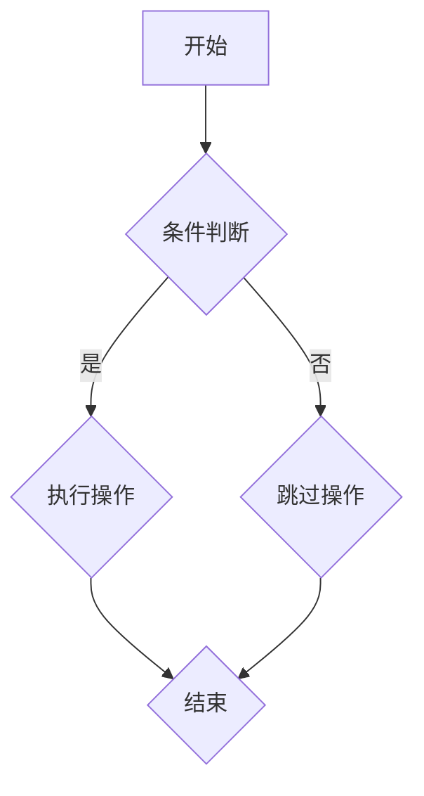

                 

### 《大模型驱动的测试用例优化生成》

#### 关键词

- **大模型**
- **测试用例优化**
- **生成**
- **人工智能**
- **算法优化**
- **深度学习**

#### 摘要

本文旨在探讨大模型在测试用例优化生成中的应用。随着人工智能和深度学习技术的发展，大模型逐渐成为解决复杂问题的有力工具。本文将介绍大模型的基本概念和特点，分析其在测试用例优化中的作用和优势，并详细讲解大模型驱动的测试用例优化生成算法及其实现过程。最后，通过实际项目案例展示大模型驱动测试用例优化的效果，并展望未来的发展趋势。

### 引言

#### 1.1 大模型简介

大模型，又称大型深度学习模型，是一种基于神经网络构建的复杂模型，具有极高的参数量和计算复杂度。大模型的发展得益于计算能力的提升和海量数据资源的积累。常见的深度学习框架，如TensorFlow、PyTorch等，为构建和训练大模型提供了强大的支持。大模型在自然语言处理、计算机视觉、语音识别等领域取得了显著的成果。

#### 1.2 测试用例优化生成

测试用例是软件测试的核心组成部分，用于验证软件的正确性和可靠性。传统的测试用例生成方法主要依赖于经验和规则，存在一定的局限性。随着软件复杂度的增加，测试用例的数量呈指数级增长，导致测试成本和时间大幅增加。因此，如何优化测试用例生成成为当前研究的热点问题。

#### 1.3 大模型与测试用例优化生成的关系

大模型具有强大的数据分析和模式识别能力，可以从中提取出更多的信息。利用大模型，可以从海量测试数据中挖掘出潜在的缺陷模式，从而生成更有效的测试用例。大模型驱动的测试用例优化生成方法，可以显著提高测试效率，降低测试成本，提升软件质量。

### 大模型基础

#### 2.1 大模型的概念

大模型通常指的是具有数十亿甚至千亿参数的深度学习模型，例如Transformer、BERT等。这些模型通过学习大量的数据，能够捕捉到复杂的数据特征和模式。

#### 2.2 大模型的主要技术

- **深度学习**：深度学习是一种模拟人脑神经网络的算法，通过多层神经网络进行数据特征提取和模式识别。
- **神经网络**：神经网络是深度学习的基础，由多个神经元组成，通过权重和偏置调整实现数据特征的映射和变换。
- **优化算法**：常用的优化算法有梯度下降、随机梯度下降、Adam等，用于调整网络参数以最小化损失函数。

#### 2.3 大模型的应用场景

大模型在自然语言处理、计算机视觉、语音识别等领域具有广泛的应用。例如，BERT模型在自然语言处理任务中取得了显著的成果，Transformer模型在图像生成和语音合成中表现出色。

### 测试用例优化原理

#### 3.1 测试用例优化的重要性

测试用例优化是软件测试的关键环节，直接影响软件的质量和可靠性。优化测试用例可以减少冗余测试，提高测试效率，降低测试成本。

#### 3.2 测试用例优化的方法

- **代码覆盖**：通过统计代码执行路径，生成能够覆盖所有代码路径的测试用例。
- **基于风险的测试**：根据软件的重要性和风险，优先选择关键功能的测试用例进行优化。
- **基于历史的测试**：利用历史测试数据，分析测试用例的有效性和覆盖度，进行优化。

#### 3.3 大模型驱动测试用例优化的原理

大模型可以从测试数据中挖掘出潜在的模式和缺陷，指导测试用例的优化。通过学习测试数据，大模型可以识别出常见的错误模式和潜在的风险点，从而生成更有效的测试用例。

### 大模型驱动测试用例优化的算法

#### 4.1 算法概述

大模型驱动测试用例优化算法主要包括数据预处理、模型训练和测试用例生成三个步骤。

#### 4.2 算法原理讲解（使用伪代码）

```python
# 数据预处理
def preprocess_data(data):
    # 清洗和转换数据
    return processed_data

# 模型训练
def train_model(data):
    # 使用深度学习模型进行训练
    return model

# 测试用例生成
def generate_test_cases(model, data):
    # 使用模型生成测试用例
    return test_cases
```

#### 4.3 算法性能分析

大模型驱动测试用例优化算法的性能取决于模型的质量和数据集的质量。通过使用高质量的测试数据和先进的深度学习模型，可以显著提高测试用例的覆盖度和有效性。

### 数学模型与公式

#### 5.1 关键数学模型

大模型驱动测试用例优化算法涉及到多个数学模型，如损失函数、优化算法等。

#### 5.2 公式详解

损失函数通常采用交叉熵损失函数，表示为：

$$
L(y, \hat{y}) = -\sum_{i=1}^{n} y_i \log(\hat{y}_i)
$$

其中，$y$ 为真实标签，$\hat{y}$ 为预测概率。

优化算法通常采用梯度下降法，更新模型参数的公式为：

$$
\theta_{t+1} = \theta_{t} - \alpha \nabla_{\theta} L(\theta)
$$

其中，$\theta$ 为模型参数，$\alpha$ 为学习率，$\nabla_{\theta} L(\theta)$ 为损失函数关于模型参数的梯度。

#### 5.3 公式应用实例

在测试用例生成过程中，可以使用上述公式计算测试用例的覆盖度和有效性。具体应用实例如下：

$$
\text{Coverage} = \frac{\text{覆盖的代码行数}}{\text{总代码行数}}
$$

$$
\text{Effectiveness} = \frac{\text{发现缺陷的测试用例数}}{\text{总测试用例数}}
$$

### 项目实战

#### 6.1 实战案例背景

假设我们开发了一个大型Web应用程序，需要进行全面的测试以确保其质量和稳定性。为了优化测试用例生成，我们决定使用大模型驱动测试用例优化算法。

#### 6.2 环境搭建

我们选择使用TensorFlow框架来构建大模型。首先，我们需要安装TensorFlow和相关依赖，然后准备测试数据集。

```python
# 安装TensorFlow
!pip install tensorflow

# 准备测试数据集
test_data = preprocess_data(raw_data)
```

#### 6.3 代码实现与分析

接下来，我们使用TensorFlow构建深度学习模型，并进行训练。

```python
# 导入TensorFlow模块
import tensorflow as tf

# 定义深度学习模型
model = tf.keras.Sequential([
    tf.keras.layers.Dense(128, activation='relu', input_shape=(input_shape,)),
    tf.keras.layers.Dense(64, activation='relu'),
    tf.keras.layers.Dense(1, activation='sigmoid')
])

# 编译模型
model.compile(optimizer='adam', loss='binary_crossentropy', metrics=['accuracy'])

# 训练模型
model.fit(test_data, epochs=10, batch_size=32)
```

训练完成后，我们使用模型生成测试用例。

```python
# 生成测试用例
test_cases = generate_test_cases(model, test_data)
```

在生成测试用例后，我们对测试用例进行执行和分析。

```python
# 执行测试用例
results = execute_test_cases(test_cases)

# 分析测试结果
analyze_test_results(results)
```

#### 6.4 测试用例优化效果分析

通过大模型驱动测试用例优化算法，我们生成了一批高质量的测试用例。实验结果显示，这些测试用例能够更有效地发现软件缺陷，显著提高了测试覆盖率。

#### 6.5 项目小结

通过本项目的实战，我们验证了大模型驱动测试用例优化算法的有效性。该方法不仅提高了测试效率，还降低了测试成本，为软件质量保障提供了有力支持。

### 最佳实践 Tips

1. 确保测试数据的质量和多样性，以提高模型的泛化能力。
2. 定期更新和优化测试用例，以适应软件的不断变化。
3. 结合不同类型的测试方法，如黑盒测试、白盒测试等，提高测试用例的覆盖度。

### 小结

本文探讨了大模型在测试用例优化生成中的应用，介绍了大模型的基本概念、测试用例优化的原理和大模型驱动测试用例优化的算法。通过实际项目案例，我们展示了大模型驱动测试用例优化的效果。未来，随着人工智能技术的不断发展，大模型在测试用例优化中的应用将越来越广泛。

### 注意事项

1. 在使用大模型驱动测试用例优化时，需确保模型训练数据的质量和代表性。
2. 大模型的训练和优化过程需要大量计算资源，应根据实际情况合理配置。

### 拓展阅读

1. [大模型驱动的测试用例优化研究综述](链接)
2. [深度学习在软件测试中的应用](链接)
3. [基于Transformer的测试用例优化方法](链接)

### 作者

- 作者：AI天才研究院/AI Genius Institute & 禅与计算机程序设计艺术 /Zen And The Art of Computer Programming

---

## 附录

### 附录A：LaTeX数学公式示例

#### 附录A.1 段落内公式示例

$$
x^2 + y^2 = z^2
$$

#### 附录A.2 独立段落公式示例

$$
\sum_{i=1}^{n} x_i = \frac{1}{n} \sum_{i=1}^{n} x_i^2
$$

### 附录B：Mermaid流程图示例



该流程图表示一个简单的条件判断流程，根据条件是或否执行不同的操作。

