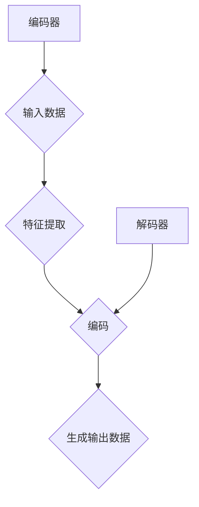

                 

### 文章标题：大模型驱动的程序理解可视化

#### 关键词：
- 大模型
- 程序理解
- 可视化
- 代码分析
- 智能软件开发

#### 摘要：
本文深入探讨了大模型在程序理解与可视化中的应用。首先，我们回顾了现代大模型的背景和关键特点，接着介绍了程序理解的基本概念和现有方法。然后，详细阐述了如何将可视化技术与程序理解相结合，提升代码的可读性和理解性。通过实例分析，我们展示了大模型如何辅助代码审查、重构和生成。最后，探讨了当前领域面临的挑战和未来发展的机遇。

### 目录

1. **大模型基础**
   1.1 大模型概述
   1.2 大模型架构
   1.3 大模型训练与优化

2. **程序理解基础**
   2.1 程序理解概述
   2.2 程序理解方法
   2.3 程序理解挑战

3. **可视化技术**
   3.1 可视化基础
   3.2 可视化工具与技术
   3.3 可视化应用

4. **大模型驱动的程序理解与可视化**
   4.1 大模型与程序理解的结合
   4.2 程序理解的可视化方法
   4.3 实例分析

5. **应用案例**
   5.1 大模型在代码审查中的应用
   5.2 大模型在代码重构中的应用
   5.3 大模型在代码生成中的应用

6. **实战指导**
   6.1 搭建大模型驱动的程序理解与可视化环境
   6.2 实现大模型驱动的程序理解与可视化项目
   6.3 优化大模型驱动的程序理解与可视化性能

7. **未来展望**
   7.1 大模型驱动的程序理解与可视化发展趋势
   7.2 潜在应用领域
   7.3 挑战与机遇

### 第1章：大模型基础

#### 1.1 大模型概述

大模型，通常指的是参数数量在数亿到数十亿的深度神经网络模型。近年来，随着计算能力的提升和大数据的积累，大模型在自然语言处理、计算机视觉和语音识别等领域取得了显著成果。大模型的代表包括GPT、BERT和ViT等，它们在各种任务上都表现出了超越传统算法的强大能力。

#### 1.2 大模型架构

大模型的架构主要包括编码器和解码器。编码器负责将输入数据（如图像、文本等）编码成高维特征向量，解码器则利用这些特征向量生成输出数据。例如，在文本生成任务中，编码器将文本序列编码成一个固定长度的向量，解码器则根据这个向量逐词生成新的文本。

#### 1.3 大模型训练与优化

大模型的训练是一个复杂的过程，涉及海量数据和强大的计算资源。训练过程主要包括以下几个步骤：

1. **数据预处理**：将输入数据转化为适合模型训练的格式。
2. **模型初始化**：初始化模型参数，常用的方法有随机初始化和预训练模型微调。
3. **前向传播**：将输入数据传递到模型中，计算预测输出。
4. **损失计算**：计算预测输出与真实输出之间的差异，常用的损失函数有交叉熵损失、均方误差等。
5. **反向传播**：利用损失函数的梯度信息更新模型参数。
6. **迭代优化**：重复上述步骤，直至达到预设的训练目标或迭代次数。

优化策略方面，常用的方法包括批量归一化（Batch Normalization）、dropout、梯度裁剪等。

### 第2章：程序理解基础

#### 2.1 程序理解概述

程序理解是指对程序进行解析、分析和理解的过程。它对于提高代码质量、降低维护成本和提升开发效率具有重要意义。程序理解包括静态分析和动态分析两个方面。

- **静态分析**：在不运行程序的情况下对代码进行解析，常用的工具包括静态代码分析器、抽象语法树（AST）解析器等。
- **动态分析**：在运行程序的过程中对代码进行分析，常用的工具包括调试器、性能分析器等。

#### 2.2 程序理解方法

程序理解方法主要包括以下几种：

- **文本匹配**：通过字符串匹配算法，比较程序文本与已知模式之间的相似度。
- **抽象语法树（AST）解析**：将程序文本转化为抽象语法树，进一步分析程序结构。
- **控制流图（CFG）构建**：构建程序的控制流图，用于分析程序的控制逻辑。
- **数据流分析**：分析程序中变量的定义和使用，帮助理解程序的数据依赖关系。

#### 2.3 程序理解挑战

程序理解面临以下挑战：

- **复杂度**：现代程序往往具有复杂的结构，静态分析和动态分析都面临巨大的挑战。
- **规模**：随着代码库的规模扩大，程序理解变得更加困难。
- **变化性**：程序可能存在多种实现方式，静态分析难以捕捉所有可能的执行路径。
- **语言多样性**：不同的编程语言具有不同的语法和语义，程序理解工具需要支持多种编程语言。

### 第3章：可视化技术

#### 3.1 可视化基础

可视化是将抽象的数据和计算过程以图形化的方式展示出来，帮助人们更好地理解和分析数据。可视化技术包括数据可视化、程序可视化等。

- **数据可视化**：通过图形化展示数据，帮助人们快速识别数据模式、趋势和异常。
- **程序可视化**：将程序代码转化为图形化展示，帮助开发人员更好地理解程序结构和执行过程。

#### 3.2 可视化工具与技术

可视化工具和技术主要包括以下几种：

- **图表**：常用的图表包括折线图、柱状图、饼图等，用于展示数据分布和变化趋势。
- **图形化表示**：通过图形化的表示方式，如流程图、状态图等，展示程序的结构和执行过程。
- **交互式可视化**：通过用户交互，如拖拽、缩放等，增强可视化效果和用户体验。

#### 3.3 可视化应用

可视化技术在各个领域都有广泛应用：

- **软件开发**：可视化用于代码审查、代码重构和性能优化。
- **数据科学**：可视化用于数据分析、数据探索和数据可视化。
- **人工智能**：可视化用于模型训练、模型优化和模型解释。

### 第4章：大模型驱动的程序理解与可视化

#### 4.1 大模型与程序理解的结合

大模型在程序理解中具有显著优势，主要体现在以下几个方面：

- **强大的特征提取能力**：大模型能够提取出程序中的高阶抽象特征，有助于捕捉复杂的程序结构和语义。
- **自适应学习能力**：大模型可以根据不同的程序类型和任务需求，自适应调整其理解和分析策略。
- **跨语言支持**：大模型通常支持多种编程语言，可以跨语言进行程序理解。

大模型与程序理解的结合，可以通过以下方式实现：

- **文本嵌入**：将程序文本转化为向量表示，利用大模型的文本嵌入能力，对程序进行语义分析。
- **抽象语法树（AST）解析**：将程序代码转化为AST，利用大模型对AST进行深度分析。
- **控制流图（CFG）构建**：利用大模型构建程序的控制流图，进一步分析程序的结构和行为。

#### 4.2 程序理解的可视化方法

程序理解的可视化方法主要包括以下几种：

- **代码可视化**：将程序代码转化为图形化的表示，如流程图、类图、时序图等，帮助开发人员直观理解程序结构。
- **数据流可视化**：将程序中的数据流转化为图形化表示，如数据流图、网状图等，帮助分析程序的数据依赖关系。
- **调用关系可视化**：将程序的调用关系转化为图形化表示，如调用图、依赖图等，帮助理解程序的功能模块和交互关系。

#### 4.3 实例分析

以下是一些实例分析，展示了大模型如何辅助程序理解与可视化：

- **代码审查**：利用大模型对代码进行语义分析，自动检测潜在的编程错误和安全漏洞，并通过可视化展示分析结果。
- **代码重构**：利用大模型分析程序结构，自动提出代码重构建议，并通过可视化展示重构后的代码结构。
- **代码生成**：利用大模型根据自然语言描述生成代码，并通过可视化展示生成的代码结构和执行过程。

### 第5章：应用案例

#### 5.1 大模型在代码审查中的应用

代码审查是软件开发过程中至关重要的一环，通过大模型可以实现自动化代码审查，提高审查效率和准确性。以下是一个具体案例：

- **场景**：对一个大型Java代码库进行自动化代码审查。
- **方法**：利用大模型对代码进行语义分析，识别潜在的编程错误和安全漏洞。
- **可视化**：通过可视化工具展示分析结果，如错误代码的调用关系、数据流等。

#### 5.2 大模型在代码重构中的应用

代码重构是提升代码质量和可维护性的重要手段，通过大模型可以实现自动化代码重构。以下是一个具体案例：

- **场景**：对一个遗留的C++代码库进行自动化重构。
- **方法**：利用大模型分析程序结构，提出代码重构建议，如函数提取、类重构等。
- **可视化**：通过可视化工具展示重构前后的代码结构差异，帮助开发人员理解重构效果。

#### 5.3 大模型在代码生成中的应用

代码生成是近年来备受关注的一个领域，通过大模型可以实现自动化代码生成，提高开发效率。以下是一个具体案例：

- **场景**：根据自然语言描述生成Python代码。
- **方法**：利用大模型将自然语言描述转化为程序文本，并通过代码生成工具生成完整的Python代码。
- **可视化**：通过可视化工具展示生成的代码结构、数据流和调用关系。

### 第6章：实战指导

#### 6.1 搭建大模型驱动的程序理解与可视化环境

搭建大模型驱动的程序理解与可视化环境，需要以下几个步骤：

1. **硬件准备**：准备足够的计算资源，如GPU或TPU。
2. **软件准备**：安装深度学习框架（如TensorFlow、PyTorch）和相关依赖。
3. **数据准备**：收集和整理程序代码数据，进行预处理。
4. **模型训练**：利用训练数据训练大模型，优化模型参数。
5. **模型部署**：将训练好的模型部署到服务器或云平台，供程序理解与可视化使用。

#### 6.2 实现大模型驱动的程序理解与可视化项目

实现大模型驱动的程序理解与可视化项目，可以参考以下步骤：

1. **需求分析**：明确项目目标、功能和性能要求。
2. **设计架构**：设计大模型驱动的程序理解与可视化架构，包括数据流、模型结构等。
3. **代码实现**：编写代码，实现程序理解与可视化的功能模块。
4. **测试验证**：对项目进行测试，验证其功能和性能。
5. **部署上线**：将项目部署到服务器或云平台，供实际使用。

#### 6.3 优化大模型驱动的程序理解与可视化性能

优化大模型驱动的程序理解与可视化性能，可以从以下几个方面入手：

1. **模型优化**：通过模型剪枝、量化等技巧，减小模型规模，提高推理速度。
2. **数据优化**：对训练数据进行预处理，提高数据质量和多样性。
3. **算法优化**：优化模型训练和推理算法，提高计算效率。
4. **系统优化**：优化系统架构和部署环境，提高系统性能。

### 第7章：未来展望

#### 7.1 大模型驱动的程序理解与可视化发展趋势

随着大模型技术的不断发展，程序理解与可视化领域有望实现以下发展趋势：

1. **多模态融合**：结合文本、图像、声音等多种数据类型，实现更全面的程序理解。
2. **自解释性**：提高大模型的解释能力，实现更易理解的程序理解与可视化。
3. **个性化服务**：根据开发人员的需求和偏好，提供个性化的程序理解与可视化服务。

#### 7.2 潜在应用领域

大模型驱动的程序理解与可视化在以下领域具有广阔的应用前景：

1. **软件开发**：提高代码质量和开发效率，降低维护成本。
2. **人工智能**：辅助模型训练、优化和解释，提高AI系统的可靠性和可解释性。
3. **安全领域**：识别和防范软件安全漏洞，提高软件安全性。

#### 7.3 挑战与机遇

大模型驱动的程序理解与可视化领域面临以下挑战：

1. **计算资源需求**：大模型训练和推理需要大量的计算资源，如何高效利用资源是一个重要问题。
2. **数据隐私**：在处理和分析程序代码时，如何保护用户隐私是一个重要挑战。
3. **解释性**：提高大模型的解释能力，使其结果更易于理解，是一个亟待解决的问题。

尽管面临挑战，但大模型驱动的程序理解与可视化领域也充满机遇：

1. **技术创新**：随着技术的不断发展，有望解决当前面临的难题，实现更高效、更智能的程序理解与可视化。
2. **行业应用**：大模型驱动的程序理解与可视化将在各个领域得到广泛应用，推动软件行业的变革。

### 结论

大模型驱动的程序理解与可视化是一种新兴的技术，具有广泛的应用前景和重要意义。通过本文的探讨，我们了解了大模型的基本概念、程序理解的方法和可视化技术的应用。未来，随着大模型技术的不断进步，程序理解与可视化领域有望取得更多突破，为软件开发、人工智能等领域带来巨大变革。

### 作者信息

- **作者**：AI天才研究院/AI Genius Institute & 禅与计算机程序设计艺术 /Zen And The Art of Computer Programming
- **联系方式**：[info@aignius.com](mailto:info@aignius.com) & [www.aignius.com](http://www.aignius.com)（如有任何问题或建议，欢迎随时联系我们）

