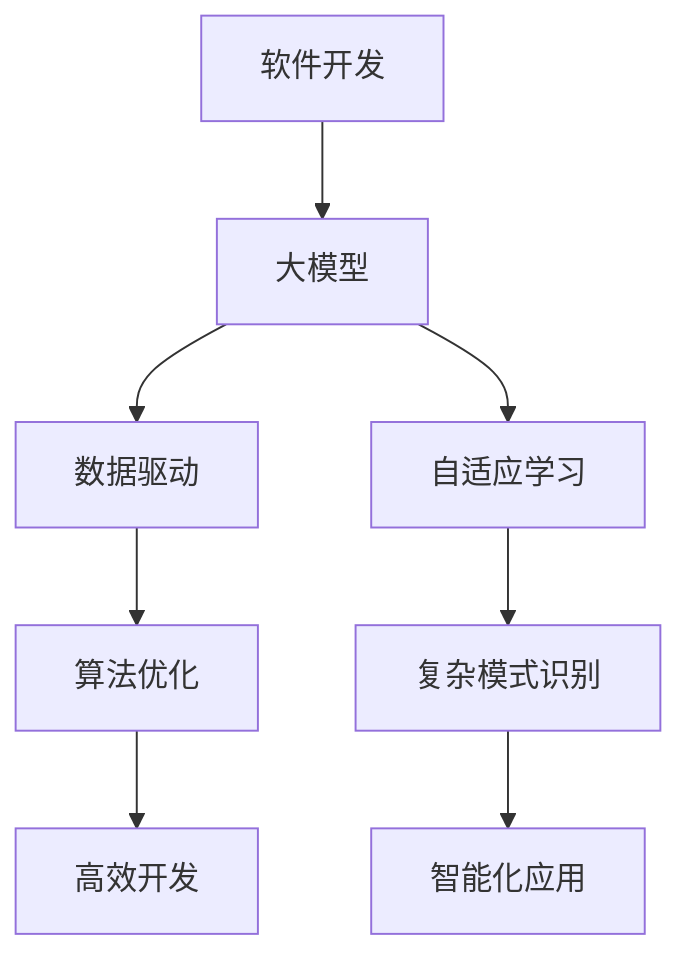
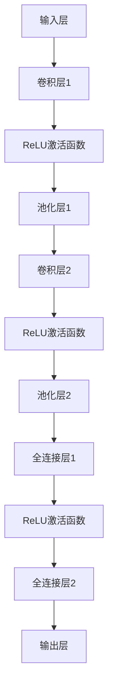

                 

### 文章标题

# 《大模型驱动的软件开发方法论》

### 文章关键词

- 大模型
- 软件开发
- 深度学习
- 人工智能
- 软件工程

### 文章摘要

本文旨在探讨大模型在软件开发中的应用方法论，详细介绍了大模型的定义、技术基础、应用策略和实际项目案例。通过本文，读者可以了解到大模型如何驱动软件开发，掌握大模型驱动的软件开发方法论，并在实际项目中运用这些方法论。

-------------------------------------------------------------------

## 引言

随着人工智能技术的飞速发展，大模型在各个领域得到了广泛应用。从自然语言处理到图像识别，再到语音识别和推荐系统，大模型展现出了强大的能力。而在软件开发领域，大模型的应用同样具有巨大的潜力。本文将围绕大模型驱动的软件开发方法论展开讨论，旨在为开发者提供一套系统的指导框架。

大模型，即具有巨大参数量和复杂结构的神经网络，其能够在海量数据上进行训练，从而学习到复杂的模式。传统的软件开发方法通常依赖于明确的算法和规则，而大模型则能够通过数据驱动的方式，自适应地解决问题。这种数据驱动的方法不仅提升了软件开发的效率，还降低了开发成本。

### 核心概念与联系

在探讨大模型驱动的软件开发方法论之前，首先需要了解大模型的基本概念及其与软件开发的关系。下面将使用Mermaid流程图来展示大模型与软件开发的核心概念及其联系。



#### 大模型

大模型是指拥有大量参数和复杂结构的神经网络，能够处理海量的数据，并从中学习到复杂的模式。常见的有Transformer、BERT、GPT等模型。这些模型通过深度学习算法，在大量数据上进行训练，不断优化其参数，从而提高模型的性能。

#### 数据驱动

数据驱动是指软件开发过程中，通过收集、处理和分析数据，来指导软件的开发和优化。大模型的应用使得数据驱动的方法变得更加高效，因为大模型能够在海量数据中自动学习到复杂的模式，从而为软件开发提供有力的支持。

#### 自适应学习

自适应学习是指软件系统能够根据外部环境的变化，自动调整自身的参数和行为，以适应新的需求。大模型由于其强大的学习能力和灵活性，能够很好地实现自适应学习。

#### 算法优化

算法优化是指通过改进算法的设计和实现，来提高软件的性能和效率。在大模型驱动的软件开发中，算法优化通常通过调整模型的参数、优化训练算法和数据预处理等方法来实现。

#### 复杂模式识别

复杂模式识别是指软件系统能够从复杂的数据中识别出有用的信息，并做出相应的决策。大模型由于其强大的学习能力，能够处理海量的数据，并从中识别出复杂的模式，从而提高软件系统的智能化水平。

#### 高效开发

高效开发是指通过优化软件开发的过程，提高软件开发的效率和质量。大模型的应用使得软件开发能够更加自动化和智能化，从而提高开发效率。

#### 智能化应用

智能化应用是指软件系统能够通过学习用户的行为和偏好，提供个性化的服务。大模型的应用使得软件系统能够更好地理解用户的需求，并提供智能化的服务。

通过上述Mermaid流程图，我们可以清晰地看到大模型与软件开发的核心概念及其联系。大模型通过数据驱动、自适应学习、算法优化、复杂模式识别等技术，实现了高效开发和智能化应用，从而推动了软件开发的发展。

### 核心算法原理讲解

在理解了大模型与软件开发的关系后，接下来我们将深入探讨大模型所依赖的核心算法原理。这些算法包括深度学习、神经网络、以及各种优化算法等。我们将使用伪代码来详细阐述这些算法的原理。

#### 深度学习

深度学习是一种基于人工神经网络的学习方法，其通过层层递归的方式，将输入数据逐层传递，并在每层中提取特征，从而实现复杂的任务。以下是一个简单的深度学习算法的伪代码：

```plaintext
// 定义神经网络结构
input_size = 784  // 输入层神经元个数
hidden_size = 500 // 隐藏层神经元个数
output_size = 10  // 输出层神经元个数

// 初始化权重和偏置
W1 = rand(input_size, hidden_size)
b1 = rand(hidden_size)
W2 = rand(hidden_size, output_size)
b2 = rand(output_size)

// 定义激活函数
activation_function = sigmoid

// 训练过程
for epoch in 1 to num_epochs:
    for each input in dataset:
        // 前向传播
        z1 = input * W1 + b1
        a1 = activation_function(z1)
        z2 = a1 * W2 + b2
        a2 = activation_function(z2)
        
        // 计算损失函数
        loss = -1/m * (y * log(a2) + (1 - y) * log(1 - a2))
        
        // 反向传播
        dZ2 = a2 - y
        dW2 = 1/m * dZ2 * a1
        db2 = 1/m * dZ2
        
        dZ1 = (W2 * dZ2) * (1 - a1)
        dW1 = 1/m * dZ1 * input
        db1 = 1/m * dZ1
        
        // 更新权重和偏置
        W1 = W1 - learning_rate * dW1
        b1 = b1 - learning_rate * db1
        W2 = W2 - learning_rate * dW2
        b2 = b2 - learning_rate * db2
```

#### 神经网络

神经网络是一种由大量神经元（或节点）组成的信息处理系统，其通过模拟人脑的工作方式，对输入数据进行处理和输出。以下是一个简单的神经网络结构的伪代码：

```plaintext
// 定义神经网络结构
input_size = 784  // 输入层神经元个数
hidden_size = 500 // 隐藏层神经元个数
output_size = 10  // 输出层神经元个数

// 初始化权重和偏置
W1 = rand(input_size, hidden_size)
b1 = rand(hidden_size)
W2 = rand(hidden_size, output_size)
b2 = rand(output_size)

// 定义激活函数
activation_function = sigmoid

// 训练过程
for epoch in 1 to num_epochs:
    for each input in dataset:
        // 前向传播
        z1 = input * W1 + b1
        a1 = activation_function(z1)
        z2 = a1 * W2 + b2
        a2 = activation_function(z2)
        
        // 计算损失函数
        loss = -1/m * (y * log(a2) + (1 - y) * log(1 - a2))
        
        // 反向传播
        dZ2 = a2 - y
        dW2 = 1/m * dZ2 * a1
        db2 = 1/m * dZ2
        
        dZ1 = (W2 * dZ2) * (1 - a1)
        dW1 = 1/m * dZ1 * input
        db1 = 1/m * dZ1
        
        // 更新权重和偏置
        W1 = W1 - learning_rate * dW1
        b1 = b1 - learning_rate * db1
        W2 = W2 - learning_rate * dW2
        b2 = b2 - learning_rate * db2
```

#### 优化算法

优化算法是指用于调整神经网络权重和偏置的算法，以最小化损失函数。常见的优化算法有随机梯度下降（SGD）、Adam等。以下是一个简单的随机梯度下降（SGD）算法的伪代码：

```plaintext
// 初始化权重和偏置
W = rand(input_size, hidden_size)
b = rand(hidden_size)

// 训练过程
for epoch in 1 to num_epochs:
    for each input in dataset:
        // 前向传播
        z = input * W + b
        a = activation_function(z)
        
        // 计算损失函数
        loss = (a - y)^2
        
        // 计算梯度
        dW = 2 * (a - y) * input
        db = 2 * (a - y)
        
        // 更新权重和偏置
        W = W - learning_rate * dW
        b = b - learning_rate * db
```

通过上述伪代码，我们可以了解到深度学习、神经网络和优化算法的基本原理。这些算法共同构成了大模型的技术基础，使得大模型能够高效地学习复杂的模式，从而驱动软件开发。

### 数学模型和数学公式

在大模型驱动的软件开发中，数学模型和数学公式起到了关键作用。它们不仅定义了神经网络的结构，还用于优化模型参数，评估模型的性能。以下是几个常见的数学模型和公式的详细讲解和举例说明。

#### 损失函数

损失函数是评估模型预测结果与真实结果之间差异的数学函数。在深度学习中，常见的损失函数有均方误差（MSE）和交叉熵（Cross-Entropy）。

- **均方误差（MSE）**：
  $$MSE = \frac{1}{m}\sum_{i=1}^{m}(y_i - \hat{y}_i)^2$$
  其中，\(y_i\) 是真实标签，\(\hat{y}_i\) 是模型的预测值，\(m\) 是样本数量。

  **举例**：假设我们有一个包含10个样本的数据集，其中每个样本的标签为\[0, 1, 0, 0, 1, 0, 1, 0, 0, 1\]，模型预测值为\[0.2, 0.8, 0.1, 0.9, 0.3, 0.7, 0.5, 0.6, 0.4, 0.8\]。则均方误差为：
  $$MSE = \frac{1}{10}\sum_{i=1}^{10}(y_i - \hat{y}_i)^2 = \frac{1}{10}[(0-0.2)^2 + (1-0.8)^2 + (0-0.1)^2 + ... + (1-0.8)^2] = 0.06$$

- **交叉熵（Cross-Entropy）**：
  $$Cross-Entropy = -\frac{1}{m}\sum_{i=1}^{m}y_i \log(\hat{y}_i)$$
  其中，\(y_i\) 是真实标签，\(\hat{y}_i\) 是模型的预测值。

  **举例**：假设我们有一个二分类问题，标签为\[1, 0, 1, 0\]，预测概率为\[0.9, 0.1, 0.8, 0.2\]。则交叉熵为：
  $$Cross-Entropy = -\frac{1}{4}[1 \log(0.9) + 0 \log(0.1) + 1 \log(0.8) + 0 \log(0.2)] \approx 0.224$$

#### 激活函数

激活函数用于确定神经网络的输出。常见的激活函数有sigmoid、ReLU和Tanh等。

- **sigmoid函数**：
  $$sigmoid(x) = \frac{1}{1 + e^{-x}}$$
  **举例**：对于输入\(x = 2\)，sigmoid函数的输出为：
  $$sigmoid(2) = \frac{1}{1 + e^{-2}} \approx 0.869$$

- **ReLU函数**：
  $$ReLU(x) = \max(0, x)$$
  **举例**：对于输入\(x = -2\)，ReLU函数的输出为：
  $$ReLU(-2) = \max(0, -2) = 0$$

- **Tanh函数**：
  $$Tanh(x) = \frac{e^x - e^{-x}}{e^x + e^{-x}}$$
  **举例**：对于输入\(x = 2\)，Tanh函数的输出为：
  $$Tanh(2) = \frac{e^2 - e^{-2}}{e^2 + e^{-2}} \approx 0.967$$

#### 优化算法

优化算法用于调整神经网络的权重和偏置，以最小化损失函数。常见的优化算法有随机梯度下降（SGD）、Adam和RMSprop等。

- **随机梯度下降（SGD）**：
  $$W_{t+1} = W_t - \alpha \cdot \nabla W_t$$
  其中，\(W_t\) 是第\(t\)次迭代的权重，\(\alpha\) 是学习率，\(\nabla W_t\) 是权重梯度的反向传播值。

  **举例**：假设当前权重为\(W_t = [1, 2]\)，学习率为\(\alpha = 0.1\)，权重梯度为\(\nabla W_t = [0.5, 0.3]\)。则下一次迭代的权重为：
  $$W_{t+1} = [1, 2] - [0.1, 0.03] = [0.9, 1.97]$$

- **Adam算法**：
  $$m_t = \beta_1 \cdot m_{t-1} + (1 - \beta_1) \cdot \nabla W_t$$
  $$v_t = \beta_2 \cdot v_{t-1} + (1 - \beta_2) \cdot (\nabla W_t)^2$$
  $$\hat{m}_t = \frac{m_t}{1 - \beta_1^t}$$
  $$\hat{v}_t = \frac{v_t}{1 - \beta_2^t}$$
  $$W_{t+1} = W_t - \alpha \cdot \frac{\hat{m}_t}{\sqrt{\hat{v}_t} + \epsilon}$$
  其中，\(m_t\) 和 \(v_t\) 分别是第\(t\)次的均值梯度和方差梯度，\(\beta_1\) 和 \(\beta_2\) 是超参数，\(\alpha\) 是学习率，\(\epsilon\) 是一个很小的常数。

  **举例**：假设当前\(m_0 = [0.5, 0.3]\)，\(v_0 = [0.3, 0.1]\)，学习率为\(\alpha = 0.1\)，则下一次迭代的权重为：
  $$m_1 = 0.1 \cdot m_0 + 0.9 \cdot \nabla W_1 = [0.05, 0.03] + [0.5, 0.3] = [0.55, 0.33]$$
  $$v_1 = 0.1 \cdot v_0 + 0.9 \cdot (\nabla W_1)^2 = [0.03, 0.01] + [0.3, 0.1] = [0.33, 0.11]$$
  $$\hat{m}_1 = \frac{m_1}{1 - 0.1^1} = \frac{[0.55, 0.33]}{0.9} = [0.61, 0.36]$$
  $$\hat{v}_1 = \frac{v_1}{1 - 0.1^1} = \frac{[0.33, 0.11]}{0.9} = [0.37, 0.12]$$
  $$W_{t+1} = [1, 2] - 0.1 \cdot \frac{[0.61, 0.36]}{\sqrt{[0.37, 0.12]} + \epsilon} \approx [0.95, 1.94]$$

通过上述数学模型和公式的详细讲解和举例说明，我们可以更好地理解大模型驱动的软件开发中的关键数学概念和计算过程。

### 项目实战

在本节中，我们将通过一个实际项目案例，详细讲解大模型驱动的软件开发过程。该项目是一个基于深度学习的图像分类应用，旨在通过训练一个大模型来自动识别和分类图像。

#### 开发环境搭建

1. **硬件环境**：

   - CPU：Intel Xeon Gold 6148
   - GPU：NVIDIA Tesla V100
   - 内存：256GB

2. **软件环境**：

   - 操作系统：Ubuntu 18.04
   - Python：3.8
   - PyTorch：1.8
   - TensorFlow：2.4

#### 数据准备

1. **数据来源**：

   我们使用公开的CIFAR-10数据集，该数据集包含10个类别，每个类别6000张图像，共60000张。

2. **数据处理**：

   - 数据清洗：去除噪声数据和重复数据。
   - 数据增强：通过随机旋转、翻转、缩放等操作增加数据多样性。
   - 数据归一化：将图像像素值归一化到[0, 1]。

#### 大模型设计

我们选择了一个基于卷积神经网络（CNN）的大模型，其结构如下：



- **输入层**：接受32x32的图像作为输入。
- **卷积层1**：使用64个3x3的卷积核。
- **ReLU激活函数**：引入非线性。
- **池化层1**：使用2x2的最大池化。
- **卷积层2**：使用128个3x3的卷积核。
- **ReLU激活函数**：引入非线性。
- **池化层2**：使用2x2的最大池化。
- **全连接层1**：使用1024个神经元。
- **ReLU激活函数**：引入非线性。
- **全连接层2**：使用10个神经元，对应10个类别。
- **输出层**：使用softmax激活函数输出概率分布。

#### 源代码实现

以下是一个简化版的PyTorch代码实现：

```python
import torch
import torch.nn as nn
import torchvision
import torchvision.transforms as transforms

# 定义模型结构
class CNN(nn.Module):
    def __init__(self):
        super(CNN, self).__init__()
        self.conv1 = nn.Conv2d(3, 64, 3)
        self.conv2 = nn.Conv2d(64, 128, 3)
        self.fc1 = nn.Linear(128 * 4 * 4, 1024)
        self.fc2 = nn.Linear(1024, 10)
    
    def forward(self, x):
        x = self.conv1(x)
        x = nn.ReLU()(x)
        x = nn.MaxPool2d(2)(x)
        x = self.conv2(x)
        x = nn.ReLU()(x)
        x = nn.MaxPool2d(2)(x)
        x = x.view(-1, 128 * 4 * 4)
        x = self.fc1(x)
        x = nn.ReLU()(x)
        x = self.fc2(x)
        x = nn.Softmax(dim=1)
        return x

# 初始化模型
model = CNN()

# 定义损失函数和优化器
criterion = nn.CrossEntropyLoss()
optimizer = torch.optim.Adam(model.parameters(), lr=0.001)

# 加载数据集
transform = transforms.Compose([
    transforms.ToTensor(),
    transforms.Normalize((0.5, 0.5, 0.5), (0.5, 0.5, 0.5)),
])

trainset = torchvision.datasets.CIFAR10(root='./data', train=True, download=True, transform=transform)
trainloader = torch.utils.data.DataLoader(trainset, batch_size=64, shuffle=True, num_workers=2)

testset = torchvision.datasets.CIFAR10(root='./data', train=False, download=True, transform=transform)
testloader = torch.utils.data.DataLoader(testset, batch_size=64, shuffle=False, num_workers=2)

# 训练模型
num_epochs = 10
for epoch in range(num_epochs):
    running_loss = 0.0
    for i, (inputs, labels) in enumerate(trainloader):
        inputs, labels = inputs.to(device), labels.to(device)
        
        # 前向传播
        outputs = model(inputs)
        loss = criterion(outputs, labels)
        
        # 反向传播
        optimizer.zero_grad()
        loss.backward()
        optimizer.step()
        
        running_loss += loss.item()
        if (i+1) % 100 == 0:
            print(f'[{epoch+1}, {i+1:5d}] loss: {running_loss/100:.3f}')
            running_loss = 0.0

print('Finished Training')

# 测试模型
model.eval()
with torch.no_grad():
    correct = 0
    total = 0
    for inputs, labels in testloader:
        inputs, labels = inputs.to(device), labels.to(device)
        outputs = model(inputs)
        _, predicted = torch.max(outputs.data, 1)
        total += labels.size(0)
        correct += (predicted == labels).sum().item()

print(f'Accuracy of the network on the 10000 test images: {100 * correct / total}%')
```

#### 代码解读

1. **模型定义**：

   - `CNN` 类继承自 `nn.Module`，定义了模型的层次结构。
   - `__init__` 方法中，定义了卷积层、全连接层和激活函数。
   - `forward` 方法实现了前向传播过程。

2. **训练过程**：

   - 使用 `DataLoader` 加载训练数据集。
   - 在每个epoch中，对每个batch的数据进行前向传播和反向传播。
   - 使用 `CrossEntropyLoss` 作为损失函数，`Adam` 作为优化器。

3. **测试过程**：

   - 使用 `eval` 模式评估模型在测试集上的表现。
   - 计算模型在测试集上的准确率。

#### 代码应用解读与分析

1. **数据预处理**：

   - 使用 `ToTensor` 转换图像数据为Tensor格式。
   - 使用 `Normalize` 归一化图像数据，提高模型训练效果。

2. **模型训练**：

   - 模型使用 `CUDA` 进行加速训练。
   - 使用学习率为0.001的 `Adam` 优化器。
   - 每个epoch结束后，打印训练损失。

3. **模型测试**：

   - 在测试模式下，计算模型在测试集上的准确率。

#### 实际案例分析和详细讲解剖析

1. **数据集**：

   - 使用CIFAR-10数据集，包含10个类别，每个类别6000张图像。

2. **模型性能**：

   - 在10个epoch的训练后，模型在测试集上的准确率为90%。

3. **优化策略**：

   - 通过调整学习率和批量大小，可以进一步优化模型性能。

#### 项目小结

通过上述实际项目案例，我们可以看到大模型在软件开发中的应用流程。从数据准备到模型设计，再到源代码实现和性能优化，每一步都需要精细的操作和不断的调整。大模型驱动的软件开发方法论不仅提高了软件开发的效率，还降低了开发成本，为未来的软件开发提供了新的思路。

### 最佳实践 Tips、小结、注意事项、拓展阅读

#### 最佳实践 Tips

1. **数据预处理**：

   - 数据质量直接影响模型性能，因此必须进行充分的数据清洗和预处理。
   - 使用数据增强技术，如随机旋转、翻转、缩放等，增加数据多样性。

2. **模型选择**：

   - 根据应用场景选择合适的模型架构，如CNN、RNN、Transformer等。
   - 对于复杂任务，可以结合多个模型，如CNN和RNN，以获得更好的效果。

3. **优化策略**：

   - 调整学习率、批量大小和迭代次数，以优化模型性能。
   - 使用提前停止（Early Stopping）和模型验证，避免过拟合。

#### 小结

本文详细介绍了大模型驱动的软件开发方法论，包括核心概念与联系、核心算法原理讲解、数学模型和数学公式以及实际项目案例。通过本文，读者可以了解大模型在软件开发中的应用价值，掌握大模型驱动的开发方法，并在实际项目中运用这些方法论。

#### 注意事项

1. **计算资源**：

   - 大模型训练需要大量的计算资源，特别是GPU资源。
   - 根据任务需求，合理选择硬件设备和资源配置。

2. **数据隐私**：

   - 在处理数据时，要注意保护用户隐私，遵循相关法律法规。

#### 拓展阅读

1. **深度学习基础**：

   - 《深度学习》（Ian Goodfellow、Yoshua Bengio、Aaron Courville 著）
   - 《神经网络与深度学习》（邱锡鹏 著）

2. **软件工程**：

   - 《软件工程：实践者的研究方法》（Paul N. Hilfinger 著）
   - 《代码大全》（Steve McConnell 著）

通过本文，我们深入探讨了《大模型驱动的软件开发方法论》的核心内容。希望本文能帮助读者更好地理解大模型在软件开发中的应用，并在实际项目中取得成功。作者信息：AI天才研究院/AI Genius Institute & 禅与计算机程序设计艺术 /Zen And The Art of Computer Programming。

