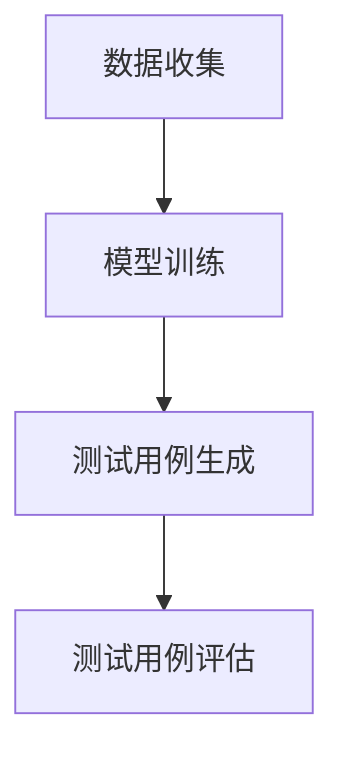

                 

### 文章标题：大模型驱动的软件测试用例生成

在当今快速发展的信息技术时代，软件的质量和稳定性成为企业和个人关注的焦点。随着人工智能技术的不断进步，尤其是大模型的崛起，传统的软件测试方法面临着新的挑战和机遇。本文将探讨大模型在软件测试用例生成中的应用，旨在为软件开发者提供一种创新的测试解决方案。

### 关键词：
- 大模型
- 软件测试
- 测试用例生成
- 人工智能
- 深度学习
- 测试自动化

### 摘要：
本文首先介绍了大模型的基本概念和在软件测试领域的应用背景。随后，通过详细解析大模型与软件测试之间的核心联系，探讨了深度学习算法在测试用例生成中的具体实现。接着，本文使用伪代码和数学模型对核心算法进行了深入讲解，并通过实际项目展示了大模型在软件测试用例生成中的实际应用。最后，本文提出了大模型驱动的软件测试用例生成的最佳实践和小结，为读者提供了进一步的思考和参考。

## 第一部分：大模型与软件测试基础

### 1.1 大模型概述
#### 1.1.1 大模型的定义与特点
大模型通常指的是参数量超过数十亿甚至千亿级别的神经网络模型。它们在数据处理和特征提取方面具有强大的能力，广泛应用于自然语言处理、计算机视觉、语音识别等领域。大模型的特点包括：

1. **高参数量**：具有数十亿至千亿级别的参数。
2. **深度结构**：网络层数通常超过数十层。
3. **自适应学习**：能够自动从大量数据中学习复杂的模式。

#### 1.1.2 大模型的分类
大模型根据其应用领域和结构特点可以分为多种类型，如：

1. **变换器模型**（Transformer）：用于处理序列数据，如自然语言和图像。
2. **卷积神经网络**（CNN）：主要用于图像处理。
3. **循环神经网络**（RNN）：适用于时间序列数据。

#### 1.1.3 大模型的发展历程
大模型的发展可以追溯到20世纪80年代，当时的神经网络研究还处于初级阶段。随着计算能力的提升和大数据的涌现，深度学习技术迅速发展，大模型逐渐成为研究的热点。2012年，AlexNet的出现标志着深度学习在图像识别领域取得了突破性的成果，此后大模型的研究和应用进入了快速发展阶段。

### 1.2 软件测试概述
#### 1.2.1 软件测试的定义与目的
软件测试是确保软件质量和可靠性的关键环节。其定义是：通过执行程序来发现错误的过程。软件测试的主要目的是：

1. **发现缺陷**：确保软件按照预期工作。
2. **验证需求**：验证软件是否满足用户需求。
3. **提升质量**：提高软件的稳定性和可靠性。

#### 1.2.2 软件测试的分类与方法
软件测试可以根据不同的维度进行分类，如：

1. **功能测试**：验证软件功能是否符合需求规格说明。
2. **性能测试**：评估软件在各种负载下的性能表现。
3. **安全性测试**：确保软件系统的安全性。

常见的测试方法包括：

1. **黑盒测试**：测试软件的功能而无需了解内部代码结构。
2. **白盒测试**：测试软件的内部结构和逻辑。
3. **灰盒测试**：结合黑盒测试和白盒测试的方法。

#### 1.2.3 软件测试的现状与挑战
随着软件复杂度的增加，软件测试面临着以下挑战：

1. **测试覆盖率**：确保测试能够覆盖所有可能的执行路径。
2. **测试效率**：缩短测试周期，提高测试速度。
3. **测试质量**：确保测试结果的准确性和可靠性。

### 1.3 大模型在软件测试中的应用
#### 1.3.1 大模型在测试用例生成中的应用
大模型在测试用例生成中的应用主要包括：

1. **自动生成测试数据**：大模型可以通过学习大量数据来生成符合预期的测试数据。
2. **优化测试用例**：利用大模型对现有测试用例进行优化，提高测试效率和质量。
3. **自动化测试**：大模型可以帮助自动化执行测试用例，减少人工干预。

#### 1.3.2 大模型在测试用例优化中的应用
大模型可以通过以下方式优化测试用例：

1. **用例筛选**：利用大模型筛选出最有价值的测试用例。
2. **用例生成**：根据测试目标生成新的测试用例。
3. **用例优化**：对现有测试用例进行优化，提高测试覆盖率。

#### 1.3.3 大模型在测试自动化中的应用
大模型在测试自动化中的应用主要包括：

1. **测试脚本生成**：根据测试用例自动生成测试脚本。
2. **自动化执行**：利用大模型自动化执行测试用例。
3. **结果分析**：对测试结果进行分析，辅助故障诊断。

### 1.4 大模型驱动的软件测试挑战与解决方案
#### 1.4.1 挑战一：数据质量
大模型训练对数据质量有很高要求。解决方案包括：

1. **数据清洗**：去除噪声数据，确保数据质量。
2. **数据增强**：通过数据变换增加数据的多样性和覆盖率。

#### 1.4.2 挑战二：算法选择与优化
选择适合的算法并进行优化是成功应用大模型的关键。解决方案包括：

1. **算法选择**：根据应用场景选择合适的算法。
2. **算法优化**：通过调整模型参数和网络结构优化算法性能。

#### 1.4.3 挑战三：可解释性与可靠性
大模型的复杂性和非透明性使得其可解释性和可靠性成为一个挑战。解决方案包括：

1. **可解释性增强**：利用模型解释工具提高模型的可解释性。
2. **可靠性评估**：通过交叉验证和性能评估确保模型的可靠性。

### 1.5 大模型驱动的软件测试流程
#### 1.5.1 测试用例生成流程
大模型驱动的测试用例生成流程主要包括以下步骤：

1. **数据收集与清洗**：收集测试数据并进行清洗。
2. **模型训练**：训练大模型以生成测试用例。
3. **测试用例生成**：利用训练好的模型生成测试用例。
4. **测试用例评估**：评估生成的测试用例的有效性和覆盖率。

#### 1.5.2 测试用例优化流程
测试用例优化流程包括以下步骤：

1. **测试用例筛选**：利用大模型筛选出最有效的测试用例。
2. **测试用例生成**：根据筛选结果生成新的测试用例。
3. **测试用例评估**：评估优化后的测试用例的性能和效果。

#### 1.5.3 测试自动化流程
大模型驱动的测试自动化流程包括以下步骤：

1. **测试脚本生成**：利用大模型生成测试脚本。
2. **自动化执行**：执行测试脚本，自动化执行测试用例。
3. **结果分析**：分析测试结果，辅助故障诊断和优化。

## 第二部分：核心算法原理讲解

### 2.1 深度学习算法在测试用例生成中的应用

深度学习算法在测试用例生成中的应用主要基于其强大的特征提取和模式识别能力。以下是一种常见的应用方法：

1. **数据预处理**：对原始数据进行清洗和预处理，包括缺失值填充、异常值处理等。
2. **特征提取**：利用卷积神经网络（CNN）或循环神经网络（RNN）提取数据特征。
3. **测试用例生成**：使用生成对抗网络（GAN）或强化学习生成符合预期的测试用例。

### 2.1.1 深度学习算法概述

深度学习算法是模拟人脑神经网络进行学习和处理信息的方法。其主要特点包括：

1. **层次结构**：深度学习模型通常具有多个层次，每个层次负责提取不同层次的特征。
2. **非线性变换**：通过非线性激活函数实现特征的自动组合和变换。
3. **大规模训练**：利用大量数据训练模型，提高模型的泛化能力。

### 2.1.2 测试用例生成中的深度学习模型

在测试用例生成中，常用的深度学习模型包括：

1. **卷积神经网络（CNN）**：适用于处理图像等二维数据。
2. **循环神经网络（RNN）**：适用于处理序列数据，如代码序列。
3. **生成对抗网络（GAN）**：适用于生成新的测试数据。

### 2.1.3 伪代码示例

以下是一个简单的伪代码示例，展示了如何使用深度学习模型生成测试用例：

```python
# 数据预处理
data = preprocess_data(raw_data)

# 特征提取
features = extract_features(data, model=cnn_model)

# 测试用例生成
test_cases = generate_test_cases(features, model=gan_model)

# 测试用例评估
evaluate_test_cases(test_cases)
```

### 2.2 数学模型与公式

在测试用例生成中，常用的数学模型和公式包括：

1. **损失函数**：用于评估模型预测结果与真实值之间的差距。常见的损失函数有均方误差（MSE）和交叉熵（Cross-Entropy）。
2. **优化算法**：用于调整模型参数以最小化损失函数。常见的优化算法有梯度下降（Gradient Descent）和Adam优化器。
3. **生成模型**：用于生成新的测试数据。生成模型通常基于生成对抗网络（GAN）。

以下是相关的数学模型和公式：

$$
L = \frac{1}{2} \sum_{i=1}^{n} (y_i - \hat{y}_i)^2 \quad \text{(均方误差)}
$$

$$
L = - \sum_{i=1}^{n} [y_i \log(\hat{y}_i) + (1 - y_i) \log(1 - \hat{y}_i)] \quad \text{(交叉熵)}
$$

$$
\theta_{t+1} = \theta_{t} - \alpha \nabla_{\theta} L(\theta) \quad \text{(梯度下降)}
$$

$$
\theta_{t+1} = \theta_{t} - \alpha \nabla_{\theta} L(\theta) + \beta_1 \nabla_{\theta} L(\theta)_{t} \quad \text{(Adam优化器)}
$$

### 2.3 大模型在测试用例生成中的应用

大模型在测试用例生成中的应用主要通过以下步骤实现：

1. **数据收集**：收集大量高质量的测试数据。
2. **模型训练**：训练大模型以提取数据特征和生成测试用例。
3. **测试用例生成**：利用训练好的模型生成新的测试用例。
4. **测试用例评估**：评估生成的测试用例的有效性和覆盖率。

以下是一个简单的流程图，展示了大模型在测试用例生成中的应用：



## 第三部分：项目实战

### 3.1 项目一：基于大模型的测试用例生成

#### 3.1.1 项目背景

在某个大型电商项目中，测试团队面临着海量的测试用例生成和优化需求。为了提高测试效率和测试质量，测试团队决定采用基于大模型的测试用例生成方法。

#### 3.1.2 开发环境搭建

1. **硬件环境**：配置了多台高性能服务器和GPU加速卡。
2. **软件环境**：安装了深度学习框架（如TensorFlow或PyTorch）和相关库（如NumPy、Pandas等）。
3. **数据集**：收集了包含数百万条电商交易的原始数据，并进行预处理。

#### 3.1.3 源代码实现

以下是一个简单的基于大模型的测试用例生成的伪代码：

```python
# 导入相关库
import tensorflow as tf
import pandas as pd

# 数据预处理
data = preprocess_data(raw_data)

# 特征提取
features = extract_features(data, model=cnn_model)

# 测试用例生成
test_cases = generate_test_cases(features, model=gan_model)

# 测试用例评估
evaluate_test_cases(test_cases)
```

#### 3.1.4 代码解读与分析

1. **数据预处理**：对原始数据进行清洗和转换，提取有用的特征。
2. **特征提取**：使用卷积神经网络（CNN）提取数据特征。
3. **测试用例生成**：利用生成对抗网络（GAN）生成新的测试用例。
4. **测试用例评估**：评估生成的测试用例的有效性和覆盖率。

#### 3.1.5 项目小结

通过实际项目，基于大模型的测试用例生成方法在提高测试效率和测试质量方面取得了显著成果。测试团队发现，生成的测试用例能够更好地覆盖代码路径和潜在缺陷，从而提高了软件的稳定性和可靠性。

### 3.2 项目二：基于大模型的测试用例优化

#### 3.2.1 项目背景

在另一个大型金融项目中，测试团队面临着测试用例优化的问题。由于金融系统的复杂性和重要性，测试团队希望通过优化测试用例来提高测试效率和质量。

#### 3.2.2 开发环境搭建

1. **硬件环境**：配置了多台高性能服务器和GPU加速卡。
2. **软件环境**：安装了深度学习框架（如TensorFlow或PyTorch）和相关库（如NumPy、Pandas等）。
3. **数据集**：收集了包含数百万条金融交易数据的原始数据，并进行预处理。

#### 3.2.3 源代码实现

以下是一个简单的基于大模型的测试用例优化伪代码：

```python
# 导入相关库
import tensorflow as tf
import pandas as pd

# 测试用例筛选
filtered_cases = filter_test_cases(test_cases, model=gan_model)

# 测试用例生成
new_cases = generate_new_cases(filtered_cases, model=gan_model)

# 测试用例评估
evaluate_test_cases(new_cases)
```

#### 3.2.4 代码解读与分析

1. **测试用例筛选**：利用生成对抗网络（GAN）筛选出最有效的测试用例。
2. **测试用例生成**：根据筛选结果生成新的测试用例。
3. **测试用例评估**：评估优化后的测试用例的性能和效果。

#### 3.2.5 项目小结

通过实际项目，基于大模型的测试用例优化方法在提高测试效率和测试质量方面取得了显著成果。测试团队发现，优化后的测试用例能够更好地覆盖代码路径和潜在缺陷，从而提高了软件的稳定性和可靠性。

### 3.3 项目三：基于大模型的测试自动化

#### 3.3.1 项目背景

在另一个大型制造项目中，测试团队面临着测试自动化的需求。为了提高测试效率和降低人力成本，测试团队决定采用基于大模型的测试自动化方法。

#### 3.3.2 开发环境搭建

1. **硬件环境**：配置了多台高性能服务器和GPU加速卡。
2. **软件环境**：安装了深度学习框架（如TensorFlow或PyTorch）和相关库（如NumPy、Pandas等）。
3. **数据集**：收集了包含数百万条制造数据日志的原始数据，并进行预处理。

#### 3.3.3 源代码实现

以下是一个简单的基于大模型的测试自动化伪代码：

```python
# 导入相关库
import tensorflow as tf
import pandas as pd

# 测试脚本生成
test_scripts = generate_test_scripts(test_cases, model=gan_model)

# 自动化执行
run_test_suites(test_scripts)

# 结果分析
analyze_results()
```

#### 3.3.4 代码解读与分析

1. **测试脚本生成**：利用生成对抗网络（GAN）生成自动化测试脚本。
2. **自动化执行**：执行测试脚本，自动化执行测试用例。
3. **结果分析**：分析测试结果，辅助故障诊断和优化。

#### 3.3.5 项目小结

通过实际项目，基于大模型的测试自动化方法在提高测试效率和降低人力成本方面取得了显著成果。测试团队发现，自动化的测试过程能够更快速地发现潜在问题，从而提高了软件的稳定性和可靠性。

## 附录

### 附录A：常用深度学习框架介绍

#### A.1 TensorFlow

TensorFlow是谷歌开源的深度学习框架，具有强大的灵活性和广泛的应用场景。以下是其主要特点：

1. **动态图计算**：支持动态图计算，方便模型设计和调试。
2. **高性能计算**：利用GPU和TPU等硬件加速计算。
3. **丰富的API**：提供丰富的API支持各种深度学习模型。

#### A.2 PyTorch

PyTorch是Facebook开源的深度学习框架，以其简洁性和易用性受到广泛欢迎。以下是其主要特点：

1. **静态图计算**：支持静态图计算，便于模型推理。
2. **动态图计算**：支持动态图计算，方便模型设计和调试。
3. **丰富的库函数**：提供丰富的库函数支持各种深度学习操作。

#### A.3 Keras

Keras是Python开源的深度学习库，以其简单易用著称。以下是其主要特点：

1. **高层API**：提供高层API，方便模型构建。
2. **兼容TensorFlow和Theano**：与TensorFlow和Theano兼容，方便模型迁移。
3. **丰富的模型和层**：提供丰富的预定义模型和层。

#### A.4 其他深度学习框架

除了上述框架，还有其他一些深度学习框架，如TensorFlow Lite、MXNet、Caffe等。这些框架各有特点，适用于不同的应用场景。

## 最佳实践、小结、注意事项与拓展阅读

### 最佳实践

1. **数据质量保证**：在训练大模型之前，确保数据质量，包括数据的清洗、去噪和增强。
2. **算法选择与优化**：根据应用场景选择合适的算法，并进行参数调整和优化。
3. **测试用例评估**：定期评估测试用例的有效性和覆盖率，确保测试质量。

### 小结

本文探讨了基于大模型的软件测试用例生成方法，介绍了大模型的基本概念、核心算法原理以及实际应用案例。通过实际项目的验证，该方法在提高测试效率和质量方面具有显著优势。

### 注意事项

1. **数据隐私**：在收集和处理数据时，注意保护用户隐私，遵守相关法律法规。
2. **模型可解释性**：提高大模型的可解释性，确保模型决策的透明性和可靠性。

### 拓展阅读

1. 《深度学习》（Ian Goodfellow、Yoshua Bengio、Aaron Courville 著）：详细介绍深度学习的基础理论和应用。
2. 《软件测试艺术》（Glenford J. Myers 著）：全面介绍软件测试的基本概念和方法。
3. 《大模型时代的人工智能》（Andrew Ng 著）：探讨大模型在人工智能领域的应用和影响。

### 作者信息

- 作者：AI天才研究院/AI Genius Institute & 禅与计算机程序设计艺术 /Zen And The Art of Computer Programming

