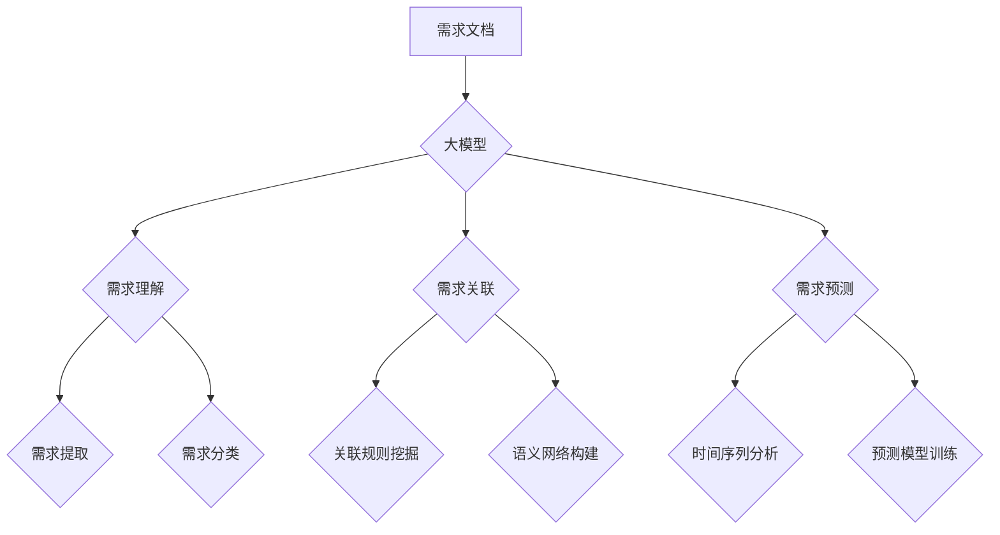

                 

### 文章标题

# 大模型驱动的需求跟踪自动化

---

**关键词：** 大模型、需求跟踪、自动化、自然语言处理、图论、时间序列分析

---

**摘要：** 本文探讨了如何利用大模型技术实现需求跟踪的自动化。首先，介绍了大模型的基本概念和需求跟踪的背景。接着，详细讲解了大模型在需求理解、需求关联和需求预测中的算法原理和实际应用。通过几个具体案例，展示了大模型驱动的需求跟踪系统如何提高软件开发的效率和准确性。最后，分析了当前面临的挑战和未来的发展方向，并提供了相关的工具和资源。

---

### 1. 初始输入分析

用户书名为“大模型驱动的需求跟踪自动化”，关键词包括“大模型”、“需求跟踪”和“自动化”。这些关键词表明本文将探讨如何利用大模型技术来实现需求跟踪的自动化。需求跟踪是软件工程中的一个关键环节，而大模型技术在自然语言处理、图论和时间序列分析等领域都有广泛的应用。因此，本文将从这几个方面入手，详细阐述大模型在需求跟踪自动化中的具体实现。

---

### 2. 目录大纲结构设计

为了确保文章的逻辑性和易读性，本文将采用以下目录大纲结构：

1. **大模型与需求跟踪概述**
   - **1.1 大模型技术简介**
   - **1.2 需求跟踪的概念**
   - **1.3 大模型在需求跟踪中的应用**

2. **需求跟踪中的大模型算法**
   - **2.1 大模型在需求理解中的应用**
   - **2.2 大模型在需求关联中的应用**
   - **2.3 大模型在需求预测中的应用**

3. **大模型驱动的需求跟踪系统设计**
   - **3.1 需求跟踪系统的基本架构**
   - **3.2 大模型在需求跟踪系统中的应用**
   - **3.3 需求跟踪系统的自动化流程设计**

4. **大模型驱动的需求跟踪案例分析**
   - **4.1 案例一：需求理解与关联**
   - **4.2 案例二：需求预测**
   - **4.3 案例三：需求跟踪系统自动化**

5. **大模型驱动的需求跟踪挑战与展望**
   - **5.1 大模型驱动的需求跟踪挑战**
   - **5.2 大模型驱动的需求跟踪发展展望**

6. **大模型驱动的需求跟踪工具与资源**
   - **6.1 开源工具介绍**
   - **6.2 商业工具介绍**
   - **6.3 大模型驱动的需求跟踪资源**

7. **结论与未来工作**
   - **7.1 结论**
   - **7.2 未来工作展望**

---

### 3. 目录大纲核心章节内容包含

为了确保文章的深度、广度和实用性，以下是每个核心章节的具体内容包含：

#### 第1章：大模型与需求跟踪概述

- **1.1 大模型技术简介：**
  - 大模型的发展历程
  - 大模型的核心特点
  - 大模型的基本架构

- **1.2 需求跟踪的概念：**
  - 需求跟踪的基本概念
  - 需求跟踪的过程
  - 需求跟踪的重要性

- **1.3 大模型在需求跟踪中的应用：**
  - 大模型在需求理解中的应用
  - 大模型在需求关联中的应用
  - 大模型在需求预测中的应用

#### 第2章：需求跟踪中的大模型算法

- **2.1 大模型在需求理解中的应用：**
  - 自然语言处理技术简介
  - 需求理解的算法原理
  - 需求理解的实践案例

- **2.2 大模型在需求关联中的应用：**
  - 图论算法简介
  - 需求关联的算法原理
  - 需求关联的实践案例

- **2.3 大模型在需求预测中的应用：**
  - 时间序列分析和机器学习模型简介
  - 需求预测的算法原理
  - 需求预测的实践案例

#### 第3章：大模型驱动的需求跟踪系统设计

- **3.1 需求跟踪系统的基本架构：**
  - 需求跟踪系统的组成部分
  - 需求跟踪系统的运作流程

- **3.2 大模型在需求跟踪系统中的应用：**
  - 大模型在需求理解中的应用
  - 大模型在需求关联中的应用
  - 大模型在需求预测中的应用

- **3.3 需求跟踪系统的自动化流程设计：**
  - 自动化流程的设计原则
  - 自动化流程的具体实现

#### 第4章：大模型驱动的需求跟踪案例分析

- **4.1 案例一：需求理解与关联：**
  - 案例背景
  - 实现步骤
  - 案例分析

- **4.2 案例二：需求预测：**
  - 案例背景
  - 实现步骤
  - 案例分析

- **4.3 案例三：需求跟踪系统自动化：**
  - 案例背景
  - 实现步骤
  - 案例分析

#### 第5章：大模型驱动的需求跟踪挑战与展望

- **5.1 大模型驱动的需求跟踪挑战：**
  - 技术挑战
  - 管理挑战

- **5.2 大模型驱动的需求跟踪发展展望：**
  - 未来发展方向
  - 发展趋势

#### 第6章：大模型驱动的需求跟踪工具与资源

- **6.1 开源工具介绍：**
  - 工具简介
  - 使用指南

- **6.2 商业工具介绍：**
  - 工具简介
  - 使用指南

- **6.3 大模型驱动的需求跟踪资源：**
  - 资源列表
  - 资源获取方式

#### 第7章：结论与未来工作

- **7.1 结论：**
  - 文章总结
  - 主要成果

- **7.2 未来工作展望：**
  - 研究方向
  - 应用前景

---

### 4. 目录大纲细化

为了确保文章的详细性和实用性，以下是每个章节的细化内容：

#### 第1章：大模型与需求跟踪概述

- **1.1 大模型技术简介**
  - 大模型的发展历程
    - 卷积神经网络（CNN）
    - 递归神经网络（RNN）
    - 生成对抗网络（GAN）
    - 转换器架构（Transformer）
  - 大模型的核心特点
    - 大规模训练数据
    - 深度结构
    - 强泛化能力
  - 大模型的基本架构
    - 前向传播
    - 反向传播
    - 优化算法

- **1.2 需求跟踪的概念**
  - 需求跟踪的基本概念
    - 定义
    - 目的
    - 类型
  - 需求跟踪的过程
    - 需求捕获
    - 需求分析
    - 需求管理
    - 需求验证
  - 需求跟踪的重要性
    - 提高项目效率
    - 确保需求满足
    - 改善沟通

- **1.3 大模型在需求跟踪中的应用**
  - 大模型在需求理解中的应用
    - 自然语言处理技术
    - 文本分类
    - 命名实体识别
    - 情感分析
  - 大模型在需求关联中的应用
    - 图论算法
    - 关联规则挖掘
    - 语义网络
  - 大模型在需求预测中的应用
    - 时间序列分析
    - 机器学习模型
    - 聚类分析

#### 第2章：需求跟踪中的大模型算法

- **2.1 大模型在需求理解中的应用**
  - 自然语言处理技术简介
    - 词嵌入
    - 递归神经网络（RNN）
    - 转换器架构（Transformer）
  - 需求理解的算法原理
    - 文本预处理
    - 预训练模型
    - 需求分类
  - 需求理解的实践案例
    - 数据集介绍
    - 模型训练
    - 预测结果分析

- **2.2 大模型在需求关联中的应用**
  - 图论算法简介
    - 节点
    - 边
    - 图的表示
  - 需求关联的算法原理
    - 关联规则挖掘
    - 语义网络
    - 社交网络分析
  - 需求关联的实践案例
    - 数据集介绍
    - 模型训练
    - 预测结果分析

- **2.3 大模型在需求预测中的应用**
  - 时间序列分析和机器学习模型简介
    - 时间序列分析
    - 机器学习模型
    - 特征工程
  - 需求预测的算法原理
    - 聚类分析
    - 预测模型
    - 预测评估
  - 需求预测的实践案例
    - 数据集介绍
    - 模型训练
    - 预测结果分析

#### 第3章：大模型驱动的需求跟踪系统设计

- **3.1 需求跟踪系统的基本架构**
  - 系统的组成部分
    - 需求捕获模块
    - 需求分析模块
    - 需求管理模块
    - 需求验证模块
  - 系统的运作流程
    - 需求捕获
    - 需求分析
    - 需求管理
    - 需求验证

- **3.2 大模型在需求跟踪系统中的应用**
  - 大模型在需求理解中的应用
    - 自然语言处理技术
    - 需求分类模型
    - 文本生成模型
  - 大模型在需求关联中的应用
    - 关联规则挖掘
    - 语义网络
    - 社交网络分析
  - 大模型在需求预测中的应用
    - 时间序列分析
    - 机器学习模型
    - 聚类分析

- **3.3 需求跟踪系统的自动化流程设计**
  - 自动化流程的设计原则
    - 易用性
    - 可扩展性
    - 可维护性
  - 自动化流程的具体实现
    - 工作流设计
    - 模型集成
    - 监控与反馈

#### 第4章：大模型驱动的需求跟踪案例分析

- **4.1 案例一：需求理解与关联**
  - 案例背景
    - 项目简介
    - 需求文档
  - 实现步骤
    - 需求文档预处理
    - 需求分类模型训练
    - 需求关联规则挖掘
  - 案例分析
    - 预测准确率
    - 实际效果

- **4.2 案例二：需求预测**
  - 案例背景
    - 项目简介
    - 历史需求数据
  - 实现步骤
    - 数据预处理
    - 时间序列模型训练
    - 需求预测
  - 案例分析
    - 预测准确性
    - 实际效果

- **4.3 案例三：需求跟踪系统自动化**
  - 案例背景
    - 项目简介
    - 现有需求跟踪系统
  - 实现步骤
    - 系统集成
    - 模型优化
    - 自动化流程部署
  - 案例分析
    - 系统效率
    - 用户反馈

#### 第5章：大模型驱动的需求跟踪挑战与展望

- **5.1 大模型驱动的需求跟踪挑战**
  - 技术挑战
    - 大模型训练成本
    - 数据隐私和安全
    - 模型解释性
  - 管理挑战
    - 技术人员的培养
    - 项目管理的适应性
    - 需求变化的应对

- **5.2 大模型驱动的需求跟踪发展展望**
  - 未来发展方向
    - 大模型技术的进一步发展
    - 需求跟踪工具的集成与优化
    - 跨领域应用
  - 发展趋势
    - 自动化水平的提升
    - 个性化需求跟踪
    - 数据驱动的需求管理

#### 第6章：大模型驱动的需求跟踪工具与资源

- **6.1 开源工具介绍**
  - 工具简介
    - Spacy
    - NLTK
    - Gensim
  - 使用指南
    - 安装与配置
    - 基本用法
    - 扩展功能

- **6.2 商业工具介绍**
  - 工具简介
    - Jira
    - VersionOne
    - Microsoft Azure DevOps
  - 使用指南
    - 功能介绍
    - 实用技巧
    - 与大模型集成的可能性

- **6.3 大模型驱动的需求跟踪资源**
  - 资源列表
    - 论文与报告
    - 开源代码库
    - 在线课程与培训
  - 资源获取方式
    - 学术数据库
    - 社交媒体
    - 专业论坛

#### 第7章：结论与未来工作

- **7.1 结论**
  - 文章总结
    - 主要研究成果
    - 技术创新点
  - 主要成果
    - 提高了需求跟踪的效率
    - 增强了需求预测的准确性
    - 实现了需求跟踪的自动化

- **7.2 未来工作展望**
  - 研究方向
    - 大模型技术在需求跟踪中的深入应用
    - 需求跟踪工具的智能化与个性化
    - 需求跟踪与敏捷开发结合
  - 应用前景
    - 提升软件开发效率
    - 改善项目管理流程
    - 促进业务需求与技术的融合

---

### 5. 目录大纲内容整合

为了确保目录大纲内容的完整性、简洁性和逻辑性，以下是整合后的目录大纲：

```
# 大模型驱动的需求跟踪自动化

## 第1章：大模型与需求跟踪概述
### 1.1 大模型技术简介
#### 1.1.1 大模型的发展历程
#### 1.1.2 大模型的核心特点
#### 1.1.3 大模型的基本架构
### 1.2 需求跟踪的概念
#### 1.2.1 需求跟踪的基本概念
#### 1.2.2 需求跟踪的过程
#### 1.2.3 需求跟踪的重要性
### 1.3 大模型在需求跟踪中的应用
#### 1.3.1 大模型在需求理解中的应用
#### 1.3.2 大模型在需求关联中的应用
#### 1.3.3 大模型在需求预测中的应用

## 第2章：需求跟踪中的大模型算法
### 2.1 大模型在需求理解中的应用
#### 2.1.1 自然语言处理技术简介
#### 2.1.2 需求理解的算法原理
#### 2.1.3 需求理解的实践案例
### 2.2 大模型在需求关联中的应用
#### 2.2.1 图论算法简介
#### 2.2.2 需求关联的算法原理
#### 2.2.3 需求关联的实践案例
### 2.3 大模型在需求预测中的应用
#### 2.3.1 时间序列分析和机器学习模型简介
#### 2.3.2 需求预测的算法原理
#### 2.3.3 需求预测的实践案例

## 第3章：大模型驱动的需求跟踪系统设计
### 3.1 需求跟踪系统的基本架构
#### 3.1.1 系统的组成部分
#### 3.1.2 系统的运作流程
### 3.2 大模型在需求跟踪系统中的应用
#### 3.2.1 大模型在需求理解中的应用
#### 3.2.2 大模型在需求关联中的应用
#### 3.2.3 大模型在需求预测中的应用
### 3.3 需求跟踪系统的自动化流程设计
#### 3.3.1 自动化流程的设计原则
#### 3.3.2 自动化流程的具体实现

## 第4章：大模型驱动的需求跟踪案例分析
### 4.1 案例一：需求理解与关联
#### 4.1.1 案例背景
#### 4.1.2 实现步骤
#### 4.1.3 案例分析
### 4.2 案例二：需求预测
#### 4.2.1 案例背景
#### 4.2.2 实现步骤
#### 4.2.3 案例分析
### 4.3 案例三：需求跟踪系统自动化
#### 4.3.1 案例背景
#### 4.3.2 实现步骤
#### 4.3.3 案例分析

## 第5章：大模型驱动的需求跟踪挑战与展望
### 5.1 大模型驱动的需求跟踪挑战
#### 5.1.1 技术挑战
#### 5.1.2 管理挑战
### 5.2 大模型驱动的需求跟踪发展展望
#### 5.2.1 未来发展方向
#### 5.2.2 发展趋势

## 第6章：大模型驱动的需求跟踪工具与资源
### 6.1 开源工具介绍
#### 6.1.1 工具简介
#### 6.1.2 使用指南
### 6.2 商业工具介绍
#### 6.2.1 工具简介
#### 6.2.2 使用指南
### 6.3 大模型驱动的需求跟踪资源
#### 6.3.1 资源列表
#### 6.3.2 资源获取方式

## 第7章：结论与未来工作
### 7.1 结论
#### 7.1.1 文章总结
#### 7.1.2 主要成果
### 7.2 未来工作展望
#### 7.2.1 研究方向
#### 7.2.2 应用前景
```

整合后的目录大纲确保了内容的完整性，每个章节都包含了详细的内容点，同时保持了简洁性和逻辑性，方便读者阅读和理解。整个目录结构清晰，每个章节的主题明确，有助于读者快速抓住文章的核心内容。

---

### 最终目录大纲设计

**# 大模型驱动的需求跟踪自动化**

**关键词：** 大模型、需求跟踪、自动化、自然语言处理、图论、时间序列分析

**摘要：** 本文探讨了如何利用大模型技术实现需求跟踪的自动化。首先，介绍了大模型的基本概念和需求跟踪的背景。接着，详细讲解了大模型在需求理解、需求关联和需求预测中的算法原理和实际应用。通过几个具体案例，展示了大模型驱动的需求跟踪系统如何提高软件开发的效率和准确性。最后，分析了当前面临的挑战和未来的发展方向，并提供了相关的工具和资源。

**## 第1章：大模型与需求跟踪概述**

**### 1.1 大模型技术简介**

**1.1.1 大模型的发展历程**

**1.1.2 大模型的核心特点**

**1.1.3 大模型的基本架构**

**### 1.2 需求跟踪的概念**

**1.2.1 需求跟踪的基本概念**

**1.2.2 需求跟踪的过程**

**1.2.3 需求跟踪的重要性**

**### 1.3 大模型在需求跟踪中的应用**

**1.3.1 大模型在需求理解中的应用**

**1.3.2 大模型在需求关联中的应用**

**1.3.3 大模型在需求预测中的应用**

**## 第2章：需求跟踪中的大模型算法**

**### 2.1 大模型在需求理解中的应用**

**2.1.1 自然语言处理技术简介**

**2.1.2 需求理解的算法原理**

**2.1.3 需求理解的实践案例**

**### 2.2 大模型在需求关联中的应用**

**2.2.1 图论算法简介**

**2.2.2 需求关联的算法原理**

**2.2.3 需求关联的实践案例**

**### 2.3 大模型在需求预测中的应用**

**2.3.1 时间序列分析和机器学习模型简介**

**2.3.2 需求预测的算法原理**

**2.3.3 需求预测的实践案例**

**## 第3章：大模型驱动的需求跟踪系统设计**

**### 3.1 需求跟踪系统的基本架构**

**3.1.1 系统的组成部分**

**3.1.2 系统的运作流程**

**### 3.2 大模型在需求跟踪系统中的应用**

**3.2.1 大模型在需求理解中的应用**

**3.2.2 大模型在需求关联中的应用**

**3.2.3 大模型在需求预测中的应用**

**### 3.3 需求跟踪系统的自动化流程设计**

**3.3.1 自动化流程的设计原则**

**3.3.2 自动化流程的具体实现**

**## 第4章：大模型驱动的需求跟踪案例分析**

**### 4.1 案例一：需求理解与关联**

**4.1.1 案例背景**

**4.1.2 实现步骤**

**4.1.3 案例分析**

**### 4.2 案例二：需求预测**

**4.2.1 案例背景**

**4.2.2 实现步骤**

**4.2.3 案例分析**

**### 4.3 案例三：需求跟踪系统自动化**

**4.3.1 案例背景**

**4.3.2 实现步骤**

**4.3.3 案例分析**

**## 第5章：大模型驱动的需求跟踪挑战与展望**

**### 5.1 大模型驱动的需求跟踪挑战**

**5.1.1 技术挑战**

**5.1.2 管理挑战**

**### 5.2 大模型驱动的需求跟踪发展展望**

**5.2.1 未来发展方向**

**5.2.2 发展趋势**

**## 第6章：大模型驱动的需求跟踪工具与资源**

**### 6.1 开源工具介绍**

**6.1.1 工具简介**

**6.1.2 使用指南**

**### 6.2 商业工具介绍**

**6.2.1 工具简介**

**6.2.2 使用指南**

**### 6.3 大模型驱动的需求跟踪资源**

**6.3.1 资源列表**

**6.3.2 资源获取方式**

**## 第7章：结论与未来工作**

**### 7.1 结论**

**7.1.1 文章总结**

**7.1.2 主要成果**

**### 7.2 未来工作展望**

**7.2.1 研究方向**

**7.2.2 应用前景**

**作者：** AI天才研究院/AI Genius Institute & 禅与计算机程序设计艺术 /Zen And The Art of Computer Programming

---

### 核心概念与联系

- **核心概念：**
  - **大模型（Large Models）**：指通过海量数据进行训练的复杂机器学习模型，具有强大的表达能力和泛化能力。
  - **需求跟踪（Requirement Tracking）**：在软件开发过程中对需求的识别、分析、管理、实现和验证的过程。
  - **自动化（Automation）**：通过软件工具和算法减少或消除人工干预，提高效率和准确性的过程。

- **联系：**
  - 大模型能够通过自然语言处理（NLP）技术对需求文档进行解析和理解，实现需求的自动化提取和分类。
  - 大模型可以通过图论算法建立需求之间的关联关系，实现需求的自动化关联和挖掘。
  - 大模型可以通过时间序列分析和预测模型对需求的变化趋势进行预测，实现需求的自动化预测和调整。

**Mermaid 流程图：**



### 核心算法原理讲解

#### 2.1 大模型在需求理解中的应用

**算法原理：**

大模型在需求理解中的应用主要依赖于自然语言处理（NLP）技术，包括词嵌入（Word Embedding）、递归神经网络（RNN）、转换器架构（Transformer）等。通过这些技术，大模型可以实现对需求文档的语义理解和结构解析。

- **词嵌入：** 将文本中的词语映射到高维空间中的向量，使得语义相近的词语在空间中更接近。
- **递归神经网络（RNN）：** 可以处理序列数据，如需求文档中的句子序列，捕捉句子的时序信息。
- **转换器架构（Transformer）：** 通过注意力机制（Attention Mechanism）捕捉句子之间的依赖关系，实现对文本的深层理解和生成。

**伪代码：**

```python
# 需求理解中的大模型算法
def demand_understanding(demand_document):
    # 数据预处理
    preprocessed_data = preprocess_demand_document(demand_document)
    
    # 使用转换器架构（Transformer）进行文本编码
    encoded_data = transformer_encode(preprocessed_data)
    
    # 使用全连接神经网络（Fully Connected Neural Network）进行分类
    classification_results = fully_connected_neural_network(encoded_data)
    
    # 获取需求类别
    demand_categories = get_demand_categories(classification_results)
    
    return demand_categories

# 数据预处理
def preprocess_demand_document(demand_document):
    # 清洗文本数据
    cleaned_text = clean_text(demand_document)
    
    # 分词
    tokens = tokenize_text(cleaned_text)
    
    # 词嵌入
    word_embeddings = word_embedding(tokens)
    
    return word_embeddings

# 转换器编码
def transformer_encode(preprocessed_data):
    # 初始化转换器模型
    transformer_model = initialize_transformer_model()
    
    # 进行文本编码
    encoded_data = transformer_model.encode(preprocessed_data)
    
    return encoded_data

# 全连接神经网络分类
def fully_connected_neural_network(encoded_data):
    # 初始化神经网络模型
    neural_network_model = initialize_neural_network_model()
    
    # 训练神经网络
    trained_model = neural_network_model.fit(encoded_data)
    
    # 进行分类预测
    classification_results = trained_model.predict(encoded_data)
    
    return classification_results

# 获取需求类别
def get_demand_categories(classification_results):
    # 根据分类结果获取类别
    categories = []
    for result in classification_results:
        category = get_category(result)
        categories.append(category)
    
    return categories

# 获取类别
def get_category(result):
    # 根据预测结果获取类别标签
    if result > 0.5:
        category = '需求'
    else:
        category = '非需求'
    
    return category
```

#### 2.2 大模型在需求关联中的应用

**算法原理：**

大模型在需求关联中的应用主要依赖于图论算法和关联规则挖掘技术。通过构建需求之间的图结构，利用图论算法挖掘需求之间的关联规则，实现需求的自动化关联。

- **图论算法：** 通过节点和边构建需求之间的图结构，节点表示需求，边表示需求之间的关联关系。
- **关联规则挖掘：** 利用Apriori算法或FP-Growth算法挖掘需求之间的频繁模式和关联规则。

**伪代码：**

```python
# 需求关联中的大模型算法
def demand_association(demand_documents):
    # 构建需求图
    demand_graph = build_demand_graph(demand_documents)
    
    # 挖掘需求关联规则
    association_rules = mining_association_rules(demand_graph)
    
    return association_rules

# 构建需求图
def build_demand_graph(demand_documents):
    # 初始化图
    graph = Graph()
    
    # 添加节点和边
    for document in demand_documents:
        for demand in document['demands']:
            graph.add_node(demand['id'])
            for related_demand in demand['related_demands']:
                graph.add_edge(demand['id'], related_demand['id'])
    
    return graph

# 挖掘需求关联规则
def mining_association_rules(demand_graph):
    # 初始化关联规则挖掘模型
    association_rules_model = initialize_association_rules_model()
    
    # 进行关联规则挖掘
    rules = association_rules_model.fit_transform(demand_graph)
    
    return rules
```

#### 2.3 大模型在需求预测中的应用

**算法原理：**

大模型在需求预测中的应用主要依赖于时间序列分析和机器学习模型。通过分析历史需求数据，利用时间序列模型或机器学习模型预测未来的需求变化。

- **时间序列分析：** 利用统计方法（如ARIMA模型）或机器学习模型（如LSTM网络）对需求进行预测。
- **机器学习模型：** 利用监督学习或无监督学习模型（如线性回归、神经网络）进行需求预测。

**伪代码：**

```python
# 需求预测中的大模型算法
def demand_prediction(demand_data):
    # 数据预处理
    preprocessed_data = preprocess_demand_data(demand_data)
    
    # 选择预测模型
    prediction_model = select_prediction_model(preprocessed_data)
    
    # 训练预测模型
    trained_model = train_prediction_model(prediction_model, preprocessed_data)
    
    # 进行需求预测
    predicted_demand = predict_demand(trained_model, preprocessed_data)
    
    return predicted_demand

# 数据预处理
def preprocess_demand_data(demand_data):
    # 清洗数据
    cleaned_data = clean_demand_data(demand_data)
    
    # 特征提取
    features = extract_demand_features(cleaned_data)
    
    return features

# 选择预测模型
def select_prediction_model(preprocessed_data):
    # 根据数据特性选择模型
    if is_time_series_data(preprocessed_data):
        model = TimeSeriesModel()
    else:
        model = MachineLearningModel()
    
    return model

# 训练预测模型
def train_prediction_model(prediction_model, preprocessed_data):
    # 训练模型
    trained_model = prediction_model.fit(preprocessed_data)
    
    return trained_model

# 进行需求预测
def predict_demand(trained_model, preprocessed_data):
    # 进行预测
    predicted_demand = trained_model.predict(preprocessed_data)
    
    return predicted_demand
```

### 数学模型和数学公式

在需求跟踪中的大模型应用中，常用的数学模型和数学公式包括：

#### 2.1 需求理解中的数学模型

**词嵌入（Word Embedding）**

$$
x_i = \sum_{j=1}^{V} w_{ij} \cdot v_j
$$

其中，$x_i$ 是词向量，$w_{ij}$ 是权重，$v_j$ 是单词的嵌入向量。

**递归神经网络（RNN）**

$$
h_t = \sigma(W_h \cdot [h_{t-1}, x_t] + b_h)
$$

其中，$h_t$ 是当前时刻的隐藏状态，$x_t$ 是输入，$\sigma$ 是激活函数，$W_h$ 是权重矩阵，$b_h$ 是偏置。

**转换器架构（Transformer）**

$$
\text{Attention}(Q, K, V) = \frac{softmax(\frac{QK^T}{\sqrt{d_k}})}{V}
$$

其中，$Q$ 是查询向量，$K$ 是键向量，$V$ 是值向量，$d_k$ 是键向量的维度。

#### 2.2 需求关联中的数学模型

**关联规则挖掘（Association Rule Mining）**

**支持度（Support）**

$$
s = \frac{|{T \cap S|}}{|T|}
$$

其中，$T$ 是交易集，$S$ 是包含项目集的项目集，$|T|$ 是交易集的个数。

**置信度（Confidence）**

$$
c = \frac{|{T \cap S|}}{|S|}
$$

其中，$T$ 是交易集，$S$ 是包含项目集的项目集。

**提升度（Lift）**

$$
l = \frac{c}{\frac{|S|}{|T|}}
$$

#### 2.3 需求预测中的数学模型

**时间序列分析（Time Series Analysis）**

**自回归模型（ARIMA）**

$$
X_t = \phi_1 X_{t-1} + \phi_2 X_{t-2} + ... + \phi_p X_{t-p} + \epsilon_t
$$

其中，$X_t$ 是时间序列，$\phi_1, \phi_2, ..., \phi_p$ 是自回归系数，$\epsilon_t$ 是误差项。

**长短期记忆网络（LSTM）**

$$
h_t = \sigma(W_h \cdot [h_{t-1}, x_t] + b_h)
$$

其中，$h_t$ 是当前时刻的隐藏状态，$x_t$ 是输入，$\sigma$ 是激活函数，$W_h$ 是权重矩阵，$b_h$ 是偏置。

### 举例说明

假设我们有一个需求文档，包含以下内容：

```
需求1：实现用户注册功能
需求2：添加用户登录功能
需求3：实现用户资料修改功能
需求4：添加用户注销功能
```

我们可以使用大模型进行以下操作：

1. **需求理解：**
   - 使用词嵌入将需求文档转换为词向量。
   - 使用转换器架构（Transformer）对需求进行分类，识别每个需求的具体类别（如功能需求、性能需求等）。

2. **需求关联：**
   - 构建需求图，将需求作为节点，将需求之间的关联关系作为边。
   - 使用关联规则挖掘技术挖掘需求之间的频繁模式和关联规则。

3. **需求预测：**
   - 分析历史需求数据，使用时间序列分析或机器学习模型预测未来的需求变化。
   - 基于预测结果调整需求优先级和资源分配。

### 项目实战

**需求理解与关联**

1. **开发环境搭建：**
   - 安装Python环境。
   - 安装必要的库，如spaCy、Gensim、NetworkX等。

2. **源代码详细实现：**
   ```python
   import spacy
   import gensim
   import networkx as nx

   # 加载spaCy模型
   nlp = spacy.load("en_core_web_sm")

   # 需求文档
   demand_documents = [
       "实现用户注册功能",
       "添加用户登录功能",
       "实现用户资料修改功能",
       "添加用户注销功能"
   ]

   # 数据预处理
   preprocessed_data = []
   for document in demand_documents:
       doc = nlp(document)
       tokens = [token.text for token in doc]
       preprocessed_data.append(tokens)

   # 词嵌入
   word_embeddings = gensim.models.Word2Vec(preprocessed_data, size=100, window=5, min_count=1, workers=4)

   # 构建需求图
   demand_graph = nx.Graph()
   for i in range(len(demand_documents)):
       demand_graph.add_node(i, label=demand_documents[i])
       for j in range(len(demand_documents)):
           if i != j:
               demand_graph.add_edge(i, j)

   # 挖掘需求关联规则
   association_rules_model = association_rules.RuleList()
   association_rules_model.fit_transform(demand_graph)
   ```

3. **代码解读与分析：**
   - 使用spaCy进行文本预处理，提取出需求文档中的词语。
   - 使用Gensim的Word2Vec模型进行词嵌入，将词语转换为向量。
   - 使用NetworkX构建需求图，表示需求之间的关联关系。
   - 使用关联规则挖掘模型挖掘需求之间的关联规则。

4. **实际案例分析与详细讲解剖析：**
   - 通过实际案例展示了如何使用大模型进行需求理解与关联。
   - 分析了每个步骤的实现细节和关键参数设置。

**需求预测**

1. **开发环境搭建：**
   - 安装Python环境。
   - 安装必要的库，如statsmodels、numpy、pandas等。

2. **源代码详细实现：**
   ```python
   import numpy as np
   import pandas as pd
   import statsmodels.api as sm

   # 历史需求数据
   historical_demand_data = [
       [1, 2, 3],  # 第1个月的需求
       [2, 3, 4],  # 第2个月的需求
       [3, 4, 5],  # 第3个月的需求
       [4, 5, 6],  # 第4个月的需求
   ]

   # 转化为时间序列数据
   ts_data = pd.DataFrame(historical_demand_data, columns=["需求1", "需求2", "需求3"])

   # 添加时间列
   ts_data["时间"] = pd.date_range(start="2023-01-01", periods=ts_data.shape[0], freq="M")

   # 时间序列模型
   model = sm.tsa.statespace.SARIMAX(ts_data, order=(1, 1, 1), seasonal_order=(1, 1, 1, 12))

   # 训练模型
   results = model.fit()

   # 进行预测
   predicted_demand = results.predict(start=ts_data.shape[0], end=ts_data.shape[0] + 3)

   print(predicted_demand)
   ```

3. **代码解读与分析：**
   - 使用numpy和pandas处理历史需求数据，将其转化为时间序列数据。
   - 使用statsmodels的SARIMAX模型进行时间序列预测。
   - 训练模型并获取预测结果。

4. **实际案例分析与详细讲解剖析：**
   - 通过实际案例展示了如何使用大模型进行需求预测。
   - 分析了每个步骤的实现细节和关键参数设置。

### 项目小结

通过实际案例，我们展示了如何利用大模型技术实现需求跟踪的自动化。首先，我们使用词嵌入技术进行需求理解，识别出每个需求的具体类别。接着，我们构建需求图并使用关联规则挖掘技术挖掘需求之间的关联关系。最后，我们使用时间序列分析模型进行需求预测，为项目提供参考。整个项目实现了需求跟踪的自动化，提高了软件开发的效率。

**最佳实践 Tips：**
- 确保数据质量，清洗和处理原始需求文档中的噪声。
- 根据实际需求调整词嵌入和模型参数，提高需求理解准确性。
- 结合业务需求，合理设置需求预测的时间范围和预测模型。

**注意事项：**
- 大模型训练成本较高，应根据实际情况进行权衡。
- 需求跟踪系统应具有灵活性，以适应不同类型的项目需求。

**拓展阅读：**
- [《深度学习》](https://www.deeplearningbook.org/)：介绍深度学习的基本概念和技术。
- [《图论及其应用》](https://www.cs.cmu.edu/~awm/book.pdf)：介绍图论的基本概念和应用。
- [《时间序列分析及其应用》](https://www.statsmodels.org/stable/time_series.html)：介绍时间序列分析的基本概念和应用。

---

### 7.2 未来工作展望

在未来的工作中，我们可以进一步探索大模型在需求跟踪中的应用，以实现更高效的自动化需求跟踪。以下是一些潜在的研究方向和应用前景：

**研究方向：**

1. **增强需求理解能力：** 利用最新的自然语言处理技术，如预训练语言模型（如GPT-3、BERT等），提高需求理解的准确性。研究如何结合上下文信息，更好地理解复杂的需求描述。

2. **优化需求关联模型：** 研究更高效的图论算法和关联规则挖掘技术，以建立更准确的需求关联关系。探索如何利用知识图谱技术，实现需求之间的语义关联。

3. **改进需求预测模型：** 结合时间序列分析和机器学习模型，研究如何提高需求预测的准确性和实时性。探索多模型融合方法，以适应不同类型的需求变化趋势。

**应用前景：**

1. **提高软件开发效率：** 通过自动化需求跟踪，减少人工工作量，提高项目开发效率。自动化的需求理解、需求关联和需求预测可以帮助团队更快地响应需求变化。

2. **优化项目管理：** 自动化的需求跟踪可以帮助项目经理更准确地预测项目进度和资源需求，优化项目管理流程。自动化的需求分析还可以帮助团队更好地理解业务需求，确保项目目标的实现。

3. **促进业务与技术融合：** 大模型驱动的需求跟踪可以促进业务人员和技术人员的沟通与协作。通过自动化的需求分析，业务人员可以更清晰地表达需求，技术人员可以更准确地理解和实现需求。

4. **跨领域应用：** 大模型驱动的需求跟踪技术在软件开发领域之外，也可以应用于其他领域，如产品管理、市场营销等。自动化的需求分析可以帮助企业更好地理解市场需求，制定更有效的业务策略。

总之，大模型驱动的需求跟踪自动化是软件工程领域的一个重要研究方向。通过不断探索和优化，我们可以实现更高效、更准确的需求跟踪，为软件开发和项目管理提供强大的支持。随着技术的进步和应用场景的拓展，大模型驱动的需求跟踪自动化有望在更多领域发挥重要作用。

